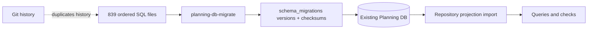
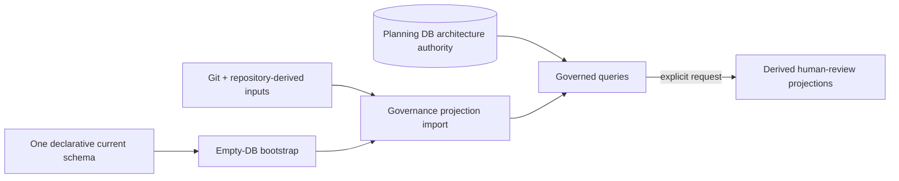

# Planning DB Current-Schema Hard-Cut Plan

## Think-First Analysis

### Problem Summary

Planning DB has 839 ordered SQL files, 209,308 SQL lines, a migration runner,
and an applied-version/checksum ledger even though its repository-owned
projections are reconstructible and it has no database compatibility contract.
Later SQL files also preserve intermediate feature, design, status, and evidence
mutations.

### Root Cause

The repository reused a long-lived product-database migration model for a
disposable current-state projection. Schema evolution, delivery history, and
architecture-state correction became one mechanism. Git and canonical inputs
therefore stopped being the sole reconstruction boundary.

### Constraints And Invariants

- ADR-0061 keeps Planning DB authority limited to architecture and
  mechanization; GitHub owns task lifecycle.
- ADR-0063 requires one current declarative schema for empty-database bootstrap
  and an in-place import that preserves DB-authored authority.
- Git remains history, review, and bootstrap authority for repository-owned
  projections; Planning DB owns DB-authored architecture and mechanization.
- `ImportPlanningGovernanceQueryStore` is reused for Git-owned projections.
  Derived publication is available only through the explicitly requested
  `PublishPlanningDbDerivedProjections` rail.
- No product runtime migration or adapter surface may change.
- No compatibility alias, backup/restore path, second snapshot, stub, or debt
  entry may be introduced.

### Options Considered

1. Keep schema-only migrations and remove only data migrations.
2. Squash all SQL into a baseline migration and retain the ledger.
3. Keep the current database and reconcile it against a schema diff tool.
4. Bootstrap an empty Planning DB from one current schema and refresh
   repository projections in place.

No external schema library is required. PostgreSQL and the existing Node `pg`
client already provide transactional schema application; adding a framework
would create a second lifecycle owner.

### Selected Option And Rationale

Option 4. It matches the actual lifecycle: an empty Planning DB is initialized,
not upgraded. The current SQL schema owns structure, repository import owns
derived facts, Planning DB owns operated architecture state, and Git owns
repository history.

### Rejected Alternatives

- Options 1 and 2 retain migration identity and compatibility state.
- Option 3 adds drift/reconciliation complexity for state that is safe and
  required to reconstruct.

## Current State



The current path makes every intermediate SQL transition and its identity a
precondition for current truth.

## Target State And Rationale



One responsibility has one owner:

- structure: current schema;
- derived projections: import;
- operated architecture/mechanization state: Planning DB command/query rails;
- optional human-review projections: explicit publication;
- history: Git.

## Fowler Opportunity Matrix

| scenario                           | opportunity                                | Fowler pattern                                        | DDD owner                                | command/query rail                    | implementation surfaces             | unit or package test                 | architecture test                         | user-flow test                         | out of scope                               |
| ---------------------------------- | ------------------------------------------ | ----------------------------------------------------- | ---------------------------------------- | ------------------------------------- | ----------------------------------- | ------------------------------------ | ----------------------------------------- | -------------------------------------- | ------------------------------------------ |
| Bootstrap an empty Planning DB     | Duplicate semantics / hidden authority     | Replace historical ledger with canonical schema owner | Planning / Governance query-store import | `ImportPlanningGovernanceQueryStore`  | current schema, bootstrap, importer | schema application tests             | migration-artifact fitness guard          | real PostgreSQL bootstrap/import/query | product runtime databases                  |
| Refresh repository projections     | Hidden compatibility authority             | Transactional projection refresh                      | Planning / Governance query-store import | `ImportPlanningGovernanceQueryStore`  | import and query-store scripts      | repeated import and rollback tests   | DB-authored authority preservation        | real PostgreSQL repeated import        | rolling upgrades and cross-schema transfer |
| Publish derived review surfaces    | Documentation drift                        | Projection / single source of truth                   | PlanningDbDerivedProjectionPublication   | `PublishPlanningDbDerivedProjections` | explicit export command             | deterministic publication tests      | integral snapshot recurrence guard        | operator-requested publication         | routine refresh and closeout               |
| Prevent migration-state recurrence | Test-only confidence / duplicate semantics | Fitness function                                      | PlanningDbCurrentSchemaPolicy            | `EnforcePlanningDbCurrentSchema`      | validation routing and policy tests | negative migration-artifact fixtures | repository-wide Planning DB boundary scan | closeout/pre-push flow                 | app/adapter runtime migrations             |

## Pre-Implementation Brief

- **Mode:** Full. The slice creates the current-schema artifact and changes a
  repository operational boundary.
- **Scope:** Planning DB schema/bootstrap/import/export/validation plus active
  docs and generated governance references.
- **Expected outcome:** no Planning DB migration concept remains; an empty
  database is bootstrapped deterministically and routine imports preserve
  DB-authored authority.
- **Risks:** missing a final schema object, retaining stale migration source
  references, allowing archived documents to act as current rail authority, or
  committing a partial import.
- **Mitigations:** produce the schema from the verified current database, compare
  object inventories, exclude archived and superseded documents from current
  rail discovery, apply transactionally, add a recurrence guard, and run two
  real-DB import cycles with DB-owned sentinels.
- **Out of scope:** product runtime databases, adapters, contracts, frontend,
  API behavior, and compatibility.
- **Libraries evaluated:** none adopted; PostgreSQL and `pg` are sufficient.
- **Command/query impact:** reuse `ImportPlanningGovernanceQueryStore`; retire
  the integral snapshot restore/export rails; retain explicit derived
  publication under `PublishPlanningDbDerivedProjections`; retire
  `EnforcePlanningDbSchemaOnlyMigrations`; register
  `EnforcePlanningDbCurrentSchema` before implementation.

## Delivery Slices And Microcommits

1. Decision: ADR, plan, diagrams, issue/epic correction.
2. Mechanization: record the current-schema design and rail before code.
3. Red: tests reject migration artifacts and require empty-database schema apply.
4. Schema: add the single current schema and bootstrap owner.
5. Import: route import/query/operate through current-schema readiness.
6. Hard cut: delete migrations, ledger runner, commands, and compatibility tests.
7. Consumers: update closeout, validation, generated-doc policy, and active docs.
8. Evidence: real PostgreSQL repeated import with DB-owned sentinels,
   governance refresh, and full gates.

Every commit must have a focused green test or be an intentional red-test
commit whose expected failure is recorded before the following green commit.

## Feature Mechanization

```feature-mechanization
version: 1
featureId: PLANNING-DB-CURRENT-SCHEMA-HARD-CUT-20260808
mechanizationStatus: implemented
noHumanDecisionsRemaining: true
implementationPlan: docs/planning/proposals/mandatory/governance-and-docs/planning-db-current-schema-hard-cut-plan-20260808.md
componentGuides:
  - docs/adr/ADR-0063-planning-db-current-schema-rebuild.md
  - docs/architecture/command-query-rail-governance.md
  - docs/architecture/fowler-opportunity-planning-governance.md
userStories:
  - As a governance operator, I bootstrap an empty Planning DB from current truth without replaying history.
  - As a reviewer, I can prove no migration ledger or compatibility path remains.
governingSources:
  - AGENTS.md
  - docs/planning/status/governance-document-rule-inventory.md
  - docs/guides/ai-work-protocol.md
  - docs/adr/ADR-0061-github-mvp-task-authority-and-planning-db-architecture-boundary.md
  - docs/adr/ADR-0063-planning-db-current-schema-rebuild.md
  - docs/architecture/command-query-rail-governance.md
  - docs/architecture/fowler-opportunity-planning-governance.md
  - docs/planning/state/planning-control-tower.md
allowedImplementationSurfaces:
  - docs/adr/adr-0055-planning-db-canonical-operational-source.md
  - docs/adr/ADR-0063-planning-db-current-schema-rebuild.md
  - docs/adr/index.md
  - docs/adr/adr-catalog.md
  - docs/adr/adr-implementation-status.md
  - docs/.manifest.json
  - docs/architecture/components/ci-governance/**
  - docs/architecture/components/web/frontend-command-query-rail-inventory.md
  - docs/architecture/components/web/graph/canvas-workbench-command-query-catalog.md
  - docs/generated-docs-policy.json
  - docs/guides/**
  - docs/runbooks/**
  - docs/planning/archive/proposals/**
  - docs/planning/proposals/mandatory/governance-and-docs/planning-db-current-schema-hard-cut-plan-20260808.md
  - docs/planning/proposals/mandatory/**
  - docs/planning/status/**
  - docs/**/index.md
  - package.json
  - traceability.manifest.json
  - scripts/planning-db*.cjs
  - scripts/planning-db/**
  - scripts/planning-db-operate-tests/**
  - scripts/planning-db-query-tests/**
  - scripts/governance-db*.cjs
  - scripts/governance-refresh*.cjs
  - scripts/generate-*.cjs
  - scripts/local-validation-plan.cjs
  - scripts/pr-closeout*.cjs
  - scripts/verify-*.cjs
  - scripts/check-generated-docs-policy*.cjs
  - scripts/check-feature-mechanization*.cjs
  - tools/planning-db/**
  - tools/ci/planning-review-canon.test.mjs
  - tools/ci/check-pr-size.mjs
  - tools/ci/check-pr-size.test.mjs
  - tools/ci/emit-scope.test.mjs
  - tools/ci/emit-test-matrix.test.mjs
  - tools/ci/sync-docs-status-policy.test.mjs
  - tools/ci/workflow-scope-classification.test.mjs
  - tools/ci/workflow-pattern-parity.test.mjs
  - tools/ci/policy/workflow-scope.json
  - apps/web/src/app/views/canvas/CanvasSourceImportLiveProof.architecture.test.ts
  - .github/actions/**
  - .github/workflows/**
forbiddenImplementationSurfaces:
  - infra/db/migrations/**
  - packages/@dvt/adapter-postgres/**
  - packages/@dvt/contracts/**
  - packages/@dvt/engine/**
commandQueryRails:
  - name: PublishPlanningDbDerivedProjections
    type: command
    status: implemented
    dddOwner: PlanningDbDerivedProjectionPublication
  - name: EnforcePlanningDbCurrentSchema
    type: query
    status: implemented
    dddOwner: PlanningDbCurrentSchemaPolicy
domainObjects:
  - name: PlanningDbDerivedProjectionPublication
    type: application service
    owner: Planning DB
  - name: PlanningDbCurrentSchemaPolicy
    type: policy
    owner: Architecture / CI
fowlerSignals:
  - migration history duplicates Git history
  - applied migration state is hidden compatibility authority
  - delivery-state SQL competes with current canonical inputs
architectureGuards:
  - node --test scripts/planning-db-schema.test.cjs
  - node --test scripts/planning-db-current-schema-policy.test.cjs
  - pnpm docs:feature-mechanization:implementation
cypressFlows:
  - N/A - repository governance database surface
completionGate:
  - node --test scripts/planning-db-schema.test.cjs scripts/planning-db-current-schema-policy.test.cjs scripts/planning-db-import.test.cjs
  - pnpm test:planning:db:integration
  - pnpm governance:refresh
  - pnpm verify:prepush
redGreenCycles:
  - id: current-schema-bootstrap
    redTest: node --test scripts/planning-db-schema.test.cjs
    expectedFailure: Planning DB has no single empty-database current-schema bootstrap owner.
    patchSurfaces:
      - tools/planning-db/schema.sql
      - scripts/planning-db-schema.cjs
      - scripts/planning-db-schema.test.cjs
    greenTest: node --test scripts/planning-db-schema.test.cjs
  - id: obsolete-schema-artifact-recurrence-guard
    redTest: node --test scripts/planning-db-current-schema-policy.test.cjs
    expectedFailure: Obsolete ordered-schema directories, runners, commands, ledgers, or source references still exist.
    patchSurfaces:
      - scripts/planning-db-current-schema-policy.cjs
      - scripts/planning-db-current-schema-policy.test.cjs
      - package.json
    greenTest: node --test scripts/planning-db-current-schema-policy.test.cjs
  - id: bootstrap-import-integration
    redTest: node --test scripts/planning-db-content.integration.test.cjs
    expectedFailure: Import still applies migrations or replaces DB-authored authority.
    patchSurfaces:
      - scripts/planning-db-import.cjs
      - scripts/planning-db-content.integration.test.cjs
      - scripts/planning-db-query.cjs
      - scripts/planning-db-operate.cjs
    greenTest: node --test scripts/planning-db-content.integration.test.cjs
symbols:
  - name: applyCurrentPlanningDbSchema
    path: scripts/planning-db-schema.cjs
    dddOwner: Planning / Governance query-store import
    cqRails:
      - ImportPlanningGovernanceQueryStore
    fowlerSignals:
      - one current schema replaces ordered historical transitions
    architectureGuard: node --test scripts/planning-db-schema.test.cjs
    cypressCoverage: N/A
    unitTests:
      - scripts/planning-db-schema.test.cjs
  - name: assertNoPlanningDbMigrationArtifacts
    path: scripts/planning-db-current-schema-policy.cjs
    dddOwner: PlanningDbCurrentSchemaPolicy
    cqRails:
      - EnforcePlanningDbCurrentSchema
    fowlerSignals:
      - fitness function prevents migration-state recurrence
    architectureGuard: node --test scripts/planning-db-current-schema-policy.test.cjs
    cypressCoverage: N/A
    unitTests:
      - scripts/planning-db-current-schema-policy.test.cjs
  - name: findPlanningDbSnapshotAuthorityReferences
    path: scripts/planning-db-current-schema-policy.cjs
    dddOwner: PlanningDbCurrentSchemaPolicy
    cqRails:
      - EnforcePlanningDbCurrentSchema
    fowlerSignals:
      - fitness function prevents tracked snapshot authority from recurring
    architectureGuard: node --test scripts/planning-db-current-schema-policy.test.cjs
    cypressCoverage: N/A
    unitTests:
      - scripts/planning-db-current-schema-policy.test.cjs
  - name: assertNoPlanningDbSnapshotAuthorityReferences
    path: scripts/planning-db-current-schema-policy.cjs
    dddOwner: PlanningDbCurrentSchemaPolicy
    cqRails:
      - EnforcePlanningDbCurrentSchema
    fowlerSignals:
      - current sources cannot restore retired snapshot rails or routine export gates
    architectureGuard: node --test scripts/planning-db-current-schema-policy.test.cjs
    cypressCoverage: N/A
    unitTests:
      - scripts/planning-db-current-schema-policy.test.cjs
  - name: exportPlanningDerivedSurfaces
    path: scripts/planning-db-export.cjs
    dddOwner: PlanningDbDerivedProjectionPublication
    cqRails:
      - PublishPlanningDbDerivedProjections
    fowlerSignals:
      - derived publication remains explicit and never recreates an integral snapshot
    architectureGuard: node --test scripts/planning-db-export.test.cjs
    cypressCoverage: N/A
    unitTests:
      - scripts/planning-db-export.test.cjs
```

## Validation Plan

- feature-specific mechanization check before production code;
- focused red/green Node tests for schema and recurrence policy;
- existing Planning DB unit suite;
- real PostgreSQL repeated import/query and rollback cycles;
- explicit derived-publication unit tests without routine export execution;
- generated docs and governance refresh after structural deletion;
- documentation, lint, type, changed-file, and full pre-push gates.

## Completion Boundary

This slice is complete only when no active code, command, table, policy,
documentation, or current-state row treats Planning DB as migration-compatible.
Historical Git commits remain sufficient evidence; no compatibility artifact is
retained in the working tree.
