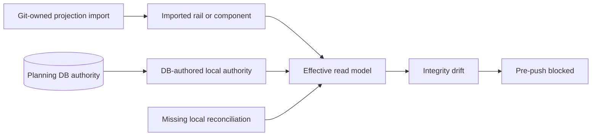
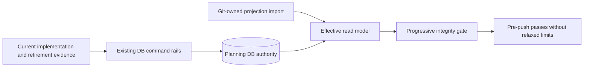

# Planning DB operational integrity reconciliation

## Problem and root cause

The operational integrity gate reports 39 `gap_rail` rows, one external GitHub
source as `missing_source_file`, and one incremental component without complete
authority or evidence. Planning DB remains authoritative for architecture and
mechanization. The repository import only projects Git-owned evidence into the
query store.

The current database contains the imported rail declarations but not the
DB-authored local reconciliation rows that existed before the current-schema
hard cut. The existing `RecordFeatureMechanizationRail` command cannot restore
terminal `closed`/`retired` rows because it always requires an implementation
reference. `ReviseGovernanceComponent` also cannot complete the semantic fields
of an imported component. Direct SQL, a larger progressive baseline, or editing
generated projections would bypass the authority boundary.

## Governing sources

- `AGENTS.md`
- `docs/planning/status/governance-document-rule-inventory.md`
- `docs/guides/ai-work-protocol.md`
- `docs/adr/adr-0055-planning-db-canonical-operational-source.md`
- `docs/adr/ADR-0063-planning-db-current-schema-rebuild.md`
- `docs/architecture/command-query-rail-governance.md`
- `docs/architecture/fowler-opportunity-planning-governance.md`
- `docs/planning/proposals/mandatory/governance-and-docs/planning-db-component-integrity-vocabulary-rail-plan-20260612.md`
- `docs/planning/proposals/mandatory/governance-and-docs/planning-db-current-schema-hard-cut-plan-20260808.md`

## Current state



## Target state and rationale



The smallest complete change extends existing commands instead of adding a new
write path:

- `RecordFeatureMechanizationRail` accepts zero implementation references only
  when `mechanizationStatus=closed` and `railStatus` is `retired` or
  `deprecated`; active rails still require real `path#symbol` evidence.
- `ReviseGovernanceComponent` can overlay responsibilities, non-goals,
  reasons-to-change, public API, invariants, transitions, and consumers for an
  imported component.
- The commands restore the already-proven implemented/retired rail decisions,
  repoint the external source to governed repository evidence, complete
  `SYS-API-APPLICATION-ERRORS`, and record its architecture authority.
- The progressive baseline remains unchanged and no SQL or generated projection
  is hand-edited.

## Options considered

1. Increase progressive tolerances. Rejected because it admits drift.
2. Replay retired SQL migrations. Rejected because ADR-0063 removed migration
   history and the command rails own current writes.
3. Edit imported Markdown/YAML until the query becomes green. Rejected because
   it would make projected files compete with DB authority.
4. Extend and reuse the two existing DB commands, then record exact current
   state. Selected because it preserves DB-first ownership and audited writes.

## Fowler and boundary analysis

| Signal                    | Applied response                                          | Proof                         |
| ------------------------- | --------------------------------------------------------- | ----------------------------- |
| Hidden authority          | Restore explicit DB-local rail/component records          | Planning DB integrity queries |
| Parallel model            | Keep Git inputs as projections, not current authority     | import and operate tests      |
| Special-case write path   | Reuse existing commands and planners                      | CLI parser/planner tests      |
| Permissive terminal state | Allow empty refs only for closed retired/deprecated rails | negative parser tests         |

## Command and query rails

- Command: `RecordFeatureMechanizationRail`
  - Context: Planning DB feature mechanization catalog
  - DDD object: `FeatureMechanizationLocalRail`
  - Port: `pnpm planning:db:operate feature-mechanization record`
  - Scope: repository-local audited writer with actor and compare-and-set revision
  - Negative proof: active rails without implementation refs remain rejected;
    inconsistent closed/active status pairs are rejected.
- Command: `ReviseGovernanceComponent`
  - Context: Planning DB component engineering
  - DDD object: `GovernanceComponentDefinition`
  - Port: `pnpm planning:db:operate component revise`
  - Scope: an existing design must authorize the exact component update.
  - Negative proof: empty revisions and unscoped component changes remain
    rejected.
- Queries: `ValidateRailVocabulary`, `CheckPlanningDbComponentIntegrity`, and
  `DetectGovernedSourceDrift` prove the resulting state.

## Feature mechanization

```feature-mechanization
version: 1
featureId: GOV-PLANNING-DB-INTEGRITY-RECONCILIATION-20260830
mechanizationStatus: implemented
noHumanDecisionsRemaining: true
implementationPlan: docs/planning/proposals/mandatory/governance-and-docs/planning-db-operational-integrity-reconciliation-plan-20260830.md
componentGuides:
  - docs/planning/proposals/mandatory/governance-and-docs/planning-db-component-integrity-vocabulary-rail-plan-20260612.md
userStories:
  - As a maintainer, I can restore operational Planning DB integrity through audited commands without replaying SQL migrations.
governingSources:
  - AGENTS.md
  - docs/planning/status/governance-document-rule-inventory.md
  - docs/architecture/command-query-rail-governance.md
  - docs/architecture/fowler-opportunity-planning-governance.md
  - docs/adr/ADR-0063-planning-db-current-schema-rebuild.md
allowedImplementationSurfaces:
  - docs/planning/proposals/mandatory/governance-and-docs/planning-db-operational-integrity-reconciliation-plan-20260830.md
  - docs/planning/closeouts/20260830-2748-planning-db-operational-integrity-closeout.md
  - docs/.manifest.json
  - docs/**/index.md
  - scripts/check-feature-mechanization.cjs
  - scripts/check-feature-mechanization.test.cjs
  - scripts/planning-db-operate.cjs
  - scripts/planning-db-operate-tests/component-create.test.cjs
  - scripts/planning-db-operate-tests/feature-mechanization.test.cjs
forbiddenImplementationSurfaces:
  - tools/planning-db/schema.sql
  - packages/**
  - apps/**
  - specs/**
commandQueryRails:
  - name: RecordFeatureMechanizationRail
    type: command
    dddOwner: FeatureMechanizationLocalRail
  - name: ReviseGovernanceComponent
    type: command
    dddOwner: GovernanceComponentDefinition
domainObjects:
  - name: FeatureMechanizationLocalRail
    type: entity
    owner: Planning DB feature mechanization catalog
  - name: GovernanceComponentDefinition
    type: entity
    owner: Planning DB component engineering
fowlerSignals:
  - Hidden authority is restored through audited DB commands.
  - Parallel Git state is kept projection-only.
architectureGuards:
  - node --test scripts/planning-db-operate.test.cjs scripts/planning-db-integrity-check.test.cjs
  - pnpm docs:feature-mechanization:implementation -- --feature GOV-PLANNING-DB-INTEGRITY-RECONCILIATION-20260830
cypressFlows:
  - N/A - repository-local Planning DB governance commands
completionGate:
  - node --test scripts/planning-db-operate.test.cjs scripts/planning-db-integrity-check.test.cjs
  - pnpm planning:db:integrity:check
  - pnpm governance:refresh
  - pnpm verify:prepush
redGreenCycles:
  - id: terminal-feature-rail-record
    redTest: node --test scripts/planning-db-operate.test.cjs
    expectedFailure: A retired closed rail cannot be recorded without a fake implementation reference.
    patchSurfaces:
      - scripts/planning-db-operate.cjs
      - scripts/planning-db-operate-tests/feature-mechanization.test.cjs
    greenTest: node --test scripts/planning-db-operate.test.cjs
  - id: imported-component-semantic-revision
    redTest: node --test scripts/planning-db-operate.test.cjs
    expectedFailure: ReviseGovernanceComponent cannot complete imported semantic metadata.
    patchSurfaces:
      - scripts/planning-db-operate.cjs
      - scripts/planning-db-operate-tests/component-create.test.cjs
    greenTest: node --test scripts/planning-db-operate.test.cjs
  - id: terminal-feature-manifest-symbol-validation
    redTest: node --test scripts/check-feature-mechanization.test.cjs
    expectedFailure: A closed retired rail is rejected unless it declares a fake implementation symbol.
    patchSurfaces:
      - scripts/check-feature-mechanization.cjs
      - scripts/check-feature-mechanization.test.cjs
    greenTest: node --test scripts/check-feature-mechanization.test.cjs
symbols:
  - name: validateFeatureMechanizationRecordCommand
    path: scripts/planning-db-operate.cjs
    dddOwner: FeatureMechanizationLocalRail
    cqRails: [RecordFeatureMechanizationRail]
    fowlerSignals: [Fail-closed terminal-state validation]
    architectureGuard: node --test scripts/planning-db-operate.test.cjs
    cypressCoverage: N/A - CLI command validation
    unitTests:
      - scripts/planning-db-operate-tests/feature-mechanization.test.cjs
  - name: validateComponentReviseCommand
    path: scripts/planning-db-operate.cjs
    dddOwner: GovernanceComponentDefinition
    cqRails: [ReviseGovernanceComponent]
    fowlerSignals: [Explicit DB-owned semantic overlay]
    architectureGuard: node --test scripts/planning-db-operate.test.cjs
    cypressCoverage: N/A - CLI command validation
    unitTests:
      - scripts/planning-db-operate-tests/component-create.test.cjs
  - name: validateSymbols
    path: scripts/check-feature-mechanization.cjs
    dddOwner: FeatureMechanizationLocalRail
    cqRails: [RecordFeatureMechanizationRail]
    fowlerSignals: [State-specific invariant validation]
    architectureGuard: node --test scripts/check-feature-mechanization.test.cjs
    cypressCoverage: N/A - governance manifest validation
    unitTests:
      - scripts/check-feature-mechanization.test.cjs
```

## Validation and completion

- Focused red/green command parser and planner tests.
- Feature-specific mechanization validation before implementation.
- Real DB command execution followed by `rail-vocabulary`,
  `component-integrity`, and `source-drift` queries.
- `pnpm governance:refresh` and `pnpm verify:prepush` before integration.
- No baseline increase, SQL edit, stub, compatibility alias, or bypass.
