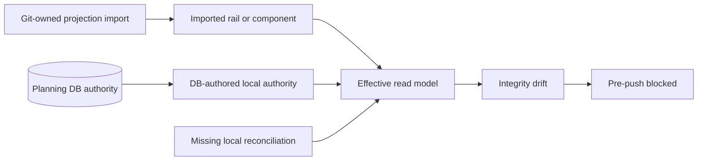
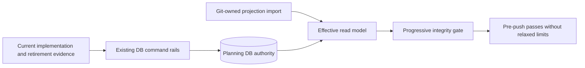
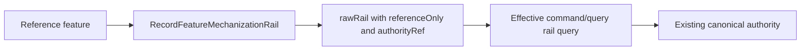
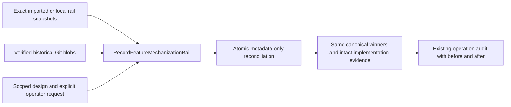
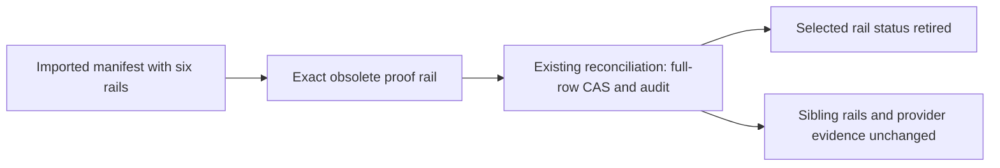

# Planning DB operational integrity reconciliation

## Problem and root cause

The operational integrity gate reports 39 `gap_rail` rows, one external GitHub
source as `missing_source_file`, and one incremental component without complete
authority or evidence. Planning DB remains authoritative for architecture and
mechanization. The repository import only projects Git-owned evidence into the
query store.

The current database contains the imported rail declarations but not the
DB-authored local reconciliation rows that existed before the current-schema
hard cut. The existing `RecordFeatureMechanizationRail` command cannot restore
terminal `closed`/`retired` rows because it always requires an implementation
reference. `ReviseGovernanceComponent` also cannot complete the semantic fields
of an imported component. Direct SQL, a larger progressive baseline, or editing
generated projections would bypass the authority boundary.

## Governing sources

- `AGENTS.md`
- `docs/planning/status/governance-document-rule-inventory.md`
- `docs/guides/ai-work-protocol.md`
- `docs/adr/adr-0055-planning-db-canonical-operational-source.md`
- `docs/adr/ADR-0063-planning-db-current-schema-rebuild.md`
- `docs/architecture/command-query-rail-governance.md`
- `docs/architecture/fowler-opportunity-planning-governance.md`
- `docs/planning/proposals/mandatory/governance-and-docs/planning-db-component-integrity-vocabulary-rail-plan-20260612.md`
- `docs/planning/proposals/mandatory/governance-and-docs/planning-db-current-schema-hard-cut-plan-20260808.md`

## Current state


```mermaid
flowchart LR
  Import[Git-owned projection import] --> Imported[Imported rail or component]
  Database[(Planning DB authority)] --> Local[DB-authored local authority]
  Imported --> Effective[Effective read model]
  Local --> Effective
  Missing[Missing local reconciliation] --> Effective
  Effective --> Gap[Integrity drift]
  Gap --> Prepush[Pre-push blocked]
```

## Target state and rationale


```mermaid
flowchart LR
  Evidence[Current implementation and retirement evidence] --> Commands[Existing DB command rails]
  Commands --> Database[(Planning DB authority)]
  Import[Git-owned projection import] --> Effective[Effective read model]
  Database --> Effective
  Effective --> Integrity[Progressive integrity gate]
  Integrity --> Prepush[Pre-push passes without relaxed limits]
```

The smallest complete change extends existing commands instead of adding a new
write path:

- `RecordFeatureMechanizationRail` accepts zero implementation references only
  when `mechanizationStatus=closed` and `railStatus` is `retired` or
  `deprecated`; active rails still require real `path#symbol` evidence.
- `ReviseGovernanceComponent` can overlay responsibilities, non-goals,
  reasons-to-change, public API, invariants, transitions, and consumers for an
  imported component.
- The commands restore the already-proven implemented/retired rail decisions,
  repoint the external source to governed repository evidence, complete
  `SYS-API-APPLICATION-ERRORS`, and record its architecture authority.
- The progressive baseline remains unchanged and no SQL or generated projection
  is hand-edited.

## Options considered

1. Increase progressive tolerances. Rejected because it admits drift.
2. Replay retired SQL migrations. Rejected because ADR-0063 removed migration
   history and the command rails own current writes.
3. Edit imported Markdown/YAML until the query becomes green. Rejected because
   it would make projected files compete with DB authority.
4. Extend and reuse the two existing DB commands, then record exact current
   state. Selected because it preserves DB-first ownership and audited writes.

## Fowler and boundary analysis

| Signal                    | Applied response                                          | Proof                         |
| ------------------------- | --------------------------------------------------------- | ----------------------------- |
| Hidden authority          | Restore explicit DB-local rail/component records          | Planning DB integrity queries |
| Parallel model            | Keep Git inputs as projections, not current authority     | import and operate tests      |
| Special-case write path   | Reuse existing commands and planners                      | CLI parser/planner tests      |
| Permissive terminal state | Allow empty refs only for closed retired/deprecated rails | negative parser tests         |

## Command and query rails

- Command: `RecordFeatureMechanizationRail`
  - Context: Planning DB feature mechanization catalog
  - DDD object: `FeatureMechanizationLocalRail`
  - Port: `pnpm planning:db:operate feature-mechanization record`
  - Scope: repository-local audited writer with actor and compare-and-set revision
  - Negative proof: active rails without implementation refs remain rejected;
    terminal rails with active mechanization or implementation refs remain
    rejected. A completed `closed` feature may retain an active rail only with
    real `path#symbol` evidence.
- Command: `ReviseGovernanceComponent`
  - Context: Planning DB component engineering
  - DDD object: `GovernanceComponentDefinition`
  - Port: `pnpm planning:db:operate component revise`
  - Scope: an existing design must authorize the exact component update.
  - Negative proof: empty revisions and unscoped component changes remain
    rejected.
- Queries: `ValidateRailVocabulary`, `CheckPlanningDbComponentIntegrity`, and
  `DetectGovernedSourceDrift` prove the resulting state.

## #3130 referenced rail preservation


```mermaid
flowchart LR
  Reference[Reference feature]
  Command[RecordFeatureMechanizationRail]
  RawRail[rawRail with referenceOnly and authorityRef]
  Query[Effective command/query rail query]
  Authority[Existing canonical authority]

  Reference --> Command --> RawRail --> Query --> Authority
```

`RecordFeatureMechanizationRail` must accept `--reference-only true` and a
non-empty `--authority-ref` only as a pair. Omitting both keeps the normal active
declaration path; providing either field alone or explicitly setting
`--reference-only false` fails closed. The planner persists both values in
`rawRail`. Before writing, the command resolves `authorityRef` against the
active canonical rail with the same source, type, and normalized name; missing,
mismatched, retired, reference-only, and gap authorities fail closed. The
effective feature-mechanization state becomes `referenced` without changing the
rail's declared `status`. The existing effective query keeps the referenced
feature as evidence while excluding it from canonical
candidate counts and ranking, so the referenced feature cannot become parallel
authority or displace the existing authority. Recording the reused rail as an
active local declaration is rejected because local declarations take precedence
in authority selection.

Negative proof must cover each incomplete or invalid pair and prove that no
reference metadata is silently dropped. The positive proof must show the pair
in `rawRail` and `rawManifest`, effective state `referenced`, and unchanged
canonical authority selection.

## Lossless catalog reconciliation (#3549)

Git-owned source retirement must not erase DB-owned architecture. The existing
`RecordFeatureMechanizationRail` command accepts an explicit
`--catalog-reconciliation <json-file>` mode, separate from ordinary declaration.
This is an operator-requested repair, never a query, startup, refresh or import
side effect. Its owner remains the Planning DB feature mechanization catalog.


```mermaid
flowchart LR
  Before[Exact imported or local rail snapshots] --> Command[RecordFeatureMechanizationRail]
  Git[Verified historical Git blobs] --> Command
  Design[Scoped design and explicit operator request] --> Command
  Command --> Transaction[Atomic metadata-only reconciliation]
  Transaction --> Guard[Same canonical winners and intact implementation evidence]
  Guard --> Audit[Existing operation audit with before and after]
```

The request names its design, actor, idempotency key and exact changes. Each
change names the origin (`imported` or `local`), rail identity and SHA-256 of
the complete expected stored row, including source/hash and local revision.
PostgreSQL computes that fingerprint with the existing `sha256_text` and
`stable_jsonb_text` functions over `to_jsonb(row)`. Native JSONB snapshots back
the audit; JSON parsed through JavaScript is not a lossless fingerprint or
write format for arbitrary JSONB numbers. Updates touch only requested columns
and use native JSONB patches for selected reference attributes.
There is no wildcard target, implicit selection or fallback to another origin.
An approved/reviewed design must admit the physical tables being changed.

For a retired repository source, the command verifies an ancestor commit,
regular-file blob and matching original path in Git, and its absence at the
current candidate. It records the immutable repository URL and content hash.
It must not recreate the file, rebuild the DB or invent a replacement authority.
Reference-only reconciliation is explicit, names the existing canonical
authority and updates only the selected rail/reference metadata; it cannot
reconstruct or homogenize symbols, cycles, owners, states or tests. Dependent
`authorityRef` changes must be selected explicitly or the transaction rejects.

The bounded writer may update provenance in `command_query_rails` as well as
`feature_mechanization_local_rails`. It preserves identity and ranking timestamps;
local revisions advance. This exception does not authorize general edits to
imported projections. The existing `feature_mechanization_local_operations`
audit records the exact before/after, request and source proof. No schema change
or new command rail is introduced.

Imported rows have no revision: their guard is the complete stored-row hash.
The legacy non-null audit revision slot uses zero for these records, with origin
and the actual optimistic-concurrency guard explicit in the payload; zero does
not assert that an imported row has a revision. Local revisions remain real.

One transaction excludes concurrent catalog writes, checks every expected row
before writing, resolves references and verifies that the canonical winner for
every rail remains unchanged. Any missing row, stale snapshot, invalid Git proof,
unscoped design, dangling authority, changed winner or failed audit rolls back
the whole request. Identical retries return the committed receipt; reusing an
idempotency key with another request rejects. Product databases are out of scope.

| Scenario                                      | Opportunity / pattern                                  | DDD / rail                                                     | Allowed surfaces                                                                                    | Required proof                                                                                                                                   |
| --------------------------------------------- | ------------------------------------------------------ | -------------------------------------------------------------- | --------------------------------------------------------------------------------------------------- | ------------------------------------------------------------------------------------------------------------------------------------------------ |
| Retired source and duplicate-reference repair | Lossless metadata patch; explicit transaction boundary | Feature mechanization catalog / RecordFeatureMechanizationRail | Existing CLI adapter; focused catalog policy and PostgreSQL writer; focused tests and local routing | Full-row CAS, real Git provenance, unchanged symbols/cycles/winner, atomic rollback, idempotency and dependency rejection; real PostgreSQL proof |

Replaying ordinary record commands was rejected because they rebuild symbol
metadata. Deleting rows, raising integrity tolerances or importing the database
was rejected because each can hide or replace the authority being preserved.

### Exact imported rail retirement

The approved #3021 closeout exposes a narrower lifecycle case: one imported
proof command is obsolete, but its manifest also describes five live product
rails. Ordinary closed-record replacement clears all symbols and invalidates
those siblings. Evidence retirement alone does not retire the command.


```mermaid
flowchart LR
  Shared[Imported manifest with six rails] --> Selected[Exact obsolete proof rail]
  Selected --> CAS[Existing reconciliation: full-row CAS and audit]
  CAS --> Retired[Selected rail status retired]
  CAS --> Preserved[Sibling rails and provider evidence unchanged]
```

`RecordFeatureMechanizationRail --catalog-reconciliation` may therefore accept
an explicit, exclusive `railRetirement` change for one imported row. It requires
a reason, exact row identity and native snapshot hash. The selected row and
its uniquely matching manifest rail become `retired`; the shared manifest's
mechanization status, sibling rails, symbols, cycles, gates, ownership,
provenance and ranking timestamps remain unchanged. Deleting exclusive
implementation evidence remains a separate exact evidence-retirement operation.
An empty or ambiguous rail, an already terminal rail, a local-origin target,
mixed patch modes or stale snapshot must reject. Existing transaction, scope,
canonical-winner, dependency, idempotency and audit checks remain mandatory.

The implementation uses native JSONB patches, not a JavaScript replacement of
the complete manifest. Required evidence includes an imported fixture with five
active siblings, unchanged unselected metadata including large numeric values,
atomic rollback on rejection, idempotent replay and actual PostgreSQL execution.
No schema, new command, product contract or general imported-state editor is
introduced. Historical UI proof is not claimed to be current provider E2E proof.

## Feature mechanization

```feature-mechanization
version: 1
featureId: GOV-PLANNING-DB-INTEGRITY-RECONCILIATION-20260830
mechanizationStatus: implemented
noHumanDecisionsRemaining: true
implementationPlan: docs/planning/proposals/mandatory/governance-and-docs/planning-db-operational-integrity-reconciliation-plan-20260830.md
componentGuides:
  - docs/planning/proposals/mandatory/governance-and-docs/planning-db-component-integrity-vocabulary-rail-plan-20260612.md
userStories:
  - As a maintainer, I can restore operational Planning DB integrity through audited commands without replaying SQL migrations.
governingSources:
  - AGENTS.md
  - docs/planning/status/governance-document-rule-inventory.md
  - docs/architecture/command-query-rail-governance.md
  - docs/architecture/fowler-opportunity-planning-governance.md
  - docs/adr/ADR-0063-planning-db-current-schema-rebuild.md
allowedImplementationSurfaces:
  - docs/planning/proposals/mandatory/governance-and-docs/planning-db-operational-integrity-reconciliation-plan-20260830.md
  - docs/planning/closeouts/20260830-2748-planning-db-operational-integrity-closeout.md
  - docs/.manifest.json
  - docs/**/index.md
  - scripts/check-feature-mechanization.cjs
  - scripts/check-feature-mechanization.test.cjs
  - scripts/planning-db-operate.cjs
  - scripts/planning-db-operate-tests/component-create.test.cjs
  - scripts/planning-db-operate-tests/feature-mechanization.test.cjs
forbiddenImplementationSurfaces:
  - tools/planning-db/schema.sql
  - packages/**
  - apps/**
  - specs/**
commandQueryRails:
  - name: RecordFeatureMechanizationRail
    type: command
    dddOwner: FeatureMechanizationLocalRail
  - name: ReviseGovernanceComponent
    type: command
    dddOwner: GovernanceComponentDefinition
domainObjects:
  - name: FeatureMechanizationLocalRail
    type: entity
    owner: Planning DB feature mechanization catalog
  - name: GovernanceComponentDefinition
    type: entity
    owner: Planning DB component engineering
fowlerSignals:
  - Hidden authority is restored through audited DB commands.
  - Parallel Git state is kept projection-only.
architectureGuards:
  - node --test scripts/planning-db-operate.test.cjs scripts/planning-db-integrity-check.test.cjs
  - pnpm docs:feature-mechanization:implementation -- --feature GOV-PLANNING-DB-INTEGRITY-RECONCILIATION-20260830
cypressFlows:
  - N/A - repository-local Planning DB governance commands
completionGate:
  - node --test scripts/planning-db-operate.test.cjs scripts/planning-db-integrity-check.test.cjs
  - pnpm planning:db:integrity:check
  - pnpm governance:refresh
  - pnpm verify:prepush
redGreenCycles:
  - id: terminal-feature-rail-record
    redTest: node --test scripts/planning-db-operate.test.cjs
    expectedFailure: A retired closed rail cannot be recorded without a fake implementation reference.
    patchSurfaces:
      - scripts/planning-db-operate.cjs
      - scripts/planning-db-operate-tests/feature-mechanization.test.cjs
    greenTest: node --test scripts/planning-db-operate.test.cjs
  - id: imported-component-semantic-revision
    redTest: node --test scripts/planning-db-operate.test.cjs
    expectedFailure: ReviseGovernanceComponent cannot complete imported semantic metadata.
    patchSurfaces:
      - scripts/planning-db-operate.cjs
      - scripts/planning-db-operate-tests/component-create.test.cjs
    greenTest: node --test scripts/planning-db-operate.test.cjs
  - id: terminal-feature-manifest-symbol-validation
    redTest: node --test scripts/check-feature-mechanization.test.cjs
    expectedFailure: A closed retired rail is rejected unless it declares a fake implementation symbol.
    patchSurfaces:
      - scripts/check-feature-mechanization.cjs
      - scripts/check-feature-mechanization.test.cjs
    greenTest: node --test scripts/check-feature-mechanization.test.cjs
  - id: closed-feature-active-rail-compatibility
    redTest: node --test scripts/check-feature-mechanization.test.cjs scripts/planning-db-operate.test.cjs
    expectedFailure: A completed closed feature with an active evidenced rail is rejected, while the static validator permits the same active rail to lose all symbols.
    patchSurfaces:
      - scripts/check-feature-mechanization.cjs
      - scripts/check-feature-mechanization.test.cjs
      - scripts/planning-db-operate.cjs
      - scripts/planning-db-operate-tests/feature-mechanization.test.cjs
    greenTest: node --test scripts/check-feature-mechanization.test.cjs scripts/planning-db-operate.test.cjs
  - id: reference-only-feature-rail-authority-preservation
    redTest: node --test scripts/planning-db-operate.test.cjs scripts/planning-db-schema.test.cjs
    expectedFailure: RecordFeatureMechanizationRail drops referenceOnly and authorityRef, accepts an invalid partial pair, or exposes the reference as active authority.
    patchSurfaces:
      - scripts/planning-db-operate.cjs
      - scripts/planning-db-operate-tests/feature-mechanization.test.cjs
    greenTest: node --test scripts/planning-db-operate.test.cjs scripts/planning-db-schema.test.cjs
symbols:
  - name: validateFeatureMechanizationRecordCommand
    path: scripts/planning-db-operate.cjs
    dddOwner: FeatureMechanizationLocalRail
    cqRails: [RecordFeatureMechanizationRail]
    fowlerSignals: [Fail-closed terminal-state validation]
    architectureGuard: node --test scripts/planning-db-operate.test.cjs
    cypressCoverage: N/A - CLI command validation
    unitTests:
      - scripts/planning-db-operate-tests/feature-mechanization.test.cjs
  - name: assertFeatureMechanizationReferenceAuthority
    path: scripts/planning-db-operate.cjs
    dddOwner: FeatureMechanizationLocalRail
    cqRails: [RecordFeatureMechanizationRail]
    fowlerSignals: [Fail-closed canonical authority resolution]
    architectureGuard: node --test scripts/planning-db-operate.test.cjs
    cypressCoverage: N/A - Planning DB command boundary
    unitTests:
      - scripts/planning-db-operate-tests/feature-mechanization.test.cjs
  - name: validateComponentReviseCommand
    path: scripts/planning-db-operate.cjs
    dddOwner: GovernanceComponentDefinition
    cqRails: [ReviseGovernanceComponent]
    fowlerSignals: [Explicit DB-owned semantic overlay]
    architectureGuard: node --test scripts/planning-db-operate.test.cjs
    cypressCoverage: N/A - CLI command validation
    unitTests:
      - scripts/planning-db-operate-tests/component-create.test.cjs
  - name: validateSymbols
    path: scripts/check-feature-mechanization.cjs
    dddOwner: FeatureMechanizationLocalRail
    cqRails: [RecordFeatureMechanizationRail]
    fowlerSignals: [State-specific invariant validation]
    architectureGuard: node --test scripts/check-feature-mechanization.test.cjs
    cypressCoverage: N/A - governance manifest validation
    unitTests:
      - scripts/check-feature-mechanization.test.cjs
```

## Validation and completion

- Focused red/green command parser and planner tests.
- Feature-specific mechanization validation before implementation.
- Real DB command execution followed by `rail-vocabulary`,
  `component-integrity`, and `source-drift` queries.
- `pnpm governance:refresh` and `pnpm verify:prepush` before integration.
- No baseline increase, SQL edit, stub, compatibility alias, or bypass.
