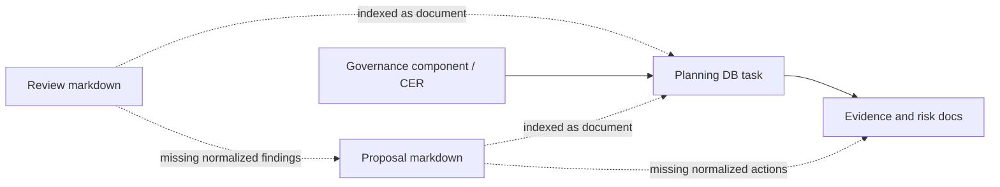
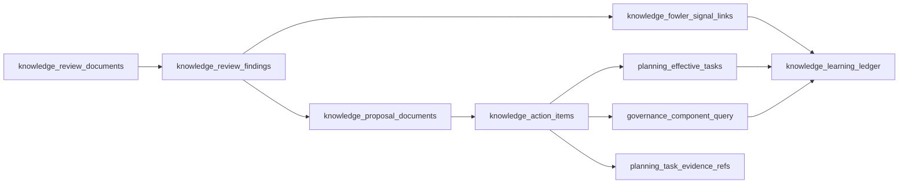

# Planning Knowledge Rail DB-First Plan

> **For agentic workers:** REQUIRED SUB-SKILL: Use
> `superpowers:executing-plans` or the repository AI work protocol to execute
> this plan task-by-task. Steps use checkbox syntax for tracking.

**Goal:** create a DB-first knowledge rail for reviews, findings, proposals,
Fowler signals, action items, and learnings without turning the planning task
rail into a generic knowledge store.

**Architecture:** planning remains the operational work rail, governance remains
the source and component inventory rail, and knowledge becomes the relational
interpretation rail. Version 1 uses `planning_query_store.knowledge_*` tables
and views for compatibility, while the plan explicitly preserves a future
`knowledge_core` schema split once the read model is stable.

**Tech Stack:** local Postgres planning query store, Markdown governance sources,
small CommonJS modules, repository docs sync, governance refresh, and existing
planning DB validation gates.

---

## Governing Sources

- `AGENTS.md`
- `docs/planning/status/governance-document-rule-inventory.md`
- `docs/guides/ai-work-protocol.md`
- `docs/planning/state/planning-control-tower.md`
- `docs/planning/status/db-surface-inventory.md`
- `docs/adr/adr-0055-planning-db-canonical-operational-source.md`
- `docs/architecture/command-query-rail-governance.md`
- `docs/architecture/fowler-opportunity-planning-governance.md`
- `docs/planning/proposals/portfolio-map-20260403.md`
- `docs/planning/reviews/review-status-board.md`

## Feature Mechanization

This manifest governs the proposal plus the first DB-backed implementation
slice. It does not declare the full knowledge rail complete.

```feature-mechanization
version: 1
featureId: PLANNING-KNOWLEDGE-RAIL-DB-DOCUMENT-RELATIONS-20260513
mechanizationStatus: implemented
noHumanDecisionsRemaining: true
implementationPlan: docs/planning/proposals/mandatory/governance-and-docs/planning-knowledge-rail-db-first-plan-20260513.md
componentGuides:
  - docs/planning/proposals/mandatory/governance-and-docs/planning-knowledge-rail-db-first-plan-20260513.md
userStories:
  - docs/planning/proposals/mandatory/governance-and-docs/planning-knowledge-rail-db-first-plan-20260513.md
governingSources:
  - AGENTS.md
  - docs/planning/status/governance-document-rule-inventory.md
  - docs/guides/ai-work-protocol.md
  - docs/planning/state/planning-control-tower.md
  - docs/planning/status/db-surface-inventory.md
  - docs/adr/adr-0055-planning-db-canonical-operational-source.md
  - docs/architecture/command-query-rail-governance.md
  - docs/architecture/fowler-opportunity-planning-governance.md
allowedImplementationSurfaces:
  - docs/planning/proposals/mandatory/governance-and-docs/planning-knowledge-rail-db-first-plan-20260513.md
  - docs/planning/proposals/portfolio-map-20260403.md
  - docs/.manifest.json
  - docs/**/index.md
  - docs/planning/status/**
  - package.json
  - scripts/planning-db-import.cjs
  - scripts/planning-db-query.cjs
  - scripts/planning-db-migrate.test.cjs
  - scripts/planning-db-query.test.cjs
  - tools/planning-db/knowledge/**
  - tools/planning-db/migrations/032_planning_knowledge_document_relations.sql
forbiddenImplementationSurfaces:
  - apps/**
  - packages/**
  - specs/contracts/**
commandQueryRails:
  - name: PublishPlanningKnowledgeRailProposal
    type: command
    dddOwner: Governance proposal publication
  - name: ImportPlanningKnowledgeSnapshot
    type: command
    dddOwner: Planning knowledge local operations
  - name: ReadPlanningKnowledgeDocuments
    type: query
    dddOwner: Planning knowledge local operations
  - name: ReadPlanningKnowledgeActions
    type: query
    dddOwner: Planning knowledge local operations
  - name: ReadMandatoryProposalBindingGaps
    type: query
    dddOwner: Planning knowledge local operations
domainObjects:
  - name: Planning knowledge rail proposal
    type: governance proposal
    owner: Architecture / Docs / Delivery
  - name: Review action read model
    type: planned read model
    owner: Planning knowledge local operations
  - name: Fowler learning ledger
    type: planned read model
    owner: Planning knowledge local operations
fowlerSignals:
  - Documentation Drift from review findings that stay only in Markdown
  - Duplicate Semantics between reviews, proposals, and planning tasks
  - Hidden Authority when action items are implied but not queryable
  - Responsibility Overload in large planning DB scripts
architectureGuards:
  - pnpm docs:feature-mechanization:implementation
  - pnpm lint:md:changed
  - pnpm verify:prepush
cypressFlows:
  - N/A - planning knowledge proposal only
completionGate:
  - pnpm docs:sync
  - pnpm governance:refresh
  - pnpm docs:feature-mechanization:implementation
  - pnpm verify:prepush
redGreenCycles:
  - id: proposal-surface-manifest
    redTest: pnpm docs:feature-mechanization:implementation
    expectedFailure: the new planning knowledge proposal is outside allowedImplementationSurfaces until this manifest declares the documentation slice.
    patchSurfaces:
      - docs/planning/proposals/mandatory/governance-and-docs/planning-knowledge-rail-db-first-plan-20260513.md
      - docs/planning/proposals/portfolio-map-20260403.md
    greenTest: pnpm docs:feature-mechanization:implementation
symbols:
  - name: PlanningKnowledgeRailDbFirstPlan
    path: docs/planning/proposals/mandatory/governance-and-docs/planning-knowledge-rail-db-first-plan-20260513.md
    dddOwner: Governance proposal publication
    cqRails:
      - PublishPlanningKnowledgeRailProposal
      - ImportPlanningKnowledgeSnapshot
      - ReadPlanningKnowledgeDocuments
      - ReadPlanningKnowledgeActions
      - ReadMandatoryProposalBindingGaps
    fowlerSignals:
      - Documentation Drift from review findings that stay only in Markdown
      - Responsibility Overload in large planning DB scripts
    architectureGuard: pnpm docs:feature-mechanization:implementation
    cypressCoverage: N/A
    unitTests:
      - node --test tools/planning-db/knowledge/documentSnapshot.test.cjs scripts/planning-db-migrate.test.cjs scripts/planning-db-query.test.cjs
      - pnpm test:planning:db
  - { name: buildKnowledgeDocumentSnapshot, path: scripts/planning-db-import.cjs, dddOwner: Knowledge import snapshot, cqRails: [ImportPlanningKnowledgeSnapshot], fowlerSignals: [Documentation Drift], architectureGuard: pnpm docs:feature-mechanization:implementation, cypressCoverage: N/A, unitTests: [pnpm test:planning:db] }
  - { name: insertKnowledgeSnapshot, path: scripts/planning-db-import.cjs, dddOwner: Knowledge import snapshot, cqRails: [ImportPlanningKnowledgeSnapshot], fowlerSignals: [Documentation Drift], architectureGuard: pnpm docs:feature-mechanization:implementation, cypressCoverage: N/A, unitTests: [pnpm test:planning:db] }
  - { name: listTrackedKnowledgeDocuments, path: scripts/planning-db-import.cjs, dddOwner: Knowledge import snapshot, cqRails: [ImportPlanningKnowledgeSnapshot], fowlerSignals: [Documentation Drift], architectureGuard: pnpm docs:feature-mechanization:implementation, cypressCoverage: N/A, unitTests: [pnpm test:planning:db] }
  - { name: buildKnowledgeActionRows, path: scripts/planning-db-query.cjs, dddOwner: Knowledge action read model, cqRails: [ReadPlanningKnowledgeActions], fowlerSignals: [Hidden Authority], architectureGuard: pnpm docs:feature-mechanization:implementation, cypressCoverage: N/A, unitTests: [pnpm test:planning:db] }
  - { name: buildKnowledgeDocumentRows, path: scripts/planning-db-query.cjs, dddOwner: Knowledge document read model, cqRails: [ReadPlanningKnowledgeDocuments], fowlerSignals: [Documentation Drift], architectureGuard: pnpm docs:feature-mechanization:implementation, cypressCoverage: N/A, unitTests: [pnpm test:planning:db] }
  - { name: buildMandatoryProposalGapRows, path: scripts/planning-db-query.cjs, dddOwner: Mandatory proposal gap read model, cqRails: [ReadMandatoryProposalBindingGaps], fowlerSignals: [Hidden Authority], architectureGuard: pnpm docs:feature-mechanization:implementation, cypressCoverage: N/A, unitTests: [pnpm test:planning:db] }
  - { name: knowledgeActionSelect, path: scripts/planning-db-query.cjs, dddOwner: Knowledge action read model, cqRails: [ReadPlanningKnowledgeActions], fowlerSignals: [Hidden Authority], architectureGuard: pnpm docs:feature-mechanization:implementation, cypressCoverage: N/A, unitTests: [pnpm test:planning:db] }
  - { name: knowledgeDocumentSelect, path: scripts/planning-db-query.cjs, dddOwner: Knowledge document read model, cqRails: [ReadPlanningKnowledgeDocuments], fowlerSignals: [Documentation Drift], architectureGuard: pnpm docs:feature-mechanization:implementation, cypressCoverage: N/A, unitTests: [pnpm test:planning:db] }
  - { name: mandatoryProposalGapSelect, path: scripts/planning-db-query.cjs, dddOwner: Mandatory proposal gap read model, cqRails: [ReadMandatoryProposalBindingGaps], fowlerSignals: [Hidden Authority], architectureGuard: pnpm docs:feature-mechanization:implementation, cypressCoverage: N/A, unitTests: [pnpm test:planning:db] }
  - { name: readKnowledgeActionRows, path: scripts/planning-db-query.cjs, dddOwner: Knowledge action read model, cqRails: [ReadPlanningKnowledgeActions], fowlerSignals: [Hidden Authority], architectureGuard: pnpm docs:feature-mechanization:implementation, cypressCoverage: N/A, unitTests: [pnpm test:planning:db] }
  - { name: readKnowledgeDocumentRows, path: scripts/planning-db-query.cjs, dddOwner: Knowledge document read model, cqRails: [ReadPlanningKnowledgeDocuments], fowlerSignals: [Documentation Drift], architectureGuard: pnpm docs:feature-mechanization:implementation, cypressCoverage: N/A, unitTests: [pnpm test:planning:db] }
  - { name: readMandatoryProposalGapRows, path: scripts/planning-db-query.cjs, dddOwner: Mandatory proposal gap read model, cqRails: [ReadMandatoryProposalBindingGaps], fowlerSignals: [Hidden Authority], architectureGuard: pnpm docs:feature-mechanization:implementation, cypressCoverage: N/A, unitTests: [pnpm test:planning:db] }
  - { name: documentLinks, path: tools/planning-db/knowledge/documentLinks.cjs, dddOwner: Knowledge document relation projection, cqRails: [ImportPlanningKnowledgeSnapshot], fowlerSignals: [Duplicate Semantics], architectureGuard: pnpm docs:feature-mechanization:implementation, cypressCoverage: N/A, unitTests: [tools/planning-db/knowledge/documentSnapshot.test.cjs] }
  - { name: normalizeRelativeDocumentPath, path: tools/planning-db/knowledge/documentLinks.cjs, dddOwner: Knowledge document relation projection, cqRails: [ImportPlanningKnowledgeSnapshot], fowlerSignals: [Duplicate Semantics], architectureGuard: pnpm docs:feature-mechanization:implementation, cypressCoverage: N/A, unitTests: [tools/planning-db/knowledge/documentSnapshot.test.cjs] }
  - { name: actionRows, path: tools/planning-db/knowledge/documentSnapshot.cjs, dddOwner: Knowledge action projection, cqRails: [ImportPlanningKnowledgeSnapshot], fowlerSignals: [Hidden Authority], architectureGuard: pnpm docs:feature-mechanization:implementation, cypressCoverage: N/A, unitTests: [tools/planning-db/knowledge/documentSnapshot.test.cjs] }
  - { name: actionStatusFromLine, path: tools/planning-db/knowledge/documentSnapshot.cjs, dddOwner: Knowledge action projection, cqRails: [ImportPlanningKnowledgeSnapshot], fowlerSignals: [Hidden Authority], architectureGuard: pnpm docs:feature-mechanization:implementation, cypressCoverage: N/A, unitTests: [tools/planning-db/knowledge/documentSnapshot.test.cjs] }
  - { name: buildKnowledgeSnapshotFromDocuments, path: tools/planning-db/knowledge/documentSnapshot.cjs, dddOwner: Knowledge import snapshot, cqRails: [ImportPlanningKnowledgeSnapshot], fowlerSignals: [Documentation Drift], architectureGuard: pnpm docs:feature-mechanization:implementation, cypressCoverage: N/A, unitTests: [tools/planning-db/knowledge/documentSnapshot.test.cjs] }
  - { name: documentTypeForPath, path: tools/planning-db/knowledge/documentSnapshot.cjs, dddOwner: Knowledge document projection, cqRails: [ImportPlanningKnowledgeSnapshot], fowlerSignals: [Documentation Drift], architectureGuard: pnpm docs:feature-mechanization:implementation, cypressCoverage: N/A, unitTests: [tools/planning-db/knowledge/documentSnapshot.test.cjs] }
  - { name: extractTaskIds, path: tools/planning-db/knowledge/documentSnapshot.cjs, dddOwner: Knowledge action projection, cqRails: [ImportPlanningKnowledgeSnapshot], fowlerSignals: [Hidden Authority], architectureGuard: pnpm docs:feature-mechanization:implementation, cypressCoverage: N/A, unitTests: [tools/planning-db/knowledge/documentSnapshot.test.cjs] }
  - { name: isKnowledgePath, path: tools/planning-db/knowledge/documentSnapshot.cjs, dddOwner: Knowledge document projection, cqRails: [ImportPlanningKnowledgeSnapshot], fowlerSignals: [Documentation Drift], architectureGuard: pnpm docs:feature-mechanization:implementation, cypressCoverage: N/A, unitTests: [tools/planning-db/knowledge/documentSnapshot.test.cjs] }
  - { name: sectionRows, path: tools/planning-db/knowledge/documentSnapshot.cjs, dddOwner: Knowledge document section projection, cqRails: [ImportPlanningKnowledgeSnapshot], fowlerSignals: [Documentation Drift], architectureGuard: pnpm docs:feature-mechanization:implementation, cypressCoverage: N/A, unitTests: [tools/planning-db/knowledge/documentSnapshot.test.cjs] }
  - { name: slugify, path: tools/planning-db/knowledge/documentSnapshot.cjs, dddOwner: Knowledge identity projection, cqRails: [ImportPlanningKnowledgeSnapshot], fowlerSignals: [Primitive Obsession], architectureGuard: pnpm docs:feature-mechanization:implementation, cypressCoverage: N/A, unitTests: [tools/planning-db/knowledge/documentSnapshot.test.cjs] }
  - { name: assert, path: tools/planning-db/knowledge/documentSnapshot.test.cjs, dddOwner: Knowledge extractor tests, cqRails: [ImportPlanningKnowledgeSnapshot], fowlerSignals: [Test-only confidence], architectureGuard: pnpm docs:feature-mechanization:implementation, cypressCoverage: N/A, unitTests: [tools/planning-db/knowledge/documentSnapshot.test.cjs] }
  - { name: test, path: tools/planning-db/knowledge/documentSnapshot.test.cjs, dddOwner: Knowledge extractor tests, cqRails: [ImportPlanningKnowledgeSnapshot], fowlerSignals: [Test-only confidence], architectureGuard: pnpm docs:feature-mechanization:implementation, cypressCoverage: N/A, unitTests: [tools/planning-db/knowledge/documentSnapshot.test.cjs] }
  - { name: cleanJson, path: tools/planning-db/knowledge/frontmatter.cjs, dddOwner: Knowledge source metadata parser, cqRails: [ImportPlanningKnowledgeSnapshot], fowlerSignals: [Primitive Obsession], architectureGuard: pnpm docs:feature-mechanization:implementation, cypressCoverage: N/A, unitTests: [tools/planning-db/knowledge/documentSnapshot.test.cjs] }
  - { name: normalizeText, path: tools/planning-db/knowledge/frontmatter.cjs, dddOwner: Knowledge source metadata parser, cqRails: [ImportPlanningKnowledgeSnapshot], fowlerSignals: [Primitive Obsession], architectureGuard: pnpm docs:feature-mechanization:implementation, cypressCoverage: N/A, unitTests: [tools/planning-db/knowledge/documentSnapshot.test.cjs] }
  - { name: parseFrontmatter, path: tools/planning-db/knowledge/frontmatter.cjs, dddOwner: Knowledge source metadata parser, cqRails: [ImportPlanningKnowledgeSnapshot], fowlerSignals: [Documentation Drift], architectureGuard: pnpm docs:feature-mechanization:implementation, cypressCoverage: N/A, unitTests: [tools/planning-db/knowledge/documentSnapshot.test.cjs] }
  - { name: parseLooseFrontmatter, path: tools/planning-db/knowledge/frontmatter.cjs, dddOwner: Knowledge source metadata parser, cqRails: [ImportPlanningKnowledgeSnapshot], fowlerSignals: [Documentation Drift], architectureGuard: pnpm docs:feature-mechanization:implementation, cypressCoverage: N/A, unitTests: [tools/planning-db/knowledge/documentSnapshot.test.cjs] }
  - { name: yaml, path: tools/planning-db/knowledge/frontmatter.cjs, dddOwner: Knowledge source metadata parser, cqRails: [ImportPlanningKnowledgeSnapshot], fowlerSignals: [Documentation Drift], architectureGuard: pnpm docs:feature-mechanization:implementation, cypressCoverage: N/A, unitTests: [tools/planning-db/knowledge/documentSnapshot.test.cjs] }
```

## Problem Summary

DVT already stores planning task state, task provenance, docs disposition,
governance files, governance components, component engineering records, and
feature-work references in the local planning DB. Reviews and proposals,
however, still behave mostly as indexed Markdown documents. That leaves a gap
between what the repository knows and what operators can query.

A review can produce many findings. A finding can produce several proposals. A
proposal can cover findings from several reviews. A proposal can produce action
items, and those action items may or may not map to planning tasks yet. The
current DB has pieces of this chain, but it does not expose the full
relationship:

```text
review -> finding -> proposal -> action item -> task -> evidence
```

The result is avoidable review drift. Operators can ask which tasks are open,
which components exist, and which docs contain task-like references, but they
cannot reliably ask which Fowler learning came from which review, which proposal
accepted it, which component it affects, and what evidence closed it.

## Current State



Current DB surfaces already available:

- `planning_effective_tasks`
- `doc_disposition_action_query`
- `doc_task_reference_query`
- `planning_task_gap_query`
- `governance_component_query`
- `governance_component_engineering_record_v2_query`
- `component_engineering_*_query`

The knowledge rail must extend those surfaces. It must not duplicate task
lifecycle state or component ownership.

## Target State



## Core Decisions

1. Knowledge is a separate bounded context from planning.
   - Planning owns work lifecycle: tasks, dependencies, claims, status events,
     and evidence refs.
   - Governance owns source inventory: documents, components, units,
     fingerprints, coverage, and remediation.
   - Knowledge owns interpretation: findings, proposals, actions, Fowler
     signals, and lessons learned.

2. Version 1 uses `planning_query_store.knowledge_*`.
   - This keeps migrations, import, checks, and local DB lifecycle aligned with
     ADR-0055.
   - Object names must carry the `knowledge_` prefix so the bounded context is
     visible in SQL and query code.
   - The plan records a future `knowledge_core` schema extraction after the read
     model proves stable.

3. Reviews and proposals are not the same object.
   - One review can produce many proposals.
   - One proposal can cover findings from many reviews.
   - The relationship must be represented through
     `knowledge_review_proposal_links`.

4. Knowledge does not create tasks automatically.
   - Missing task links become explicit gaps such as
     `review_action_without_task`.
   - Operators decide whether to create work through `pnpm planning:db:operate`.

5. New code must stay modular.
   - New scripts and modules target fewer than 200 lines.
   - Existing large scripts may only receive small routing glue.
   - Any module that approaches 200 lines must be split before the next feature
     is added.

## Command And Query Rail

<!-- markdownlint-disable MD060 -->

| Rail                               | Type    | Owning context                      | DDD object / read model           | Application port                                 | Adapter surface                  | Scope and authorization                                                                  | Negative tests                                                                               |
| ---------------------------------- | ------- | ----------------------------------- | --------------------------------- | ------------------------------------------------ | -------------------------------- | ---------------------------------------------------------------------------------------- | -------------------------------------------------------------------------------------------- |
| `ImportPlanningKnowledgeSnapshot`  | command | Planning knowledge local operations | knowledge import snapshot         | `pnpm planning:db:import -- --governance-only`   | `scripts/planning-db-import.cjs` | local repository operator only; no tenant or project data; writes only local planning DB | malformed source metadata, stale DB source hash, missing migration, duplicate document links |
| `ReadPlanningKnowledgeDocuments`   | query   | Planning knowledge local operations | knowledge document read model     | `pnpm planning:db:query knowledge-documents`     | `scripts/planning-db-query.cjs`  | local repository operator only; no tenant or project data; read-only local planning DB   | unknown query rejection, filter parameterization, document type filtering                    |
| `ReadPlanningKnowledgeActions`     | query   | Planning knowledge local operations | knowledge action item read model  | `pnpm planning:db:query knowledge-actions`       | `scripts/planning-db-query.cjs`  | local repository operator only; no tenant or project data; read-only local planning DB   | unknown query rejection, filter parameterization, action without task surfaced as gap        |
| `ReadMandatoryProposalBindingGaps` | query   | Planning knowledge local operations | mandatory proposal gap read model | `pnpm planning:db:query mandatory-proposal-gaps` | `scripts/planning-db-query.cjs`  | local repository operator only; no tenant or project data; read-only local planning DB   | mandatory proposal without action, mandatory action without task link                        |

<!-- markdownlint-enable MD060 -->

## Relational Model

| Object                             | Purpose                                                            | Key relationships                                                              |
| ---------------------------------- | ------------------------------------------------------------------ | ------------------------------------------------------------------------------ |
| `knowledge_review_documents`       | Review source documents imported from governed Markdown metadata   | one review has many findings and many proposal links                           |
| `knowledge_review_findings`        | Review findings that can become proposals, actions, or learnings   | many findings can map to many proposals, tasks, components, and Fowler signals |
| `knowledge_proposal_documents`     | Proposal source documents imported from governed Markdown metadata | one proposal can respond to many review findings                               |
| `knowledge_review_proposal_links`  | Many-to-many review/proposal relation                              | records `proposes`, `refines`, `validates`, `rejects`, or `supersedes`         |
| `knowledge_action_items`           | Actionable items derived from reviews, findings, or proposals      | links to tasks, components, evidence, risks, and gaps                          |
| `knowledge_action_task_links`      | Action item to planning task relation                              | records task coverage without owning task state                                |
| `knowledge_action_component_links` | Action item to governance component relation                       | records affected component without owning component identity                   |
| `knowledge_action_evidence_links`  | Action item to evidence relation                                   | records proof without owning evidence documents                                |
| `knowledge_fowler_signal_links`    | Fowler signal relation table                                       | links signal to finding, proposal, component, task, or evidence                |
| `knowledge_learning_ledger`        | Operator-facing learning read model                                | projects finding, decision, applied rule, task, evidence, and outcome          |

## File And Module Boundaries

The DB implementation must create small modules under
`tools/planning-db/knowledge/`:

| Module                         | Responsibility                                            | Line target |
| ------------------------------ | --------------------------------------------------------- | ----------- |
| `knowledgeImport.cjs`          | import orchestration only                                 | `< 200`     |
| `reviewDocumentProjection.cjs` | review/proposal document metadata projection              | `< 200`     |
| `reviewFindingProjection.cjs`  | finding and action extraction from governed source blocks | `< 200`     |
| `proposalProjection.cjs`       | review-proposal link normalization                        | `< 200`     |
| `fowlerSignalProjection.cjs`   | Fowler signal normalization                               | `< 200`     |
| `knowledgeQueries.cjs`         | DB read SQL for knowledge queries                         | `< 200`     |
| `knowledgeFormatters.cjs`      | CLI row formatting                                        | `< 200`     |

New script entrypoints must remain thin:

- `scripts/planning-knowledge-import.cjs`
- `scripts/planning-knowledge-query.cjs`

The first DB-backed slice intentionally reuses the existing
`planning:db:import` and `planning:db:query` rails instead of adding duplicate
entrypoints. The standalone `planning:knowledge:*` aliases remain a follow-up
only after the read-model names stabilize.

The following scripts may only receive minimal delegation glue:

- `scripts/planning-db-import.cjs`
- `scripts/planning-db-query.cjs`
- `scripts/planning-db-operate.cjs`

## Planned Package Scripts

```json
{
  "planning:knowledge:import": "node scripts/planning-knowledge-import.cjs",
  "planning:knowledge:query": "node scripts/planning-knowledge-query.cjs",
  "test:planning:knowledge": "node --test scripts/planning-knowledge-*.test.cjs tools/planning-db/knowledge/*.test.cjs"
}
```

## Fowler Planning Matrix

| Scenario                              | Opportunity          | Fowler pattern                  | DDD owner                        | Command/query rail                | Implementation surfaces                           | Unit or package test                | Architecture test                                 | User-flow test | Out of scope              |
| ------------------------------------- | -------------------- | ------------------------------- | -------------------------------- | --------------------------------- | ------------------------------------------------- | ----------------------------------- | ------------------------------------------------- | -------------- | ------------------------- |
| Query review actions by source review | Documentation drift  | Repository / Query Object       | Knowledge action item read model | `ReadReviewActions`               | `knowledge_*` DB views and knowledge query module | `planning-knowledge-query.test.cjs` | `planning-db-surface-inventory-check.test.cjs`    | not applicable | automatic task creation   |
| Link one review to many proposals     | Duplicate semantics  | Association Table               | Review-proposal link read model  | `ImportPlanningKnowledgeSnapshot` | migration and proposal projection module          | `proposalProjection.test.cjs`       | migration guard in `planning-db-migrate.test.cjs` | not applicable | AI extraction             |
| Expose Fowler learning by component   | Hidden authority     | Published Language / Read Model | Fowler learning ledger           | `ReadFowlerLearning`              | knowledge query and formatter modules             | `fowlerSignalProjection.test.cjs`   | CER query integration tests                       | not applicable | UI rendering              |
| Surface action without task as gap    | Test-only confidence | Fail-closed read model          | Knowledge action gap projection  | `ReadReviewActions`               | action item query views                           | `planning-knowledge-query.test.cjs` | docs disposition gap guard                        | not applicable | creating the missing task |

## Implementation Slices

### `PKR-1` Proposal And DB Surface Inventory

- Add this proposal.
- Link it from the proposal portfolio map.
- Inventory the current DB surfaces that the future knowledge rail must extend.
- Run `pnpm docs:sync`.
- Run `pnpm governance:refresh`.
- Run `pnpm verify:prepush`.

Acceptance criteria:

- the proposal is present in the mandatory governance-and-docs section;
- generated docs indexes are current;
- no source code, migration, package script, or DB behavior changes ship in this
  slice.

### `PKR-2` Migration And Normalized Read Model

- Add `tools/planning-db/migrations/032_planning_knowledge_document_relations.sql`.
- Create the first `knowledge_*` document, section, proposal, action, and link
  tables and query views under `planning_query_store`.
- Add migration tests for every table and view.
- Update `docs/planning/status/db-surface-inventory.md`.

Acceptance criteria:

- migration creates the first implemented `knowledge_*` document relation
  objects;
- `planning-db-migrate.test.cjs` proves the migration exists;
- `planning:db:migrate` applies cleanly on a local DB.

### `PKR-3` Import Modules And Standalone CLI

- Add import modules under `tools/planning-db/knowledge/`.
- Add thin import routing through `scripts/planning-db-import.cjs`; defer
  standalone `scripts/planning-knowledge-import.cjs` until query names settle.
- Import review/proposal metadata without adding task lifecycle writes.
- Preserve source hashes for idempotent stale checks.

Acceptance criteria:

- governed Markdown document references are imported as document links;
- each module remains under 200 lines;
- import tests prove duplicate links are deterministic.

### `PKR-4` Query Modules And Formatters

- Add query routing through `scripts/planning-db-query.cjs`; defer standalone
  `scripts/planning-knowledge-query.cjs` until the Fowler learning ledger is
  normalized.
- Add `knowledge-documents`, `knowledge-actions`, and
  `mandatory-proposal-gaps` query handlers.
- Add table output for operator use and JSON output if existing query patterns
  require it.

Acceptance criteria:

- `pnpm planning:db:query knowledge-documents --type proposal --limit 5` works;
- `pnpm planning:db:query knowledge-actions --limit 5` works;
- `pnpm planning:db:query mandatory-proposal-gaps --limit 5` works;
- mandatory proposal actions without tasks appear as
  `mandatory_proposal_action_without_task`.

### `PKR-5` CER And Read-Model Integration

- Link the knowledge rail to component engineering record v2 without making CER
  own knowledge state.
- Add related review actions and Fowler learning counts to CER gaps or related
  documents.

Acceptance criteria:

- CER can show related review actions for a component;
- CER can show open knowledge gaps without duplicating action item state;
- `pnpm planning:db:query cer --schema-version v2` remains backward compatible.

## Validation Baseline

Proposal slice:

```bash
pnpm docs:sync
pnpm lint:md:changed
pnpm governance:refresh
pnpm verify:prepush
```

Required DB implementation scenarios:

- one review produces multiple proposals;
- one proposal links to multiple reviews;
- one finding links to multiple components and one task;
- one action item without a task appears as `review_action_without_task`;
- one Fowler signal links to component, finding, proposal, and evidence.

DB implementation slices:

```bash
node --test scripts/planning-db-migrate.test.cjs
node --test scripts/planning-db-import.test.cjs
node --test scripts/planning-db-query.test.cjs
node --test scripts/planning-db-surface-inventory-check.test.cjs
pnpm planning:knowledge:import
pnpm planning:knowledge:query review-actions --limit 5
pnpm planning:knowledge:query fowler-learning --limit 5
pnpm governance:refresh
pnpm verify:prepush
```

## Out Of Scope

- automatic task creation;
- embeddings, semantic search, or AI extraction;
- product runtime storage;
- browser UI rendering;
- moving to a separate `knowledge_core` schema in the first DB slice;
- editing current large planning scripts beyond tiny delegation glue.

## Completion Rule

The Planning Knowledge Rail is not complete until an operator can ask:

```bash
pnpm planning:knowledge:query fowler-learning --component SYS-ENGINE-ROOT
```

and receive related reviews, proposals, Fowler signals, action items, tasks,
evidence, and open gaps from DB-owned read models.
