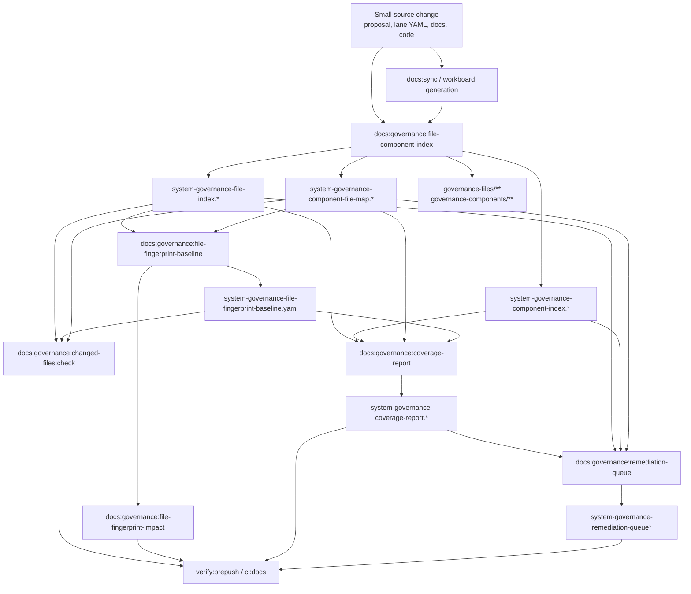
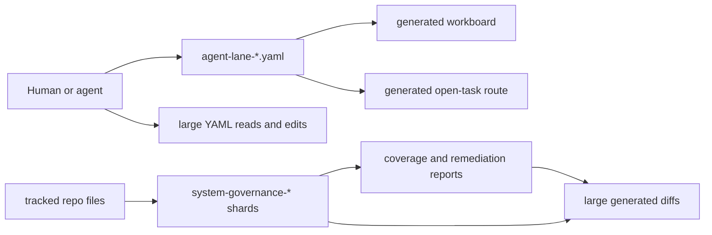
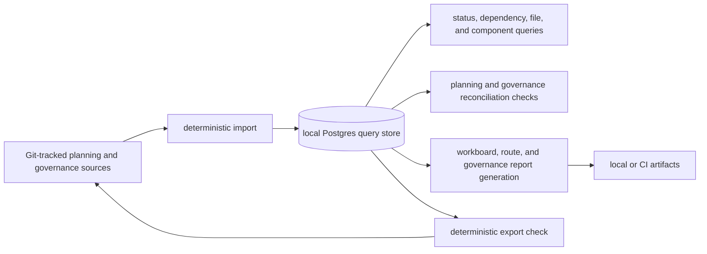

# Planning And Governance Query Store Plan

## Summary

The lane YAML registry remains the canonical planning state, but the current
monolithic lane files and generated `system-governance-*` shards are no longer
ergonomic for repeated human and agent work.

This plan introduces a local Postgres-backed planning and governance query store
as a derived read model. The database is persistent on disk for local speed, but
it is rebuildable from Git-tracked planning and governance sources and must not
become the only copy of repository truth in this slice.

## Decision

Adopt Postgres as a local and CI-capable derived query store for planning state
and file-governance state.

Git remains the canonical review and authority boundary:

- lane state, proposals, reviews, closeouts, roadmap docs, evidence, and risk
  records remain tracked in the repository;
- governance rules, file indexes, component maps, fingerprints, coverage
  reports, and remediation queues remain tracked or generated according to their
  existing governance policy;
- Postgres imports those sources into normalized tables for queries, status
  reconciliation, dashboards, generated planning outputs, and governance
  coverage analysis;
- export and drift checks prove that the database state matches the repository
  state before a branch can be called ready;
- the Docker volume is local persistence, not canonical state.

GitHub Issues and Projects remain optional collaboration mirrors. They must not
be the first canonical task store because they introduce network dependency,
mutable state outside PR review, API/rate-limit behavior, and weaker offline
determinism for agents.

MongoDB remains rejected for this slice. A document database would match the raw
YAML shape, but GOV-S3's current correctness problem is not document storage; it
is deterministic comparison across Git-tracked sources, imported rows, hashes,
counts, and composite identities. Postgres keeps those checks explicit with SQL
constraints, joins, transactions, and `jsonb` columns that preserve the full
source document without making the database canonical.

## System Governance Scope

This proposal explicitly includes the `system-governance-*` family under the
derived Postgres query-store path.

The target is not only lane/task state. The query store should also import,
query, drift-check, and eventually regenerate these governance read models:

- `docs/planning/status/system-governance-file-index.files.yaml`
- `docs/planning/status/system-governance-file-index-20260501.md`
- `docs/planning/status/system-governance-component-index.components.yaml`
- `docs/planning/status/system-governance-component-index-20260501.md`
- `docs/planning/status/system-governance-component-file-map.components.yaml`
- `docs/planning/status/system-governance-component-file-map-20260503.md`
- `docs/planning/status/system-governance-file-fingerprint-baseline.yaml`
- `docs/planning/status/system-governance-file-fingerprint-impact-20260501.md`
- `docs/planning/status/system-governance-coverage-report.coverage.yaml`
- `docs/planning/status/system-governance-coverage-report-20260502.md`
- `docs/planning/status/system-governance-remediation-queue.queue.yaml`
- `docs/planning/status/system-governance-remediation-queue-20260502.md`
- `docs/planning/status/governance-files/**`
- `docs/planning/status/governance-components/**`

In other words, GOV-S3 moves the bulky governance read side toward:

```text
Git-tracked governance sources and generator rules
  -> deterministic import
  -> Postgres governance read model
  -> query/check/report/export
  -> deterministic generated governance files while compatibility remains needed
```

The canonical authority still remains the repository. The database makes the
read side queryable and cheaper for agents; it does not hide governance changes
outside PR review.

## Current System Governance Workflow

The current `system-governance-*` workflow is deterministic, but it is also the
fan-out mechanism that makes a small source change touch many tracked files.
The workflow below is the one this plan must preserve before deriving it into
Postgres.

The canonical component view for this existing workflow is
[`System Governance Generation Workflow Component`](../../../../architecture/components/ci-governance/system-governance-generation-workflow-component.md).
GOV-S3-W0 records the current workflow there before any Docker, migration, or
Postgres-backed exporter work starts.



The direct generators and checks are:

| Stage                | Command                                          | Primary tracked outputs                                                                                                                     |
| -------------------- | ------------------------------------------------ | ------------------------------------------------------------------------------------------------------------------------------------------- |
| File/component index | `pnpm docs:governance:file-component-index`      | `system-governance-file-index.*`, `system-governance-component-index.*`, `system-governance-component-file-map.*`, governance shard folders |
| Fingerprint baseline | `pnpm docs:governance:file-fingerprint-baseline` | `system-governance-file-fingerprint-baseline.yaml`                                                                                          |
| Fingerprint impact   | `pnpm docs:governance:file-fingerprint-impact`   | `system-governance-file-fingerprint-impact-20260501.md`                                                                                     |
| Coverage report      | `pnpm docs:governance:coverage-report`           | `system-governance-coverage-report.*`                                                                                                       |
| Remediation queue    | `pnpm docs:governance:remediation-queue`         | `system-governance-remediation-queue*`                                                                                                      |
| Readiness gate       | `pnpm verify:prepush` and `pnpm ci:docs`         | Fails if generated governance output is stale or changed files lack governance coverage                                                     |

In the current branch, one planning/proposal change fans out into the same
surface visible in the editor:

- proposal sources under `docs/planning/proposals/mandatory/governance-and-docs/`;
- lane sources under `docs/planning/state/agent-lane-*.yaml`;
- `system-governance-file-index.*`;
- `system-governance-component-index.*`;
- `system-governance-component-file-map.*`;
- `system-governance-coverage-report.*`;
- `system-governance-file-fingerprint-baseline.yaml`;
- governance shard files under `governance-files/**` and
  `governance-components/**`.

That fan-out is the problem to derive. GOV-S3 should first reproduce this
workflow as an explicit import/query/export pipeline before changing what is
tracked or how much of it reviewers must inspect.

## Problem

The current planning model is correct but increasingly expensive to operate:

- `agent-lane-a.yaml` and `agent-lane-e.yaml` already exceed three thousand
  lines each;
- cross-lane status reconciliation requires broad edits to large files;
- generated governance file indexes, component maps, fingerprints, coverage
  reports, and remediation queues add review noise when small source changes
  update large generated surfaces;
- agents must repeatedly parse large YAML documents to answer narrow questions;
- local gates can fail for scope declarations rather than for the substantive
  planning decision.

The root issue is not that YAML is invalid as a source format. The root issue is
that flat files are serving two roles at once:

1. canonical reviewable planning and governance state;
2. query, dashboard, reconciliation, fingerprint, coverage, and
   generated-output backend.

Those roles should be separated.

## Current State



The lane YAML registry and governance shards are reviewable and deterministic,
but they are poor query engines and poor concurrency surfaces.

## Target State



The database exists to make planning state cheap to inspect. It does not weaken
the repository authority model.

## Scope

In scope:

- define the planning query store boundary and canonicality rules;
- define the governance query-store boundary for `system-governance-*` read
  models;
- add a Docker Compose posture for local Postgres with a persistent ignored
  data directory;
- define migrations, import, query, export, and drift-check commands;
- normalize lane task data into tables suitable for status reconciliation;
- normalize file governance, component ownership, fingerprints, coverage, and
  remediation data into queryable tables;
- keep generated planning views derived from tracked inputs;
- keep generated governance views derived from tracked inputs and generated
  policy;
- allow CI to build the query store from a clean checkout.

Out of scope:

- making Postgres the canonical planning authority in this slice;
- replacing Git review with GitHub Issues, Projects, or a mutable database UI;
- changing product runtime Postgres adapters under `packages/@dvt/adapter-*`;
- changing planner, engine, API, or web product behavior;
- committing live database files or binary snapshots as planning truth.

## Canonicality Rules

- Git-tracked planning sources remain authoritative.
- The Postgres query store is a derived read model.
- The local Docker volume may persist data for speed, but it must be
  discardable and reconstructable.
- Migrations are tracked in Git and are the only schema authority.
- Imports must be deterministic for the same Git tree.
- Exports must use stable ordering, stable serialization, and explicit hashes.
- Drift checks must fail when imported/exported state disagrees with Git.
- Generated workboards, routes, dashboards, SQLite/JSONL summaries, and query
  artifacts are derived outputs.
- Generated `system-governance-*` reports may move behind the same derived
  query-store path only after parity proves the Postgres output matches the
  existing file generators.
- Any future decision to promote Postgres to canonical state requires a
  separate ADR, backup/restore runbook, CI seed/restore proof, and PR-review
  replacement model.

## Proposed Local Shape

```text
infra/planning-db/docker-compose.yml
scripts/planning-db-run.cjs
scripts/planning-db-run.test.cjs
scripts/planning-db-migrate.cjs
scripts/planning-db-migrate.test.cjs
scripts/planning-db-import.cjs
scripts/planning-db-import.test.cjs
scripts/planning-db-query.cjs
scripts/planning-db-query.test.cjs
tools/planning-db/migrations/
tools/planning-db/import-planning-state.mjs
tools/planning-db/export-planning-state.mjs
tools/planning-db/check-planning-state-drift.mjs
tools/planning-db/query-planning-state.mjs
tools/planning-db/import-governance-state.mjs
tools/planning-db/export-governance-state.mjs
tools/planning-db/check-governance-state-drift.mjs
tools/planning-db/query-governance-state.mjs
C:\dvt\planning-db\postgres-data
```

`C:\dvt\planning-db\postgres-data` is the shared machine-local volume for all
agents and worktrees on the same Windows PC. It is outside the repository and
must remain untracked. The data directory is a persistent cache, not a canonical
planning source. Operators may still override the data location with
`DVT_PLANNING_DB_DATA_DIR` when they intentionally need a different local disk.

## Proposed Commands

Implemented through the local Docker, content-import, and W4 drift-check
slices:

```bash
pnpm planning:db:up
pnpm planning:db:down
pnpm planning:db:logs
pnpm planning:db:ps
pnpm planning:db:env
pnpm planning:db:health
pnpm planning:db:migrate
pnpm planning:db:import
pnpm planning:db:query
pnpm planning:db:check
pnpm governance:db:check
pnpm test:planning:db
pnpm test:planning:db:integration
```

Planned for later export and parity slices:

```bash
pnpm planning:db:export
pnpm governance:db:import
pnpm governance:db:query
pnpm governance:db:export
```

The closeout baseline for the local Docker substrate slice includes:

```bash
pnpm test:planning:db
pnpm test:planning:db:integration
pnpm planning:db:migrate
pnpm planning:db:import
pnpm planning:db:query
pnpm planning:db:check
pnpm governance:db:check
pnpm docs:feature-mechanization --feature GOV-S3-PLANNING-STATE-QUERY-STORE
pnpm docs:feature-mechanization:implementation
pnpm verify:prepush
```

Once import/export and drift commands exist, implementation PRs should also
include:

```bash
pnpm planning:db:check
pnpm governance:db:check
pnpm docs:workboard:generate
pnpm docs:feature-mechanization:implementation
pnpm verify:prepush
```

## Data Model

The first schema should cover two derived read-model families.

### Planning tables

| Table                    | W2 status   | Purpose                                                                |
| ------------------------ | ----------- | ---------------------------------------------------------------------- |
| `planning_sources`       | implemented | Git path, content hash, source type, byte size, and local import time  |
| `planning_lanes`         | implemented | Lane id, source path/hash, title, owner, status, goal, and raw YAML    |
| `planning_tasks`         | implemented | Task id, lane, status, priority, objective, target, evidence, raw YAML |
| `planning_dependencies`  | planned     | Explicit task-to-task dependency edges parsed out of task dependencies |
| `planning_evidence_refs` | planned     | Evidence, closeout, PR, commit, and doc references per task as rows    |
| `planning_status_events` | planned     | Derived status history when imports detect changed state               |
| `planning_artifacts`     | planned     | Generated output path, source hash, and artifact hash                  |

### Governance tables

| Table                              | Status      | Purpose                                                     |
| ---------------------------------- | ----------- | ----------------------------------------------------------- |
| `governance_sources`               | implemented | Source path, source type, content hash, byte size           |
| `governance_file_shards`           | implemented | File-index shard id, path, count, and upstream content hash |
| `governance_files`                 | implemented | Tracked path, owning unit, component, root, drift flags     |
| `governance_components`            | implemented | Component/source units and ownership metadata               |
| `governance_component_file_shards` | implemented | Component shard provenance, file counts, and content hashes |
| `governance_component_files`       | implemented | File-to-component membership and shard provenance           |
| `governance_fingerprints`          | implemented | File identity, content hash, governance hash, and state     |
| `governance_coverage`              | implemented | Governed, ungoverned, drift, legacy, and summary counters   |
| `governance_remediation`           | implemented | Remediation queue items, priority, owner, and source cause  |
| `governance_generated_assets`      | planned     | Generated report path, source hash, and artifact hash       |

The W2 schema is intentionally content-first. It stores the source hash for each
imported YAML file and keeps `raw_lane`, `raw_task`, `raw_shard`, and `raw_file`
JSONB columns so no current lane or governance field is thrown away while the
first typed query columns stabilize. Typed columns are added only for fields that
already drive repeated operational questions: lane/status/priority/progress,
task objective/target/evidence, file ownership, component unit, governance
state, drift, legacy, and content hashes.

The W3 governance-content slice extends the same posture to component indexes,
component-file shards, fingerprint baselines, coverage reports, and remediation
queues. The import still treats Git-tracked YAML as authority and stores raw
JSONB next to typed query columns so the database can double-check counts and
hashes without hiding any source content outside PR review.

These tables are enough to answer high-value operational questions without
introducing a large platform:

- which tasks are in `review` without accepted evidence;
- which blockers reference tasks already marked `done`;
- which cross-lane dependencies are stale;
- which generated artifacts are stale for the imported state;
- which lane summaries disagree with task-level weighted progress.
- which files moved components or ownership;
- which component shards changed because of real source edits;
- which governance fingerprints changed, disappeared, or appeared;
- which drift/remediation rows are real root-cause items versus generated
  churn;
- which source file caused a generated governance report to move.

## Command And Query Rail Impact

This plan defines planning-tooling rails. It does not change product runtime
behavior.

| Rail                               | Type    | Bounded context       | DDD object                   | Adapter surface      |
| ---------------------------------- | ------- | --------------------- | ---------------------------- | -------------------- |
| `ImportPlanningStateQueryStore`    | command | Planning registry     | `PlanningStateImport`        | file-system + SQL    |
| `QueryPlanningStateReadModel`      | query   | Planning registry     | `PlanningStateReadModel`     | SQL query adapter    |
| `ExportPlanningStateSnapshot`      | command | Planning registry     | `PlanningStateExport`        | SQL + file-system    |
| `ValidatePlanningStateDrift`       | query   | Planning governance   | `PlanningStateDriftReport`   | SQL + Git comparison |
| `GeneratePlanningDerivedSurfaces`  | command | Documentation tooling | `PlanningGeneratedArtifact`  | docs generator       |
| `MigratePlanningQueryStoreSchema`  | command | Planning tooling      | `PlanningQueryStoreSchema`   | SQL migration runner |
| `ManagePlanningQueryStoreRuntime`  | command | Planning tooling      | `PlanningQueryStoreRuntime`  | Docker Compose       |
| `InspectPlanningQueryStoreRuntime` | query   | Planning tooling      | `PlanningQueryStoreRuntime`  | Docker Compose + env |
| `ImportGovernanceStateQueryStore`  | command | Docs governance       | `GovernanceStateImport`      | file-system + SQL    |
| `QueryGovernanceStateReadModel`    | query   | Docs governance       | `GovernanceStateReadModel`   | SQL query adapter    |
| `ExportGovernanceStateSnapshot`    | command | Docs governance       | `GovernanceStateExport`      | SQL + file-system    |
| `ValidateGovernanceStateDrift`     | query   | Docs governance       | `GovernanceStateDriftReport` | SQL + Git comparison |

Implementation must not create parallel planning task semantics outside these
rails. If a future slice adds a UI, API, or GitHub mirror, it must reuse these
rails or extend the catalog explicitly.

The local runtime rails are operational only. `planning:db:up` and
`planning:db:down` implement `ManagePlanningQueryStoreRuntime`.
`planning:db:ps`, `planning:db:env`, `planning:db:logs`, and
`planning:db:health` implement `InspectPlanningQueryStoreRuntime`. Scope is
local machine operation; authorization is the developer's local OS and Docker
access. Negative tests live in `scripts/planning-db-run.test.cjs` and verify the
shared Windows data directory, fixed Compose project, environment override
policy, Docker command selection, and rejection of unknown actions.

`planning:db:migrate` implements `MigratePlanningQueryStoreSchema`.
`planning:db:import` implements `ImportPlanningStateQueryStore` and
`ImportGovernanceStateQueryStore` together for the W2 local content snapshot.
`planning:db:query` implements `QueryPlanningStateReadModel` and
`QueryGovernanceStateReadModel` for the current summary surface. Scope is local
developer tooling only; authorization is local OS and Docker/Postgres access.
Negative tests cover migration checksum mismatch, unknown query names, content
extraction from real lane YAML, and governance file-count parity with the
Git-tracked file index.

`planning:db:check` implements `ValidatePlanningStateDrift`. It compares the
current Git-tracked planning lane snapshot with imported Postgres rows by source
hash, lane id, and `(lane_id, task_id)` identity. It fails closed when a source
hash is stale, a row is missing, or an unexpected imported row exists.

`governance:db:check` implements `ValidateGovernanceStateDrift`. It compares the
current Git-tracked governance snapshot with imported Postgres rows by source
hash, file path, component id, `(component_id, path)` identity, fingerprint
path, coverage id, and remediation task id. It fails closed when any imported
governance read model no longer matches the repository state.

### W4 Implementation Plan

1. Correct this plan so the W4 drift checks are no longer described as future
   work and the Postgres-versus-Mongo decision is explicit.
2. Keep the existing TDD red tests in `scripts/planning-db-check.test.cjs` and
   `scripts/governance-db-check.test.cjs`, then run `pnpm test:planning:db` to
   prove the missing runners fail before implementation.
3. Add focused check runners in `scripts/planning-db-check.cjs` and
   `scripts/governance-db-check.cjs`; reuse the canonical snapshot builders from
   `scripts/planning-db-import.cjs` rather than reparsing YAML differently.
4. Keep the database read side read-only for checks: compare Postgres rows to
   Git snapshots and never mutate canonical state from a check command.
5. Regenerate the affected governance/status projections after adding files and
   updating package scripts.
6. Validate W4 with `pnpm test:planning:db`, `pnpm planning:db:import`,
   `pnpm planning:db:check`, `pnpm governance:db:check`, `pnpm ci:docs`, and
   `pnpm verify:prepush`.

## GitHub Issues Role

GitHub Issues may be useful as a collaboration mirror after the query store is
stable:

- issue forms can collect human intake;
- labels and project fields can expose lane, status, priority, and assignee;
- PR links can improve traceability from execution to review.

The first slice should not make Issues canonical. An agent working from local
repo state should be able to import, query, validate, and regenerate planning
surfaces without network access.

## Migration Sequence

1. Add this plan and agree on the storage boundary.
2. Extract the current `system-governance-*` generation workflow into the
   `ci-governance` component contract, including stages, inputs, outputs,
   check modes, and review fan-out.
3. Add Docker Compose with the shared `C:\dvt\planning-db\postgres-data`
   machine-local volume and local runtime scripts.
4. Add schema migrations and import existing `agent-lane-*.yaml` plus
   `system-governance-file-index.files.yaml` shards into read-only Postgres
   tables with source hashes.
5. Import existing `system-governance-*` component maps,
   fingerprints, coverage reports, and remediation queues into read-only
   Postgres tables.
6. Add query and drift checks that compare Postgres output to Git-tracked lane
   and governance state.
7. Move workboard and open-task-route generation to read from the query store
   when available, with deterministic file fallback during transition.
8. Move governance report generation to read from the query store only after
   parity proves it matches the current generators.
9. Split large lane YAML files into smaller Git-tracked task shards only after
   the import/export checks prove parity.
10. Consider compacting generated governance shards after query-store parity
    proves reviewers can inspect root causes without losing deterministic output.
11. Consider an optional GitHub Issues mirror after local and CI query-store
    workflows are stable.

Current implementation status on 2026-05-06:

- steps 1 through 5 are implemented in the local query-store branch;
- `pnpm planning:db:query` now exposes summary counts for lanes, tasks,
  governance files, governance components, component-file memberships,
  fingerprints, coverage rows, and remediation tasks;
- step 6 is the current W4 slice: add deterministic drift checks that compare
  the imported Postgres state back to Git-tracked planning and governance
  sources before later export or generator migration work starts.

## Failure Modes And Guardrails

| Failure mode                         | Guardrail                                                     |
| ------------------------------------ | ------------------------------------------------------------- |
| Local DB diverges from Git           | `planning:db:check` fails on drift                            |
| Docker volume lost                   | Rebuild from Git with import command                          |
| Import order affects output          | Stable ordering and hash checks                               |
| Generated artifact churn returns     | Artifact hashes recorded in `planning_artifacts`              |
| Governance report churn is hidden    | Governance artifact hashes and source causes are queryable    |
| DB treated as hidden authority       | No committed database files; export must match Git            |
| GitHub mirror edits bypass PR review | Mirror is read-only or imports as reviewed repo changes first |

## Acceptance Criteria

- A clean checkout can start Postgres, run migrations, import planning sources,
  and produce the same query-state hash.
- Removing `.local/planning-postgres/` does not lose canonical planning truth.
- The drift check fails when a task differs between Git and exported DB state.
- The governance drift check fails when a file index, component map,
  fingerprint, coverage, or remediation row differs between Git and exported DB
  state.
- Agents can answer review, blocker, dependency, and evidence questions through
  narrow SQL/query commands instead of loading entire lane files.
- Agents can answer file ownership, component, fingerprint, coverage, and
  remediation questions through narrow SQL/query commands instead of loading
  entire governance shards.
- Generated planning views remain deterministic and traceable to source hashes.
- Generated governance reports remain deterministic and traceable to source
  hashes.

## Non-Goals

- No product runtime storage change.
- No migration of engine, planner, adapter, API, or web state.
- No canonical GitHub Issues migration.
- No committed Postgres data directory, dump, or binary database.
- No relaxation of docs, feature mechanization, fingerprint, or prepush gates.

## Feature Mechanization

```feature-mechanization
version: 1
featureId: GOV-S3-PLANNING-STATE-QUERY-STORE
mechanizationStatus: implemented
noHumanDecisionsRemaining: true
implementationPlan: docs/planning/proposals/mandatory/governance-and-docs/planning-state-query-store-plan-20260506.md
componentGuides:
  - docs/planning/state/planning-control-tower.md
  - docs/planning/state/how-to-add-tasks.md
  - docs/DOCS_README.md
  - docs/architecture/components/ci-governance/index.md
  - docs/architecture/components/ci-governance/system-governance-generation-workflow-component.md
  - docs/architecture/components/ci-governance/local-changed-files-gate-component.md
userStories:
  - docs/planning/proposals/mandatory/governance-and-docs/planning-state-query-store-plan-20260506.md
governingSources:
  - AGENTS.md
  - docs/planning/status/governance-document-rule-inventory.md
  - docs/guides/ai-work-protocol.md
  - docs/DOCS_README.md
  - docs/planning/state/planning-control-tower.md
  - docs/planning/state/how-to-add-tasks.md
  - docs/architecture/reference-architecture.md
  - docs/architecture/command-query-rail-governance.md
  - docs/architecture/fowler-opportunity-planning-governance.md
allowedImplementationSurfaces:
  - .gitignore
  - package.json
  - infra/planning-db/**
  - tools/planning-db/**
  - tools/governance-db/**
  - scripts/planning-db-*.cjs
  - scripts/governance-db-*.cjs
  - scripts/check-feature-mechanization.cjs
  - scripts/check-feature-mechanization.test.cjs
  - docs/DOCS_README.md
  - docs/architecture/components/ci-governance/index.md
  - docs/architecture/components/ci-governance/system-governance-generation-workflow-component.md
  - docs/planning/state/planning-control-tower.md
  - docs/planning/state/how-to-add-tasks.md
  - docs/planning/proposals/mandatory/governance-and-docs/planning-state-query-store-plan-20260506.md
  - docs/planning/proposals/portfolio-map-20260403.md
  - docs/planning/index.md
  - docs/planning/proposals/index.md
  - docs/planning/status/**
  - docs/.manifest.json
forbiddenImplementationSurfaces:
  - apps/**
  - packages/**
  - specs/**
  - .github/workflows/**
commandQueryRails:
  - name: ImportPlanningStateQueryStore
    type: command
    dddOwner: PlanningStateImport
  - name: QueryPlanningStateReadModel
    type: query
    dddOwner: PlanningStateReadModel
  - name: ExportPlanningStateSnapshot
    type: command
    dddOwner: PlanningStateExport
  - name: ValidatePlanningStateDrift
    type: query
    dddOwner: PlanningStateDriftReport
  - name: GeneratePlanningDerivedSurfaces
    type: command
    dddOwner: PlanningGeneratedArtifact
  - name: MigratePlanningQueryStoreSchema
    type: command
    dddOwner: PlanningQueryStoreSchema
  - name: ManagePlanningQueryStoreRuntime
    type: command
    dddOwner: PlanningQueryStoreRuntime
  - name: InspectPlanningQueryStoreRuntime
    type: query
    dddOwner: PlanningQueryStoreRuntime
  - name: ImportGovernanceStateQueryStore
    type: command
    dddOwner: GovernanceStateImport
  - name: QueryGovernanceStateReadModel
    type: query
    dddOwner: GovernanceStateReadModel
  - name: ExportGovernanceStateSnapshot
    type: command
    dddOwner: GovernanceStateExport
  - name: ValidateGovernanceStateDrift
    type: query
    dddOwner: GovernanceStateDriftReport
  - name: QuerySystemGovernanceGenerationWorkflow
    type: query
    dddOwner: GovernanceGenerationWorkflow
  - name: ValidateSystemGovernanceGenerationWorkflow
    type: query
    dddOwner: GovernanceWorkflowDriftReport
domainObjects:
  - name: PlanningStateImport
    type: command model
    owner: Product / Architecture / Delivery / Docs
  - name: PlanningStateReadModel
    type: read model
    owner: Product / Architecture / Delivery / Docs
  - name: PlanningStateExport
    type: command model
    owner: Product / Architecture / Delivery / Docs
  - name: PlanningStateDriftReport
    type: read model
    owner: Docs governance
  - name: PlanningGeneratedArtifact
    type: generated artifact
    owner: Docs governance
  - name: PlanningQueryStoreSchema
    type: local schema
    owner: Product / Architecture / Delivery / Docs
  - name: PlanningQueryStoreRuntime
    type: local runtime
    owner: Product / Architecture / Delivery / Docs
  - name: GovernanceStateImport
    type: command model
    owner: Docs governance
  - name: GovernanceStateReadModel
    type: read model
    owner: Docs governance
  - name: GovernanceStateExport
    type: command model
    owner: Docs governance
  - name: GovernanceStateDriftReport
    type: read model
    owner: Docs governance
  - name: GovernanceGenerationWorkflow
    type: read model
    owner: Docs governance
  - name: GovernanceWorkflowDriftReport
    type: read model
    owner: Docs governance
fowlerSignals:
  - Large planning file operating cost
  - Generated artifact churn
  - Hidden query model inside YAML
  - Hidden query model inside governance shards
  - Mutable external tracker authority risk
architectureGuards:
  - pnpm test:planning:db
  - pnpm test:planning:db:integration
  - pnpm docs:feature-mechanization --feature GOV-S3-PLANNING-STATE-QUERY-STORE
  - pnpm docs:feature-mechanization:implementation
cypressFlows:
  - N/A - planning query-store proposal has no browser workflow.
completionGate:
  - pnpm test:planning:db
  - pnpm test:planning:db:integration
  - pnpm planning:db:migrate
  - pnpm planning:db:import
  - pnpm planning:db:query
  - pnpm planning:db:check
  - pnpm governance:db:check
  - pnpm docs:sync
  - pnpm docs:workboard:generate
  - pnpm docs:feature-mechanization --feature GOV-S3-PLANNING-STATE-QUERY-STORE
  - pnpm docs:feature-mechanization:implementation
  - pnpm verify:prepush
redGreenCycles:
  - id: proposal-surface-admission
    redTest: pnpm docs:feature-mechanization:implementation
    expectedFailure: Planning query-store proposal is outside allowedImplementationSurfaces before this manifest declares it.
    patchSurfaces:
      - docs/planning/proposals/mandatory/governance-and-docs/planning-state-query-store-plan-20260506.md
    greenTest: pnpm docs:feature-mechanization:implementation
  - id: system-governance-workflow-contract
    redTest: pnpm docs:feature-mechanization:implementation
    expectedFailure: New ci-governance workflow contract is outside allowedImplementationSurfaces before this manifest declares it.
    patchSurfaces:
      - docs/architecture/components/ci-governance/index.md
      - docs/architecture/components/ci-governance/system-governance-generation-workflow-component.md
      - docs/planning/proposals/mandatory/governance-and-docs/planning-state-query-store-plan-20260506.md
    greenTest: pnpm docs:feature-mechanization:implementation
  - id: planning-db-common-docker-runtime
    redTest: pnpm test:planning:db
    expectedFailure: Shared machine-local Docker runtime contract is missing before the wrapper and Compose file exist.
    patchSurfaces:
      - package.json
      - infra/planning-db/**
      - scripts/planning-db-*.cjs
      - docs/planning/proposals/mandatory/governance-and-docs/planning-state-query-store-plan-20260506.md
    greenTest: pnpm test:planning:db
  - id: planning-db-content-schema-and-import
    redTest: pnpm test:planning:db
    expectedFailure: Planning DB content parser, migration runner, and summary query are missing before W2 exists.
    patchSurfaces:
      - package.json
      - tools/planning-db/**
      - scripts/planning-db-*.cjs
      - docs/planning/proposals/mandatory/governance-and-docs/planning-state-query-store-plan-20260506.md
    greenTest: pnpm test:planning:db
  - id: planning-db-live-content-parity
    redTest: pnpm test:planning:db:integration
    expectedFailure: Live Postgres does not yet contain lane tasks and governance files matching Git-tracked source counts.
    patchSurfaces:
      - package.json
      - tools/planning-db/**
      - scripts/planning-db-*.cjs
      - docs/planning/proposals/mandatory/governance-and-docs/planning-state-query-store-plan-20260506.md
    greenTest: pnpm test:planning:db:integration
  - id: governance-db-content-schema-and-import
    redTest: pnpm test:planning:db
    expectedFailure: Governance component, fingerprint, coverage, and remediation content is not yet queryable from Postgres.
    patchSurfaces:
      - tools/planning-db/**
      - scripts/planning-db-*.cjs
      - docs/planning/proposals/mandatory/governance-and-docs/planning-state-query-store-plan-20260506.md
    greenTest: pnpm test:planning:db
  - id: governance-db-live-content-parity
    redTest: pnpm test:planning:db:integration
    expectedFailure: Live Postgres does not yet preserve governance component, fingerprint, coverage, and remediation counts from Git-tracked YAML.
    patchSurfaces:
      - tools/planning-db/**
      - scripts/planning-db-*.cjs
      - docs/planning/proposals/mandatory/governance-and-docs/planning-state-query-store-plan-20260506.md
    greenTest: pnpm test:planning:db:integration
  - id: planning-query-store-drift-check
    redTest: pnpm planning:db:check
    expectedFailure: Drift check fails when imported Postgres state differs from Git-tracked planning state.
    patchSurfaces:
      - package.json
      - scripts/planning-db-*.cjs
      - docs/planning/proposals/mandatory/governance-and-docs/planning-state-query-store-plan-20260506.md
    greenTest: pnpm planning:db:check
  - id: governance-query-store-drift-check
    redTest: pnpm governance:db:check
    expectedFailure: Drift check fails when imported Postgres state differs from Git-tracked governance state.
    patchSurfaces:
      - package.json
      - scripts/governance-db-*.cjs
      - scripts/planning-db-*.cjs
      - docs/planning/proposals/mandatory/governance-and-docs/planning-state-query-store-plan-20260506.md
      - docs/planning/status/**
    greenTest: pnpm governance:db:check
symbols:
  - name: PlanningAndGovernanceQueryStorePlan
    path: docs/planning/proposals/mandatory/governance-and-docs/planning-state-query-store-plan-20260506.md
    dddOwner: PlanningStateReadModel
    cqRails:
      - ImportPlanningStateQueryStore
      - QueryPlanningStateReadModel
      - ExportPlanningStateSnapshot
      - ValidatePlanningStateDrift
      - GeneratePlanningDerivedSurfaces
      - MigratePlanningQueryStoreSchema
      - ManagePlanningQueryStoreRuntime
      - InspectPlanningQueryStoreRuntime
      - ImportGovernanceStateQueryStore
      - QueryGovernanceStateReadModel
      - ExportGovernanceStateSnapshot
      - ValidateGovernanceStateDrift
      - QuerySystemGovernanceGenerationWorkflow
      - ValidateSystemGovernanceGenerationWorkflow
    fowlerSignals:
      - Large planning file operating cost
      - Generated artifact churn
      - Hidden query model inside YAML
      - Hidden query model inside governance shards
      - Mutable external tracker authority risk
    architectureGuard: pnpm docs:feature-mechanization:implementation
    cypressCoverage: N/A - planning query-store proposal has no browser workflow.
    unitTests:
      - pnpm test:planning:db
      - pnpm docs:feature-mechanization --feature GOV-S3-PLANNING-STATE-QUERY-STORE
      - pnpm docs:feature-mechanization:implementation
  - &planningDbRuntimeSymbol
    name: PlanningDbDockerCompose
    path: infra/planning-db/docker-compose.yml
    dddOwner: PlanningQueryStoreRuntime
    cqRails:
      - ManagePlanningQueryStoreRuntime
      - InspectPlanningQueryStoreRuntime
    fowlerSignals:
      - Large planning file operating cost
      - Generated artifact churn
      - Hidden query model inside YAML
      - Hidden query model inside governance shards
    architectureGuard: pnpm test:planning:db
    cypressCoverage: N/A - planning DB runtime has no browser workflow.
    unitTests:
      - pnpm test:planning:db
  - name: PlanningDbRunWrapper
    path: scripts/planning-db-run.cjs
    dddOwner: PlanningQueryStoreRuntime
    cqRails:
      - ManagePlanningQueryStoreRuntime
      - InspectPlanningQueryStoreRuntime
    fowlerSignals:
      - Large planning file operating cost
      - Generated artifact churn
      - Hidden query model inside YAML
      - Hidden query model inside governance shards
    architectureGuard: pnpm test:planning:db
    cypressCoverage: N/A - planning DB runtime has no browser workflow.
    unitTests:
      - pnpm test:planning:db
  - <<: *planningDbRuntimeSymbol
    name: childProcess
    path: scripts/planning-db-run.cjs
  - <<: *planningDbRuntimeSymbol
    name: fs
    path: scripts/planning-db-run.cjs
  - <<: *planningDbRuntimeSymbol
    name: path
    path: scripts/planning-db-run.cjs
  - <<: *planningDbRuntimeSymbol
    name: repoRoot
    path: scripts/planning-db-run.cjs
  - <<: *planningDbRuntimeSymbol
    name: composeFile
    path: scripts/planning-db-run.cjs
  - <<: *planningDbRuntimeSymbol
    name: projectName
    path: scripts/planning-db-run.cjs
  - <<: *planningDbRuntimeSymbol
    name: defaultDataDir
    path: scripts/planning-db-run.cjs
  - <<: *planningDbRuntimeSymbol
    name: defaultPgUrl
    path: scripts/planning-db-run.cjs
  - <<: *planningDbRuntimeSymbol
    name: containerName
    path: scripts/planning-db-run.cjs
  - <<: *planningDbRuntimeSymbol
    name: composeCommandCache
    path: scripts/planning-db-run.cjs
  - <<: *planningDbRuntimeSymbol
    name: run
    path: scripts/planning-db-run.cjs
  - <<: *planningDbRuntimeSymbol
    name: buildPgEnv
    path: scripts/planning-db-run.cjs
  - <<: *planningDbRuntimeSymbol
    name: ensureDataDir
    path: scripts/planning-db-run.cjs
  - <<: *planningDbRuntimeSymbol
    name: buildComposeArgs
    path: scripts/planning-db-run.cjs
  - <<: *planningDbRuntimeSymbol
    name: resolveComposeCommand
    path: scripts/planning-db-run.cjs
  - <<: *planningDbRuntimeSymbol
    name: resetComposeCommandCache
    path: scripts/planning-db-run.cjs
  - <<: *planningDbRuntimeSymbol
    name: runCompose
    path: scripts/planning-db-run.cjs
  - <<: *planningDbRuntimeSymbol
    name: printEnv
    path: scripts/planning-db-run.cjs
  - <<: *planningDbRuntimeSymbol
    name: main
    path: scripts/planning-db-run.cjs
  - <<: *planningDbRuntimeSymbol
    name: test
    path: scripts/planning-db-run.test.cjs
  - <<: *planningDbRuntimeSymbol
    name: assert
    path: scripts/planning-db-run.test.cjs
  - <<: *planningDbRuntimeSymbol
    name: childProcess
    path: scripts/planning-db-run.test.cjs
  - <<: *planningDbRuntimeSymbol
    name: fs
    path: scripts/planning-db-run.test.cjs
  - <<: *planningDbRuntimeSymbol
    name: path
    path: scripts/planning-db-run.test.cjs
  - <<: *planningDbRuntimeSymbol
    name: scriptPath
    path: scripts/planning-db-run.test.cjs
  - &planningDbContentSymbol
    name: PlanningDbContentMigration
    path: tools/planning-db/migrations/001_content_read_model.sql
    dddOwner: PlanningQueryStoreSchema
    cqRails:
      - MigratePlanningQueryStoreSchema
      - ImportPlanningStateQueryStore
      - QueryPlanningStateReadModel
      - ImportGovernanceStateQueryStore
      - QueryGovernanceStateReadModel
    fowlerSignals:
      - Large planning file operating cost
      - Generated artifact churn
      - Hidden query model inside YAML
      - Hidden query model inside governance shards
    architectureGuard: pnpm test:planning:db
    cypressCoverage: N/A - planning DB content import has no browser workflow.
    unitTests:
      - pnpm test:planning:db
      - pnpm test:planning:db:integration
  - <<: *planningDbContentSymbol
    name: PlanningDbGovernanceContentMigration
    path: tools/planning-db/migrations/002_governance_content_read_model.sql
  - <<: *planningDbContentSymbol
    name: PlanningDbMigrateRunner
    path: scripts/planning-db-migrate.cjs
  - <<: *planningDbContentSymbol
    name: crypto
    path: scripts/planning-db-migrate.cjs
  - <<: *planningDbContentSymbol
    name: fs
    path: scripts/planning-db-migrate.cjs
  - <<: *planningDbContentSymbol
    name: path
    path: scripts/planning-db-migrate.cjs
  - <<: *planningDbContentSymbol
    name: repoRoot
    path: scripts/planning-db-migrate.cjs
  - <<: *planningDbContentSymbol
    name: migrationsDir
    path: scripts/planning-db-migrate.cjs
  - <<: *planningDbContentSymbol
    name: schemaName
    path: scripts/planning-db-migrate.cjs
  - <<: *planningDbContentSymbol
    name: databaseUrl
    path: scripts/planning-db-migrate.cjs
  - <<: *planningDbContentSymbol
    name: sha256
    path: scripts/planning-db-migrate.cjs
  - <<: *planningDbContentSymbol
    name: quoteIdentifier
    path: scripts/planning-db-migrate.cjs
  - <<: *planningDbContentSymbol
    name: readMigrationFiles
    path: scripts/planning-db-migrate.cjs
  - <<: *planningDbContentSymbol
    name: buildMigrationRecords
    path: scripts/planning-db-migrate.cjs
  - <<: *planningDbContentSymbol
    name: detectChecksumMismatch
    path: scripts/planning-db-migrate.cjs
  - <<: *planningDbContentSymbol
    name: ensureMigrationTable
    path: scripts/planning-db-migrate.cjs
  - <<: *planningDbContentSymbol
    name: runMigrations
    path: scripts/planning-db-migrate.cjs
  - <<: *planningDbContentSymbol
    name: main
    path: scripts/planning-db-migrate.cjs
  - <<: *planningDbContentSymbol
    name: test
    path: scripts/planning-db-migrate.test.cjs
  - <<: *planningDbContentSymbol
    name: assert
    path: scripts/planning-db-migrate.test.cjs
  - <<: *planningDbContentSymbol
    name: PlanningDbImportRunner
    path: scripts/planning-db-import.cjs
  - <<: *planningDbContentSymbol
    name: crypto
    path: scripts/planning-db-import.cjs
  - <<: *planningDbContentSymbol
    name: fs
    path: scripts/planning-db-import.cjs
  - <<: *planningDbContentSymbol
    name: path
    path: scripts/planning-db-import.cjs
  - <<: *planningDbContentSymbol
    name: yaml
    path: scripts/planning-db-import.cjs
  - <<: *planningDbContentSymbol
    name: repoRoot
    path: scripts/planning-db-import.cjs
  - <<: *planningDbContentSymbol
    name: laneDirectory
    path: scripts/planning-db-import.cjs
  - <<: *planningDbContentSymbol
    name: governanceFileIndexPath
    path: scripts/planning-db-import.cjs
  - <<: *planningDbContentSymbol
    name: governanceComponentIndexPath
    path: scripts/planning-db-import.cjs
  - <<: *planningDbContentSymbol
    name: governanceComponentFileMapPath
    path: scripts/planning-db-import.cjs
  - <<: *planningDbContentSymbol
    name: governanceFingerprintBaselinePath
    path: scripts/planning-db-import.cjs
  - <<: *planningDbContentSymbol
    name: governanceCoverageReportPath
    path: scripts/planning-db-import.cjs
  - <<: *planningDbContentSymbol
    name: governanceRemediationQueuePath
    path: scripts/planning-db-import.cjs
  - <<: *planningDbContentSymbol
    name: databaseUrl
    path: scripts/planning-db-import.cjs
  - <<: *planningDbContentSymbol
    name: toPosix
    path: scripts/planning-db-import.cjs
  - <<: *planningDbContentSymbol
    name: repoRelative
    path: scripts/planning-db-import.cjs
  - <<: *planningDbContentSymbol
    name: sha256
    path: scripts/planning-db-import.cjs
  - <<: *planningDbContentSymbol
    name: readYamlSource
    path: scripts/planning-db-import.cjs
  - <<: *planningDbContentSymbol
    name: cleanJson
    path: scripts/planning-db-import.cjs
  - <<: *planningDbContentSymbol
    name: toJson
    path: scripts/planning-db-import.cjs
  - <<: *planningDbContentSymbol
    name: normalizeText
    path: scripts/planning-db-import.cjs
  - <<: *planningDbContentSymbol
    name: normalizeArray
    path: scripts/planning-db-import.cjs
  - <<: *planningDbContentSymbol
    name: normalizeNumber
    path: scripts/planning-db-import.cjs
  - <<: *planningDbContentSymbol
    name: normalizeDate
    path: scripts/planning-db-import.cjs
  - <<: *planningDbContentSymbol
    name: addGovernanceSource
    path: scripts/planning-db-import.cjs
  - <<: *planningDbContentSymbol
    name: buildCoverageRows
    path: scripts/planning-db-import.cjs
  - <<: *planningDbContentSymbol
    name: planningLaneFiles
    path: scripts/planning-db-import.cjs
  - <<: *planningDbContentSymbol
    name: buildPlanningContentSnapshot
    path: scripts/planning-db-import.cjs
  - <<: *planningDbContentSymbol
    name: buildGovernanceFileSnapshot
    path: scripts/planning-db-import.cjs
  - <<: *planningDbContentSymbol
    name: insertPlanningSnapshot
    path: scripts/planning-db-import.cjs
  - <<: *planningDbContentSymbol
    name: insertGovernanceSnapshot
    path: scripts/planning-db-import.cjs
  - <<: *planningDbContentSymbol
    name: importContent
    path: scripts/planning-db-import.cjs
  - <<: *planningDbContentSymbol
    name: main
    path: scripts/planning-db-import.cjs
  - <<: *planningDbContentSymbol
    name: test
    path: scripts/planning-db-import.test.cjs
  - <<: *planningDbContentSymbol
    name: assert
    path: scripts/planning-db-import.test.cjs
  - <<: *planningDbContentSymbol
    name: PlanningDbQueryRunner
    path: scripts/planning-db-query.cjs
  - <<: *planningDbContentSymbol
    name: knownQueries
    path: scripts/planning-db-query.cjs
  - <<: *planningDbContentSymbol
    name: databaseUrl
    path: scripts/planning-db-query.cjs
  - <<: *planningDbContentSymbol
    name: resolveQueryName
    path: scripts/planning-db-query.cjs
  - <<: *planningDbContentSymbol
    name: buildSummaryRows
    path: scripts/planning-db-query.cjs
  - <<: *planningDbContentSymbol
    name: readSummary
    path: scripts/planning-db-query.cjs
  - <<: *planningDbContentSymbol
    name: printSummary
    path: scripts/planning-db-query.cjs
  - <<: *planningDbContentSymbol
    name: runQuery
    path: scripts/planning-db-query.cjs
  - <<: *planningDbContentSymbol
    name: main
    path: scripts/planning-db-query.cjs
  - <<: *planningDbContentSymbol
    name: test
    path: scripts/planning-db-query.test.cjs
  - <<: *planningDbContentSymbol
    name: assert
    path: scripts/planning-db-query.test.cjs
  - <<: *planningDbContentSymbol
    name: test
    path: scripts/planning-db-content.integration.test.cjs
  - <<: *planningDbContentSymbol
    name: assert
    path: scripts/planning-db-content.integration.test.cjs
  - <<: *planningDbContentSymbol
    name: dbUrl
    path: scripts/planning-db-content.integration.test.cjs
  - &planningDbDriftSymbol
    name: PlanningDbDriftCheckRunner
    path: scripts/planning-db-check.cjs
    dddOwner: PlanningStateDriftReport
    cqRails:
      - ValidatePlanningStateDrift
    fowlerSignals:
      - Large planning file operating cost
      - Hidden query model inside YAML
    architectureGuard: pnpm test:planning:db
    cypressCoverage: N/A - planning DB drift check has no browser workflow.
    unitTests:
      - pnpm test:planning:db
      - pnpm planning:db:check
  - <<: *planningDbDriftSymbol
    name: Client
    path: scripts/planning-db-check.cjs
  - <<: *planningDbDriftSymbol
    name: buildPlanningContentSnapshot
    path: scripts/planning-db-check.cjs
  - <<: *planningDbDriftSymbol
    name: schemaName
    path: scripts/planning-db-check.cjs
  - <<: *planningDbDriftSymbol
    name: normalizeComparable
    path: scripts/planning-db-check.cjs
  - <<: *planningDbDriftSymbol
    name: formatValue
    path: scripts/planning-db-check.cjs
  - <<: *planningDbDriftSymbol
    name: buildPlanningExpectedState
    path: scripts/planning-db-check.cjs
  - <<: *planningDbDriftSymbol
    name: sortUnique
    path: scripts/planning-db-check.cjs
  - <<: *planningDbDriftSymbol
    name: indexBy
    path: scripts/planning-db-check.cjs
  - <<: *planningDbDriftSymbol
    name: compareRows
    path: scripts/planning-db-check.cjs
  - <<: *planningDbDriftSymbol
    name: comparePlanningDatabaseState
    path: scripts/planning-db-check.cjs
  - <<: *planningDbDriftSymbol
    name: readPlanningDatabaseState
    path: scripts/planning-db-check.cjs
  - <<: *planningDbDriftSymbol
    name: formatSection
    path: scripts/planning-db-check.cjs
  - <<: *planningDbDriftSymbol
    name: formatDriftReport
    path: scripts/planning-db-check.cjs
  - <<: *planningDbDriftSymbol
    name: checkPlanningDatabase
    path: scripts/planning-db-check.cjs
  - <<: *planningDbDriftSymbol
    name: main
    path: scripts/planning-db-check.cjs
  - <<: *planningDbDriftSymbol
    name: test
    path: scripts/planning-db-check.test.cjs
  - <<: *planningDbDriftSymbol
    name: assert
    path: scripts/planning-db-check.test.cjs
  - &governanceDbDriftSymbol
    name: GovernanceDbDriftCheckRunner
    path: scripts/governance-db-check.cjs
    dddOwner: GovernanceStateDriftReport
    cqRails:
      - ValidateGovernanceStateDrift
    fowlerSignals:
      - Generated artifact churn
      - Hidden query model inside governance shards
    architectureGuard: pnpm test:planning:db
    cypressCoverage: N/A - governance DB drift check has no browser workflow.
    unitTests:
      - pnpm test:planning:db
      - pnpm governance:db:check
  - <<: *governanceDbDriftSymbol
    name: Client
    path: scripts/governance-db-check.cjs
  - <<: *governanceDbDriftSymbol
    name: buildGovernanceFileSnapshot
    path: scripts/governance-db-check.cjs
  - <<: *governanceDbDriftSymbol
    name: schemaName
    path: scripts/governance-db-check.cjs
  - <<: *governanceDbDriftSymbol
    name: buildGovernanceExpectedState
    path: scripts/governance-db-check.cjs
  - <<: *governanceDbDriftSymbol
    name: compareGovernanceDatabaseState
    path: scripts/governance-db-check.cjs
  - <<: *governanceDbDriftSymbol
    name: readGovernanceDatabaseState
    path: scripts/governance-db-check.cjs
  - <<: *governanceDbDriftSymbol
    name: checkGovernanceDatabase
    path: scripts/governance-db-check.cjs
  - <<: *governanceDbDriftSymbol
    name: formatDriftReport
    path: scripts/governance-db-check.cjs
  - <<: *governanceDbDriftSymbol
    name: main
    path: scripts/governance-db-check.cjs
  - <<: *governanceDbDriftSymbol
    name: test
    path: scripts/governance-db-check.test.cjs
  - <<: *governanceDbDriftSymbol
    name: assert
    path: scripts/governance-db-check.test.cjs
  - name: SystemGovernanceGenerationWorkflowComponent
    path: docs/architecture/components/ci-governance/system-governance-generation-workflow-component.md
    dddOwner: GovernanceGenerationWorkflow
    cqRails:
      - QuerySystemGovernanceGenerationWorkflow
      - ValidateSystemGovernanceGenerationWorkflow
      - ImportGovernanceStateQueryStore
      - QueryGovernanceStateReadModel
      - ValidateGovernanceStateDrift
    fowlerSignals:
      - Generated artifact churn
      - Hidden query model inside governance shards
    architectureGuard: pnpm docs:feature-mechanization:implementation
    cypressCoverage: N/A - system governance workflow documentation has no browser workflow.
    unitTests:
      - pnpm docs:feature-mechanization --feature GOV-S3-PLANNING-STATE-QUERY-STORE
      - pnpm docs:feature-mechanization:implementation
```
