# Planning And Governance Query Store Plan

## Summary

The planning and governance Postgres database is the canonical local
operational source for task lifecycle writes, daily queries, normalized planning
relations, and generated governance source exports. The lane YAML registry
remains the Git review, bootstrap, and recovery surface while the repository
still reviews planning snapshots through pull requests.

This plan introduces and extends a local Postgres-backed planning and governance
store. The database is persistent on disk for local speed, writes are entered
through command rails, and export/check commands prove that the DB state remains
reviewable and recoverable from repository sources.

## Decision

Adopt Postgres as the local and CI-capable operational planning/governance
store for planning state, file-governance state, normalized planning relations,
generated artifact hashes, and governance generated-source exports. ADR-0055
records the canonicality boundary: DB for operational command/query state; Git
for review, bootstrap, and recovery.

Git remains the canonical review and authority boundary:

- lane state, proposals, reviews, closeouts, roadmap docs, evidence, and risk
  records remain tracked in the repository;
- governance rules remain tracked; derived file indexes, component maps,
  fingerprints, coverage reports, remediation queues, and governance shards are
  generated under `.generated-docs/planning/status/` for local inspection
  instead of being committed as review files;
- Postgres rebuilds equivalent governance projections in memory from the same
  generator modules and imports them into normalized tables for queries, status
  reconciliation, dashboards, generated planning outputs, and governance
  coverage analysis;
- import, export, and drift checks prove that database state and repository
  review surfaces stay synchronized before a branch can be called ready;
- the Docker volume is local persistence, not canonical state;
- task create/delete now enter through audited DB commands, with lane YAML kept
  as bootstrap/export compatibility instead of the daily write backend;
- governance generated source documents are imported with raw source payloads
  and exported from the DB through checkable command rails.

GitHub Issues and Projects remain optional collaboration mirrors. They must not
be the first canonical task store because they introduce network dependency,
mutable state outside PR review, API/rate-limit behavior, and weaker offline
determinism for agents.

MongoDB remains rejected for this slice. A document database would match the raw
YAML shape, but GOV-S3's current correctness problem is not document storage; it
is deterministic comparison across Git-tracked sources, imported rows, hashes,
counts, and composite identities. Postgres keeps those checks explicit with SQL
constraints, joins, transactions, and `jsonb` columns that preserve the full
source document while still giving operational commands and queries a canonical
local DB authority.

## System Governance Scope

This proposal explicitly includes the `system-governance-*` family under the
Postgres operational/query-store path.

The target is not only lane/task state. The query store should also import,
query, drift-check, and eventually regenerate these governance read models:

- `docs/planning/status/system-governance-file-index.files.yaml`
- `docs/planning/status/system-governance-file-index-20260501.md`
- `docs/planning/status/system-governance-component-index.components.yaml`
- `docs/planning/status/system-governance-component-index-20260501.md`
- `docs/planning/status/system-governance-component-file-map.components.yaml`
- `docs/planning/status/system-governance-component-file-map-20260503.md`
- `docs/planning/status/system-governance-file-fingerprint-baseline.yaml`
- `docs/planning/status/system-governance-file-fingerprint-impact-20260501.md`
- `docs/planning/status/system-governance-coverage-report.coverage.yaml`
- `docs/planning/status/system-governance-coverage-report-20260502.md`
- `docs/planning/status/system-governance-remediation-queue.queue.yaml`
- `docs/planning/status/system-governance-remediation-queue-20260502.md`
- `docs/planning/status/governance-files/**`
- `docs/planning/status/governance-components/**`

As of the generated-artifact extraction slice, the entries above are former
tracked review paths. Their live generated location is now
`.generated-docs/planning/status/**`, and the old `docs/planning/status/**`
paths are removed from tracking and ignored to prevent PR fan-out.

In other words, GOV-S3 moves the bulky governance read side toward:

```text
Git-tracked governance sources and generator rules
  -> deterministic import
  -> Postgres governance read model
  -> query/check/report/export
  -> deterministic ignored governance artifacts under .generated-docs
  -> Postgres import/check for query and drift evidence
```

The canonical authority still remains the repository. The database makes the
read side queryable and cheaper for agents; it does not hide governance changes
outside PR review.

## Current System Governance Workflow

The `system-governance-*` workflow is deterministic, but the old tracked-output
model was the fan-out mechanism that made a small source change touch many
tracked files. The workflow below is preserved, but its generated outputs now
write to `.generated-docs/planning/status/` for local inspection. Postgres
import/checks rebuild the same governance projections in memory instead of
reading those local files as input.

The canonical component view for this existing workflow is
[`System Governance Generation Workflow Component`](../../../../architecture/components/ci-governance/system-governance-generation-workflow-component.md).
GOV-S3-W0 records the current workflow there before any Docker, migration, or
Postgres-backed exporter work starts.

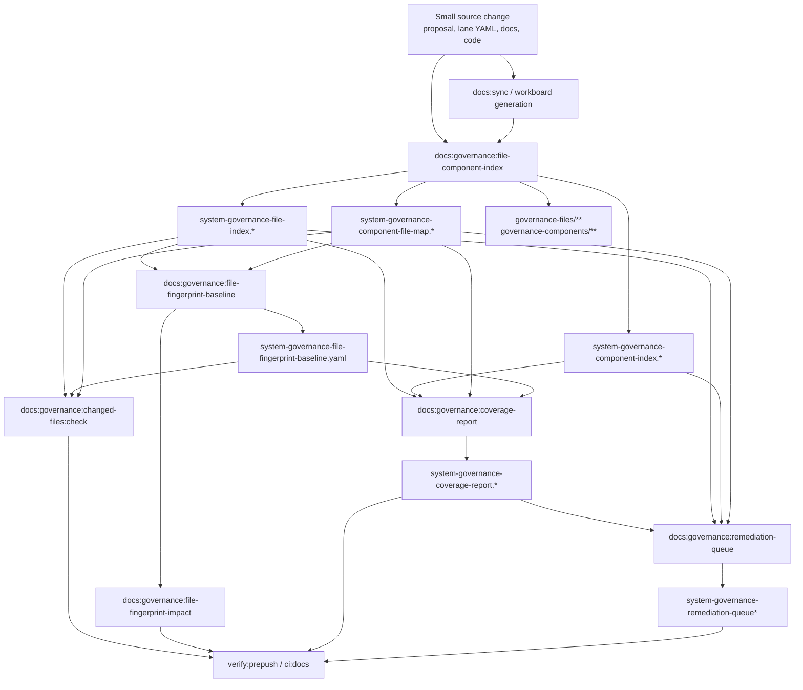

The direct generators and checks are:

- `pnpm docs:governance:file-component-index` generates the file index,
  component indexes, component maps, and governance shard folders under
  `.generated-docs/planning/status/`.
- `pnpm docs:governance:file-fingerprint-baseline` generates
  `.generated-docs/planning/status/system-governance-file-fingerprint-baseline.yaml`.
- `pnpm docs:governance:file-fingerprint-impact` generates
  `.generated-docs/planning/status/system-governance-file-fingerprint-impact-20260501.md`.
- `pnpm docs:governance:coverage-report` generates
  `.generated-docs/planning/status/system-governance-coverage-report.*`.
- `pnpm docs:governance:remediation-queue` generates
  `.generated-docs/planning/status/system-governance-remediation-queue*`.
- `pnpm verify:prepush` and `pnpm ci:docs` regenerate ignored artifacts,
  validate changed files against active governance, and check DB import/drift
  paths where applicable.

Before this extraction, one planning/proposal change fanned out into the same
surface visible in the editor:

- proposal sources under `docs/planning/proposals/mandatory/governance-and-docs/`;
- lane sources under `docs/planning/state/agent-lane-*.yaml`;
- `system-governance-file-index.*`;
- `system-governance-component-index.*`;
- `system-governance-component-file-map.*`;
- `system-governance-coverage-report.*`;
- `system-governance-file-fingerprint-baseline.yaml`;
- governance shard files under `governance-files/**` and
  `governance-components/**`.

That tracked fan-out was the problem to derive. GOV-S3 now keeps the same
generation order as an explicit import/query pipeline while removing those
derived files from the tracked review surface.

## Problem

The current planning model is correct but increasingly expensive to operate:

- `agent-lane-a.yaml` and `agent-lane-e.yaml` already exceed three thousand
  lines each;
- cross-lane status reconciliation requires broad edits to large files;
- generated governance file indexes, component maps, fingerprints, coverage
  reports, and remediation queues add review noise when small source changes
  update large generated surfaces;
- agents must repeatedly parse large YAML documents to answer narrow questions;
- local gates can fail for scope declarations rather than for the substantive
  planning decision.

The root issue is not that YAML is invalid as a source format. The root issue is
that flat files are serving two roles at once:

1. canonical reviewable planning and governance state;
2. query, dashboard, reconciliation, fingerprint, coverage, and
   generated-output backend.

Those roles should be separated.

## Current State

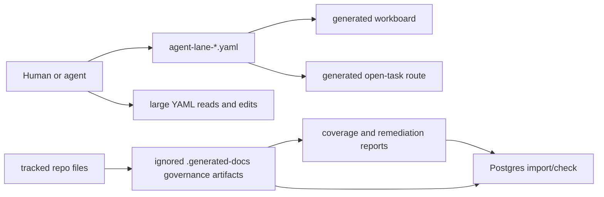

The lane YAML registry is still reviewable and deterministic. Governance
artifacts are now ignored generated read models: useful for import/checks, but
not a PR review surface or concurrency surface.

## Target State

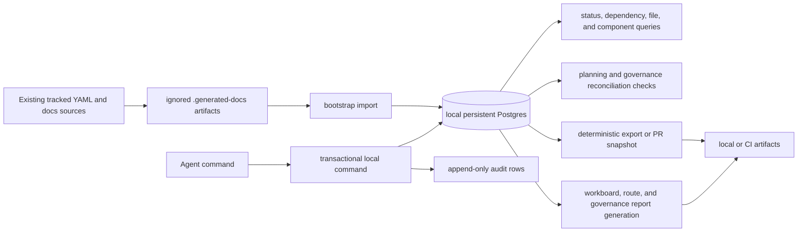

The local database exists to make planning and governance state cheap to inspect
and safe for multiple local agents to coordinate through transactional commands.
Tracked files remain the bootstrap and PR-review compatibility surface during
the transition, but agents should stop treating lane YAML and generated
governance shards as the daily write backend.

## Local Operational Boundary

This plan now separates three boundaries that were previously collapsed:

1. Bootstrap/import: existing tracked YAML/docs sources plus ignored
   `.generated-docs` governance artifacts can seed the local database with
   source hashes and raw payloads.
2. Local operation: agents claim and update planning work through Postgres
   commands that use optimistic revisions and append-only audit rows.
3. Review/export: deterministic file exports, closeouts, evidence, risk records,
   and PRs remain the reviewable repository boundary until a later ADR replaces
   that review model.

The database is local and persistent, not temporary validation state. A
temporary database may still be used for CI or parity tests, but temporary DBs
must not be presented as audit storage. Durable local audit lives in the shared
Postgres volume; durable repository evidence lives in tracked closeouts,
evidence, risk entries, and exported snapshots.

## Scope

In scope:

- define the planning query store boundary and canonicality rules;
- define the governance query-store boundary for `system-governance-*` read
  models;
- add a Docker Compose posture for local Postgres with a persistent ignored
  data directory;
- define migrations, import, query, export, and drift-check commands;
- define local DB-first planning authoring commands for agent coordination;
- normalize lane task data into tables suitable for status reconciliation;
- preserve local planning operation audit rows across imports;
- normalize file governance, component ownership, fingerprints, coverage, and
  remediation data into queryable tables;
- keep generated planning views derived from tracked inputs;
- keep generated governance views derived from tracked inputs and generated
  policy;
- allow CI to build the query store from a clean checkout.

Out of scope:

- making Postgres the canonical repository review authority in this slice;
- replacing Git review with GitHub Issues, Projects, or a mutable database UI;
- changing product runtime Postgres adapters under `packages/@dvt/adapter-*`;
- changing planner, engine, API, or web product behavior;
- committing live database files or binary snapshots as planning truth.

## Canonicality Rules

- Git-tracked planning sources remain the bootstrap and PR-review boundary until
  a later ADR changes repository review authority.
- The Postgres store is the local operational surface for agent coordination.
- Imports seed read-model rows from existing files; local operation rows are not
  deleted by import and must be audited in Postgres.
- The local Docker volume may persist data for speed, but it must be
  treated as the machine-local coordination store when agents are operating
  locally.
- Temporary validation databases are disposable and must not be treated as audit
  storage.
- Migrations are tracked in Git and are the only schema authority.
- Imports must be deterministic for the same Git tree.
- Exports must use stable ordering, stable serialization, and explicit hashes.
- Drift checks must fail when imported/exported state disagrees with the chosen
  boundary for that command: Git bootstrap rows for import checks, local
  operation revisions for DB-first authoring checks.
- Generated workboards, routes, dashboards, SQLite/JSONL summaries, and query
  artifacts are derived outputs.
- Generated `system-governance-*` reports may move behind the same derived
  query-store path only after parity proves the Postgres output matches the
  existing file generators.
- Any future decision to make Postgres the canonical repository review source
  requires a separate ADR, backup/restore runbook, CI seed/restore proof, and
  PR-review replacement model.

## Proposed Local Shape

```text
infra/planning-db/docker-compose.yml
scripts/planning-db-run.cjs
scripts/planning-db-run.test.cjs
scripts/planning-db-migrate.cjs
scripts/planning-db-migrate.test.cjs
scripts/planning-db-import.cjs
scripts/planning-db-import.test.cjs
scripts/planning-db-query.cjs
scripts/planning-db-query.test.cjs
scripts/planning-db-operate.cjs
scripts/planning-db-operate.test.cjs
tools/planning-db/migrations/
tools/planning-db/import-planning-state.mjs
tools/planning-db/export-planning-state.mjs
tools/planning-db/check-planning-state-drift.mjs
tools/planning-db/query-planning-state.mjs
tools/planning-db/import-governance-state.mjs
tools/planning-db/export-governance-state.mjs
tools/planning-db/check-governance-state-drift.mjs
tools/planning-db/query-governance-state.mjs
C:\dvt\planning-db\postgres-data
```

`C:\dvt\planning-db\postgres-data` is the shared machine-local volume for all
agents and worktrees on the same Windows PC. It is outside the repository and
must remain untracked. The data directory is a persistent cache, not a canonical
planning source. Operators may still override the data location with
`DVT_PLANNING_DB_DATA_DIR` when they intentionally need a different local disk.

## Proposed Commands

Implemented through the local Docker, content-import, and W4 drift-check
slices:

```bash
pnpm planning:db:up
pnpm planning:db:down
pnpm planning:db:logs
pnpm planning:db:ps
pnpm planning:db:env
pnpm planning:db:health
pnpm planning:db:reset -- --confirm-destroy-shared-planning-db
pnpm planning:db:migrate
pnpm planning:db:import
pnpm planning:db:query
pnpm planning:db:operate
pnpm planning:db:check
pnpm planning:db:export
pnpm planning:db:export:check
pnpm governance:db:check
pnpm governance:db:import
pnpm governance:db:export
pnpm governance:db:export:check
pnpm governance:db:query
pnpm governance:refresh
pnpm test:planning:db
pnpm test:planning:db:integration
```

The closeout baseline for the local Docker substrate slice includes:

```bash
pnpm test:planning:db
pnpm test:planning:db:integration
pnpm planning:db:migrate
pnpm planning:db:import
pnpm planning:db:query
pnpm planning:db:check
pnpm governance:db:check
pnpm governance:db:export:check
pnpm docs:feature-mechanization --feature GOV-S3-PLANNING-STATE-QUERY-STORE
pnpm docs:feature-mechanization:implementation
pnpm verify:prepush
```

`planning:db:reset` is the only accepted local repair route when the shared
machine-local Postgres volume has applied migration checksums that no longer
match the Git-tracked migration files. The command requires
`--confirm-destroy-shared-planning-db`, verifies the target is a
`postgres-data` directory, backs up any `planning_task_local_state` and
`planning_local_operations` rows under `C:\dvt\planning-db\backups`, stops the
Compose project, deletes only `C:\dvt\planning-db\postgres-data` or the
explicit `DVT_PLANNING_DB_DATA_DIR` override, recreates it, and restarts
Postgres. Contributors must not repair this state by hand-editing
`planning_query_store.schema_migrations`.

Once import/export and drift commands exist, implementation PRs should also
include:

```bash
pnpm governance:refresh
pnpm planning:db:check
pnpm governance:db:check
pnpm governance:db:export:check
pnpm docs:workboard:generate
pnpm docs:feature-mechanization:implementation
pnpm verify:prepush
```

## Data Model

The first schema should cover two derived read-model families.

### Planning tables

| Table                             | W2/W6 status | Purpose                                                                  |
| --------------------------------- | ------------ | ------------------------------------------------------------------------ |
| `planning_sources`                | implemented  | Git path, content hash, raw JSON/text source, authority, and import time |
| `planning_lanes`                  | implemented  | Lane id, source path/hash, title, owner, status, goal, and raw YAML      |
| `planning_tasks`                  | implemented  | Task id, lane, status, priority, objective, target, evidence, raw YAML   |
| `planning_task_local_state`       | implemented  | Local DB-first task overlay, optimistic revision, claim, and status data |
| `planning_task_local_definitions` | implemented  | Local DB-first task definitions created through `task create`            |
| `planning_task_local_tombstones`  | implemented  | Local DB-first task deletions that hide matching imported/source rows    |
| `planning_local_operations`       | implemented  | Append-only audit log for local planning task commands                   |
| `planning_task_dependencies`      | implemented  | Explicit task-to-task dependency edges parsed out of task dependencies   |
| `planning_task_evidence_refs`     | implemented  | Evidence, closeout, PR, commit, and doc references per task as rows      |
| `planning_task_status_events`     | implemented  | Imported/local status history as queryable rows                          |
| `planning_artifacts`              | implemented  | Generated output path, source hash, and artifact hash                    |

### Governance tables

| Table                              | Status      | Purpose                                                             |
| ---------------------------------- | ----------- | ------------------------------------------------------------------- |
| `governance_sources`               | implemented | Source path, source type, raw JSON/text source, authority, and hash |
| `governance_file_shards`           | implemented | File-index shard id, path, count, and upstream content hash         |
| `governance_files`                 | implemented | Tracked path, owning unit, component, root, drift flags             |
| `governance_components`            | implemented | Component/source units and ownership metadata                       |
| `governance_component_file_shards` | implemented | Component shard provenance, file counts, and content hashes         |
| `governance_component_files`       | implemented | File-to-component membership and shard provenance                   |
| `governance_fingerprints`          | implemented | Imported baseline compatibility rows                                |
| `governance_coverage`              | implemented | Governed, ungoverned, drift, legacy, and summary counters           |
| `governance_remediation`           | implemented | Remediation queue items, priority, owner, and source cause          |
| `governance_generated_assets`      | deferred    | Replaced for now by `governance_sources.raw_source` export checks   |

### Governance derived projections

| Projection                        | Status      | Purpose                                                      |
| --------------------------------- | ----------- | ------------------------------------------------------------ |
| `governance_file_hash_projection` | implemented | Derive file id, path hash, governance hash, and state hash   |
| `governance_file_hash_drift`      | implemented | Expose mismatches between imported columns and DB derivation |

The W2 schema is intentionally content-first. It stores the source hash for each
imported YAML file and keeps `raw_lane`, `raw_task`, `raw_shard`, and `raw_file`
JSONB columns so no current lane or governance field is thrown away while the
first typed query columns stabilize. Typed columns are added only for fields that
already drive repeated operational questions: lane/status/priority/progress,
task objective/target/evidence, file ownership, component unit, governance
state, drift, legacy, and content hashes.

The W3 governance-content slice extends the same posture to component indexes,
component-file shards, fingerprint baselines, coverage reports, and remediation
queues. The import still treats Git-tracked YAML as authority and stores raw
JSONB next to typed query columns so the database can double-check counts and
hashes without hiding any source content outside PR review.

The W6 local-operation slice adds DB-first authoring state without deleting the
imported read model. `planning_task_local_state` stores the effective local
overlay for one `(lane_id, task_id)` with an optimistic revision and optional
claim token. `planning_local_operations` stores every claim, release, and patch
as an append-only audit row with the actor, idempotency key, base source hash,
expected revision, resulting revision, and payload. Imports may refresh
`planning_tasks`; they must not erase the local operation audit.

These tables are enough to answer high-value operational questions without
introducing a large platform:

- which tasks are in `review` without accepted evidence;
- which blockers reference tasks already marked `done`;
- which cross-lane dependencies are stale;
- which generated artifacts are stale for the imported state;
- which lane summaries disagree with task-level weighted progress.
- which files moved components or ownership;
- which component shards changed because of real source edits;
- which governance fingerprints changed, disappeared, or appeared;
- which drift/remediation rows are real root-cause items versus generated
  churn;
- which source file caused a generated governance report to move.
- which local agent claimed or patched a task and which revision was produced;
- which local DB task overlay still needs export into a reviewable snapshot.

## Command And Query Rail Impact

This plan defines planning-tooling rails. It does not change product runtime
behavior.

| Rail                               | Type    | Bounded context       | DDD object                    | Adapter surface                   |
| ---------------------------------- | ------- | --------------------- | ----------------------------- | --------------------------------- |
| `ImportPlanningStateQueryStore`    | command | Planning registry     | `PlanningStateImport`         | file-system + SQL                 |
| `QueryPlanningStateReadModel`      | query   | Planning registry     | `PlanningStateReadModel`      | SQL query adapter                 |
| `ExportPlanningStateSnapshot`      | command | Planning registry     | `PlanningStateExport`         | SQL + file-system                 |
| `ValidatePlanningStateDrift`       | query   | Planning governance   | `PlanningStateDriftReport`    | SQL + Git comparison              |
| `ApplyPlanningLocalOperation`      | command | Planning registry     | `PlanningLocalOperation`      | SQL transaction                   |
| `CreatePlanningTaskDefinition`     | command | Planning registry     | `PlanningTaskDefinition`      | SQL transaction                   |
| `DeletePlanningTaskDefinition`     | command | Planning registry     | `PlanningTaskDefinition`      | SQL transaction                   |
| `QueryPlanningLocalOperationAudit` | query   | Planning registry     | `PlanningLocalOperationAudit` | SQL query adapter                 |
| `GeneratePlanningDerivedSurfaces`  | command | Documentation tooling | `PlanningGeneratedArtifact`   | docs generator                    |
| `MigratePlanningQueryStoreSchema`  | command | Planning tooling      | `PlanningQueryStoreSchema`    | SQL migration runner              |
| `ManagePlanningQueryStoreRuntime`  | command | Planning tooling      | `PlanningQueryStoreRuntime`   | Docker Compose                    |
| `InspectPlanningQueryStoreRuntime` | query   | Planning tooling      | `PlanningQueryStoreRuntime`   | Docker Compose + env              |
| `ImportGovernanceStateQueryStore`  | command | Docs governance       | `GovernanceStateImport`       | file-system + SQL                 |
| `QueryGovernanceStateReadModel`    | query   | Docs governance       | `GovernanceStateReadModel`    | SQL query adapter                 |
| `ExportGovernanceStateSnapshot`    | command | Docs governance       | `GovernanceStateExport`       | SQL + file-system                 |
| `ValidateGovernanceStateDrift`     | query   | Docs governance       | `GovernanceStateDriftReport`  | SQL + Git comparison              |
| `RefreshGovernanceDerivedSurfaces` | command | Docs governance       | `GovernanceRefreshWorkflow`   | package scripts + Git fingerprint |

Implementation must not create parallel planning task semantics outside these
rails. If a future slice adds a UI, API, or GitHub mirror, it must reuse these
rails or extend the catalog explicitly.

The local runtime rails are operational only. `planning:db:up` and
`planning:db:down` and `planning:db:reset` implement
`ManagePlanningQueryStoreRuntime`.
`planning:db:ps`, `planning:db:env`, `planning:db:logs`, and
`planning:db:health` implement `InspectPlanningQueryStoreRuntime`. Scope is
local machine operation; authorization is the developer's local OS and Docker
access. Negative tests live in `scripts/planning-db-run.test.cjs` and verify the
shared Windows data directory, fixed Compose project, environment override
policy, Docker command selection, reset confirmation, reset target safety, and
rejection of unknown actions.

`planning:db:migrate` implements `MigratePlanningQueryStoreSchema`.
`planning:db:import` implements `ImportPlanningStateQueryStore` and
`ImportGovernanceStateQueryStore` together for the W2 local content snapshot.
`planning:db:query` implements `QueryPlanningStateReadModel` and
`QueryGovernanceStateReadModel` for the current query surface. The default
`summary` query is intentionally lightweight and does not touch the
`governance_file_hash_drift` projection. `planning:db:query hash-drift` is the
explicit heavy summary query for DB-derived governance hash drift.
`planning:db:query tasks` reads `planning_effective_tasks`, not raw lane YAML,
so local DB-first overlays are visible in full inspection.
`planning:db:query open` reads `planning_open_tasks`, the SQL view that
encapsulates the daily-work filter for rows that are neither `done` nor
`blocked`. `planning:db:query next` reads `planning_next_tasks`, the SQL view
that encapsulates queued actionable task selection after dependency
resolution. `governance:db:query files`, `components`, `coverage`,
`remediation`, and `drift` are aliases over the same SQL query adapter and read
DB-owned governance query views instead of parsing generated YAML/Markdown
surfaces. `planning:db:query pr-readiness` also implements
`QueryGovernanceStateReadModel` by reading the DB-owned ARC/PR readiness
projection derived from `.arc-policy.yaml`, changed files, evidence docs, and
risk-register updates. Scope is local developer tooling only; authorization is
local OS and Docker/Postgres access. Negative tests cover migration checksum
mismatch, unknown query names, fast summary isolation from the hash-drift
projection, explicit hash-drift querying, effective task filtering, open-task
view selection, next-task view selection, governance query view selection, PR
readiness blocker formatting, content extraction from real lane YAML, and
governance file-count parity with the Git-tracked file index.

`planning:db:operate` implements `ApplyPlanningLocalOperation`,
`CreatePlanningTaskDefinition`, `DeletePlanningTaskDefinition`, and
`QueryPlanningLocalOperationAudit`. It is the local DB-first command surface for
agents: `task create`, `task delete`, `task claim`, `task release`,
`task update`, `task show`, and `audit`. It validates lane/task existence,
writes task definitions, tombstones, or local overlays with optimistic
revisions, and appends an audit row in the same transaction. Scope is local
developer tooling only; authorization is local OS and Docker/Postgres access.
Negative tests cover required actor/lane/task/objective arguments, invalid
statuses, invalid effort values, stale expected revisions, idempotency, jsonb
payload key-order stability, stale replay rejection after task revision
advances, duplicate task creation, task deletion revision guards, missing
imported task rejection, and audit row formatting.

`planning:db:check` implements `ValidatePlanningStateDrift`. It compares the
current Git-tracked planning lane snapshot with imported Postgres rows by source
hash, lane id, and `(lane_id, task_id)` identity. It fails closed when a source
hash is stale, a row is missing, or an unexpected imported row exists.

`planning:db:export` implements `ExportPlanningStateSnapshot` for the first
planning-derived surface parity slice. It reads Postgres lane rows and
`planning_effective_tasks`, reconstructs lane registry documents into a
temporary source directory, exports reviewable status/progress/evidence fields
from local DB overlays, and delegates rendering to the existing
`GeneratePlanningDerivedSurfaces` adapter instead of adding a parallel workboard
renderer. Scope is local developer tooling only; authorization is local OS and
Docker/Postgres access. Local claim tokens, claim expiry, and audit rows remain
DB-local and are not exported to lane YAML. `planning:db:export:check` compares
the DB-rendered execution workboard and open-task route against the current
generated files and fails closed on missing artifacts, stale DB content, or
renderer drift.

`governance:db:check` implements `ValidateGovernanceStateDrift`. It compares the
current Git-tracked governance snapshot with imported Postgres rows by source
hash, file path, component id, `(component_id, path)` identity, DB-derived
fingerprint path, coverage id, and remediation task id. It fails closed when any
imported governance read model no longer matches the repository state. File id,
path hash, governance hash, and state fingerprint are read from the Postgres
projection, so the accepted fingerprint baseline is no longer the comparison
source for those values.

`governance:refresh` implements `RefreshGovernanceDerivedSurfaces`. It runs the
canonical generation order from the system-governance workflow component,
repeats generation until staged, unstaged, untracked non-ignored worktree files,
and ignored generated governance status artifacts stop changing, then imports
and checks the planning/governance query store. Scope is local developer tooling
only; authorization is local OS and Docker/Postgres access. Negative tests in
`scripts/governance-refresh.test.cjs` prove the stage order,
repeat-until-stable behavior, ignored generated governance artifact
fingerprinting, and fail-closed posture when generated output does not converge.

### W4 Implementation Plan

1. Correct this plan so the W4 drift checks are no longer described as future
   work and the Postgres-versus-Mongo decision is explicit.
2. Keep the existing TDD red tests in `scripts/planning-db-check.test.cjs` and
   `scripts/governance-db-check.test.cjs`, then run `pnpm test:planning:db` to
   prove the missing runners fail before implementation.
3. Add focused check runners in `scripts/planning-db-check.cjs` and
   `scripts/governance-db-check.cjs`; reuse the canonical snapshot builders from
   `scripts/planning-db-import.cjs` rather than reparsing YAML differently.
4. Keep the database read side read-only for checks: compare Postgres rows to
   Git snapshots and never mutate canonical state from a check command.
5. Regenerate the affected governance/status projections after adding files and
   updating package scripts.
6. Validate W4 with `pnpm test:planning:db`, `pnpm planning:db:import`,
   `pnpm planning:db:check`, `pnpm governance:db:check`, `pnpm ci:docs`, and
   `pnpm verify:prepush`.

### W5 Implementation Plan

1. Add a focused red test in `scripts/governance-refresh.test.cjs` that fixes
   the canonical generation order, requires repeat-until-stable behavior, and
   fails before database import when generation does not converge.
2. Add `scripts/governance-refresh.cjs` as the single local orchestration
   command for docs/governance generation plus planning/governance DB drift
   checks.
3. Use a Git worktree fingerprint only as a convergence guard. Git remains the
   canonical source boundary; the fingerprint does not replace reviewed
   tracked sources or `contentSha256` DB drift checks.
4. Document the workflow in the ci-governance component so agents no longer
   rely on memory for regeneration sequence.
5. Keep any proposal to reduce non-code check cost as a later CI policy slice.
   This implementation records the cost gap but does not silently relax docs,
   feature mechanization, fingerprint, or prepush gates.
6. Validate W5 with `pnpm test:governance:refresh`, `pnpm test:planning:db`,
   `pnpm governance:refresh`, `pnpm ci:docs`, and `pnpm verify:prepush`.

### W6 Implementation Plan

1. Update this plan and the GOV-S2 closeout to clarify that the current file
   import/check flow was a derived read model and that agent collision avoidance
   requires DB-first local operations.
2. Add red tests in `scripts/planning-db-operate.test.cjs` for CLI argument
   validation, operation planning, optimistic revision rejection, idempotency,
   and audit formatting.
3. Add `003_local_operation_store.sql` with `planning_task_local_state` and
   `planning_local_operations`. The audit table must not reference imported
   rows with cascading deletes because audit must survive re-imports.
4. Add `scripts/planning-db-operate.cjs` with transactional `task claim`,
   `task release`, `task update`, `task show`, and `audit` surfaces.
5. Add `planning:db:operate` to `package.json` and include the new tests in
   `test:planning:db`.
6. Validate W6 with `pnpm test:planning:db`,
   `pnpm docs:feature-mechanization --feature GOV-S3-PLANNING-STATE-QUERY-STORE`,
   `pnpm docs:feature-mechanization:implementation`, `pnpm governance:refresh`,
   `pnpm planning:db:reset -- --confirm-destroy-shared-planning-db`, and
   `pnpm verify:prepush`.

### W7 Implementation Plan

1. Update this plan before code so `planning:db:export` is no longer an
   undeclared future command and the export parity boundary is explicit.
2. Add red tests in `scripts/planning-db-export.test.cjs` for reconstructing
   lane documents from DB rows, replacing raw lane task arrays with normalized
   task rows, detecting generated artifact drift, and preserving the generated
   artifact allowlist.
3. Add `scripts/planning-db-export.cjs` as a thin DB-to-generator command. It
   must read imported Postgres rows, emit temporary lane YAML source files, and
   invoke the existing `scripts/generate-workboard.cjs` renderer rather than
   duplicating workboard formatting logic.
4. Add `planning:db:export` and `planning:db:export:check` package scripts and
   wire `planning:db:export:check` into `governance:refresh` after import and
   planning drift check. This keeps the current generation sequence canonical
   while proving DB parity before closeout.
5. Extend the live planning DB integration test to export DB-derived planning
   views into a temporary output root after import and assert both expected
   generated files exist.
6. Validate W7 with `pnpm test:planning:db`,
   `pnpm test:planning:db:integration`, `pnpm planning:db:import`,
   `pnpm planning:db:export:check`, `pnpm governance:refresh`,
   `pnpm ci:docs`, and `pnpm verify:prepush`.

### W8 Implementation Plan

1. Add a focused red test for the new governance generated-output boundary:
   derived `system-governance-*` artifacts must resolve to
   `.generated-docs/planning/status/`, while
   `system-governance-unit-index.units.yaml` remains the tracked source
   manifest.
2. Add `scripts/governance-generated-paths.cjs` as the single path helper for
   generated governance outputs.
3. Retarget document-map, file/component-index, fingerprint, coverage,
   remediation, and changed-file scripts to read/write the generated governance
   read side from `.generated-docs/planning/status/`. This W8 step is
   superseded for `planning:db:import` by W10, where DB import rebuilds
   equivalent projections in memory.
4. Change governance `:check` scripts so local/CI checks regenerate ignored
   artifacts instead of failing because generated files are absent from a clean
   checkout.
5. Remove former derived `system-governance-*`, `governance-files/**`, and
   `governance-components/**` outputs from tracking. Keep source surfaces such
   as `system-governance-unit-index.units.yaml`,
   `system-governance-unit-index-20260501.md`, and
   `system-governance-unit-taxonomy-20260501.md` tracked.
6. Update `docs/generated-docs-policy.json` and the CI governance component so
   reviewers see that these artifacts are ignored local outputs, not PR review
   files.
7. Validate W8 with focused generator tests, `pnpm test:planning:db`,
   `pnpm governance:refresh`, `pnpm ci:docs`, and `pnpm verify:prepush`.

### W9 Implementation Plan

1. Add focused red tests requiring a Postgres migration for derived governance
   hash projections and an explicit query surface for governance hash drift.
2. Add a Postgres hash projection that recomputes file id, path hash,
   governance hash, and state fingerprint from imported governance file rows.
   The imported `content_hash` remains the byte-level fact until a later slice
   imports file contents directly.
3. Retarget `governance:db:check` so fingerprint comparisons read from
   `governance_file_hash_projection`, not from the imported fingerprint baseline.
4. Extend the live planning DB integration test to assert zero
   `governance_file_hash_drift` rows after import.
5. Validate W9 with `pnpm test:planning:db`,
   `pnpm test:planning:db:integration`, `pnpm planning:db:import`,
   `pnpm planning:db:query`, `pnpm governance:db:check`,
   `pnpm governance:refresh`, `pnpm ci:docs`, and `pnpm verify:prepush`.

### W10 Implementation Plan

1. Add focused red tests proving `buildGovernanceFileSnapshot` builds DB import
   rows from in-memory governance generator projections and marks those sources
   as `in-memory-generator`.
2. Expose typed payloads from the governance file/component and document-unit
   generators so import code can reuse the existing generator logic without
   reading `.generated-docs` shards from disk.
3. Retarget `planning:db:import` to build governance file, component,
   fingerprint, coverage, remediation, and document-map inputs in memory. Keep
   generated repo paths as stable source identifiers, but compute source hashes
   from the in-memory payloads.
4. Keep `.generated-docs` generation as a local inspection and legacy parity
   surface only. It must no longer be required before `planning:db:import`.
5. Retarget `docs:governance:changed-files:check` to derive the current file
   index and baseline from the same in-memory snapshot instead of reading
   `.generated-docs` files.
6. Remove the obsolete `governance:artifacts:generate` rail so
   `governance:refresh` remains the single local orchestration command. The DB
   test rail must prove it can build governance import content without
   pregenerated local files.
7. Serialize `planning:db:import` destructive read-model replacement with a
   transaction-scoped advisory lock so concurrent agents using the shared
   machine-local Postgres volume cannot interleave delete and insert phases.
8. Validate W10 with `pnpm test:planning:db`,
   `pnpm test:planning:db:integration`, `pnpm planning:db:import`,
   `pnpm planning:db:query`, `pnpm governance:db:check`,
   `pnpm governance:refresh`, `pnpm ci:docs`, and `pnpm verify:prepush`.

### W10A Fast Query Summary Implementation Plan

1. Keep `planning:db:query` as the daily local inspection command and prevent
   it from recalculating DB-derived governance hashes during the default
   `summary` query.
2. Add an explicit `planning:db:query hash-drift` query for operators and QA
   slices that need to inspect `governance_file_hash_drift` directly.
3. Keep `governance:db:check` as the fail-closed deep validation rail for
   governance drift; the fast summary must not replace it.
4. Prove the split with tests that fail when the default summary references
   `governance_file_hash_drift` and pass only when hash drift is queried through
   the explicit heavy route.
5. Validate W10A with `pnpm test:planning:db`,
   `pnpm test:planning:db:integration`, `pnpm planning:db:query`,
   `pnpm planning:db:query hash-drift`, `pnpm governance:db:check`,
   `pnpm ci:docs`, and `pnpm verify:prepush`.

### W11 Effective Task Operations Implementation Plan

1. Add red migration coverage proving a tracked SQL migration creates
   `planning_effective_tasks`, the read model that overlays
   `planning_task_local_state` on top of imported `planning_tasks`. The view
   only applies a local overlay when its recorded
   `base_source_content_sha256` still matches the imported task source hash,
   and it must preserve nullable overlay semantics such as clearing
   `status_reason`.
2. Add red query tests for `planning:db:query tasks` and
   `planning:db:query next`, including lane/status/claim filters, stable task
   row rendering, and actionable-next filtering from effective task status.
3. Add red export tests proving `planning:db:export` writes effective status,
   progress, evidence, and status reason from the DB overlay back into temporary
   lane YAML before rendering workboard/open-task-route artifacts.
4. Implement `005_planning_effective_task_read_model.sql` as a view only, with
   `006_planning_effective_task_overlay_guard.sql` owning the follow-up overlay
   applicability hardening. The slice must not mutate imported
   `planning_tasks`, create/delete tasks, or make Postgres the repository review
   authority.
5. Retarget `planning:db:query summary`, `tasks`, and `next` to read
   `planning_effective_tasks` so daily filters reflect local DB-first task
   operations without rereading lane YAML. The `next` query loads all effective
   tasks before applying lane filters so cross-lane dependencies remain visible
   during dependency resolution.
6. Retarget `planning:db:export` to read the effective view and overlay only
   exported task fields that belong in the reviewable lane registry. Local
   claims, claim tokens, and audit rows remain DB-local and are not exported to
   YAML.
7. Update planning operation docs so existing-task status/claim/review updates
   use `planning:db:operate` plus query/export/check. Keep lane YAML as the
   bootstrap and PR-review compatibility surface for new task creation until a
   later slice moves create/delete semantics.
8. Validate W11 with `pnpm test:planning:db`,
   `pnpm test:planning:db:integration`, `pnpm planning:db:query tasks`,
   `pnpm planning:db:query next`, `pnpm planning:db:export:check`,
   `pnpm governance:refresh`, `pnpm docs:feature-mechanization:implementation`,
   and `pnpm verify:prepush`.

### W11B DB-Backed Workboard Generation Implementation Plan

The current generated planning route is:

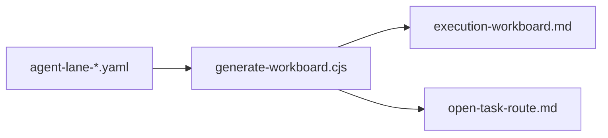

The target route keeps YAML as deterministic fallback but lets the shared
planning DB effective view own the local operational state when it is available
and fresh:

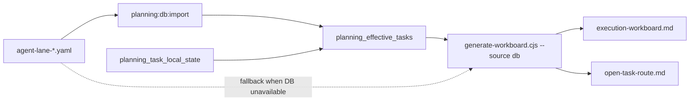

1. Add red workboard-generator tests proving the default DB source reads
   `planning_effective_tasks` through the existing planning DB export read
   model when the DB is reachable and `planning:db:check` semantics report no
   drift.
2. Add red fallback tests proving lane YAML is used only when the caller
   explicitly requests `--source yaml`; an unavailable or stale DB must fail
   closed instead of silently hiding drift.
3. Add red governance-refresh tests proving `planning:db:import` runs before
   `docs:workboard:generate`, and again after coverage/remediation generation,
   while `planning:db:check`, `planning:db:export:check`,
   `governance:db:check`, and `governance:db:export:check` remain after the
   generated surfaces stabilize.
4. Refactor `scripts/generate-workboard.cjs` into exported, testable source
   selection helpers without changing the rendered table semantics.
5. Teach the workboard generator `--source db|yaml` and `--database-url`; keep
   DB as the default and reserve YAML for explicit bootstrap/export previews.
6. Update `governance:refresh` so the planning DB import precedes workboard
   generation and a final import precedes database drift/export checks.
7. Update planning operation docs to state that generated workboard/open route
   views are DB-effective when the local query store is fresh and YAML-derived
   only during explicit fallback.
8. Validate W11B with `pnpm test:planning:db`,
   `pnpm test:planning:db:integration`, `pnpm docs:workboard:generate`,
   `pnpm planning:db:export:check`, `pnpm governance:refresh`,
   `pnpm docs:feature-mechanization:implementation`, and
   `pnpm verify:prepush`.

### W11C Open Task View Implementation Plan

The effective planning task read model must remain complete because dependency
resolution, export parity, drift checks, and audit-oriented inspection need
`done` and `blocked` rows. Human daily planning needs a narrower operational
surface that does not repeat the same status filter in every pgAdmin query or
CLI adapter.

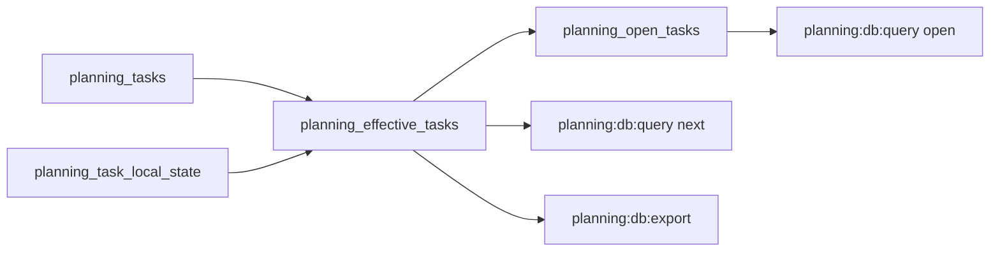

Implementation steps:

1. Add red migration coverage proving `007_planning_open_task_views.sql`
   creates `planning_query_store.planning_open_tasks` from
   `planning_effective_tasks`.
2. The SQL view must encapsulate the operational filter
   `status not in ('done', 'blocked')`, preserving all task columns from the
   effective view so pgAdmin and CLI consumers share one definition.
3. Add red query coverage for `planning:db:query open` proving it reads
   `planning_open_tasks` directly and does not re-express the open-status
   filter in JavaScript SQL.
4. Keep `planning:db:query tasks` and `planning:db:query next` on
   `planning_effective_tasks`: `tasks` is the full inspection query and `next`
   needs `done` rows to resolve dependencies before lane filtering. W11D below
   supersedes this transitional `next` adapter by moving that dependency
   resolution into `planning_next_tasks`.
5. Validate W11C with `pnpm test:planning:db`, `pnpm planning:db:migrate`,
   `pnpm planning:db:query open`, `pnpm governance:refresh`,
   `pnpm docs:feature-mechanization:implementation`, and
   `pnpm verify:prepush`.

### W11D Next Task View Implementation Plan

After W11C, `planning:db:query open` no longer repeated the daily-work status
filter outside Postgres, but `planning:db:query next` still repeated
dependency parsing and actionable-task selection in `scripts/planning-db-query.cjs`.
That kept a second query model in JavaScript for the same operational question
agents ask in pgAdmin: "what can I safely pick next?".

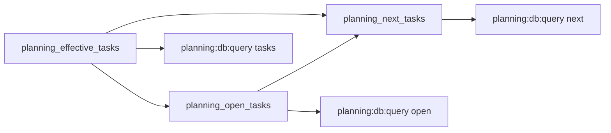

Implementation steps:

1. Add red migration coverage proving `008_planning_next_task_views.sql`
   creates `planning_query_store.planning_next_tasks`.
2. The SQL view must read from `planning_open_tasks`, keep only queued
   candidates, split dependency references in Postgres, and reject candidates
   with any dependency that is not `done` in `planning_effective_tasks`.
3. Add red query coverage proving `planning:db:query next` reads
   `planning_next_tasks` directly and no longer emits dependency parsing SQL or
   JavaScript filtering against `planning_effective_tasks`.
4. Keep lane, status, claim, priority, and limit flags in the CLI adapter as
   ordinary query filters over the DB-owned view; the CLI must not own
   actionable-next semantics.
5. Validate W11D with `pnpm test:planning:db`, `pnpm planning:db:migrate`,
   `pnpm planning:db:query next`, `pnpm governance:refresh`,
   `pnpm docs:feature-mechanization:implementation`, and
   `pnpm verify:prepush`.

### W11E DB-Backed Route Actionables Implementation Plan

After W11D, `planning:db:query next` used the DB-owned
`planning_next_tasks` view, but `docs:workboard:generate` still recomputed the
`open-task-route.md` `Actionable Now` section from effective task rows with
local JavaScript dependency parsing. That left one remaining generated-route
consumer outside the DB-owned next-task read model.

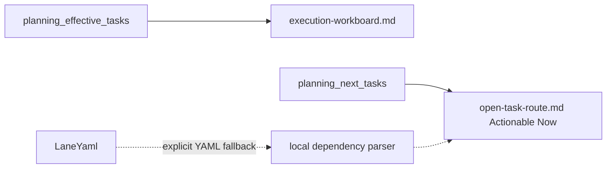

Implementation steps:

1. Add red workboard-generator coverage proving the DB source reads
   `planning_next_tasks` and carries those candidates as `actionableTasks`.
2. Add red renderer coverage proving `buildOpenTaskRoute` can render a
   DB-supplied actionable list without consulting the local `doneSet`.
3. Keep YAML fallback semantics unchanged: when the DB is unavailable and
   source mode is `auto`, the generator may still compute unblocked queued rows
   from lane YAML.
4. Update planning operation docs to state that DB-backed generated routes use
   `planning_next_tasks` for `Actionable Now`.
5. Validate W11E with `node --test scripts/generate-workboard.test.cjs`,
   `pnpm docs:workboard:generate`, `pnpm test:planning:db`,
   `pnpm governance:refresh`, `pnpm docs:feature-mechanization:implementation`,
   and `pnpm verify:prepush`.

### W12A Governance DB Query Surface Implementation Plan

After W11E, the planning route can be inspected from DB-owned task views, but
governance inspection still requires humans and agents to know which large
generated `system-governance-*` artifact to open. W12A adds a DB-first query
surface for those already imported governance read models without changing the
generator parity rules.

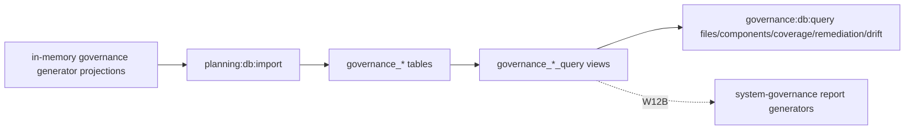

Implementation steps:

1. Add red migration coverage proving a tracked `009` migration creates
   `governance_file_query`, `governance_component_query`,
   `governance_coverage_query`, `governance_remediation_query`, and
   `governance_drift_query`.
2. Add red query coverage proving `files`, `components`, `coverage`,
   `remediation`, and `drift` read those DB views directly and do not parse
   `.generated-docs` or `docs/planning/status/system-governance-*` files.
3. Add `governance:db:query` as a package alias over the existing
   `scripts/planning-db-query.cjs` adapter so the rail is not duplicated.
4. Keep the generated governance artifacts as local inspection output only.
   W12A must not retarget report generators; W12B owns that larger migration.
5. Validate W12A with
   `node --test scripts/planning-db-migrate.test.cjs scripts/planning-db-query.test.cjs`,
   `pnpm test:planning:db`, `pnpm planning:db:migrate`,
   `pnpm governance:db:query files`, `pnpm governance:refresh`,
   `pnpm docs:feature-mechanization:implementation`, and
   `pnpm verify:prepush`.

### W12B Governance Report DB Source Implementation Plan

After W12A, humans and agents can inspect governance state through
`governance:db:query`, but the report generators still own their primary input
through generated YAML files. W12B moves the canonical refresh path for coverage
and remediation reports onto the DB-owned governance query views, while keeping
the local in-memory generator path as the standalone CI/development fallback for
commands that run without a planning database.

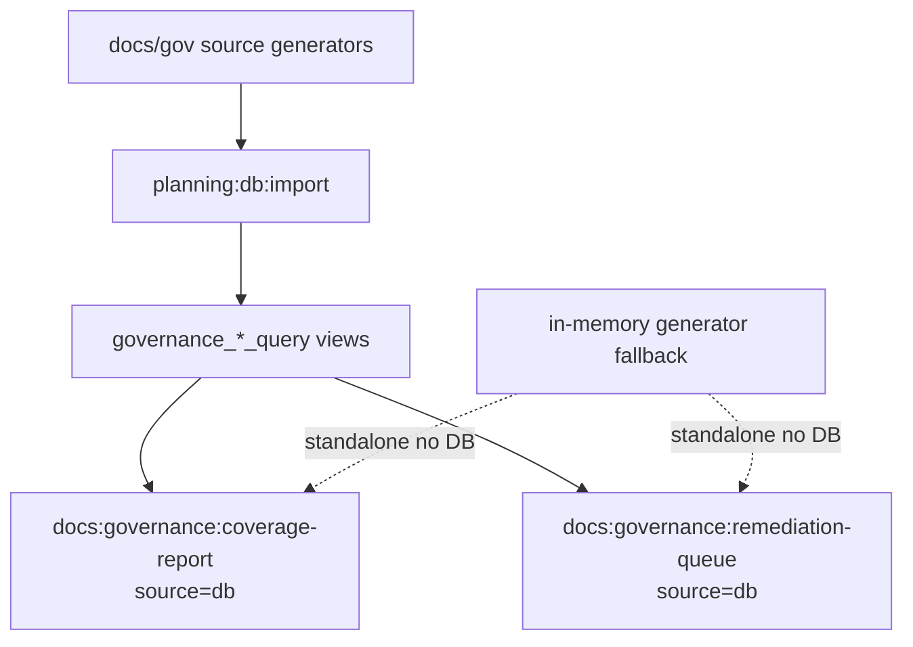

Implementation steps:

1. Add a `010` migration that enriches the governance query views with the
   JSON payload columns the report generators need: file/component governance
   references, raw coverage rows, remediation task files, remediation task
   documents, expected validation, and raw remediation tasks.
2. Add red coverage-generator tests proving `readCoverageReportFromDb` reads
   `governance_file_query` and `governance_component_query`, reconstructs the
   same report shape, and does not read `.generated-docs` inputs.
3. Add red remediation-generator tests proving `readRemediationQueueFromDb`
   reads `governance_remediation_query` and `governance_coverage_query`, uses
   DB-owned task payloads, and does not rebuild the queue from generated YAML.
4. Move `governance:refresh` so `planning:db:import` runs after source
   generators that can affect the file list and before DB-backed report
   generators. The coverage and remediation stages must set the report source
   to `db`.
5. Keep standalone report commands able to run from deterministic in-memory
   generator inputs when the DB source is not explicitly requested. That is a
   CI/development fallback, not the canonical refresh path.
6. Validate W12B with
   `node --test scripts/planning-db-migrate.test.cjs scripts/generate-governance-coverage-report.test.cjs scripts/generate-governance-remediation-queue.test.cjs scripts/governance-refresh.test.cjs`,
   `pnpm test:planning:db`, `pnpm planning:db:migrate`,
   `pnpm governance:refresh`, `pnpm docs:feature-mechanization:implementation`,
   and `pnpm verify:prepush`.

## GitHub Issues Role

GitHub Issues may be useful as a collaboration mirror after the query store is
stable:

- issue forms can collect human intake;
- labels and project fields can expose lane, status, priority, and assignee;
- PR links can improve traceability from execution to review.

The first slice should not make Issues canonical. An agent working from local
repo state should be able to import, query, validate, and regenerate planning
surfaces without network access.

## Migration Sequence

1. Add this plan and agree on the storage boundary.
2. Extract the current `system-governance-*` generation workflow into the
   `ci-governance` component contract, including stages, inputs, outputs,
   check modes, and review fan-out.
3. Add Docker Compose with the shared `C:\dvt\planning-db\postgres-data`
   machine-local volume and local runtime scripts.
4. Add schema migrations and import existing `agent-lane-*.yaml` plus
   `system-governance-file-index.files.yaml` shards into read-only Postgres
   tables with source hashes.
5. Import existing `system-governance-*` component maps,
   fingerprints, coverage reports, and remediation queues into read-only
   Postgres tables.
6. Add query and drift checks that compare Postgres output to Git-tracked lane
   and governance state.
7. Add `governance:refresh` as the canonical local refresh sequence for docs
   and system-governance generated surfaces, with query-store import/checks
   gated on stable generated output.
8. Add DB-first local operation commands for task claims, task patches, and
   durable audit so local agents stop using lane YAML as their coordination
   backend.
9. Derive governance file identity, path hash, governance hash, and state
   fingerprint in Postgres views from imported governance file rows.
10. Build governance DB import from in-memory generator projections instead of
    reading `.generated-docs` files as import input.
11. Move workboard and open-task-route generation to read from the query store
    by default, with deterministic file fallback only when the caller
    explicitly asks for `--source yaml`. The DB now owns the effective task read
    model, local overlays, local task definitions, local tombstones, exported
    snapshots, and normalized dependency/evidence/status views.
12. Move governance report generation to read from the query store only after
    parity proves it matches the current generators.
13. Split large lane YAML files into smaller Git-tracked task shards only after
    the import/export checks prove parity.
14. Consider compacting generated governance shards after query-store parity
    proves reviewers can inspect root causes without losing deterministic output.
15. Consider an optional GitHub Issues mirror after local and CI query-store
    workflows are stable.

Current implementation status on 2026-05-08:

- steps 1 through 5 are implemented in the local query-store branch;
- `pnpm planning:db:query` now exposes summary counts for lanes, tasks,
  governance files, governance components, component-file memberships,
  fingerprints, coverage rows, and remediation tasks;
- step 6 is implemented: deterministic drift checks compare the imported
  Postgres state back to Git-tracked planning and governance sources before
  later export or generator migration work starts;
- step 7 is implemented: `pnpm governance:refresh` encodes the canonical
  regeneration order, repeats until generated output stabilizes, then runs
  planning and governance query-store import/checks;
- step 8 is implemented: `pnpm planning:db:operate` gives agents a local
  DB-first task operation surface with revision checks, collision-safe default
  idempotency keys, jsonb-stable idempotent replay validation, and durable audit
  rows. Replays fail closed when the task has advanced beyond the original
  operation's resulting revision;
- step 9 is implemented: Postgres derives governance file id, path hash,
  governance hash, and state fingerprint through
  `governance_file_hash_projection`, and `governance:db:check` compares against
  that projection instead of the imported fingerprint baseline;
- step 10 is implemented: `planning:db:import` builds governance rows from
  generator projections in memory, and when a generated source document already
  exists it preserves that raw text as the exportable DB document while keeping
  structured rows normalized. `docs:governance:changed-files:check` reads the
  same in-memory current index/baseline, and `test:planning:db` no longer
  pregenerates governance artifacts before the DB tests. The import transaction
  also takes a transaction-scoped advisory lock before replacing read-model rows
  so concurrent local agents cannot race on the shared Postgres volume;
- W10A is implemented: the default `pnpm planning:db:query` summary reads only
  lightweight read-model counts, while `pnpm planning:db:query hash-drift`
  owns the explicit heavy hash projection inspection;
- W11 first slice is implemented: `planning_effective_tasks` overlays
  `planning_task_local_state`, local task definitions, and local tombstones on
  imported `planning_tasks` only while the overlay base source hash matches the
  imported task source hash; `planning:db:query tasks` reads effective task
  state, and `planning:db:export` exports reviewable effective
  status/progress/evidence fields without exporting local claim tokens or audit
  rows;
- W11C is implemented: `planning_open_tasks` is the SQL view for daily
  non-`done`, non-`blocked` planning inspection, and `planning:db:query open`
  reads that view instead of duplicating the open-task filter in CLI SQL;
- W11D is implemented: `planning_next_tasks` is the SQL view for queued,
  dependency-satisfied route candidates, and `planning:db:query next` reads
  that view instead of duplicating dependency parsing and actionable-task
  filtering in CLI JavaScript;
- W11E is implemented: DB-backed `docs:workboard:generate` reads
  `planning_next_tasks` for the `open-task-route.md` `Actionable Now` section,
  leaving local dependency parsing only for explicit YAML fallback;
- W11F is implemented: `planning:db:operate task create` and
  `planning:db:operate task delete` create auditable DB-owned definitions and
  tombstones, then `planning:db:export:check` proves the exported review shape
  remains deterministic;
- W11G is implemented: `planning_task_dependencies`,
  `planning_task_evidence_refs`, and `planning_task_status_events` normalize
  task dependencies, evidence, and status history into queryable SQL surfaces;
- W11H is implemented: `planning_artifacts` records generated planning output
  hashes from the export/check rail so generated churn is inspectable as rows;
- W12A is implemented: `governance:db:query files`, `components`,
  `coverage`, `remediation`, and `drift` read DB-owned governance query views
  for daily inspection instead of requiring agents to open generated
  `system-governance-*` artifacts;
- W12B is implemented: `governance:refresh` imports the query store after
  source-affecting governance generators and before coverage/remediation
  generation, then runs those report generators against DB-owned governance
  query views. Standalone no-DB checks retain deterministic local generator
  input for CI/development parity;
- W12C is implemented: `governance:db:import`,
  `governance:db:export`, and `governance:db:export:check` make generated
  governance source documents DB-exportable instead of leaving `.generated-docs`
  as a hidden second source;
- W17 is implemented: `planning:db:import` records the current ARC/PR readiness
  projection in `pr_readiness_checks`, and `planning:db:query pr-readiness`
  reports effective ARC level, missing evidence/risk requirements, required
  checks, and blocking state from DB rows instead of recomputing the review
  posture in operator-facing query output;
- W18 is implemented: `planning:db:import` imports active documentation
  frontmatter, pending-style markers, and task-like references into normalized
  DB rows, then `planning:db:query docs-disposition` and
  `planning:db:query task-references` expose the triage queue without turning
  the status inventory into a parallel workboard;
- W19 is implemented: `planning:db:query task-trace` and
  `planning:db:query task-gaps` expose the task provenance ledger over existing
  planning, document-disposition, dependency, and evidence rows;
- W20 is active: the next planning-query slice adds a work-intake focus query
  over next tasks, task provenance gaps, docs disposition actions, governance
  remediation, and PR readiness blockers so agents can ask what to work on next
  and why without opening every specialized queue first;
- the obsolete `governance:artifacts:generate` package alias is removed;
  `pnpm governance:refresh` is the single local orchestration command for
  generated inspection artifacts plus planning/governance DB import and checks;
- one-off architecture migration helpers from the earlier architecture rehome
  are removed from active `scripts/` because the move has already landed and
  the scripts were not part of any package, CI, governance refresh, or DB rail;
- the shared DB checksum-repair route is implemented through
  `pnpm planning:db:reset -- --confirm-destroy-shared-planning-db`, not through
  manual edits to `schema_migrations`;
- steps 13 through 15 remain future concrete follow-up work. They do not keep
  `GOV-S2` open; `GOV-S2` is the closed framework umbrella and this plan owns
  any remaining query-store parity or generated-artifact compaction work.

## W18 Docs Disposition Queue Design

The current docs task disposition inventory is a non-normative status snapshot.
It proves that documentation cleanup is expensive because active docs contain
frontmatter gaps, draft/superseded states, pending-style markers, and many
task-like identifiers that are not planning task IDs. W18 moves that analysis
into the planning/governance query store so operators can inspect a stable
queue instead of rereading the corpus by hand.

Current state:

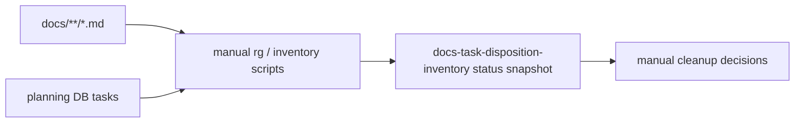

Target state:

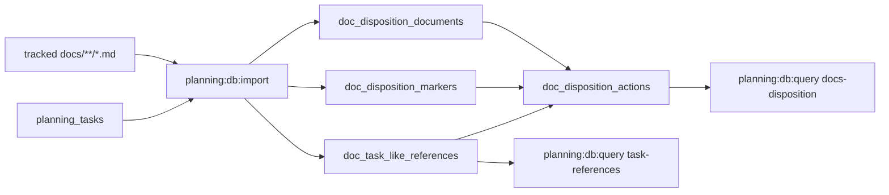

`ImportGovernanceStateQueryStore` owns the import because the source corpus is
tracked documentation and governance metadata. `QueryDocsDispositionQueue` owns
the operator queries. Git remains the review/bootstrap boundary; the DB queue is
a derived operational read model.

The first slice is intentionally classification-first:

- import tracked Markdown documents, while marking archive, `_archive`, and
  superseded-path documents inactive for cleanup actions;
- parse top-level frontmatter into document rows and keep a raw frontmatter
  payload for reviewer inspection;
- count pending-style markers using the inventory's marker vocabulary:
  `pending`, `remaining`, `debt`, `gap`, `follow-up`, `followup`, `not
implemented`, `todo`, `next step`, `tbd`, and `open question`;
- extract task-like identifiers and classify them as registered planning tasks,
  ADR IDs, ARC levels, evidence IDs, risk IDs, user-story IDs, governance-unit
  references, repository-command references, PlanStore matrix references,
  algorithm references, historical planning/gap IDs, or unknown task-like IDs;
- create action rows for active `Draft` docs, active `Superseded` docs outside
  archive or superseded locations, missing frontmatter status,
  pending-marker hotspots, and unknown task-like IDs.

This slice does not archive or promote documents. It only makes disposition
work queryable and auditable enough for focused cleanup PRs.

## W19 Task Provenance Ledger Design

The task registry answers what is active, queued, or closed. The review and
proposal corpus answers why a task exists. Evidence and closeouts answer whether
the task has actually been proven. Today those surfaces are imported, but the
task-level relationship is still an implicit reading exercise.

W19 derives the first task-provenance ledger from existing DB-owned read models.
It does not add a second task store and it does not create new task state. It
adds query views that join:

- `planning_effective_tasks`;
- `planning_task_dependencies`;
- `planning_task_evidence_refs`;
- `doc_task_reference_query`;
- `doc_disposition_document_query`;
- `doc_disposition_action_query`.

Target state:

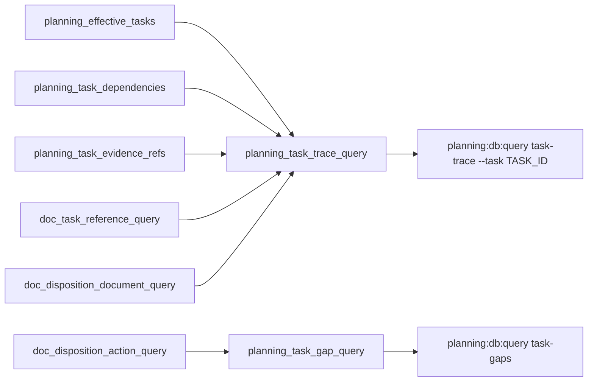

`QueryTaskProvenanceLedger` owns the operator queries. The ledger is derived
from imported planning and documentation rows, so `ImportPlanningStateQueryStore`
and `ImportGovernanceStateQueryStore` remain the write/import rails.

The first W19 implementation is intentionally read-model only:

- `task-trace` lists one task's task row, parent, dependencies, evidence refs,
  and source documents that explicitly reference the task ID;
- source document rows are typed as `review`, `proposal`, `closeout`,
  `evidence_doc`, `risk_doc`, or `source_doc` by active document path and
  frontmatter;
- `task-gaps` lists high-signal task/provenance gaps, including review or done
  tasks without evidence, open tasks without any task-referencing document or
  evidence ref, active reviews without task links, mandatory active proposals
  without task links, and task-linked documents that still have unresolved
  disposition actions;
- the gap query exposes a `--kind` filter so agents can inspect one class of
  task-governance failure without rereading all planning docs.

W19 does not change task status, create tasks, archive reviews, promote
proposals, or infer closure. It only makes the relationships visible enough for
the next work selection or closeout decision to be evidence-led.

## W20 Work Intake Focus Query Design

The planning DB now has narrow query queues for next executable tasks, docs
disposition, task provenance gaps, governance remediation, and PR readiness.
That improves precision, but work selection still requires an operator to run
several commands and mentally rank the results.

W20 derives a single DB-owned work-intake read model from existing query views.
It does not replace the specialized queues; it routes operators to them. The
view joins no mutable state and writes no task status. It only ranks already
imported rows by priority and source kind.

Target state:

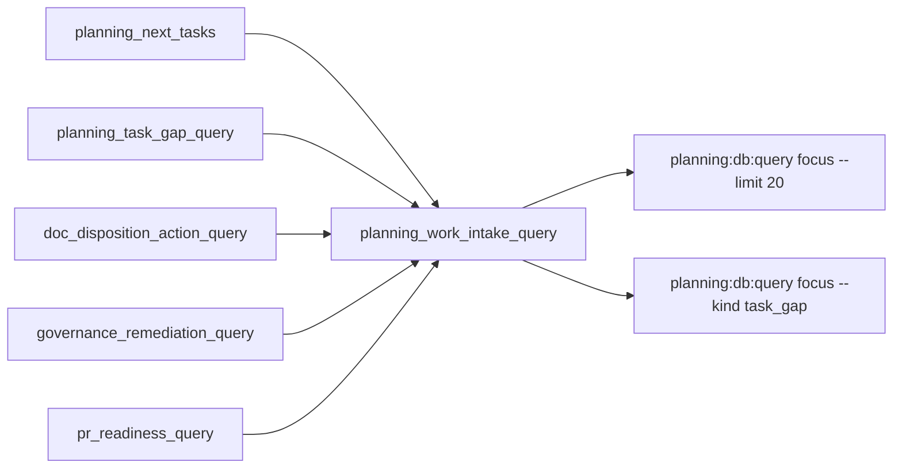

`QueryPlanningWorkIntake` owns this operator query. The output contract is:

- `rank_score`: stable numeric ordering across sources;
- `priority`: planning priority label normalized from the source row;
- `intake_kind`: one of `next_task`, `task_gap`, `docs_disposition`,
  `governance_remediation`, or `pr_readiness`;
- `item_id`: stable source-row identifier for deduplication and review;
- `lane_id` and `task_id` when the row is task-scoped;
- `document_path` or `source_path` when the row is document-scoped;
- `title`: compact human label;
- `reason`: why the row is actionable;
- `suggested_query`: the next specialized query to inspect the item;
- `source_view`: the DB view that owns the detailed semantics.

Ordering is intentionally conservative: P0/P1 blockers sort first, PR readiness
blockers are included only when blocking, and specialized source queries remain
the authority for details. The CLI exposes `--kind`, `--lane`, `--priority`,
`--task`, `--path`, and `--limit` filters so agents can focus without adding
parallel queue names.

W20 does not create tasks, resolve docs disposition actions, change ARC
readiness, or infer task closure. It accelerates intake by making the first
question DB-answerable: what deserves attention next, and which canonical query
explains it?

## Failure Modes And Guardrails

| Failure mode                              | Guardrail                                                     |
| ----------------------------------------- | ------------------------------------------------------------- |
| Local DB diverges from Git                | `planning:db:check` fails on drift                            |
| Docker volume lost                        | Rebuild from Git with import command                          |
| Import order affects output               | Stable ordering and hash checks                               |
| Generated artifact churn returns          | Artifact hashes recorded in `planning_artifacts`              |
| Agents forget refresh order               | `governance:refresh` owns order and repeats until stable      |
| Agents collide on lane YAML edits         | `planning:db:operate` owns local task claims and revisions    |
| Applied migration checksum mismatch       | `planning:db:reset` rebuilds the shared volume from Git       |
| Local DB audit is lost in temp DB         | durable audit uses the shared local Postgres volume           |
| Non-code gate cost grows unchecked        | Treat CI policy reduction as a separate governed optimization |
| Governance report churn is hidden         | Governance artifact hashes and source causes are queryable    |
| PR readiness blockers are hidden in CI    | ARC/readiness blockers are queryable in `pr_readiness_checks` |
| Docs disposition stays manual and stale   | Docs disposition queues are imported and queryable in the DB  |
| Task provenance stays manual and stale    | Task trace and task gap queues are derived in DB query views  |
| Work intake stays split across queues     | Focus query ranks existing DB queues without creating writes  |
| DB treated as hidden repository authority | No committed database files; export must remain reviewable    |
| GitHub mirror edits bypass PR review      | Mirror is read-only or imports as reviewed repo changes first |

## Acceptance Criteria

- A clean checkout can start Postgres, run migrations, import planning sources,
  and produce the same query-state hash.
- Resetting `C:\dvt\planning-db\postgres-data` does not lose reviewable
  planning truth because Git-tracked files remain the bootstrap and review
  boundary, while DB command/export rails own daily operational writes.
- The drift check fails when a task differs between Git and exported DB state.
- The governance drift check fails when a file index, component map,
  fingerprint, coverage, or remediation row differs between Git and exported DB
  state.
- Agents can answer review, blocker, dependency, and evidence questions through
  narrow SQL/query commands instead of loading entire lane files.
- Agents can claim and patch local planning task state through
  `planning:db:operate` without editing lane YAML directly.
- Local task operations produce append-only audit rows that survive read-model
  imports.
- Agents can answer file ownership, component, fingerprint, coverage, and
  remediation questions through narrow SQL/query commands instead of loading
  entire governance shards.
- Generated planning views remain deterministic and traceable to source hashes.
- Generated governance reports remain deterministic and traceable to source
  hashes.
- Governance generated source documents can be imported and exported from the
  DB, and `governance:db:export:check` fails when the repo copy diverges.
- ARC/PR readiness can be inspected through `planning:db:query pr-readiness`
  without reparsing policy and changed-file state in operator-facing output.
- Documentation disposition can be inspected through `planning:db:query
docs-disposition` and `planning:db:query task-references` without treating a
  one-off status inventory as a parallel workboard.
- Task provenance can be inspected through `planning:db:query task-trace --task
<TASK_ID>` and task-governance gaps can be inspected through
  `planning:db:query task-gaps` without rereading every lane, review, proposal,
  and closeout file by hand.
- Work intake can be inspected through `planning:db:query focus --limit 20`,
  with source-kind filters, without manually running every planning,
  documentation, governance, and PR-readiness queue first.
- The governance refresh sequence is executable through one local command and
  fails closed if generated output does not stabilize before DB import/check.

## Non-Goals

- No product runtime storage change.
- No migration of engine, planner, adapter, API, or web state.
- No canonical GitHub Issues migration.
- No committed Postgres data directory, dump, or binary database.
- No relaxation of docs, feature mechanization, fingerprint, or prepush gates.
- No product runtime dependency on the local planning DB.

## Feature Mechanization

```feature-mechanization
version: 1
featureId: GOV-S3-PLANNING-STATE-QUERY-STORE
mechanizationStatus: implemented
noHumanDecisionsRemaining: true
implementationPlan: docs/planning/proposals/mandatory/governance-and-docs/planning-state-query-store-plan-20260506.md
componentGuides:
  - docs/planning/state/planning-control-tower.md
  - docs/planning/state/how-to-add-tasks.md
  - docs/DOCS_README.md
  - docs/architecture/components/ci-governance/index.md
  - docs/architecture/components/ci-governance/system-governance-generation-workflow-component.md
  - docs/architecture/components/ci-governance/local-changed-files-gate-component.md
userStories:
  - docs/planning/proposals/mandatory/governance-and-docs/planning-state-query-store-plan-20260506.md
governingSources:
  - AGENTS.md
  - docs/planning/status/governance-document-rule-inventory.md
  - docs/guides/ai-work-protocol.md
  - docs/DOCS_README.md
  - docs/planning/state/planning-control-tower.md
  - docs/planning/state/how-to-add-tasks.md
  - docs/architecture/reference-architecture.md
  - docs/architecture/command-query-rail-governance.md
  - docs/architecture/fowler-opportunity-planning-governance.md
allowedImplementationSurfaces:
  - .gitignore
  - AGENTS.md
  - package.json
  - infra/planning-db/**
  - tools/planning-db/**
  - tools/governance-db/**
  - scripts/planning-db-*.cjs
  - scripts/governance-db-*.cjs
  - scripts/governance-refresh*.cjs
  - scripts/generate-workboard*.cjs
  - scripts/governance-generated-paths*.cjs
  - scripts/generate-governance-*.cjs
  - scripts/check-governance-*.cjs
  - scripts/check-feature-mechanization.cjs
  - scripts/check-feature-mechanization.test.cjs
  - docs/DOCS_README.md
  - docs/adr/**
  - docs/guides/ai-work-protocol.md
  - docs/architecture/components/ci-governance/index.md
  - docs/architecture/components/ci-governance/system-governance-generation-workflow-component.md
  - docs/runbooks/**
  - docs/planning/state/planning-control-tower.md
  - docs/planning/state/how-to-add-tasks.md
  - docs/planning/closeouts/**
  - docs/planning/proposals/mandatory/governance-and-docs/planning-state-query-store-plan-20260506.md
  - docs/planning/proposals/portfolio-map-20260403.md
  - docs/planning/index.md
  - docs/planning/proposals/index.md
  - docs/planning/status/**
  - docs/.manifest.json
forbiddenImplementationSurfaces:
  - apps/**
  - packages/**
  - specs/**
  - .github/workflows/**
commandQueryRails:
  - name: ImportPlanningStateQueryStore
    type: command
    dddOwner: PlanningStateImport
  - name: QueryPlanningStateReadModel
    type: query
    dddOwner: PlanningStateReadModel
  - name: ExportPlanningStateSnapshot
    type: command
    dddOwner: PlanningStateExport
  - name: ValidatePlanningStateDrift
    type: query
    dddOwner: PlanningStateDriftReport
  - name: InventoryDbGovernanceSurface
    type: query
    dddOwner: DbGovernanceSurfaceInventory
  - name: ApplyPlanningLocalOperation
    type: command
    dddOwner: PlanningLocalOperation
  - name: CreatePlanningTaskDefinition
    type: command
    dddOwner: PlanningTaskDefinition
  - name: DeletePlanningTaskDefinition
    type: command
    dddOwner: PlanningTaskDefinition
  - name: QueryPlanningLocalOperationAudit
    type: query
    dddOwner: PlanningLocalOperationAudit
  - name: GeneratePlanningDerivedSurfaces
    type: command
    dddOwner: PlanningGeneratedArtifact
  - name: MigratePlanningQueryStoreSchema
    type: command
    dddOwner: PlanningQueryStoreSchema
  - name: ManagePlanningQueryStoreRuntime
    type: command
    dddOwner: PlanningQueryStoreRuntime
  - name: InspectPlanningQueryStoreRuntime
    type: query
    dddOwner: PlanningQueryStoreRuntime
  - name: ImportGovernanceStateQueryStore
    type: command
    dddOwner: GovernanceStateImport
  - name: QueryGovernanceStateReadModel
    type: query
    dddOwner: GovernanceStateReadModel
  - name: QueryDocsDispositionQueue
    type: query
    dddOwner: DocsDispositionQueue
  - name: QueryTaskProvenanceLedger
    type: query
    dddOwner: TaskProvenanceLedger
  - name: QueryPlanningWorkIntake
    type: query
    dddOwner: PlanningWorkIntakeReadModel
  - name: ExportGovernanceStateSnapshot
    type: command
    dddOwner: GovernanceStateExport
  - name: ValidateGovernanceStateDrift
    type: query
    dddOwner: GovernanceStateDriftReport
  - name: RefreshGovernanceDerivedSurfaces
    type: command
    dddOwner: GovernanceRefreshWorkflow
  - name: QuerySystemGovernanceGenerationWorkflow
    type: query
    dddOwner: GovernanceGenerationWorkflow
  - name: ValidateSystemGovernanceGenerationWorkflow
    type: query
    dddOwner: GovernanceWorkflowDriftReport
domainObjects:
  - name: PlanningStateImport
    type: command model
    owner: Product / Architecture / Delivery / Docs
  - name: PlanningStateReadModel
    type: read model
    owner: Product / Architecture / Delivery / Docs
  - name: PlanningStateExport
    type: command model
    owner: Product / Architecture / Delivery / Docs
  - name: PlanningStateDriftReport
    type: read model
    owner: Docs governance
  - name: DbGovernanceSurfaceInventory
    type: read model
    owner: Product / Architecture / Delivery / Docs
  - name: PlanningLocalOperation
    type: command model
    owner: Product / Architecture / Delivery / Docs
  - name: PlanningTaskDefinition
    type: command model
    owner: Product / Architecture / Delivery / Docs
  - name: PlanningLocalOperationAudit
    type: read model
    owner: Product / Architecture / Delivery / Docs
  - name: PlanningGeneratedArtifact
    type: generated artifact
    owner: Docs governance
  - name: PlanningQueryStoreSchema
    type: local schema
    owner: Product / Architecture / Delivery / Docs
  - name: PlanningQueryStoreRuntime
    type: local runtime
    owner: Product / Architecture / Delivery / Docs
  - name: GovernanceStateImport
    type: command model
    owner: Docs governance
  - name: GovernanceStateReadModel
    type: read model
    owner: Docs governance
  - name: DocsDispositionQueue
    type: read model
    owner: Docs governance
  - name: DocsTaskReferenceInventory
    type: read model
    owner: Docs governance
  - name: TaskProvenanceLedger
    type: read model
    owner: Product / Architecture / Delivery / Docs
  - name: PlanningWorkIntakeReadModel
    type: read model
    owner: Product / Architecture / Delivery / Docs
  - name: GovernanceStateExport
    type: command model
    owner: Docs governance
  - name: GovernanceStateDriftReport
    type: read model
    owner: Docs governance
  - name: GovernanceRefreshWorkflow
    type: command model
    owner: Docs governance
  - name: GovernanceGenerationWorkflow
    type: read model
    owner: Docs governance
  - name: GovernanceWorkflowDriftReport
    type: read model
    owner: Docs governance
fowlerSignals:
  - Large planning file operating cost
  - Generated artifact churn
  - Hidden query model inside YAML
  - Hidden query model inside governance shards
  - Manual docs disposition inventory
  - Manual task provenance reconstruction
  - Manual work intake reconstruction
  - Mutable external tracker authority risk
architectureGuards:
  - pnpm test:governance:refresh
  - pnpm test:planning:db
  - pnpm test:planning:db:integration
  - pnpm governance:db:export:check
  - pnpm docs:feature-mechanization --feature GOV-S3-PLANNING-STATE-QUERY-STORE
  - pnpm docs:feature-mechanization:implementation
cypressFlows:
  - N/A - planning query-store proposal has no browser workflow.
completionGate:
  - pnpm test:governance:refresh
  - pnpm test:planning:db
  - pnpm test:planning:db:integration
  - pnpm planning:db:migrate
  - pnpm planning:db:import
  - pnpm planning:db:query
  - pnpm planning:db:query task-trace --task F-28-C
  - pnpm planning:db:query task-gaps --limit 10
  - pnpm planning:db:query focus --limit 10
  - pnpm planning:db:query hash-drift
  - pnpm planning:db:export
  - pnpm planning:db:export:check
  - pnpm planning:db:reset -- --confirm-destroy-shared-planning-db
  - pnpm planning:db:operate
  - pnpm planning:db:check
  - pnpm planning:db:inventory:check
  - pnpm governance:db:import
  - pnpm governance:db:check
  - pnpm governance:db:export
  - pnpm governance:db:export:check
  - pnpm governance:db:query files
  - pnpm governance:refresh
  - pnpm docs:sync
  - pnpm docs:workboard:generate
  - pnpm docs:feature-mechanization --feature GOV-S3-PLANNING-STATE-QUERY-STORE
  - pnpm docs:feature-mechanization:implementation
  - pnpm verify:prepush
redGreenCycles:
  - id: proposal-surface-admission
    redTest: pnpm docs:feature-mechanization:implementation
    expectedFailure: Planning query-store proposal is outside allowedImplementationSurfaces before this manifest declares it.
    patchSurfaces:
      - docs/planning/proposals/mandatory/governance-and-docs/planning-state-query-store-plan-20260506.md
    greenTest: pnpm docs:feature-mechanization:implementation
  - id: system-governance-workflow-contract
    redTest: pnpm docs:feature-mechanization:implementation
    expectedFailure: New ci-governance workflow contract is outside allowedImplementationSurfaces before this manifest declares it.
    patchSurfaces:
      - docs/architecture/components/ci-governance/index.md
      - docs/architecture/components/ci-governance/system-governance-generation-workflow-component.md
      - docs/planning/proposals/mandatory/governance-and-docs/planning-state-query-store-plan-20260506.md
    greenTest: pnpm docs:feature-mechanization:implementation
  - id: planning-db-common-docker-runtime
    redTest: pnpm test:planning:db
    expectedFailure: Shared machine-local Docker runtime contract is missing before the wrapper and Compose file exist.
    patchSurfaces:
      - package.json
      - infra/planning-db/**
      - scripts/planning-db-*.cjs
      - docs/planning/proposals/mandatory/governance-and-docs/planning-state-query-store-plan-20260506.md
    greenTest: pnpm test:planning:db
  - id: planning-db-content-schema-and-import
    redTest: pnpm test:planning:db
    expectedFailure: Planning DB content parser, migration runner, and summary query are missing before W2 exists.
    patchSurfaces:
      - package.json
      - tools/planning-db/**
      - scripts/planning-db-*.cjs
      - docs/planning/proposals/mandatory/governance-and-docs/planning-state-query-store-plan-20260506.md
    greenTest: pnpm test:planning:db
  - id: planning-db-live-content-parity
    redTest: pnpm test:planning:db:integration
    expectedFailure: Live Postgres does not yet contain lane tasks and governance files matching Git-tracked source counts.
    patchSurfaces:
      - package.json
      - tools/planning-db/**
      - scripts/planning-db-*.cjs
      - docs/planning/proposals/mandatory/governance-and-docs/planning-state-query-store-plan-20260506.md
    greenTest: pnpm test:planning:db:integration
  - id: governance-db-content-schema-and-import
    redTest: pnpm test:planning:db
    expectedFailure: Governance component, fingerprint, coverage, and remediation content is not yet queryable from Postgres.
    patchSurfaces:
      - tools/planning-db/**
      - scripts/planning-db-*.cjs
      - docs/planning/proposals/mandatory/governance-and-docs/planning-state-query-store-plan-20260506.md
    greenTest: pnpm test:planning:db
  - id: governance-db-live-content-parity
    redTest: pnpm test:planning:db:integration
    expectedFailure: Live Postgres does not yet preserve governance component, fingerprint, coverage, and remediation counts from Git-tracked YAML.
    patchSurfaces:
      - tools/planning-db/**
      - scripts/planning-db-*.cjs
      - docs/planning/proposals/mandatory/governance-and-docs/planning-state-query-store-plan-20260506.md
    greenTest: pnpm test:planning:db:integration
  - id: planning-query-store-drift-check
    redTest: pnpm planning:db:check
    expectedFailure: Drift check fails when imported Postgres state differs from Git-tracked planning state.
    patchSurfaces:
      - package.json
      - scripts/planning-db-*.cjs
      - docs/planning/proposals/mandatory/governance-and-docs/planning-state-query-store-plan-20260506.md
    greenTest: pnpm planning:db:check
  - id: db-governance-surface-inventory
    redTest: pnpm planning:db:inventory:check
    expectedFailure: Planning and governance DB/Git ownership surfaces are implicit and have no validated inventory.
    patchSurfaces:
      - package.json
      - scripts/planning-db-*.cjs
      - scripts/governance-refresh*.cjs
      - docs/planning/status/**
      - docs/planning/proposals/mandatory/governance-and-docs/planning-state-query-store-plan-20260506.md
    greenTest: pnpm planning:db:inventory:check
  - id: governance-query-store-drift-check
    redTest: pnpm governance:db:check
    expectedFailure: Drift check fails when imported Postgres state differs from Git-tracked governance state.
    patchSurfaces:
      - package.json
      - scripts/governance-db-*.cjs
      - scripts/planning-db-*.cjs
      - docs/planning/proposals/mandatory/governance-and-docs/planning-state-query-store-plan-20260506.md
      - docs/planning/status/**
    greenTest: pnpm governance:db:check
  - id: governance-refresh-orchestrator
    redTest: pnpm test:governance:refresh
    expectedFailure: Governance refresh runner does not exist before the W5 orchestrator slice.
    patchSurfaces:
      - AGENTS.md
      - package.json
      - scripts/governance-refresh*.cjs
      - docs/guides/ai-work-protocol.md
      - docs/architecture/components/ci-governance/system-governance-generation-workflow-component.md
      - docs/planning/proposals/mandatory/governance-and-docs/planning-state-query-store-plan-20260506.md
      - docs/planning/status/**
    greenTest: pnpm test:governance:refresh
  - id: planning-db-local-operation-audit
    redTest: pnpm test:planning:db
    expectedFailure: Local DB-first task operation tables and runner are missing before the W6 operational slice.
    patchSurfaces:
      - package.json
      - tools/planning-db/**
      - scripts/planning-db-*.cjs
      - docs/planning/proposals/mandatory/governance-and-docs/planning-state-query-store-plan-20260506.md
    greenTest: pnpm test:planning:db
  - id: planning-db-export-parity
    redTest: pnpm test:planning:db
    expectedFailure: Planning DB export runner does not yet regenerate planning-derived views through the canonical workboard renderer.
    patchSurfaces:
      - package.json
      - scripts/planning-db-*.cjs
      - scripts/governance-refresh*.cjs
      - docs/planning/proposals/mandatory/governance-and-docs/planning-state-query-store-plan-20260506.md
    greenTest: pnpm test:planning:db
  - id: governance-generated-artifact-extraction
    redTest: pnpm docs:feature-mechanization:implementation
    expectedFailure: Governance generation still treats system-governance indexes, shards, fingerprints, coverage, and remediation reports as tracked review files instead of local inspection artifacts with equivalent in-memory Postgres import payloads.
    patchSurfaces:
      - .gitignore
      - package.json
      - scripts/governance-generated-paths*.cjs
      - scripts/generate-governance-*.cjs
      - scripts/check-governance-*.cjs
      - scripts/planning-db-*.cjs
      - scripts/governance-db-*.cjs
      - docs/generated-docs-policy.json
      - docs/architecture/components/ci-governance/system-governance-generation-workflow-component.md
      - docs/planning/proposals/mandatory/governance-and-docs/planning-state-query-store-plan-20260506.md
      - docs/planning/status/**
    greenTest: pnpm docs:feature-mechanization:implementation
  - id: governance-db-derived-hash-projections
    redTest: pnpm test:planning:db
    expectedFailure: Governance file id, path hash, governance hash, and state fingerprint are still compared from the imported fingerprint baseline instead of DB-derived projections.
    patchSurfaces:
      - tools/planning-db/**
      - scripts/planning-db-*.cjs
      - scripts/governance-db-*.cjs
      - docs/architecture/components/ci-governance/system-governance-generation-workflow-component.md
      - docs/planning/proposals/mandatory/governance-and-docs/planning-state-query-store-plan-20260506.md
    greenTest: pnpm test:planning:db
  - id: governance-db-in-memory-import
    redTest: pnpm test:planning:db
    expectedFailure: Planning DB import still reads governance projections from generated files instead of rebuilding generator projections in memory.
    patchSurfaces:
      - scripts/planning-db-*.cjs
      - scripts/generate-governance-*.cjs
      - scripts/check-governance-*.cjs
      - docs/architecture/components/ci-governance/system-governance-generation-workflow-component.md
      - docs/planning/proposals/mandatory/governance-and-docs/planning-state-query-store-plan-20260506.md
    greenTest: pnpm test:planning:db
  - id: planning-db-effective-task-operations
    redTest: pnpm test:planning:db
    expectedFailure: Planning DB queries and export still read imported lane task rows directly instead of the effective DB overlay read model for existing task operations.
    patchSurfaces:
      - tools/planning-db/**
      - scripts/planning-db-*.cjs
      - docs/planning/state/planning-control-tower.md
      - docs/planning/state/how-to-add-tasks.md
      - docs/planning/proposals/mandatory/governance-and-docs/planning-state-query-store-plan-20260506.md
    greenTest: pnpm test:planning:db
  - id: planning-db-backed-workboard-generation
    redTest: node --test scripts/generate-workboard.test.cjs scripts/governance-refresh.test.cjs
    expectedFailure: Workboard generation has no DB source selector, does not fail closed on reachable stale DB state, and governance refresh generates the workboard before importing the query store.
    patchSurfaces:
      - package.json
      - scripts/generate-workboard*.cjs
      - scripts/governance-refresh*.cjs
      - docs/planning/state/planning-control-tower.md
      - docs/planning/state/how-to-add-tasks.md
      - docs/planning/proposals/mandatory/governance-and-docs/planning-state-query-store-plan-20260506.md
    greenTest: node --test scripts/generate-workboard.test.cjs scripts/governance-refresh.test.cjs
  - id: planning-db-open-task-view
    redTest: node --test scripts/planning-db-migrate.test.cjs scripts/planning-db-query.test.cjs
    expectedFailure: Planning daily-work inspection repeats status filtering outside Postgres because the query store has no planning_open_tasks view and no planning:db:query open adapter.
    patchSurfaces:
      - tools/planning-db/**
      - scripts/planning-db-*.cjs
      - docs/planning/state/planning-control-tower.md
      - docs/planning/state/how-to-add-tasks.md
      - docs/planning/proposals/mandatory/governance-and-docs/planning-state-query-store-plan-20260506.md
    greenTest: node --test scripts/planning-db-migrate.test.cjs scripts/planning-db-query.test.cjs
  - id: planning-db-next-task-view
    redTest: node --test scripts/planning-db-migrate.test.cjs scripts/planning-db-query.test.cjs
    expectedFailure: Planning next-task selection repeats dependency parsing and actionable filtering in JavaScript because the query store has no planning_next_tasks view and no DB-backed planning:db:query next adapter.
    patchSurfaces:
      - tools/planning-db/**
      - scripts/planning-db-*.cjs
      - docs/planning/state/planning-control-tower.md
      - docs/planning/state/how-to-add-tasks.md
      - docs/planning/proposals/mandatory/governance-and-docs/planning-state-query-store-plan-20260506.md
    greenTest: node --test scripts/planning-db-migrate.test.cjs scripts/planning-db-query.test.cjs
  - id: planning-db-backed-route-actionables
    redTest: node --test scripts/generate-workboard.test.cjs
    expectedFailure: DB-backed workboard generation still computes open-task-route Actionable Now rows from JavaScript dependency parsing instead of planning_next_tasks.
    patchSurfaces:
      - scripts/generate-workboard*.cjs
      - docs/planning/state/planning-control-tower.md
      - docs/planning/state/how-to-add-tasks.md
      - docs/planning/proposals/mandatory/governance-and-docs/planning-state-query-store-plan-20260506.md
    greenTest: node --test scripts/generate-workboard.test.cjs
  - id: governance-db-query-surface
    redTest: node --test scripts/planning-db-migrate.test.cjs scripts/planning-db-query.test.cjs
    expectedFailure: Governance inspection still lacks DB-owned files, components, coverage, remediation, and drift query views plus a governance:db:query alias.
    patchSurfaces:
      - package.json
      - tools/planning-db/**
      - scripts/planning-db-*.cjs
      - docs/planning/proposals/mandatory/governance-and-docs/planning-state-query-store-plan-20260506.md
    greenTest: node --test scripts/planning-db-migrate.test.cjs scripts/planning-db-query.test.cjs
  - id: governance-db-backed-report-generation
    redTest: node --test scripts/planning-db-migrate.test.cjs scripts/generate-governance-coverage-report.test.cjs scripts/generate-governance-remediation-queue.test.cjs scripts/governance-refresh.test.cjs
    expectedFailure: Coverage and remediation report generators still read generated YAML inputs as their canonical source and governance refresh does not import the query store immediately before DB-backed report generation.
    patchSurfaces:
      - tools/planning-db/**
      - scripts/generate-governance-coverage-report*.cjs
      - scripts/generate-governance-remediation-queue*.cjs
      - scripts/governance-refresh*.cjs
      - docs/architecture/components/ci-governance/system-governance-generation-workflow-component.md
      - docs/planning/proposals/mandatory/governance-and-docs/planning-state-query-store-plan-20260506.md
    greenTest: node --test scripts/planning-db-migrate.test.cjs scripts/generate-governance-coverage-report.test.cjs scripts/generate-governance-remediation-queue.test.cjs scripts/governance-refresh.test.cjs
  - id: planning-db-task-provenance-ledger
    redTest: node --test scripts/planning-db-migrate.test.cjs scripts/planning-db-query.test.cjs
    expectedFailure: Task selection still requires manual reconstruction across lane tasks, reviews, proposals, evidence refs, and docs disposition rows because no task trace or task gap query view exists.
    patchSurfaces:
      - tools/planning-db/**
      - scripts/planning-db-*.cjs
      - docs/planning/proposals/mandatory/governance-and-docs/planning-state-query-store-plan-20260506.md
    greenTest: node --test scripts/planning-db-migrate.test.cjs scripts/planning-db-query.test.cjs
  - id: planning-db-work-intake-focus-query
    redTest: node --test scripts/planning-db-migrate.test.cjs scripts/planning-db-query.test.cjs
    expectedFailure: Work selection still requires manually running next-task, task-gap, docs-disposition, governance-remediation, and PR-readiness queues because no DB-owned planning_work_intake_query view or planning:db:query focus adapter exists.
    patchSurfaces:
      - tools/planning-db/**
      - scripts/planning-db-*.cjs
      - docs/planning/proposals/mandatory/governance-and-docs/planning-state-query-store-plan-20260506.md
    greenTest: node --test scripts/planning-db-migrate.test.cjs scripts/planning-db-query.test.cjs
symbols:
  - name: PlanningAndGovernanceQueryStorePlan
    path: docs/planning/proposals/mandatory/governance-and-docs/planning-state-query-store-plan-20260506.md
    dddOwner: PlanningStateReadModel
    cqRails:
      - ImportPlanningStateQueryStore
      - QueryPlanningStateReadModel
      - ExportPlanningStateSnapshot
      - ValidatePlanningStateDrift
      - ApplyPlanningLocalOperation
      - QueryPlanningLocalOperationAudit
      - GeneratePlanningDerivedSurfaces
      - MigratePlanningQueryStoreSchema
      - ManagePlanningQueryStoreRuntime
      - InspectPlanningQueryStoreRuntime
      - ImportGovernanceStateQueryStore
      - QueryGovernanceStateReadModel
      - QueryTaskProvenanceLedger
      - QueryPlanningWorkIntake
      - ExportGovernanceStateSnapshot
      - ValidateGovernanceStateDrift
      - RefreshGovernanceDerivedSurfaces
      - QuerySystemGovernanceGenerationWorkflow
      - ValidateSystemGovernanceGenerationWorkflow
    fowlerSignals:
      - Large planning file operating cost
      - Generated artifact churn
      - Hidden query model inside YAML
      - Hidden query model inside governance shards
      - Manual task provenance reconstruction
      - Manual work intake reconstruction
      - Mutable external tracker authority risk
    architectureGuard: pnpm docs:feature-mechanization:implementation
    cypressCoverage: N/A - planning query-store proposal has no browser workflow.
    unitTests:
      - pnpm test:planning:db
      - pnpm docs:feature-mechanization --feature GOV-S3-PLANNING-STATE-QUERY-STORE
      - pnpm docs:feature-mechanization:implementation
  - &planningDbRuntimeSymbol
    name: PlanningDbDockerCompose
    path: infra/planning-db/docker-compose.yml
    dddOwner: PlanningQueryStoreRuntime
    cqRails:
      - ManagePlanningQueryStoreRuntime
      - InspectPlanningQueryStoreRuntime
    fowlerSignals:
      - Large planning file operating cost
      - Generated artifact churn
      - Hidden query model inside YAML
      - Hidden query model inside governance shards
    architectureGuard: pnpm test:planning:db
    cypressCoverage: N/A - planning DB runtime has no browser workflow.
    unitTests:
      - pnpm test:planning:db
  - name: PlanningDbRunWrapper
    path: scripts/planning-db-run.cjs
    dddOwner: PlanningQueryStoreRuntime
    cqRails:
      - ManagePlanningQueryStoreRuntime
      - InspectPlanningQueryStoreRuntime
    fowlerSignals:
      - Large planning file operating cost
      - Generated artifact churn
      - Hidden query model inside YAML
      - Hidden query model inside governance shards
    architectureGuard: pnpm test:planning:db
    cypressCoverage: N/A - planning DB runtime has no browser workflow.
    unitTests:
      - pnpm test:planning:db
  - <<: *planningDbRuntimeSymbol
    name: childProcess
    path: scripts/planning-db-run.cjs
  - <<: *planningDbRuntimeSymbol
    name: fs
    path: scripts/planning-db-run.cjs
  - <<: *planningDbRuntimeSymbol
    name: path
    path: scripts/planning-db-run.cjs
  - <<: *planningDbRuntimeSymbol
    name: Client
    path: scripts/planning-db-run.cjs
  - <<: *planningDbRuntimeSymbol
    name: repoRoot
    path: scripts/planning-db-run.cjs
  - <<: *planningDbRuntimeSymbol
    name: composeFile
    path: scripts/planning-db-run.cjs
  - <<: *planningDbRuntimeSymbol
    name: projectName
    path: scripts/planning-db-run.cjs
  - <<: *planningDbRuntimeSymbol
    name: defaultDataDir
    path: scripts/planning-db-run.cjs
  - <<: *planningDbRuntimeSymbol
    name: defaultPgUrl
    path: scripts/planning-db-run.cjs
  - <<: *planningDbRuntimeSymbol
    name: containerName
    path: scripts/planning-db-run.cjs
  - <<: *planningDbRuntimeSymbol
    name: resetConfirmFlag
    path: scripts/planning-db-run.cjs
  - <<: *planningDbRuntimeSymbol
    name: composeCommandCache
    path: scripts/planning-db-run.cjs
  - <<: *planningDbRuntimeSymbol
    name: run
    path: scripts/planning-db-run.cjs
  - <<: *planningDbRuntimeSymbol
    name: runQuiet
    path: scripts/planning-db-run.cjs
  - <<: *planningDbRuntimeSymbol
    name: buildPgEnv
    path: scripts/planning-db-run.cjs
  - <<: *planningDbRuntimeSymbol
    name: ensureDataDir
    path: scripts/planning-db-run.cjs
  - <<: *planningDbRuntimeSymbol
    name: timestampForFile
    path: scripts/planning-db-run.cjs
  - <<: *planningDbRuntimeSymbol
    name: assertSafeDataDir
    path: scripts/planning-db-run.cjs
  - <<: *planningDbRuntimeSymbol
    name: planResetDataDir
    path: scripts/planning-db-run.cjs
  - <<: *planningDbRuntimeSymbol
    name: buildComposeArgs
    path: scripts/planning-db-run.cjs
  - <<: *planningDbRuntimeSymbol
    name: resolveComposeCommand
    path: scripts/planning-db-run.cjs
  - <<: *planningDbRuntimeSymbol
    name: resetComposeCommandCache
    path: scripts/planning-db-run.cjs
  - <<: *planningDbRuntimeSymbol
    name: runCompose
    path: scripts/planning-db-run.cjs
  - <<: *planningDbRuntimeSymbol
    name: runComposeQuiet
    path: scripts/planning-db-run.cjs
  - <<: *planningDbRuntimeSymbol
    name: sleep
    path: scripts/planning-db-run.cjs
  - <<: *planningDbRuntimeSymbol
    name: waitForPlanningDbReady
    path: scripts/planning-db-run.cjs
  - <<: *planningDbRuntimeSymbol
    name: readLocalOperationBackup
    path: scripts/planning-db-run.cjs
  - <<: *planningDbRuntimeSymbol
    name: writeLocalOperationBackup
    path: scripts/planning-db-run.cjs
  - <<: *planningDbRuntimeSymbol
    name: resetPlanningDb
    path: scripts/planning-db-run.cjs
  - <<: *planningDbRuntimeSymbol
    name: printEnv
    path: scripts/planning-db-run.cjs
  - <<: *planningDbRuntimeSymbol
    name: main
    path: scripts/planning-db-run.cjs
  - <<: *planningDbRuntimeSymbol
    name: test
    path: scripts/planning-db-run.test.cjs
  - <<: *planningDbRuntimeSymbol
    name: assert
    path: scripts/planning-db-run.test.cjs
  - <<: *planningDbRuntimeSymbol
    name: childProcess
    path: scripts/planning-db-run.test.cjs
  - <<: *planningDbRuntimeSymbol
    name: fs
    path: scripts/planning-db-run.test.cjs
  - <<: *planningDbRuntimeSymbol
    name: path
    path: scripts/planning-db-run.test.cjs
  - <<: *planningDbRuntimeSymbol
    name: scriptPath
    path: scripts/planning-db-run.test.cjs
  - <<: *planningDbRuntimeSymbol
    name: planResetDataDir
    path: scripts/planning-db-run.test.cjs
  - <<: *planningDbRuntimeSymbol
    name: resetPlanningDb
    path: scripts/planning-db-run.test.cjs
  - &planningDbContentSymbol
    name: PlanningDbContentMigration
    path: tools/planning-db/migrations/001_content_read_model.sql
    dddOwner: PlanningQueryStoreSchema
    cqRails:
      - MigratePlanningQueryStoreSchema
      - ImportPlanningStateQueryStore
      - QueryPlanningStateReadModel
      - ImportGovernanceStateQueryStore
      - QueryGovernanceStateReadModel
    fowlerSignals:
      - Large planning file operating cost
      - Generated artifact churn
      - Hidden query model inside YAML
      - Hidden query model inside governance shards
    architectureGuard: pnpm test:planning:db
    cypressCoverage: N/A - planning DB content import has no browser workflow.
    unitTests:
      - pnpm test:planning:db
      - pnpm test:planning:db:integration
  - <<: *planningDbContentSymbol
    name: PlanningDbGovernanceContentMigration
    path: tools/planning-db/migrations/002_governance_content_read_model.sql
  - <<: *planningDbContentSymbol
    name: PlanningDbRepositoryCommandCatalogMigration
    path: tools/planning-db/migrations/015_repository_command_catalog.sql
  - <<: *planningDbContentSymbol
    name: PlanningDbPrReadinessProjectionMigration
    path: tools/planning-db/migrations/016_pr_readiness_projection.sql
  - <<: *planningDbContentSymbol
    name: PlanningDbDocsDispositionQueueMigration
    path: tools/planning-db/migrations/017_docs_disposition_queue.sql
  - <<: *planningDbContentSymbol
    name: PlanningDbTaskProvenanceLedgerMigration
    path: tools/planning-db/migrations/018_task_provenance_ledger.sql
  - <<: *planningDbContentSymbol
    name: PlanningDbWorkIntakeQueryMigration
    path: tools/planning-db/migrations/019_planning_work_intake_query.sql
  - <<: *planningDbContentSymbol
    name: PlanningDbWorkIntakeQuerySuggestionHardeningMigration
    path: tools/planning-db/migrations/020_planning_work_intake_query_suggestions.sql
  - <<: *planningDbContentSymbol
    name: PlanningDbMigrateRunner
    path: scripts/planning-db-migrate.cjs
  - <<: *planningDbContentSymbol
    name: crypto
    path: scripts/planning-db-migrate.cjs
  - <<: *planningDbContentSymbol
    name: fs
    path: scripts/planning-db-migrate.cjs
  - <<: *planningDbContentSymbol
    name: path
    path: scripts/planning-db-migrate.cjs
  - <<: *planningDbContentSymbol
    name: repoRoot
    path: scripts/planning-db-migrate.cjs
  - <<: *planningDbContentSymbol
    name: migrationsDir
    path: scripts/planning-db-migrate.cjs
  - <<: *planningDbContentSymbol
    name: schemaName
    path: scripts/planning-db-migrate.cjs
  - <<: *planningDbContentSymbol
    name: databaseUrl
    path: scripts/planning-db-migrate.cjs
  - <<: *planningDbContentSymbol
    name: sha256
    path: scripts/planning-db-migrate.cjs
  - <<: *planningDbContentSymbol
    name: quoteIdentifier
    path: scripts/planning-db-migrate.cjs
  - <<: *planningDbContentSymbol
    name: readMigrationFiles
    path: scripts/planning-db-migrate.cjs
  - <<: *planningDbContentSymbol
    name: buildMigrationRecords
    path: scripts/planning-db-migrate.cjs
  - <<: *planningDbContentSymbol
    name: detectChecksumMismatch
    path: scripts/planning-db-migrate.cjs
  - <<: *planningDbContentSymbol
    name: ensureMigrationTable
    path: scripts/planning-db-migrate.cjs
  - <<: *planningDbContentSymbol
    name: runMigrations
    path: scripts/planning-db-migrate.cjs
  - <<: *planningDbContentSymbol
    name: main
    path: scripts/planning-db-migrate.cjs
  - <<: *planningDbContentSymbol
    name: test
    path: scripts/planning-db-migrate.test.cjs
  - <<: *planningDbContentSymbol
    name: assert
    path: scripts/planning-db-migrate.test.cjs
  - <<: *planningDbContentSymbol
    name: PlanningDbImportRunner
    path: scripts/planning-db-import.cjs
  - <<: *planningDbContentSymbol
    name: crypto
    path: scripts/planning-db-import.cjs
  - <<: *planningDbContentSymbol
    name: execFileSync
    path: scripts/planning-db-import.cjs
  - <<: *planningDbContentSymbol
    name: fs
    path: scripts/planning-db-import.cjs
  - <<: *planningDbContentSymbol
    name: path
    path: scripts/planning-db-import.cjs
  - <<: *planningDbContentSymbol
    name: yaml
    path: scripts/planning-db-import.cjs
  - <<: *planningDbContentSymbol
    name: repoRoot
    path: scripts/planning-db-import.cjs
  - <<: *planningDbContentSymbol
    name: laneDirectory
    path: scripts/planning-db-import.cjs
  - <<: *planningDbContentSymbol
    name: governanceFileIndexPath
    path: scripts/planning-db-import.cjs
  - <<: *planningDbContentSymbol
    name: governanceComponentIndexPath
    path: scripts/planning-db-import.cjs
  - <<: *planningDbContentSymbol
    name: governanceComponentFileMapPath
    path: scripts/planning-db-import.cjs
  - <<: *planningDbContentSymbol
    name: governanceFingerprintBaselinePath
    path: scripts/planning-db-import.cjs
  - <<: *planningDbContentSymbol
    name: governanceCoverageReportPath
    path: scripts/planning-db-import.cjs
  - <<: *planningDbContentSymbol
    name: governanceRemediationQueuePath
    path: scripts/planning-db-import.cjs
  - <<: *planningDbContentSymbol
    name: databaseUrl
    path: scripts/planning-db-import.cjs
  - <<: *planningDbContentSymbol
    name: toPosix
    path: scripts/planning-db-import.cjs
  - <<: *planningDbContentSymbol
    name: repoRelative
    path: scripts/planning-db-import.cjs
  - <<: *planningDbContentSymbol
    name: sha256
    path: scripts/planning-db-import.cjs
  - <<: *planningDbContentSymbol
    name: readYamlSource
    path: scripts/planning-db-import.cjs
  - <<: *planningDbContentSymbol
    name: renderYamlSourcePayload
    path: scripts/planning-db-import.cjs
  - <<: *planningDbContentSymbol
    name: buildGeneratedYamlSource
    path: scripts/planning-db-import.cjs
  - <<: *planningDbContentSymbol
    name: readGeneratedYamlSourceOrBuild
    path: scripts/planning-db-import.cjs
  - <<: *planningDbContentSymbol
    name: cleanJson
    path: scripts/planning-db-import.cjs
  - <<: *planningDbContentSymbol
    name: toJson
    path: scripts/planning-db-import.cjs
  - <<: *planningDbContentSymbol
    name: normalizeText
    path: scripts/planning-db-import.cjs
  - <<: *planningDbContentSymbol
    name: normalizeArray
    path: scripts/planning-db-import.cjs
  - <<: *planningDbContentSymbol
    name: normalizeNumber
    path: scripts/planning-db-import.cjs
  - <<: *planningDbContentSymbol
    name: normalizeDate
    path: scripts/planning-db-import.cjs
  - <<: *planningDbContentSymbol
    name: normalizeDependencyTokens
    path: scripts/planning-db-import.cjs
  - <<: *planningDbContentSymbol
    name: buildTaskDependencyRows
    path: scripts/planning-db-import.cjs
  - <<: *planningDbContentSymbol
    name: buildTaskEvidenceRows
    path: scripts/planning-db-import.cjs
  - <<: *planningDbContentSymbol
    name: addGovernanceSource
    path: scripts/planning-db-import.cjs
  - <<: *planningDbContentSymbol
    name: inMemorySourceMetadata
    path: scripts/planning-db-import.cjs
  - <<: *planningDbContentSymbol
    name: generatedSourceMetadata
    path: scripts/planning-db-import.cjs
  - <<: *planningDbContentSymbol
    name: buildCoverageRows
    path: scripts/planning-db-import.cjs
  - <<: *planningDbContentSymbol
    name: planningLaneFiles
    path: scripts/planning-db-import.cjs
  - <<: *planningDbContentSymbol
    name: buildPlanningContentSnapshot
    path: scripts/planning-db-import.cjs
  - <<: *planningDbContentSymbol
    name: buildGovernanceGeneratedInputs
    path: scripts/planning-db-import.cjs
  - <<: *planningDbContentSymbol
    name: buildGovernanceFileSnapshot
    path: scripts/planning-db-import.cjs
  - <<: *planningDbContentSymbol
    name: loadRepositoryCommandCatalogModule
    path: scripts/planning-db-import.cjs
  - <<: *planningDbContentSymbol
    name: buildRepositoryCommandSnapshot
    path: scripts/planning-db-import.cjs
  - <<: *planningDbContentSymbol
    name: resolveRepoPath
    path: scripts/planning-db-import.cjs
  - <<: *planningDbContentSymbol
    name: listChangedFiles
    path: scripts/planning-db-import.cjs
  - <<: *planningDbContentSymbol
    name: listTrackedMarkdownDocuments
    path: scripts/planning-db-import.cjs
  - <<: *planningDbContentSymbol
    name: parseMarkdownFrontmatter
    path: scripts/planning-db-import.cjs
  - <<: *planningDbContentSymbol
    name: parseLooseFrontmatter
    path: scripts/planning-db-import.cjs
  - <<: *planningDbContentSymbol
    name: pendingMarkerTerms
    path: scripts/planning-db-import.cjs
  - <<: *planningDbContentSymbol
    name: taskLikeReferencePattern
    path: scripts/planning-db-import.cjs
  - <<: *planningDbContentSymbol
    name: escapeRegExp
    path: scripts/planning-db-import.cjs
  - <<: *planningDbContentSymbol
    name: lineNumbersForPattern
    path: scripts/planning-db-import.cjs
  - <<: *planningDbContentSymbol
    name: markerPattern
    path: scripts/planning-db-import.cjs
  - <<: *planningDbContentSymbol
    name: buildPendingMarkerRows
    path: scripts/planning-db-import.cjs
  - <<: *planningDbContentSymbol
    name: referencePrefix
    path: scripts/planning-db-import.cjs
  - <<: *planningDbContentSymbol
    name: classifyTaskLikeReference
    path: scripts/planning-db-import.cjs
  - <<: *planningDbContentSymbol
    name: extractTaskLikeReferences
    path: scripts/planning-db-import.cjs
  - <<: *planningDbContentSymbol
    name: isArchivedDocumentPath
    path: scripts/planning-db-import.cjs
  - <<: *planningDbContentSymbol
    name: dispositionPriorityRank
    path: scripts/planning-db-import.cjs
  - <<: *planningDbContentSymbol
    name: buildDocsDispositionActions
    path: scripts/planning-db-import.cjs
  - <<: *planningDbContentSymbol
    name: buildDocsDispositionSnapshot
    path: scripts/planning-db-import.cjs
  - <<: *planningDbContentSymbol
    name: globToRegExp
    path: scripts/planning-db-import.cjs
  - <<: *planningDbContentSymbol
    name: levelRank
    path: scripts/planning-db-import.cjs
  - <<: *planningDbContentSymbol
    name: maxArcLevel
    path: scripts/planning-db-import.cjs
  - <<: *planningDbContentSymbol
    name: isEvidenceDocPath
    path: scripts/planning-db-import.cjs
  - <<: *planningDbContentSymbol
    name: isRiskUpdatePath
    path: scripts/planning-db-import.cjs
  - <<: *planningDbContentSymbol
    name: evaluateArcPolicyReadiness
    path: scripts/planning-db-import.cjs
  - <<: *planningDbContentSymbol
    name: buildPrReadinessSnapshot
    path: scripts/planning-db-import.cjs
  - <<: *planningDbContentSymbol
    name: insertPlanningSnapshot
    path: scripts/planning-db-import.cjs
  - <<: *planningDbContentSymbol
    name: insertGovernanceSnapshot
    path: scripts/planning-db-import.cjs
  - <<: *planningDbContentSymbol
    name: insertRepositoryCommandSnapshot
    path: scripts/planning-db-import.cjs
  - <<: *planningDbContentSymbol
    name: insertPrReadinessSnapshot
    path: scripts/planning-db-import.cjs
  - <<: *planningDbContentSymbol
    name: insertDocsDispositionSnapshot
    path: scripts/planning-db-import.cjs
  - <<: *planningDbContentSymbol
    name: beginImportTransaction
    path: scripts/planning-db-import.cjs
  - <<: *planningDbContentSymbol
    name: importContent
    path: scripts/planning-db-import.cjs
  - <<: *planningDbContentSymbol
    name: main
    path: scripts/planning-db-import.cjs
  - <<: *planningDbContentSymbol
    name: test
    path: scripts/planning-db-import.test.cjs
  - <<: *planningDbContentSymbol
    name: assert
    path: scripts/planning-db-import.test.cjs
  - <<: *planningDbContentSymbol
    name: PlanningDbQueryRunner
    path: scripts/planning-db-query.cjs
  - <<: *planningDbContentSymbol
    name: knownQueries
    path: scripts/planning-db-query.cjs
  - <<: *planningDbContentSymbol
    name: databaseUrl
    path: scripts/planning-db-query.cjs
  - <<: *planningDbContentSymbol
    name: resolveQueryName
    path: scripts/planning-db-query.cjs
  - <<: *planningDbContentSymbol
    name: buildSummaryRows
    path: scripts/planning-db-query.cjs
  - <<: *planningDbContentSymbol
    name: buildHashDriftRows
    path: scripts/planning-db-query.cjs
  - <<: *planningDbContentSymbol
    name: readSummary
    path: scripts/planning-db-query.cjs
  - <<: *planningDbContentSymbol
    name: readHashDriftSummary
    path: scripts/planning-db-query.cjs
  - <<: *planningDbContentSymbol
    name: repositoryCommandSelect
    path: scripts/planning-db-query.cjs
  - <<: *planningDbContentSymbol
    name: buildRepositoryCommandRows
    path: scripts/planning-db-query.cjs
  - <<: *planningDbContentSymbol
    name: readRepositoryCommandRows
    path: scripts/planning-db-query.cjs
  - <<: *planningDbContentSymbol
    name: joinJsonArray
    path: scripts/planning-db-query.cjs
  - <<: *planningDbContentSymbol
    name: buildPrReadinessRows
    path: scripts/planning-db-query.cjs
  - <<: *planningDbContentSymbol
    name: prReadinessSelect
    path: scripts/planning-db-query.cjs
  - <<: *planningDbContentSymbol
    name: readPrReadinessRows
    path: scripts/planning-db-query.cjs
  - <<: *planningDbContentSymbol
    name: buildDocsDispositionRows
    path: scripts/planning-db-query.cjs
  - <<: *planningDbContentSymbol
    name: buildTaskReferenceRows
    path: scripts/planning-db-query.cjs
  - <<: *planningDbContentSymbol
    name: buildTaskTraceRows
    path: scripts/planning-db-query.cjs
  - <<: *planningDbContentSymbol
    name: buildTaskGapRows
    path: scripts/planning-db-query.cjs
  - <<: *planningDbContentSymbol
    name: docsDispositionActionSelect
    path: scripts/planning-db-query.cjs
  - <<: *planningDbContentSymbol
    name: taskReferenceSelect
    path: scripts/planning-db-query.cjs
  - <<: *planningDbContentSymbol
    name: taskTraceSelect
    path: scripts/planning-db-query.cjs
  - <<: *planningDbContentSymbol
    name: taskGapSelect
    path: scripts/planning-db-query.cjs
  - <<: *planningDbContentSymbol
    name: readDocsDispositionRows
    path: scripts/planning-db-query.cjs
  - <<: *planningDbContentSymbol
    name: readTaskReferenceRows
    path: scripts/planning-db-query.cjs
  - <<: *planningDbContentSymbol
    name: readTaskTraceRows
    path: scripts/planning-db-query.cjs
  - <<: *planningDbContentSymbol
    name: readTaskGapRows
    path: scripts/planning-db-query.cjs
  - <<: *planningDbContentSymbol
    name: buildFocusRows
    path: scripts/planning-db-query.cjs
  - <<: *planningDbContentSymbol
    name: taskScope
    path: scripts/planning-db-query.cjs
  - <<: *planningDbContentSymbol
    name: workIntakeSelect
    path: scripts/planning-db-query.cjs
  - <<: *planningDbContentSymbol
    name: readFocusRows
    path: scripts/planning-db-query.cjs
  - <<: *planningDbContentSymbol
    name: printRows
    path: scripts/planning-db-query.cjs
  - <<: *planningDbContentSymbol
    name: printSummary
    path: scripts/planning-db-query.cjs
  - <<: *planningDbContentSymbol
    name: printHashDriftSummary
    path: scripts/planning-db-query.cjs
  - <<: *planningDbContentSymbol
    name: runQuery
    path: scripts/planning-db-query.cjs
  - <<: *planningDbContentSymbol
    name: queryErrorDetails
    path: scripts/planning-db-query.cjs
  - <<: *planningDbContentSymbol
    name: formatQueryError
    path: scripts/planning-db-query.cjs
  - &planningDbEffectiveTaskSymbol
    name: PlanningEffectiveTaskReadModelMigration
    path: tools/planning-db/migrations/005_planning_effective_task_read_model.sql
    dddOwner: PlanningStateReadModel
    cqRails:
      - QueryPlanningStateReadModel
      - ExportPlanningStateSnapshot
      - GeneratePlanningDerivedSurfaces
      - MigratePlanningQueryStoreSchema
    fowlerSignals:
      - Large planning file operating cost
      - Hidden query model inside YAML
      - Generated artifact churn
    architectureGuard: pnpm test:planning:db
    cypressCoverage: N/A - planning DB effective task read model has no browser workflow.
    unitTests:
      - pnpm test:planning:db
      - pnpm test:planning:db:integration
      - pnpm planning:db:query tasks
      - pnpm planning:db:export:check
  - <<: *planningDbEffectiveTaskSymbol
    name: parseLimit
    path: scripts/planning-db-query.cjs
  - <<: *planningDbEffectiveTaskSymbol
    name: parseArgs
    path: scripts/planning-db-query.cjs
  - <<: *planningDbEffectiveTaskSymbol
    name: normalizeProgress
    path: scripts/planning-db-query.cjs
  - <<: *planningDbEffectiveTaskSymbol
    name: buildTaskRows
    path: scripts/planning-db-query.cjs
  - <<: *planningDbEffectiveTaskSymbol
    name: appendFilter
    path: scripts/planning-db-query.cjs
  - <<: *planningDbEffectiveTaskSymbol
    name: effectiveTaskSelect
    path: scripts/planning-db-query.cjs
  - <<: *planningDbEffectiveTaskSymbol
    name: readTaskRows
    path: scripts/planning-db-query.cjs
  - <<: *planningDbEffectiveTaskSymbol
    name: printTaskRows
    path: scripts/planning-db-query.cjs
  - &planningDbOpenTaskSymbol
    name: PlanningOpenTaskViewMigration
    path: tools/planning-db/migrations/007_planning_open_task_views.sql
    dddOwner: PlanningStateReadModel
    cqRails:
      - QueryPlanningStateReadModel
      - MigratePlanningQueryStoreSchema
    fowlerSignals:
      - Large planning file operating cost
      - Hidden query model inside YAML
      - Generated artifact churn
    architectureGuard: pnpm test:planning:db
    cypressCoverage: N/A - planning DB open task view has no browser workflow.
    unitTests:
      - node --test scripts/planning-db-migrate.test.cjs scripts/planning-db-query.test.cjs
      - pnpm test:planning:db
      - pnpm planning:db:query open
  - <<: *planningDbOpenTaskSymbol
    name: openTaskSelect
    path: scripts/planning-db-query.cjs
  - <<: *planningDbOpenTaskSymbol
    name: readOpenTaskRows
    path: scripts/planning-db-query.cjs
  - &planningDbNextTaskSymbol
    name: PlanningNextTaskViewMigration
    path: tools/planning-db/migrations/008_planning_next_task_views.sql
    dddOwner: PlanningStateReadModel
    cqRails:
      - QueryPlanningStateReadModel
      - MigratePlanningQueryStoreSchema
    fowlerSignals:
      - Large planning file operating cost
      - Hidden query model inside JavaScript
      - Generated artifact churn
    architectureGuard: pnpm test:planning:db
    cypressCoverage: N/A - planning DB next task view has no browser workflow.
    unitTests:
      - node --test scripts/planning-db-migrate.test.cjs scripts/planning-db-query.test.cjs
      - pnpm test:planning:db
      - pnpm planning:db:query next
  - <<: *planningDbNextTaskSymbol
    name: nextTaskSelect
    path: scripts/planning-db-query.cjs
  - <<: *planningDbNextTaskSymbol
    name: nextTaskOrderBy
    path: scripts/planning-db-query.cjs
  - <<: *planningDbNextTaskSymbol
    name: readNextTaskRows
    path: scripts/planning-db-query.cjs
  - <<: *planningDbNextTaskSymbol
    name: planningDependencySelect
    path: scripts/planning-db-query.cjs
  - <<: *planningDbNextTaskSymbol
    name: planningEvidenceSelect
    path: scripts/planning-db-query.cjs
  - <<: *planningDbNextTaskSymbol
    name: planningStatusEventSelect
    path: scripts/planning-db-query.cjs
  - <<: *planningDbNextTaskSymbol
    name: planningArtifactSelect
    path: scripts/planning-db-query.cjs
  - <<: *planningDbNextTaskSymbol
    name: buildPlanningDependencyRows
    path: scripts/planning-db-query.cjs
  - <<: *planningDbNextTaskSymbol
    name: buildPlanningEvidenceRows
    path: scripts/planning-db-query.cjs
  - <<: *planningDbNextTaskSymbol
    name: buildPlanningStatusEventRows
    path: scripts/planning-db-query.cjs
  - <<: *planningDbNextTaskSymbol
    name: buildPlanningArtifactRows
    path: scripts/planning-db-query.cjs
  - <<: *planningDbNextTaskSymbol
    name: readPlanningDependencyRows
    path: scripts/planning-db-query.cjs
  - <<: *planningDbNextTaskSymbol
    name: readPlanningEvidenceRows
    path: scripts/planning-db-query.cjs
  - <<: *planningDbNextTaskSymbol
    name: readPlanningStatusEventRows
    path: scripts/planning-db-query.cjs
  - <<: *planningDbNextTaskSymbol
    name: readPlanningArtifactRows
    path: scripts/planning-db-query.cjs
  - <<: *planningDbContentSymbol
    name: main
    path: scripts/planning-db-query.cjs
  - <<: *planningDbContentSymbol
    name: test
    path: scripts/planning-db-query.test.cjs
  - <<: *planningDbContentSymbol
    name: assert
    path: scripts/planning-db-query.test.cjs
  - <<: *planningDbContentSymbol
    name: test
    path: scripts/planning-db-content.integration.test.cjs
  - <<: *planningDbContentSymbol
    name: assert
    path: scripts/planning-db-content.integration.test.cjs
  - <<: *planningDbContentSymbol
    name: dbUrl
    path: scripts/planning-db-content.integration.test.cjs
  - &planningDbLocalOperationSymbol
    name: PlanningDbLocalOperationMigration
    path: tools/planning-db/migrations/003_local_operation_store.sql
    dddOwner: PlanningLocalOperation
    cqRails:
      - ApplyPlanningLocalOperation
      - QueryPlanningLocalOperationAudit
      - MigratePlanningQueryStoreSchema
      - QueryPlanningStateReadModel
    fowlerSignals:
      - Large planning file operating cost
      - Hidden query model inside YAML
      - Generated artifact churn
    architectureGuard: pnpm test:planning:db
    cypressCoverage: N/A - planning DB local operation has no browser workflow.
    unitTests:
      - pnpm test:planning:db
      - pnpm test:planning:db:integration
  - <<: *planningDbLocalOperationSymbol
    name: PlanningDbTaskLifecycleCommandMigration
    path: tools/planning-db/migrations/011_planning_task_lifecycle_commands.sql
    dddOwner: PlanningTaskDefinition
    cqRails:
      - CreatePlanningTaskDefinition
      - DeletePlanningTaskDefinition
      - ApplyPlanningLocalOperation
      - MigratePlanningQueryStoreSchema
      - QueryPlanningStateReadModel
    fowlerSignals:
      - Large planning file operating cost
      - Hidden query model inside YAML
      - Generated artifact churn
    architectureGuard: pnpm test:planning:db
    cypressCoverage: N/A - planning DB task lifecycle commands have no browser workflow.
    unitTests:
      - pnpm test:planning:db
      - pnpm test:planning:db:integration
  - <<: *planningDbLocalOperationSymbol
    name: PlanningDbTaskNormalizedRelationsMigration
    path: tools/planning-db/migrations/012_planning_task_normalized_relations.sql
    dddOwner: PlanningStateReadModel
    cqRails:
      - QueryPlanningStateReadModel
      - ExportPlanningStateSnapshot
      - GeneratePlanningDerivedSurfaces
      - MigratePlanningQueryStoreSchema
    fowlerSignals:
      - Large planning file operating cost
      - Hidden query model inside YAML
      - Generated artifact churn
    architectureGuard: pnpm test:planning:db
    cypressCoverage: N/A - planning DB normalized task relations have no browser workflow.
    unitTests:
      - pnpm test:planning:db
      - pnpm planning:db:query dependencies
      - pnpm planning:db:query evidence
      - pnpm planning:db:query status-events
  - <<: *planningDbLocalOperationSymbol
    name: GovernanceSourceDocumentsMigration
    path: tools/planning-db/migrations/013_governance_source_documents.sql
    dddOwner: GovernanceStateExport
    cqRails:
      - ImportGovernanceStateQueryStore
      - ExportGovernanceStateSnapshot
      - ValidateGovernanceStateDrift
      - MigratePlanningQueryStoreSchema
    fowlerSignals:
      - Hidden query model inside governance shards
      - Generated artifact churn
    architectureGuard: pnpm test:planning:db
    cypressCoverage: N/A - governance DB source export has no browser workflow.
    unitTests:
      - pnpm test:planning:db
      - pnpm governance:db:export:check
  - <<: *planningDbLocalOperationSymbol
    name: SourceDocumentTextExportsMigration
    path: tools/planning-db/migrations/014_source_document_text_exports.sql
    dddOwner: GovernanceStateExport
    cqRails:
      - ImportGovernanceStateQueryStore
      - ExportGovernanceStateSnapshot
      - ValidateGovernanceStateDrift
      - MigratePlanningQueryStoreSchema
    fowlerSignals:
      - Hidden query model inside governance shards
      - Generated artifact churn
    architectureGuard: pnpm test:planning:db
    cypressCoverage: N/A - source document text export has no browser workflow.
    unitTests:
      - pnpm test:planning:db
      - pnpm governance:db:export:check
  - <<: *planningDbLocalOperationSymbol
    name: PlanningDbOperateRunner
    path: scripts/planning-db-operate.cjs
  - <<: *planningDbLocalOperationSymbol
    name: crypto
    path: scripts/planning-db-operate.cjs
  - <<: *planningDbLocalOperationSymbol
    name: allowedStatuses
    path: scripts/planning-db-operate.cjs
  - <<: *planningDbLocalOperationSymbol
    name: databaseUrl
    path: scripts/planning-db-operate.cjs
  - <<: *planningDbLocalOperationSymbol
    name: toJson
    path: scripts/planning-db-operate.cjs
  - <<: *planningDbLocalOperationSymbol
    name: normalizeOptionalText
    path: scripts/planning-db-operate.cjs
  - <<: *planningDbLocalOperationSymbol
    name: requireOption
    path: scripts/planning-db-operate.cjs
  - <<: *planningDbLocalOperationSymbol
    name: validateTaskStatus
    path: scripts/planning-db-operate.cjs
  - <<: *planningDbLocalOperationSymbol
    name: parseIntegerOption
    path: scripts/planning-db-operate.cjs
  - <<: *planningDbLocalOperationSymbol
    name: parseNonNegativeNumberOption
    path: scripts/planning-db-operate.cjs
  - <<: *planningDbLocalOperationSymbol
    name: parseProgress
    path: scripts/planning-db-operate.cjs
  - <<: *planningDbLocalOperationSymbol
    name: parseFlagOptions
    path: scripts/planning-db-operate.cjs
  - <<: *planningDbLocalOperationSymbol
    name: operationPayload
    path: scripts/planning-db-operate.cjs
  - <<: *planningDbLocalOperationSymbol
    name: defaultIdempotencyKey
    path: scripts/planning-db-operate.cjs
  - <<: *planningDbLocalOperationSymbol
    name: normalizeExistingPayload
    path: scripts/planning-db-operate.cjs
  - <<: *planningDbLocalOperationSymbol
    name: canonicalJson
    path: scripts/planning-db-operate.cjs
  - <<: *planningDbLocalOperationSymbol
    name: normalizeRevision
    path: scripts/planning-db-operate.cjs
  - <<: *planningDbLocalOperationSymbol
    name: assertIdempotentReplayMatches
    path: scripts/planning-db-operate.cjs
  - <<: *planningDbLocalOperationSymbol
    name: parseTaskCommand
    path: scripts/planning-db-operate.cjs
  - <<: *planningDbLocalOperationSymbol
    name: parseArgs
    path: scripts/planning-db-operate.cjs
  - <<: *planningDbLocalOperationSymbol
    name: normalizeState
    path: scripts/planning-db-operate.cjs
  - <<: *planningDbLocalOperationSymbol
    name: buildInitialState
    path: scripts/planning-db-operate.cjs
  - <<: *planningDbLocalOperationSymbol
    name: toIso
    path: scripts/planning-db-operate.cjs
  - <<: *planningDbLocalOperationSymbol
    name: planTaskLocalOperation
    path: scripts/planning-db-operate.cjs
  - <<: *planningDbLocalOperationSymbol
    name: buildRawTaskFromCreateCommand
    path: scripts/planning-db-operate.cjs
  - <<: *planningDbLocalOperationSymbol
    name: buildDefinitionFromCreateCommand
    path: scripts/planning-db-operate.cjs
  - <<: *planningDbLocalOperationSymbol
    name: normalizeTaskDefinition
    path: scripts/planning-db-operate.cjs
  - <<: *planningDbLocalOperationSymbol
    name: planTaskDefinitionOperation
    path: scripts/planning-db-operate.cjs
  - <<: *planningDbLocalOperationSymbol
    name: buildAuditRows
    path: scripts/planning-db-operate.cjs
  - <<: *planningDbLocalOperationSymbol
    name: readImportedTask
    path: scripts/planning-db-operate.cjs
  - <<: *planningDbLocalOperationSymbol
    name: readImportedLane
    path: scripts/planning-db-operate.cjs
  - <<: *planningDbLocalOperationSymbol
    name: readEffectiveTask
    path: scripts/planning-db-operate.cjs
  - <<: *planningDbLocalOperationSymbol
    name: readLocalDefinition
    path: scripts/planning-db-operate.cjs
  - <<: *planningDbLocalOperationSymbol
    name: readLocalTombstone
    path: scripts/planning-db-operate.cjs
  - <<: *planningDbLocalOperationSymbol
    name: readCurrentState
    path: scripts/planning-db-operate.cjs
  - <<: *planningDbLocalOperationSymbol
    name: readExistingOperation
    path: scripts/planning-db-operate.cjs
  - <<: *planningDbLocalOperationSymbol
    name: writePlannedOperation
    path: scripts/planning-db-operate.cjs
  - <<: *planningDbLocalOperationSymbol
    name: writePlannedDefinitionOperation
    path: scripts/planning-db-operate.cjs
  - <<: *planningDbLocalOperationSymbol
    name: applyTaskLocalOperation
    path: scripts/planning-db-operate.cjs
  - <<: *planningDbLocalOperationSymbol
    name: showTask
    path: scripts/planning-db-operate.cjs
  - <<: *planningDbLocalOperationSymbol
    name: readAudit
    path: scripts/planning-db-operate.cjs
  - <<: *planningDbLocalOperationSymbol
    name: printOperationResult
    path: scripts/planning-db-operate.cjs
  - <<: *planningDbLocalOperationSymbol
    name: main
    path: scripts/planning-db-operate.cjs
  - <<: *planningDbLocalOperationSymbol
    name: test
    path: scripts/planning-db-operate.test.cjs
  - <<: *planningDbLocalOperationSymbol
    name: assert
    path: scripts/planning-db-operate.test.cjs
  - <<: *planningDbLocalOperationSymbol
    name: importedTask
    path: scripts/planning-db-operate.test.cjs
  - <<: *planningDbLocalOperationSymbol
    name: assertIdempotentReplayMatches
    path: scripts/planning-db-operate.test.cjs
  - <<: *planningDbLocalOperationSymbol
    name: planTaskDefinitionOperation
    path: scripts/planning-db-operate.test.cjs
  - &planningDbExportSymbol
    name: PlanningDbExportRunner
    path: scripts/planning-db-export.cjs
    dddOwner: PlanningStateExport
    cqRails:
      - ExportPlanningStateSnapshot
      - GeneratePlanningDerivedSurfaces
      - QueryPlanningStateReadModel
    fowlerSignals:
      - Large planning file operating cost
      - Hidden query model inside YAML
      - Generated artifact churn
    architectureGuard: pnpm test:planning:db
    cypressCoverage: N/A - planning DB export has no browser workflow.
    unitTests:
      - pnpm test:planning:db
      - pnpm test:planning:db:integration
      - pnpm planning:db:export:check
  - <<: *planningDbExportSymbol
    name: dependencies
    path: scripts/planning-db-export.cjs
  - <<: *planningDbExportSymbol
    name: exportedArtifactPaths
    path: scripts/planning-db-export.cjs
  - <<: *planningDbExportSymbol
    name: main
    path: scripts/planning-db-export.cjs
  - <<: *planningDbExportSymbol
    name: node
    path: scripts/planning-db-export.test.cjs
  - &planningWorkboardSourceSymbol
    name: WorkboardSourceSelection
    path: scripts/generate-workboard.cjs
    dddOwner: PlanningGeneratedArtifact
    cqRails:
      - QueryPlanningStateReadModel
      - ValidatePlanningStateDrift
      - GeneratePlanningDerivedSurfaces
      - ExportPlanningStateSnapshot
    fowlerSignals:
      - Large planning file operating cost
      - Hidden query model inside YAML
      - Generated artifact churn
    architectureGuard: pnpm docs:feature-mechanization:implementation
    cypressCoverage: N/A - planning workboard generation has no browser workflow.
    unitTests:
      - node --test scripts/generate-workboard.test.cjs scripts/governance-refresh.test.cjs
      - pnpm test:planning:db
      - pnpm docs:workboard:generate
      - pnpm planning:db:export:check
  - <<: *planningWorkboardSourceSymbol
    name: fs
    path: scripts/generate-workboard.cjs
  - <<: *planningWorkboardSourceSymbol
    name: path
    path: scripts/generate-workboard.cjs
  - <<: *planningWorkboardSourceSymbol
    name: yaml
    path: scripts/generate-workboard.cjs
  - <<: *planningWorkboardSourceSymbol
    name: Client
    path: scripts/generate-workboard.cjs
  - <<: *planningWorkboardSourceSymbol
    name: resolveGeneratedDate
    path: scripts/generate-workboard.cjs
  - <<: *planningWorkboardSourceSymbol
    name: defaultPgUrl
    path: scripts/generate-workboard.cjs
  - <<: *planningWorkboardSourceSymbol
    name: schemaName
    path: scripts/generate-workboard.cjs
  - <<: *planningWorkboardSourceSymbol
    name: checkPlanningDatabase
    path: scripts/generate-workboard.cjs
  - <<: *planningWorkboardSourceSymbol
    name: formatDriftReport
    path: scripts/generate-workboard.cjs
  - <<: *planningWorkboardSourceSymbol
    name: PlanningDbExportRunner
    path: scripts/generate-workboard.cjs
  - <<: *planningWorkboardSourceSymbol
    name: repoRoot
    path: scripts/generate-workboard.cjs
  - <<: *planningWorkboardSourceSymbol
    name: dependencies
    path: scripts/generate-workboard.cjs
  - <<: *planningWorkboardSourceSymbol
    name: resolveDeps
    path: scripts/generate-workboard.cjs
  - <<: *planningWorkboardSourceSymbol
    name: databaseUrl
    path: scripts/generate-workboard.cjs
  - <<: *planningWorkboardSourceSymbol
    name: parseArgs
    path: scripts/generate-workboard.cjs
  - <<: *planningWorkboardSourceSymbol
    name: LANE_DOMAIN
    path: scripts/generate-workboard.cjs
  - <<: *planningWorkboardSourceSymbol
    name: normalizeStatus
    path: scripts/generate-workboard.cjs
  - <<: *planningWorkboardSourceSymbol
    name: loadLanes
    path: scripts/generate-workboard.cjs
  - <<: *planningWorkboardSourceSymbol
    name: isPlanningDbUnavailable
    path: scripts/generate-workboard.cjs
  - <<: *planningWorkboardSourceSymbol
    name: readNextTaskIdentitiesFromDb
    path: scripts/generate-workboard.cjs
  - <<: *planningWorkboardSourceSymbol
    name: resolveDbActionableTasks
    path: scripts/generate-workboard.cjs
  - <<: *planningWorkboardSourceSymbol
    name: loadDbLaneSource
    path: scripts/generate-workboard.cjs
  - <<: *planningWorkboardSourceSymbol
    name: loadLanesFromDb
    path: scripts/generate-workboard.cjs
  - <<: *planningWorkboardSourceSymbol
    name: resolveLaneSource
    path: scripts/generate-workboard.cjs
  - <<: *planningWorkboardSourceSymbol
    name: normalizeComplexity
    path: scripts/generate-workboard.cjs
  - <<: *planningWorkboardSourceSymbol
    name: normalizeEffort
    path: scripts/generate-workboard.cjs
  - <<: *planningWorkboardSourceSymbol
    name: normalizeProgress
    path: scripts/generate-workboard.cjs
  - <<: *planningWorkboardSourceSymbol
    name: summarizeLane
    path: scripts/generate-workboard.cjs
  - <<: *planningWorkboardSourceSymbol
    name: collectTasks
    path: scripts/generate-workboard.cjs
  - <<: *planningWorkboardSourceSymbol
    name: buildDoneSet
    path: scripts/generate-workboard.cjs
  - <<: *planningWorkboardSourceSymbol
    name: parseDependencyTokens
    path: scripts/generate-workboard.cjs
  - <<: *planningWorkboardSourceSymbol
    name: isUnblocked
    path: scripts/generate-workboard.cjs
  - <<: *planningWorkboardSourceSymbol
    name: sortYamlActionableTasks
    path: scripts/generate-workboard.cjs
  - <<: *planningWorkboardSourceSymbol
    name: pad
    path: scripts/generate-workboard.cjs
  - <<: *planningWorkboardSourceSymbol
    name: buildLaneSummaryTable
    path: scripts/generate-workboard.cjs
  - <<: *planningWorkboardSourceSymbol
    name: buildWorkboard
    path: scripts/generate-workboard.cjs
  - <<: *planningWorkboardSourceSymbol
    name: buildOpenTaskRoute
    path: scripts/generate-workboard.cjs
  - <<: *planningWorkboardSourceSymbol
    name: printHelp
    path: scripts/generate-workboard.cjs
  - <<: *planningWorkboardSourceSymbol
    name: main
    path: scripts/generate-workboard.cjs
  - <<: *planningWorkboardSourceSymbol
    name: test
    path: scripts/generate-workboard.test.cjs
  - <<: *planningWorkboardSourceSymbol
    name: assert
    path: scripts/generate-workboard.test.cjs
  - <<: *planningWorkboardSourceSymbol
    name: fs
    path: scripts/generate-workboard.test.cjs
  - <<: *planningWorkboardSourceSymbol
    name: os
    path: scripts/generate-workboard.test.cjs
  - <<: *planningWorkboardSourceSymbol
    name: path
    path: scripts/generate-workboard.test.cjs
  - <<: *planningWorkboardSourceSymbol
    name: buildOpenTaskRoute
    path: scripts/generate-workboard.test.cjs
  - <<: *planningWorkboardSourceSymbol
    name: buildWorkboard
    path: scripts/generate-workboard.test.cjs
  - <<: *planningWorkboardSourceSymbol
    name: parseArgs
    path: scripts/generate-workboard.test.cjs
  - <<: *planningWorkboardSourceSymbol
    name: resolveLaneSource
    path: scripts/generate-workboard.test.cjs
  - <<: *planningWorkboardSourceSymbol
    name: writeLaneFixture
    path: scripts/generate-workboard.test.cjs
  - &governanceDbQuerySurfaceSymbol
    name: GovernanceDbQueryViewMigration
    path: tools/planning-db/migrations/009_governance_query_views.sql
    dddOwner: GovernanceStateReadModel
    cqRails:
      - QueryGovernanceStateReadModel
      - MigratePlanningQueryStoreSchema
    fowlerSignals:
      - Generated artifact churn
      - Hidden query model inside governance shards
    architectureGuard: pnpm test:planning:db
    cypressCoverage: N/A - governance DB query views have no browser workflow.
    unitTests:
      - node --test scripts/planning-db-migrate.test.cjs scripts/planning-db-query.test.cjs
      - pnpm test:planning:db
      - pnpm governance:db:query files
  - <<: *governanceDbQuerySurfaceSymbol
    name: compactText
    path: scripts/planning-db-query.cjs
  - <<: *governanceDbQuerySurfaceSymbol
    name: flagLabel
    path: scripts/planning-db-query.cjs
  - <<: *governanceDbQuerySurfaceSymbol
    name: buildGovernanceFileRows
    path: scripts/planning-db-query.cjs
  - <<: *governanceDbQuerySurfaceSymbol
    name: buildGovernanceComponentRows
    path: scripts/planning-db-query.cjs
  - <<: *governanceDbQuerySurfaceSymbol
    name: buildGovernanceCoverageRows
    path: scripts/planning-db-query.cjs
  - <<: *governanceDbQuerySurfaceSymbol
    name: buildGovernanceRemediationRows
    path: scripts/planning-db-query.cjs
  - <<: *governanceDbQuerySurfaceSymbol
    name: buildGovernanceDriftRows
    path: scripts/planning-db-query.cjs
  - <<: *governanceDbQuerySurfaceSymbol
    name: governanceFileSelect
    path: scripts/planning-db-query.cjs
  - <<: *governanceDbQuerySurfaceSymbol
    name: governanceComponentSelect
    path: scripts/planning-db-query.cjs
  - <<: *governanceDbQuerySurfaceSymbol
    name: governanceCoverageSelect
    path: scripts/planning-db-query.cjs
  - <<: *governanceDbQuerySurfaceSymbol
    name: governanceRemediationSelect
    path: scripts/planning-db-query.cjs
  - <<: *governanceDbQuerySurfaceSymbol
    name: governanceDriftSelect
    path: scripts/planning-db-query.cjs
  - <<: *governanceDbQuerySurfaceSymbol
    name: appendGovernanceFileFilters
    path: scripts/planning-db-query.cjs
  - <<: *governanceDbQuerySurfaceSymbol
    name: appendGovernanceComponentFilters
    path: scripts/planning-db-query.cjs
  - <<: *governanceDbQuerySurfaceSymbol
    name: readGovernanceFileRows
    path: scripts/planning-db-query.cjs
  - <<: *governanceDbQuerySurfaceSymbol
    name: readGovernanceComponentRows
    path: scripts/planning-db-query.cjs
  - <<: *governanceDbQuerySurfaceSymbol
    name: readGovernanceCoverageRows
    path: scripts/planning-db-query.cjs
  - <<: *governanceDbQuerySurfaceSymbol
    name: readGovernanceRemediationRows
    path: scripts/planning-db-query.cjs
  - <<: *governanceDbQuerySurfaceSymbol
    name: readGovernanceDriftRows
    path: scripts/planning-db-query.cjs
  - &governanceDbReportSourceSymbol
    name: GovernanceReportQueryPayloadMigration
    path: tools/planning-db/migrations/010_governance_report_query_payloads.sql
    dddOwner: GovernanceStateReadModel
    cqRails:
      - QueryGovernanceStateReadModel
      - RefreshGovernanceDerivedSurfaces
      - MigratePlanningQueryStoreSchema
    fowlerSignals:
      - Generated artifact churn
      - Duplicate report input authority
      - Hidden generated YAML read path
    architectureGuard: pnpm test:planning:db
    cypressCoverage: N/A - governance report source migration has no browser workflow.
    unitTests:
      - node --test scripts/planning-db-migrate.test.cjs scripts/generate-governance-coverage-report.test.cjs scripts/generate-governance-remediation-queue.test.cjs scripts/governance-refresh.test.cjs
      - pnpm test:planning:db
      - pnpm governance:refresh
  - <<: *governanceDbReportSourceSymbol
    name: resolveSourceMode
    path: scripts/generate-governance-coverage-report.cjs
  - <<: *governanceDbReportSourceSymbol
    name: asArray
    path: scripts/generate-governance-coverage-report.cjs
  - <<: *governanceDbReportSourceSymbol
    name: mapDbFileRowToCoverageFile
    path: scripts/generate-governance-coverage-report.cjs
  - <<: *governanceDbReportSourceSymbol
    name: mapDbComponentRowToCoverageComponent
    path: scripts/generate-governance-coverage-report.cjs
  - <<: *governanceDbReportSourceSymbol
    name: readCoverageReportFromDb
    path: scripts/generate-governance-coverage-report.cjs
  - <<: *governanceDbReportSourceSymbol
    name: buildLocalCoverageOutputs
    path: scripts/generate-governance-coverage-report.cjs
  - <<: *governanceDbReportSourceSymbol
    name: buildOutputs
    path: scripts/generate-governance-coverage-report.cjs
  - <<: *governanceDbReportSourceSymbol
    name: main
    path: scripts/generate-governance-coverage-report.cjs
  - <<: *governanceDbReportSourceSymbol
    name: mapDbRemediationTaskRow
    path: scripts/generate-governance-remediation-queue.cjs
  - <<: *governanceDbReportSourceSymbol
    name: findCoverageTotal
    path: scripts/generate-governance-remediation-queue.cjs
  - <<: *governanceDbReportSourceSymbol
    name: buildRemediationQueueFromDbRows
    path: scripts/generate-governance-remediation-queue.cjs
  - <<: *governanceDbReportSourceSymbol
    name: readRemediationQueueFromDb
    path: scripts/generate-governance-remediation-queue.cjs
  - <<: *governanceDbReportSourceSymbol
    name: buildLocalRemediationOutputs
    path: scripts/generate-governance-remediation-queue.cjs
  - <<: *governanceDbReportSourceSymbol
    name: buildOutputs
    path: scripts/generate-governance-remediation-queue.cjs
  - <<: *governanceDbReportSourceSymbol
    name: main
    path: scripts/generate-governance-remediation-queue.cjs
  - &planningDbDriftSymbol
    name: PlanningDbDriftCheckRunner
    path: scripts/planning-db-check.cjs
    dddOwner: PlanningStateDriftReport
    cqRails:
      - ValidatePlanningStateDrift
    fowlerSignals:
      - Large planning file operating cost
      - Hidden query model inside YAML
    architectureGuard: pnpm test:planning:db
    cypressCoverage: N/A - planning DB drift check has no browser workflow.
    unitTests:
      - pnpm test:planning:db
      - pnpm planning:db:check
  - <<: *planningDbDriftSymbol
    name: Client
    path: scripts/planning-db-check.cjs
  - <<: *planningDbDriftSymbol
    name: buildPlanningContentSnapshot
    path: scripts/planning-db-check.cjs
  - <<: *planningDbDriftSymbol
    name: schemaName
    path: scripts/planning-db-check.cjs
  - <<: *planningDbDriftSymbol
    name: normalizeComparable
    path: scripts/planning-db-check.cjs
  - <<: *planningDbDriftSymbol
    name: formatValue
    path: scripts/planning-db-check.cjs
  - <<: *planningDbDriftSymbol
    name: buildPlanningExpectedState
    path: scripts/planning-db-check.cjs
  - <<: *planningDbDriftSymbol
    name: sortUnique
    path: scripts/planning-db-check.cjs
  - <<: *planningDbDriftSymbol
    name: indexBy
    path: scripts/planning-db-check.cjs
  - <<: *planningDbDriftSymbol
    name: compareRows
    path: scripts/planning-db-check.cjs
  - <<: *planningDbDriftSymbol
    name: comparePlanningDatabaseState
    path: scripts/planning-db-check.cjs
  - <<: *planningDbDriftSymbol
    name: readPlanningDatabaseState
    path: scripts/planning-db-check.cjs
  - <<: *planningDbDriftSymbol
    name: formatSection
    path: scripts/planning-db-check.cjs
  - <<: *planningDbDriftSymbol
    name: formatDriftReport
    path: scripts/planning-db-check.cjs
  - <<: *planningDbDriftSymbol
    name: checkPlanningDatabase
    path: scripts/planning-db-check.cjs
  - <<: *planningDbDriftSymbol
    name: main
    path: scripts/planning-db-check.cjs
  - <<: *planningDbDriftSymbol
    name: test
    path: scripts/planning-db-check.test.cjs
  - <<: *planningDbDriftSymbol
    name: assert
    path: scripts/planning-db-check.test.cjs
  - &dbGovernanceSurfaceInventorySymbol
    name: DbGovernanceSurfaceInventoryCheck
    path: scripts/planning-db-surface-inventory-check.cjs
    dddOwner: DbGovernanceSurfaceInventory
    cqRails:
      - InventoryDbGovernanceSurface
    fowlerSignals:
      - Hidden query model inside YAML
      - Hidden query model inside governance shards
      - Manual docs disposition inventory
    architectureGuard: pnpm planning:db:inventory:check
    cypressCoverage: N/A - DB surface inventory has no browser workflow.
    unitTests:
      - node --test scripts/planning-db-surface-inventory-check.test.cjs
      - pnpm planning:db:inventory:check
  - <<: *dbGovernanceSurfaceInventorySymbol
    name: fs
    path: scripts/planning-db-surface-inventory-check.cjs
  - <<: *dbGovernanceSurfaceInventorySymbol
    name: path
    path: scripts/planning-db-surface-inventory-check.cjs
  - <<: *dbGovernanceSurfaceInventorySymbol
    name: repoRoot
    path: scripts/planning-db-surface-inventory-check.cjs
  - <<: *dbGovernanceSurfaceInventorySymbol
    name: defaultInventoryPath
    path: scripts/planning-db-surface-inventory-check.cjs
  - <<: *dbGovernanceSurfaceInventorySymbol
    name: requiredColumns
    path: scripts/planning-db-surface-inventory-check.cjs
  - <<: *dbGovernanceSurfaceInventorySymbol
    name: allowedMigrationStates
    path: scripts/planning-db-surface-inventory-check.cjs
  - <<: *dbGovernanceSurfaceInventorySymbol
    name: requiredSurfaces
    path: scripts/planning-db-surface-inventory-check.cjs
  - <<: *dbGovernanceSurfaceInventorySymbol
    name: splitMarkdownRow
    path: scripts/planning-db-surface-inventory-check.cjs
  - <<: *dbGovernanceSurfaceInventorySymbol
    name: isSeparatorLine
    path: scripts/planning-db-surface-inventory-check.cjs
  - <<: *dbGovernanceSurfaceInventorySymbol
    name: parseMarkdownTables
    path: scripts/planning-db-surface-inventory-check.cjs
  - <<: *dbGovernanceSurfaceInventorySymbol
    name: normalizeText
    path: scripts/planning-db-surface-inventory-check.cjs
  - <<: *dbGovernanceSurfaceInventorySymbol
    name: includesTerm
    path: scripts/planning-db-surface-inventory-check.cjs
  - <<: *dbGovernanceSurfaceInventorySymbol
    name: findSurfaceTable
    path: scripts/planning-db-surface-inventory-check.cjs
  - <<: *dbGovernanceSurfaceInventorySymbol
    name: validateInventory
    path: scripts/planning-db-surface-inventory-check.cjs
  - <<: *dbGovernanceSurfaceInventorySymbol
    name: runCli
    path: scripts/planning-db-surface-inventory-check.cjs
  - <<: *dbGovernanceSurfaceInventorySymbol
    name: test
    path: scripts/planning-db-surface-inventory-check.test.cjs
  - <<: *dbGovernanceSurfaceInventorySymbol
    name: assert
    path: scripts/planning-db-surface-inventory-check.test.cjs
  - <<: *dbGovernanceSurfaceInventorySymbol
    name: childProcess
    path: scripts/planning-db-surface-inventory-check.test.cjs
  - <<: *dbGovernanceSurfaceInventorySymbol
    name: fs
    path: scripts/planning-db-surface-inventory-check.test.cjs
  - <<: *dbGovernanceSurfaceInventorySymbol
    name: path
    path: scripts/planning-db-surface-inventory-check.test.cjs
  - <<: *dbGovernanceSurfaceInventorySymbol
    name: packageJson
    path: scripts/planning-db-surface-inventory-check.test.cjs
  - <<: *dbGovernanceSurfaceInventorySymbol
    name: repoRoot
    path: scripts/planning-db-surface-inventory-check.test.cjs
  - <<: *dbGovernanceSurfaceInventorySymbol
    name: inventoryPath
    path: scripts/planning-db-surface-inventory-check.test.cjs
  - <<: *dbGovernanceSurfaceInventorySymbol
    name: scriptPath
    path: scripts/planning-db-surface-inventory-check.test.cjs
  - <<: *dbGovernanceSurfaceInventorySymbol
    name: loadInventoryCheck
    path: scripts/planning-db-surface-inventory-check.test.cjs
  - &governanceDbDriftSymbol
    name: GovernanceDbDriftCheckRunner
    path: scripts/governance-db-check.cjs
    dddOwner: GovernanceStateDriftReport
    cqRails:
      - ValidateGovernanceStateDrift
    fowlerSignals:
      - Generated artifact churn
      - Hidden query model inside governance shards
    architectureGuard: pnpm test:planning:db
    cypressCoverage: N/A - governance DB drift check has no browser workflow.
    unitTests:
      - pnpm test:planning:db
      - pnpm governance:db:check
  - <<: *governanceDbDriftSymbol
    name: Client
    path: scripts/governance-db-check.cjs
  - <<: *governanceDbDriftSymbol
    name: buildGovernanceFileSnapshot
    path: scripts/governance-db-check.cjs
  - <<: *governanceDbDriftSymbol
    name: schemaName
    path: scripts/governance-db-check.cjs
  - <<: *governanceDbDriftSymbol
    name: buildGovernanceExpectedState
    path: scripts/governance-db-check.cjs
  - <<: *governanceDbDriftSymbol
    name: compareGovernanceDatabaseState
    path: scripts/governance-db-check.cjs
  - <<: *governanceDbDriftSymbol
    name: readGovernanceDatabaseState
    path: scripts/governance-db-check.cjs
  - <<: *governanceDbDriftSymbol
    name: checkGovernanceDatabase
    path: scripts/governance-db-check.cjs
  - <<: *governanceDbDriftSymbol
    name: formatDriftReport
    path: scripts/governance-db-check.cjs
  - <<: *governanceDbDriftSymbol
    name: main
    path: scripts/governance-db-check.cjs
  - <<: *governanceDbDriftSymbol
    name: test
    path: scripts/governance-db-check.test.cjs
  - <<: *governanceDbDriftSymbol
    name: assert
    path: scripts/governance-db-check.test.cjs
  - &governanceDbExportSymbol
    name: GovernanceDbExportRunner
    path: scripts/governance-db-export.cjs
    dddOwner: GovernanceStateExport
    cqRails:
      - ExportGovernanceStateSnapshot
      - ValidateGovernanceStateDrift
    fowlerSignals:
      - Generated artifact churn
      - Hidden query model inside governance shards
    architectureGuard: pnpm test:planning:db
    cypressCoverage: N/A - governance DB export has no browser workflow.
    unitTests:
      - pnpm test:planning:db
      - pnpm governance:db:export:check
  - <<: *governanceDbExportSymbol
    name: dependencies
    path: scripts/governance-db-export.cjs
  - <<: *governanceDbExportSymbol
    name: exportedGovernanceArtifactPaths
    path: scripts/governance-db-export.cjs
  - <<: *governanceDbExportSymbol
    name: main
    path: scripts/governance-db-export.cjs
  - <<: *governanceDbExportSymbol
    name: node
    path: scripts/governance-db-export.test.cjs
  - <<: *governanceDbExportSymbol
    name: test
    path: scripts/governance-db-export.test.cjs
  - <<: *governanceDbExportSymbol
    name: assert
    path: scripts/governance-db-export.test.cjs
  - &governanceDbImportSymbol
    name: runGovernanceImport
    path: scripts/governance-db-import.cjs
    dddOwner: GovernanceStateImport
    cqRails:
      - ImportGovernanceStateQueryStore
    fowlerSignals:
      - Hidden query model inside governance shards
      - Generated artifact churn
    architectureGuard: pnpm test:planning:db
    cypressCoverage: N/A - governance DB import has no browser workflow.
    unitTests:
      - pnpm test:planning:db
      - pnpm governance:db:import
  - <<: *governanceDbImportSymbol
    name: parseArgs
    path: scripts/governance-db-import.cjs
  - <<: *governanceDbImportSymbol
    name: printHelp
    path: scripts/governance-db-import.cjs
  - <<: *governanceDbImportSymbol
    name: main
    path: scripts/governance-db-import.cjs
  - <<: *governanceDbImportSymbol
    name: test
    path: scripts/governance-db-import.test.cjs
  - <<: *governanceDbImportSymbol
    name: assert
    path: scripts/governance-db-import.test.cjs
  - &governanceRefreshSymbol
    name: GovernanceRefreshRunner
    path: scripts/governance-refresh.cjs
    dddOwner: GovernanceRefreshWorkflow
    cqRails:
      - RefreshGovernanceDerivedSurfaces
      - ImportPlanningStateQueryStore
      - ValidatePlanningStateDrift
      - ValidateGovernanceStateDrift
    fowlerSignals:
      - Generated artifact churn
      - Hidden query model inside governance shards
    architectureGuard: pnpm test:planning:db
    cypressCoverage: N/A - governance refresh tooling has no browser workflow.
    unitTests:
      - pnpm test:governance:refresh
      - pnpm test:planning:db
      - pnpm governance:refresh
  - <<: *governanceRefreshSymbol
    name: childProcess
    path: scripts/governance-refresh.cjs
  - <<: *governanceRefreshSymbol
    name: crypto
    path: scripts/governance-refresh.cjs
  - <<: *governanceRefreshSymbol
    name: fs
    path: scripts/governance-refresh.cjs
  - <<: *governanceRefreshSymbol
    name: os
    path: scripts/governance-refresh.test.cjs
  - <<: *governanceRefreshSymbol
    name: path
    path: scripts/governance-refresh.cjs
  - <<: *governanceRefreshSymbol
    name: repoRoot
    path: scripts/governance-refresh.cjs
  - <<: *governanceRefreshSymbol
    name: defaultMaxPasses
    path: scripts/governance-refresh.cjs
  - <<: *governanceRefreshSymbol
    name: buildRefreshStages
    path: scripts/governance-refresh.cjs
  - <<: *governanceRefreshSymbol
    name: pnpmCommand
    path: scripts/governance-refresh.cjs
  - <<: *governanceRefreshSymbol
    name: runPnpmScript
    path: scripts/governance-refresh.cjs
  - <<: *governanceRefreshSymbol
    name: runText
    path: scripts/governance-refresh.cjs
  - <<: *governanceRefreshSymbol
    name: sha256
    path: scripts/governance-refresh.cjs
  - <<: *governanceRefreshSymbol
    name: readUntrackedFileHashes
    path: scripts/governance-refresh.cjs
  - <<: *governanceRefreshSymbol
    name: walkFiles
    path: scripts/governance-refresh.cjs
  - <<: *governanceRefreshSymbol
    name: readGeneratedGovernanceArtifactHashes
    path: scripts/governance-refresh.cjs
  - <<: *governanceRefreshSymbol
    name: readWorktreeFingerprint
    path: scripts/governance-refresh.cjs
  - <<: *governanceRefreshSymbol
    name: assertPositiveInteger
    path: scripts/governance-refresh.cjs
  - <<: *governanceRefreshSymbol
    name: runGovernanceRefresh
    path: scripts/governance-refresh.cjs
  - <<: *governanceRefreshSymbol
    name: parseArgs
    path: scripts/governance-refresh.cjs
  - <<: *governanceRefreshSymbol
    name: printHelp
    path: scripts/governance-refresh.cjs
  - <<: *governanceRefreshSymbol
    name: main
    path: scripts/governance-refresh.cjs
  - <<: *governanceRefreshSymbol
    name: test
    path: scripts/governance-refresh.test.cjs
  - <<: *governanceRefreshSymbol
    name: assert
    path: scripts/governance-refresh.test.cjs
  - <<: *governanceRefreshSymbol
    name: fs
    path: scripts/governance-refresh.test.cjs
  - <<: *governanceRefreshSymbol
    name: path
    path: scripts/governance-refresh.test.cjs
  - <<: *governanceRefreshSymbol
    name: packageJson
    path: scripts/governance-refresh.test.cjs
  - &governanceGeneratedArtifactSymbol
    name: GovernanceGeneratedArtifactPaths
    path: scripts/governance-generated-paths.cjs
    dddOwner: GovernanceGenerationWorkflow
    cqRails:
      - RefreshGovernanceDerivedSurfaces
      - QuerySystemGovernanceGenerationWorkflow
      - ValidateSystemGovernanceGenerationWorkflow
      - ImportGovernanceStateQueryStore
      - QueryGovernanceStateReadModel
      - ValidateGovernanceStateDrift
    fowlerSignals:
      - Generated artifact churn
      - Hidden query model inside governance shards
    architectureGuard: pnpm docs:feature-mechanization:implementation
    cypressCoverage: N/A - governance generated artifact paths have no browser workflow.
    unitTests:
      - pnpm test:planning:db
      - pnpm governance:refresh
      - pnpm docs:feature-mechanization:implementation
  - <<: *governanceGeneratedArtifactSymbol
    name: path
    path: scripts/governance-generated-paths.cjs
  - <<: *governanceGeneratedArtifactSymbol
    name: repoRoot
    path: scripts/governance-generated-paths.cjs
  - <<: *governanceGeneratedArtifactSymbol
    name: statusSourceDir
    path: scripts/governance-generated-paths.cjs
  - <<: *governanceGeneratedArtifactSymbol
    name: generatedStatusRepoPath
    path: scripts/governance-generated-paths.cjs
  - <<: *governanceGeneratedArtifactSymbol
    name: generatedStatusDir
    path: scripts/governance-generated-paths.cjs
  - <<: *governanceGeneratedArtifactSymbol
    name: unitManifestPath
    path: scripts/governance-generated-paths.cjs
  - <<: *governanceGeneratedArtifactSymbol
    name: toPosix
    path: scripts/governance-generated-paths.cjs
  - <<: *governanceGeneratedArtifactSymbol
    name: repoRelative
    path: scripts/governance-generated-paths.cjs
  - <<: *governanceGeneratedArtifactSymbol
    name: governanceGeneratedPath
    path: scripts/governance-generated-paths.cjs
  - <<: *governanceGeneratedArtifactSymbol
    name: governanceGeneratedRepoPath
    path: scripts/governance-generated-paths.cjs
  - <<: *governanceGeneratedArtifactSymbol
    name: test
    path: scripts/governance-generated-paths.test.cjs
  - <<: *governanceGeneratedArtifactSymbol
    name: assert
    path: scripts/governance-generated-paths.test.cjs
  - <<: *governanceGeneratedArtifactSymbol
    name: path
    path: scripts/governance-generated-paths.test.cjs
  - <<: *governanceGeneratedArtifactSymbol
    name: statusDir
    path: scripts/check-governance-file-fingerprint-baseline.cjs
  - <<: *governanceGeneratedArtifactSymbol
    name: fileIndexPath
    path: scripts/check-governance-file-fingerprint-baseline.cjs
  - <<: *governanceGeneratedArtifactSymbol
    name: baselinePath
    path: scripts/check-governance-file-fingerprint-baseline.cjs
  - <<: *governanceGeneratedArtifactSymbol
    name: impactReportPath
    path: scripts/check-governance-file-fingerprint-baseline.cjs
  - <<: *governanceGeneratedArtifactSymbol
    name: sourcePath
    path: scripts/check-governance-file-fingerprint-baseline.cjs
  - <<: *governanceGeneratedArtifactSymbol
    name: statusDir
    path: scripts/generate-governance-document-unit-map.cjs
  - <<: *governanceGeneratedArtifactSymbol
    name: defaultManifestPath
    path: scripts/generate-governance-document-unit-map.cjs
  - <<: *governanceGeneratedArtifactSymbol
    name: outputYamlPath
    path: scripts/generate-governance-document-unit-map.cjs
  - <<: *governanceGeneratedArtifactSymbol
    name: outputMarkdownPath
    path: scripts/generate-governance-document-unit-map.cjs
  - <<: *governanceGeneratedArtifactSymbol
    name: buildCurrentGovernanceIndexes
    path: scripts/check-governance-changed-files.cjs
  - <<: *governanceGeneratedArtifactSymbol
    name: statusDir
    path: scripts/generate-governance-file-component-index.cjs
  - <<: *governanceGeneratedArtifactSymbol
    name: fileYamlPath
    path: scripts/generate-governance-file-component-index.cjs
  - <<: *governanceGeneratedArtifactSymbol
    name: fileMarkdownPath
    path: scripts/generate-governance-file-component-index.cjs
  - <<: *governanceGeneratedArtifactSymbol
    name: componentYamlPath
    path: scripts/generate-governance-file-component-index.cjs
  - <<: *governanceGeneratedArtifactSymbol
    name: componentMarkdownPath
    path: scripts/generate-governance-file-component-index.cjs
  - <<: *governanceGeneratedArtifactSymbol
    name: componentFileMapYamlPath
    path: scripts/generate-governance-file-component-index.cjs
  - <<: *governanceGeneratedArtifactSymbol
    name: componentFileMapMarkdownPath
    path: scripts/generate-governance-file-component-index.cjs
  - <<: *governanceGeneratedArtifactSymbol
    name: generatedFileYamlRelativePath
    path: scripts/generate-governance-file-component-index.cjs
  - <<: *governanceGeneratedArtifactSymbol
    name: generatedShardDirRelativePath
    path: scripts/generate-governance-file-component-index.cjs
  - <<: *governanceGeneratedArtifactSymbol
    name: filterExistingRepositoryFiles
    path: scripts/generate-governance-file-component-index.cjs
  - <<: *governanceGeneratedArtifactSymbol
    name: generatedComponentShardDirRelativePath
    path: scripts/generate-governance-file-component-index.cjs
  - <<: *governanceGeneratedArtifactSymbol
    name: fingerprintBaselineRelativePath
    path: scripts/generate-governance-file-component-index.cjs
  - <<: *governanceGeneratedArtifactSymbol
    name: fingerprintImpactReportRelativePath
    path: scripts/generate-governance-file-component-index.cjs
  - <<: *governanceGeneratedArtifactSymbol
    name: componentFileMapPath
    path: scripts/generate-governance-remediation-queue.cjs
  - name: SystemGovernanceGenerationWorkflowComponent
    path: docs/architecture/components/ci-governance/system-governance-generation-workflow-component.md
    dddOwner: GovernanceGenerationWorkflow
    cqRails:
      - RefreshGovernanceDerivedSurfaces
      - QuerySystemGovernanceGenerationWorkflow
      - ValidateSystemGovernanceGenerationWorkflow
      - ImportGovernanceStateQueryStore
      - QueryGovernanceStateReadModel
      - ValidateGovernanceStateDrift
    fowlerSignals:
      - Generated artifact churn
      - Hidden query model inside governance shards
    architectureGuard: pnpm docs:feature-mechanization:implementation
    cypressCoverage: N/A - system governance workflow documentation has no browser workflow.
    unitTests:
      - pnpm docs:feature-mechanization --feature GOV-S3-PLANNING-STATE-QUERY-STORE
      - pnpm docs:feature-mechanization:implementation
```
