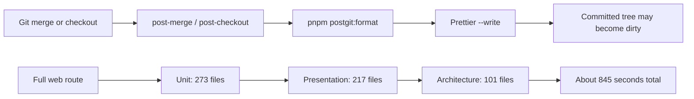
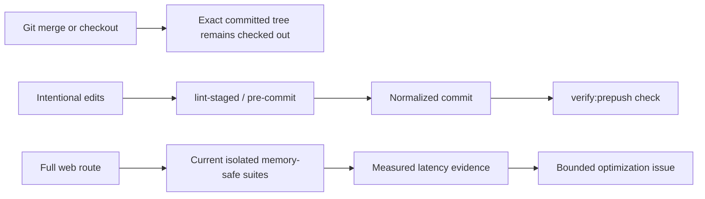

# Post-Git Clean Tree And Web Validation Latency Plan

## Think-First analysis

### Problem summary

A successful merge or branch checkout can leave tracked files modified because
the repository runs Prettier after Git has materialized the target revision.
The same developer loop also reports a web validation duration of roughly ten
minutes, so the work must distinguish accidental local mutation from deliberate
CI runtime trade-offs.

### Root cause

The `post-merge` and branch-level `post-checkout` hooks invoke
`pnpm postgit:format`. That command resolves the changed ref range and executes
`prettier --write` over matching files. A post-Git hook runs after Git has
completed the operation, so it cannot protect the operation; it can only mutate
its committed result. On Windows, the repository LF policy makes the resulting
worktree rewrite especially visible.

The full Web Frontend Tests route is slow for a separate reason. It runs the
unit, presentation, and architecture suites sequentially. The governed CI
topology deliberately uses one isolated fork per test file because a shared
fork previously exceeded the 4 GB worker limit. A measured main run processed
591 files in about 800 seconds of Vitest time; environment creation and module
collection dominated assertion time.

### Constraints and invariants

- The checked-out revision is the canonical postcondition of merge and checkout;
  post-Git hooks must not change tracked files.
- Formatting remains enforced by the pre-commit `lint-staged` rail, explicit
  `fix:changed` / `ai:preflight` commands, and `verify:prepush` checks.
- Current GitHub Issues planning makes the old `agent-lane` hook warning
  obsolete; no local workboard behavior is retained.
- Web primary-suite coverage, isolated memory safety, and the 4 GB worker limit
  remain unchanged in this slice.
- The command/query rail rule applies to the existing developer-workflow command
  catalog and the existing `SelectWebVitestChangedSuites` query. No product rail
  is added.
- ADR-0000 traceability applies to this governed workflow change. ADR-0004 and
  ADR-0005 do not govern Git hooks or frontend test execution.

### Current state



### Options considered

1. Retain post-Git formatting and automatically restore or commit its output.
   Rejected because it hides the mutation instead of removing it and can discard
   or manufacture changes.
2. Convert the formatter to `prettier --check` in the post-Git hooks. Rejected
   because the operation is already complete, duplicates the explicit validation
   rails, and adds checkout latency without an enforcement point.
3. Remove post-Git hooks and their dedicated writer, then add a CI architecture
   guard that rejects their reintroduction. Selected because it establishes an
   unambiguous no-side-effect invariant while preserving all pre-commit and
   pre-push enforcement.
4. Increase Web Vitest workers or enable `singleFork` immediately. Rejected for
   this slice because the current single-worker isolated topology is an explicit
   OOM mitigation and no new memory benchmark authorizes relaxing it.
5. Benchmark bounded batches and node-only test partitions in a sequenced issue.
   Selected as the safe next step for web latency: it targets the measured
   environment/fork cost while preserving periodic memory release and coverage.

No external library is needed; the change removes a custom post-Git writer and
uses the existing Node test and CI tool-suite rails.

### Selected option and rationale

Delete the two post-Git hooks, retire `postgit:format`, and add a repository CI
test that makes absence of `post-merge` and `post-checkout` hooks an explicit
architecture rule. The guard is discovered automatically by the existing
`test:ci-tools:static` suite, so a future reintroduction fails CI.

Keep the current Web Vitest topology unchanged until a dedicated benchmark
proves a lower-latency configuration within the same memory and coverage
constraints. Record the observed timing decomposition and create the follow-up
before closing this issue. GitHub issue
[#2900](https://github.com/dunay2/dvt/issues/2900) owns that benchmark and any
subsequent implementation.

### Fowler opportunity matrix

| Scenario                                                       | Opportunity                                            | Fowler pattern                                              | DDD owner / rail                                                | Allowed surfaces                                                                      | Test evidence                                             | Out of scope                                                             |
| -------------------------------------------------------------- | ------------------------------------------------------ | ----------------------------------------------------------- | --------------------------------------------------------------- | ------------------------------------------------------------------------------------- | --------------------------------------------------------- | ------------------------------------------------------------------------ |
| Post-Git hooks rewrite committed files                         | Hidden side effect and duplicated formatting semantics | Remove Dead Code / Replace Command with Explicit Validation | Repository developer workflow; retired `postgit:format` command | `.husky/**`, `scripts/format-git-operation-changes*`, `package.json`, command catalog | `tools/ci/post-git-hook-purity.test.mjs`; static CI tools | Changing pre-commit formatting                                           |
| Obsolete agent-lane warning remains in hooks                   | Obsolete planning authority                            | Remove Dead Code                                            | GitHub issue workflow                                           | `.husky/post-merge`, `.husky/post-checkout`                                           | same architecture guard                                   | Reintroducing local workboards                                           |
| Web full route spends most time creating isolated environments | Repeated setup constrained by memory safety            | Introduce Bounded Batch / Separate Query from Modifier      | Web CI governance; `SelectWebVitestChangedSuites`               | Documentation and follow-up issue only                                                | Measured GitHub job timings                               | Relaxing coverage, memory limits, or worker isolation without benchmarks |

## Pre-Implementation Brief

- **Mode:** Full, because the slice changes a governed developer workflow and
  removes published command surfaces.
- **Scope:** hard-cut mutating post-Git automation, add a durable purity guard,
  align the command catalog and testing guide, and publish the measured Web
  Frontend Tests diagnosis.
- **Expected outcome:** merge and branch checkout end at the exact committed
  tree without a repository hook writing afterward; the web delay has a
  traceable cause and a separately governed optimization path.
- **Risks:** a future contributor may expect automatic formatting after branch
  switches. Mitigation: retain and document the existing explicit formatting
  rails and make the obsolete behavior clear.
- **Negative coverage:** the red test must fail while either prohibited post-Git
  hook exists, and pass only after both are absent.
- **Out of scope:** changing Web Vitest worker count, suite coverage, test
  classification, or production application behavior.
- **Command/query impact:** retire the `postgit:format` developer-workflow
  command from `tools/ci/repository-command-catalog.mjs`; reuse
  `SelectWebVitestChangedSuites` unchanged for web PR routing.
- **Fowler impact:** remove hidden mutation, duplicate formatting semantics, and
  obsolete agent-lane workflow. The bounded-batch web opportunity remains for
  the linked follow-up issue.

## Target state



## Feature mechanization

```feature-mechanization
version: 1
featureId: POST-GIT-CLEAN-WEB-LATENCY-2899
mechanizationStatus: implemented
noHumanDecisionsRemaining: true
implementationPlan: docs/planning/proposals/mandatory/governance-and-docs/post-git-clean-tree-and-web-latency-plan-20260904.md
componentGuides:
  - docs/guides/testing-and-ci-capabilities.md
userStories:
  - docs/planning/state/github-mvp-issue-workflow.md
governingSources:
  - AGENTS.md
  - docs/planning/status/governance-document-rule-inventory.md
  - docs/guides/ai-work-protocol.md
  - docs/architecture/command-query-rail-governance.md
  - docs/architecture/fowler-opportunity-planning-governance.md
  - docs/architecture/components/web/frontend-test-governance-component.md
  - docs/guides/testing-and-ci-capabilities.md
allowedImplementationSurfaces:
  - .husky/post-merge
  - .husky/post-checkout
  - scripts/format-git-operation-changes.cjs
  - scripts/format-git-operation-changes.test.cjs
  - tools/ci/post-git-hook-purity.test.mjs
  - tools/ci/repository-command-catalog.mjs
  - package.json
  - docs/guides/testing-and-ci-capabilities.md
  - docs/**/index.md
  - docs/.governance/**
  - docs/planning/proposals/mandatory/governance-and-docs/post-git-clean-tree-and-web-latency-plan-20260904.md
  - docs/planning/closeouts/20260904-2899-post-git-clean-tree-and-web-latency-closeout.md
forbiddenImplementationSurfaces:
  - apps/web/src/**
  - apps/api/**
  - packages/@dvt/**
  - specs/contracts/**
commandQueryRails:
  - name: postgit:format
    type: command
    dddOwner: Repository developer workflow
    disposition: retired
  - name: SelectWebVitestChangedSuites
    type: query
    dddOwner: WebVitestChangedSuitePlan
    disposition: reused-unchanged
domainObjects:
  - name: PostGitHookPurityPolicy
    type: policy
    owner: Repository CI governance
  - name: WebVitestChangedSuitePlan
    type: read model
    owner: Web CI governance
fowlerSignals:
  - Remove Dead Code
  - Replace Command with Explicit Validation
  - Separate Query from Modifier
architectureGuards:
  - node --test tools/ci/post-git-hook-purity.test.mjs
  - pnpm test:ci-tools:static
cypressFlows:
  - N/A - repository workflow and CI test topology only
completionGate:
  - node --test tools/ci/post-git-hook-purity.test.mjs
  - pnpm test:ci-tools:static
  - pnpm lint:md
  - pnpm governance:refresh
  - pnpm docs:feature-mechanization:implementation
  - pnpm verify:prepush
redGreenCycles:
  - id: post-git-hook-purity
    redTest: node --test tools/ci/post-git-hook-purity.test.mjs
    expectedFailure: Repository post-merge and post-checkout hooks still exist and can mutate the completed Git operation.
    patchSurfaces:
      - tools/ci/post-git-hook-purity.test.mjs
      - .husky/post-merge
      - .husky/post-checkout
      - scripts/format-git-operation-changes.cjs
      - scripts/format-git-operation-changes.test.cjs
      - package.json
      - tools/ci/repository-command-catalog.mjs
    greenTest: node --test tools/ci/post-git-hook-purity.test.mjs
symbols:
  - name: PostGitHookPurityPolicy
    path: tools/ci/post-git-hook-purity.test.mjs
    dddOwner: Repository CI governance
    cqRails: [postgit:format]
    fowlerSignals: [Remove Dead Code, Separate Query from Modifier]
    architectureGuard: node --test tools/ci/post-git-hook-purity.test.mjs
    cypressCoverage: N/A - repository workflow
    unitTests: [node --test tools/ci/post-git-hook-purity.test.mjs]
```
