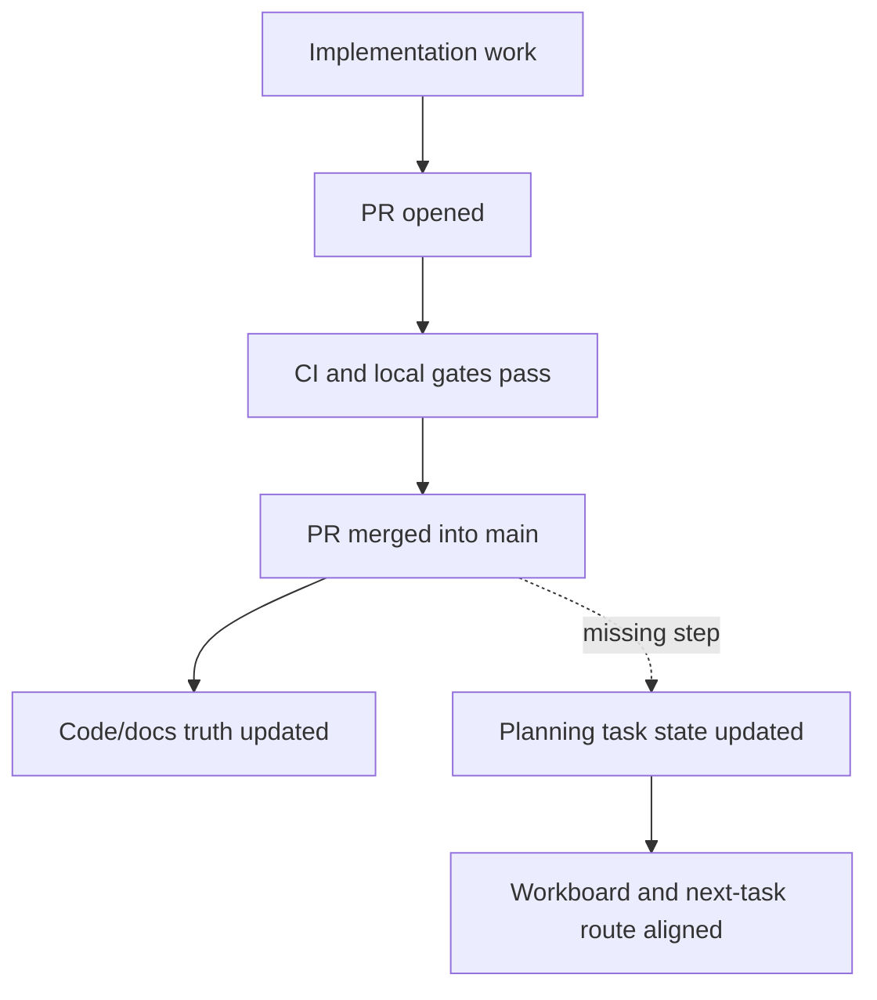
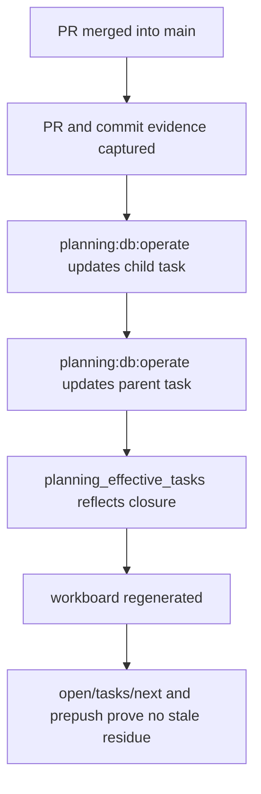

# Post-Merge Planning Closeout Drift Problem And Guardrail Plan

## Summary

The repository has enough gates to prove that code and documentation changes are
valid before merge, but the planning task lifecycle can remain stale after a PR
is merged.

That leaves old work visible as active even after its implementation is in
`main`. The result is not product debt in the runtime, but it is operational
debt in the planning system: the next-task route, lane progress, parent task
status, and workboard interpretation no longer describe the same reality as the
merged repository.

## Governing Sources

- `AGENTS.md`
- `docs/planning/status/governance-document-rule-inventory.md`
- `docs/guides/ai-work-protocol.md`
- `docs/planning/state/planning-control-tower.md`
- `docs/architecture/command-query-rail-governance.md`
- `docs/architecture/fowler-opportunity-planning-governance.md`
- `docs/planning/proposals/mandatory/governance-and-docs/planning-state-query-store-plan-20260506.md`
- `docs/planning/proposals/mandatory/governance-and-docs/governed-changed-slice-closeout-plan-20260506.md`

## Concrete Evidence

After PR `#1137` was merged into `main`, the repository code state and the
planning state diverged:

- PR `#1137` merged with squash commit `0e784c47`.
- The PR included the `F-28-B` implementation evidence for automatic Canvas
  draft save posture and visible failed-save posture.
- Local `main` was clean and synchronized with `origin/main`.
- `pnpm planning:db:query tasks --lane E --limit 150` still reported
  `F-28-B` as `in_progress` at `20%`.
- `F-28` still reported `in_progress` at `10%`, even though Stage 2 evidence had
  landed.
- `pnpm planning:db:query next` did not show `F-28-B` because that view only
  returns `queued` tasks with satisfied dependencies. That behavior is correct
  for route candidates, but misleading if used as the only continuation signal.

## Current Process Shape



The missing step is explicit planning closeout after merge.

`pnpm closeout:changed` and `pnpm verify:prepush` are necessary, but they do not
currently guarantee that the task represented by the PR has been moved through
the planning lifecycle after GitHub merge.

## Root Cause

The planning model has two different closeout boundaries:

1. Merge readiness: code, docs, tests, governance, CI, and PR metadata are valid.
2. Task lifecycle closeout: the effective planning task is updated with final
   status, progress, evidence, and parent-task impact.

The first boundary is well guarded. The second boundary is documented but not
hard to miss.

The local query store makes the state queryable, but no current post-merge guard
forces a contributor or agent to prove that:

- the child task moved out of stale active state;
- the parent task reflects landed evidence;
- the workboard was regenerated from the updated effective state;
- `open`, `tasks`, and `next` tell a coherent continuation story.

## Review Corrections Applied

This plan must be executable, not advisory. The review gaps closed here are:

- the closeout commands use the real `planning:db:operate` contract with
  `--lane`, `--task`, `--actor`, `--expected-revision`, `--reason`, and repeated
  `--evidence` flags;
- the one-time F-28-B reconciliation is separated from the reusable guardrail;
- the canonical procedural surfaces to update are named explicitly;
- the read-model checks have pass/fail criteria instead of a generic
  "verify coherence" instruction;
- the implementation slice has allowed and forbidden surfaces so it can be
  reviewed mechanically.

## Feature Mechanization Manifest

```feature-mechanization
version: 1
featureId: POST-MERGE-PLANNING-CLOSEOUT-GUARDRAIL-20260508
mechanizationStatus: closed
noHumanDecisionsRemaining: true
implementationPlan: docs/planning/proposals/mandatory/governance-and-docs/post-merge-planning-closeout-drift-problem-20260508.md
componentGuides:
  - docs/planning/state/planning-control-tower.md
  - docs/guides/ai-work-protocol.md
  - docs/planning/proposals/mandatory/governance-and-docs/planning-state-query-store-plan-20260506.md
  - docs/planning/proposals/mandatory/governance-and-docs/governed-changed-slice-closeout-plan-20260506.md
userStories:
  - docs/planning/proposals/mandatory/governance-and-docs/post-merge-planning-closeout-drift-problem-20260508.md
governingSources:
  - AGENTS.md
  - docs/planning/status/governance-document-rule-inventory.md
  - docs/guides/ai-work-protocol.md
  - docs/planning/state/planning-control-tower.md
  - docs/architecture/command-query-rail-governance.md
  - docs/architecture/fowler-opportunity-planning-governance.md
allowedImplementationSurfaces:
  - package.json
  - scripts/planning-post-merge-closeout-check.cjs
  - scripts/planning-post-merge-closeout-check.test.cjs
  - docs/guides/ai-work-protocol.md
  - docs/planning/state/planning-control-tower.md
  - docs/planning/proposals/mandatory/governance-and-docs/post-merge-planning-closeout-drift-problem-20260508.md
  - docs/planning/proposals/index.md
  - docs/planning/index.md
  - docs/planning/status/**
  - docs/.manifest.json
forbiddenImplementationSurfaces:
  - apps/**
  - packages/**
  - specs/contracts/**
  - .github/workflows/**
  - tools/planning-db/migrations/**
commandQueryRails:
  - name: QueryPlanningEffectiveTasks
    type: query
    dddOwner: Planning query store
  - name: QueryPlanningOpenTasks
    type: query
    dddOwner: Planning query store
  - name: QueryPlanningNextTasks
    type: query
    dddOwner: Planning query store
  - name: UpdatePlanningTaskState
    type: command
    dddOwner: Planning task lifecycle
  - name: ValidatePostMergePlanningCloseout
    type: query
    dddOwner: Planning closeout guardrail
domainObjects:
  - name: PlanningTaskCloseoutProof
    type: evidence record
    owner: Planning task lifecycle
  - name: PlanningEffectiveTaskReadModel
    type: read-model
    owner: Planning query store
  - name: PostMergePlanningCloseoutGuardrail
    type: policy
    owner: Planning closeout guardrail
fowlerSignals:
  - Documentation Drift
  - Hidden Authority
  - Duplicate Semantics
  - Explicit Gate
architectureGuards:
  - pnpm exec markdownlint-cli2 --ignore-path .markdownlintignore docs/planning/proposals/mandatory/governance-and-docs/post-merge-planning-closeout-drift-problem-20260508.md
  - node --test scripts/planning-post-merge-closeout-check.test.cjs
  - pnpm docs:feature-mechanization:implementation
cypressFlows:
  - not-applicable: Planning closeout guardrail has no browser workflow.
completionGate:
  - pnpm exec markdownlint-cli2 --ignore-path .markdownlintignore docs/planning/proposals/mandatory/governance-and-docs/post-merge-planning-closeout-drift-problem-20260508.md
  - node --test scripts/planning-post-merge-closeout-check.test.cjs
  - pnpm governance:refresh
  - pnpm ci:docs
  - pnpm verify:prepush
redGreenCycles:
  - id: post-merge-plan-surface-guard
    redTest: pnpm docs:feature-mechanization:implementation
    expectedFailure: Post-merge planning closeout plan is outside allowedImplementationSurfaces before this manifest declares it.
    patchSurfaces:
      - docs/planning/proposals/mandatory/governance-and-docs/post-merge-planning-closeout-drift-problem-20260508.md
    greenTest: pnpm docs:feature-mechanization:implementation
  - id: closeout-check-command-contract
    redTest: node --test scripts/planning-post-merge-closeout-check.test.cjs
    expectedFailure: Post-merge planning closeout check command does not exist yet.
    patchSurfaces:
      - package.json
      - scripts/planning-post-merge-closeout-check.cjs
      - scripts/planning-post-merge-closeout-check.test.cjs
      - docs/guides/ai-work-protocol.md
      - docs/planning/state/planning-control-tower.md
    greenTest: node --test scripts/planning-post-merge-closeout-check.test.cjs
symbolDefaults: &postMergePlanningCloseoutSymbolDefaults
  dddOwner: Planning closeout guardrail
  cqRails:
    - QueryPlanningEffectiveTasks
    - UpdatePlanningTaskState
    - ValidatePostMergePlanningCloseout
  fowlerSignals:
    - Documentation Drift
    - Hidden Authority
    - Explicit Gate
  architectureGuard: pnpm docs:feature-mechanization:implementation
  cypressCoverage: "not-applicable: Planning closeout guardrail has no browser workflow."
  unitTests:
    - node --test scripts/planning-post-merge-closeout-check.test.cjs
symbols:
  - <<: *postMergePlanningCloseoutSymbolDefaults
    name: PostMergePlanningCloseoutPlan
    path: docs/planning/proposals/mandatory/governance-and-docs/post-merge-planning-closeout-drift-problem-20260508.md
  - <<: *postMergePlanningCloseoutSymbolDefaults
    name: parseArgs
    path: scripts/planning-post-merge-closeout-check.cjs
  - <<: *postMergePlanningCloseoutSymbolDefaults
    name: buildCloseoutCheck
    path: scripts/planning-post-merge-closeout-check.cjs
  - <<: *postMergePlanningCloseoutSymbolDefaults
    name: evaluateCloseoutState
    path: scripts/planning-post-merge-closeout-check.cjs
  - <<: *postMergePlanningCloseoutSymbolDefaults
    name: main
    path: scripts/planning-post-merge-closeout-check.cjs
```

## Fowler Opportunity Classification

| Opportunity          | Signal                                                                              | Planning impact                                                 |
| -------------------- | ----------------------------------------------------------------------------------- | --------------------------------------------------------------- |
| Documentation drift  | Work is merged while planning state still says active                               | Update task state and parent evidence in the same closeout path |
| Hidden authority     | Git merge becomes the implied task state authority                                  | Route task state through `planning:db:operate`                  |
| Duplicate semantics  | `next` is read as continuation while it only means dependency-satisfied queued work | Separate active-continuation and next-candidate queries         |
| Test-only confidence | CI green is treated as full workflow closure                                        | Add a post-merge planning closeout proof                        |

## Command And Query Rail Posture

No product runtime rail is changed by this document.

The affected planning/governance rails are:

- `QueryPlanningEffectiveTasks`: query the effective task read model.
- `QueryPlanningOpenTasks`: query non-done, non-blocked work.
- `QueryPlanningNextTasks`: query dependency-satisfied queued route candidates.
- `UpdatePlanningTaskState`: command to update task status, progress, claim, and
  evidence through the planning DB overlay.
- `GeneratePlanningWorkboard`: command to regenerate route views from effective
  planning state.
- `ValidatePlanningStateDrift`: query/check that the local planning DB and
  tracked bootstrap sources remain aligned.

## Target Closeout Rule

After a PR that implements or validates an existing planning task is merged, the
task is not operationally closed until this sequence has evidence:

```powershell
$actor = "<human-or-agent-id>"
$lane = "<lane-id>"
$task = "<child-task-id>"
$parent = "<parent-task-id>"

pnpm planning:db:import
pnpm planning:db:operate task show --lane $lane --task $task
pnpm planning:db:operate task show --lane $lane --task $parent
pnpm planning:db:operate task update --lane $lane --task $task --actor $actor --status done --progress 100 --reason "Merged PR #<number> with commit <sha>" --evidence "PR #<number>" --evidence "commit <sha>" --expected-revision <child-current-revision>
pnpm planning:db:operate task update --lane $lane --task $parent --actor $actor --progress <parent-progress-after-child-closeout> --reason "Recorded landed child evidence from PR #<number>" --evidence "PR #<number>" --evidence "commit <sha>" --expected-revision <parent-current-revision>
pnpm planning:db:operate audit --lane $lane --task $task --limit 5
pnpm planning:db:operate audit --lane $lane --task $parent --limit 5
pnpm planning:db:query open --lane $lane --limit 150
pnpm planning:db:query tasks --lane $lane --limit 150
pnpm planning:db:query next --lane $lane --limit 150
pnpm planning:db:export:check
pnpm docs:workboard:generate
pnpm verify:prepush
```

`<child-current-revision>` and `<parent-current-revision>` are the revision
values returned by `task show`. If `localState` is absent, the imported task is
at revision `0`. The command must fail rather than overwrite a different local
operation when the revision has moved.

The rule is the important part: task lifecycle state must be closed explicitly
through `planning:db:operate`, then verified through the read model and exported
planning surfaces.

## Immediate F-28-B Cleanup Slice

The current cleanup should not create a new feature or a new task. It should
reconcile the existing state with concrete PR evidence:

- `F-28-B` should move out of stale `in_progress` if PR `#1137` is accepted as
  its closure evidence.
- `F-28` should record that Stage 2 evidence landed and that the remaining
  sequence is Stage 3 export/import proof plus any explicitly documented
  residual debt.
- The workboard should be regenerated from the updated planning DB state.
- The final check should prove that `F-28-B` no longer appears as active work if
  it is closed, while `F-28` still accurately represents the parent sequence.

Concrete reconciliation route:

```powershell
pnpm planning:db:import
pnpm planning:db:operate task show --lane E --task F-28-B
pnpm planning:db:operate task show --lane E --task F-28
pnpm planning:db:operate task update --lane E --task F-28-B --actor codex --status done --progress 100 --reason "Merged PR #1137 with squash commit 0e784c47" --evidence "PR #1137" --evidence "commit 0e784c47" --expected-revision <F-28-B-current-revision>
pnpm planning:db:operate task update --lane E --task F-28 --actor codex --progress <F-28-progress-after-stage-2> --reason "Recorded F-28-B landed evidence from PR #1137" --evidence "PR #1137" --evidence "commit 0e784c47" --expected-revision <F-28-current-revision>
pnpm planning:db:query open --lane E --limit 150
pnpm planning:db:query tasks --lane E --limit 150
pnpm planning:db:export:check
pnpm docs:workboard:generate
pnpm verify:prepush
```

The parent progress value is not inferred automatically by this problem
statement. It must be chosen from the accepted F-28 stage model before the
operation is executed and recorded in the command reason.

## Reusable Guardrail Slice

The reusable change should make missed planning closeout visible without making
GitHub merge the planning authority.

Allowed implementation surfaces:

- `docs/planning/state/planning-control-tower.md`
- `docs/guides/ai-work-protocol.md`
- `docs/planning/proposals/mandatory/governance-and-docs/post-merge-planning-closeout-drift-problem-20260508.md`
- `scripts/planning-post-merge-closeout-check.cjs`
- `scripts/planning-post-merge-closeout-check.test.cjs`
- `package.json`

Forbidden implementation surfaces for this slice:

- `apps/**`
- `packages/**`
- `specs/contracts/**`
- `.github/workflows/**`
- `tools/planning-db/migrations/**`

The first implementation should be a local check command, not a workflow change.
The check must accept the lane, child task, optional parent task, PR reference,
and commit reference, then fail when the effective read model still shows stale
active state after closeout.

Expected command shape:

```powershell
pnpm planning:closeout:check --lane <lane-id> --task <child-task-id> --parent <parent-task-id> --evidence "PR #<number>" --evidence "commit <sha>"
```

Expected fail-closed conditions:

- the child task exists in `planning_effective_tasks` with `status` other than
  `done` or `review` after a closeout that claims implementation is merged;
- the child task progress is below `100` when status is `done`;
- the required PR or commit evidence is absent from the effective child task;
- the parent task was provided and does not include the required PR or commit
  evidence;
- `pnpm planning:db:export:check` fails after the operation;
- generated workboard output still exposes the child as active implementation
  work after the child has been marked `done`.

Expected pass conditions:

- `planning:db:operate audit` shows the child closeout operation and, when
  provided, the parent evidence update;
- `planning:db:query tasks --lane <lane-id>` shows the child with the accepted
  terminal status, progress, and evidence;
- `planning:db:query open --lane <lane-id>` no longer shows a `done` child;
- `planning:db:query next --lane <lane-id>` remains limited to
  dependency-satisfied queued route candidates;
- `pnpm verify:prepush` passes after regenerated planning surfaces are staged.

## Canonical Procedure Updates

The guardrail must update the canonical procedure, not only this proposal:

- `docs/planning/state/planning-control-tower.md` should include a post-merge
  closeout subsection under "Mandatory Update Map By Task Type".
- `docs/guides/ai-work-protocol.md` should name planning closeout as a required
  post-merge step when the PR implements an existing planning task.
- `package.json` should expose the check as `planning:closeout:check` only after
  the script and test exist.
- The check should remain local first. CI workflow enforcement is a later slice
  only after the local contract is stable.

## Validation Plan

The implementation slice is not complete until these commands pass:

```powershell
pnpm exec markdownlint-cli2 --ignore-path .markdownlintignore docs/planning/proposals/mandatory/governance-and-docs/post-merge-planning-closeout-drift-problem-20260508.md
pnpm test -- scripts/planning-post-merge-closeout-check.test.cjs
pnpm governance:refresh
pnpm ci:docs
pnpm verify:prepush
```

If the script is not implemented in the same slice, only the Markdown and docs
validation apply, and the plan must remain `status: Review`.

## Non-Goals

- Do not change product runtime behavior.
- Do not touch `apps/**`, `packages/**`, contracts, adapters, planner, engine, or
  workflow files in this problem statement.
- Do not make Postgres the canonical repository review authority.
- Do not delete lane YAML compatibility surfaces.
- Do not make `planning_next_tasks` include `in_progress` tasks without a
  separate command/query design decision.
- Do not infer task closure from Git merge alone.
- Do not add workflow enforcement before the local closeout command is proven.

## Target State



The desired posture is simple: adding new work or merging implementation must
not leave stale planning state behind.
