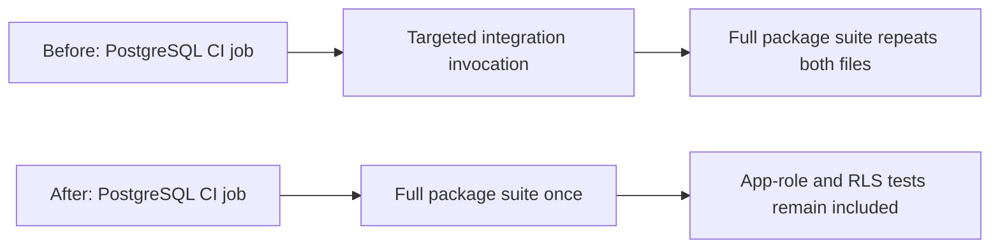
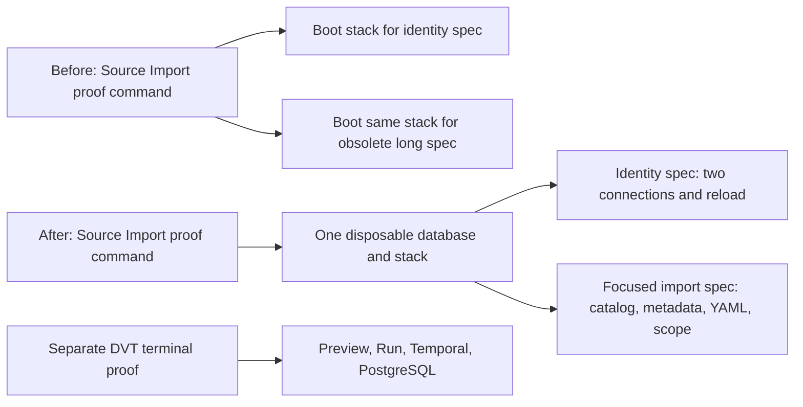

# PostgreSQL Test Suite single execution

## Decision

The `adapter-postgres` job in `.github/workflows/test.yml` runs the complete
package Vitest suite once with `DVT_PG_INTEGRATION=1`. Its earlier targeted
invocation of `PostgresAppRoleRuntime.integration.test.ts` and
`PostgresTenantRlsEnforcement.integration.test.ts` is redundant: the package
`vitest.config.ts` includes `test/**/*.test.ts`, and both files match. The
targeted command has the same job environment and does not add an independent
security or authorization posture.

This change removes one invocation, not either test file, the PostgreSQL
service, the app-role provisioning step, the import-alias guard or the Test
Suite required aggregate. The existing `ValidateTestSuiteEvidenceResult`
query in the Engineering / CI Governance context remains the result rail; no
new check or parallel evidence owner is introduced. A contract test inspects
the workflow, package command, Vitest include pattern and integration flag so
the deduplication cannot silently exclude the two integration files later.

The historical evidence documents retain the commands they actually ran.
They are not rewritten as if a later CI optimization had occurred earlier.

## Source Import browser proof

The Source Import runner has a second, independent duplication: it launches the
same API, Vite, Temporal and disposable PostgreSQL stack once per browser spec.
The identity spec already proves two real imports on distinct connections and
reload persistence. The other spec is a single, overlong browser scenario that
begins with the retired dbt Canvas creation screen, so it currently fails before
exercising import. Its dbt-model SQL and old Preview assertions do not describe
the active DVT Canvas. Current DVT Preview/Run remains covered by the protected
terminal-Transform proof; Source Import itself stays a real UI-to-API-to-
PostgreSQL proof, with no draft or provider stubs.

The focused spec retains the canonical test path so architecture inventory and
the Source Import command rail keep one evidence identity. The old dbt-specific
selectors and presentation checks are removed rather than patched. Presentation
details remain in the owning component tests; project-scope isolation, real
source metadata, generated YAML, and the imported graph node remain in the
browser proof. The two specs use distinct governed projects under one runtime.
Failure must fail the command, and the run-scoped database must still be
disposed after either result.

The separately owned first-authoring proof also enters through retired
"Create canvas" copy and a retired menu hierarchy. Its invariant is still
needed: create the first DVT node through the UI, move it, persist the layout,
and restore it after reload. Update only the entry and node-creation actions
to the current single template choice and registered DVT Transform catalog
action; keep the drag and persistence assertions and its disposable database.
Its runner need only one transformation project and can start the API with the
same direct `tsx watch` command already used by the live import runner. Calling
the package `dev` lifecycle instead invokes `predev`, which rebuilds 19
dependency packages, including nested prebuild graphs, before the browser can
start. This startup change does not skip a CI gate: the affected package build,
lint and typecheck remain in the normal validation baseline.
The first-authoring runner also forced Docker Cypress on Windows and failed
before test execution (0 ms), whereas Source Import uses the locally installed
Cypress there. A single invocation builder owns this host distinction for both
proof runners: native Cypress on Windows, the existing Docker image on POSIX.
It changes neither assertions nor protected API scope; the runner still fails
if the real browser command fails.
After that host correction, the first-authoring proof exposes a second obsolete
shortcut: it grants a fabricated project ID in PostgreSQL but never creates a
Project. The protected `GetEffectiveWorkspaceContext` query correctly returns
403 and opens project onboarding, so the browser never reaches Canvas. The
runner must grant tenant-level `project:create`, invoke the existing governed
`CreateProject` command (`POST /projects`) and use its returned default workspace
for both Vite and Cypress. A fake grant or direct project-table insert would
hide the product boundary. The canonical rails are `CreateProject` and
`GetEffectiveWorkspaceContext` in Project Onboarding, documented in the
frontend command/query inventory and app-shell onboarding component.
The proof's private mouse-event drag implementation duplicated the current
Canvas browser interaction support; reuse `dragCanvasNodeByViewportDelta` while
keeping the independent persisted-position and reload assertions.
The old reload assertion compared screen pixels. A single-node Canvas may
fit/center after reload, yielding the same screen position even when its graph
coordinates were saved and restored. Compare the node's graph transform
before/after reload, while retaining the API layout-position assertion; this
tests persistence rather than viewport framing.
The first-node policy and its component guide also named the former
`Transform 1`, while the current `dvt:transform` registration labels newly
created nodes `Model 1`. Align that policy and its pure tests with the actual
authoring command; do not add an alias or change product naming merely to make
the old proof pass.

Governing sources: `AGENTS.md`, the governance document-rule inventory,
`.github/workflows/test.yml`, `packages/@dvt/adapter-postgres/package.json`,
`packages/@dvt/adapter-postgres/vitest.config.ts`,
`docs/guides/pr-preflight-and-ci-triage.md`, and the Planning DB
`ValidateTestSuiteEvidenceResult` rail.
