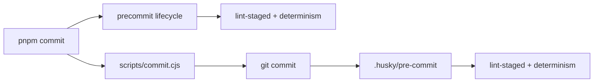
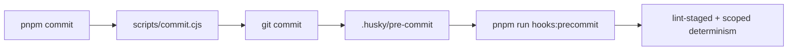

# Precommit Hook Lifecycle Dedupe Plan

## Owned Concern

This plan owns the repository hook wiring correction that prevents `pnpm
commit` from running the pre-commit gate twice. The slice is limited to local
Git hook and CI-tooling governance. It does not change application runtime
behavior, contracts, adapters, or browser flows.

## Current State

Before this change, the root package defined a script named `precommit`.
Because `pnpm commit` runs `precommit` as a lifecycle script before the
`commit` script, and `scripts/commit.cjs` then delegates to `git commit`, the
same gate also ran through `.husky/pre-commit`.



The result was duplicate local work without adding coverage.

## Target State

The hook command has an explicit non-lifecycle name. `pnpm commit` no longer
gets an automatic `precommit` lifecycle run, while the real Git hook still
executes the same gate once.



## Command And Query Catalog

| Rail                                  | Type    | DDD owner                      | Implementation surface                       | Expected result                                                                |
| ------------------------------------- | ------- | ------------------------------ | -------------------------------------------- | ------------------------------------------------------------------------------ |
| `CheckPrecommitHookLifecycleDedupe`   | query   | Repository Git hook lifecycle  | `tools/ci/precommit-hook-wiring.test.mjs`    | Fails when the root package defines `precommit` or Husky calls that lifecycle. |
| `ApplyPrecommitHookLifecycleDedupe`   | command | Repository Git hook lifecycle  | `package.json`, `.husky/pre-commit`          | Renames the hook script to `hooks:precommit` and keeps the Git hook blocking.  |
| `DocumentPrecommitHookLifecycleState` | command | Repository CI process guidance | `docs/guides/testing-and-ci-capabilities.md` | Documents the current single-run pre-commit command path.                      |

No parallel hook command or relaxed validation path is allowed in this feature.

## User Stories

- As a contributor, I need `pnpm commit` to run the pre-commit gate once so
  local commit latency is not doubled by lifecycle wiring.
- As a CI maintainer, I need a merge-gated test to prevent reintroducing a root
  `precommit` script that silently duplicates Husky.
- As an agent, I need the active process docs to name `hooks:precommit` so I do
  not keep invoking or documenting the obsolete lifecycle path.

Negative scenarios:

- If `package.json` defines a root script named `precommit`, the CI tool
  contract test fails.
- If `.husky/pre-commit` calls `pnpm run precommit`, the CI tool contract test
  fails.
- If this feature touches app, package runtime, adapter, contract, or workflow
  files, the feature mechanization diff guard fails.

## Feature Mechanization Manifest

```feature-mechanization
version: 1
featureId: CI-PRECOMMIT-LIFECYCLE-DEDUPE
mechanizationStatus: implemented
noHumanDecisionsRemaining: true
implementationPlan: docs/planning/proposals/mandatory/governance-and-docs/precommit-hook-lifecycle-dedupe-plan-20260508.md
componentGuides:
  - docs/guides/testing-and-ci-capabilities.md
  - docs/architecture/components/engine/dev/determinism-tooling.md
userStories:
  - docs/planning/proposals/mandatory/governance-and-docs/precommit-hook-lifecycle-dedupe-plan-20260508.md
governingSources:
  - AGENTS.md
  - docs/planning/status/governance-document-rule-inventory.md
  - docs/guides/ai-work-protocol.md
  - docs/guides/testing-and-ci-capabilities.md
  - docs/architecture/command-query-rail-governance.md
  - docs/architecture/fowler-opportunity-planning-governance.md
allowedImplementationSurfaces:
  - .husky/pre-commit
  - package.json
  - tools/ci/precommit-hook-wiring.test.mjs
  - docs/.manifest.json
  - docs/**/index.md
  - docs/architecture/components/engine/dev/determinism-tooling.md
  - docs/guides/testing-and-ci-capabilities.md
  - docs/planning/proposals/mandatory/governance-and-docs/precommit-hook-lifecycle-dedupe-plan-20260508.md
  - docs/planning/proposals/mandatory/governance-and-docs/ci-delivery-governance-consolidated-action-plan-20260331.md
  - docs/planning/reviews/ci-and-delivery/20260422-environment-configuration-audit-review.md
  - docs/planning/status/**
forbiddenImplementationSurfaces:
  - apps/**
  - packages/**
  - specs/contracts/**
  - .github/workflows/**
  - docs/archive/**
commandQueryRails:
  - name: CheckPrecommitHookLifecycleDedupe
    type: query
    dddOwner: Repository Git hook lifecycle
  - name: ApplyPrecommitHookLifecycleDedupe
    type: command
    dddOwner: Repository Git hook lifecycle
  - name: DocumentPrecommitHookLifecycleState
    type: command
    dddOwner: Repository CI process guidance
domainObjects:
  - name: PrecommitHookCommand
    type: repository hook command
    owner: Repository Git hook lifecycle
  - name: CommitHelperLifecycle
    type: package-manager lifecycle boundary
    owner: Repository Git hook lifecycle
  - name: HookWiringContract
    type: CI tool contract
    owner: Repository Git hook lifecycle
fowlerSignals:
  - Duplicate governance gate
  - Hidden lifecycle coupling
  - Avoidable local cost
architectureGuards:
  - node --test tools/ci/precommit-hook-wiring.test.mjs
  - pnpm test:ci-tools
  - pnpm docs:feature-mechanization:implementation
cypressFlows:
  - N/A - repository hook wiring only
completionGate:
  - node --test tools/ci/precommit-hook-wiring.test.mjs
  - pnpm test:ci-tools
  - pnpm governance:refresh
  - pnpm lint:md:changed
  - pnpm docs:feature-mechanization:implementation
  - pnpm verify:prepush
redGreenCycles:
  - id: precommit-lifecycle-dedupe
    redTest: node --test tools/ci/precommit-hook-wiring.test.mjs
    expectedFailure: package.json defines a root precommit lifecycle script before the hook is renamed.
    patchSurfaces:
      - package.json
      - .husky/pre-commit
      - tools/ci/precommit-hook-wiring.test.mjs
    greenTest: node --test tools/ci/precommit-hook-wiring.test.mjs
  - id: feature-mechanization-closeout
    redTest: pnpm docs:feature-mechanization:implementation
    expectedFailure: hook lifecycle dedupe files are outside allowedImplementationSurfaces before this manifest declares them.
    patchSurfaces:
      - docs/planning/proposals/mandatory/governance-and-docs/precommit-hook-lifecycle-dedupe-plan-20260508.md
      - docs/planning/status/**
    greenTest: pnpm docs:feature-mechanization:implementation
symbols:
  - name: repoRoot
    path: tools/ci/precommit-hook-wiring.test.mjs
    dddOwner: HookWiringContract
    cqRails:
      - CheckPrecommitHookLifecycleDedupe
    fowlerSignals:
      - Hidden lifecycle coupling
    architectureGuard: node --test tools/ci/precommit-hook-wiring.test.mjs
    cypressCoverage: N/A - repository hook wiring only
    unitTests:
      - node --test tools/ci/precommit-hook-wiring.test.mjs
  - name: readPackageJson
    path: tools/ci/precommit-hook-wiring.test.mjs
    dddOwner: HookWiringContract
    cqRails:
      - CheckPrecommitHookLifecycleDedupe
    fowlerSignals:
      - Hidden lifecycle coupling
    architectureGuard: node --test tools/ci/precommit-hook-wiring.test.mjs
    cypressCoverage: N/A - repository hook wiring only
    unitTests:
      - node --test tools/ci/precommit-hook-wiring.test.mjs
  - name: readPreCommitHook
    path: tools/ci/precommit-hook-wiring.test.mjs
    dddOwner: HookWiringContract
    cqRails:
      - CheckPrecommitHookLifecycleDedupe
    fowlerSignals:
      - Duplicate governance gate
    architectureGuard: node --test tools/ci/precommit-hook-wiring.test.mjs
    cypressCoverage: N/A - repository hook wiring only
    unitTests:
      - node --test tools/ci/precommit-hook-wiring.test.mjs
```

## Validation Plan

```powershell
node --test tools/ci/precommit-hook-wiring.test.mjs
pnpm test:ci-tools
pnpm governance:refresh
pnpm lint:md:changed
pnpm docs:feature-mechanization:implementation
pnpm verify:prepush
```
