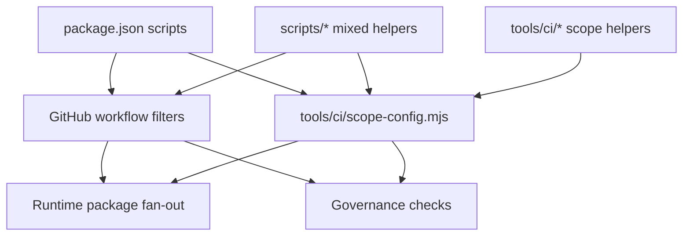
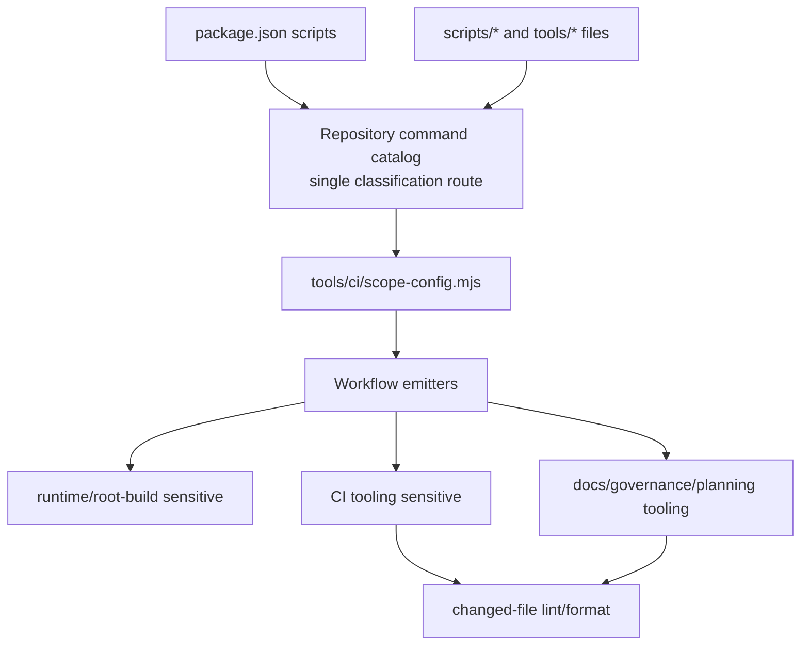

# Repository Command Catalog Normalization Implementation Plan

> **For agentic workers:** REQUIRED SUB-SKILL: Use
> superpowers:subagent-driven-development (recommended) or
> superpowers:executing-plans to implement this plan task-by-task. Steps use
> checkbox (`- [ ]`) syntax for tracking.

**Goal:** Create one canonical command and script classification route so CI
scope decisions stop relying on repetitive hand-maintained path and command
lists.

**Architecture:** Keep `package.json` as the human command registry, but add a
repository-owned command catalog module that classifies package scripts,
script-file paths, and CI helper files into stable domains and CI sensitivity
classes. CI scope tooling must consume that catalog instead of re-deriving
script semantics from raw path patterns. Physical script moves are deferred
until the catalog proves every current script has an owner and compatibility
route.

**Tech Stack:** Node.js `node:test`, GitHub Actions, `tools/ci/*` helpers,
`package.json` command registry, Markdown governance docs, `pnpm test:ci-tools`,
`pnpm verify:prepush`.

---

## Owned Concern

This plan owns repository command and script classification for CI/governance
scope decisions.

It does not own product runtime behavior, package public APIs, database
migrations, Temporal workflow semantics, GitHub branch protection settings, or
large physical file moves.

## Triggering Evidence

The repository currently has command and script semantics split across these
surfaces:

- `package.json` scripts;
- `scripts/*.cjs`, `scripts/*.js`, shell helpers, and PowerShell helpers;
- `tools/ci/*.mjs` and `tools/ci/*.js`;
- `tools/docs/*.ts` documentation governance command entry points;
- `.github/scripts/*`;
- package scripts that target `tools/ops/*`;
- workflow inline path filters and generated path-filter adapters;
- `tools/ci/policy/*.json`;
- `tools/ci/scope-config.mjs`.

That split produces two problems:

- runtime-sensitive scripts and governance-only scripts both live under
  `scripts/`;
- CI scope logic has to guess intent from path names and repeated lists.

The immediate symptom is that small planning/governance command additions, such
as `governance:db:query`, can be classified like runtime-wide root changes.

## Current State Diagram



## Target State Diagram



## Canonical Routing Decision

The first slice creates a **semantic canonical route**, not a mass file move.

Accepted route:

- `package.json` remains the contributor-facing command registry.
- `tools/ci/repository-command-catalog.mjs` becomes the executable command and
  script classification source.
- `tools/ci/scope-config.mjs` consumes catalog classifications.
- `scripts/` remains a mixed legacy execution directory until the catalog can
  prove which scripts are safe to move.
- Future file moves must keep package command aliases stable or provide
  explicit compatibility wrappers in the same PR.

Rejected route:

- moving all scripts into domain folders before classification. That would
  couple renames, package command churn, workflow updates, and CI behavior in
  one high-blast-radius slice.

## Command And Query Catalog

<!-- markdownlint-disable MD060 -->

| Rail                                | Type  | DDD owner                      | Implementation surface                                               | Expected result                                                                  |
| ----------------------------------- | ----- | ------------------------------ | -------------------------------------------------------------------- | -------------------------------------------------------------------------------- |
| `ClassifyRepositoryCommand`         | query | Repository command catalog     | `tools/ci/repository-command-catalog.mjs`                            | Classifies one package script or file path into domain and CI sensitivity.       |
| `QueryRepositoryCommandCatalog`     | query | Repository command catalog     | `tools/ci/repository-command-catalog.mjs`, package command registry  | Builds a deterministic catalog from `package.json` and repository script paths.  |
| `ValidateRepositoryCommandCatalog`  | query | Repository CI tool contracts   | `tools/ci/repository-command-catalog.test.mjs`, `pnpm test:ci-tools` | Fails when a command or script path lacks a catalog class.                       |
| `ConsumeCommandCatalogForCiScope`   | query | Repository CI scope policy     | `tools/ci/scope-config.mjs`, workflow emitters                       | Uses command classes instead of repeated path-only lists for CI fan-out.         |
| `DocumentRepositoryCommandTaxonomy` | query | Repository delivery governance | `docs/guides/testing-and-ci-capabilities.md`, this plan              | Documents where commands live, what owns them, and how CI interprets each class. |

<!-- markdownlint-enable MD060 -->

No workflow may introduce a new hand-written package-script or script-path
classification once the catalog can represent that intent.

## Feature Mechanization Manifest

```feature-mechanization
version: 1
featureId: REPOSITORY-COMMAND-CATALOG-NORMALIZATION-20260508
mechanizationStatus: closed
noHumanDecisionsRemaining: true
implementationPlan: docs/planning/proposals/mandatory/governance-and-docs/repository-command-catalog-normalization-plan-20260508.md
componentGuides:
  - docs/guides/testing-and-ci-capabilities.md
  - docs/planning/proposals/mandatory/governance-and-docs/ci-scope-optimization-plan-20260508.md
  - docs/planning/proposals/mandatory/governance-and-docs/ci-delivery-governance-consolidated-action-plan-20260331.md
  - docs/architecture/components/ci-governance/system-governance-generation-workflow-component.md
userStories:
  - docs/planning/proposals/mandatory/governance-and-docs/repository-command-catalog-normalization-plan-20260508.md
governingSources:
  - AGENTS.md
  - docs/planning/status/governance-document-rule-inventory.md
  - docs/guides/ai-work-protocol.md
  - docs/guides/testing-and-ci-capabilities.md
  - docs/architecture/command-query-rail-governance.md
  - docs/architecture/fowler-opportunity-planning-governance.md
allowedImplementationSurfaces:
  - package.json
  - tools/ci/repository-command-catalog.mjs
  - tools/ci/repository-command-catalog.test.mjs
  - tools/ci/scope-config.mjs
  - tools/ci/emit-scope.mjs
  - tools/ci/emit-workspace-matrix.mjs
  - tools/ci/policy/workflow-scope.json
  - tools/ci/validate-policy.js
  - tools/ci/workflow-scope-classification.test.mjs
  - tools/ci/package-json-scope-classification.test.mjs
  - tools/ci/emit-scope.test.mjs
  - tools/ci/emit-workspace-matrix.test.mjs
  - tools/ci/workflow-pattern-parity.test.mjs
  - tools/ci/test/path-matcher.test.mjs
  - docs/guides/testing-and-ci-capabilities.md
  - docs/planning/proposals/mandatory/governance-and-docs/repository-command-catalog-normalization-plan-20260508.md
  - docs/planning/proposals/mandatory/governance-and-docs/ci-scope-optimization-plan-20260508.md
  - docs/planning/proposals/mandatory/governance-and-docs/ci-delivery-governance-consolidated-action-plan-20260331.md
  - docs/planning/status/**
  - docs/.manifest.json
  - docs/**/index.md
forbiddenImplementationSurfaces:
  - apps/**
  - packages/**
  - specs/contracts/**
  - .golden/**
  - docs/archive/**
commandQueryRails:
  - name: ClassifyRepositoryCommand
    type: query
    dddOwner: Repository command catalog
  - name: QueryRepositoryCommandCatalog
    type: query
    dddOwner: Repository command catalog
  - name: ValidateRepositoryCommandCatalog
    type: query
    dddOwner: Repository CI tool contracts
  - name: ConsumeCommandCatalogForCiScope
    type: query
    dddOwner: Repository CI scope policy
  - name: DocumentRepositoryCommandTaxonomy
    type: query
    dddOwner: Repository delivery governance
domainObjects:
  - name: RepositoryCommand
    type: package script or script-file command descriptor
    owner: Repository command catalog
  - name: RepositoryCommandDomain
    type: command taxonomy value
    owner: Repository command catalog
  - name: RepositoryCommandSensitivity
    type: CI scope classification value
    owner: Repository CI scope policy
  - name: RepositoryCommandCatalog
    type: deterministic command classification read model
    owner: Repository command catalog
fowlerSignals:
  - Primitive obsession in script path and package-script scope decisions
  - Shotgun surgery from repeated command lists in package scripts and workflows
  - Divergent change between package command names, script files, and CI filters
architectureGuards:
  - node --test tools/ci/repository-command-catalog.test.mjs tools/ci/workflow-scope-classification.test.mjs tools/ci/package-json-scope-classification.test.mjs
  - pnpm test:ci-tools
  - pnpm docs:feature-mechanization:implementation
cypressFlows:
  - N/A - CI and repository tooling only
completionGate:
  - node --test tools/ci/repository-command-catalog.test.mjs tools/ci/workflow-scope-classification.test.mjs tools/ci/package-json-scope-classification.test.mjs tools/ci/emit-scope.test.mjs tools/ci/emit-workspace-matrix.test.mjs tools/ci/workflow-pattern-parity.test.mjs tools/ci/test/path-matcher.test.mjs
  - pnpm test:ci-tools
  - pnpm governance:refresh
  - pnpm docs:feature-mechanization -- --feature REPOSITORY-COMMAND-CATALOG-NORMALIZATION-20260508
  - pnpm docs:feature-mechanization:implementation
  - pnpm verify:prepush
redGreenCycles:
  - id: catalog-classifies-current-repository-commands
    redTest: node --test tools/ci/repository-command-catalog.test.mjs
    expectedFailure: repository command catalog module does not exist yet.
    patchSurfaces:
      - tools/ci/repository-command-catalog.mjs
      - tools/ci/repository-command-catalog.test.mjs
    greenTest: node --test tools/ci/repository-command-catalog.test.mjs
  - id: package-script-governance-aliases-have-one-ci-class
    redTest: node --test tools/ci/repository-command-catalog.test.mjs tools/ci/package-json-scope-classification.test.mjs
    expectedFailure: package scripts such as governance:db:query and planning:db:query are not represented by one shared command class.
    patchSurfaces:
      - tools/ci/repository-command-catalog.mjs
      - tools/ci/package-json-scope-classification.test.mjs
      - tools/ci/scope-config.mjs
    greenTest: node --test tools/ci/repository-command-catalog.test.mjs tools/ci/package-json-scope-classification.test.mjs
  - id: script-path-classification-replaces-scripts-wildcard
    redTest: node --test tools/ci/repository-command-catalog.test.mjs tools/ci/workflow-scope-classification.test.mjs
    expectedFailure: package.json, scripts/**, tools/ci/**, and .github/scripts/** currently open workspace_global instead of consulting command sensitivity.
    patchSurfaces:
      - tools/ci/repository-command-catalog.mjs
      - tools/ci/policy/workflow-scope.json
      - tools/ci/scope-config.mjs
      - tools/ci/workflow-scope-classification.test.mjs
    greenTest: node --test tools/ci/repository-command-catalog.test.mjs tools/ci/workflow-scope-classification.test.mjs
  - id: command-catalog-guards-unknown-package-scripts
    redTest: node --test tools/ci/repository-command-catalog.test.mjs
    expectedFailure: no guard fails when a package script references an unclassified script file.
    patchSurfaces:
      - tools/ci/repository-command-catalog.mjs
      - tools/ci/repository-command-catalog.test.mjs
    greenTest: node --test tools/ci/repository-command-catalog.test.mjs
  - id: docs-name-canonical-command-route
    redTest: pnpm docs:feature-mechanization:implementation
    expectedFailure: canonical command catalog docs and implementation surfaces are not declared before this plan.
    patchSurfaces:
      - docs/guides/testing-and-ci-capabilities.md
      - docs/planning/proposals/mandatory/governance-and-docs/repository-command-catalog-normalization-plan-20260508.md
      - docs/planning/proposals/mandatory/governance-and-docs/ci-scope-optimization-plan-20260508.md
      - docs/planning/status/**
    greenTest: pnpm docs:feature-mechanization:implementation
symbols:
  - name: classifyPackageScriptCommand
    path: tools/ci/repository-command-catalog.mjs
    dddOwner: RepositoryCommand
    cqRails:
      - ClassifyRepositoryCommand
    fowlerSignals:
      - Primitive obsession in script path and package-script scope decisions
    architectureGuard: node --test tools/ci/repository-command-catalog.test.mjs
    cypressCoverage: N/A - CI and repository tooling only
    unitTests:
      - node --test tools/ci/repository-command-catalog.test.mjs
  - name: classifyScriptFilePath
    path: tools/ci/repository-command-catalog.mjs
    dddOwner: RepositoryCommand
    cqRails:
      - ClassifyRepositoryCommand
    fowlerSignals:
      - Divergent change between package command names, script files, and CI filters
    architectureGuard: node --test tools/ci/repository-command-catalog.test.mjs
    cypressCoverage: N/A - CI and repository tooling only
    unitTests:
      - node --test tools/ci/repository-command-catalog.test.mjs
  - name: isRepositoryCommandFile
    path: tools/ci/repository-command-catalog.mjs
    dddOwner: RepositoryCommand
    cqRails:
      - QueryRepositoryCommandCatalog
    fowlerSignals:
      - Divergent change between package command names, script files, and CI filters
    architectureGuard: node --test tools/ci/repository-command-catalog.test.mjs
    cypressCoverage: N/A - CI and repository tooling only
    unitTests:
      - node --test tools/ci/repository-command-catalog.test.mjs
  - name: discoverRepositoryCommandFiles
    path: tools/ci/repository-command-catalog.mjs
    dddOwner: RepositoryCommandCatalog
    cqRails:
      - QueryRepositoryCommandCatalog
    fowlerSignals:
      - Shotgun surgery from repeated command lists in package scripts and workflows
    architectureGuard: node --test tools/ci/repository-command-catalog.test.mjs
    cypressCoverage: N/A - CI and repository tooling only
    unitTests:
      - node --test tools/ci/repository-command-catalog.test.mjs
  - name: extractReferencedCommandFiles
    path: tools/ci/repository-command-catalog.mjs
    dddOwner: RepositoryCommand
    cqRails:
      - QueryRepositoryCommandCatalog
    fowlerSignals:
      - Divergent change between package command names, script files, and CI filters
    architectureGuard: node --test tools/ci/repository-command-catalog.test.mjs
    cypressCoverage: N/A - CI and repository tooling only
    unitTests:
      - node --test tools/ci/repository-command-catalog.test.mjs
  - name: classifyPackageJsonChange
    path: tools/ci/scope-config.mjs
    dddOwner: RepositoryCommandCatalog
    cqRails:
      - ConsumeCommandCatalogForCiScope
    fowlerSignals:
      - Shotgun surgery from repeated command lists in package scripts and workflows
    architectureGuard: node --test tools/ci/package-json-scope-classification.test.mjs
    cypressCoverage: N/A - CI and repository tooling only
    unitTests:
      - node --test tools/ci/package-json-scope-classification.test.mjs
  - name: readRootPackageJsonChange
    path: tools/ci/scope-config.mjs
    dddOwner: RepositoryCommandCatalog
    cqRails:
      - ConsumeCommandCatalogForCiScope
    fowlerSignals:
      - Divergent change between package command names, script files, and CI filters
    architectureGuard: node --test tools/ci/package-json-scope-classification.test.mjs tools/ci/emit-workspace-matrix.test.mjs
    cypressCoverage: N/A - CI and repository tooling only
    unitTests:
      - node --test tools/ci/package-json-scope-classification.test.mjs tools/ci/emit-workspace-matrix.test.mjs
  - name: buildRepositoryCommandCatalog
    path: tools/ci/repository-command-catalog.mjs
    dddOwner: RepositoryCommandCatalog
    cqRails:
      - QueryRepositoryCommandCatalog
    fowlerSignals:
      - Shotgun surgery from repeated command lists in package scripts and workflows
    architectureGuard: node --test tools/ci/repository-command-catalog.test.mjs
    cypressCoverage: N/A - CI and repository tooling only
    unitTests:
      - node --test tools/ci/repository-command-catalog.test.mjs
  - name: assertRepositoryCommandCatalogCoverage
    path: tools/ci/repository-command-catalog.mjs
    dddOwner: RepositoryCommandCatalog
    cqRails:
      - ValidateRepositoryCommandCatalog
    fowlerSignals:
      - Divergent change between package command names, script files, and CI filters
    architectureGuard: node --test tools/ci/repository-command-catalog.test.mjs
    cypressCoverage: N/A - CI and repository tooling only
    unitTests:
      - node --test tools/ci/repository-command-catalog.test.mjs
```

## Command Domain Taxonomy

The first implementation must classify commands into these domains.

<!-- markdownlint-disable MD060 -->

| Domain               | Examples                                                                                                  | CI sensitivity                                                                               |
| -------------------- | --------------------------------------------------------------------------------------------------------- | -------------------------------------------------------------------------------------------- |
| `runtime-root`       | `build`, `type-check`, `scripts/build-workspace-runtime-deps.cjs`, `scripts/run-turbo-workspace-task.cjs` | root-build sensitive; may open all workspace or root test/build lanes                        |
| `runtime-package`    | `test:engine`, `test:web`, package test aliases                                                           | package-specific runtime/test sensitive                                                      |
| `runtime-capability` | Temporal/Postgres proof scripts, database migration, and adapter integration commands                     | capability sensitive; opens the owning Temporal/Postgres lane                                |
| `contracts`          | contract index, validation, golden, hash comparison, snapshot rebuild commands                            | contract/determinism/golden sensitive                                                        |
| `docs-governance`    | `docs:gov:*`, `tools/docs/*.ts`, governance coverage, fingerprint, remediation, changed-file checks       | governance sensitive; should not open runtime workspace fan-out                              |
| `planning-db`        | `planning:db:*`, `governance:db:*`, `scripts/planning-db-*.cjs`, `scripts/governance-db-check.cjs`        | planning/governance local-data sensitive; changed-file validation and governance checks only |
| `ci-tooling`         | `tools/ci/*`, workflow scope emitters, workflow parity and CI policy validation                           | CI-tooling sensitive; changed-file validation plus CI tool contract tests                    |
| `test-tooling`       | `*.test.cjs`, `*.test.mjs`, focused script and CI helper tests                                            | test-tooling sensitive; must be covered by the relevant package or CI tool test command      |
| `developer-workflow` | `commit`, `fix:changed`, `verify:changed`, PR validation, local formatting, hook setup                    | local workflow sensitive; changed-file validation plus closeout/prepush guards               |
| `dev-local`          | local dev-stack and local proof convenience commands                                                      | local tooling sensitive; CI only when referenced by required gates or workflow policy        |
| `release-ops`        | release, versioning, and evidence collection helpers                                                      | release sensitive; no runtime fan-out unless package graph or lockfile changes               |
| `unknown`            | any new package script or script path that does not match an explicit rule                                | fail closed in catalog coverage tests                                                        |

<!-- markdownlint-enable MD060 -->

## Discovery Scope

The catalog must distinguish command-bearing files from repository metadata.
The first implementation discovers:

- all root `package.json` scripts;
- executable command files under `scripts/`, `tools/ci/`, `tools/docs/`,
  `tools/ops/`, and `.github/scripts/` with `.cjs`, `.js`, `.mjs`, `.ts`,
  `.ps1`, or `.sh` extensions;
- package-script references to `scripts/**`, `tools/ci/**`, `tools/docs/**`,
  `.github/scripts/**`, and `tools/ops/**`.

The first implementation does not classify non-executable metadata such as
`scripts/README.md`, `scripts/AI_INDEX_README.md`, or `scripts/jsconfig.json`.
Script and CI test files are not metadata: they are classified as
`test-tooling` so `pnpm test:ci-tools` and package-specific test commands keep
covering them deterministically.

`tools/docs/lib/**` files are implementation support for `tools/docs/*.ts`
command entry points. They classify as `docs-governance`, not runtime fan-out,
because docs governance checks and changed-file validation own that risk.

## File Structure

- Create `tools/ci/repository-command-catalog.mjs`: deterministic command and
  script-file classifier used by CI scope code.
- Create `tools/ci/repository-command-catalog.test.mjs`: contract tests for
  current repository command coverage and future unknown-command failures.
- Modify `tools/ci/scope-config.mjs`: consume catalog classes for package
  script changes, root `package.json` script diffs, and script-file path
  changes.
- Modify `tools/ci/emit-workspace-matrix.mjs`: pass the root `package.json`
  diff into workspace-matrix classification on pull requests.
- Modify `tools/ci/policy/workflow-scope.json`: remove broad package/script and
  helper wildcard fan-out after catalog-backed classification is available.
- Modify `tools/ci/validate-policy.js`: require any new catalog-backed policy
  key that workflow consumers expose.
- Modify `tools/ci/workflow-scope-classification.test.mjs`: assert that
  planning/governance scripts do not open workspace-global fan-out.
- Create `tools/ci/package-json-scope-classification.test.mjs`: assert that
  package script aliases are classified through the catalog.
- Modify `package.json`: make `test:ci-tools` run
  `tools/ci/*.test.mjs` and `tools/ci/test/*.test.mjs`.
- Modify `docs/guides/testing-and-ci-capabilities.md`: document the canonical
  command route and domain taxonomy.
- Modify
  `docs/planning/proposals/mandatory/governance-and-docs/ci-scope-optimization-plan-20260508.md`:
  record this plan as the prerequisite classification slice before final CI
  fan-out optimization.

## Task 1: Command Catalog Contract Tests

**Files:**

- Create: `tools/ci/repository-command-catalog.test.mjs`
- Create: `tools/ci/repository-command-catalog.mjs`

- [ ] **Step 1: Add the red catalog tests**

Create `tools/ci/repository-command-catalog.test.mjs` with these tests:

```js
import assert from 'node:assert/strict';
import { readFileSync } from 'node:fs';
import test from 'node:test';

import {
  assertRepositoryCommandCatalogCoverage,
  buildRepositoryCommandCatalog,
  classifyPackageScriptCommand,
  classifyScriptFilePath,
  discoverRepositoryCommandFiles,
  extractReferencedCommandFiles,
  isRepositoryCommandFile,
} from './repository-command-catalog.mjs';

const packageJson = JSON.parse(readFileSync('package.json', 'utf8'));

test('classifies planning and governance database aliases as planning-db', () => {
  assert.deepEqual(
    classifyPackageScriptCommand('planning:db:query', 'node scripts/planning-db-query.cjs'),
    {
      domain: 'planning-db',
      sensitivity: 'governance-local',
      runtimeFanout: false,
      changedFileValidation: true,
    }
  );

  assert.deepEqual(
    classifyPackageScriptCommand('governance:db:query', 'node scripts/planning-db-query.cjs'),
    {
      domain: 'planning-db',
      sensitivity: 'governance-local',
      runtimeFanout: false,
      changedFileValidation: true,
    }
  );
});

test('classifies runtime and capability scripts conservatively', () => {
  assert.equal(classifyPackageScriptCommand('build', 'turbo run build').sensitivity, 'root-build');
  assert.equal(
    classifyPackageScriptCommand(
      'test:adapter-temporal:integration:postgres:docker',
      'node scripts/run-temporal-postgres-proof.cjs test --reset'
    ).sensitivity,
    'runtime-capability'
  );
  assert.equal(
    classifyPackageScriptCommand('validate:contracts', 'pnpm --filter @dvt/contracts run build')
      .sensitivity,
    'contracts'
  );
});

test('classifies docs and workflow aliases before generic tool binaries', () => {
  assert.equal(
    classifyPackageScriptCommand('docs:gov:filenames', 'tsx tools/docs/check-filenames.ts').domain,
    'docs-governance'
  );
  assert.equal(
    classifyPackageScriptCommand(
      'test:docs:feature-mechanization',
      'node --test scripts/check-feature-mechanization.test.cjs'
    ).domain,
    'docs-governance'
  );
  assert.equal(
    classifyPackageScriptCommand('format', "prettier --write '**/*.md'").domain,
    'developer-workflow'
  );
  assert.equal(
    classifyPackageScriptCommand('lint', 'eslint "packages/**/*.ts"').domain,
    'developer-workflow'
  );
});

test('classifies script file paths without relying on scripts wildcard fan-out', () => {
  assert.equal(classifyScriptFilePath('scripts/planning-db-query.cjs').domain, 'planning-db');
  assert.equal(classifyScriptFilePath('scripts/hygiene.ps1').domain, 'release-ops');
  assert.equal(
    classifyScriptFilePath('.github/scripts/generate_pr_manifest.sh').domain,
    'ci-tooling'
  );
  assert.equal(
    classifyScriptFilePath('scripts/build-workspace-runtime-deps.cjs').sensitivity,
    'root-build'
  );
  assert.equal(classifyScriptFilePath('tools/ci/emit-scope.mjs').domain, 'ci-tooling');
  assert.equal(classifyScriptFilePath('tools/docs/check-filenames.ts').domain, 'docs-governance');
  assert.equal(
    classifyScriptFilePath('.github/scripts/generate-paths-filter.js').domain,
    'ci-tooling'
  );
});

test('discovers executable command files and excludes repository metadata', () => {
  assert.equal(isRepositoryCommandFile('scripts/planning-db-query.cjs'), true);
  assert.equal(isRepositoryCommandFile('scripts/outbox-worker-canary-evidence.ps1'), true);
  assert.equal(isRepositoryCommandFile('.github/scripts/generate_pr_manifest.sh'), true);
  assert.equal(isRepositoryCommandFile('tools/ops/ar-c2-evidence-collector.mjs'), true);
  assert.equal(isRepositoryCommandFile('tools/docs/check-filenames.ts'), true);
  assert.equal(isRepositoryCommandFile('scripts/README.md'), false);
  assert.equal(isRepositoryCommandFile('scripts/jsconfig.json'), false);
});

test('discovers repository command file surfaces deterministically', () => {
  const files = discoverRepositoryCommandFiles();

  assert.ok(files.includes('scripts/planning-db-query.cjs'));
  assert.ok(files.includes('tools/ci/emit-scope.mjs'));
  assert.ok(files.includes('tools/docs/check-filenames.ts'));
  assert.ok(files.includes('tools/ops/ar-c2-evidence-collector.mjs'));
  assert.equal(files.includes('scripts/README.md'), false);
  assert.deepEqual(
    files,
    [...files].sort((left, right) => left.localeCompare(right))
  );
});

test('extracts command file references behind node options', () => {
  assert.deepEqual(
    extractReferencedCommandFiles(
      'node --test scripts/planning-db-run.test.cjs scripts/planning-db-query.test.cjs'
    ),
    ['scripts/planning-db-run.test.cjs', 'scripts/planning-db-query.test.cjs']
  );
  assert.deepEqual(
    extractReferencedCommandFiles('node tools/ops/ar-c2-evidence-collector.mjs --format json'),
    ['tools/ops/ar-c2-evidence-collector.mjs']
  );
  assert.deepEqual(
    extractReferencedCommandFiles('tsx tools/docs/check-filenames.ts --changed-only --strict'),
    ['tools/docs/check-filenames.ts']
  );
});

test('repository command catalog covers package scripts and referenced node scripts', () => {
  const catalog = buildRepositoryCommandCatalog(packageJson, discoverRepositoryCommandFiles());

  assert.ok(catalog.packageScripts.some((entry) => entry.name === 'planning:db:query'));
  assert.ok(catalog.scriptFiles.some((entry) => entry.path === 'tools/ci/emit-scope.mjs'));
  assert.ok(catalog.scriptFiles.some((entry) => entry.path === 'tools/docs/check-filenames.ts'));
  assert.doesNotThrow(() => assertRepositoryCommandCatalogCoverage(catalog));
});
```

- [ ] **Step 2: Run the red tests**

Run:

```bash
node --test tools/ci/repository-command-catalog.test.mjs
```

Expected before implementation: failure with
`ERR_MODULE_NOT_FOUND` for `repository-command-catalog.mjs`.

## Task 2: Implement The Canonical Command Classifier

**Files:**

- Create: `tools/ci/repository-command-catalog.mjs`
- Test: `tools/ci/repository-command-catalog.test.mjs`

- [ ] **Step 1: Implement domain and sensitivity constants**

Create `tools/ci/repository-command-catalog.mjs` with exported constants and
the default result helper:

```js
import { readdirSync } from 'node:fs';
import path from 'node:path';

export const COMMAND_DOMAINS = Object.freeze([
  'runtime-root',
  'runtime-package',
  'runtime-capability',
  'contracts',
  'docs-governance',
  'planning-db',
  'ci-tooling',
  'test-tooling',
  'developer-workflow',
  'dev-local',
  'release-ops',
  'unknown',
]);

export const COMMAND_SENSITIVITIES = Object.freeze([
  'root-build',
  'package-runtime',
  'runtime-capability',
  'contracts',
  'governance',
  'governance-local',
  'ci-tooling',
  'test-tooling',
  'developer-workflow',
  'dev-local',
  'release-ops',
  'unknown',
]);

function commandClass(domain, sensitivity, options = {}) {
  return {
    domain,
    sensitivity,
    runtimeFanout: options.runtimeFanout ?? false,
    changedFileValidation: options.changedFileValidation ?? true,
  };
}
```

- [ ] **Step 2: Implement package script classification rules**

Add `classifyPackageScriptCommand(name, command)` with this exact precedence:
specific package-script intent first, generic executable substrings last. A
`docs:*`, `planning:db:*`, `format`, `lint`, or hook command must not become
`runtime-root` merely because its implementation invokes `tsx`, `eslint`,
`prettier`, or another generic tool binary.

```js
export function classifyPackageScriptCommand(name, command) {
  if (/^(prepare|preinstall|install|postinstall|prepack|postpack|prepublishOnly)$/.test(name)) {
    return commandClass('runtime-root', 'root-build', { runtimeFanout: true });
  }

  if (
    /^(build|build:clean|test|type-check|ci:code|ci:full)$/.test(name) ||
    /^ci:affected:/.test(name)
  ) {
    return commandClass('runtime-root', 'root-build', { runtimeFanout: true });
  }

  if (
    /^test:adapter-temporal:integration/.test(name) ||
    /^test:adapter-postgres:integration/.test(name) ||
    /^db:migrate$/.test(name) ||
    command.includes('scripts/run-temporal-postgres-proof.cjs') ||
    command.includes('scripts/db-migrate.cjs') ||
    command.includes('scripts/provision-postgres-app-role.cjs') ||
    command.includes('prepare:integration')
  ) {
    return commandClass('runtime-capability', 'runtime-capability', {
      runtimeFanout: true,
    });
  }

  if (
    /^contracts:/.test(name) ||
    /^test:contracts(?::|$)/.test(name) ||
    /^validate:contracts$/.test(name) ||
    /^golden:/.test(name) ||
    /^rebuild:snapshots$/.test(name) ||
    /scripts\/(compare-hashes|validate-contracts|generate-contract-index|run-golden-paths|rebuild-snapshots)\.(?:cjs|js)/.test(
      command
    )
  ) {
    return commandClass('contracts', 'contracts', { runtimeFanout: true });
  }

  if (
    /^(ci:docs|docs:|test:docs:|lint:md|qa:artifact|traceability:adr0|gen:ai-index|validate:glossary)/.test(
      name
    ) ||
    /scripts\/(sync-docs|docs-|generate-governance-|check-governance-|check-feature-mechanization|check-generated-docs-policy|check-markdown-locations|docs-|generate-code-status|generate-capability-coverage|generate-planning-lanes|generated-doc-date|gen-ai-index|governance-generated-paths|validate-arc-evidence-frontmatter|validate-glossary-usage|validate-references|validate-rfc2119)\.(?:cjs|js)/.test(
      command
    )
  ) {
    return commandClass('docs-governance', 'governance');
  }

  if (
    /^(planning:db:|governance:db:|governance:refresh|test:planning:db|test:governance:refresh)/.test(
      name
    ) ||
    /scripts\/(planning-db-|governance-db-check|governance-refresh|generate-workboard)\S*\.cjs/.test(
      command
    )
  ) {
    return commandClass('planning-db', 'governance-local');
  }

  if (
    /^(commit|closeout:changed|fix:changed|verify:changed|verify:prepush|format|format:check|format:md:changed|lint|lint:fix|pr:validate-title|precommit:determinism|hooks:precommit|lint:determinism)$/.test(
      name
    ) ||
    /scripts\/(closeout-changed|commit|fix-changed|format-markdown-changed|lint-markdown-changed|run-determinism-precommit|setup-git-hooks|validate-pr-title|verify-changed)\.cjs/.test(
      command
    ) ||
    /\b(eslint|prettier|markdownlint-cli2|lint-staged)\b/.test(command)
  ) {
    return commandClass('developer-workflow', 'developer-workflow');
  }

  if (
    /^(test:ci-tools|arch:deps|preflight:affected)/.test(name) ||
    /scripts\/(check-changed|check-forbidden-tracked-files|type-check-prepush)\.cjs/.test(command)
  ) {
    return commandClass('ci-tooling', 'ci-tooling');
  }

  if (
    /^test:closeout-changed$/.test(name) ||
    /^test:.*:(?:changed-files|coverage-report|document-unit-map|file-component-index|file-fingerprint-baseline|remediation-queue|unit-coverage)$/.test(
      name
    )
  ) {
    return commandClass('test-tooling', 'test-tooling');
  }

  if (/^(dev:|proof:)/.test(name) || /scripts\/run-dev-stack/.test(command)) {
    return commandClass('dev-local', 'dev-local');
  }

  if (/^(release|versioning-check|ops:)/.test(name) || /tools\/ops\//.test(command)) {
    return commandClass('release-ops', 'release-ops');
  }

  if (/^(test:|build:apps)/.test(name)) {
    return commandClass('runtime-package', 'package-runtime', { runtimeFanout: true });
  }

  if (/\b(turbo|tsc|vitest|vite|cypress)\b/.test(command)) {
    return commandClass('runtime-root', 'root-build', { runtimeFanout: true });
  }

  return commandClass('unknown', 'unknown', {
    runtimeFanout: true,
    changedFileValidation: true,
  });
}
```

- [ ] **Step 3: Implement script file path classification**

Add `classifyScriptFilePath(path)`:

```js
export function classifyScriptFilePath(path) {
  const normalized = path.replaceAll('\\', '/');

  if (/\.(?:test|spec)\.(?:cjs|js|mjs)$/.test(normalized)) {
    return commandClass('test-tooling', 'test-tooling');
  }

  if (/^tools\/ci\//.test(normalized) || /^\.github\/scripts\//.test(normalized)) {
    return commandClass('ci-tooling', 'ci-tooling');
  }

  if (/^tools\/docs\/.+\.ts$/.test(normalized)) {
    return commandClass('docs-governance', 'governance');
  }

  if (/^tools\/ops\//.test(normalized)) {
    return commandClass('release-ops', 'release-ops');
  }

  if (
    /^scripts\/(build-workspace-runtime-deps|run-turbo-workspace-task|skip-prebuild-if-orchestrated|skip-pretest-if-ci)\.cjs$/.test(
      normalized
    )
  ) {
    return commandClass('runtime-root', 'root-build', { runtimeFanout: true });
  }

  if (
    /^scripts\/(db-migrate|run-temporal-postgres-proof|provision-postgres-app-role)\.cjs$/.test(
      normalized
    )
  ) {
    return commandClass('runtime-capability', 'runtime-capability', {
      runtimeFanout: true,
    });
  }

  if (
    /^scripts\/(compare-hashes|validate-contracts|validate-executable-examples|validate-idempotency-vectors|validate-references|validate-rfc2119|generate-contract-index|run-golden-paths|rebuild-snapshots)\.(?:cjs|js)$/.test(
      normalized
    )
  ) {
    return commandClass('contracts', 'contracts', { runtimeFanout: true });
  }

  if (
    /^scripts\/(planning-db-|governance-db-check|governance-refresh|generate-workboard)/.test(
      normalized
    )
  ) {
    return commandClass('planning-db', 'governance-local');
  }

  if (
    /^scripts\/(align-markdown-tables|backfill-planning-last-reviewed|docs-|sync-docs|generate-capability-coverage|generate-code-status|generate-governance-|generate-planning-lanes|generate-spec-traceability-report|generated-doc-date|gen-ai-index|governance-generated-paths|check-feature-mechanization|check-generated-docs-policy|check-governance-|check-markdown-locations|docs-|validate-arc-evidence-frontmatter|validate-glossary-usage|qa-artifact-check|lint-markdown-changed)/.test(
      normalized
    )
  ) {
    return commandClass('docs-governance', 'governance');
  }

  if (
    /^scripts\/(check-changed|check-forbidden-tracked-files|closeout-changed|commit|fix-changed|format-markdown-changed|git-local-changes|run-determinism-precommit|setup-git-hooks|type-check-prepush|validate-pr-title|verify-changed)\.cjs$/.test(
      normalized
    )
  ) {
    return commandClass('developer-workflow', 'developer-workflow');
  }

  if (
    /^scripts\/(?:enable-workflow|hygiene|outbox-worker-canary-evidence)\.(?:sh|ps1)$/.test(
      normalized
    )
  ) {
    return commandClass('release-ops', 'release-ops');
  }

  if (/^scripts\/run-dev-stack/.test(normalized)) {
    return commandClass('dev-local', 'dev-local');
  }

  if (/^scripts\/run-.*proof\.cjs$/.test(normalized)) {
    return commandClass('dev-local', 'dev-local');
  }

  return commandClass('unknown', 'unknown', {
    runtimeFanout: true,
    changedFileValidation: true,
  });
}
```

- [ ] **Step 4: Implement catalog builder and coverage guard**

Add the deterministic catalog functions:

```js
export function extractReferencedCommandFiles(command) {
  return command
    .split(/\s+/)
    .map((token) =>
      token
        .replace(/^['"]|['"]$/g, '')
        .replace(/[),;]+$/g, '')
        .replaceAll('\\', '/')
    )
    .filter((token) =>
      /^(?:scripts|tools\/ci|tools\/docs|tools\/ops|\.github\/scripts)\/[^\s]+$/.test(token)
    );
}

export function isRepositoryCommandFile(path) {
  const normalized = path.replaceAll('\\', '/');
  return (
    /^(?:scripts|tools\/ci|\.github\/scripts)\/.+\.(?:cjs|js|mjs|ps1|sh)$/.test(normalized) ||
    /^tools\/docs\/.+\.ts$/.test(normalized) ||
    /^tools\/ops\/.+\.mjs$/.test(normalized)
  );
}

function* walkFiles(rootDir, relativeDir) {
  const absoluteDir = path.join(rootDir, relativeDir);
  for (const entry of readdirSync(absoluteDir, { withFileTypes: true })) {
    const relativePath = path.join(relativeDir, entry.name).replaceAll('\\', '/');
    if (entry.isDirectory()) {
      yield* walkFiles(rootDir, relativePath);
      continue;
    }

    yield relativePath;
  }
}

export function discoverRepositoryCommandFiles(rootDir = process.cwd()) {
  const roots = ['scripts', 'tools/ci', 'tools/docs', 'tools/ops', '.github/scripts'];
  return roots
    .flatMap((relativeDir) => [...walkFiles(rootDir, relativeDir)])
    .filter(isRepositoryCommandFile)
    .sort((left, right) => left.localeCompare(right));
}

export function buildRepositoryCommandCatalog(packageJson, scriptFiles = []) {
  const packageScripts = Object.entries(packageJson.scripts ?? {})
    .sort(([left], [right]) => left.localeCompare(right))
    .map(([name, command]) => ({
      name,
      command,
      ...classifyPackageScriptCommand(name, command),
      referencedScriptFiles: extractReferencedCommandFiles(command),
    }));

  const scriptFileSet = new Set(scriptFiles.filter(isRepositoryCommandFile));
  for (const entry of packageScripts) {
    for (const filePath of entry.referencedScriptFiles) {
      scriptFileSet.add(filePath);
    }
  }

  const scriptFilesCatalog = [...scriptFileSet]
    .sort((left, right) => left.localeCompare(right))
    .map((filePath) => ({
      path: filePath,
      ...classifyScriptFilePath(filePath),
    }));

  return {
    packageScripts,
    scriptFiles: scriptFilesCatalog,
  };
}

export function assertRepositoryCommandCatalogCoverage(catalog) {
  const unknownPackageScripts = catalog.packageScripts
    .filter((entry) => entry.domain === 'unknown')
    .map((entry) => entry.name);
  const unknownScriptFiles = catalog.scriptFiles
    .filter((entry) => entry.domain === 'unknown')
    .map((entry) => entry.path);

  if (unknownPackageScripts.length > 0 || unknownScriptFiles.length > 0) {
    throw new Error(
      `UNKNOWN_REPOSITORY_COMMANDS packageScripts=${unknownPackageScripts.join(',')} scriptFiles=${unknownScriptFiles.join(',')}`
    );
  }
}
```

- [ ] **Step 5: Run the catalog tests**

Run:

```bash
node --test tools/ci/repository-command-catalog.test.mjs
```

Expected: all repository command catalog tests pass.

## Task 3: Wire The Catalog Into CI Scope Classification

**Files:**

- Modify: `tools/ci/scope-config.mjs`
- Modify: `tools/ci/emit-workspace-matrix.mjs`
- Modify: `tools/ci/workflow-scope-classification.test.mjs`
- Create: `tools/ci/package-json-scope-classification.test.mjs`
- Test: `tools/ci/workflow-scope-classification.test.mjs`
- Test: `tools/ci/package-json-scope-classification.test.mjs`

- [ ] **Step 1: Add package-script red tests**

Create `tools/ci/package-json-scope-classification.test.mjs` with tests proving
root `package.json` script-only changes use catalog classes while package
metadata changes still fail closed:

```js
import assert from 'node:assert/strict';
import test from 'node:test';

import {
  WORKSPACE_ENTRIES,
  classifyPackageJsonChange,
  computeWorkspaceMatrix,
} from './scope-config.mjs';

test('package json governance db alias stays out of runtime scope', () => {
  const previousPackage = { scripts: {} };
  const nextPackage = {
    scripts: {
      'governance:db:query': 'node scripts/planning-db-query.cjs',
    },
  };

  const classification = classifyPackageJsonChange(previousPackage, nextPackage);

  assert.equal(classification.governanceToolingOnly, true);
  assert.equal(classification.rootBuildSensitive, false);
  assert.equal(classification.temporalCapabilitySensitive, false);
  assert.equal(classification.postgresCapabilitySensitive, false);
  assert.equal(classification.contractCapabilitySensitive, false);

  const matrix = computeWorkspaceMatrix(['package.json'], {
    packageJsonChange: classification,
  });
  assert.equal(matrix.anyChanged, false);
  assert.deepEqual(matrix.include, []);
});

test('package json runtime script change keeps root-build fan-out', () => {
  const previousPackage = { scripts: { build: 'turbo run build' } };
  const nextPackage = { scripts: { build: 'turbo run build --force' } };

  const classification = classifyPackageJsonChange(previousPackage, nextPackage);
  assert.equal(classification.rootBuildSensitive, true);

  const matrix = computeWorkspaceMatrix(['package.json'], {
    packageJsonChange: classification,
  });
  assert.equal(matrix.anyChanged, true);
  assert.equal(matrix.include.length, WORKSPACE_ENTRIES.length);
});

test('package json non-script metadata changes remain root-build sensitive', () => {
  const previousPackage = { version: '5.21.0', scripts: {} };
  const nextPackage = { version: '5.22.0', scripts: {} };

  const classification = classifyPackageJsonChange(previousPackage, nextPackage);
  assert.equal(classification.nonScriptChange, true);
  assert.equal(classification.rootBuildSensitive, true);
});
```

- [ ] **Step 2: Add script-path red tests**

Add tests proving planning DB, docs tooling, and CI helper script paths do not
fan out runtime workspaces:

```js
test('planning db script path keeps workspace matrix empty', () => {
  const matrix = computeWorkspaceMatrix(['scripts/planning-db-query.cjs']);

  assert.equal(matrix.anyChanged, false);
  assert.deepEqual(matrix.include, []);
});

test('docs and ci helper script paths keep workspace matrix empty', () => {
  assert.deepEqual(computeWorkspaceMatrix(['tools/docs/check-filenames.ts']).include, []);
  assert.deepEqual(computeWorkspaceMatrix(['tools/ci/emit-scope.mjs']).include, []);
  assert.deepEqual(computeWorkspaceMatrix(['.github/scripts/generate_pr_manifest.sh']).include, []);
});
```

- [ ] **Step 3: Import and consume catalog classifications**

Update `tools/ci/scope-config.mjs`:

```js
import {
  classifyPackageScriptCommand,
  classifyScriptFilePath,
  isRepositoryCommandFile,
} from './repository-command-catalog.mjs';
```

Add this root package diff classifier to `tools/ci/scope-config.mjs`:

```js
function stripScripts(packageJson) {
  const { scripts, ...rest } = packageJson ?? {};
  return rest;
}

function stableJson(value) {
  if (Array.isArray(value)) {
    return `[${value.map(stableJson).join(',')}]`;
  }

  if (value && typeof value === 'object') {
    return `{${Object.keys(value)
      .sort((left, right) => left.localeCompare(right))
      .map((key) => `${JSON.stringify(key)}:${stableJson(value[key])}`)
      .join(',')}}`;
  }

  return JSON.stringify(value);
}

export function classifyPackageJsonChange(previousPackageJson, nextPackageJson) {
  const previousScripts = previousPackageJson?.scripts ?? {};
  const nextScripts = nextPackageJson?.scripts ?? {};
  const changedScriptNames = [
    ...new Set([...Object.keys(previousScripts), ...Object.keys(nextScripts)]),
  ]
    .filter((name) => previousScripts[name] !== nextScripts[name])
    .sort((left, right) => left.localeCompare(right));
  const commandClasses = changedScriptNames.map((name) =>
    classifyPackageScriptCommand(name, nextScripts[name] ?? previousScripts[name] ?? '')
  );
  const nonScriptChange =
    stableJson(stripScripts(previousPackageJson)) !== stableJson(stripScripts(nextPackageJson));
  const rootBuildSensitive =
    nonScriptChange || commandClasses.some((commandClass) => isRuntimeFanoutCommand(commandClass));

  return {
    changedScriptNames,
    nonScriptChange,
    rootBuildSensitive,
    governanceToolingOnly:
      !rootBuildSensitive &&
      commandClasses.length > 0 &&
      commandClasses.every((commandClass) =>
        ['docs-governance', 'planning-db', 'ci-tooling', 'developer-workflow'].includes(
          commandClass.domain
        )
      ),
    temporalCapabilitySensitive: commandClasses.some(
      (commandClass) => commandClass.domain === 'runtime-capability'
    ),
    postgresCapabilitySensitive: commandClasses.some(
      (commandClass) => commandClass.domain === 'runtime-capability'
    ),
    contractCapabilitySensitive: commandClasses.some(
      (commandClass) => commandClass.domain === 'contracts'
    ),
  };
}
```

Then route script file changes through `classifyScriptFilePath(path)`, and route
root `package.json` changes through `classifyPackageJsonChange(...)` instead of
letting the raw `package.json` path force `workspace_global`.

- [ ] **Step 4: Preserve fail-closed behavior**

Implement this rule in `scope-config.mjs`:

```js
function isRuntimeFanoutCommand(commandClass) {
  return commandClass.runtimeFanout === true || commandClass.domain === 'unknown';
}
```

Use it so unknown classes and catalog errors remain conservative. If
`computeWorkspaceMatrix(['package.json'])` receives no `packageJsonChange`
option, it must treat the change as root-build sensitive.

Update the matrix computation shape to accept the optional package diff:

```js
export function computeWorkspaceMatrix(changedFiles, options = {}) {
  const normalizedFiles = changedFiles.map(normalizePath);
  const packageJsonChanged = normalizedFiles.includes('package.json');
  const packageJsonRootSensitive =
    packageJsonChanged &&
    (!options.packageJsonChange || options.packageJsonChange.rootBuildSensitive === true);
  const filesForPathPolicy = normalizedFiles.filter((path) => path !== 'package.json');
  const commandFiles = filesForPathPolicy.filter(isRepositoryCommandFile);
  const nonCommandFiles = filesForPathPolicy.filter((path) => !isRepositoryCommandFile(path));
  const runtimeFanoutScriptChanged = commandFiles.some((path) =>
    isRuntimeFanoutCommand(classifyScriptFilePath(path))
  );
  const globalChanged =
    packageJsonRootSensitive ||
    runtimeFanoutScriptChanged ||
    nonCommandFiles.some((path) => matchesAnyPattern(path, CI_GLOBAL_PATTERNS));

  const include = globalChanged
    ? WORKSPACE_ENTRIES.map(({ name, pkg }) => ({ name, pkg }))
    : WORKSPACE_ENTRIES.filter(({ patterns }) =>
        filesForPathPolicy.some((path) => matchesAnyPattern(path, patterns))
      ).map(({ name, pkg }) => ({ name, pkg }));

  return {
    anyChanged: include.length > 0,
    include,
  };
}
```

- [ ] **Step 5: Wire PR package diff reading**

Add a Git-backed reader to `tools/ci/scope-config.mjs`:

```js
async function readJsonFromGit(ref, filePath) {
  const { stdout } = await execFileAsync('git', ['show', `${ref}:${filePath}`], {
    encoding: 'utf8',
  });
  return JSON.parse(stdout);
}

export async function readRootPackageJsonChange(baseRef, headRef) {
  const [previousPackageJson, nextPackageJson] = await Promise.all([
    readJsonFromGit(baseRef, 'package.json'),
    readJsonFromGit(headRef, 'package.json'),
  ]);
  return classifyPackageJsonChange(previousPackageJson, nextPackageJson);
}
```

Update `tools/ci/emit-workspace-matrix.mjs` so PR runs pass the package diff:

```js
const packageJsonChange = changedFiles.includes('package.json')
  ? await readRootPackageJsonChange(baseRef, headRef)
  : undefined;
const { anyChanged, include } = computeWorkspaceMatrix(changedFiles, {
  packageJsonChange,
});
```

- [ ] **Step 6: Run scope tests**

Run:

```bash
node --test tools/ci/repository-command-catalog.test.mjs tools/ci/workflow-scope-classification.test.mjs tools/ci/package-json-scope-classification.test.mjs
```

Expected: catalog, workspace scope, and package JSON classification tests pass.

## Task 4: Remove Repetitive Script Lists From Scope Policy

**Files:**

- Modify: `tools/ci/policy/workflow-scope.json`
- Modify: `tools/ci/validate-policy.js`
- Modify: `tools/ci/workflow-scope-classification.test.mjs`
- Modify: `tools/ci/test/path-matcher.test.mjs`

- [ ] **Step 1: Replace broad package/script/helper wildcards**

Remove `package.json`, `scripts/**`, `tools/ci/**`, and `.github/scripts/**`
from `workspace_global`. Root `package.json` is handled by
`classifyPackageJsonChange(...)`; command-bearing files are handled by
`classifyScriptFilePath(...)`. Keep only root configuration files, workflow
files, and explicit runtime-sensitive script files that still need root-build
fan-out:

```json
[
  ".github/workflows/**",
  ".github/actions/setup-node-pnpm/**",
  "pnpm-lock.yaml",
  "pnpm-workspace.yaml",
  "turbo.json",
  "tsconfig*.json",
  "vitest.config.ts",
  "eslint.config.cjs",
  ".prettierrc.json",
  "commitlint.config.cjs",
  "scripts/build-workspace-runtime-deps.cjs",
  "scripts/skip-prebuild-if-orchestrated.cjs",
  "scripts/skip-pretest-if-ci.cjs",
  "scripts/run-turbo-workspace-task.cjs",
  "scripts/db-migrate.cjs",
  "scripts/provision-postgres-app-role.cjs",
  "scripts/run-temporal-postgres-proof.cjs"
]
```

- [ ] **Step 2: Fix changed-file validation globs**

Use both root and nested script globs so current matcher semantics are explicit:

```json
"changed_file_validation_relevant": [
  "scripts/*.cjs",
  "scripts/**/*.cjs",
  "scripts/*.js",
  "scripts/**/*.js",
  "scripts/*.ps1",
  "scripts/**/*.ps1",
  "scripts/*.sh",
  "scripts/**/*.sh",
  "tools/ci/**",
  "tools/docs/*.ts",
  "tools/docs/**/*.ts",
  "tools/ops/*.mjs",
  "tools/ops/**/*.mjs",
  ".github/scripts/**",
  ".github/workflows/**",
  ".github/actions/setup-node-pnpm/**",
  "package.json",
  "eslint.config.cjs",
  ".prettierrc.json"
]
```

- [ ] **Step 3: Validate the new required policy key**

Add `changed_file_validation_relevant` to the required workflow policy key list
in both `tools/ci/validate-policy.js` and `readWorkflowScopePolicy()`.

- [ ] **Step 4: Add glob matcher regression coverage**

Add a path matcher test:

```js
test('script globs cover root and nested scripts explicitly', () => {
  assert.equal(matchesAnyPattern('scripts/planning-db-query.cjs', ['scripts/*.cjs']), true);
  assert.equal(matchesAnyPattern('scripts/nested/example.cjs', ['scripts/**/*.cjs']), true);
  assert.equal(matchesAnyPattern('tools/docs/check-filenames.ts', ['tools/docs/*.ts']), true);
  assert.equal(matchesAnyPattern('tools/docs/lib/markdown.ts', ['tools/docs/**/*.ts']), true);
  assert.equal(
    matchesAnyPattern('tools/ops/ar-c2-evidence-collector.mjs', ['tools/ops/*.mjs']),
    true
  );
});
```

- [ ] **Step 5: Run policy and matcher tests**

Run:

```bash
node --test tools/ci/workflow-scope-classification.test.mjs tools/ci/test/path-matcher.test.mjs
node tools/ci/validate-policy.js tools/ci/policy/workflow-scope.json
```

Expected: policy validation and matcher tests pass.

## Task 5: Guard New Commands Against Unclassified Drift

**Files:**

- Modify: `tools/ci/repository-command-catalog.test.mjs`
- Modify: `package.json`

- [ ] **Step 1: Add full package-script coverage test**

Extend `repository-command-catalog.test.mjs`:

```js
test('all package scripts have a non-unknown command class', () => {
  const catalog = buildRepositoryCommandCatalog(packageJson, discoverRepositoryCommandFiles());

  assert.doesNotThrow(() => assertRepositoryCommandCatalogCoverage(catalog));
});
```

- [ ] **Step 2: Add catalog test to CI tool suite**

Update the canonical CI tool test script so top-level and nested CI tool tests
run through one command:

```json
"test:ci-tools": "node --test tools/ci/*.test.mjs tools/ci/test/*.test.mjs"
```

Then verify this with:

```bash
pnpm test:ci-tools
```

Expected: the new `tools/ci/repository-command-catalog.test.mjs` file is picked
up by the top-level glob, `tools/ci/test/path-matcher.test.mjs` is picked up by
the nested glob, and both pass.

- [ ] **Step 3: Do not add a second catalog-only test command**

Keep `pnpm test:ci-tools` as the canonical CI tool contract suite. Do not add a
second `test:ci-command-catalog` script unless a later slice needs a public
human shortcut and wires it through the same catalog tests.

## Task 6: Document The Canonical Command Route

**Files:**

- Modify: `docs/guides/testing-and-ci-capabilities.md`
- Modify:
  `docs/planning/proposals/mandatory/governance-and-docs/ci-scope-optimization-plan-20260508.md`
- Modify:
  `docs/planning/proposals/mandatory/governance-and-docs/ci-delivery-governance-consolidated-action-plan-20260331.md`

- [ ] **Step 1: Add command taxonomy to the CI guide**

Add a section named `Repository Command Catalog` to
`docs/guides/testing-and-ci-capabilities.md`:

```markdown
## Repository Command Catalog

`package.json` is the contributor-facing command registry. CI scope code must
not infer command intent from raw names or broad script paths alone. The
canonical command classifier is `tools/ci/repository-command-catalog.mjs`.

The catalog classifies package scripts and script file paths into command
domains such as `runtime-root`, `runtime-package`, `runtime-capability`,
`contracts`, `docs-governance`, `planning-db`, `ci-tooling`, `test-tooling`,
`developer-workflow`, `dev-local`, and `release-ops`.

New package scripts that invoke `scripts/**`, `tools/ci/**`, `tools/docs/**`,
`.github/scripts/**`, or `tools/ops/**` must have a non-`unknown` catalog
classification before they are merged. Unknown classifications fail closed in
tests and are treated as runtime-fanout sensitive by CI scope code.
```

- [ ] **Step 2: Connect the CI scope optimization plan**

In `ci-scope-optimization-plan-20260508.md`, add a short prerequisite note:

```markdown
## Prerequisite Command Catalog Slice

The repository command catalog normalization plan is the prerequisite for
script and package-command classification. This CI scope optimization slice must
consume the catalog instead of creating another hand-maintained list of
governance, planning, runtime, and CI tooling command names.
```

- [ ] **Step 3: Update the consolidated CI action plan**

In `ci-delivery-governance-consolidated-action-plan-20260331.md`, add this
line under the scope authority convergence wave:

```markdown
`CDG-W1-0` establishes the repository command catalog so later scope work can
classify package scripts and script files through one executable taxonomy
instead of repeating path lists in workflows and scope helpers.
```

## Task 7: Closeout Validation

**Files:**

- All changed files from Tasks 1 through 6.

- [ ] **Step 1: Run focused CI tool tests**

Run:

```bash
node --test tools/ci/repository-command-catalog.test.mjs tools/ci/workflow-scope-classification.test.mjs tools/ci/package-json-scope-classification.test.mjs tools/ci/test/path-matcher.test.mjs
pnpm test:ci-tools
```

Expected: all focused CI tooling tests pass.

- [ ] **Step 2: Run documentation and mechanization checks**

Run:

```bash
pnpm docs:feature-mechanization -- --feature REPOSITORY-COMMAND-CATALOG-NORMALIZATION-20260508
pnpm docs:feature-mechanization:implementation
pnpm governance:refresh
```

Expected: feature mechanization passes, generated governance surfaces stabilize,
and planning/governance DB checks pass.

- [ ] **Step 3: Run pre-push gate**

Run:

```bash
pnpm verify:prepush
```

Expected: pre-push verification passes without bypassing hooks or checks.

## Acceptance Criteria

- Every current root `package.json` script has a catalog classification other
  than `unknown`.
- Every package script that references `scripts/**`, `tools/ci/**`,
  `tools/docs/**`, `.github/scripts/**`, or `tools/ops/**` has a catalog-backed
  domain and CI sensitivity.
- Package scripts that reference `tools/ops/**` have a catalog-backed
  release-ops classification instead of falling into `unknown`.
- Root `package.json` script-only governance, planning DB, CI tooling, and
  developer workflow changes do not open runtime workspace fan-out.
- Root `package.json` non-script metadata changes and runtime script changes
  remain fail-closed and open runtime workspace fan-out.
- The catalog discovers executable `.cjs`, `.js`, `.mjs`, `.ps1`, and `.sh`
  command files plus `tools/docs/**/*.ts` governance commands, while excluding
  non-executable metadata such as README and jsconfig files.
- `scripts/planning-db-query.cjs`, `planning:db:query`, and
  `governance:db:query` classify as `planning-db` and do not open runtime
  workspace fan-out.
- Runtime root helpers, Temporal/Postgres capability helpers, contracts
  helpers, and CI tooling remain conservative and merge-blocking for their
  owning lanes.
- `tools/ci/policy/workflow-scope.json` no longer uses broad `package.json`,
  `scripts/**`, `tools/ci/**`, or `.github/scripts/**` as workspace-global
  runtime fan-out proxies.
- Changed-file lint/format still runs for script and CI tooling changes.
- `pnpm test:ci-tools` includes the command catalog guard and nested
  `tools/ci/test/*.test.mjs` tests.
- Documentation names `tools/ci/repository-command-catalog.mjs` as the
  canonical command classification route.

## Out Of Scope

- Moving all scripts out of `scripts/` in the first slice.
- Renaming package command aliases.
- Removing existing package scripts.
- Removing branch-protection checks or changing GitHub repository settings.
- Skipping lint, type, test, or governance checks.
- Replacing `pnpm`, Turborepo, or GitHub Actions.

## Validation Plan

The implementation slice must run:

```bash
node --test tools/ci/repository-command-catalog.test.mjs tools/ci/workflow-scope-classification.test.mjs tools/ci/package-json-scope-classification.test.mjs tools/ci/emit-scope.test.mjs tools/ci/emit-workspace-matrix.test.mjs tools/ci/workflow-pattern-parity.test.mjs tools/ci/test/path-matcher.test.mjs
pnpm test:ci-tools
pnpm docs:feature-mechanization -- --feature REPOSITORY-COMMAND-CATALOG-NORMALIZATION-20260508
pnpm docs:feature-mechanization:implementation
pnpm governance:refresh
pnpm verify:prepush
```

After PR creation, verify that a change adding or modifying a planning/governance
database command does not open runtime workspace fan-out, while changed-file
validation and governance checks still run.
