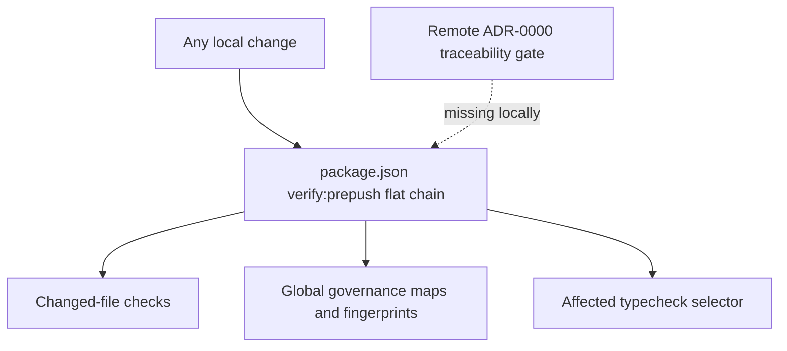
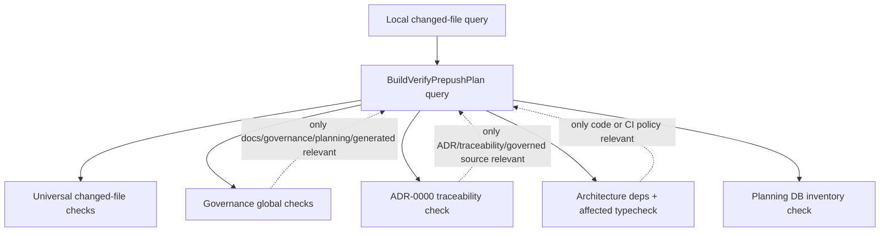

# Verify Prepush Scope Router Implementation Plan

> **For agentic workers:** REQUIRED SUB-SKILL: Use
> superpowers:subagent-driven-development (recommended) or
> superpowers:executing-plans to implement this plan task-by-task. Steps use
> checkbox (`- [ ]`) syntax for tracking.

**Goal:** Reduce local `pnpm verify:prepush` work on unrelated changes while
preserving the same merge-blocking semantics and adding the missing local
ADR-0000 traceability parity gate.

**Architecture:** Replace the flat package-script chain with a repository-owned
query rail that classifies the local changed-file set and emits an ordered
pre-push command plan. The router keeps cheap changed-file checks universal,
routes global governance checks only for governance-relevant diffs, and runs
`traceability:adr0` only when traceability or governed ADR surfaces changed.

**Tech Stack:** Node.js CommonJS scripts, `node:test`, existing
`git-local-changes.cjs`, package scripts, docs/governance validation commands.

---

## Owned Concern

This slice owns the local `verify:prepush` command plan, not GitHub Actions
branch protection or application runtime behavior.

It is a CI governance query. It reads the local changed-file set and returns an
ordered list of validation commands. It must not duplicate workspace fan-out
logic already owned by `tools/ci/scope-config.mjs`.

## Problem

The current `verify:prepush` script is a flat command chain. It always runs
global governance index, fingerprint, coverage, and remediation checks even for
small source-only changes. That inflates local turnaround time and makes agents
spend time validating files unrelated to the active slice.

At the same time, the local gate missed `traceability:adr0`, which is enforced
remotely for accepted ADR coverage. The optimization must therefore be a
semantic router, not a deletion of checks.

## Current State



## Target State



## Command And Query Rails

| Rail                       | Type  | DDD owner                     | Implementation surface       | Result                                                               |
| -------------------------- | ----- | ----------------------------- | ---------------------------- | -------------------------------------------------------------------- |
| `BuildVerifyPrepushPlan`   | query | Repository CI governance      | `scripts/verify-prepush.cjs` | Returns the ordered validation steps for the local changed-file set. |
| `ClassifyPrepushScope`     | query | Repository CI governance      | `scripts/verify-prepush.cjs` | Classifies changed files into scoped pre-push groups.                |
| `ExecuteVerifyPrepushPlan` | query | Repository developer workflow | `scripts/verify-prepush.cjs` | Executes the planned checks and reports conditional groups.          |

## Routing Rules

Universal checks always run:

- `node scripts/docs-workboard-check-changed.cjs`
- changed-only docs location, filename, and frontmatter gates
- `pnpm docs:arc:evidence:check -- --changed-only`
- `pnpm qa:artifact:check`
- `pnpm lint:md:changed`
- `node scripts/check-changed.cjs`
- `node scripts/check-forbidden-tracked-files.cjs`

Governance global checks run when a changed file touches docs governance,
generated governance status, governance scripts, docs tooling, planning DB
surfaces, or feature mechanization surfaces.

Feature mechanization checks run when a changed file touches implementation
code, command tooling, docs planning proposals, or governance surfaces. They are
lighter than the global governance maps and keep the existing "declare before
implementing" protection for code slices.

Traceability checks run when a changed file touches accepted ADR surfaces,
`traceability.config.json`, `traceability.manifest.json`, traceability baseline
files, or paths governed by `traceability.config.json`.

Code checks run when a changed file touches runtime source, CI policy, root TS
configuration, package metadata, or repository command tooling. The router keeps
using `node scripts/type-check-prepush.cjs` so workspace fan-out stays owned by
the existing type-check scope classifier.

The `--full` option preserves the historical all-groups behavior for explicit
diagnostics.

## Feature Mechanization Manifest

```feature-mechanization
version: 1
featureId: VERIFY-PREPUSH-SCOPE-ROUTER-20260511
mechanizationStatus: closed
noHumanDecisionsRemaining: true
implementationPlan: docs/planning/proposals/mandatory/governance-and-docs/verify-prepush-scope-router-plan-20260511.md
componentGuides:
  - docs/guides/testing-and-ci-capabilities.md
  - docs/planning/proposals/mandatory/governance-and-docs/ci-scope-optimization-plan-20260508.md
  - docs/architecture/components/ci-governance/local-changed-files-gate-component.md
userStories:
  - docs/planning/proposals/mandatory/governance-and-docs/verify-prepush-scope-router-plan-20260511.md
governingSources:
  - AGENTS.md
  - docs/planning/status/governance-document-rule-inventory.md
  - docs/guides/ai-work-protocol.md
  - docs/guides/testing-and-ci-capabilities.md
  - docs/architecture/command-query-rail-governance.md
  - docs/architecture/fowler-opportunity-planning-governance.md
allowedImplementationSurfaces:
  - package.json
  - scripts/closeout-changed.test.cjs
  - scripts/verify-prepush.cjs
  - scripts/verify-prepush.test.cjs
  - tools/ci/repository-command-catalog.mjs
  - tools/ci/repository-command-catalog.test.mjs
  - tools/ci/architecture-dependency-guard.test.mjs
  - tools/ci/docs-changed-governance-policy.test.mjs
  - tools/ci/generated-docs-single-writer-policy.test.mjs
  - docs/guides/testing-and-ci-capabilities.md
  - docs/planning/proposals/mandatory/governance-and-docs/verify-prepush-scope-router-plan-20260511.md
  - docs/planning/status/**
  - docs/.manifest.json
  - docs/**/index.md
forbiddenImplementationSurfaces:
  - .github/workflows/**
  - packages/**
  - apps/**
  - traceability.config.json
domainObjects:
  - VerifyPrepushPlan
  - PrepushScopeClassification
  - LocalChangedFileSet
fowlerSignals:
  - Duplicate conditional validation semantics
  - Long method in package script shell chain
  - Hidden local/remote gate drift
architectureGuards:
  - scripts/verify-prepush.test.cjs validates routing semantics.
  - tools/ci/repository-command-catalog.test.mjs validates command catalog coverage.
  - package.json keeps `verify:prepush` as the single public command.
cypressFlows:
  - none
commandQueryRails:
  - name: BuildVerifyPrepushPlan
    type: query
    dddOwner: Repository CI governance
    object: VerifyPrepushPlan
    applicationPort: scripts/verify-prepush.cjs buildPrepushPlan
    adapterSurface: package.json verify:prepush
    scopeAuthorization: local developer pre-push validation
    negativeTests:
      - Web source change must not run global governance maps.
      - ADR change must run traceability and governance checks.
  - name: ClassifyPrepushScope
    type: query
    dddOwner: Repository CI governance
    object: PrepushScopeClassification
    applicationPort: scripts/verify-prepush.cjs classifyPrepushScope
    adapterSurface: scripts/verify-prepush.cjs CLI
    scopeAuthorization: local changed-file read only
    negativeTests:
      - No changed files still runs universal cheap posture checks only.
      - Full mode forces all conditional groups.
redGreenCycles:
  - id: PREPUSH-ROUTER-WEB-SOURCE
    redTest: scripts/verify-prepush.test.cjs web-source change excludes global governance checks
    expectedFailure: buildPrepushPlan is missing and flat package script cannot classify web source diffs.
    patchSurfaces:
      - scripts/verify-prepush.cjs
      - package.json
    greenTest: node --test scripts/verify-prepush.test.cjs
  - id: PREPUSH-ROUTER-ADR-TRACEABILITY
    redTest: scripts/verify-prepush.test.cjs accepted ADR change includes traceability:adr0
    expectedFailure: local verify:prepush does not include the ADR-0000 traceability gate.
    patchSurfaces:
      - scripts/verify-prepush.cjs
      - package.json
    greenTest: node --test scripts/verify-prepush.test.cjs
  - id: PREPUSH-ROUTER-FULL-MODE
    redTest: scripts/verify-prepush.test.cjs full mode preserves historical global groups
    expectedFailure: no explicit full-mode command plan exists.
    patchSurfaces:
      - scripts/verify-prepush.cjs
      - package.json
    greenTest: node --test scripts/verify-prepush.test.cjs
symbols:
  - name: buildPrepushPlan
    path: scripts/verify-prepush.cjs
    dddOwner: Repository CI governance
    cqRails:
      - BuildVerifyPrepushPlan
    fowlerSignals:
      - Long method in package script shell chain
    architectureGuard: scripts/verify-prepush.test.cjs
    cypressCoverage: not applicable; local CI command planner has no browser flow
    unitTests:
      - node --test scripts/verify-prepush.test.cjs
  - name: classifyPrepushScope
    path: scripts/verify-prepush.cjs
    dddOwner: Repository CI governance
    cqRails:
      - ClassifyPrepushScope
    fowlerSignals:
      - Hidden local/remote gate drift
    architectureGuard: scripts/verify-prepush.test.cjs
    cypressCoverage: not applicable; local CI command planner has no browser flow
    unitTests:
      - node --test scripts/verify-prepush.test.cjs
  - name: executePrepushPlan
    path: scripts/verify-prepush.cjs
    dddOwner: Repository developer workflow
    cqRails:
      - ExecuteVerifyPrepushPlan
    fowlerSignals:
      - Duplicate conditional validation semantics
    architectureGuard: scripts/verify-prepush.test.cjs
    cypressCoverage: not applicable; local CI command planner has no browser flow
    unitTests:
      - node --test scripts/verify-prepush.test.cjs
completionGate:
  - node --test scripts/verify-prepush.test.cjs
  - pnpm test:ci-tools
  - pnpm docs:feature-mechanization -- --feature VERIFY-PREPUSH-SCOPE-ROUTER-20260511
  - pnpm docs:feature-mechanization:implementation -- --feature VERIFY-PREPUSH-SCOPE-ROUTER-20260511
  - pnpm verify:prepush
```

## User Stories

1. As a web developer changing only `apps/web`, I want local pre-push to run
   changed-file checks and affected type-checking without rebuilding governance
   indexes, so I get fast feedback without losing code safety.
2. As an architecture reviewer changing an accepted ADR, I want local pre-push
   to run governance and `traceability:adr0`, so remote ADR-0000 failures are
   caught before PR.
3. As a governance maintainer changing docs generators or planning DB surfaces,
   I want local pre-push to run the global governance checks, so generated
   indexes and fingerprints stay aligned.
4. As a release engineer diagnosing a hard failure, I want a full-mode pre-push
   command, so I can force the historical all-check posture when needed.

## Implementation Tasks

- [ ] Write failing router tests for web-source, ADR traceability, governance,
      and full-mode routing.
- [ ] Add `scripts/verify-prepush.cjs` with a pure `buildPrepushPlan` query and
      a CLI executor.
- [ ] Route `package.json` `verify:prepush` through the new script and add a
      `test:verify-prepush` command.
- [ ] Update repository command catalog classifications for the new script and
      test command.
- [ ] Update testing/CI documentation with the new conditional semantics.
- [ ] Run feature mechanization, CI-tool, and pre-push validations.
