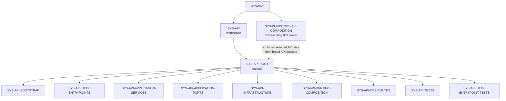
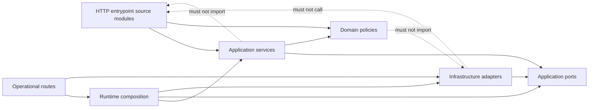

# API Governance Subdivision Plan

## Purpose

This plan defines the next `SYS-API` subdivision before any additional API
component extraction. It is a planning surface only: it does not create new
component IDs in the unit manifest and it does not authorize implementation
work by itself.

The immediate goal is to prevent component invention by making every future API
unit pass through an explicit matrix: root chain, DDD owner, command/query
rail, file surface, drift posture, and tests.

## Governing Sources

- `AGENTS.md`
- `docs/planning/status/governance-document-rule-inventory.md`
- `docs/architecture/reference-architecture.md`
- `docs/architecture/command-query-rail-governance.md`
- `docs/architecture/fowler-opportunity-planning-governance.md`
- `docs/planning/status/system-governance-unit-taxonomy-20260501.md`
- `docs/planning/status/system-governance-unit-index.units.yaml`
- `docs/planning/status/system-operations-inventory-20260501.md`
- `docs/planning/proposals/mandatory/runtime-and-contracts/s08-plan-store-command-query-matrix-20260501.md`

## Current State

`apps/api` is currently governed by broad component buckets under `SYS-API`.
Those buckets are useful for full file coverage, but they are not yet fine
enough to close architecture or drift decisions.

Current tracked file distribution:

| Surface                     | Files |
| --------------------------- | ----: |
| `src/entrypoints/http`      |    77 |
| `src/application/services`  |    37 |
| `src/application/ports`     |    17 |
| `src/infrastructure`        |    26 |
| `src/modules`               |    16 |
| `src/runtime`               |    10 |
| `src/routes`                |    11 |
| `src/plugins`               |     3 |
| `src/db`                    |     1 |
| `src/domain`                |     1 |
| `test/entrypoints/http`     |    51 |
| `test/application/services` |    44 |
| `test/infrastructure`       |    15 |
| `test/integration`          |    12 |
| `test/modules`              |    15 |
| `test/routes`               |     3 |
| `test/app`                  |     8 |
| `test/plugins`              |     2 |
| `test/fixtures`             |     3 |
| Other API files             |     9 |

The active drift cluster is the plan-store / plan-fetcher / lifecycle path
recorded in the operations inventory: S08-DRIFT-04/05/10/22/31/33/38.

## Current Unit Chain



ASCII fallback:

```text
SYS-DVT
  SYS-API
    SYS-API-ROOT
      SYS-API-BOOTSTRAP
      SYS-API-HTTP-ENTRYPOINTS
      SYS-API-APPLICATION-SERVICES
      SYS-API-APPLICATION-PORTS
      SYS-API-INFRASTRUCTURE
      SYS-API-RUNTIME-COMPOSITION
      SYS-API-OPS-ROUTES
      SYS-API-TESTS
      SYS-API-HTTP-ENTRYPOINT-TESTS
  SYS-PLANSTORE-API-COMPOSITION
    selected API files carrying S08 plan-store drift
```

## Proposed API Unit Matrix

These rows are candidate subdivisions. They must be reviewed before they are
added to `system-governance-unit-index.units.yaml`.

| Candidate unit                     | Parent                          | DDD             | C&Q rail                                    | File surface                                                                       | Status | Drift / legacy posture                                                                   | Required negative tests                                                        |
| ---------------------------------- | ------------------------------- | --------------- | ------------------------------------------- | ---------------------------------------------------------------------------------- | ------ | ---------------------------------------------------------------------------------------- | ------------------------------------------------------------------------------ |
| `SYS-API-HTTP-RUN-COMMANDS`        | `SYS-API-HTTP-ENTRYPOINTS`      | `ENTRY`         | Start, cancel, signal, recover run commands | `startRun*`, `cancelRun*`, `signalRun*`, `recoverRun*`, `runCommand*`              | Review | Start/recover carry S08-DRIFT-38 until scoped plan-store ownership is enforced           | unauthorized tenant, invalid scope, unsupported signal, missing plan ownership |
| `SYS-API-HTTP-RUN-QUERIES`         | `SYS-API-HTTP-ENTRYPOINTS`      | `ENTRY`         | Run status, events, list queries            | `getRun*`, `getRunEvents*`, `listRuns*`                                            | Review | Status enrichment carries S08-DRIFT-33 until scoped plan read is used                    | cross-tenant read, invalid pagination, stale snapshot path                     |
| `SYS-API-HTTP-PLAN-COMMANDS`       | `SYS-API-HTTP-ENTRYPOINTS`      | `ENTRY`         | Compile, preview, import plan commands      | `compilePlan*`, `previewPlan*`, `importPlan*`, `planRoute*`                        | Drift  | Preview/import still intersect S08 lifecycle and unscoped fetch drift                    | plan source mismatch, forbidden provenance, missing scope, planRef not owned   |
| `SYS-API-HTTP-WORKSPACE-DRAFT`     | `SYS-API-HTTP-ENTRYPOINTS`      | `ENTRY`         | Workspace graph draft commands and queries  | `workspaceGraphDraftRoutes.ts`, draft parsers and helpers                          | Review | No known legacy, but must stay UI-flow governed and not bypass C&Q rails                 | denied capability, missing project scope, direct seed bypass                   |
| `SYS-API-HTTP-ERRORS`              | `SYS-API-HTTP-ENTRYPOINTS`      | `INFRA`         | HTTP error envelope mapping                 | `httpError*`, response mappers                                                     | Review | Must remain transport-only, not domain authority                                         | domain error unmapped, internal error leakage                                  |
| `SYS-API-APP-START-RUN`            | `SYS-API-APPLICATION-SERVICES`  | `AS`            | Start run command rail                      | `*StartRun*`, admission decisions, engine bridge                                   | Drift  | S08-DRIFT-38 and admission versus scoped ownership distinction                           | duplicate run, backpressure reject, unauthorized scope, unowned planRef        |
| `SYS-API-APP-RUN-COMMANDS`         | `SYS-API-APPLICATION-SERVICES`  | `AS`            | Cancel, signal, recover commands            | `cancelRunUseCase`, `signalRunUseCase`, `recoverRunUseCase`                        | Review | Recover depends on start/run execution semantics; no standalone component until reviewed | non-existent run, wrong tenant, invalid signal/cancel semantics                |
| `SYS-API-APP-RUN-QUERIES`          | `SYS-API-APPLICATION-SERVICES`  | `AS` / `PROJ`   | Get run status, events, list runs           | `getRunStatusUseCase`, `getRunEventsUseCase`, `listRunsUseCase`, read evidence     | Drift  | S08-DRIFT-33 on plan enrichment                                                          | cross-tenant query, missing snapshot, plan enrichment not scoped               |
| `SYS-API-APP-PLAN-COMMANDS`        | `SYS-API-APPLICATION-SERVICES`  | `AS` / `DS`     | Compile, preview, import plan               | `CompilePlanUseCase`, `PreviewPlanUseCase`, `ImportPlanUseCase`, resolver services | Drift  | S08-DRIFT-04/22/31 through lifecycle and fetch surfaces                                  | invalid executable graph, forbidden source, unscoped stored plan               |
| `SYS-API-APP-WORKSPACE-DRAFT`      | `SYS-API-APPLICATION-SERVICES`  | `AS` / `DS`     | Save/get draft, capability policy           | draft use cases and capability policy                                              | Review | Must stay behind workspace capability service                                            | denied capability, missing tenant/project, stale draft version                 |
| `SYS-API-PORTS-AUTH-ADMISSION`     | `SYS-API-APPLICATION-PORTS`     | `PORT`          | Auth, admission, duplicate, capacity ports  | `auth*`, `accessDecision`, `IAdmission*`, `DuplicateRunProbe`, capacity ports      | Review | No known legacy; ports must remain narrow                                                | adapter missing decision, duplicate probe failure                              |
| `SYS-API-PORTS-RUNTIME`            | `SYS-API-APPLICATION-PORTS`     | `PORT`          | Runtime and start-run facades               | `runtime`, `startRun*Port`                                                         | Review | Must not hide plan-store fetch authority                                                 | engine error mapping, tenant scope missing                                     |
| `SYS-API-INFRA-AUTH`               | `SYS-API-INFRASTRUCTURE`        | `ADP`           | OIDC and embedded auth adapters             | `infrastructure/auth/**`                                                           | Review | Transport adapter only, no domain decisions outside access service                       | invalid token, denied embedded decision                                        |
| `SYS-API-INFRA-BACKPRESSURE`       | `SYS-API-INFRASTRUCTURE`        | `ADP`           | Backpressure stores and telemetry           | `infrastructure/backpressure/**`, `admissionTelemetry/**`                          | Review | Must not decide business admission outside app service                                   | store unavailable, circuit open, stale fallback                                |
| `SYS-API-INFRA-PLANSTORE`          | `SYS-PLANSTORE-API-COMPOSITION` | `ADP` / `AS`    | S08 scoped plan-store adapter support       | `ManifestArtifactResolver`, start-run artifact resolvers, stored plan validators   | Drift  | S08-DRIFT-10/22/31/38                                                                    | scope mismatch, planRef ownership mismatch, legacy lifecycle use               |
| `SYS-API-INFRA-WORKSPACE-DRAFT`    | `SYS-API-INFRASTRUCTURE`        | `ADP`           | Workspace graph draft persistence/audit     | `infrastructure/workspaceGraphDraft/**`, audit logger                              | Review | Must remain tenant/project scoped                                                        | cross-project draft read/write, audit failure                                  |
| `SYS-API-MODULE-PROTECTED-RUNTIME` | `SYS-API-RUNTIME-COMPOSITION`   | `INFRA` / `AS`  | Protected runtime composition query         | `buildProtectedRuntimeModule`, protected runtime builders, state roles             | Drift  | S08-DRIFT-22 where composition still supplies legacy plan-store roles                    | missing role, wrong scoped dependency, broad plan store leakage                |
| `SYS-API-MODULE-PLAN-COMPILE`      | `SYS-API-RUNTIME-COMPOSITION`   | `INFRA`         | Planner compile boundary composition        | `planCompileBoundary.ts`                                                           | Review | Must not become planner domain owner                                                     | unsupported family/kind, invalid catalog                                       |
| `SYS-API-RUNTIME-RECONCILER`       | `SYS-API-RUNTIME-COMPOSITION`   | `INFRA`         | Intent reconciler lifecycle and health      | `src/runtime/**`                                                                   | Review | Operational runtime only                                                                 | stale health, lifecycle stop/start failure                                     |
| `SYS-API-OPS-HEALTH`               | `SYS-API-OPS-ROUTES`            | `ENTRY` / `QRY` | Health, readiness, version, capabilities    | `src/routes/**`, `registerOperationalRoutes.ts`                                    | Review | No product component split without separate ops plan                                     | db down, stale reconciler, disabled capability                                 |

## Accepted Subdivisions

| Unit                 | Parent               | Acceptance date | Manifest level | Manifest status | Scope                    | Rationale                                                                                  |
| -------------------- | -------------------- | --------------- | -------------- | --------------- | ------------------------ | ------------------------------------------------------------------------------------------ |
| `SYS-API-OPS-HEALTH` | `SYS-API-OPS-ROUTES` | 2026-05-03      | `source`       | `review`        | `apps/api/src/routes/**` | Smallest reviewed API cut with existing route-registration tests and no S08 implementation |

`SYS-API-OPS-ROUTES` remains as the component-level parent. It does not own
files directly after this acceptance; file ownership is held by
`SYS-API-OPS-HEALTH` at `source` level because the taxonomy allows component
parents to decompose into source units, not into nested components.

## Command And Query Rails

| Rail                                | Type    | Owning DDD object                   | Transport surface                        | App surface                                                         | Notes                                                          |
| ----------------------------------- | ------- | ----------------------------------- | ---------------------------------------- | ------------------------------------------------------------------- | -------------------------------------------------------------- |
| `ApiStartRunCommand`                | Command | Start run application service       | `POST /runs` via `startRunRoute`         | `BackpressureAwareStartRunUseCase`, `EngineStartRunUseCase`, facade | Blocked from clean closure by S08 scoped ownership drift       |
| `ApiCancelRunCommand`               | Command | Run command application service     | cancel route                             | `CancelRunUseCase`                                                  | Should stay separate from signal compatibility                 |
| `ApiSignalRunCommand`               | Command | Run command application service     | signal route                             | `SignalRunUseCase`                                                  | Negative tests own unsupported signal and compatibility policy |
| `ApiRecoverRunCommand`              | Command | Run recovery application service    | recover route                            | `RecoverRunUseCase`                                                 | Must not bypass tenant scope                                   |
| `ApiCompilePlanCommand`             | Command | Plan compile application service    | compile route                            | `CompilePlanUseCase`                                                | Compile returns a build artifact result but is command-shaped  |
| `ApiPreviewPlanCommand`             | Command | Plan preview application service    | preview route                            | `PreviewPlanUseCase`                                                | Drift until lifecycle facade removal                           |
| `ApiImportPlanCommand`              | Command | Plan import application service     | import route                             | `ImportPlanUseCase`                                                 | Drift until scoped stored-plan fetch                           |
| `ApiSaveWorkspaceGraphDraftCommand` | Command | Workspace draft application service | workspace draft route                    | `SaveWorkspaceGraphDraftUseCase`                                    | Must remain capability-gated                                   |
| `ApiGetWorkspaceGraphDraftQuery`    | Query   | Workspace draft read model          | workspace draft route                    | `GetWorkspaceGraphDraftUseCase`                                     | Tenant/project scoped query                                    |
| `ApiGetRunStatusQuery`              | Query   | Run status read model               | get run route                            | `GetRunStatusUseCase`                                               | Drift where plan enrichment is unscoped                        |
| `ApiGetRunEventsQuery`              | Query   | Run event read model                | events route                             | `GetRunEventsUseCase`                                               | Cursor and tenant guard required                               |
| `ApiListRunsQuery`                  | Query   | Runs read model                     | list route                               | `ListRunsUseCase`                                                   | Tenant guard required                                          |
| `ApiOperationalReadinessQuery`      | Query   | Operational readiness read model    | health/ready/version/capabilities routes | readiness ports and runtime health                                  | Operational only, no product semantics                         |

## Drift Disposition

| Drift             | API surface                                                               | Owner candidate                                                 | Disposition                                                             |
| ----------------- | ------------------------------------------------------------------------- | --------------------------------------------------------------- | ----------------------------------------------------------------------- |
| S08-DRIFT-04      | `PreviewPlanUseCase`, plan lifecycle writes                               | `SYS-API-APP-PLAN-COMMANDS` and `SYS-PLANSTORE-API-COMPOSITION` | Replace lifecycle facade with scoped plan-store commands before closure |
| S08-DRIFT-05      | Start-run admission link not persisted through scoped rail                | `SYS-API-APP-START-RUN`                                         | Add scoped admission command when S08 rail is implemented               |
| S08-DRIFT-10 / 31 | Stored plan validation fetch lacks scope                                  | `SYS-API-INFRA-PLANSTORE`                                       | Replace `fetchForValidation(planRef)` with scoped query                 |
| S08-DRIFT-22      | Runtime composition wires unscoped plan fetch/store roles                 | `SYS-API-MODULE-PROTECTED-RUNTIME`                              | Split role types and supply scoped dependencies only                    |
| S08-DRIFT-33      | Run status enriches with unscoped plan record                             | `SYS-API-APP-RUN-QUERIES`                                       | Move to scoped read model                                               |
| S08-DRIFT-38      | HTTP start/recover can hand planRef to engine without row ownership proof | `SYS-API-HTTP-RUN-COMMANDS` and `SYS-API-APP-START-RUN`         | Assert scoped plan-store ownership before engine handoff                |

## Dependency Rules



Allowed:

- HTTP entrypoints may parse, authorize, call application services, and map
  results.
- Application services may depend on ports and domain policies, not on Fastify
  route modules.
- Infrastructure adapters implement ports and must not define product intent.
- Runtime composition wires dependencies and must not create hidden domain
  authority.

Forbidden:

- New API behavior without a command/query row.
- New component/source unit without a planning row.
- Route handler semantics duplicated under another local name.
- Plan-store ownership checks implemented as URI allowlist or auth-only checks.

## Test Matrix

| Candidate unit      | Existing tests                                                                                       | Missing negative tests before implementation closure       |
| ------------------- | ---------------------------------------------------------------------------------------------------- | ---------------------------------------------------------- |
| HTTP run commands   | `startRunRoute.*`, `cancelRunRoute.*`, `signalRunRoute.*`, `recoverRunRoute.*`, route executor tests | scoped planRef ownership denial, recover wrong tenant      |
| HTTP run queries    | `getRunRoute.*`, `getRunEventsRoute.*`, `listRunsRoute.*`                                            | plan enrichment with wrong tenant, stale snapshot fallback |
| HTTP plan commands  | `compilePlanRoute.*`, `previewPlanRoute.*`, `importPlanRoute.*`, plan route parser tests             | unscoped stored plan denied, invalid provenance denied     |
| Workspace draft     | `workspaceGraphDraftRoutes.test.ts`, integration draft scenarios                                     | direct bypass denied, stale version conflict               |
| App start run       | `BackpressureAwareStartRunUseCase.*`, `engineStartRunUseCase.*`, facade tests                        | plan ownership failure before engine call                  |
| Runtime composition | module architecture cases and app composition tests                                                  | broad plan-store role rejected by architecture guard       |
| Operational routes  | `registerOperationalRoutes.test.ts`, health readiness tests                                          | degraded db and stale reconciler combined response         |

## Execution Sequence

1. Review this plan and accept, amend, or reject candidate units.
2. Add only reviewed units to `system-governance-unit-index.units.yaml`.
3. Regenerate file/component indexes and fingerprints.
4. Add architecture tests for dependency rules before moving files.
5. Implement S08 API drift removals through the S08 command/query matrix.
6. Only after green negative tests, change API source structure.

## Non-Goals

- No API source file movement in this slice.
- No new component IDs in this slice.
- No S08 implementation in this slice.
- No route behavior changes in this slice.
- No relaxation of current CI or governance checks.

## Validation Baseline

- `pnpm docs:sync`
- `pnpm docs:governance:unit-coverage`
- `pnpm docs:governance:file-component-index:check`
- `pnpm docs:governance:file-fingerprint-baseline:check`
- `pnpm docs:governance:coverage-report:check`
- `pnpm verify:prepush`
