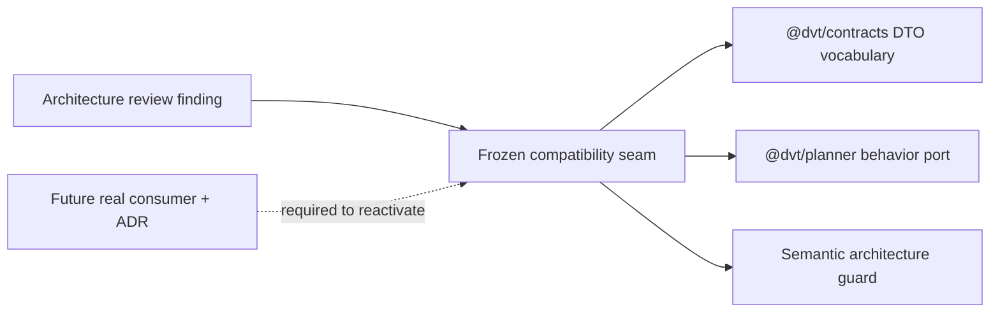
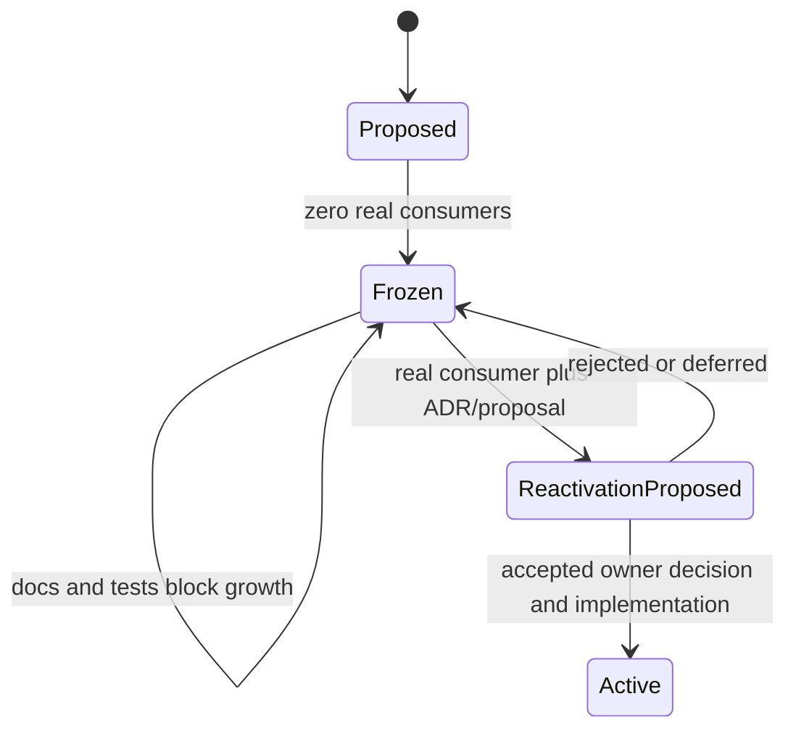

# AR-A4 Custom Policy Namespace Freeze Plan

## Think-First Analysis

Problem summary:

- `CustomPolicyNamespaceRegistry` was introduced as a future custom-policy
  extension seam, but the repository has no production implementer or consumer.
- The seam carries schema, size-limit, denied-field, registry lookup, and
  namespace-governance language that implies active extensibility.
- Mature systems keep extension points either actively consumed and governed or
  explicitly frozen until a real product use case pays for the complexity.

Root cause:

- The original planner canonicalization work anticipated custom policy
  namespaces before a concrete runtime or product consumer existed.
- Later ownership migration correctly moved the behavior port into
  `@dvt/planner`, but it left the seam described as operationally available.
- The drift is not the existence of shared DTO vocabulary by itself; it is the
  absence of a mechanical freeze rule preventing new implementations or
  consumers from treating the seam as active.

Constraints and invariants:

- ADR-0018 keeps serializable cross-package vocabulary in `@dvt/contracts` and
  behavior ports in the owning domain package.
- ADR-0034 keeps planner behavior in the Planner bounded context and prevents
  peer-domain shortcuts.
- ADR-0035 makes planner semantic changes planner-owned while contracts review
  remains a compatibility gate.
- Removing exported `@dvt/contracts` vocabulary would be a breaking public
  contract change for no runtime benefit, so AR-A4 freezes the seam rather than
  deleting shared DTOs.
- Command/query rail impact is internal-only: no user-visible route, endpoint,
  worker operation, or external behavior is added.

Options considered:

| Option                                            | Fowler pattern                                        | Result                                                                                           |
| ------------------------------------------------- | ----------------------------------------------------- | ------------------------------------------------------------------------------------------------ |
| Delete the shared DTO vocabulary and planner port | Remove dead code                                      | Rejected for this slice; exported contracts make deletion a breaking change with weak payoff.    |
| Leave the seam as-is                              | None                                                  | Rejected; continues speculative extensibility and documentation drift.                           |
| Freeze the seam mechanically                      | Explicit lifecycle state, semantic architecture guard | Selected; keeps compatibility while preventing silent growth.                                    |
| Implement a no-op registry                        | Null Object                                           | Rejected; creates fake implementation surface and hides the fact that there is no real consumer. |

Selected option and rationale:

- Keep `CustomPolicyNamespaceRegistry.v1.ts` and the planner behavior port as
  frozen compatibility vocabulary.
- Add explicit local docblock/component-guide semantics that the seam is
  compatibility-only and cannot grow without a real consumer and ADR-backed
  reactivation.
- Add a semantic architecture guard that fails if the seam gains implementation
  code, registration methods, or active consumer imports without updating the
  governed freeze posture.

Rejected alternatives:

- Deleting the files would conflate "speculative" with "safe to break".
- Adding a registry implementation would create precisely the speculative
  behavior AR-A4 is supposed to prevent.

## Pre-Implementation Brief

- Mode: Full.
- Scope: planner behavior-port freeze semantics, shared contract freeze notes,
  component guide, user stories, Fowler analysis in `buzon`, architecture test,
  ARC-2 evidence, risk register, generated docs, and closeout.
- Expected outcome: the custom policy namespace seam remains source-compatible
  but is explicitly frozen, has no implementation surface, and has a semantic
  architecture test blocking accidental reactivation.
- Risks and mitigations: over-freezing could block a valid future consumer; the
  docs define the reactivation path as real consumer plus ADR/proposal update.
- Out of scope: removing exported DTOs, changing planner policy resolution,
  adding runtime validation, or implementing a registry.
- Validation plan: feature mechanization, RED/GREEN planner architecture test,
  contracts architecture test, package typechecks/tests, ARC check, docs sync,
  governance refresh where required, and `pnpm verify:prepush`.

## Command And Query Rail Impact

No new command or query rail is introduced.

The existing `ICustomPolicyNamespaceRegistry#lookup(namespace)` and
`listNamespaces()` port names are preserved only as frozen compatibility
surface. AR-A4 does not add externally observable behavior, route handling,
runtime authorization, or application-service orchestration.

## Fowler Opportunity Matrix

| Scenario                                                                 | Opportunity                                 | Fowler pattern                           | DDD owner                                | Command/query rail               | Implementation surfaces                      | Unit or package test                             | Architecture test           | User-flow test | Out of scope                          |
| ------------------------------------------------------------------------ | ------------------------------------------- | ---------------------------------------- | ---------------------------------------- | -------------------------------- | -------------------------------------------- | ------------------------------------------------ | --------------------------- | -------------- | ------------------------------------- |
| Future work treats custom policy namespaces as active without a consumer | Speculative generality, documentation drift | Explicit lifecycle state, semantic guard | Planner policy boundary                  | none - frozen compatibility seam | planner contract docs and architecture tests | `planner-private-ownership.architecture.test.ts` | same                        | N/A            | registry implementation               |
| Contracts vocabulary implies runtime validation exists                   | Hidden authority, duplicate semantics risk  | Compatibility facade with freeze notice  | Shared planner vocabulary                | none - DTO compatibility only    | `CustomPolicyNamespaceRegistry.v1.ts` docs   | `planner-private-ownership.architecture.test.ts` | contracts ownership guard   | N/A            | breaking DTO removal                  |
| Consumers need to know when reactivation is allowed                      | Boundary drift prevention                   | Published component invariants           | Planner private behavior ports component | none                             | component guide and user stories             | N/A                                              | semantic architecture guard | N/A            | product design for a future namespace |

## Diagrams





## Feature Mechanization

```feature-mechanization
version: 1
featureId: AR-A4-CUSTOM-POLICY-NAMESPACE-FREEZE
mechanizationStatus: implemented
noHumanDecisionsRemaining: true
implementationPlan: docs/planning/proposals/mandatory/runtime-and-contracts/ar-a4-custom-policy-namespace-freeze-plan-20260513.md
componentGuides:
  - docs/architecture/components/planner/planner-private-behavior-ports-component.md
  - docs/architecture/components/planner/planner-constraints.md
userStories:
  - docs/architecture/components/planner/custom-policy-namespace-freeze-user-stories.md
governingSources:
  - AGENTS.md
  - docs/planning/status/governance-document-rule-inventory.md
  - docs/guides/ai-work-protocol.md
  - docs/architecture/command-query-rail-governance.md
  - docs/architecture/fowler-opportunity-planning-governance.md
  - docs/architecture/reference-architecture.md
  - docs/adr/ADR-0018_Shared_Kernel_Ownership_Governance.md
  - docs/adr/ADR-0034-bounded-context-boundaries-and-communication-rules.md
  - docs/adr/ADR-0035-planner-public-contract-evolution-protocol.md
allowedImplementationSurfaces:
  - buzon/20260513-codex-fowler-ar-a4-custom-policy-namespace-freeze-analysis.md
  - docs/planning/proposals/mandatory/runtime-and-contracts/ar-a4-custom-policy-namespace-freeze-plan-20260513.md
  - docs/planning/closeouts/20260513-ar-a4-custom-policy-namespace-freeze-closeout.md
  - docs/architecture/components/planner/planner-private-behavior-ports-component.md
  - docs/architecture/components/planner/planner-constraints.md
  - docs/architecture/components/planner/custom-policy-namespace-freeze-user-stories.md
  - docs/evidence/ed-20260513-ar-a4-custom-policy-namespace-freeze.md
  - docs/evidence/index.md
  - docs/risk-register/quality/R-20260513-AR-A4-CUSTOM-POLICY-NAMESPACE-FREEZE.yaml
  - docs/risk-register/quality/index.md
  - docs/planning/status/generated-code-state.md
  - docs/architecture/components/planner/index.md
  - docs/architecture/components/planner/architecture/index.md
  - docs/contracts/planner/index.md
  - docs/.manifest.json
  - traceability.manifest.json
  - packages/@dvt/contracts/src/contracts/planner/CustomPolicyNamespaceRegistry.v1.ts
  - packages/@dvt/planner/src/contracts/CustomPolicyNamespaceRegistry.ts
  - packages/@dvt/planner/test/unit/planner-private-ownership.architecture.test.ts
  - packages/@dvt/contracts/test/planner-private-ownership.architecture.test.ts
forbiddenImplementationSurfaces:
  - apps/**
  - packages/@dvt/engine/**
  - packages/@dvt/adapter-*/**
commandQueryRails:
  - name: PlannerCustomPolicyNamespaceFreezePostureQuery
    type: query
    dddOwner: Planner frozen compatibility seam
domainObjects:
  - name: ICustomPolicyNamespaceRegistry
    type: frozen behavior port
    owner: packages/@dvt/planner/src/contracts/CustomPolicyNamespaceRegistry.ts
  - name: CustomPolicyNamespaceEntry
    type: shared compatibility DTO vocabulary
    owner: packages/@dvt/contracts/src/contracts/planner/CustomPolicyNamespaceRegistry.v1.ts
fowlerSignals:
  - Speculative custom policy extensibility is frozen instead of presented as active behavior.
  - Documentation drift is removed by aligning component guide, constraints, and module docblocks.
  - Semantic architecture tests guard frozen lifecycle rather than only owner package placement.
architectureGuards:
  - pnpm --filter @dvt/planner test -- test/unit/planner-private-ownership.architecture.test.ts
  - pnpm docs:feature-mechanization:implementation
cypressFlows:
  - N/A - planner/contracts architecture seam only
completionGate:
  - pnpm docs:feature-mechanization -- --feature AR-A4-CUSTOM-POLICY-NAMESPACE-FREEZE
  - pnpm --filter @dvt/planner test -- test/unit/planner-private-ownership.architecture.test.ts
  - pnpm --filter @dvt/contracts test -- test/planner-private-ownership.architecture.test.ts
  - pnpm --filter @dvt/planner typecheck
  - pnpm --filter @dvt/contracts typecheck
  - GIT_BASE=origin/main GIT_HEAD=HEAD node tools/ci/arc-check.mjs
  - pnpm docs:status:generate
  - pnpm docs:sync
  - pnpm governance:refresh
  - pnpm docs:feature-mechanization:implementation
  - pnpm verify:prepush
redGreenCycles:
  - id: custom-policy-namespace-freeze-guard
    redTest: pnpm --filter @dvt/planner test -- test/unit/planner-private-ownership.architecture.test.ts
    expectedFailure: Frozen compatibility seam text and component freeze invariants do not exist yet.
    patchSurfaces:
      - packages/@dvt/planner/test/unit/planner-private-ownership.architecture.test.ts
      - packages/@dvt/planner/src/contracts/CustomPolicyNamespaceRegistry.ts
      - packages/@dvt/contracts/src/contracts/planner/CustomPolicyNamespaceRegistry.v1.ts
      - docs/architecture/components/planner/planner-private-behavior-ports-component.md
      - docs/architecture/components/planner/planner-constraints.md
    greenTest: pnpm --filter @dvt/planner test -- test/unit/planner-private-ownership.architecture.test.ts
symbols:
  - name: ICustomPolicyNamespaceRegistry
    path: packages/@dvt/planner/src/contracts/CustomPolicyNamespaceRegistry.ts
    dddOwner: Planner private behavior ports
    cqRails:
      - PlannerCustomPolicyNamespaceFreezePostureQuery
    fowlerSignals:
      - Keeps behavior port source-compatible while explicitly frozen.
    architectureGuard: pnpm --filter @dvt/planner test -- test/unit/planner-private-ownership.architecture.test.ts
    cypressCoverage: N/A - planner/contracts architecture seam only
    unitTests:
      - pnpm --filter @dvt/planner test -- test/unit/planner-private-ownership.architecture.test.ts
  - name: CustomPolicyNamespaceEntry
    path: packages/@dvt/contracts/src/contracts/planner/CustomPolicyNamespaceRegistry.v1.ts
    dddOwner: Shared planner vocabulary
    cqRails:
      - PlannerCustomPolicyNamespaceFreezePostureQuery
    fowlerSignals:
      - Preserves source compatibility without claiming active runtime behavior.
    architectureGuard: pnpm --filter @dvt/contracts test -- test/planner-private-ownership.architecture.test.ts
    cypressCoverage: N/A - contracts vocabulary only
    unitTests:
      - pnpm --filter @dvt/contracts test -- test/planner-private-ownership.architecture.test.ts
negativeTests:
  - no registry implementation or register/validate methods can appear while the seam is frozen
```
