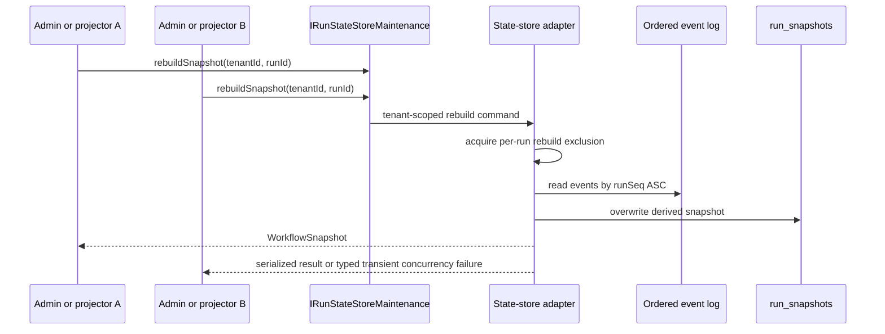
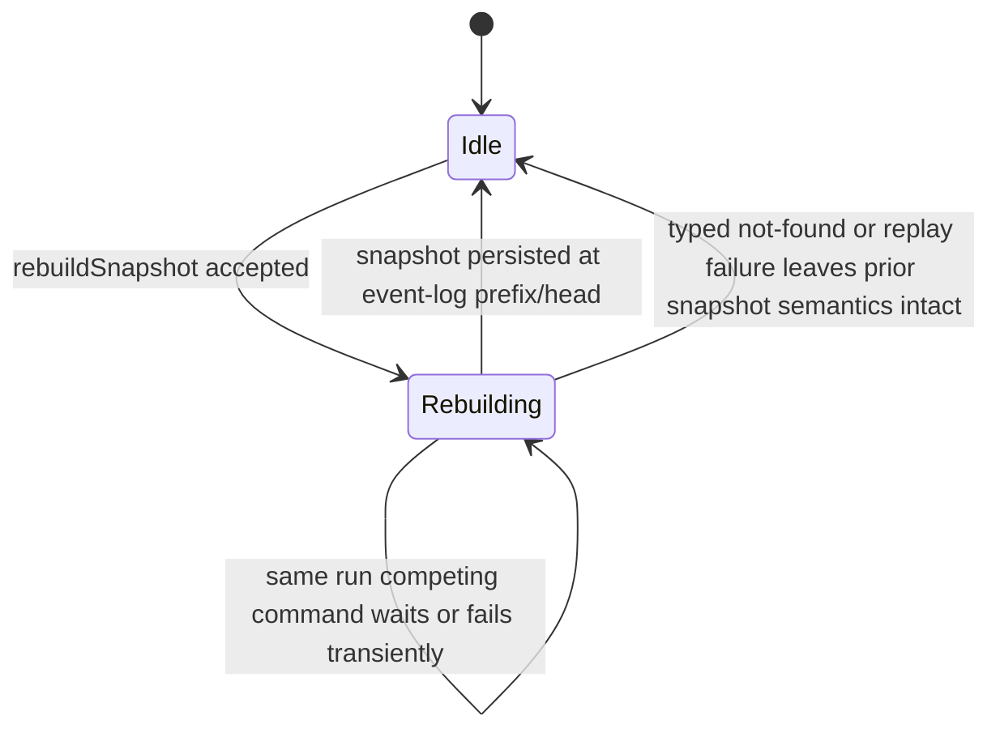

# AR-A6 Snapshot Rebuild Concurrency Contract Plan

## Think-First Analysis

Problem summary:

- `rebuildSnapshot(tenantId, runId)` already mutates the durable snapshot row and
  therefore competes with projector, repair, and admin rebuild callers.
- The PostgreSQL adapter serializes the mutation with a per-run
  `pg_advisory_xact_lock`, but the live state-store contract does not yet say
  that all adapters must provide equivalent mutual exclusion.
- Mature event-sourced systems treat replay projection as a consistency
  boundary: the storage mechanism can vary, but overlapping rebuilds for the
  same aggregate must be serialized or rejected.

Root cause:

- The invariant lives as an adapter comment and implementation detail instead
  of a named state-store maintenance concern.
- Historical state-store adapter docs mention backend-specific locks, while the
  canonical overview stops at deterministic replay and does not define
  concurrent rebuild semantics.

Selected option:

- Keep the PostgreSQL advisory lock implementation.
- Add the missing portable contract invariant to the live TypeScript ports and
  state-store docs: per `(tenantId, runId)`, only one snapshot rebuild may mutate
  the durable snapshot at a time; competing rebuilds must serialize or fail with
  a typed/transient concurrency error.
- Add a semantic architecture guard that checks source docblocks, contract
  wording, component guide sections, user stories, and adapter-specific wording.

Rejected alternatives:

| Option                                            | Reason rejected                                                                                    |
| ------------------------------------------------- | -------------------------------------------------------------------------------------------------- |
| Add a new lock API to `IRunStateStoreMaintenance` | Expands the public port without a caller need; the concern belongs behind the maintenance command. |
| Require PostgreSQL advisory locks in the contract | Leaks infrastructure into the shared state-store boundary and blocks non-Postgres adapters.        |
| Leave the invariant only in adapter tests         | Preserves drift for Snowflake or future state-store implementations.                               |

## Command And Query Rail Impact

| Rail                                          | Type    | Bounded context                | DDD owner                                   | Intent                                                            | Port / adapter surface                                                                           | Scope and auth                                                               | Negative tests                                                                                                 |
| --------------------------------------------- | ------- | ------------------------------ | ------------------------------------------- | ----------------------------------------------------------------- | ------------------------------------------------------------------------------------------------ | ---------------------------------------------------------------------------- | -------------------------------------------------------------------------------------------------------------- |
| `StateStoreSnapshotRebuildMaintenanceCommand` | command | Engine state-store maintenance | `IRunStateStoreMaintenance.rebuildSnapshot` | Rebuild a materialized run snapshot from persisted ordered events | `IRunStateStoreMaintenance`, admin rebuild route, projector repair callers, state-store adapters | Tenant-scoped maintenance command; authorization remains at API/admin caller | semantic architecture test rejects contract drift, missing per-run mutual exclusion, and Postgres-only wording |

## Fowler Opportunity Matrix

| Scenario                                                    | Opportunity                  | Fowler pattern                                          | DDD owner                          | Rail                                          | Implementation surfaces                        | Test                                                           |
| ----------------------------------------------------------- | ---------------------------- | ------------------------------------------------------- | ---------------------------------- | --------------------------------------------- | ---------------------------------------------- | -------------------------------------------------------------- |
| Concurrent admin/projector rebuild for one run              | Hidden infrastructure policy | Repository, Unit of Work, Serialized Aggregate Mutation | `IRunStateStoreMaintenance`        | `StateStoreSnapshotRebuildMaintenanceCommand` | contracts, engine port, adapter docs           | `run-state-store-maintenance-concurrency.architecture.test.ts` |
| Future non-Postgres state-store adapter                     | Backend lock leakage         | Ports and Adapters, Anti-Corruption Boundary            | state-store adapter implementation | same                                          | state-store component docs and Snowflake guide | architecture guard                                             |
| Documentation says deterministic replay but not concurrency | Documentation drift          | Ubiquitous Language / Published Language                | state-store contract docs          | same                                          | overview, component guide, admin manual        | docs sync and architecture guard                               |

## Diagrams





## Feature Mechanization

```feature-mechanization
version: 1
featureId: AR-A6-SNAPSHOT-REBUILD-CONCURRENCY-CONTRACT
mechanizationStatus: implemented
noHumanDecisionsRemaining: true
implementationPlan: docs/planning/proposals/mandatory/runtime-and-contracts/ar-a6-snapshot-rebuild-concurrency-contract-plan-20260513.md
componentGuides:
  - docs/architecture/components/engine/contracts/state-store/snapshot-rebuild-concurrency-component.md
userStories:
  - docs/architecture/components/engine/contracts/state-store/snapshot-rebuild-concurrency-user-stories.md
governingSources:
  - AGENTS.md
  - docs/planning/status/governance-document-rule-inventory.md
  - docs/architecture/command-query-rail-governance.md
  - docs/architecture/fowler-opportunity-planning-governance.md
  - docs/adr/ADR-0004-event-sourcing-strategy.md
  - docs/adr/ADR-0013-run-state-store-bootstrapRunTx.md
  - docs/adr/ADR-0015-getRunStatus-read-model-separation.md
  - docs/adr/ADR-0018_Shared_Kernel_Ownership_Governance.md
  - docs/adr/ADR-0031-adapter-tenant-isolation.md
allowedImplementationSurfaces:
  - buzon/20260513-codex-fowler-ar-a6-snapshot-rebuild-concurrency-contract-analysis.md
  - docs/planning/proposals/mandatory/runtime-and-contracts/ar-a6-snapshot-rebuild-concurrency-contract-plan-20260513.md
  - docs/architecture/components/engine/contracts/state-store/overview.md
  - docs/architecture/components/engine/contracts/state-store/README.md
  - docs/architecture/components/engine/contracts/state-store/index.md
  - docs/architecture/components/engine/contracts/state-store/snapshot-rebuild-concurrency-component.md
  - docs/architecture/components/engine/contracts/state-store/snapshot-rebuild-concurrency-user-stories.md
  - docs/architecture/components/engine/adapters/state-store/postgres/StateStoreAdapter.md
  - docs/architecture/components/engine/adapters/state-store/snowflake/StateStoreAdapter.md
  - docs/guides/admin-rebuild-snapshot-technical-manual-20260405.md
  - docs/evidence/ed-20260513-ar-a6-snapshot-rebuild-concurrency-contract.md
  - docs/risk-register/quality/R-20260513-AR-A6-SNAPSHOT-REBUILD-CONCURRENCY-CONTRACT.yaml
  - packages/@dvt/contracts/src/contracts/engine/RunStateVocabulary.v1.ts
  - packages/@dvt/contracts/test/run-state-store-maintenance-concurrency.architecture.test.ts
  - packages/@dvt/engine/src/ports/IRunStateStore.ts
  - packages/@dvt/adapter-postgres/src/PostgresRunSnapshotStore.ts
forbiddenImplementationSurfaces:
  - apps/web/**
  - packages/@dvt/planner/**
  - packages/@dvt/adapter-temporal/**
commandQueryRails:
  - name: StateStoreSnapshotRebuildMaintenanceCommand
    type: command
    dddOwner: IRunStateStoreMaintenance.rebuildSnapshot
domainObjects:
  - name: IRunStateStoreMaintenance
    type: application port
    owner: packages/@dvt/engine/src/ports/IRunStateStore.ts
  - name: SnapshotRebuildConcurrencyInvariant
    type: contract invariant
    owner: docs/architecture/components/engine/contracts/state-store/snapshot-rebuild-concurrency-component.md
fowlerSignals:
  - Moves concurrency from Postgres advisory-lock detail to state-store maintenance contract.
  - Keeps adapter-specific lock technology behind the port.
  - Documents serialized aggregate mutation as a state-store invariant.
architectureGuards:
  - pnpm --filter @dvt/contracts test -- test/run-state-store-maintenance-concurrency.architecture.test.ts
  - pnpm docs:feature-mechanization:implementation
cypressFlows:
  - N/A - state-store maintenance contract only
completionGate:
  - pnpm docs:feature-mechanization --feature AR-A6-SNAPSHOT-REBUILD-CONCURRENCY-CONTRACT
  - pnpm --filter @dvt/contracts test -- test/run-state-store-maintenance-concurrency.architecture.test.ts
  - pnpm --filter @dvt/engine test -- test/state/InMemoryRunStateStore.rebuildSnapshot.test.ts
  - pnpm --filter @dvt/adapter-postgres test -- test/PostgresRunSnapshotStore.test.ts
  - pnpm --filter @dvt/contracts typecheck
  - pnpm --filter @dvt/engine typecheck
  - pnpm --filter @dvt/adapter-postgres typecheck
  - GIT_BASE=origin/main GIT_HEAD=HEAD node tools/ci/arc-check.mjs
  - pnpm docs:sync
  - pnpm docs:status:generate
  - pnpm governance:refresh
  - pnpm docs:feature-mechanization:implementation
  - pnpm verify:prepush
redGreenCycles:
  - id: snapshot-rebuild-concurrency-semantic-guard
    redTest: pnpm --filter @dvt/contracts test -- test/run-state-store-maintenance-concurrency.architecture.test.ts
    expectedFailure: live state-store port and docs do not yet declare portable per-run rebuild mutual exclusion semantics.
    patchSurfaces:
      - packages/@dvt/contracts/test/run-state-store-maintenance-concurrency.architecture.test.ts
      - packages/@dvt/contracts/src/contracts/engine/RunStateVocabulary.v1.ts
      - packages/@dvt/engine/src/ports/IRunStateStore.ts
      - packages/@dvt/adapter-postgres/src/PostgresRunSnapshotStore.ts
      - docs/architecture/components/engine/contracts/state-store/snapshot-rebuild-concurrency-component.md
      - docs/architecture/components/engine/contracts/state-store/snapshot-rebuild-concurrency-user-stories.md
    greenTest: pnpm --filter @dvt/contracts test -- test/run-state-store-maintenance-concurrency.architecture.test.ts
symbols:
  - name: IRunStateStoreMaintenance.rebuildSnapshot
    path: packages/@dvt/engine/src/ports/IRunStateStore.ts
    dddOwner: IRunStateStoreMaintenance
    cqRails:
      - StateStoreSnapshotRebuildMaintenanceCommand
    fowlerSignals:
      - Published Language for portable rebuild exclusion.
    architectureGuard: pnpm --filter @dvt/contracts test -- test/run-state-store-maintenance-concurrency.architecture.test.ts
    cypressCoverage: N/A - state-store maintenance contract only
    unitTests:
      - pnpm --filter @dvt/contracts test -- test/run-state-store-maintenance-concurrency.architecture.test.ts
```
