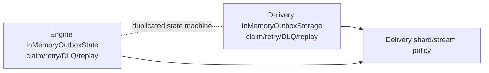
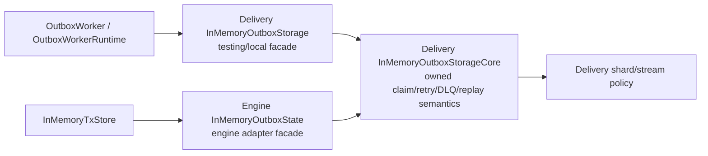
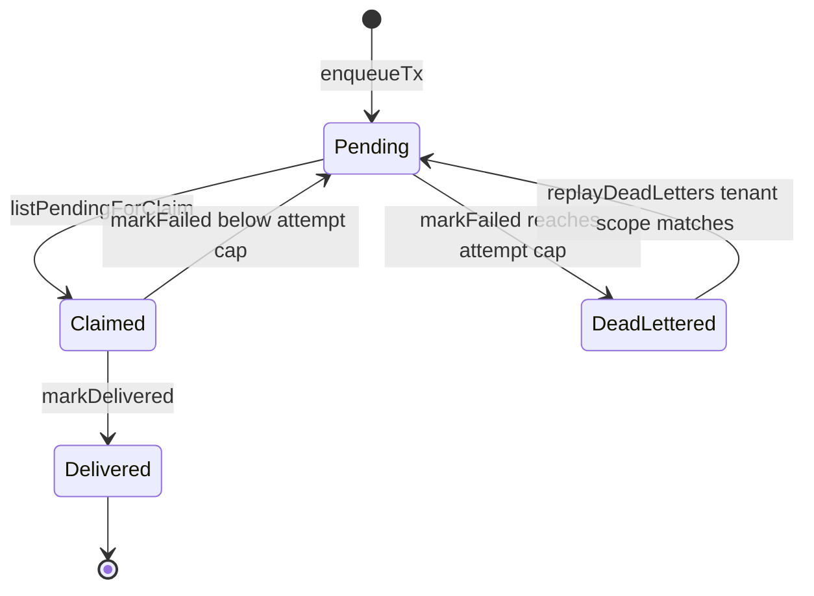

# AR-A7 Delivery Domain Runtime Split Plan

## Purpose

`AR-A7` removes delivery-domain rule duplication between `@dvt/delivery` and
`@dvt/engine`. The slice keeps worker runtime orchestration in delivery
application code, keeps engine in-memory state as an engine adapter, and moves
the reusable in-memory outbox claim, retry, dead-letter, replay, and
tenant/run-ordering semantics behind a Delivery-owned component API.

## Think-First Analysis

### Problem Summary

`packages/@dvt/delivery/src/testing/InMemoryOutboxStorage.ts` and
`packages/@dvt/engine/src/state/InMemoryOutboxState.ts` contain nearly identical
implementations for outbox enqueue, shard assignment, claim ordering, retry
backoff, dead-letter creation, tenant-scoped listing, and replay. The comments
already say Delivery owns the semantics, but Engine still carries a local copy.

### Root Cause

The earlier sharding work correctly centralized the hash and stream key policy,
but stopped at a facade. The larger in-memory outbox state machine remained
duplicated, so future delivery changes could pass package tests while engine
tests silently execute older semantics.

### Fowler And Mature-System Framing

Mature systems keep domain rules in one owner and let other bounded contexts use
ports or facades. This slice applies:

- **Duplicate semantics**: converge two state machines into one Delivery-owned
  in-memory outbox component.
- **Boundary drift**: keep Engine from owning delivery retry, dead-letter, or
  claim ordering rules.
- **Service Layer / Gateway**: keep `OutboxWorkerRuntime` as orchestration and
  expose a narrow reusable storage component for tests and local adapters.
- **Semantic architecture test**: guard the owner boundary, not just a barrel
  shape.

## Command And Query Rail Impact

This slice changes internal worker/storage behavior only. It does not introduce
a new externally observable API.

- Rail: `ClaimOutboxBatch`.
- Type: command.
- Bounded context: Delivery.
- DDD owner: `InMemoryOutboxStorageCore` component implementing the
  Delivery-owned `IOutboxStorage` semantics for local and test adapters.
- Application port: `IOutboxStorage`.
- Adapter surfaces: delivery testing storage and engine in-memory state-store
  adapter.
- Scope and authorization: no new user or tenant authorization surface; tenant
  scope comes from the persisted event envelope and existing dead-letter query
  arguments.
- Negative tests: engine must not re-implement retry/dead-letter/claim-ordering
  internals; engine and delivery storage must preserve equivalent outbox
  behavior through the same component.

## Fowler Planning Matrix

| Scenario                                                                           | Opportunity             | Fowler pattern                             | DDD owner                   | Command/query rail                 | Implementation surfaces                                                                                                    | Unit or package test     | Architecture test                              | User-flow test | Out of scope                    |
| ---------------------------------------------------------------------------------- | ----------------------- | ------------------------------------------ | --------------------------- | ---------------------------------- | -------------------------------------------------------------------------------------------------------------------------- | ------------------------ | ---------------------------------------------- | -------------- | ------------------------------- |
| Engine in-memory state exposes outbox storage for engine tests                     | Duplicate semantics     | Gateway over Delivery-owned component      | `InMemoryOutboxStorageCore` | `ClaimOutboxBatch` command         | `packages/@dvt/delivery/src/testing/InMemoryOutboxStorageCore.ts`, `packages/@dvt/engine/src/state/InMemoryOutboxState.ts` | engine outbox tests      | delivery architecture guard                    | Not applicable | PostgreSQL schema changes       |
| Delivery testing storage preserves claim, retry, dead-letter, and replay semantics | Boundary drift          | Service Layer / Policy-owned state machine | `InMemoryOutboxStorageCore` | `ClaimOutboxBatch` command         | `packages/@dvt/delivery/src/testing/InMemoryOutboxStorage.ts`                                                              | delivery worker tests    | delivery architecture guard                    | Not applicable | Worker runtime behavior changes |
| Runtime loop remains orchestration-only                                            | Responsibility overload | Application Controller                     | `OutboxWorkerRuntime`       | none - internal orchestration only | `packages/@dvt/delivery/src/application/*` docs and guards                                                                 | existing runtime tests   | architecture guard checks dependency direction | Not applicable | New runtime shell abstraction   |
| Docs describe current ownership truth                                              | Documentation drift     | Component guide                            | Delivery component docs     | none - current-state docs          | delivery/outbox component docs and planning proposal                                                                       | markdown/docs validation | feature mechanization                          | Not applicable | New product docs                |

## Current-State Diagram



## Target Diagram



## Component API And Invariants

### Public API

- `InMemoryOutboxStorageCore(deps?)`: Delivery-owned reusable in-memory
  implementation of `IOutboxStorage`.
- `InMemoryOutboxStorage(deps?)`: delivery testing/local facade that delegates
  to the core.
- `InMemoryOutboxState(deps?)`: engine adapter facade that delegates to the core
  while keeping engine-local constructor vocabulary.

### Invariants

- Claim eligibility is scoped by owned shard ids when provided.
- Zero claim limit returns no records.
- Same `(tenantId, runId)` streams are delivered in `runSeq` order.
- Retry backoff blocks only the stream head until `nextAttemptAt`.
- Dead-lettered stream heads block later records for that same `(tenantId,
runId)` until replay.
- Dead-letter listing and replay remain tenant-scoped.
- Replay restores the original payload, clears failure state, and preserves the
  stored shard assignment.
- Engine does not import `node:crypto`, calculate shard hashes, sort eligible
  delivery records, or own retry/dead-letter transition rules.

## Transitions



## Red/Green Plan

1. Add an architecture test proving Delivery owns the in-memory outbox state
   machine and Engine delegates instead of duplicating internal arrays, retry
   backoff, and dead-letter transition code.
2. Run the architecture test and observe the expected red failure against the
   current duplicated implementation.
3. Extract `InMemoryOutboxStorageCore` inside `@dvt/delivery`.
4. Make `InMemoryOutboxStorage` and `InMemoryOutboxState` delegate to the core.
5. Run delivery and engine outbox tests until green.
6. Add ARC-2 evidence and risk register because Engine files change.
7. Run docs sync, governance refresh, ARC check, package validations, and
   `pnpm verify:prepush`.

## Feature Mechanization Manifest

```feature-mechanization
version: 1
featureId: AR-A7-DELIVERY-DOMAIN-RUNTIME-SPLIT
mechanizationStatus: implemented
noHumanDecisionsRemaining: true
implementationPlan: docs/planning/proposals/mandatory/runtime-and-contracts/ar-a7-delivery-domain-runtime-split-plan-20260514.md
componentGuides:
  - docs/architecture/components/delivery/index.md
  - docs/architecture/components/delivery/delivery-ddd.md
  - docs/architecture/components/delivery/in-memory-outbox-storage-component.md
  - docs/architecture/components/outbox-worker/tenant-aware-outbox-sharding-component.md
userStories:
  - docs/architecture/components/delivery/in-memory-outbox-storage-user-stories.md
governingSources:
  - AGENTS.md
  - docs/planning/status/governance-document-rule-inventory.md
  - docs/architecture/command-query-rail-governance.md
  - docs/architecture/fowler-opportunity-planning-governance.md
  - docs/planning/reviews/architecture-and-governance/20260419-post-rc-g1-c-architecture-review.md
allowedImplementationSurfaces:
  - docs/planning/proposals/mandatory/runtime-and-contracts/ar-a7-delivery-domain-runtime-split-plan-20260514.md
  - docs/planning/proposals/mandatory/runtime-and-contracts/index.md
  - docs/planning/proposals/mandatory/index.md
  - docs/planning/proposals/index.md
  - docs/planning/closeouts/20260514-ar-a7-delivery-domain-runtime-split-closeout.md
  - docs/planning/closeouts/index.md
  - docs/planning/index.md
  - docs/planning/state/**
  - docs/planning/status/**
  - docs/.manifest.json
  - docs/architecture/components/delivery/**
  - docs/architecture/components/index.md
  - docs/architecture/index.md
  - docs/architecture/components/outbox-worker/tenant-aware-outbox-sharding-component.md
  - docs/evidence/**
  - docs/risk-register/quality/**
  - docs/risk-register/index.md
  - buzon/**
  - packages/@dvt/delivery/src/testing/InMemoryOutboxStorageCore.ts
  - packages/@dvt/delivery/src/testing/InMemoryOutboxStorage.ts
  - packages/@dvt/delivery/src/testing.ts
  - packages/@dvt/delivery/test/OutboxInMemoryStorageOwnership.architecture.test.ts
  - packages/@dvt/delivery/package.json
  - packages/@dvt/engine/src/state/InMemoryOutboxState.ts
  - packages/@dvt/engine/test/state/InMemoryTxStore.outbox.test.ts
forbiddenImplementationSurfaces:
  - packages/@dvt/contracts/**
  - packages/@dvt/planner/**
  - packages/@dvt/adapter-*/**
  - apps/**
commandQueryRails:
  - name: ClaimOutboxBatch
    type: command
    dddOwner: InMemoryOutboxStorageCore
  - name: ReplayDeadLetters
    type: command
    dddOwner: InMemoryOutboxStorageCore
fowlerSignals:
  - Duplicate semantics
  - Boundary drift
  - Responsibility overload
  - Documentation drift
architectureGuards:
  - pnpm exec vitest run packages/@dvt/delivery/test/OutboxInMemoryStorageOwnership.architecture.test.ts
cypressFlows:
  - Not applicable - internal Delivery/Engine storage ownership refactor only
domainObjects:
  - name: InMemoryOutboxStorageCore
    type: domain service / local adapter state machine
    owner: packages/@dvt/delivery/src/testing/InMemoryOutboxStorageCore.ts
  - name: InMemoryOutboxStorage
    type: delivery testing facade
    owner: packages/@dvt/delivery/src/testing/InMemoryOutboxStorage.ts
  - name: InMemoryOutboxState
    type: engine adapter facade
    owner: packages/@dvt/engine/src/state/InMemoryOutboxState.ts
redGreenCycles:
  - id: delivery-owned-in-memory-outbox-core
    redTest: pnpm exec vitest run packages/@dvt/delivery/test/OutboxInMemoryStorageOwnership.architecture.test.ts
    expectedFailure: InMemoryOutboxStorageCore is missing and Engine still carries local retry/dead-letter/claim-ordering state machine code.
    patchSurfaces:
      - packages/@dvt/delivery/src/testing/InMemoryOutboxStorageCore.ts
      - packages/@dvt/delivery/src/testing/InMemoryOutboxStorage.ts
      - packages/@dvt/delivery/src/testing.ts
      - packages/@dvt/engine/src/state/InMemoryOutboxState.ts
      - packages/@dvt/delivery/test/OutboxInMemoryStorageOwnership.architecture.test.ts
    greenTest: pnpm exec vitest run packages/@dvt/delivery/test/OutboxInMemoryStorageOwnership.architecture.test.ts packages/@dvt/delivery/test/OutboxWorker.retry.test.ts packages/@dvt/delivery/test/OutboxWorker.deadLetter.test.ts packages/@dvt/engine/test/state/InMemoryTxStore.outbox.test.ts
completionGate:
  - pnpm exec vitest run packages/@dvt/delivery/test/OutboxInMemoryStorageOwnership.architecture.test.ts packages/@dvt/delivery/test/OutboxWorker.retry.test.ts packages/@dvt/delivery/test/OutboxWorker.deadLetter.test.ts packages/@dvt/engine/test/state/InMemoryTxStore.outbox.test.ts
  - pnpm --filter @dvt/delivery test
  - pnpm --filter @dvt/delivery typecheck
  - pnpm --filter @dvt/engine typecheck
  - GIT_BASE=origin/main GIT_HEAD=HEAD node tools/ci/arc-check.mjs
  - pnpm governance:refresh
  - pnpm verify:prepush
symbols:
  - name: InMemoryOutboxStorageCore
    path: packages/@dvt/delivery/src/testing/InMemoryOutboxStorageCore.ts
    dddOwner: DeliveryInMemoryOutboxStorageStateMachine
    cqRails:
      - ClaimOutboxBatch
      - ReplayDeadLetters
    fowlerSignals:
      - Duplicate semantics
      - Boundary drift
    architectureGuard: pnpm exec vitest run packages/@dvt/delivery/test/OutboxInMemoryStorageOwnership.architecture.test.ts
    cypressCoverage: Not applicable - internal storage component
    unitTests:
      - pnpm --filter @dvt/delivery test
      - pnpm exec vitest run packages/@dvt/engine/test/state/InMemoryTxStore.outbox.test.ts
  - name: InMemoryOutboxStorage
    path: packages/@dvt/delivery/src/testing/InMemoryOutboxStorage.ts
    dddOwner: DeliveryTestingFacade
    cqRails:
      - ClaimOutboxBatch
    fowlerSignals:
      - Boundary drift
    architectureGuard: pnpm exec vitest run packages/@dvt/delivery/test/OutboxInMemoryStorageOwnership.architecture.test.ts
    cypressCoverage: Not applicable - internal storage component
    unitTests:
      - pnpm --filter @dvt/delivery test
  - name: InMemoryOutboxState
    path: packages/@dvt/engine/src/state/InMemoryOutboxState.ts
    dddOwner: EngineInMemoryStateStoreAdapter
    cqRails:
      - ClaimOutboxBatch
      - ReplayDeadLetters
    fowlerSignals:
      - Duplicate semantics
    architectureGuard: pnpm exec vitest run packages/@dvt/delivery/test/OutboxInMemoryStorageOwnership.architecture.test.ts
    cypressCoverage: Not applicable - internal storage component
    unitTests:
      - pnpm exec vitest run packages/@dvt/engine/test/state/InMemoryTxStore.outbox.test.ts
  - name: PersistedOutboxRecord
    path: packages/@dvt/delivery/src/testing/InMemoryOutboxStorageCore.ts
    dddOwner: DeliveryInMemoryOutboxStorageStateMachine
    cqRails:
      - ClaimOutboxBatch
    fowlerSignals:
      - Duplicate semantics
    architectureGuard: pnpm docs:feature-mechanization:implementation
    cypressCoverage: Not applicable - internal storage component
    unitTests:
      - pnpm --filter @dvt/delivery test
  - name: PersistedDeadLetterRecord
    path: packages/@dvt/delivery/src/testing/InMemoryOutboxStorageCore.ts
    dddOwner: DeliveryInMemoryOutboxStorageStateMachine
    cqRails:
      - ReplayDeadLetters
    fowlerSignals:
      - Duplicate semantics
    architectureGuard: pnpm docs:feature-mechanization:implementation
    cypressCoverage: Not applicable - internal storage component
    unitTests:
      - pnpm --filter @dvt/delivery test
  - name: ReplayDeadLetterOptions
    path: packages/@dvt/delivery/src/testing/InMemoryOutboxStorageCore.ts
    dddOwner: DeliveryInMemoryOutboxStorageStateMachine
    cqRails:
      - ReplayDeadLetters
    fowlerSignals:
      - Duplicate semantics
    architectureGuard: pnpm docs:feature-mechanization:implementation
    cypressCoverage: Not applicable - internal storage component
    unitTests:
      - pnpm --filter @dvt/delivery test
  - name: stripPersistedShardId
    path: packages/@dvt/delivery/src/testing/InMemoryOutboxStorageCore.ts
    dddOwner: DeliveryInMemoryOutboxStorageStateMachine
    cqRails:
      - ClaimOutboxBatch
    fowlerSignals:
      - Duplicate semantics
    architectureGuard: pnpm docs:feature-mechanization:implementation
    cypressCoverage: Not applicable - internal storage component
    unitTests:
      - pnpm --filter @dvt/delivery test
  - name: stripPersistedDeadLetterShardId
    path: packages/@dvt/delivery/src/testing/InMemoryOutboxStorageCore.ts
    dddOwner: DeliveryInMemoryOutboxStorageStateMachine
    cqRails:
      - ReplayDeadLetters
    fowlerSignals:
      - Duplicate semantics
    architectureGuard: pnpm docs:feature-mechanization:implementation
    cypressCoverage: Not applicable - internal storage component
    unitTests:
      - pnpm --filter @dvt/delivery test
  - name: matchesReplaySelection
    path: packages/@dvt/delivery/src/testing/InMemoryOutboxStorageCore.ts
    dddOwner: DeliveryInMemoryOutboxStorageStateMachine
    cqRails:
      - ReplayDeadLetters
    fowlerSignals:
      - Duplicate semantics
    architectureGuard: pnpm docs:feature-mechanization:implementation
    cypressCoverage: Not applicable - internal storage component
    unitTests:
      - pnpm --filter @dvt/delivery test
  - name: matchesReplayTenant
    path: packages/@dvt/delivery/src/testing/InMemoryOutboxStorageCore.ts
    dddOwner: DeliveryInMemoryOutboxStorageStateMachine
    cqRails:
      - ReplayDeadLetters
    fowlerSignals:
      - Duplicate semantics
    architectureGuard: pnpm docs:feature-mechanization:implementation
    cypressCoverage: Not applicable - internal storage component
    unitTests:
      - pnpm --filter @dvt/delivery test
  - name: matchesReplayRun
    path: packages/@dvt/delivery/src/testing/InMemoryOutboxStorageCore.ts
    dddOwner: DeliveryInMemoryOutboxStorageStateMachine
    cqRails:
      - ReplayDeadLetters
    fowlerSignals:
      - Duplicate semantics
    architectureGuard: pnpm docs:feature-mechanization:implementation
    cypressCoverage: Not applicable - internal storage component
    unitTests:
      - pnpm --filter @dvt/delivery test
  - name: matchesReplayIds
    path: packages/@dvt/delivery/src/testing/InMemoryOutboxStorageCore.ts
    dddOwner: DeliveryInMemoryOutboxStorageStateMachine
    cqRails:
      - ReplayDeadLetters
    fowlerSignals:
      - Duplicate semantics
    architectureGuard: pnpm docs:feature-mechanization:implementation
    cypressCoverage: Not applicable - internal storage component
    unitTests:
      - pnpm --filter @dvt/delivery test
  - name: epochMsToIsoUtc
    path: packages/@dvt/delivery/src/testing/InMemoryOutboxStorageCore.ts
    dddOwner: DeliveryInMemoryOutboxStorageStateMachine
    cqRails:
      - ClaimOutboxBatch
      - ReplayDeadLetters
    fowlerSignals:
      - Duplicate semantics
    architectureGuard: pnpm docs:feature-mechanization:implementation
    cypressCoverage: Not applicable - internal storage component
    unitTests:
      - pnpm --filter @dvt/delivery test
  - name: parseIsoUtcToEpochMs
    path: packages/@dvt/delivery/src/testing/InMemoryOutboxStorageCore.ts
    dddOwner: DeliveryInMemoryOutboxStorageStateMachine
    cqRails:
      - ClaimOutboxBatch
    fowlerSignals:
      - Duplicate semantics
    architectureGuard: pnpm docs:feature-mechanization:implementation
    cypressCoverage: Not applicable - internal storage component
    unitTests:
      - pnpm --filter @dvt/delivery test
  - name: REPO_ROOT
    path: packages/@dvt/delivery/test/OutboxInMemoryStorageOwnership.architecture.test.ts
    dddOwner: OutboxInMemoryStorageOwnershipArchitectureGuard
    cqRails:
      - ClaimOutboxBatch
    fowlerSignals:
      - Test-only confidence
    architectureGuard: pnpm exec vitest run packages/@dvt/delivery/test/OutboxInMemoryStorageOwnership.architecture.test.ts
    cypressCoverage: Not applicable - architecture guard
    unitTests:
      - pnpm exec vitest run packages/@dvt/delivery/test/OutboxInMemoryStorageOwnership.architecture.test.ts
  - name: readRepoFile
    path: packages/@dvt/delivery/test/OutboxInMemoryStorageOwnership.architecture.test.ts
    dddOwner: OutboxInMemoryStorageOwnershipArchitectureGuard
    cqRails:
      - ClaimOutboxBatch
    fowlerSignals:
      - Test-only confidence
    architectureGuard: pnpm exec vitest run packages/@dvt/delivery/test/OutboxInMemoryStorageOwnership.architecture.test.ts
    cypressCoverage: Not applicable - architecture guard
    unitTests:
      - pnpm exec vitest run packages/@dvt/delivery/test/OutboxInMemoryStorageOwnership.architecture.test.ts
```
