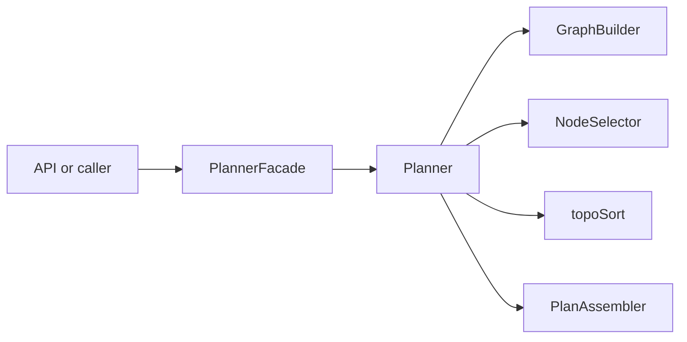
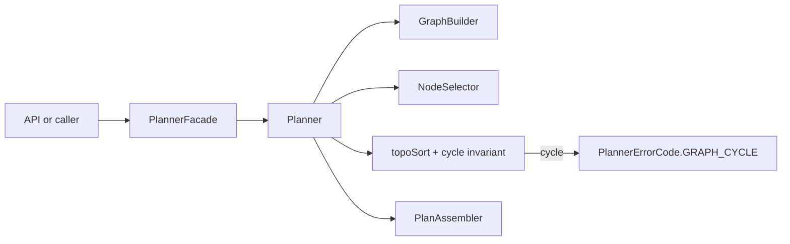
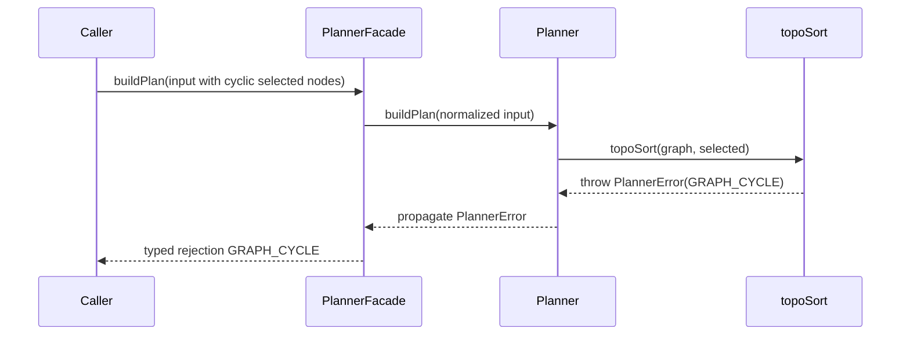
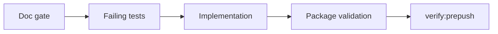

# AR-A9 Planner Cycle Fail-Closed Plan

## Summary

`AR-A9` hardens planner cycle handling so cyclic selected subgraphs are always
rejected with the canonical typed error `PlannerErrorCode.GRAPH_CYCLE`.

This slice is governed as docs-first and TDD-first:

1. documentation gate
2. failing tests
3. deterministic implementation
4. regression hardening
5. planning closeout and evidence

## Contract posture

- Keep `PlannerErrorCode.GRAPH_CYCLE` as the only canonical cycle error code.
- Do not introduce `CYCLE_DETECTED` aliases.
- Preserve `PlannerError` shape and existing public planner boundary.
- Keep cycle authority at `topoSort(...)`.

## Current and target

### As-is



### To-be



### Sequence: cyclic selected subgraph



### Test flow



## AR-A9 decomposition

### AR-A9-A Documentation gate and contract reconciliation

- Publish this proposal plus technical and user manuals.
- Align active planning/review text to `GRAPH_CYCLE`.
- Ensure Mermaid diagrams are coherent across documents.

DoD:

- canonical docs are published
- no active planning surface requires `CYCLE_DETECTED`
- invariants and negative scenarios are explicitly documented

### AR-A9-B TDD for cycle rejection

- Add failing tests for:
  - two-node cycle
  - self-cycle
  - multiple disconnected selected cycles
  - disconnected graph with one cyclic component selected
  - partial selection that excludes a cyclic component
- Assert canonical contract `PlannerErrorCode.GRAPH_CYCLE`.

DoD:

- tests fail before implementation change
- tests are deterministic and not order-coupled

### AR-A9-C Deterministic implementation hardening

- Harden `topoSort.ts` cycle diagnostics while preserving `GRAPH_CYCLE`.
- Keep deterministic output and no boundary changes.

DoD:

- all new cycle tests pass
- no plan truncation under cyclic selected subgraphs

### AR-A9-D Boundary and regression coverage

- Add planner and facade regression tests proving typed cycle rejection at
  public boundary.
- Add non-regression test for acyclic selected subgraph in larger graph.

DoD:

- domain plus boundary coverage present
- negative and non-regression cases both covered

### AR-A9-E Planning closure and evidence

- Update lane progress and subtask state.
- Publish closeout with validation evidence and no-debt/no-stub statement.

DoD:

- lane registry is execution-complete
- closeout published with command evidence

## Validation baseline

```bash
pnpm --filter @dvt/planner build
pnpm --filter @dvt/planner test
pnpm --filter @dvt/contracts build
pnpm docs:sync
pnpm docs:workboard:generate
pnpm verify:prepush
```
