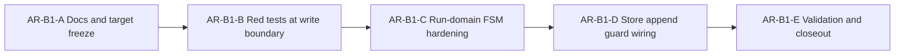

# AR-B1 run-status write-boundary plan

## Summary

`AR-B1` hardens the append boundary so invalid event sequences are rejected
before persistence, snapshot mutation, and outbox enqueue.

This is a docs-first TDD slice:

1. freeze behavior and invariants in canonical docs,
2. write failing tests for write-boundary transition rules,
3. implement run-domain and state-store guards,
4. close with evidence-backed validation.

## Governing sources

- `docs/adr/ADR-0003-execution-model.md`
- `docs/adr/ADR-0004-event-sourcing-strategy.md`
- `docs/adr/ADR-0007_RunCancellation.md`
- `docs/adr/ADR-0013-run-state-store-bootstrapRunTx.md`
- `docs/adr/ADR-0040-retry-ownership-and-attempt-authority.md`
- `docs/planning/execution-model/dvt-execution-model.md`
- `docs/architecture/engine/contracts/engine/ExecutionSemantics.v1.md`
- `docs/architecture/engine/contracts/state-store/overview.md`
- `docs/planning/reviews/architecture-and-governance/20260402-deep-architectural-review.md`

## Problem statement

Today, envelope schema checks and idempotency checks execute at append time, but
the full legal transition model is still implicit and enforced too late. This
allows semantically invalid write attempts (for example `StepCompleted` before
`StepStarted`) to reach persistence paths unless caught by projection behavior.

## Target behavior

- `appendAndEnqueueTx` rejects illegal transitions before any persisted write.
- Rejections are typed as `INVALID_STATE_TRANSITION`.
- Deduped events remain no-op and must not fail the batch.
- Validation runs against an in-batch ephemeral state so legal same-batch
  progressions remain allowed.
- signal-derived lifecycle events (`PAUSE`/`RESUME`) are pre-validated before
  provider signal dispatch to avoid external side effects on illegal
  transitions.

## Unblock roadmap



### AR-B1-A Docs and target freeze

- publish this proposal
- publish technical and user manuals
- register decomposition in lane registry (`AR-B1-A..E`)

DoD:

- canonical docs exist and are linked from planning/runtime surfaces
- invariants and rejection rules are explicit and non-contradictory

### AR-B1-B Red tests at write boundary

- add failing tests for illegal run and step transitions
- cover in-memory and Postgres append boundaries

DoD:

- tests fail on current behavior for at least one illegal sequence
- no production code changed in this wave

### AR-B1-C Run-domain FSM hardening

- codify legal transition rules in `@dvt/run-domain`
- keep deterministic, pure transition function

DoD:

- run-level and step-level legal transitions are explicit in code
- illegal transitions produce typed stable error details

### AR-B1-D Store append guard wiring

- ensure write paths evaluate legal transitions before mutation commit
- preserve idempotency semantics for deduped events

DoD:

- `appendAndEnqueueTx` rejects illegal transitions before write effects
- dedupe replay with same idempotency key remains accepted

### AR-B1-E Validation and closeout

- run package tests and prepush gate
- update evidence/risk if ARC-2 requires it

DoD:

- required tests and `pnpm verify:prepush` pass
- closeout includes concrete validation evidence

## TDD baseline

Initial red tests must include at least:

- `StepCompleted` without prior `StepStarted` in same attempt
- `StepFailed` without prior `StepStarted`
- `RunPaused` when run is not `RUNNING`
- `RunResumed` when run is not `PAUSED`
- `RunCancelled` without prior cancellation intent state

## Validation baseline

```bash
pnpm --filter @dvt/run-domain test
pnpm test:engine
pnpm test:adapter-postgres
pnpm docs:workboard:generate
pnpm docs:sync
pnpm verify:prepush
```
