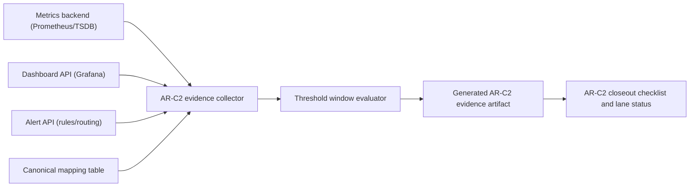
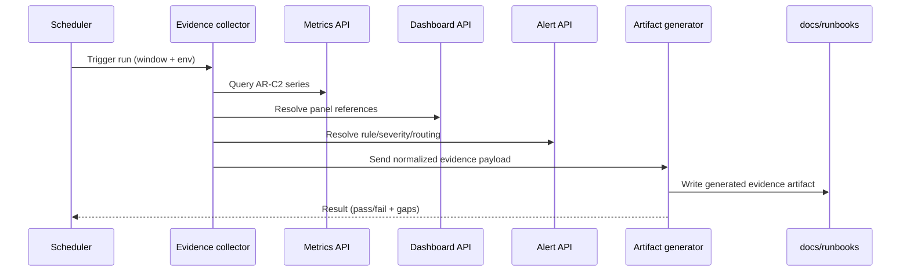

# AR-C2 automated evidence generation plan

## Context

AR-C2 currently has canonical SLA definitions and signal mapping, but closure is
still blocked by manual operational evidence capture in `T2`, `T3`, and `T4`.

The system can emit metrics, but the evidence path from observability tools to
governed closeout artifacts is not automated yet.

## Objective

Build a governed automatic evidence-generation flow that converts observability
data into a deterministic AR-C2 artifact usable for closure without manual row
entry.

## Summary

This plan defines how to automate AR-C2 operational evidence (`T2`, `T3`,
`T4`) so closure does not depend on manual copy/paste from dashboards and alert
tools.

The output is a governed evidence artifact generated by the system from
monitoring sources.

## Problem statement

Current AR-C2 posture is blocked by manual evidence collection:

- dashboard wiring proof must be entered row-by-row,
- alert wiring proof must be entered row-by-row,
- sustained threshold windows are not automatically captured.

This causes slow closure and audit friction.

## Target behavior

- system extracts panel and alert metadata from monitoring sources,
- system evaluates threshold windows for canonical AR-C2 signals,
- system renders one governed artifact with timestamps and immutable refs,
- AR-C2 closeout consumes the generated artifact as the source of truth.

## Domain diagram

## Sequence diagram

## Deliverables

1. Evidence-collector service/script contract.
2. Generated artifact schema for AR-C2 evidence.
3. Runbook/manual updates that explain automatic flow.
4. Lane/closeout linkage to generated artifact path.

## Acceptance criteria

1. Generated artifact contains dashboard refs for all mapped signals.
2. Generated artifact contains alert refs for all mapped thresholds.
3. Generated artifact contains sustained window outcomes (`pass`/`fail`).
4. Manual evidence entry for AR-C2 `T2/T3/T4` is no longer required.

## Non-goals

- replacing canonical SLA definitions,
- changing runtime metric names in this slice,
- changing product authorization model.
