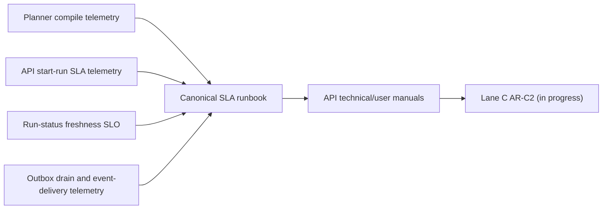
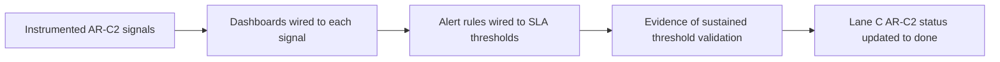
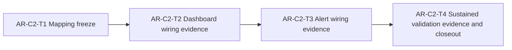

# AR-C2 SLA operational closure plan

## Summary

`AR-C2` is in progress and already has canonical SLA docs, manuals, and emitted
telemetry for plan compile, run start, outbox drain, and event delivery.

This plan closes only the remaining AR-C2 scope:

1. complete dashboard wiring against emitted metrics,
2. complete alert wiring with explicit threshold mapping,
3. capture sustained threshold-validation evidence and lane closeout posture.

No runtime contract/API changes are planned in this slice.

## Governing sources

- `AGENTS.md`
- `docs/planning/status/governance-document-rule-inventory.md`
- `docs/guides/ai-work-protocol.md`
- `docs/planning/state/planning-control-tower.md`
- `docs/planning/state/agent-lane-c.yaml` (`AR-C2`)
- `docs/planning/templates/qa/TEMPLATE_QA_ARTIFACT_EXAMPLE.md`
- `docs/planning/templates/qa/TEMPLATE_QA_CURRENT_TASK_CHECK_PROMPT.md`
- `docs/runbooks/api-runtime-sla-canonical-20260404.md`
- `docs/runbooks/ar-c2-sla-signal-threshold-mapping-20260404.md`
- `docs/guides/api-control-plane-technical-manual-20260404.md`
- `docs/guides/api-control-plane-user-manual-20260404.md`
- `docs/planning/reviews/architecture-and-governance/20260402-deep-architectural-review.md`

## Problem statement

The repository now emits the core AR-C2 signals in code, but AR-C2 remains open
because operational closure is incomplete:

- dashboard panels are not yet evidenced as wired to all canonical AR-C2 signals;
- alert rules and thresholds are not yet fully evidenced as running and actionable;
- there is no sustained threshold-validation evidence proving the defined SLA
  posture is operationally enforced over time.

Without this closure, AR-C2 stays documentation-complete but not
operations-complete.

## Target behavior

AR-C2 is considered complete only when:

- each canonical AR-C2 signal maps to a dashboard panel and alert rule;
- each alert rule maps to SLA threshold semantics in the canonical SLA runbook;
- evidence captures real threshold-validation runs and resulting operator
  posture;
- Lane C registry can mark AR-C2 `done` with evidence-backed status reason.

## Mermaid diagram: current-state signal path

## Mermaid diagram: target closure path

## Unblock roadmap

### AR-C2-T1 Mapping freeze

- freeze metric -> panel -> alert -> SLA threshold mapping
- confirm no required AR-C2 signal is missing from the mapping

DoD:

- mapping table exists in governed docs path
- every canonical AR-C2 signal has target panel and alert owner
- no ambiguous metric names remain
- canonical file: `docs/runbooks/ar-c2-sla-signal-threshold-mapping-20260404.md`

### AR-C2-T2 Dashboard wiring evidence

- wire dashboard coverage for all mapped AR-C2 signals
- capture evidence that panels render and align with expected dimensions

DoD:

- dashboard evidence references are recorded in AR-C2 outputs
- missing-panel list is empty for AR-C2 scope
- panel labels align with canonical SLA vocabulary

### AR-C2-T3 Alert wiring evidence

- wire alert rules to AR-C2 thresholds and severity posture
- validate alert expressions against emitted metric names

DoD:

- every mapped threshold has at least one alert rule
- severity and routing are documented for each rule
- no rule references non-emitted or stale metric names

### AR-C2-T4 Sustained validation evidence and closeout

- run threshold-validation windows and collect evidence
- update lane status posture and closeout references

DoD:

- evidence artifact records validation windows and outcomes
- unresolved AR-C2 blockers are either closed or explicitly re-tracked
- lane registry can move AR-C2 from `in_progress` to `done` when complete

## QA validation artifact section

This section follows `docs/planning/templates/qa/TEMPLATE_QA_ARTIFACT_EXAMPLE.md`
as the baseline action artifact shape for this slice.

## Findings

### High

- Title: AR-C2 operational closure evidence is incomplete.
  Why it matters: lane closure depends on operational, not doc-only, proof.
  Evidence: `docs/planning/state/agent-lane-c.yaml` status reason for `AR-C2`.
  Risk: SLA contract cannot be treated as enforced in real operations.
  Recommendation: execute `AR-C2-T1..T4` and record governed evidence.

### Medium

- Title: Signal-to-alert traceability needed one canonical mapping artifact.
  Why it matters: review and audit friction increase when mapping is fragmented.
  Evidence: refs were split across manuals, runbook, and code refs before the
  AR-C2 mapping artifact was introduced.
  Risk: missed or stale thresholds during operations.
  Recommendation: keep `docs/runbooks/ar-c2-sla-signal-threshold-mapping-20260404.md`
  as the single mapping source for `AR-C2-T2/T3` evidence.

### Low

- Title: AR-C2 decomposition was not explicit in lane task children.
  Why it matters: execution ownership and progress checkpoints remain coarse.
  Evidence: lane entry had one parent task without child decomposition.
  Risk: weak milestone tracking.
  Recommendation: track `AR-C2-T1..T4` as explicit child tasks.

## Alignment

- Doc vs code: AR-C2 docs and telemetry code are aligned for emitted signals.
- Promise vs implementation: remaining gap is wiring evidence and sustained
  threshold validation, not missing instrumentation primitives.
- Tests vs claims: this slice is planning/governance; runtime tests are
  unchanged.
- Current truth vs planned truth: current truth is `in_progress`; target truth
  is evidence-backed `done`.
- Documentation update status: this proposal defines closure path and QA action
  artifact.
- Evidence and risk-doc status: evidence updates are expected in AR-C2-T4;
  additional risk-doc update depends on findings during validation.

## Architecture Assessment

- SRP: unchanged in runtime code for this slice.
- DDD: unchanged boundaries; this slice strengthens operational boundary
  traceability.
- Hexagonal: unchanged code seams; improves observability-to-operations chain.
- CQRS if relevant: unchanged.
- Complexity: reduced planning ambiguity by explicit decomposition.
- Modularity: improved at planning level via AR-C2 child tasks.

## Test Assessment

- Negative paths present: N/A for runtime code in this planning-only slice.
- Negative paths missing: N/A for runtime code in this planning-only slice.
- Regression status: no runtime edits introduced.
- Determinism: unchanged.
- Local suite vs meaningful global confidence: global confidence for AR-C2
  closure now depends on dashboard/alert evidence and sustained validation
  windows, not new code tests.
- Global system view applied: yes; planner compile, API start-run/freshness, and
  outbox delivery signals are covered in one closure map.
- Harness or shared fixture need: N/A in this planning-only slice.
- Test grouping by type rationale: N/A in this planning-only slice.

## Quality Gates

- Commands executed:
  - `pnpm qa:artifact:check`
  - `pnpm docs:workboard:generate`
  - `pnpm docs:sync`
  - `pnpm verify:prepush`
- What passed: to be recorded during execution closeout.
- What failed: to be recorded during execution closeout.
- What could not be verified: to be recorded during execution closeout.

## Action artifact

### Markdown artifact path suggestion

- `docs/planning/closeouts/20260404-ar-c2-sla-operational-closure-closeout.md`

Canonical progress tracker:

- `docs/planning/closeouts/20260404-ar-c2-sla-operational-closure-closeout.md`

### Task checklist

- [x] `AR-C2-T1` Freeze signal-to-threshold mapping
- [ ] `AR-C2-T2` Complete dashboard wiring evidence
- [ ] `AR-C2-T3` Complete alert wiring evidence
- [ ] `AR-C2-T4` Capture sustained validation evidence and closeout posture

### Task details

#### `AR-C2-T1` Freeze signal-to-threshold mapping

- Objective: establish one canonical AR-C2 mapping baseline.
- Scope: AR-C2 signals only.
- In current task scope: yes.
- Dependencies: none.
- Documentation impact: update governed planning/runbook references as needed.
- Evidence / risk-doc impact: supports later evidence traceability.
- Comment with rationale: prevents wiring drift and naming ambiguity.
- Definition of Done: one canonical mapping table covers all AR-C2 signals.
- Iteration status: completed in
  `docs/runbooks/ar-c2-sla-signal-threshold-mapping-20260404.md`.

#### `AR-C2-T2` Complete dashboard wiring evidence

- Objective: prove dashboard coverage for each mapped signal.
- Scope: dashboard panels tied to AR-C2 metrics.
- In current task scope: yes.
- Dependencies: `AR-C2-T1`.
- Documentation impact: add dashboard evidence references in AR-C2 outputs.
- Evidence / risk-doc impact: contributes to closure evidence package.
- Comment with rationale: panels are required for operational visibility.
- Definition of Done: every mapped signal has panel evidence and owner.

#### `AR-C2-T3` Complete alert wiring evidence

- Objective: prove alert routing and thresholds are operational.
- Scope: alert rules for AR-C2 metric families.
- In current task scope: yes.
- Dependencies: `AR-C2-T1`.
- Documentation impact: add alert mapping and routing evidence references.
- Evidence / risk-doc impact: contributes to closure evidence package.
- Comment with rationale: alertability is the enforceability layer of the SLA.
- Definition of Done: every mapped threshold has an active alert rule.

#### `AR-C2-T4` Capture sustained validation evidence and closeout posture

- Objective: prove AR-C2 thresholds hold under sustained observation windows.
- Scope: governed evidence + lane posture update.
- In current task scope: yes.
- Dependencies: `AR-C2-T2`, `AR-C2-T3`.
- Documentation impact: closeout/evidence and lane updates.
- Evidence / risk-doc impact: direct; may require risk update if failures found.
- Comment with rationale: AR-C2 cannot close without sustained evidence.
- Definition of Done: validation evidence is recorded and lane closure posture is
  explicitly updated.

## Final Verdict

- Ready with follow-ups
