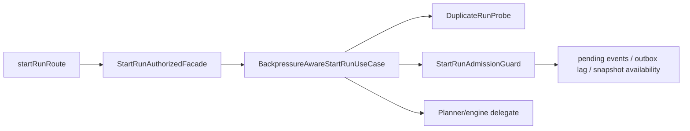
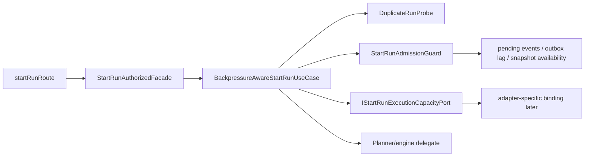
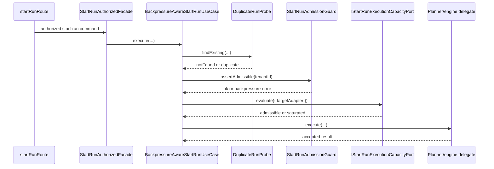

# AR-C3 start-run execution capacity admission plan

## Summary

`AR-C3` currently describes the problem in Temporal-specific terms:
propagating Temporal task-queue saturation back into API admission so the
system stops accepting runs it cannot execute.

That describes a real operational gap, but it is too concrete at the wrong
layer. The API admission boundary should not hard-code Temporal queue semantics
into its public design.

This plan reframes `AR-C3` around an abstract application seam:
`start-run execution capacity admission`.

The implementation route is intentionally split:

1. define an abstract `start-run` execution-capacity boundary in `apps/api`,
2. bind that boundary to a concrete adapter signal later,
3. close telemetry and operational evidence after the binding exists.

## Governing sources

- `AGENTS.md`
- `docs/planning/status/governance-document-rule-inventory.md`
- `docs/guides/ai-work-protocol.md`
- `docs/planning/state/planning-control-tower.md`
- `docs/planning/state/agent-lane-c.yaml` (`AR-C3`)
- `docs/architecture/components/api/api-current-to-target-architecture.md`
- `docs/guides/api-control-plane-technical-manual-20260404.md`
- `docs/planning/reviews/architecture-and-governance/20260402-deep-architectural-review.md`
- `docs/planning/reviews/architecture-and-governance/20260420-dvt-plus-system-architecture-review.md`

## Problem statement

The current API admission path already rejects or degrades on:

- duplicate run detection,
- tenant pending-event pressure,
- outbox lag pressure,
- snapshot unavailability.

It does not yet answer the neighboring question:

> can the selected execution adapter absorb another `start-run` request now?

That creates two problems:

1. API admission can accept work that the downstream executor cannot absorb.
2. The planning language of `AR-C3` risks coupling the API boundary directly to
   Temporal-specific queue details instead of defining a provider-agnostic seam.

Mature systems do not solve this by teaching route handlers or application
services about a particular scheduler queue. They define an admission-facing
capacity seam and bind a concrete provider signal behind it.

## Decision

### 1. Define an abstract `start-run` capacity seam first

The first implementation slice for `AR-C3` will define a new application port
owned by `apps/api`:

- `IStartRunExecutionCapacityPort`

Its job is narrow:

- evaluate whether the selected `targetAdapter` can admit a new `start-run`
- return an admission-semantic result
- remain agnostic of Temporal or any other concrete adapter

### 2. Keep the first contract small and `start-run` scoped

The initial contract intentionally stays scoped to the existing `start-run`
application use case rather than introducing a wide platform-level
`execution-capacity` service.

Candidate request/result vocabulary:

```ts
type StartRunExecutionCapacityRequest = {
  targetAdapter: StartRunTargetAdapter;
};

type StartRunExecutionCapacityResult =
  | { kind: 'admissible' }
  | {
      kind: 'saturated';
      reason: 'capacity_exhausted' | 'executor_unavailable' | 'capacity_signal_unavailable';
      retryAfterSeconds?: number;
    };
```

Why this shape:

- `targetAdapter` is the minimum input needed for the first boundary
- `tenantId` is intentionally excluded from the first cut because no governed
  tenant-scoped execution-capacity policy exists yet
- `capacity_signal_unavailable` is modeled as an explicit fail-closed result,
  not a warning side channel

### 3. Keep final admission ownership in the use case

`BackpressureAwareStartRunUseCase` remains the owner of admission orchestration.
The new port becomes an additional admission dependency after:

1. duplicate probe
2. existing backpressure guard
3. execution-capacity check
4. delegate execution

The port does not emit HTTP envelopes, route errors, or adapter-native
telemetry payloads.

### 4. Bind adapter-specific signals later

The second implementation slice will bind the abstract port to a concrete
adapter signal.

That binding may be Temporal first, but the API boundary and planning language
will no longer be Temporal-shaped.

### 5. Operational closure is separate from contract introduction

Dashboard, alert, and sustained evidence work are valid `AR-C3` concerns, but
they should not inflate the first contract-introduction slice.

## Architecture

### Current topology



### Target topology



### Sequence



## Slice decomposition

### AR-C3-A: start-run execution capacity admission boundary

Scope:

- define `IStartRunExecutionCapacityPort`
- define request/result vocabulary
- integrate the port into `BackpressureAwareStartRunUseCase`
- add a fail-closed default implementation for composition-time use
- add unit coverage and component-local docs

Definition of done:

- the `start-run` use case can reject based on execution-capacity semantics
- the new seam is abstract and adapter-agnostic
- no route or HTTP module imports the binding directly
- architecture docs name the component and its consumers

### AR-C3-B: execution capacity adapter binding

Scope:

- implement the concrete binding for the selected adapter
- wire the binding in the protected runtime composition root
- add integration tests proving caller-visible admission behavior under
  saturation and unavailable-capacity conditions

Definition of done:

- the abstract port is driven by a real adapter signal
- the application seam remains provider-agnostic
- composition is the only place that knows the concrete binding

### AR-C3-C: execution capacity operational closure

Scope:

- telemetry naming and emitted labels for execution-capacity rejections
- runbook updates
- dashboard/alert evidence

Definition of done:

- rejection posture is observable and documented
- operators can distinguish execution-capacity denial from existing outbox/event
  pressure denial
- lane posture can move with evidence-backed justification

## Invariants

- The API admission boundary MUST remain adapter-agnostic.
- The execution-capacity port MUST return admission semantics, not raw queue or
  worker metrics.
- Failure to obtain a capacity signal MUST fail closed in the first slice.
- `BackpressureAwareStartRunUseCase` remains the orchestrator of duplicate,
  backpressure, capacity, and delegate ordering.
- Adapter binding lives in composition, not in route handlers or application
  contracts.

## Out of scope

- tenant-specific execution-capacity policy
- generalized admission-capacity reuse for non-`start-run` workflows
- exposing queue depth, utilization percentages, or provider-native metrics in
  the API application contract
- choosing the concrete adapter binding in the same slice as the abstract seam

## Validation baseline for the first execution slice

- package-level tests for `apps/api`
- targeted lint for touched API files
- component-local architecture tests for the new seam
- `pnpm docs:workboard:generate`
- `pnpm docs:sync`
- `pnpm verify:prepush`
