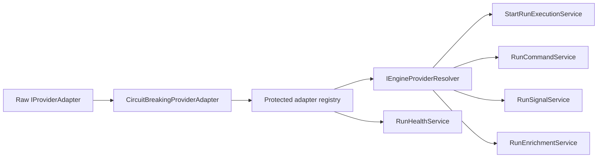
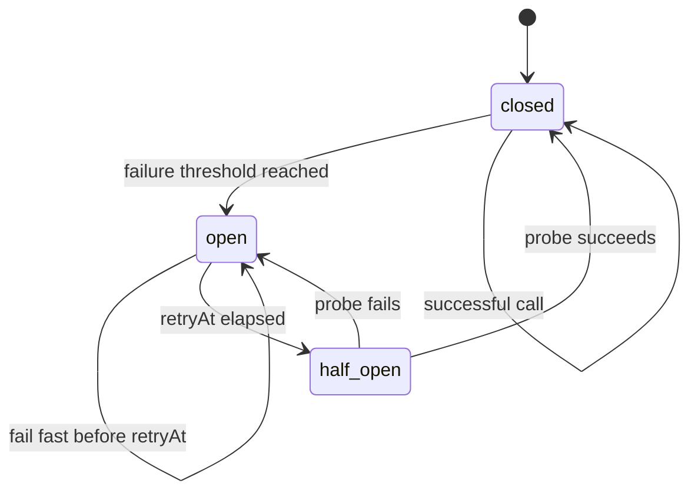

# AR-C5 Adapter Call Circuit Breaker Plan

## Think-First Analysis

Problem summary:

- Temporal-facing engine calls currently rely on timeout-only protection.
- During an adapter outage, start, cancel, signal, and enrichment calls can keep
  entering the provider boundary until timeout pressure accumulates.
- Health output reports adapter ping status but does not expose whether engine
  runtime calls are already being failed fast by a breaker posture.

Root cause:

- WE-HX-5 centralized provider lookup, but adapter availability policy still
  lives implicitly at each call site through timeout wrappers.
- The missing owned concern is an engine-local provider resilience policy that
  wraps `IProviderAdapter` once and reports its state to health and telemetry.

Constraints and invariants:

- ADR-0003 keeps DVT lifecycle semantics in the engine; the breaker may reject a
  provider call but MUST NOT synthesize lifecycle state.
- ADR-0014 keeps provider adapters run-driven; the breaker decorates adapter
  calls and does not change adapter semantics or fetch plans.
- Command/query rail governance requires one named operational rail for the
  fail-fast behavior and one named query rail for breaker posture.
- Fowler governance requires boundary drift, duplicate semantics, and
  documentation drift to be closed before implementation.

Options considered:

| Option                                                                     | Pattern                               | Result                                                                                                       |
| -------------------------------------------------------------------------- | ------------------------------------- | ------------------------------------------------------------------------------------------------------------ |
| Decorate `IProviderAdapter` in engine composition                          | Gateway / Decorator / Circuit Breaker | Selected; one boundary controls all provider calls.                                                          |
| Add breaker branches inside start, cancel, signal, and enrichment services | Conditional duplication               | Rejected; repeats policy and reopens WE-HX-5 drift.                                                          |
| Implement breaker inside `@dvt/adapter-temporal`                           | Infrastructure-owned policy           | Rejected for AR-C5; the engine owns runtime safety posture and health semantics.                             |
| Adopt an external circuit-breaker package                                  | Library                               | Rejected; the required behavior is small, synchronous state plus repo-specific telemetry and health posture. |

Selected option and rationale:

- Add an engine-owned `CircuitBreakingProviderAdapter` decorator and a
  `buildCircuitBreakingAdapterRegistry` helper.
- Production API composition wraps the runtime adapter registry once, then all
  existing provider resolver consumers use the protected adapter.
- Health output reads breaker snapshots from the decorated adapters and exposes
  posture alongside ping status.

Rejected alternatives:

- A per-service breaker would fix symptoms but preserve repeated call-protection
  semantics.
- A Temporal-only breaker would fail to protect future provider adapters through
  the same engine contract.

## Pre-Implementation Brief

- Mode: Full.
- Scope: engine adapter boundary, API engine composition, engine health output,
  component docs, user stories, architecture guard, unit tests, evidence, risk,
  and closeout.
- Expected outcome: start, cancel, signal, and provider-backed enrichment fail
  fast while the breaker is open; half-open probes close or reopen the breaker;
  metrics record state transitions and fail-fast calls; health exposes breaker
  posture.
- Risks and mitigations: fail-fast errors must not mutate run lifecycle state;
  tests assert delegate calls are skipped while open and docs state that the
  breaker is operational posture only.
- Out of scope: changing `@dvt/contracts`, changing provider adapter packages,
  changing Temporal activity internals, adding user-facing UI, or redesigning
  `EngineRunRef`.
- Validation plan: feature mechanization, targeted red/green tests, engine
  package tests and typecheck, docs sync/status generation, ARC check, and
  prepush verification.

## Command And Query Rail Impact

| Rail                               | Type    | Bounded context                | DDD owner                                       | Intent                                                | Port / adapter surface                                                                    | Scope and auth                                                                                                 | Negative tests                                              |
| ---------------------------------- | ------- | ------------------------------ | ----------------------------------------------- | ----------------------------------------------------- | ----------------------------------------------------------------------------------------- | -------------------------------------------------------------------------------------------------------------- | ----------------------------------------------------------- |
| `EngineAdapterCallCircuitBreaker`  | command | Workflow engine runtime safety | `CircuitBreakingProviderAdapter` policy service | Guard provider runtime calls and fail fast while open | `IProviderAdapter` decorator around start, cancel, signal, and provider status view calls | Internal engine composition; tenant scope is inherited from the admitted command/query before adapter dispatch | open breaker skips delegate call; half-open failure reopens |
| `EngineAdapterBreakerPostureQuery` | query   | Workflow engine operations     | `RunHealthService` read model                   | Expose breaker posture in health output               | `IRunHealthService.healthCheck()`                                                         | Operational health read; no tenant data exposed                                                                | health reports open/half-open posture and last failure      |

## Fowler Opportunity Matrix

| Scenario                                                   | Opportunity                              | Fowler pattern                      | DDD owner                        | Command/query rail                 | Implementation surfaces                                 | Unit or package test                      | Architecture test                            | User-flow test            | Out of scope                       |
| ---------------------------------------------------------- | ---------------------------------------- | ----------------------------------- | -------------------------------- | ---------------------------------- | ------------------------------------------------------- | ----------------------------------------- | -------------------------------------------- | ------------------------- | ---------------------------------- |
| Adapter outage during start, cancel, signal, or enrichment | Boundary drift and duplicate semantics   | Decorator, Gateway, Circuit Breaker | `CircuitBreakingProviderAdapter` | `EngineAdapterCallCircuitBreaker`  | `packages/@dvt/engine/src/adapters/**`, API composition | `CircuitBreakingProviderAdapter.test.ts`  | `adapterCircuitBreaker.architecture.test.ts` | N/A - engine internal     | Temporal adapter internals         |
| Operators inspect runtime health                           | Documentation drift and hidden authority | Operational read model              | `RunHealthService`               | `EngineAdapterBreakerPostureQuery` | `IRunHealthService`, `RunHealthService`                 | `RunHealthService.test.ts` / wrapper test | `adapterCircuitBreaker.architecture.test.ts` | N/A - health service only | UI health dashboard                |
| Future provider seams must not bypass breaker              | Test-only confidence                     | Semantic architecture guard         | Engine architecture guard        | Both rails                         | component guide and architecture test                   | N/A                                       | `adapterCircuitBreaker.architecture.test.ts` | N/A                       | Broader provider identity redesign |

## Diagrams





## Feature Mechanization

```feature-mechanization
version: 1
featureId: AR-C5-ADAPTER-CIRCUIT-BREAKING
mechanizationStatus: implemented
noHumanDecisionsRemaining: true
implementationPlan: docs/planning/proposals/mandatory/runtime-and-contracts/ar-c5-adapter-circuit-breaker-plan-20260512.md
componentGuides:
  - docs/architecture/components/engine/architecture/adapter-circuit-breaker-component.md
  - docs/architecture/components/engine/architecture/workflow-engine-provider-telemetry-seams-component.md
userStories:
  - docs/architecture/components/engine/architecture/adapter-circuit-breaker-user-stories.md
governingSources:
  - AGENTS.md
  - docs/planning/status/governance-document-rule-inventory.md
  - docs/guides/ai-work-protocol.md
  - docs/architecture/command-query-rail-governance.md
  - docs/architecture/fowler-opportunity-planning-governance.md
  - docs/planning/proposals/mandatory/runtime-and-contracts/ar-c5-adapter-circuit-breaker-plan-20260512.md
  - docs/architecture/components/engine/architecture/workflow-engine-provider-telemetry-seams-component.md
  - docs/adr/ADR-0003-execution-model.md
  - docs/adr/ADR-0014-run-driven-adapter-model.md
allowedImplementationSurfaces:
  - buzon/20260512-codex-fowler-ar-c5-adapter-circuit-breaker-analysis-and-remediation.md
  - docs/planning/proposals/mandatory/runtime-and-contracts/ar-c5-adapter-circuit-breaker-plan-20260512.md
  - docs/planning/closeouts/20260512-ar-c5-adapter-circuit-breaker-closeout.md
  - docs/planning/status/generated-code-state.md
  - docs/planning/status/system-operations-inventory-20260501.md
  - docs/architecture/components/engine/architecture/index.md
  - docs/architecture/components/engine/architecture/adapter-circuit-breaker-component.md
  - docs/architecture/components/engine/architecture/adapter-circuit-breaker-user-stories.md
  - docs/evidence/ed-20260512-ar-c5-adapter-circuit-breaker.md
  - docs/evidence/index.md
  - docs/risk-register/quality/R-20260512-AR-C5-ADAPTER-CIRCUIT-BREAKER.yaml
  - docs/risk-register/quality/index.md
  - traceability.manifest.json
  - apps/api/src/application/services/WorkflowEngineFactory.ts
  - apps/api/test/application/services/WorkflowEngineFactory.test.ts
  - packages/@dvt/engine/src/adapters/CircuitBreakingProviderAdapter.ts
  - packages/@dvt/engine/src/adapters/IProviderAdapter.ts
  - packages/@dvt/engine/src/application/providerSelection.ts
  - packages/@dvt/engine/src/domain/IRunHealthService.ts
  - packages/@dvt/engine/src/services/RunHealthService.ts
  - packages/@dvt/engine/src/index.ts
  - packages/@dvt/engine/test/adapters/CircuitBreakingProviderAdapter.test.ts
  - packages/@dvt/engine/test/architecture/adapterCircuitBreaker.architecture.test.ts
forbiddenImplementationSurfaces:
  - packages/@dvt/contracts/**
  - packages/@dvt/adapter-*/**
  - packages/@dvt/planner/**
  - apps/web/**
  - specs/**
commandQueryRails:
  - name: EngineAdapterCallCircuitBreaker
    type: command
    dddOwner: CircuitBreakingProviderAdapter
  - name: EngineAdapterBreakerPostureQuery
    type: query
    dddOwner: RunHealthService
domainObjects:
  - name: CircuitBreakingProviderAdapter
    type: policy decorator
    owner: packages/@dvt/engine/src/adapters/CircuitBreakingProviderAdapter.ts
  - name: AdapterCircuitBreakerSnapshot
    type: operational read model
    owner: packages/@dvt/engine/src/adapters/CircuitBreakingProviderAdapter.ts
  - name: buildCircuitBreakingAdapterRegistry
    type: composition helper
    owner: packages/@dvt/engine/src/adapters/CircuitBreakingProviderAdapter.ts
fowlerSignals:
  - Timeout-only adapter protection replaced with one breaker policy.
  - Provider-call protection stays at the adapter boundary instead of repeated service branches.
  - Health documentation and output expose current breaker posture.
architectureGuards:
  - pnpm --filter @dvt/engine test -- test/architecture/adapterCircuitBreaker.architecture.test.ts
  - pnpm docs:feature-mechanization:implementation
cypressFlows:
  - N/A - engine runtime safety and operational health only
completionGate:
  - pnpm docs:feature-mechanization -- --feature AR-C5-ADAPTER-CIRCUIT-BREAKING
  - pnpm --filter @dvt/engine test -- test/architecture/adapterCircuitBreaker.architecture.test.ts
  - pnpm --filter @dvt/engine test -- test/adapters/CircuitBreakingProviderAdapter.test.ts
  - pnpm --filter @dvt/engine test
  - pnpm --filter @dvt/engine typecheck
  - GIT_BASE=origin/main GIT_HEAD=HEAD node tools/ci/arc-check.mjs
  - pnpm docs:status:generate
  - pnpm docs:sync
  - pnpm governance:refresh
  - pnpm docs:feature-mechanization:implementation
  - pnpm verify:prepush
redGreenCycles:
  - id: adapter-circuit-breaker-semantic-guard
    redTest: pnpm --filter @dvt/engine test -- test/architecture/adapterCircuitBreaker.architecture.test.ts
    expectedFailure: CircuitBreakingProviderAdapter, protected registry composition, and health posture do not exist yet.
    patchSurfaces:
      - packages/@dvt/engine/test/architecture/adapterCircuitBreaker.architecture.test.ts
      - docs/architecture/components/engine/architecture/adapter-circuit-breaker-component.md
      - docs/architecture/components/engine/architecture/adapter-circuit-breaker-user-stories.md
      - buzon/20260512-codex-fowler-ar-c5-adapter-circuit-breaker-analysis-and-remediation.md
    greenTest: pnpm --filter @dvt/engine test -- test/architecture/adapterCircuitBreaker.architecture.test.ts
  - id: adapter-circuit-breaker-red-green
    redTest: pnpm --filter @dvt/engine test -- test/adapters/CircuitBreakingProviderAdapter.test.ts
    expectedFailure: Adapter calls still use timeout-only protection and do not fail fast while breaker posture is open.
    patchSurfaces:
      - packages/@dvt/engine/test/adapters/CircuitBreakingProviderAdapter.test.ts
      - packages/@dvt/engine/src/adapters/CircuitBreakingProviderAdapter.ts
      - packages/@dvt/engine/src/services/RunHealthService.ts
      - packages/@dvt/engine/src/domain/IRunHealthService.ts
      - apps/api/src/application/services/WorkflowEngineFactory.ts
    greenTest: pnpm --filter @dvt/engine test -- test/adapters/CircuitBreakingProviderAdapter.test.ts
symbols:
  - name: CircuitBreakingProviderAdapter
    path: packages/@dvt/engine/src/adapters/CircuitBreakingProviderAdapter.ts
    dddOwner: CircuitBreakingProviderAdapter
    cqRails:
      - EngineAdapterCallCircuitBreaker
    fowlerSignals:
      - Centralizes adapter fail-fast behavior at the port boundary.
    architectureGuard: pnpm --filter @dvt/engine test -- test/architecture/adapterCircuitBreaker.architecture.test.ts
    cypressCoverage: N/A - engine-internal runtime safety
    unitTests:
      - pnpm --filter @dvt/engine test -- test/adapters/CircuitBreakingProviderAdapter.test.ts
  - name: AdapterCircuitBreakerSnapshot
    path: packages/@dvt/engine/src/adapters/CircuitBreakingProviderAdapter.ts
    dddOwner: RunHealthService
    cqRails:
      - EngineAdapterBreakerPostureQuery
    fowlerSignals:
      - Makes operational breaker posture explicit.
    architectureGuard: pnpm --filter @dvt/engine test -- test/architecture/adapterCircuitBreaker.architecture.test.ts
    cypressCoverage: N/A - health output only
    unitTests:
      - pnpm --filter @dvt/engine test -- test/adapters/CircuitBreakingProviderAdapter.test.ts
  - name: AdapterCircuitBreakerState
    path: packages/@dvt/engine/src/adapters/CircuitBreakingProviderAdapter.ts
    dddOwner: CircuitBreakingProviderAdapter
    cqRails:
      - EngineAdapterCallCircuitBreaker
    fowlerSignals:
      - Names the breaker state machine explicitly.
    architectureGuard: pnpm --filter @dvt/engine test -- test/architecture/adapterCircuitBreaker.architecture.test.ts
    cypressCoverage: N/A - engine-internal runtime safety
    unitTests:
      - pnpm --filter @dvt/engine test -- test/adapters/CircuitBreakingProviderAdapter.test.ts
  - name: AdapterCircuitBreakerOperation
    path: packages/@dvt/engine/src/adapters/CircuitBreakingProviderAdapter.ts
    dddOwner: CircuitBreakingProviderAdapter
    cqRails:
      - EngineAdapterCallCircuitBreaker
    fowlerSignals:
      - Names protected provider operations instead of using loose strings.
    architectureGuard: pnpm --filter @dvt/engine test -- test/architecture/adapterCircuitBreaker.architecture.test.ts
    cypressCoverage: N/A - engine-internal runtime safety
    unitTests:
      - pnpm --filter @dvt/engine test -- test/adapters/CircuitBreakingProviderAdapter.test.ts
  - name: AdapterCircuitBreakerOptions
    path: packages/@dvt/engine/src/adapters/CircuitBreakingProviderAdapter.ts
    dddOwner: CircuitBreakingProviderAdapter
    cqRails:
      - EngineAdapterCallCircuitBreaker
    fowlerSignals:
      - Makes breaker threshold configuration explicit at composition time.
    architectureGuard: pnpm --filter @dvt/engine test -- test/architecture/adapterCircuitBreaker.architecture.test.ts
    cypressCoverage: N/A - engine-internal runtime safety
    unitTests:
      - pnpm --filter @dvt/engine test -- test/adapters/CircuitBreakingProviderAdapter.test.ts
  - name: AdapterCircuitOpenError
    path: packages/@dvt/engine/src/adapters/CircuitBreakingProviderAdapter.ts
    dddOwner: CircuitBreakingProviderAdapter
    cqRails:
      - EngineAdapterCallCircuitBreaker
    fowlerSignals:
      - Provides an explicit fail-fast error for open breaker posture.
    architectureGuard: pnpm --filter @dvt/engine test -- test/architecture/adapterCircuitBreaker.architecture.test.ts
    cypressCoverage: N/A - engine-internal runtime safety
    unitTests:
      - pnpm --filter @dvt/engine test -- test/adapters/CircuitBreakingProviderAdapter.test.ts
  - name: getAdapterCircuitBreakerSnapshot
    path: packages/@dvt/engine/src/adapters/CircuitBreakingProviderAdapter.ts
    dddOwner: RunHealthService
    cqRails:
      - EngineAdapterBreakerPostureQuery
    fowlerSignals:
      - Exposes breaker posture without widening IProviderAdapter.
    architectureGuard: pnpm --filter @dvt/engine test -- test/architecture/adapterCircuitBreaker.architecture.test.ts
    cypressCoverage: N/A - health output only
    unitTests:
      - pnpm --filter @dvt/engine test -- test/adapters/CircuitBreakingProviderAdapter.test.ts
  - name: buildCircuitBreakingAdapterRegistry
    path: packages/@dvt/engine/src/adapters/CircuitBreakingProviderAdapter.ts
    dddOwner: Engine runtime composition
    cqRails:
      - EngineAdapterCallCircuitBreaker
    fowlerSignals:
      - Prevents composition roots from bypassing the breaker by accident.
    architectureGuard: pnpm --filter @dvt/engine test -- test/architecture/adapterCircuitBreaker.architecture.test.ts
    cypressCoverage: N/A - composition helper
    unitTests:
      - pnpm --filter @dvt/engine test -- test/adapters/CircuitBreakingProviderAdapter.test.ts
  - name: DEFAULT_FAILURE_THRESHOLD
    path: packages/@dvt/engine/src/adapters/CircuitBreakingProviderAdapter.ts
    dddOwner: CircuitBreakingProviderAdapter
    cqRails:
      - EngineAdapterCallCircuitBreaker
    fowlerSignals:
      - Keeps default breaker configuration named and local.
    architectureGuard: pnpm --filter @dvt/engine test -- test/architecture/adapterCircuitBreaker.architecture.test.ts
    cypressCoverage: N/A - engine-internal runtime safety
    unitTests:
      - pnpm --filter @dvt/engine test -- test/adapters/CircuitBreakingProviderAdapter.test.ts
  - name: DEFAULT_OPEN_STATE_MS
    path: packages/@dvt/engine/src/adapters/CircuitBreakingProviderAdapter.ts
    dddOwner: CircuitBreakingProviderAdapter
    cqRails:
      - EngineAdapterCallCircuitBreaker
    fowlerSignals:
      - Keeps default open-window policy named and local.
    architectureGuard: pnpm --filter @dvt/engine test -- test/architecture/adapterCircuitBreaker.architecture.test.ts
    cypressCoverage: N/A - engine-internal runtime safety
    unitTests:
      - pnpm --filter @dvt/engine test -- test/adapters/CircuitBreakingProviderAdapter.test.ts
  - name: STATE_METRIC
    path: packages/@dvt/engine/src/adapters/CircuitBreakingProviderAdapter.ts
    dddOwner: CircuitBreakingProviderAdapter
    cqRails:
      - EngineAdapterCallCircuitBreaker
    fowlerSignals:
      - Names breaker state telemetry.
    architectureGuard: pnpm --filter @dvt/engine test -- test/architecture/adapterCircuitBreaker.architecture.test.ts
    cypressCoverage: N/A - engine-internal runtime safety
    unitTests:
      - pnpm --filter @dvt/engine test -- test/adapters/CircuitBreakingProviderAdapter.test.ts
  - name: FAIL_FAST_METRIC
    path: packages/@dvt/engine/src/adapters/CircuitBreakingProviderAdapter.ts
    dddOwner: CircuitBreakingProviderAdapter
    cqRails:
      - EngineAdapterCallCircuitBreaker
    fowlerSignals:
      - Names fail-fast telemetry separately from lifecycle metrics.
    architectureGuard: pnpm --filter @dvt/engine test -- test/architecture/adapterCircuitBreaker.architecture.test.ts
    cypressCoverage: N/A - engine-internal runtime safety
    unitTests:
      - pnpm --filter @dvt/engine test -- test/adapters/CircuitBreakingProviderAdapter.test.ts
  - name: TRANSITION_METRIC
    path: packages/@dvt/engine/src/adapters/CircuitBreakingProviderAdapter.ts
    dddOwner: CircuitBreakingProviderAdapter
    cqRails:
      - EngineAdapterCallCircuitBreaker
    fowlerSignals:
      - Names breaker transition telemetry separately from lifecycle metrics.
    architectureGuard: pnpm --filter @dvt/engine test -- test/architecture/adapterCircuitBreaker.architecture.test.ts
    cypressCoverage: N/A - engine-internal runtime safety
    unitTests:
      - pnpm --filter @dvt/engine test -- test/adapters/CircuitBreakingProviderAdapter.test.ts
  - name: snapshots
    path: packages/@dvt/engine/src/adapters/CircuitBreakingProviderAdapter.ts
    dddOwner: RunHealthService
    cqRails:
      - EngineAdapterBreakerPostureQuery
    fowlerSignals:
      - Keeps posture lookup external to IProviderAdapter shape.
    architectureGuard: pnpm --filter @dvt/engine test -- test/architecture/adapterCircuitBreaker.architecture.test.ts
    cypressCoverage: N/A - health output only
    unitTests:
      - pnpm --filter @dvt/engine test -- test/adapters/CircuitBreakingProviderAdapter.test.ts
  - name: RUN_REF
    path: packages/@dvt/engine/test/adapters/CircuitBreakingProviderAdapter.test.ts
    dddOwner: Circuit breaker test fixture
    cqRails:
      - EngineAdapterCallCircuitBreaker
    fowlerSignals:
      - Provides deterministic test input for protected adapter calls.
    architectureGuard: pnpm --filter @dvt/engine test -- test/architecture/adapterCircuitBreaker.architecture.test.ts
    cypressCoverage: N/A - test fixture
    unitTests:
      - pnpm --filter @dvt/engine test -- test/adapters/CircuitBreakingProviderAdapter.test.ts
  - name: PLAN_REF
    path: packages/@dvt/engine/test/adapters/CircuitBreakingProviderAdapter.test.ts
    dddOwner: Circuit breaker test fixture
    cqRails:
      - EngineAdapterCallCircuitBreaker
    fowlerSignals:
      - Provides deterministic test input for protected start-run calls.
    architectureGuard: pnpm --filter @dvt/engine test -- test/architecture/adapterCircuitBreaker.architecture.test.ts
    cypressCoverage: N/A - test fixture
    unitTests:
      - pnpm --filter @dvt/engine test -- test/adapters/CircuitBreakingProviderAdapter.test.ts
  - name: CONTEXT
    path: packages/@dvt/engine/test/adapters/CircuitBreakingProviderAdapter.test.ts
    dddOwner: Circuit breaker test fixture
    cqRails:
      - EngineAdapterCallCircuitBreaker
    fowlerSignals:
      - Provides deterministic test input for protected adapter composition.
    architectureGuard: pnpm --filter @dvt/engine test -- test/architecture/adapterCircuitBreaker.architecture.test.ts
    cypressCoverage: N/A - test fixture
    unitTests:
      - pnpm --filter @dvt/engine test -- test/adapters/CircuitBreakingProviderAdapter.test.ts
  - name: SIGNAL
    path: packages/@dvt/engine/test/adapters/CircuitBreakingProviderAdapter.test.ts
    dddOwner: Circuit breaker test fixture
    cqRails:
      - EngineAdapterCallCircuitBreaker
    fowlerSignals:
      - Provides deterministic test input for protected signal calls.
    architectureGuard: pnpm --filter @dvt/engine test -- test/architecture/adapterCircuitBreaker.architecture.test.ts
    cypressCoverage: N/A - test fixture
    unitTests:
      - pnpm --filter @dvt/engine test -- test/adapters/CircuitBreakingProviderAdapter.test.ts
  - name: makeAdapter
    path: packages/@dvt/engine/test/adapters/CircuitBreakingProviderAdapter.test.ts
    dddOwner: Circuit breaker test fixture
    cqRails:
      - EngineAdapterCallCircuitBreaker
    fowlerSignals:
      - Builds deterministic adapter delegates for behavior tests.
    architectureGuard: pnpm --filter @dvt/engine test -- test/architecture/adapterCircuitBreaker.architecture.test.ts
    cypressCoverage: N/A - test fixture
    unitTests:
      - pnpm --filter @dvt/engine test -- test/adapters/CircuitBreakingProviderAdapter.test.ts
  - name: makeMetricObservability
    path: packages/@dvt/engine/test/adapters/CircuitBreakingProviderAdapter.test.ts
    dddOwner: Circuit breaker test fixture
    cqRails:
      - EngineAdapterCallCircuitBreaker
    fowlerSignals:
      - Captures breaker metrics without a backend dependency.
    architectureGuard: pnpm --filter @dvt/engine test -- test/architecture/adapterCircuitBreaker.architecture.test.ts
    cypressCoverage: N/A - test fixture
    unitTests:
      - pnpm --filter @dvt/engine test -- test/adapters/CircuitBreakingProviderAdapter.test.ts
  - name: RUN_REF
    path: packages/@dvt/engine/test/architecture/adapterCircuitBreaker.architecture.test.ts
    dddOwner: Circuit breaker architecture test fixture
    cqRails:
      - EngineAdapterCallCircuitBreaker
      - EngineAdapterBreakerPostureQuery
    fowlerSignals:
      - Provides deterministic architecture-test input without source-file inspection.
    architectureGuard: pnpm --filter @dvt/engine test -- test/architecture/adapterCircuitBreaker.architecture.test.ts
    cypressCoverage: N/A - architecture test fixture
    unitTests:
      - pnpm --filter @dvt/engine test -- test/architecture/adapterCircuitBreaker.architecture.test.ts
  - name: PLAN_REF
    path: packages/@dvt/engine/test/architecture/adapterCircuitBreaker.architecture.test.ts
    dddOwner: Circuit breaker architecture test fixture
    cqRails:
      - EngineAdapterCallCircuitBreaker
    fowlerSignals:
      - Provides deterministic architecture-test input without source-file inspection.
    architectureGuard: pnpm --filter @dvt/engine test -- test/architecture/adapterCircuitBreaker.architecture.test.ts
    cypressCoverage: N/A - architecture test fixture
    unitTests:
      - pnpm --filter @dvt/engine test -- test/architecture/adapterCircuitBreaker.architecture.test.ts
  - name: CONTEXT
    path: packages/@dvt/engine/test/architecture/adapterCircuitBreaker.architecture.test.ts
    dddOwner: Circuit breaker architecture test fixture
    cqRails:
      - EngineAdapterCallCircuitBreaker
    fowlerSignals:
      - Provides deterministic architecture-test input without source-file inspection.
    architectureGuard: pnpm --filter @dvt/engine test -- test/architecture/adapterCircuitBreaker.architecture.test.ts
    cypressCoverage: N/A - architecture test fixture
    unitTests:
      - pnpm --filter @dvt/engine test -- test/architecture/adapterCircuitBreaker.architecture.test.ts
  - name: makeAdapter
    path: packages/@dvt/engine/test/architecture/adapterCircuitBreaker.architecture.test.ts
    dddOwner: Circuit breaker architecture test fixture
    cqRails:
      - EngineAdapterCallCircuitBreaker
      - EngineAdapterBreakerPostureQuery
    fowlerSignals:
      - Builds deterministic delegates for semantic architecture checks.
    architectureGuard: pnpm --filter @dvt/engine test -- test/architecture/adapterCircuitBreaker.architecture.test.ts
    cypressCoverage: N/A - architecture test fixture
    unitTests:
      - pnpm --filter @dvt/engine test -- test/architecture/adapterCircuitBreaker.architecture.test.ts
```
