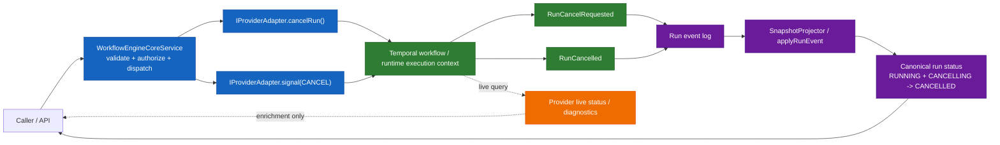

# AR-C6 cancel lifecycle ownership truth sync plan

## Summary

`AR-C6` already corrected the Temporal provider boundary so `cancelRun()` uses
Temporal-native cancellation instead of aliasing `signal(CANCEL)`.

That implementation slice did not close the larger architecture problem:
governing cancel-lifecycle surfaces still disagree on who owns
`RunCancelRequested`, what `getRunStatus()` means at the provider boundary, and
which state is canonical between command submission and realized cancellation.

This slice was intentionally short and document-first. Its goal was to capture
the cancel-lifecycle ownership lesson before further runtime work landed.

The broader engine-runtime contract-pack and read-boundary reset now continues
exclusively under the follow-on proposal
[`Contract pack and read boundary reset plan`](./contract-pack-and-read-boundary-reset-plan-20260410.md).

This document now remains as local architecture rationale only. It is no longer
the active contract-pack execution direction.

## Governing sources

- [ADR-0003](../../../../adr/ADR-0003-execution-model.md)
- [ADR-0007](../../../../adr/ADR-0007_RunCancellation.md)
- [ADR-0014](../../../../adr/ADR-0014-run-driven-adapter-model.md)
- [ADR-0015](../../../../adr/ADR-0015-getRunStatus-read-model-separation.md)
- [ADR-0047](../../../../adr/ADR-0047-runtime-owned-realized-lifecycle-for-signal-driven-transitions.md)
- [Workflow-owned cancellation lifecycle ordering and maintenance alignment](../../../../evidence/critical/ED-20260401-cancel-lifecycle-workflow-owned-ordering.md)
- [Run Events Contract](../../../../architecture/components/engine/contracts/engine/RunEvents.v1.md)
- [Execution Semantics Contract](../../../../architecture/components/engine/contracts/engine/ExecutionSemantics.v1.md)
- [IWorkflowEngine Contract](../../../../architecture/components/engine/contracts/engine/IWorkflowEngine.v1.md)
- [IProviderAdapter Contract](../../../../architecture/components/engine/contracts/engine/IProviderAdapter.v1.md)
- [Signals and Authorization Contract](../../../../architecture/components/engine/contracts/engine/SignalsAndAuth.v1.md)
- [DVT execution model](../../../execution-model/dvt-execution-model.md)
- [Temporal Engine Policies](../../../../architecture/components/engine/adapters/temporal/EnginePolicies.md)
- [Implementation architecture diagrams](../../../../architecture/diagrams/implementation-architecture-diagrams.md)
- [AR-C6 Temporal cancel semantics plan](./ar-c6-temporal-cancel-semantics-plan-20260410.md)

## Drift to resolve

The repository currently carries multiple different truths about cancellation:

| Surface                        | Current statement                                                                                              | Why it drifts                                                                                                            |
| ------------------------------ | -------------------------------------------------------------------------------------------------------------- | ------------------------------------------------------------------------------------------------------------------------ |
| `ADR-0007`                     | Engine MAY emit `RunCancelRequested` after successful request submission                                       | This predates the runtime-owned lifecycle direction accepted in `ADR-0047` and already evidenced in runtime slices       |
| `ADR-0047` + accepted evidence | runtime owns realized lifecycle facts for signal-driven transitions                                            | This is the forward rule, but it has not been synchronized back into older cancellation surfaces                         |
| `RunEvents.v1`                 | `RunCancelRequested` is omitted from known lifecycle events                                                    | The event is already modeled by `run-domain`, projector behavior, and runtime slices                                     |
| `ExecutionSemantics.v1`        | cancellation ownership currently lists only `RunCancelled` as runtime-owned                                    | The ordered cancelling lifecycle is not fully represented in the event-set and ownership summary                         |
| `IWorkflowEngine.v1`           | lifecycle summary omits `RunCancelRequested` and does not restate canonical read authority on `getRunStatus()` | The engine boundary still reads cleaner than the actual ownership split                                                  |
| `IProviderAdapter.v1`          | `getRunStatus()` reads like canonical status                                                                   | In the current architecture the event log and snapshot are canonical and provider status is only live runtime enrichment |
| `SignalsAndAuth.v1`            | `CANCEL` points only to `RunCancelled` as runtime-owned realized lifecycle                                     | The non-terminal cancelling transition is still missing from the signal contract surface                                 |

## Architectural decision to normalize

The target model is:

1. Command plane:
   - engine validates, authorizes, and dispatches `cancelRun()` or
     `signal(CANCEL)`
2. Realized lifecycle plane:
   - runtime execution context owns the canonical cancellation lifecycle facts
3. Read plane:
   - event log plus snapshot projection remain authoritative for caller-visible
     run status
4. Provider diagnostics plane:
   - provider live status is enrichment, not authoritative state

This means the repository should stop treating `RunCancelRequested` as an
engine-side request fact and instead govern it as part of the runtime-owned
cancellation lifecycle, alongside `RunCancelled`.

If the engine later needs a distinct audit or request fact, it must use a
different event type. It must not overload `RunCancelRequested`.

## Target component contract

| Component                                            | Owns                                    | MUST                                                                                                                                  | MUST NOT                                                                                       |
| ---------------------------------------------------- | --------------------------------------- | ------------------------------------------------------------------------------------------------------------------------------------- | ---------------------------------------------------------------------------------------------- |
| `WorkflowEngineCoreService` and application boundary | command validation and dispatch         | authorize cancel, validate transition legality, dispatch to adapter, preserve idempotent command semantics                            | append `RunCancelRequested` or `RunCancelled` on submission                                    |
| `IProviderAdapter.cancelRun()`                       | provider-native cancel request boundary | submit an idempotent provider-native cancellation request                                                                             | claim canonical state authority or synthesize terminal lifecycle from request acceptance alone |
| `IProviderAdapter.signal(..., CANCEL)`               | cooperative control message boundary    | carry structured cancel payloads such as `reason` when supported                                                                      | collapse native cancel and cooperative cancel into a single semantic path                      |
| Runtime workflow or provider execution context       | realized cancellation lifecycle         | append `RunCancelRequested` when the runtime execution actually enters cancelling and append `RunCancelled` on real terminal shutdown | emit `RunCancelled` speculatively before the runtime reaches terminal cancellation             |
| `SnapshotProjector` and `run-domain`                 | canonical read model                    | keep `status` in `RUNNING` with `substatus = CANCELLING` after `RunCancelRequested`, and move to `CANCELLED` only on `RunCancelled`   | treat provider live query state as more authoritative than the event log                       |
| API, UI, and callers                                 | caller-visible status consumption       | use engine read surfaces as canonical status and treat provider state as diagnostic enrichment only                                   | bypass the snapshot or event log with provider-native status as the public source of truth     |

## Target architecture diagram

## Contract deltas required

### ADR-0007

- reword ownership so runtime owns the canonical cancellation lifecycle facts,
  including `RunCancelRequested` and `RunCancelled`
- stop presenting `RunCancelRequested` as the default engine-emitted event

### RunEvents.v1

- add `RunCancelRequested` to the known lifecycle catalog
- define its read-model semantics explicitly:
  - non-terminal
  - canonical cancelling-state transition

### ExecutionSemantics.v1

- add `RunCancelRequested` to the run-level lifecycle set
- define cancellation as an ordered runtime-owned lifecycle:
  - `RunCancelRequested`
  - `RunCancelled`

### IWorkflowEngine.v1

- align the lifecycle summary with the full cancellation lifecycle
- restate that engine `getRunStatus()` remains the canonical caller-visible
  read path and that provider live status is not a substitute for the
  event-log-backed read model

### IProviderAdapter.v1

- clarify that provider `getRunStatus()` is a live provider view and not the
  authoritative read model
- tighten `cancelRun()` semantics around provider-native cancellation request
  submission

### SignalsAndAuth.v1

- describe `CANCEL` as mapping to the ordered runtime-owned lifecycle
  `RunCancelRequested -> RunCancelled`
- keep the canonical signal boundary narrow while aligning it with the same
  cancellation ownership truth used by the engine and run-event contracts

### EnginePolicies and implementation diagrams

- stop describing cancellation as engine-emitted `RunCancelRequested`
- describe runtime-owned ordered cancellation lifecycle as the current target

## Scope

In scope:

- architecture and contract truth sync for cancel lifecycle ownership
- target diagram and component contract for cancellation ownership
- normative engine contract-pack synchronization for cancellation ownership
- planning registration so future runtime work does not expand the old model

Out of scope:

- renaming public APIs in this slice
- non-cancellation signal taxonomy redesign
- deeper provider-status API redesign beyond clarifying authority semantics
- new runtime code beyond what is already landed in `AR-C6`

## Acceptance

- a governed target diagram exists for cancel lifecycle ownership
- the target component contract is explicit enough to drive the next doc and
  contract edits
- Lane C records the truth-sync slice before more runtime cancellation work
- the `AR-C6` implementation plan no longer claims a final ownership truth that
  conflicts with the accepted architectural direction
