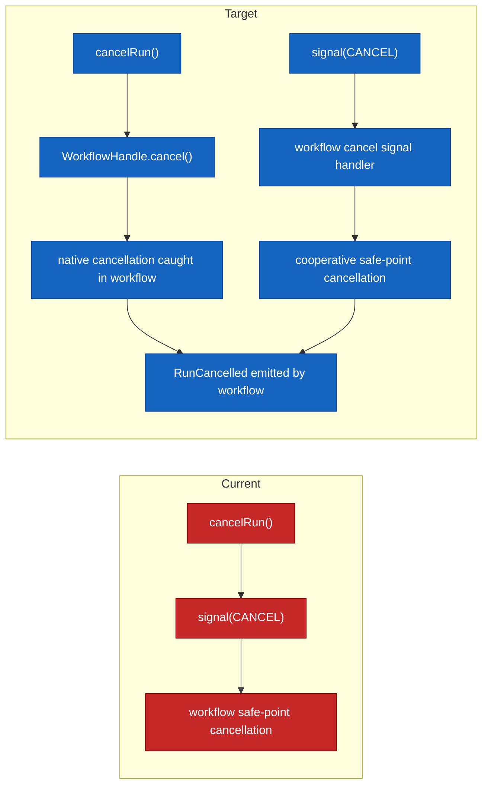

# AR-C6 Temporal cancel semantics plan

## Summary

`AR-C6` started from a concrete defect: `@dvt/adapter-temporal` implemented
`cancelRun()` by forwarding the canonical `cancel` signal into the workflow.
That kept cancellation on the cooperative signal path and left the known
`T-01` bug open: if the workflow was blocked in a place where the signal did
not get processed, cancellation could be lost.

`AR-C6` corrects that boundary without widening the slice into a full signal
taxonomy redesign.

That implementation slice is no longer the place where final cancel-lifecycle
ownership truth is decided. The broader engine-runtime contract-pack reset
under [`Contract pack and read boundary reset plan`](./contract-pack-and-read-boundary-reset-plan-20260410.md)
now governs the target contract and diagram before additional runtime
cancellation work lands.

## Governing sources

- [ADR-0003](../../../../adr/ADR-0003-execution-model.md)
- [ADR-0007](../../../../adr/ADR-0007_RunCancellation.md)
- [ADR-0014](../../../../adr/ADR-0014-run-driven-adapter-model.md)
- [ADR-0047](../../../../adr/ADR-0047-runtime-owned-realized-lifecycle-for-signal-driven-transitions.md)
- [Implementation architecture diagrams](../../../../architecture/diagrams/implementation-architecture-diagrams.md)
- [Temporal Engine Policies](../../../../architecture/components/engine/adapters/temporal/engine-policies.md)
- [20260407 engine boundary current-target and migration review](../../../reviews/architecture-and-governance/20260407-engine-boundary-current-target-and-migration-review.md)
- [Contract pack and read boundary reset plan](./contract-pack-and-read-boundary-reset-plan-20260410.md)

## Original problem statement

Before `AR-C6`, the Temporal adapter collapsed two different concepts into one
path:

- `signal(CANCEL)` as a cooperative workflow control message
- `cancelRun()` as a provider-native cancellation request

The old implementation sent both through `WorkflowSignals.CANCEL`.

That created two issues:

1. `cancelRun()` is not actually provider-native.
2. The workflow cannot distinguish a signal-driven cooperative cancel from a
   Temporal-native cancellation request.

## Decision

Keep both control surfaces, but stop treating them as aliases.

### 1. `cancelRun()` becomes provider-native

- `TemporalAdapter.cancelRun()` MUST call `WorkflowHandle.cancel()`.
- This path is the Temporal-native cancellation request.
- It does not carry a structured `reason` payload.

### 2. `signal(CANCEL)` remains cooperative

- `TemporalAdapter.signal(runRef, { type: 'CANCEL', ... })` continues to send
  the canonical workflow `cancel` signal.
- This path remains the only one that can carry a caller-provided `reason`.

### 3. Workflow owns terminal confirmation in both paths

- The workflow MUST emit `RunCancelled` only after real shutdown is reached.
- For native Temporal cancellation, the workflow catches cancellation and emits
  `RunCancelled` from a non-cancellable cleanup scope.
- For cooperative signal cancellation, the workflow continues to finalize at
  safe points.

### 4. Ownership truth is absorbed by the contract-pack reset

- This implementation slice corrects the provider-native cancel boundary.
- It does not claim final authority over the long-term ownership semantics of
  `RunCancelRequested`.
- That target truth is now carried by
  [`Contract pack and read boundary reset plan`](./contract-pack-and-read-boundary-reset-plan-20260410.md),
  which absorbs the `AR-C6-A` lesson and aligns `ADR-0007`, `RunEvents`,
  `IProviderAdapter`, registries, and component-level diagrams before more
  runtime cancellation work lands.

## Current vs target

## Scope

In scope:

- Temporal adapter cancellation path
- Temporal workflow cancellation cleanup path
- Temporal adapter unit and integration coverage
- diagrams and policy docs that currently describe `cancelRun()` as a signal
  alias

Out of scope:

- redesign of `SignalType`
- non-Temporal provider changes
- shared-kernel or `EngineRunRef` redesign
- deterministic reason persistence for native `cancelRun()`

## Test plan

1. Unit red test:
   - `TemporalAdapter.cancelRun()` uses `handle.cancel()`, not `signal(CANCEL)`.
2. Workflow/integration red test:
   - a native Temporal cancel request results in a workflow-owned terminal
     cancellation path and never `RunCompleted`.
3. Regression coverage:
   - `signal(CANCEL)` still works as the cooperative reason-carrying path.

## Acceptance

- `T-01` is closed in code, docs, and tests.
- `cancelRun()` no longer depends on `WorkflowSignals.CANCEL`.
- `signal(CANCEL)` remains available and explicitly documented as the
  cooperative path.
- Temporal workflow cancellation cleanup is deterministic and emits terminal
  cancellation from workflow context, not from engine guesswork.
- The longer-term ownership and contract truth is tracked explicitly in the
  `AR-C6` truth-sync slice instead of being left implicit in this
  implementation-only plan.

## Planning Disposition

- Action: classify this mandatory proposal through `RUNTIME-PROP-DISP-1`; no standalone implementation starts from this document without Planning DB ownership.
