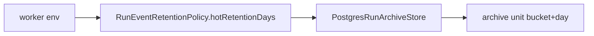
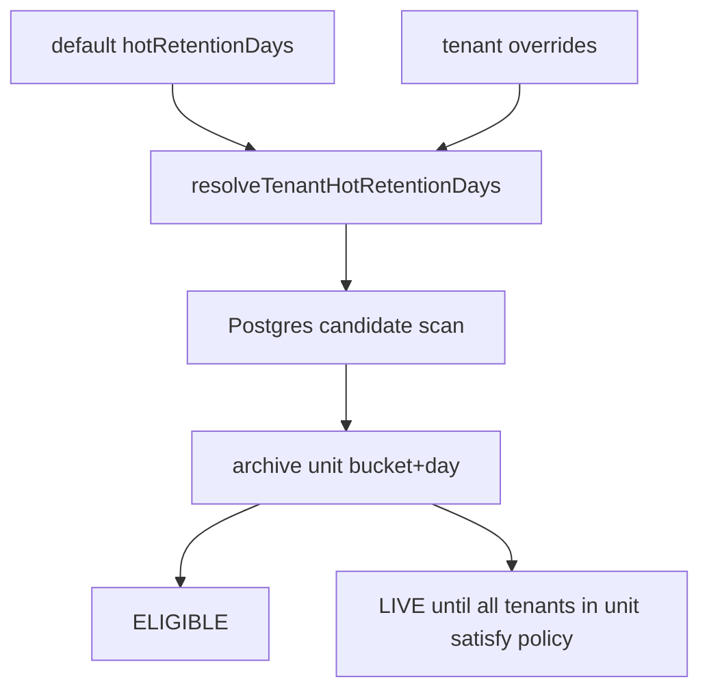

# AR-D5 Tenant Configurable Retention Policy Plan

## Objective

Let run-event archival honor tenant-specific hot-retention windows without
changing engine semantics, archive object layout, restore behavior, or the
physical `archive_unit = tenant_bucket + persisted_at_day` model from ADR-0037.

## Governing Sources

- [ADR-0004 Event Sourcing Strategy](../../../adr/ADR-0004-event-sourcing-strategy.md)
- [ADR-0031 Adapter Tenant Isolation](../../../adr/ADR-0031-adapter-tenant-isolation.md)
- [ADR-0037 Run Event Lifecycle Archival](../../../adr/ADR-0037-run-event-lifecycle-archival-verification-and-restore-model.md)
- [Command And Query Rail Governance](../../../architecture/command-query-rail-governance.md)
- [AR-D8 Default Retention Runtime Baseline](./ar-d8-default-retention-runtime-baseline-plan-20260522.md)

## Current State

`RunEventRetentionPolicy` has one `hotRetentionDays` value. The Postgres archive
store computes one cutoff and marks every candidate archive unit from that
cutoff. That is simple, but it collapses enterprise and free-tier tenants into a
single lifecycle window.



## Target State

`RunEventRetentionPolicy` keeps the deployment default and may carry explicit
tenant overrides. The adapter resolves each tenant's hot-retention window while
building candidate units.



## Decision

The slice does not introduce partial archive-unit exports. ADR-0037 makes the
physical archive unit `tenant_bucket + persisted_at_day`; exporting only a
subset of tenants under that same key would create a second eligibility problem
for the remaining tenants. Therefore a shared unit becomes eligible only when
all tenants represented in that unit satisfy their own configured window.

## Command / Query Rail

- Rail: `ConfigureRunEventRetentionPolicy`
- Type: command
- Owning bounded context: outbox worker runtime composition and state-store
  lifecycle policy
- DDD object: `RunEventRetentionPolicy`
- Application port: `IRunArchiveStore.listEligibleArchiveUnits`
- Adapter surface: `PostgresRunArchiveStore`
- Scope / authorization: worker-only maintenance path entered through
  `POSTGRES_SERVICE_ACCESS.runArchiveMaintenance`
- Negative tests:
  - invalid override tenant id fails configuration/policy validation
  - invalid override day count fails configuration/policy validation
  - mixed-tenant archive units wait for the tenant with the longer window

## Implementation Slice

- Extend `RunEventRetentionPolicy` with tenant override entries.
- Add a pure resolver for tenant hot-retention days.
- Parse tenant overrides from active outbox worker env.
- Pass overrides into `RunArchiveCoordinator.archiveEligibleHotData`.
- Make `PostgresRunArchiveStore.listEligibleArchiveUnits` evaluate each tenant
  against its resolved cutoff while preserving full-unit export semantics.
- Add architecture/component documentation for the retention policy component.

## Non-Goals

- New archive-unit key format.
- Partial archive-unit export.
- New tenant settings table.
- Engine, contract, planner, Temporal, or UI changes.
- Object-store lifecycle changes.
- Restore flow changes.

## Validation

- `pnpm --filter @dvt/state-store test -- RunEventRetentionPolicy.test.ts`
- `pnpm --filter @dvt/adapter-postgres test -- PostgresRunArchiveStore.tenant-retention.integration.test.ts`
- `pnpm --filter dvt-outbox-worker test -- test/plugins/env.test.ts test/runtime/createOutboxWorkerRuntime.test.ts`
- `pnpm --filter @dvt/state-store typecheck`
- `pnpm --filter @dvt/adapter-postgres typecheck`
- `pnpm --filter dvt-outbox-worker typecheck`
- `pnpm verify:prepush`

## Feature Mechanization

```feature-mechanization
version: 1
featureId: AR-D5-TENANT-CONFIGURABLE-RETENTION-POLICY-20260522
mechanizationStatus: implemented
noHumanDecisionsRemaining: true
implementationPlan: docs/planning/proposals/mandatory/runtime-and-contracts/ar-d5-tenant-configurable-retention-policy-plan-20260522.md
componentGuides:
  - docs/architecture/components/engine/adapters/state-store/postgres/run-event-retention-policy-component.md
userStories:
  - docs/architecture/components/engine/adapters/state-store/postgres/run-event-retention-policy-user-stories.md
governingSources:
  - AGENTS.md
  - docs/planning/status/governance-document-rule-inventory.md
  - docs/adr/ADR-0004-event-sourcing-strategy.md
  - docs/adr/ADR-0031-adapter-tenant-isolation.md
  - docs/adr/ADR-0037-run-event-lifecycle-archival-verification-and-restore-model.md
  - docs/architecture/command-query-rail-governance.md
  - docs/architecture/fowler-opportunity-planning-governance.md
allowedImplementationSurfaces:
  - apps/outbox-worker/.env.example
  - apps/outbox-worker/README.md
  - apps/outbox-worker/src/plugins/env.ts
  - apps/outbox-worker/src/runtime/buildRunEventRetentionRuntime.ts
  - apps/outbox-worker/test/plugins/env.test.ts
  - apps/outbox-worker/test/runtime/createOutboxWorkerRuntime.test.ts
  - docs/architecture/components/engine/adapters/state-store/postgres/index.md
  - docs/architecture/components/engine/adapters/state-store/postgres/run-event-retention-policy-component.md
  - docs/architecture/components/engine/adapters/state-store/postgres/run-event-retention-policy-user-stories.md
  - docs/evidence/ED-20260522-ar-d5-tenant-retention-policy.md
  - docs/evidence/index.md
  - docs/planning/closeouts/20260522-ar-d5-tenant-configurable-retention-policy-closeout.md
  - docs/planning/proposals/mandatory/runtime-and-contracts/ar-d5-tenant-configurable-retention-policy-plan-20260522.md
  - docs/planning/state/agent-lane-d.yaml
  - docs/risk-register/quality/R-20260522-AR-D5-TENANT-RETENTION-POLICY.yaml
  - docs/risk-register/quality/index.md
  - packages/@dvt/adapter-postgres/src/PostgresRunArchiveStore.ts
  - packages/@dvt/adapter-postgres/test/PostgresRunArchiveStore.tenant-retention.test.ts
  - packages/@dvt/adapter-postgres/test/PostgresRunArchiveStore.tenant-retention.integration.test.ts
  - packages/@dvt/state-store/src/index.ts
  - packages/@dvt/state-store/src/lifecycle/archiveRuntime.ts
  - packages/@dvt/state-store/test/RunEventRetentionPolicy.test.ts
forbiddenImplementationSurfaces:
  - apps/web/**
  - packages/@dvt/contracts/**
  - packages/@dvt/engine/**
  - packages/@dvt/planner/**
  - packages/@dvt/adapter-temporal/**
commandQueryRails:
  - name: ConfigureRunEventRetentionPolicy
    type: command
    dddOwner: RunEventRetentionPolicy
domainObjects:
  - name: RunEventRetentionPolicy
    type: lifecycle policy
    owner: packages/@dvt/state-store
  - name: PostgresRunArchiveStore
    type: lifecycle adapter
    owner: packages/@dvt/adapter-postgres
fowlerSignals:
  - Policy object
  - Unit of work
  - Explicit lifecycle boundary
architectureGuards:
  - pnpm --filter @dvt/state-store test -- RunEventRetentionPolicy.test.ts
  - pnpm --filter @dvt/adapter-postgres test -- PostgresRunArchiveStore.tenant-retention.integration.test.ts
cypressFlows:
  - not_applicable_runtime_worker_policy
completionGate:
  - pnpm docs:feature-mechanization -- --feature AR-D5-TENANT-CONFIGURABLE-RETENTION-POLICY-20260522
  - pnpm docs:feature-mechanization:implementation -- --feature AR-D5-TENANT-CONFIGURABLE-RETENTION-POLICY-20260522
  - pnpm --filter @dvt/state-store typecheck
  - pnpm --filter @dvt/adapter-postgres typecheck
  - pnpm --filter dvt-outbox-worker typecheck
  - pnpm verify:prepush
redGreenCycles:
  - id: ar-d5-policy-resolution
    redTest: pnpm --filter @dvt/state-store test -- RunEventRetentionPolicy.test.ts
    expectedFailure: RunEventRetentionPolicy has no tenant override resolver.
    patchSurfaces:
      - packages/@dvt/state-store/src/lifecycle/archiveRuntime.ts
      - packages/@dvt/state-store/test/RunEventRetentionPolicy.test.ts
    greenTest: pnpm --filter @dvt/state-store test -- RunEventRetentionPolicy.test.ts
  - id: ar-d5-postgres-unit-eligibility
    redTest: pnpm --filter @dvt/adapter-postgres test -- PostgresRunArchiveStore.tenant-retention.integration.test.ts
    expectedFailure: Postgres archive eligibility uses one global cutoff.
    patchSurfaces:
      - packages/@dvt/adapter-postgres/src/PostgresRunArchiveStore.ts
      - packages/@dvt/adapter-postgres/test/PostgresRunArchiveStore.tenant-retention.integration.test.ts
    greenTest: pnpm --filter @dvt/adapter-postgres test -- PostgresRunArchiveStore.tenant-retention.integration.test.ts
symbols:
  - name: RunEventRetentionPolicy
    path: packages/@dvt/state-store/src/lifecycle/archiveRuntime.ts
    dddOwner: State-store archive lifecycle policy
    cqRails: [ConfigureRunEventRetentionPolicy]
    fowlerSignals: [Policy object]
    architectureGuard: pnpm --filter @dvt/state-store test -- RunEventRetentionPolicy.test.ts
    cypressCoverage: not_applicable_runtime_worker_policy
    unitTests: [pnpm --filter @dvt/state-store test -- RunEventRetentionPolicy.test.ts]
  - name: TenantRunEventRetentionOverride
    path: packages/@dvt/state-store/src/lifecycle/archiveRuntime.ts
    dddOwner: State-store archive lifecycle policy
    cqRails: [ConfigureRunEventRetentionPolicy]
    fowlerSignals: [Policy object]
    architectureGuard: pnpm --filter @dvt/state-store test -- RunEventRetentionPolicy.test.ts
    cypressCoverage: not_applicable_runtime_worker_policy
    unitTests: [pnpm --filter @dvt/state-store test -- RunEventRetentionPolicy.test.ts]
  - name: validateRunEventRetentionPolicy
    path: packages/@dvt/state-store/src/lifecycle/archiveRuntime.ts
    dddOwner: State-store archive lifecycle policy
    cqRails: [ConfigureRunEventRetentionPolicy]
    fowlerSignals: [Policy object]
    architectureGuard: pnpm --filter @dvt/state-store test -- RunEventRetentionPolicy.test.ts
    cypressCoverage: not_applicable_runtime_worker_policy
    unitTests: [pnpm --filter @dvt/state-store test -- RunEventRetentionPolicy.test.ts]
  - name: resolveTenantHotRetentionDays
    path: packages/@dvt/state-store/src/lifecycle/archiveRuntime.ts
    dddOwner: State-store archive lifecycle policy
    cqRails: [ConfigureRunEventRetentionPolicy]
    fowlerSignals: [Policy object]
    architectureGuard: pnpm --filter @dvt/state-store test -- RunEventRetentionPolicy.test.ts
    cypressCoverage: not_applicable_runtime_worker_policy
    unitTests: [pnpm --filter @dvt/state-store test -- RunEventRetentionPolicy.test.ts]
  - name: PostgresRunArchiveStore
    path: packages/@dvt/adapter-postgres/src/PostgresRunArchiveStore.ts
    dddOwner: Postgres archive lifecycle adapter
    cqRails: [ConfigureRunEventRetentionPolicy]
    fowlerSignals: [Gateway]
    architectureGuard: pnpm --filter @dvt/adapter-postgres test -- PostgresRunArchiveStore.tenant-retention.test.ts PostgresRunArchiveStore.tenant-retention.integration.test.ts
    cypressCoverage: not_applicable_runtime_worker_policy
    unitTests: [pnpm --filter @dvt/adapter-postgres test -- PostgresRunArchiveStore.tenant-retention.test.ts]
  - name: computeCutoffIso
    path: packages/@dvt/adapter-postgres/src/PostgresRunArchiveStore.ts
    dddOwner: Postgres archive lifecycle adapter
    cqRails: [ConfigureRunEventRetentionPolicy]
    fowlerSignals: [Gateway]
    architectureGuard: pnpm --filter @dvt/adapter-postgres test -- PostgresRunArchiveStore.tenant-retention.test.ts
    cypressCoverage: not_applicable_runtime_worker_policy
    unitTests: [pnpm --filter @dvt/adapter-postgres test -- PostgresRunArchiveStore.tenant-retention.test.ts]
  - name: validateArchiveNow
    path: packages/@dvt/adapter-postgres/src/PostgresRunArchiveStore.ts
    dddOwner: Postgres archive lifecycle adapter
    cqRails: [ConfigureRunEventRetentionPolicy]
    fowlerSignals: [Gateway]
    architectureGuard: pnpm --filter @dvt/adapter-postgres test -- PostgresRunArchiveStore.tenant-retention.test.ts
    cypressCoverage: not_applicable_runtime_worker_policy
    unitTests: [pnpm --filter @dvt/adapter-postgres test -- PostgresRunArchiveStore.tenant-retention.test.ts]
  - name: isBeforeCutoff
    path: packages/@dvt/adapter-postgres/src/PostgresRunArchiveStore.ts
    dddOwner: Postgres archive lifecycle adapter
    cqRails: [ConfigureRunEventRetentionPolicy]
    fowlerSignals: [Gateway]
    architectureGuard: pnpm --filter @dvt/adapter-postgres test -- PostgresRunArchiveStore.tenant-retention.test.ts
    cypressCoverage: not_applicable_runtime_worker_policy
    unitTests: [pnpm --filter @dvt/adapter-postgres test -- PostgresRunArchiveStore.tenant-retention.test.ts]
  - name: tenantRunEventRetentionOverrides
    path: apps/outbox-worker/src/plugins/env.ts
    dddOwner: Outbox worker runtime configuration policy
    cqRails: [ConfigureRunEventRetentionPolicy]
    fowlerSignals: [Configuration as Code]
    architectureGuard: pnpm --filter dvt-outbox-worker test -- test/plugins/env.test.ts
    cypressCoverage: not_applicable_runtime_worker_policy
    unitTests: [pnpm --filter dvt-outbox-worker test -- test/plugins/env.test.ts]
  - name: BASE_POLICY
    path: packages/@dvt/state-store/test/RunEventRetentionPolicy.test.ts
    dddOwner: State-store archive lifecycle policy tests
    cqRails: [ConfigureRunEventRetentionPolicy]
    fowlerSignals: [Test Data Builder]
    architectureGuard: pnpm --filter @dvt/state-store test -- RunEventRetentionPolicy.test.ts
    cypressCoverage: not_applicable_runtime_worker_policy
    unitTests: [pnpm --filter @dvt/state-store test -- RunEventRetentionPolicy.test.ts]
  - name: QueryResult
    path: packages/@dvt/adapter-postgres/test/PostgresRunArchiveStore.tenant-retention.test.ts
    dddOwner: Postgres archive lifecycle adapter tests
    cqRails: [ConfigureRunEventRetentionPolicy]
    fowlerSignals: [Test Double]
    architectureGuard: pnpm --filter @dvt/adapter-postgres test -- PostgresRunArchiveStore.tenant-retention.test.ts
    cypressCoverage: not_applicable_runtime_worker_policy
    unitTests: [pnpm --filter @dvt/adapter-postgres test -- PostgresRunArchiveStore.tenant-retention.test.ts]
  - name: ScriptedClient
    path: packages/@dvt/adapter-postgres/test/PostgresRunArchiveStore.tenant-retention.test.ts
    dddOwner: Postgres archive lifecycle adapter tests
    cqRails: [ConfigureRunEventRetentionPolicy]
    fowlerSignals: [Test Double]
    architectureGuard: pnpm --filter @dvt/adapter-postgres test -- PostgresRunArchiveStore.tenant-retention.test.ts
    cypressCoverage: not_applicable_runtime_worker_policy
    unitTests: [pnpm --filter @dvt/adapter-postgres test -- PostgresRunArchiveStore.tenant-retention.test.ts]
  - name: makeStore
    path: packages/@dvt/adapter-postgres/test/PostgresRunArchiveStore.tenant-retention.test.ts
    dddOwner: Postgres archive lifecycle adapter tests
    cqRails: [ConfigureRunEventRetentionPolicy]
    fowlerSignals: [Test Data Builder]
    architectureGuard: pnpm --filter @dvt/adapter-postgres test -- PostgresRunArchiveStore.tenant-retention.test.ts
    cypressCoverage: not_applicable_runtime_worker_policy
    unitTests: [pnpm --filter @dvt/adapter-postgres test -- PostgresRunArchiveStore.tenant-retention.test.ts]
  - name: makeEligibleRunRow
    path: packages/@dvt/adapter-postgres/test/PostgresRunArchiveStore.tenant-retention.test.ts
    dddOwner: Postgres archive lifecycle adapter tests
    cqRails: [ConfigureRunEventRetentionPolicy]
    fowlerSignals: [Test Data Builder]
    architectureGuard: pnpm --filter @dvt/adapter-postgres test -- PostgresRunArchiveStore.tenant-retention.test.ts
    cypressCoverage: not_applicable_runtime_worker_policy
    unitTests: [pnpm --filter @dvt/adapter-postgres test -- PostgresRunArchiveStore.tenant-retention.test.ts]
  - name: NOW
    path: packages/@dvt/adapter-postgres/test/PostgresRunArchiveStore.tenant-retention.integration.test.ts
    dddOwner: Postgres archive lifecycle integration tests
    cqRails: [ConfigureRunEventRetentionPolicy]
    fowlerSignals: [Test Data Builder]
    architectureGuard: pnpm --filter @dvt/adapter-postgres test -- PostgresRunArchiveStore.tenant-retention.integration.test.ts
    cypressCoverage: not_applicable_runtime_worker_policy
    unitTests: [pnpm --filter @dvt/adapter-postgres test -- PostgresRunArchiveStore.tenant-retention.integration.test.ts]
  - name: requireConnectionString
    path: packages/@dvt/adapter-postgres/test/PostgresRunArchiveStore.tenant-retention.integration.test.ts
    dddOwner: Postgres archive lifecycle integration tests
    cqRails: [ConfigureRunEventRetentionPolicy]
    fowlerSignals: [Test Fixture]
    architectureGuard: pnpm --filter @dvt/adapter-postgres test -- PostgresRunArchiveStore.tenant-retention.integration.test.ts
    cypressCoverage: not_applicable_runtime_worker_policy
    unitTests: [pnpm --filter @dvt/adapter-postgres test -- PostgresRunArchiveStore.tenant-retention.integration.test.ts]
  - name: makeSchemaName
    path: packages/@dvt/adapter-postgres/test/PostgresRunArchiveStore.tenant-retention.integration.test.ts
    dddOwner: Postgres archive lifecycle integration tests
    cqRails: [ConfigureRunEventRetentionPolicy]
    fowlerSignals: [Test Fixture]
    architectureGuard: pnpm --filter @dvt/adapter-postgres test -- PostgresRunArchiveStore.tenant-retention.integration.test.ts
    cypressCoverage: not_applicable_runtime_worker_policy
    unitTests: [pnpm --filter @dvt/adapter-postgres test -- PostgresRunArchiveStore.tenant-retention.integration.test.ts]
  - name: withArchiveStore
    path: packages/@dvt/adapter-postgres/test/PostgresRunArchiveStore.tenant-retention.integration.test.ts
    dddOwner: Postgres archive lifecycle integration tests
    cqRails: [ConfigureRunEventRetentionPolicy]
    fowlerSignals: [Test Fixture]
    architectureGuard: pnpm --filter @dvt/adapter-postgres test -- PostgresRunArchiveStore.tenant-retention.integration.test.ts
    cypressCoverage: not_applicable_runtime_worker_policy
    unitTests: [pnpm --filter @dvt/adapter-postgres test -- PostgresRunArchiveStore.tenant-retention.integration.test.ts]
  - name: insertTerminalRun
    path: packages/@dvt/adapter-postgres/test/PostgresRunArchiveStore.tenant-retention.integration.test.ts
    dddOwner: Postgres archive lifecycle integration tests
    cqRails: [ConfigureRunEventRetentionPolicy]
    fowlerSignals: [Test Fixture]
    architectureGuard: pnpm --filter @dvt/adapter-postgres test -- PostgresRunArchiveStore.tenant-retention.integration.test.ts
    cypressCoverage: not_applicable_runtime_worker_policy
    unitTests: [pnpm --filter @dvt/adapter-postgres test -- PostgresRunArchiveStore.tenant-retention.integration.test.ts]
  - name: makeTerminalSnapshot
    path: packages/@dvt/adapter-postgres/test/PostgresRunArchiveStore.tenant-retention.integration.test.ts
    dddOwner: Postgres archive lifecycle integration tests
    cqRails: [ConfigureRunEventRetentionPolicy]
    fowlerSignals: [Test Fixture]
    architectureGuard: pnpm --filter @dvt/adapter-postgres test -- PostgresRunArchiveStore.tenant-retention.integration.test.ts
    cypressCoverage: not_applicable_runtime_worker_policy
    unitTests: [pnpm --filter @dvt/adapter-postgres test -- PostgresRunArchiveStore.tenant-retention.integration.test.ts]
```
