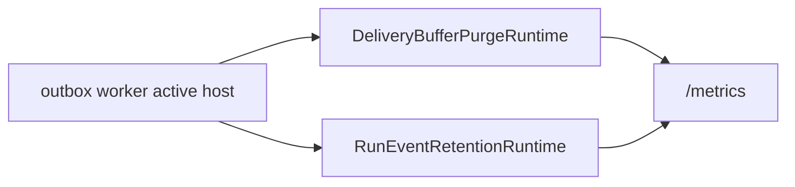
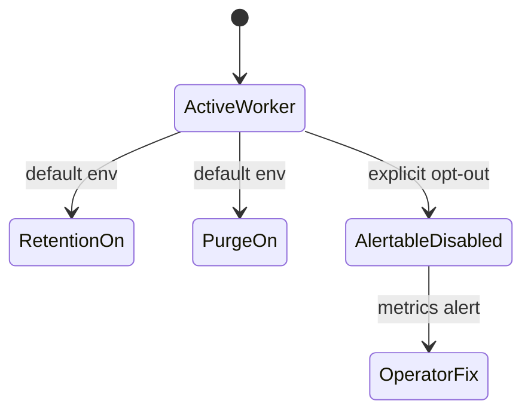

# AR-D8 Default Retention Runtime Baseline Plan

## Objective

Make delivery-buffer purge and run-event archival retention active by default in
the standalone outbox worker, and expose explicit metrics that let operators
alert when either retention path is disabled.

## Governing Sources

- [ADR-0037 Run Event Lifecycle Archival](../../../adr/ADR-0037-run-event-lifecycle-archival-verification-and-restore-model.md)
- [ADR-0038 Delivery Buffer Retention And Purge Policy](../../../adr/ADR-0038-delivery-buffer-retention-and-purge-policy.md)
- [Outbox worker README](../../../../apps/outbox-worker/README.md)
- [Deep architectural review retention finding](../../reviews/architecture-and-governance/20260402-deep-architectural-review-principal-architect.md)

## Current State

`apps/outbox-worker` already contains the two runtime schedulers:



The operational gap is not missing implementation. The gap is posture:
operators can run an active worker while leaving both scheduling paths disabled.

## Target State



## Implementation Slice

- Change `DVT_PURGE_ENABLED` default from `false` to `true`.
- Change `DVT_RUN_EVENT_RETENTION_ENABLED` default from `false` to `true`.
- Keep explicit `false` overrides for controlled diagnostics.
- Keep the production filesystem archive opt-in fail-fast rule.
- Add Prometheus posture gauges:
  - `dvt_delivery_buffer_purge_configured`
  - `dvt_delivery_buffer_purge_disabled`
  - `dvt_run_event_retention_configured`
  - `dvt_run_event_retention_disabled`
  - `dvt_run_event_retention_filesystem_archive_storage`
- Align `.env.example` and README operator guidance.

## Non-Goals

- Tenant-configurable retention windows. That remains `AR-D5`.
- New archive object-store implementation.
- Schema or archive lifecycle changes.
- Restore drill cadence.

## Validation

- `pnpm --filter dvt-outbox-worker test -- test/plugins/env.test.ts test/runtime/createOutboxWorkerRuntime.test.ts test/ops/OutboxWorkerMonitor.test.ts`
- `pnpm --filter dvt-outbox-worker typecheck`
- `pnpm --filter dvt-outbox-worker test`
- `pnpm verify:prepush`

## Feature Mechanization

```feature-mechanization
version: 1
featureId: AR-D8-DEFAULT-RETENTION-RUNTIME-BASELINE-20260522
mechanizationStatus: implemented
noHumanDecisionsRemaining: true
implementationPlan: docs/planning/proposals/mandatory/runtime-and-contracts/ar-d8-default-retention-runtime-baseline-plan-20260522.md
componentGuides:
  - apps/outbox-worker/README.md
userStories:
  - docs/planning/reviews/architecture-and-governance/20260402-deep-architectural-review-principal-architect.md
governingSources:
  - AGENTS.md
  - docs/planning/status/governance-document-rule-inventory.md
  - docs/adr/ADR-0037-run-event-lifecycle-archival-verification-and-restore-model.md
  - docs/adr/ADR-0038-delivery-buffer-retention-and-purge-policy.md
  - docs/architecture/command-query-rail-governance.md
  - docs/architecture/fowler-opportunity-planning-governance.md
allowedImplementationSurfaces:
  - apps/outbox-worker/.env.example
  - apps/outbox-worker/README.md
  - apps/outbox-worker/src/ops/OutboxWorkerMonitor.ts
  - apps/outbox-worker/src/ops/monitor/RunEventRetentionTelemetry.ts
  - apps/outbox-worker/src/ops/monitor/model.ts
  - apps/outbox-worker/src/ops/monitor/renderOutboxWorkerMetrics.ts
  - apps/outbox-worker/src/plugins/env.ts
  - apps/outbox-worker/src/server.ts
  - apps/outbox-worker/test/ops/OutboxWorkerMonitor.test.ts
  - apps/outbox-worker/test/ops/outboxWorkerMonitorTestSupport.ts
  - apps/outbox-worker/test/plugins/env.test.ts
  - apps/outbox-worker/test/runtime/createOutboxWorkerRuntime.test.ts
  - docs/planning/closeouts/20260522-ar-d8-default-retention-runtime-baseline-closeout.md
  - docs/planning/proposals/mandatory/runtime-and-contracts/ar-d8-default-retention-runtime-baseline-plan-20260522.md
  - docs/planning/state/agent-lane-d.yaml
forbiddenImplementationSurfaces:
  - packages/@dvt/contracts/**
  - packages/@dvt/engine/**
  - packages/@dvt/adapter-*/**
  - packages/@dvt/planner/**
commandQueryRails:
  - name: ConfigureOutboxWorkerRetentionPosture
    type: command
    dddOwner: OutboxWorkerRuntimeComposition
domainObjects:
  - name: ActiveCommonEnvSchema
    type: configuration policy
    owner: apps/outbox-worker
  - name: OutboxWorkerMonitor
    type: operational telemetry adapter
    owner: apps/outbox-worker
  - name: RunEventRetentionTelemetry
    type: metrics projection
    owner: apps/outbox-worker
fowlerSignals:
  - Optional operational behavior
  - Silent failure mode
  - Runtime health fitness function
architectureGuards:
  - pnpm --filter dvt-outbox-worker test -- test/plugins/env.test.ts test/runtime/createOutboxWorkerRuntime.test.ts test/ops/OutboxWorkerMonitor.test.ts
cypressFlows:
  - not_applicable_runtime_worker_metrics
completionGate:
  - pnpm docs:feature-mechanization -- --feature AR-D8-DEFAULT-RETENTION-RUNTIME-BASELINE-20260522
  - pnpm docs:feature-mechanization:implementation -- --feature AR-D8-DEFAULT-RETENTION-RUNTIME-BASELINE-20260522
  - pnpm --filter dvt-outbox-worker typecheck
  - pnpm --filter dvt-outbox-worker test
  - pnpm docs:sync
  - pnpm docs:status:generate
  - pnpm verify:prepush
redGreenCycles:
  - id: ar-d8-default-retention-posture
    redTest: pnpm --filter dvt-outbox-worker test -- test/plugins/env.test.ts test/runtime/createOutboxWorkerRuntime.test.ts test/ops/OutboxWorkerMonitor.test.ts
    expectedFailure: active worker defaults leave purge and run-event retention disabled and expose no disabled-posture alert gauges.
    patchSurfaces:
      - apps/outbox-worker/src/plugins/env.ts
      - apps/outbox-worker/src/ops/OutboxWorkerMonitor.ts
      - apps/outbox-worker/src/ops/monitor/RunEventRetentionTelemetry.ts
      - apps/outbox-worker/src/ops/monitor/renderOutboxWorkerMetrics.ts
      - apps/outbox-worker/test/plugins/env.test.ts
      - apps/outbox-worker/test/runtime/createOutboxWorkerRuntime.test.ts
      - apps/outbox-worker/test/ops/OutboxWorkerMonitor.test.ts
    greenTest: pnpm --filter dvt-outbox-worker test -- test/plugins/env.test.ts test/runtime/createOutboxWorkerRuntime.test.ts test/ops/OutboxWorkerMonitor.test.ts
symbols:
  - name: ActiveCommonEnvSchema
    path: apps/outbox-worker/src/plugins/env.ts
    dddOwner: Outbox worker runtime configuration policy
    cqRails: [ConfigureOutboxWorkerRetentionPosture]
    fowlerSignals: [Configuration as Code]
    architectureGuard: pnpm --filter dvt-outbox-worker test -- test/plugins/env.test.ts
    cypressCoverage: not_applicable_runtime_worker_metrics
    unitTests: [pnpm --filter dvt-outbox-worker test -- test/plugins/env.test.ts]
  - name: OutboxWorkerMonitor
    path: apps/outbox-worker/src/ops/OutboxWorkerMonitor.ts
    dddOwner: Outbox worker operational telemetry adapter
    cqRails: [ConfigureOutboxWorkerRetentionPosture]
    fowlerSignals: [Observer]
    architectureGuard: pnpm --filter dvt-outbox-worker test -- test/ops/OutboxWorkerMonitor.test.ts
    cypressCoverage: not_applicable_runtime_worker_metrics
    unitTests: [pnpm --filter dvt-outbox-worker test -- test/ops/OutboxWorkerMonitor.test.ts]
  - name: RunEventRetentionTelemetry
    path: apps/outbox-worker/src/ops/monitor/RunEventRetentionTelemetry.ts
    dddOwner: Outbox worker retention metrics projection
    cqRails: [ConfigureOutboxWorkerRetentionPosture]
    fowlerSignals: [Event Monitor]
    architectureGuard: pnpm --filter dvt-outbox-worker test -- test/ops/OutboxWorkerMonitor.test.ts
    cypressCoverage: not_applicable_runtime_worker_metrics
    unitTests: [pnpm --filter dvt-outbox-worker test -- test/ops/OutboxWorkerMonitor.test.ts]
  - name: renderRetentionMetrics
    path: apps/outbox-worker/src/ops/monitor/renderOutboxWorkerMetrics.ts
    dddOwner: Outbox worker Prometheus retention exposition
    cqRails: [ConfigureOutboxWorkerRetentionPosture]
    fowlerSignals: [Monitoring Gateway]
    architectureGuard: pnpm --filter dvt-outbox-worker test -- test/ops/OutboxWorkerMonitor.test.ts
    cypressCoverage: not_applicable_runtime_worker_metrics
    unitTests: [pnpm --filter dvt-outbox-worker test -- test/ops/OutboxWorkerMonitor.test.ts]
```
