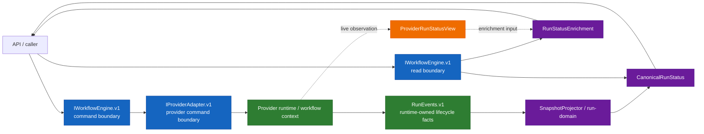

# Contract pack and read boundary reset plan

## Summary

This proposal resets the engine-runtime contract pack and the run-status read
boundary instead of continuing to patch them incrementally.

The repository is still pre-stable. For this slice there is no backward
compatibility requirement, so the plan deliberately resets the active
engine-runtime boundary to one canonical `v1` line, rewrites that line in
place, and removes competing active surfaces from the tree before converging
code and diagrams on that line.

This is a replace-and-converge plan, not a compatibility wrapper plan.

## Governing sources

- `docs/architecture/reference-architecture.md`
- `docs/adr/ADR-0003-execution-model.md`
- `docs/adr/ADR-0007_RunCancellation.md`
- `docs/adr/ADR-0014-run-driven-adapter-model.md`
- `docs/adr/ADR-0015-getRunStatus-read-model-separation.md`
- `docs/adr/ADR-0047-runtime-owned-realized-lifecycle-for-signal-driven-transitions.md`
- `docs/architecture/components/engine/contracts/VERSIONING.md`
- `docs/planning/reviews/architecture-and-governance/20260410-contract-pack-and-read-boundary-reset-fowler-review.md`
- `docs/planning/proposals/mandatory/runtime-and-contracts/ar-c6-cancel-lifecycle-ownership-truth-sync-plan-20260410.md`
- `docs/planning/state/agent-lane-a.yaml`

## Problem statement

The current engine-runtime boundary has three active problems:

1. the contract pack has no single active reading line
2. canonical state and provider-live diagnostics still share one semantic
   status model
3. active subsystem docs and diagrams are drifting between as-is and target
   views

`AR-C6` exposed this clearly around cancellation ownership, but the issue is
larger than cancellation. The boundary itself needs a reset.

## Architectural line

The future boundary is:

- one canonical engine-runtime contract pack on `v1`
- one canonical read model for caller-visible status
- one separate enrichment model for optional engine-side read augmentation
- one separate provider-live view for runtime diagnostics

That gives four explicit planes:

1. command plane
2. realized lifecycle plane
3. canonical read plane
4. provider diagnostics plane

Repository mode rule:

- git keeps history
- the active docs tree keeps one live truth only

## Target component contract

| Component                                      | Primary operations                                                    | Returns                                                                           | Authority                                             |
| ---------------------------------------------- | --------------------------------------------------------------------- | --------------------------------------------------------------------------------- | ----------------------------------------------------- |
| `IWorkflowEngine.v1`                           | `startRun`, `cancelRun`, `signal`, `getRunStatus`, `getRunEnrichment` | `RunHandle`, command results, `CanonicalRunStatus`, `RunStatusEnrichment`         | engine command boundary plus canonical read authority |
| `IProviderAdapter.v1`                          | `startRun`, `cancelRun`, `signal`, `getProviderStatusView`            | provider handles, adapter command results, `ProviderRunStatusView`                | provider-native runtime control and diagnostics only  |
| runtime workflow or provider execution context | lifecycle realization                                                 | `RunStarted`, `RunCancelRequested`, `RunCancelled`, and other runtime-owned facts | realized lifecycle owner                              |
| snapshot projector and `run-domain`            | read-model projection                                                 | `CanonicalRunStatus`                                                              | caller-visible truth                                  |

## Target architecture diagram



## Target contract pack

The active pack after reset should be:

- `docs/architecture/components/engine/contracts/engine/IWorkflowEngine.v1.md`
- `docs/architecture/components/engine/contracts/engine/IProviderAdapter.v1.md`
- `docs/architecture/components/engine/contracts/engine/RunEvents.v1.md`
- `docs/architecture/components/engine/contracts/engine/ExecutionSemantics.v1.md`
- `docs/architecture/components/engine/contracts/engine/SignalsAndAuth.v1.md`

The current `v2`, `v1.1`, `reference`, and redirect surfaces should not remain
in the active tree after the reset. They should be removed so the repository
keeps one live reading path only.

## No-go rules

- no compatibility alias layer just to preserve the mixed pack
- no reuse of one semantic DTO for canonical status and provider diagnostics
- no active subsystem diagrams that show target decomposition as current code
- no second active contract line for the same boundary
- no redirect or reference companion for a topic that still claims one active
  contract

## Execution slices

### `AR-A12` Contract pack and read boundary reset

Umbrella tracker for the full reset.

### `AR-A12-A` Contract-pack reset

Goal:

- collapse the active engine-runtime boundary to one canonical `v1` line

Deliverables:

- active `v1` docs for engine-runtime contracts rewritten as the only live
  surfaces
- removal of mixed active `v2`, `v1.1`, redirect, and `reference` pages for
  the same topics
- `docs/architecture/components/engine/contracts/index.md`
- `docs/architecture/components/engine/contracts/README.md`
- `docs/architecture/components/engine/contracts/engine/index.md`
- `docs/architecture/components/engine/contracts/capabilities/README.md`
- `docs/CONTRIBUTING.md`
- retirement of any migration or redirect companion that preserves a second
  engine-runtime reading path
- versioning surfaces updated

Acceptance:

- one canonical read order exists for the engine-runtime contract pack
- no active surface points readers into mixed-generation truth
- the published registries and companion entrypoints expose the same one-line
  pack as the contract files themselves
- contributor-facing versioning guidance matches the same one-line policy
- no parallel file remains in the active tree for the same contract topic

### `AR-A12-B` Read-boundary model split

Goal:

- separate canonical status from provider-live diagnostics in the contract
  model itself

Deliverables:

- explicit `CanonicalRunStatus` with canonical-only status and substatus
  semantics
- explicit `RunStatusEnrichment` as engine-owned composition of canonical truth
  plus provider diagnostics
- explicit `ProviderRunStatusView` with provider-native tokens and observation
  metadata
- active contract docs updated:
  - `docs/architecture/components/engine/contracts/engine/IWorkflowEngine.v1.md`
  - `docs/architecture/components/engine/contracts/engine/IProviderAdapter.v1.md`
  - `docs/architecture/components/engine/contracts/engine/ExecutionSemantics.v1.md`
  - `docs/architecture/components/engine/contracts/engine/GlossaryContract.v1.md`
- slice-specific rationale and execution docs:
  - `docs/planning/reviews/architecture-and-governance/20260411-ar-a12-b-status-model-split-fowler-review.md`
  - `docs/planning/proposals/mandatory/runtime-and-contracts/ar-a12-b-status-model-split-plan-20260411.md`

Acceptance:

- engine and provider boundaries no longer reuse one semantic status object
- contracts make the authority split explicit
- current docs remain honest about implementation drift while the new contract
  model leads convergence

### `AR-A12-C` Implementation and current-doc convergence

Goal:

- align code, current subsystem docs, and diagrams to the reset boundary

Deliverables:

- engine and API read paths aligned to the new contract pack
- adapter naming and return-shape alignment
- workflow-internal runtime-state query/state surfaces demoted so they no
  longer read like published contractual status APIs
- `RuntimeWorkflowState` and equivalent runtime-only models treated as internal
  state, not adapter boundary models
- adapter barrel exports reviewed and pruned so workflow-internal state types do
  not remain public without a governed consumer
- current subsystem diagrams rewritten to the actual implementation
- active read-subsystem documentation rewritten to the real current use-case
  shape, with target decomposition moved to target architecture material

Acceptance:

- code and current docs describe the same boundary
- target architecture docs no longer carry the burden of explaining current
  truth
- active subsystem pages do not invent use cases or structure that are not yet
  implemented

## Relationship to AR-C6 and RC-G1-B

- `AR-C6` contributes the cancellation ownership lesson that made the broader
  boundary problem explicit
- `AR-A12` absorbs that lesson into the contract-pack and read-boundary reset
  and supersedes further mixed-pack normalization under `AR-C6-A`
- `RC-G1-B` remains the ownership cleanup that moves non-shared engine ports
  out of `@dvt/contracts`; it should execute against the reset boundary, not
  against the old mixed pack

## Validation baseline

```bash
pnpm docs:sync
pnpm docs:workboard:generate
pnpm docs:planning:generated:check
pnpm verify:prepush
```
