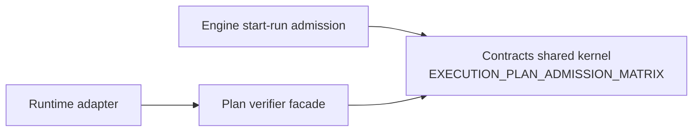
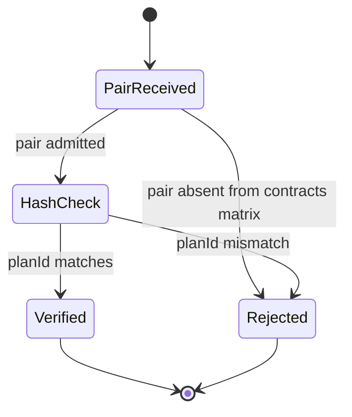

# EA-20260429-02 Plan Admission Matrix Plan

## Think-First Analysis

Problem summary:

- `@dvt/contracts` publishes the canonical
  `EXECUTION_PLAN_ADMISSION_MATRIX`.
- Engine start-run admission consumes that matrix before plan fetch or adapter
  dispatch.
- `@dvt/plan-verifier` still held a local `PLAN_RUNTIME_ADMISSION_MATRIX`
  that admitted only `planVersion` and could not reject unsupported
  `schemaVersion` values.

Root cause:

- The verifier API was named around `planVersion` rather than the admission
  decision.
- Documentation and architecture tests guarded against old semver fallback, but
  not against a local one-axis matrix.

Selected option:

- Keep `@dvt/contracts` as the only compatibility truth.
- Refactor `@dvt/plan-verifier` into an adapter-side facade over the canonical
  pair matrix.
- Require `schemaVersion` in verifier admission and combined plan verification.
- Add user stories, component docs, mailbox analysis, and semantic architecture
  tests that reject local runtime matrices.

## Command And Query Rail Impact

| Rail                            | Type  | Bounded context              | DDD owner                       | Intent                                                        | Port / adapter surface                                                        | Scope and auth                                                                | Negative tests                                                                                   |
| ------------------------------- | ----- | ---------------------------- | ------------------------------- | ------------------------------------------------------------- | ----------------------------------------------------------------------------- | ----------------------------------------------------------------------------- | ------------------------------------------------------------------------------------------------ |
| PlanAdmissionCompatibilityQuery | query | Contracts / runtime adapters | Execution plan admission matrix | Decide whether a runtime may continue with a plan/schema pair | `@dvt/contracts` matrix, `@dvt/plan-verifier` facade, engine admission policy | Tenant authorization remains at caller; compatibility is shared-kernel policy | unsupported schema under current plan, unsupported plan under current schema, local-matrix drift |

## Fowler Opportunity Matrix

| Scenario                                               | Opportunity         | Fowler pattern                    | DDD owner                | Rail                            | Implementation surfaces                  | Test                                        |
| ------------------------------------------------------ | ------------------- | --------------------------------- | ------------------------ | ------------------------------- | ---------------------------------------- | ------------------------------------------- |
| Adapter verifier admits only by planVersion            | Duplicate truth     | Shared Kernel, Published Language | contracts                | PlanAdmissionCompatibilityQuery | `planVersion.ts`, README, component docs | `planVersionAdmission.test.ts`              |
| Docs mention old runtime matrix                        | Documentation drift | Ubiquitous Language               | architecture docs        | same                            | component guide, user stories, mailbox   | `planVersionAdmission.architecture.test.ts` |
| Future schema literal appears with current planVersion | Primitive obsession | Value Object / semantic pair      | execution plan admission | same                            | verifier facade                          | negative pair tests                         |

## Diagrams





## Feature Mechanization

```feature-mechanization
version: 1
featureId: EA-20260429-02-PLAN-ADMISSION-MATRIX
mechanizationStatus: implemented
noHumanDecisionsRemaining: true
implementationPlan: docs/planning/proposals/mandatory/runtime-and-contracts/ea-20260429-02-plan-admission-matrix-plan-20260514.md
componentGuides:
  - docs/architecture/components/engine/contracts/plan-admission-matrix.md
  - docs/architecture/components/engine/contracts/plan-verifier-admission.md
userStories:
  - docs/architecture/components/engine/contracts/plan-admission-user-stories.md
  - docs/architecture/components/engine/contracts/plan-verifier-admission-user-stories.md
governingSources:
  - AGENTS.md
  - docs/planning/status/governance-document-rule-inventory.md
  - docs/architecture/command-query-rail-governance.md
  - docs/architecture/fowler-opportunity-planning-governance.md
  - docs/planning/reviews/architecture-and-governance/20260429-dvt-engine-package-audit-review.md
allowedImplementationSurfaces:
  - buzon/20260514-codex-fowler-ea-20260429-02-plan-admission-matrix-analysis.md
  - docs/planning/proposals/mandatory/runtime-and-contracts/ea-20260429-02-plan-admission-matrix-plan-20260514.md
  - docs/architecture/components/engine/contracts/plan-verifier-admission.md
  - docs/architecture/components/engine/contracts/plan-verifier-admission-user-stories.md
  - docs/contracts/engine/index.md
  - docs/.manifest.json
  - packages/@dvt/plan-verifier/README.md
  - packages/@dvt/plan-verifier/src/planVersion.ts
  - packages/@dvt/plan-verifier/src/verify.ts
  - packages/@dvt/plan-verifier/test/planVersionAdmission.test.ts
  - packages/@dvt/plan-verifier/test/planVersionAdmission.architecture.test.ts
  - packages/@dvt/plan-verifier/test/verify.test.ts
forbiddenImplementationSurfaces:
  - apps/**
  - packages/@dvt/contracts/**
  - packages/@dvt/engine/**
  - packages/@dvt/adapter-*/**
  - packages/@dvt/planner/**
commandQueryRails:
  - name: PlanAdmissionCompatibilityQuery
    type: query
    dddOwner: Execution plan admission matrix
domainObjects:
  - name: ExecutionPlanAdmissionPair
    type: shared-kernel value object
    owner: packages/@dvt/contracts/src/contracts/planner/PlanAdmission.v1.ts
  - name: PlanVerifierAdmissionFacade
    type: adapter-side query facade
    owner: packages/@dvt/plan-verifier/src/planVersion.ts
fowlerSignals:
  - Duplicate truth removed from runtime verifier admission.
  - Primitive version strings grouped into a semantic plan/schema pair.
  - Documentation drift closed across README, component guide, stories, and mailbox.
architectureGuards:
  - pnpm --filter @dvt/plan-verifier test -- planVersionAdmission
  - pnpm docs:feature-mechanization:implementation
cypressFlows:
  - N/A - package-level contract/admission verification only
completionGate:
  - pnpm --filter @dvt/plan-verifier test
  - pnpm --filter @dvt/plan-verifier typecheck
  - pnpm lint:md:changed
  - pnpm docs:feature-mechanization:implementation
  - pnpm verify:prepush
redGreenCycles:
  - id: plan-verifier-pair-admission
    redTest: pnpm --filter @dvt/plan-verifier test -- planVersionAdmission
    expectedFailure: verifyPlanAdmissionOrThrow and canonical pair facade were absent; docs still named the local runtime matrix.
    implementation:
      - packages/@dvt/plan-verifier/src/planVersion.ts
      - packages/@dvt/plan-verifier/src/verify.ts
      - packages/@dvt/plan-verifier/README.md
      - docs/architecture/components/engine/contracts/plan-verifier-admission.md
    patchSurfaces:
      - packages/@dvt/plan-verifier/src/planVersion.ts
      - packages/@dvt/plan-verifier/src/verify.ts
      - packages/@dvt/plan-verifier/test/planVersionAdmission.test.ts
      - packages/@dvt/plan-verifier/test/planVersionAdmission.architecture.test.ts
      - packages/@dvt/plan-verifier/test/verify.test.ts
    greenTest: pnpm --filter @dvt/plan-verifier test -- planVersionAdmission
symbols:
  - name: EXECUTION_PLAN_ADMISSION_MATRIX
    path: packages/@dvt/plan-verifier/src/planVersion.ts
    type: canonical matrix re-export
    dddOwner: Execution plan admission matrix
    cqRails:
      - PlanAdmissionCompatibilityQuery
    fowlerSignals:
      - Shared-kernel compatibility truth replaces local runtime list.
    architectureGuard: pnpm --filter @dvt/plan-verifier test -- planVersionAdmission
    unitTests:
      - pnpm --filter @dvt/plan-verifier test -- planVersionAdmission
    cypressCoverage: N/A - package-level admission facade
  - name: SUPPORTED_EXECUTION_PLAN_ADMISSION_PAIRS
    path: packages/@dvt/plan-verifier/src/planVersion.ts
    type: canonical pair-list re-export
    dddOwner: Execution plan admission matrix
    cqRails:
      - PlanAdmissionCompatibilityQuery
    fowlerSignals:
      - Adapter facade reads published pair values.
    architectureGuard: pnpm --filter @dvt/plan-verifier test -- planVersionAdmission
    unitTests:
      - pnpm --filter @dvt/plan-verifier test -- planVersionAdmission
    cypressCoverage: N/A - package-level admission facade
  - name: PLAN_ADMISSION_RUNTIMES
    path: packages/@dvt/plan-verifier/src/planVersion.ts
    type: runtime facade boundary
    dddOwner: Plan verifier admission facade
    cqRails:
      - PlanAdmissionCompatibilityQuery
    fowlerSignals:
      - Runtime consumers remain explicit without owning compatibility.
    architectureGuard: pnpm --filter @dvt/plan-verifier test -- planVersionAdmission
    unitTests:
      - pnpm --filter @dvt/plan-verifier test -- planVersionAdmission
    cypressCoverage: N/A - package-level admission facade
  - name: PlanRuntime
    path: packages/@dvt/plan-verifier/src/planVersion.ts
    type: runtime facade type
    dddOwner: Plan verifier admission facade
    cqRails:
      - PlanAdmissionCompatibilityQuery
    fowlerSignals:
      - Runtime vocabulary stays separate from compatibility facts.
    architectureGuard: pnpm --filter @dvt/plan-verifier typecheck
    unitTests:
      - pnpm --filter @dvt/plan-verifier typecheck
    cypressCoverage: N/A - package-level admission facade
  - name: VerifyPlanAdmissionParams
    path: packages/@dvt/plan-verifier/src/planVersion.ts
    type: admission query DTO
    dddOwner: Plan verifier admission facade
    cqRails:
      - PlanAdmissionCompatibilityQuery
    fowlerSignals:
      - planVersion and schemaVersion travel as one semantic decision input.
    architectureGuard: pnpm --filter @dvt/plan-verifier typecheck
    unitTests:
      - pnpm --filter @dvt/plan-verifier typecheck
    cypressCoverage: N/A - package-level admission facade
  - name: getSupportedPlanAdmissionPairsForRuntime
    path: packages/@dvt/plan-verifier/src/planVersion.ts
    type: admission query helper
    dddOwner: Plan verifier admission facade
    cqRails:
      - PlanAdmissionCompatibilityQuery
    fowlerSignals:
      - Consumer API returns pairs rather than one-axis versions.
    architectureGuard: pnpm --filter @dvt/plan-verifier test -- planVersionAdmission
    unitTests:
      - pnpm --filter @dvt/plan-verifier test -- planVersionAdmission
    cypressCoverage: N/A - package-level admission facade
  - name: verifyPlanAdmissionAgainstRuntimeOrThrow
    path: packages/@dvt/plan-verifier/src/planVersion.ts
    type: admission guard
    dddOwner: Plan verifier admission facade
    cqRails:
      - PlanAdmissionCompatibilityQuery
    fowlerSignals:
      - Fail-fast verifier consumes the shared matrix.
    architectureGuard: pnpm --filter @dvt/plan-verifier test -- planVersionAdmission
    unitTests:
      - pnpm --filter @dvt/plan-verifier test -- planVersionAdmission
    cypressCoverage: N/A - package-level admission facade
  - name: verifyPlanAdmissionOrThrow
    path: packages/@dvt/plan-verifier/src/planVersion.ts
    type: public admission guard
    dddOwner: Plan verifier admission facade
    cqRails:
      - PlanAdmissionCompatibilityQuery
    fowlerSignals:
      - Public API names the domain decision instead of only planVersion.
    architectureGuard: pnpm --filter @dvt/plan-verifier test -- planVersionAdmission
    unitTests:
      - pnpm --filter @dvt/plan-verifier test -- planVersionAdmission
    cypressCoverage: N/A - package-level admission facade
  - name: assertKnownRuntime
    path: packages/@dvt/plan-verifier/src/planVersion.ts
    type: runtime vocabulary guard
    dddOwner: Plan verifier admission facade
    cqRails:
      - PlanAdmissionCompatibilityQuery
    fowlerSignals:
      - Local runtime validation stays separate from compatibility ownership.
    architectureGuard: pnpm --filter @dvt/plan-verifier test -- planVersionAdmission
    unitTests:
      - pnpm --filter @dvt/plan-verifier test -- planVersionAdmission
    cypressCoverage: N/A - package-level admission facade
expectedValidation:
  - pnpm --filter @dvt/plan-verifier test -- planVersionAdmission
  - pnpm --filter @dvt/plan-verifier test
  - pnpm --filter @dvt/plan-verifier typecheck
  - pnpm docs:sync
  - pnpm verify:prepush
```
