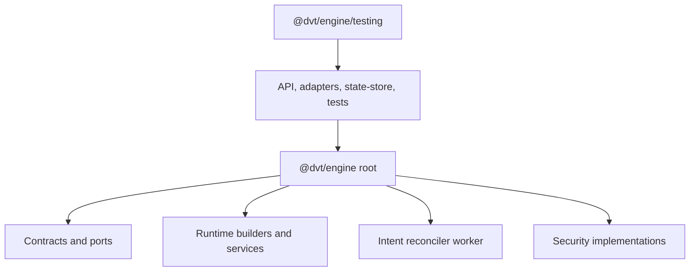
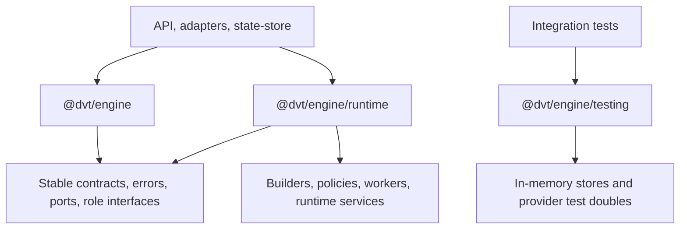

# EA-20260429-05 Engine Public API Surface Plan

## Think-First Analysis

`EA-20260429-05` closes the public package barrel drift found in the
2026-04-29 engine audit. The root problem is boundary drift: the package root
currently exports stable contracts and ports together with runtime builders,
workers, security implementations, provider-selection helpers, and test-facing
implementation classes. That lets consumers depend on semi-internal engine
composition details as if they were stable product API.

This slice does not introduce a new user command or query. It changes package
boundary governance for the existing engine runtime rails. The domain owner is
the engine public package API read model: the root entrypoint is the stable
contract and port surface; runtime composition moves behind a named runtime
entrypoint; in-memory test implementations remain behind `./testing`.

## Fowler Matrix

| Scenario                                                        | Opportunity             | Fowler pattern                         | DDD owner                            | Command/query rail                   | Implementation surfaces                               | Required proof                                                    | Out of scope                       |
| --------------------------------------------------------------- | ----------------------- | -------------------------------------- | ------------------------------------ | ------------------------------------ | ----------------------------------------------------- | ----------------------------------------------------------------- | ---------------------------------- |
| Root package import exposes implementation builders and workers | Boundary drift          | Facade and Published Interface         | engine public package API read model | none - package presentation boundary | `packages/@dvt/engine/src/index.ts`, `package.json`   | architecture test rejects implementation exports from root        | changing runtime behavior          |
| API composition needs runtime builders                          | Responsibility overload | Service Layer behind named entrypoint  | engine runtime composition API       | existing engine runtime commands     | `packages/@dvt/engine/src/runtime.ts`, API imports    | typecheck proves consumers use `@dvt/engine/runtime`              | moving API composition into engine |
| In-memory helpers are useful in integration tests               | Test-only confidence    | Test Double entrypoint                 | engine testing API                   | none - test support only             | `packages/@dvt/engine/src/testing.ts`                 | architecture test keeps in-memory exports out of root/runtime     | production adapter changes         |
| Engine event names preserve aliases around canonical contracts  | Semantic drift          | Published Language                     | engine public package API read model | none - package presentation boundary | `packages/@dvt/engine/src/contracts/runEvents.ts`     | architecture test rejects legacy alias names                      | changing event schema              |
| Future code re-adds broad root exports                          | Documentation drift     | Semantic architecture fitness function | engine package surface component     | none - package presentation boundary | package-surface architecture test and component guide | test validates public/runtime/testing invariants, docs, consumers | whole monorepo import migration    |

## Rail Declaration

- Type: none for product behavior; this is a package presentation and
  architecture-fitness slice.
- Owning bounded context: engine runtime.
- Product intent affected: existing `WorkflowEngine` runtime commands and read
  ports remain unchanged.
- DDD owner: engine public package API read model.
- Stable public entrypoint: `@dvt/engine`.
- Runtime composition entrypoint: `@dvt/engine/runtime`.
- Test-support entrypoint: `@dvt/engine/testing`.
- Negative tests: root entrypoint must not export runtime workers,
  implementation services, provider-selection helpers, security implementations,
  in-memory stores, or test doubles.
- Negative tests: engine event contracts must not publish compatibility aliases
  around canonical `@dvt/contracts` event names.

## Current-State Diagram



## Target-State Diagram



## Feature Mechanization

```feature-mechanization
version: 1
featureId: EA-20260429-05-ENGINE-PUBLIC-API-SURFACE
mechanizationStatus: implemented
noHumanDecisionsRemaining: true
implementationPlan: docs/planning/proposals/mandatory/runtime-and-contracts/ea-20260429-05-engine-public-api-surface-plan-20260514.md
componentGuides:
  - docs/architecture/components/engine/architecture/engine-public-api-surface-component.md
userStories:
  - docs/architecture/components/engine/architecture/engine-public-api-surface-user-stories.md
governingSources:
  - AGENTS.md
  - docs/planning/status/governance-document-rule-inventory.md
  - docs/architecture/command-query-rail-governance.md
  - docs/architecture/fowler-opportunity-planning-governance.md
  - docs/planning/reviews/architecture-and-governance/20260429-dvt-engine-package-audit-review.md
allowedImplementationSurfaces:
  - docs/planning/proposals/mandatory/runtime-and-contracts/ea-20260429-05-engine-public-api-surface-plan-20260514.md
  - docs/architecture/components/engine/architecture/engine-public-api-surface-component.md
  - docs/architecture/components/engine/architecture/engine-public-api-surface-user-stories.md
  - docs/architecture/components/engine/architecture/index.md
  - buzon/20260514-codex-fowler-ea-20260429-05-engine-public-api-surface-analysis.md
  - packages/@dvt/engine/package.json
  - packages/@dvt/engine/src/index.ts
  - packages/@dvt/engine/src/runtime.ts
  - packages/@dvt/engine/src/testing.ts
  - packages/@dvt/engine/src/contracts/**
  - packages/@dvt/engine/src/state/**
  - packages/@dvt/engine/src/services/runMaintenance/**
  - packages/@dvt/engine/src/services/startRun/**
  - packages/@dvt/engine/test/architecture/enginePublicApiSurface.architecture.test.ts
  - packages/@dvt/engine/test/state/**
  - apps/api/src/**
  - apps/api/test/integration/**
  - apps/outbox-worker/src/**
  - apps/outbox-worker/test/**
  - apps/temporal-worker/src/**
  - packages/@dvt/adapter-postgres/src/**
  - packages/@dvt/adapter-temporal/src/**
  - packages/@dvt/delivery/test/**
  - packages/@dvt/state-store/src/**
  - docs/evidence/**
  - docs/risk-register/quality/**
forbiddenImplementationSurfaces:
  - packages/@dvt/engine/src/core/lifecycle/**
commandQueryRails:
  - name: none - package presentation boundary
    type: query
    dddOwner: engine public package API read model
domainObjects:
  - name: EnginePublicApiSurface
    type: published interface
    owner: packages/@dvt/engine/src/index.ts
  - name: EngineRuntimeApiSurface
    type: service-layer entrypoint
    owner: packages/@dvt/engine/src/runtime.ts
  - name: EngineTestingApiSurface
    type: test-double entrypoint
    owner: packages/@dvt/engine/src/testing.ts
fowlerSignals:
  - Boundary drift
  - Duplicate semantics
  - Test-only confidence
  - Documentation drift
architectureGuards:
  - pnpm --filter @dvt/engine test -- test/architecture/enginePublicApiSurface.architecture.test.ts
cypressFlows:
  - N/A - package API boundary only
completionGate:
  - GIT_BASE=origin/main GIT_HEAD=HEAD node tools/ci/arc-check.mjs
  - pnpm docs:sync
  - pnpm docs:feature-mechanization -- --feature EA-20260429-05-ENGINE-PUBLIC-API-SURFACE
  - pnpm --filter @dvt/engine test -- test/architecture/enginePublicApiSurface.architecture.test.ts
  - pnpm --filter @dvt/engine typecheck
  - pnpm verify:prepush
redGreenCycles:
  - id: root-package-surface-is-public-only
    redTest: pnpm --filter @dvt/engine test -- test/architecture/enginePublicApiSurface.architecture.test.ts
    expectedFailure: root barrel still exports runtime and implementation modules
    patchSurfaces:
      - packages/@dvt/engine/src/index.ts
      - packages/@dvt/engine/src/runtime.ts
      - packages/@dvt/engine/package.json
    greenTest: pnpm --filter @dvt/engine test -- test/architecture/enginePublicApiSurface.architecture.test.ts
symbols:
  - name: EnginePublicApiSurface
    path: packages/@dvt/engine/src/index.ts
    dddOwner: engine public package API read model
    cqRails: [none - package presentation boundary]
    fowlerSignals: [Boundary drift]
    architectureGuard: pnpm --filter @dvt/engine test -- test/architecture/enginePublicApiSurface.architecture.test.ts
    cypressCoverage: N/A - package API boundary only
    unitTests: [pnpm --filter @dvt/engine test -- test/architecture/enginePublicApiSurface.architecture.test.ts]
  - name: EngineRuntimeApiSurface
    path: packages/@dvt/engine/src/runtime.ts
    dddOwner: engine runtime composition API
    cqRails: [none - package presentation boundary]
    fowlerSignals: [Responsibility overload]
    architectureGuard: pnpm --filter @dvt/engine test -- test/architecture/enginePublicApiSurface.architecture.test.ts
    cypressCoverage: N/A - package API boundary only
    unitTests: [pnpm --filter @dvt/engine typecheck]
  - name: buildWorkflowEngineFacade
    path: packages/@dvt/engine/src/runtime.ts
    dddOwner: engine runtime composition API
    cqRails: [none - package presentation boundary]
    fowlerSignals: [Boundary drift]
    architectureGuard: pnpm --filter @dvt/engine test -- test/architecture/enginePublicApiSurface.architecture.test.ts
    cypressCoverage: N/A - package API boundary only
    unitTests: [pnpm --filter @dvt/engine typecheck]
  - name: buildRunCommandService
    path: packages/@dvt/engine/src/runtime.ts
    dddOwner: engine runtime composition API
    cqRails: [none - package presentation boundary]
    fowlerSignals: [Boundary drift]
    architectureGuard: pnpm --filter @dvt/engine test -- test/architecture/enginePublicApiSurface.architecture.test.ts
    cypressCoverage: N/A - package API boundary only
    unitTests: [pnpm --filter @dvt/engine typecheck]
  - name: buildRunSignalService
    path: packages/@dvt/engine/src/runtime.ts
    dddOwner: engine runtime composition API
    cqRails: [none - package presentation boundary]
    fowlerSignals: [Boundary drift]
    architectureGuard: pnpm --filter @dvt/engine test -- test/architecture/enginePublicApiSurface.architecture.test.ts
    cypressCoverage: N/A - package API boundary only
    unitTests: [pnpm --filter @dvt/engine typecheck]
  - name: buildRunStatusQueryService
    path: packages/@dvt/engine/src/runtime.ts
    dddOwner: engine runtime composition API
    cqRails: [none - package presentation boundary]
    fowlerSignals: [Boundary drift]
    architectureGuard: pnpm --filter @dvt/engine test -- test/architecture/enginePublicApiSurface.architecture.test.ts
    cypressCoverage: N/A - package API boundary only
    unitTests: [pnpm --filter @dvt/engine typecheck]
  - name: buildRunRecoveryService
    path: packages/@dvt/engine/src/runtime.ts
    dddOwner: engine runtime composition API
    cqRails: [none - package presentation boundary]
    fowlerSignals: [Boundary drift]
    architectureGuard: pnpm --filter @dvt/engine test -- test/architecture/enginePublicApiSurface.architecture.test.ts
    cypressCoverage: N/A - package API boundary only
    unitTests: [pnpm --filter @dvt/engine typecheck]
  - name: buildRunHealthService
    path: packages/@dvt/engine/src/runtime.ts
    dddOwner: engine runtime composition API
    cqRails: [none - package presentation boundary]
    fowlerSignals: [Boundary drift]
    architectureGuard: pnpm --filter @dvt/engine test -- test/architecture/enginePublicApiSurface.architecture.test.ts
    cypressCoverage: N/A - package API boundary only
    unitTests: [pnpm --filter @dvt/engine typecheck]
  - name: buildRunControlService
    path: packages/@dvt/engine/src/runtime.ts
    dddOwner: engine runtime composition API
    cqRails: [none - package presentation boundary]
    fowlerSignals: [Boundary drift]
    architectureGuard: pnpm --filter @dvt/engine test -- test/architecture/enginePublicApiSurface.architecture.test.ts
    cypressCoverage: N/A - package API boundary only
    unitTests: [pnpm --filter @dvt/engine typecheck]
  - name: SequenceClock
    path: packages/@dvt/engine/src/runtime.ts
    dddOwner: engine runtime composition API
    cqRails: [none - package presentation boundary]
    fowlerSignals: [Boundary drift]
    architectureGuard: pnpm --filter @dvt/engine test -- test/architecture/enginePublicApiSurface.architecture.test.ts
    cypressCoverage: N/A - package API boundary only
    unitTests: [pnpm --filter @dvt/engine typecheck]
  - name: epochMsToIsoUtc
    path: packages/@dvt/engine/src/runtime.ts
    dddOwner: engine runtime composition API
    cqRails: [none - package presentation boundary]
    fowlerSignals: [Boundary drift]
    architectureGuard: pnpm --filter @dvt/engine test -- test/architecture/enginePublicApiSurface.architecture.test.ts
    cypressCoverage: N/A - package API boundary only
    unitTests: [pnpm --filter @dvt/engine typecheck]
  - name: parseIsoUtcToEpochMs
    path: packages/@dvt/engine/src/runtime.ts
    dddOwner: engine runtime composition API
    cqRails: [none - package presentation boundary]
    fowlerSignals: [Boundary drift]
    architectureGuard: pnpm --filter @dvt/engine test -- test/architecture/enginePublicApiSurface.architecture.test.ts
    cypressCoverage: N/A - package API boundary only
    unitTests: [pnpm --filter @dvt/engine typecheck]
  - name: EnginePackageJson
    path: packages/@dvt/engine/test/architecture/enginePublicApiSurface.architecture.test.ts
    dddOwner: engine public package API read model
    cqRails: [none - package presentation boundary]
    fowlerSignals: [Test-only confidence]
    architectureGuard: pnpm --filter @dvt/engine test -- test/architecture/enginePublicApiSurface.architecture.test.ts
    cypressCoverage: N/A - package API boundary only
    unitTests: [pnpm --filter @dvt/engine test -- test/architecture/enginePublicApiSurface.architecture.test.ts]
  - name: readEnginePackageJson
    path: packages/@dvt/engine/test/architecture/enginePublicApiSurface.architecture.test.ts
    dddOwner: engine public package API read model
    cqRails: [none - package presentation boundary]
    fowlerSignals: [Test-only confidence]
    architectureGuard: pnpm --filter @dvt/engine test -- test/architecture/enginePublicApiSurface.architecture.test.ts
    cypressCoverage: N/A - package API boundary only
    unitTests: [pnpm --filter @dvt/engine test -- test/architecture/enginePublicApiSurface.architecture.test.ts]
  - name: exportedModuleSpecifiers
    path: packages/@dvt/engine/test/architecture/enginePublicApiSurface.architecture.test.ts
    dddOwner: engine public package API read model
    cqRails: [none - package presentation boundary]
    fowlerSignals: [Test-only confidence]
    architectureGuard: pnpm --filter @dvt/engine test -- test/architecture/enginePublicApiSurface.architecture.test.ts
    cypressCoverage: N/A - package API boundary only
    unitTests: [pnpm --filter @dvt/engine test -- test/architecture/enginePublicApiSurface.architecture.test.ts]
  - name: expectNoExportFamilies
    path: packages/@dvt/engine/test/architecture/enginePublicApiSurface.architecture.test.ts
    dddOwner: engine public package API read model
    cqRails: [none - package presentation boundary]
    fowlerSignals: [Test-only confidence]
    architectureGuard: pnpm --filter @dvt/engine test -- test/architecture/enginePublicApiSurface.architecture.test.ts
    cypressCoverage: N/A - package API boundary only
    unitTests: [pnpm --filter @dvt/engine test -- test/architecture/enginePublicApiSurface.architecture.test.ts]
  - name: assertEventRunIdMatches
    path: packages/@dvt/engine/src/state/runEventWritePolicy.ts
    dddOwner: engine event vocabulary write policy
    cqRails: [none - package presentation boundary]
    fowlerSignals: [Semantic drift]
    architectureGuard: pnpm --filter @dvt/engine test -- test/architecture/enginePublicApiSurface.architecture.test.ts
    cypressCoverage: N/A - package API boundary only
    unitTests: [pnpm --filter @dvt/engine typecheck]
  - name: assertEventTenantMatches
    path: packages/@dvt/engine/src/state/runEventWritePolicy.ts
    dddOwner: engine event vocabulary write policy
    cqRails: [none - package presentation boundary]
    fowlerSignals: [Semantic drift]
    architectureGuard: pnpm --filter @dvt/engine test -- test/architecture/enginePublicApiSurface.architecture.test.ts
    cypressCoverage: N/A - package API boundary only
    unitTests: [pnpm --filter @dvt/engine typecheck]
  - name: assertEventsMatchRunId
    path: packages/@dvt/engine/src/state/runEventWritePolicy.ts
    dddOwner: engine event vocabulary write policy
    cqRails: [none - package presentation boundary]
    fowlerSignals: [Semantic drift]
    architectureGuard: pnpm --filter @dvt/engine test -- test/architecture/enginePublicApiSurface.architecture.test.ts
    cypressCoverage: N/A - package API boundary only
    unitTests: [pnpm --filter @dvt/engine typecheck]
  - name: assertRunEventInput
    path: packages/@dvt/engine/src/state/runEventWritePolicy.ts
    dddOwner: engine event vocabulary write policy
    cqRails: [none - package presentation boundary]
    fowlerSignals: [Semantic drift]
    architectureGuard: pnpm --filter @dvt/engine test -- test/architecture/enginePublicApiSurface.architecture.test.ts
    cypressCoverage: N/A - package API boundary only
    unitTests: [pnpm --filter @dvt/engine typecheck]
  - name: parseRunEventEnvelope
    path: packages/@dvt/engine/src/state/runEventWritePolicy.ts
    dddOwner: engine event vocabulary write policy
    cqRails: [none - package presentation boundary]
    fowlerSignals: [Semantic drift]
    architectureGuard: pnpm --filter @dvt/engine test -- test/architecture/enginePublicApiSurface.architecture.test.ts
    cypressCoverage: N/A - package API boundary only
    unitTests: [pnpm --filter @dvt/engine typecheck]
  - name: makeEvent
    path: apps/outbox-worker/test/bus/HttpEventBus.test.ts
    dddOwner: outbox worker event vocabulary tests
    cqRails: [none - package presentation boundary]
    fowlerSignals: [Semantic drift]
    architectureGuard: pnpm --filter dvt-outbox-worker typecheck
    cypressCoverage: N/A - package API boundary only
    unitTests: [pnpm --filter dvt-outbox-worker typecheck]
  - name: cloneEvent
    path: apps/outbox-worker/test/canary/support/standaloneCanaryEventSupport.ts
    dddOwner: outbox worker event vocabulary tests
    cqRails: [none - package presentation boundary]
    fowlerSignals: [Semantic drift]
    architectureGuard: pnpm --filter dvt-outbox-worker typecheck
    cypressCoverage: N/A - package API boundary only
    unitTests: [pnpm --filter dvt-outbox-worker typecheck]
  - name: makeRunQueuedEvent
    path: apps/outbox-worker/test/canary/support/standaloneCanaryEventSupport.ts
    dddOwner: outbox worker event vocabulary tests
    cqRails: [none - package presentation boundary]
    fowlerSignals: [Semantic drift]
    architectureGuard: pnpm --filter dvt-outbox-worker typecheck
    cypressCoverage: N/A - package API boundary only
    unitTests: [pnpm --filter dvt-outbox-worker typecheck]
  - name: handleSinkRequest
    path: apps/outbox-worker/test/canary/support/standaloneCanaryHttpSink.ts
    dddOwner: outbox worker event vocabulary tests
    cqRails: [none - package presentation boundary]
    fowlerSignals: [Semantic drift]
    architectureGuard: pnpm --filter dvt-outbox-worker typecheck
    cypressCoverage: N/A - package API boundary only
    unitTests: [pnpm --filter dvt-outbox-worker typecheck]
  - name: shouldSkipDuplicateEffect
    path: apps/outbox-worker/test/canary/support/standaloneCanaryHttpSink.ts
    dddOwner: outbox worker event vocabulary tests
    cqRails: [none - package presentation boundary]
    fowlerSignals: [Semantic drift]
    architectureGuard: pnpm --filter dvt-outbox-worker typecheck
    cypressCoverage: N/A - package API boundary only
    unitTests: [pnpm --filter dvt-outbox-worker typecheck]
  - name: makeEvent
    path: apps/outbox-worker/test/ops/outboxWorkerMonitorTestSupport.ts
    dddOwner: outbox worker event vocabulary tests
    cqRails: [none - package presentation boundary]
    fowlerSignals: [Semantic drift]
    architectureGuard: pnpm --filter dvt-outbox-worker typecheck
    cypressCoverage: N/A - package API boundary only
    unitTests: [pnpm --filter dvt-outbox-worker typecheck]
  - name: makeRuntimeEvent
    path: apps/outbox-worker/test/runtime/OutboxWorkerRuntime.ordering.test.ts
    dddOwner: outbox worker event vocabulary tests
    cqRails: [none - package presentation boundary]
    fowlerSignals: [Semantic drift]
    architectureGuard: pnpm --filter dvt-outbox-worker typecheck
    cypressCoverage: N/A - package API boundary only
    unitTests: [pnpm --filter dvt-outbox-worker typecheck]
  - name: EventIdentifier
    path: apps/outbox-worker/test/runtime/runtimeTestSupport.ts
    dddOwner: outbox worker event vocabulary tests
    cqRails: [none - package presentation boundary]
    fowlerSignals: [Semantic drift]
    architectureGuard: pnpm --filter dvt-outbox-worker typecheck
    cypressCoverage: N/A - package API boundary only
    unitTests: [pnpm --filter dvt-outbox-worker typecheck]
  - name: IdempotencyKey
    path: apps/outbox-worker/test/runtime/runtimeTestSupport.ts
    dddOwner: outbox worker event vocabulary tests
    cqRails: [none - package presentation boundary]
    fowlerSignals: [Semantic drift]
    architectureGuard: pnpm --filter dvt-outbox-worker typecheck
    cypressCoverage: N/A - package API boundary only
    unitTests: [pnpm --filter dvt-outbox-worker typecheck]
  - name: RunIdentifier
    path: apps/outbox-worker/test/runtime/runtimeTestSupport.ts
    dddOwner: outbox worker event vocabulary tests
    cqRails: [none - package presentation boundary]
    fowlerSignals: [Semantic drift]
    architectureGuard: pnpm --filter dvt-outbox-worker typecheck
    cypressCoverage: N/A - package API boundary only
    unitTests: [pnpm --filter dvt-outbox-worker typecheck]
  - name: buildPersistedEvent
    path: apps/outbox-worker/test/runtime/runtimeTestSupport.ts
    dddOwner: outbox worker event vocabulary tests
    cqRails: [none - package presentation boundary]
    fowlerSignals: [Semantic drift]
    architectureGuard: pnpm --filter dvt-outbox-worker typecheck
    cypressCoverage: N/A - package API boundary only
    unitTests: [pnpm --filter dvt-outbox-worker typecheck]
  - name: makePendingEvent
    path: apps/outbox-worker/test/runtime/runtimeTestUtils.ts
    dddOwner: outbox worker event vocabulary tests
    cqRails: [none - package presentation boundary]
    fowlerSignals: [Semantic drift]
    architectureGuard: pnpm --filter dvt-outbox-worker typecheck
    cypressCoverage: N/A - package API boundary only
    unitTests: [pnpm --filter dvt-outbox-worker typecheck]
  - name: makeEvent
    path: packages/@dvt/delivery/test/support/outboxWorkerTestSupport.ts
    dddOwner: delivery event vocabulary tests
    cqRails: [none - package presentation boundary]
    fowlerSignals: [Semantic drift]
    architectureGuard: pnpm --filter @dvt/delivery typecheck
    cypressCoverage: N/A - package API boundary only
    unitTests: [pnpm --filter @dvt/delivery typecheck]
```
