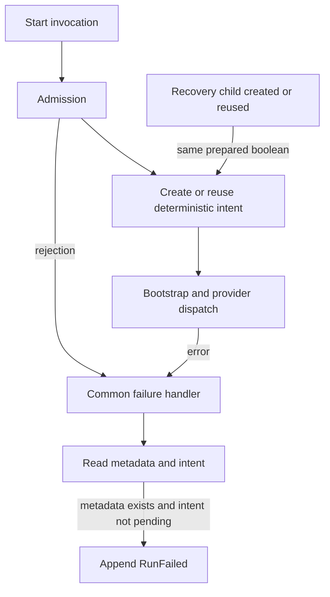
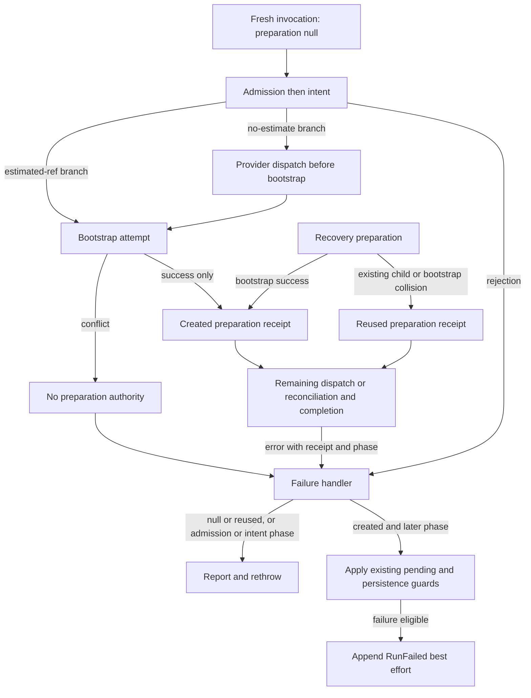

# ENG1 Start Run Mutation Authority Plan

## Think-First Analysis

[Issue #2676](https://github.com/dunay2/dvt/issues/2676) owns delivery.
An admission rejection currently reaches the common failure handler with an
empty error context. Existing metadata can then cause a RunFailed event against
another invocation's run. The handler confuses existence with authority.

Planning DB consultation selected the existing IWorkflowEngine.startRun rail,
owned by StartRunApplicationFlow (WE-HX-3-START-RUN-DECOMPOSITION).
The existing recovery command feeds that same application service after
preparing or reusing a recovery child. No additional command or coordinator is
needed.

This first cut establishes authority for common failure reporting. It does not
claim exclusive intent ownership. The global issue invariant remains open:
Issue #2678 owns durable claims/fencing; #2679 owns unknown provider outcomes.
The no-estimate path dispatches before bootstrap, and reused recovery can
dispatch an existing intent. Their pre-catch intent/reconciliation/compensation
effects remain separate, pre-existing limitations, not guarantees of this guard.

## Current State



## Selected Design



A readonly StartRunPreparation records disposition (created or reused) and the
prepared EngineRunRef. Fresh execution sets created only immediately after its
own bootstrapRunTx succeeds. Recovery returns created after bootstrapRecoveryRunTx
success, and reused from both existing-child and concurrent-collision paths.
The internal startPreparedRun port accepts this receipt instead of a raw ref.

StartRunErrorContext carries that receipt or null, an optional intentId and a
StartRunPhase: admission, intent, bootstrap, provider_dispatch,
provider_ref_reconciliation or completion. The existing phase owner records
the phase before the operation can fail. StartRunExecutionInput transports the
same per-invocation context; it is not a second state machine or durable claim.

The common handler reports errors, preserves PostStartIntentPersistenceError,
and rejects null/reused authority or admission/intent phases before reading
metadata or intents for failure emission. Created authority is necessary, not
sufficient: existing metadata and PENDING-intent guards still apply. In
particular, a newly prepared recovery whose intent creation fails stays PENDING.
Provider refs remain provider addresses, not logical-run authorization IDs.

## Fowler Matrix

| Scenario                              | Opportunity          | Fowler pattern                    | DDD owner                                   | Command/query rail                              | Implementation surfaces                                          | Unit or package test                                                     | Architecture test                      | User-flow test                                 | Out of scope             |
| ------------------------------------- | -------------------- | --------------------------------- | ------------------------------------------- | ----------------------------------------------- | ---------------------------------------------------------------- | ------------------------------------------------------------------------ | -------------------------------------- | ---------------------------------------------- | ------------------------ |
| Admission error finds another run     | Hidden authority     | Explicit value and failure policy | Engine Run lifecycle                        | IWorkflowEngine.startRun                        | StartRunTypes, StartRunApplicationService, StartRunFailurePolicy | Complete state equality in WorkflowEngine.startMutationAuthority.test.ts | Existing start-run decomposition suite | Actual Engine admission and duplicate commands | Exception allowlist      |
| Fresh bootstrap collision             | Hidden authority     | Transaction boundary receipt      | StartRunExecutionService                    | IWorkflowEngine.startRun                        | StartRunExecutionService                                         | Deterministic loser after winner dispatch                                | Existing start-run decomposition suite | Actual bootstrap transaction and start command | New lock service         |
| Recovery created and reused collapsed | Primitive obsession  | Readonly preparation result       | RecoverRunApplicationService                | Existing recovery into IWorkflowEngine.startRun | Recovery service and internal start port                         | Both reused paths lack failure authority                                 | Existing start-run decomposition suite | Actual Engine recovery command                 | Disabling recovery reuse |
| Own reconciliation fails              | Test-only confidence | Preserve compensating transaction | StartRunExecutionService and failure policy | IWorkflowEngine.startRun                        | Execution and failure services                                   | Legitimate RunFailed and exact provider compensation                     | Existing start-run decomposition suite | Existing Engine intent-log and API start tests | Unknown-outcome redesign |

## Rail And Scope

- Type: command; owning bounded context: Engine runtime.
- DDD owner: StartRunApplicationFlow, operating on the Run aggregate.
- Application port: existing IWorkflowEngine.startRun; recovery reuses
  IStartRunApplicationService.startPreparedRun.
- Adapter surfaces: existing IProviderAdapter.startRun/cancelRun,
  IRunStateStoreRead/Write and IStartRunIntentStore.
- Scope: authenticated tenant, project/environment and logical run context remain
  governed by the existing admission policies. No authorization check is removed.
- Mutation authority: successful run preparation by this invocation is required
  for common failure emission; metadata existence and error text grant none.
- Negative proofs: duplicate PENDING/RUNNING/PAUSED and admission rejection preserve
  complete metadata/events/snapshot/intent; no-run rejection creates none;
  deterministic estimated-bootstrap loser and recovery reuser cannot append
  failure; owned reconciliation failure still emits the legitimate lifecycle fact.

## Implementation Sequence

1. Freeze this design and validate its feature manifest.
2. RED: actual Engine regressions, with Promise barriers and real in-memory store
   transactions. Capture complete state, not only the final status.
3. Propagate preparation and phase through the six existing production surfaces;
   add the failure guard. Keep provider/intent transition behavior unchanged.
4. GREEN: focused regressions, full Engine tests/coverage including replay and
   architecture, affected API tests, typecheck and lint.
5. Review independently; record governed ARC evidence/risk and refresh indexes.
   Commit through the helper and run pre-push on the hook-normalized tree.
6. Integrate after review/gates; record evidence in #2676. Keep the global issue
   open until #2678/#2679 prove the remaining authority boundary.

The design was closed before RED. The implemented manifest records this bounded
failure-reporting cut; it does not close the global GitHub issue.

## Feature Mechanization

```feature-mechanization
version: 1
featureId: GH-2676-START-RUN-MUTATION-AUTHORITY
mechanizationStatus: implemented
noHumanDecisionsRemaining: true
implementationPlan: docs/planning/proposals/mandatory/runtime-and-contracts/eng1-start-mutation-authority-plan-20260906.md
componentGuides:
  - docs/architecture/components/engine/contracts/engine/StartRunProtocol.v1.md
userStories:
  - https://github.com/dunay2/dvt/issues/2676
governingSources:
  - AGENTS.md
  - docs/planning/status/governance-document-rule-inventory.md
  - docs/guides/ai-work-protocol.md
  - docs/planning/state/github-mvp-issue-workflow.md
  - docs/architecture/command-query-rail-governance.md
  - docs/architecture/fowler-opportunity-planning-governance.md
  - docs/adr/ADR-0013-run-state-store-bootstrapRunTx.md
  - docs/adr/ADR-0030-pre-dispatch-intent-log.md
allowedImplementationSurfaces:
  - packages/@dvt/engine/src/services/startRun/StartRunTypes.ts
  - packages/@dvt/engine/src/services/startRun/StartRunExecutionService.ts
  - packages/@dvt/engine/src/services/startRun/StartRunFailurePolicy.ts
  - packages/@dvt/engine/src/application/StartRunApplicationService.ts
  - packages/@dvt/engine/src/application/IStartRunApplicationService.ts
  - packages/@dvt/engine/src/application/RecoverRunApplicationService.ts
  - packages/@dvt/engine/test/core/WorkflowEngine.startMutationAuthority.test.ts
  - packages/@dvt/engine/test/core/WorkflowEngine.test.ts
  - packages/@dvt/engine/test/services/StartRunApplicationService.test.ts
  - docs/planning/proposals/mandatory/runtime-and-contracts/eng1-start-mutation-authority-plan-20260906.md
  - docs/architecture/components/engine/contracts/engine/StartRunProtocol.v1.md
  - docs/evidence/ed-20260906-eng1-start-mutation-authority.md
  - docs/risk-register/quality/R-20260906-ENG1-START-MUTATION-AUTHORITY.yaml
  - docs/**/index.md
  - docs/planning/status/**
forbiddenImplementationSurfaces:
  - apps/**
  - packages/@dvt/engine/src/ports/IStartRunIntentStore.ts
  - packages/@dvt/engine/src/state/**
  - packages/@dvt/contracts/**
  - packages/@dvt/adapter-*/**
  - scripts/**
  - tools/**
commandQueryRails:
  - name: IWorkflowEngine.startRun
    type: command
    dddOwner: StartRunApplicationFlow
domainObjects:
  - name: StartRunPreparation
    type: value object
    owner: StartRunApplicationFlow
fowlerSignals:
  - Hidden authority
  - Primitive obsession
  - Temporal coupling
architectureGuards:
  - pnpm --filter @dvt/engine exec vitest run test/architecture
  - pnpm docs:feature-mechanization:implementation
cypressFlows:
  - N/A - Engine command rail; no UI changes
completionGate:
  - pnpm --filter @dvt/engine exec vitest run --coverage
  - pnpm --filter @dvt/engine typecheck
  - pnpm --filter dvt-api test:unit
  - pnpm arch:deps
  - pnpm traceability:adr0
  - pnpm governance:refresh
  - pnpm verify:prepush
redGreenCycles:
  - id: rejected-and-non-owner-start-preserves-run
    redTest: pnpm --filter @dvt/engine exec vitest run test/core/WorkflowEngine.startMutationAuthority.test.ts
    expectedFailure: Admission or bootstrap loser appends RunFailed to another invocation's run
    patchSurfaces:
      - packages/@dvt/engine/src/services/startRun/StartRunTypes.ts
      - packages/@dvt/engine/src/services/startRun/StartRunExecutionService.ts
      - packages/@dvt/engine/src/services/startRun/StartRunFailurePolicy.ts
      - packages/@dvt/engine/src/application/StartRunApplicationService.ts
      - packages/@dvt/engine/src/application/IStartRunApplicationService.ts
      - packages/@dvt/engine/src/application/RecoverRunApplicationService.ts
    greenTest: pnpm --filter @dvt/engine exec vitest run test/core/WorkflowEngine.startMutationAuthority.test.ts
symbols:
  - name: StartRunPreparation
    path: packages/@dvt/engine/src/services/startRun/StartRunTypes.ts
    dddOwner: StartRunApplicationFlow
    cqRails: [IWorkflowEngine.startRun]
    fowlerSignals: [Hidden authority]
    architectureGuard: pnpm --filter @dvt/engine exec vitest run test/architecture
    cypressCoverage: N/A - Engine command rail; no UI changes
    unitTests: [pnpm --filter @dvt/engine exec vitest run test/core/WorkflowEngine.startMutationAuthority.test.ts]
  - name: StartRunPhase
    path: packages/@dvt/engine/src/services/startRun/StartRunTypes.ts
    dddOwner: StartRunApplicationFlow
    cqRails: [IWorkflowEngine.startRun]
    fowlerSignals: [Hidden authority]
    architectureGuard: pnpm --filter @dvt/engine exec vitest run test/architecture
    cypressCoverage: N/A - Engine command rail; no UI changes
    unitTests: [pnpm --filter @dvt/engine exec vitest run test/core/WorkflowEngine.startMutationAuthority.test.ts]
  - name: StartRunErrorContext
    path: packages/@dvt/engine/src/services/startRun/StartRunTypes.ts
    dddOwner: StartRunApplicationFlow
    cqRails: [IWorkflowEngine.startRun]
    fowlerSignals: [Hidden authority]
    architectureGuard: pnpm --filter @dvt/engine exec vitest run test/architecture
    cypressCoverage: N/A - Engine command rail; no UI changes
    unitTests: [pnpm --filter @dvt/engine exec vitest run test/core/WorkflowEngine.startMutationAuthority.test.ts]
  - name: StartRunExecutionInput
    path: packages/@dvt/engine/src/services/startRun/StartRunTypes.ts
    dddOwner: StartRunApplicationFlow
    cqRails: [IWorkflowEngine.startRun]
    fowlerSignals: [Hidden authority]
    architectureGuard: pnpm --filter @dvt/engine exec vitest run test/architecture
    cypressCoverage: N/A - Engine command rail; no UI changes
    unitTests: [pnpm --filter @dvt/engine exec vitest run test/core/WorkflowEngine.startMutationAuthority.test.ts]
  - name: StartRunExecutionService
    path: packages/@dvt/engine/src/services/startRun/StartRunExecutionService.ts
    dddOwner: StartRunApplicationFlow
    cqRails: [IWorkflowEngine.startRun]
    fowlerSignals: [Hidden authority]
    architectureGuard: pnpm --filter @dvt/engine exec vitest run test/architecture
    cypressCoverage: N/A - Engine command rail; no UI changes
    unitTests: [pnpm --filter @dvt/engine exec vitest run test/core/WorkflowEngine.startMutationAuthority.test.ts]
  - name: StartRunFailurePolicy
    path: packages/@dvt/engine/src/services/startRun/StartRunFailurePolicy.ts
    dddOwner: StartRunApplicationFlow
    cqRails: [IWorkflowEngine.startRun]
    fowlerSignals: [Hidden authority]
    architectureGuard: pnpm --filter @dvt/engine exec vitest run test/architecture
    cypressCoverage: N/A - Engine command rail; no UI changes
    unitTests: [pnpm --filter @dvt/engine exec vitest run test/core/WorkflowEngine.startMutationAuthority.test.ts]
  - name: StartRunApplicationService
    path: packages/@dvt/engine/src/application/StartRunApplicationService.ts
    dddOwner: StartRunApplicationFlow
    cqRails: [IWorkflowEngine.startRun]
    fowlerSignals: [Hidden authority]
    architectureGuard: pnpm --filter @dvt/engine exec vitest run test/architecture
    cypressCoverage: N/A - Engine command rail; no UI changes
    unitTests: [pnpm --filter @dvt/engine exec vitest run test/core/WorkflowEngine.startMutationAuthority.test.ts]
  - name: IStartRunApplicationService
    path: packages/@dvt/engine/src/application/IStartRunApplicationService.ts
    dddOwner: StartRunApplicationFlow
    cqRails: [IWorkflowEngine.startRun]
    fowlerSignals: [Hidden authority]
    architectureGuard: pnpm --filter @dvt/engine exec vitest run test/architecture
    cypressCoverage: N/A - Engine command rail; no UI changes
    unitTests: [pnpm --filter @dvt/engine exec vitest run test/core/WorkflowEngine.startMutationAuthority.test.ts]
  - name: RecoverRunApplicationService
    path: packages/@dvt/engine/src/application/RecoverRunApplicationService.ts
    dddOwner: StartRunApplicationFlow
    cqRails: [IWorkflowEngine.startRun]
    fowlerSignals: [Hidden authority]
    architectureGuard: pnpm --filter @dvt/engine exec vitest run test/architecture
    cypressCoverage: N/A - Engine command rail; no UI changes
    unitTests: [pnpm --filter @dvt/engine exec vitest run test/core/WorkflowEngine.startMutationAuthority.test.ts]
  - name: captureRunState
    path: packages/@dvt/engine/test/core/WorkflowEngine.startMutationAuthority.test.ts
    dddOwner: StartRunApplicationFlow
    cqRails: [IWorkflowEngine.startRun]
    fowlerSignals: [Hidden authority]
    architectureGuard: pnpm --filter @dvt/engine exec vitest run test/architecture
    cypressCoverage: N/A - Engine command rail; no UI changes
    unitTests: [pnpm --filter @dvt/engine exec vitest run test/core/WorkflowEngine.startMutationAuthority.test.ts]
  - name: createBarrier
    path: packages/@dvt/engine/test/core/WorkflowEngine.startMutationAuthority.test.ts
    dddOwner: StartRunApplicationFlow
    cqRails: [IWorkflowEngine.startRun]
    fowlerSignals: [Hidden authority]
    architectureGuard: pnpm --filter @dvt/engine exec vitest run test/architecture
    cypressCoverage: N/A - Engine command rail; no UI changes
    unitTests: [pnpm --filter @dvt/engine exec vitest run test/core/WorkflowEngine.startMutationAuthority.test.ts]
  - name: makeContext
    path: packages/@dvt/engine/test/core/WorkflowEngine.startMutationAuthority.test.ts
    dddOwner: StartRunApplicationFlow
    cqRails: [IWorkflowEngine.startRun]
    fowlerSignals: [Hidden authority]
    architectureGuard: pnpm --filter @dvt/engine exec vitest run test/architecture
    cypressCoverage: N/A - Engine command rail; no UI changes
    unitTests: [pnpm --filter @dvt/engine exec vitest run test/core/WorkflowEngine.startMutationAuthority.test.ts]
  - name: makeEstimatedAdapter
    path: packages/@dvt/engine/test/core/WorkflowEngine.startMutationAuthority.test.ts
    dddOwner: StartRunApplicationFlow
    cqRails: [IWorkflowEngine.startRun]
    fowlerSignals: [Hidden authority]
    architectureGuard: pnpm --filter @dvt/engine exec vitest run test/architecture
    cypressCoverage: N/A - Engine command rail; no UI changes
    unitTests: [pnpm --filter @dvt/engine exec vitest run test/core/WorkflowEngine.startMutationAuthority.test.ts]
  - name: appendLifecycleEvent
    path: packages/@dvt/engine/test/core/WorkflowEngine.startMutationAuthority.test.ts
    dddOwner: StartRunApplicationFlow
    cqRails: [IWorkflowEngine.startRun]
    fowlerSignals: [Hidden authority]
    architectureGuard: pnpm --filter @dvt/engine exec vitest run test/architecture
    cypressCoverage: N/A - Engine command rail; no UI changes
    unitTests: [pnpm --filter @dvt/engine exec vitest run test/core/WorkflowEngine.startMutationAuthority.test.ts]
  - name: Fixture
    path: packages/@dvt/engine/test/core/WorkflowEngine.startMutationAuthority.test.ts
    dddOwner: StartRunApplicationFlow
    cqRails: [IWorkflowEngine.startRun]
    fowlerSignals: [Hidden authority]
    architectureGuard: pnpm --filter @dvt/engine exec vitest run test/architecture
    cypressCoverage: N/A - Engine command rail; no UI changes
    unitTests: [pnpm --filter @dvt/engine exec vitest run test/core/WorkflowEngine.startMutationAuthority.test.ts]
  - name: CapturedRunState
    path: packages/@dvt/engine/test/core/WorkflowEngine.startMutationAuthority.test.ts
    dddOwner: StartRunApplicationFlow
    cqRails: [IWorkflowEngine.startRun]
    fowlerSignals: [Hidden authority]
    architectureGuard: pnpm --filter @dvt/engine exec vitest run test/architecture
    cypressCoverage: N/A - Engine command rail; no UI changes
    unitTests: [pnpm --filter @dvt/engine exec vitest run test/core/WorkflowEngine.startMutationAuthority.test.ts]
```
