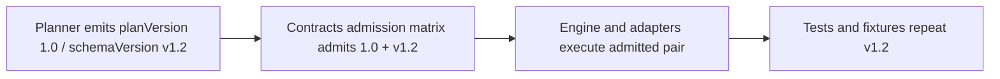
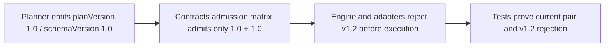

# ExecutionPlan Pre-Alpha Schema Version Hard-Cut Plan

## Decision

DVT is pre-alpha and does not carry public multi-version compatibility for
`ExecutionPlan` payloads. The active executable pair remains single-line:

```text
planVersion = 1.0
schemaVersion = 1.0
contractVersion = 1.0.0
```

`schemaVersion = v1.2` is removed from active contracts, admission, tests, and
normative examples. It is not retained as a legacy alias. Runtime admission must
reject `v1.2` after this cut.

## Rationale

The previous `schemaVersion = v1.2` value implied a mature schema evolution
history that the product does not have. It also made the active plan record look
like two competing versions to users and maintainers:

```text
metadata.planVersion = 1.0
metadata.schemaVersion = v1.2
```

That is unnecessary overhead before an external compatibility promise exists.
The repo should keep the field only as a future compatibility hook while the
value stays aligned to the pre-alpha line.

## Current State



## Target State



## Command And Query Rail

- Rail: `ValidateExecutionPlanAdmission`
- Type: query
- Owning bounded context: Contracts / Engine runtime admission
- DDD object: `ExecutionPlanAdmissionPair`
- Application port: shared contracts admission facade consumed by engine,
  plan-verifier, API, and adapter tests.
- Adapter surface: `@dvt/contracts`, `@dvt/plan-verifier`, engine start-run
  admission, persisted plan-store fixtures.
- Authorization: not user-scoped; fail-closed runtime contract validation.
- Negative tests: `schemaVersion = v1.2` with `planVersion = 1.0` rejects.

## Scope

In scope:

- hard-cut active `ExecutionPlan` schema version constant from `v1.2` to `1.0`;
- update admission matrix tests and negative cases;
- update active fixtures and active normative docs;
- add ARC-2 evidence and risk register entries because shared contracts change.

Out of scope:

- removing the `schemaVersion` field entirely;
- supporting `v1.2` as a legacy alias;
- changing unrelated workspace graph draft or run-execution-context schema
  versions.

DB-first follow-up:

- This cut only normalizes the active executable pair. It does not make local
  plan construction authoritative.
- A follow-up slice should introduce or tighten the persisted
  `CreateExecutionPlan` / `GetExecutionPlan` command-query rail so the database
  or plan store is the operational authority for created plans, while the
  contracts package remains the compile-time shared-kernel shape.

## Feature Mechanization

```feature-mechanization
version: 1
featureId: RUNTIME-EXECUTION-PLAN-PREALPHA-SCHEMA-HARDCUT-20260601
mechanizationStatus: closed
noHumanDecisionsRemaining: true
implementationPlan: docs/planning/proposals/mandatory/runtime-and-contracts/execution-plan-prealpha-schema-version-hardcut-plan-20260601.md
componentGuides:
  - docs/architecture/components/engine/contracts/plan-admission-matrix.md
  - docs/architecture/components/engine/contracts/plan-verifier-admission.md
userStories:
  - docs/architecture/components/engine/contracts/plan-admission-user-stories.md
  - docs/architecture/components/engine/contracts/plan-verifier-admission-user-stories.md
governingSources:
  - AGENTS.md
  - docs/planning/status/governance-document-rule-inventory.md
  - docs/architecture/command-query-rail-governance.md
  - docs/architecture/fowler-opportunity-planning-governance.md
  - docs/adr/ADR-0017_ExecutionPlan_Schema_Versioning.md
  - docs/adr/ADR-0036-execution-plan-planversion-registry-and-runtime-matrix.md
  - docs/architecture/components/engine/contracts/plan-admission-matrix.md
allowedImplementationSurfaces:
  - .golden/hashes.json
  - apps/web/package.json
  - docs/.manifest.json
  - docs/adr/ADR-0017_ExecutionPlan_Schema_Versioning.md
  - docs/adr/ADR-0036-execution-plan-planversion-registry-and-runtime-matrix.md
  - docs/adr/index.md
  - docs/architecture/components/engine/contracts/plan-admission-matrix.md
  - docs/architecture/components/engine/contracts/plan-admission-user-stories.md
  - docs/architecture/components/engine/contracts/engine/events/RunStarted.schema.json
  - docs/architecture/components/engine/contracts/plan-schema-version-admission-component.md
  - docs/architecture/components/engine/contracts/plan-schema-version-admission-user-stories.md
  - docs/architecture/components/engine/contracts/plan-verifier-admission.md
  - docs/architecture/components/engine/contracts/plan-verifier-admission-user-stories.md
  - docs/architecture/index.md
  - docs/evidence/**
  - docs/planning/execution-model/dvt-execution-model.md
  - docs/planning/index.md
  - docs/planning/proposals/index.md
  - docs/planning/proposals/mandatory/runtime-and-contracts/execution-plan-prealpha-schema-version-hardcut-plan-20260601.md
  - docs/risk-register/quality/**
  - contracts/compat/plan-compat.json
  - contracts/compat/plan-compat.schema.json
  - packages/@dvt/contracts/src/contracts/planner/ExecutionPlan.v1.ts
  - packages/@dvt/contracts/src/contracts/planner/PlanRecord.v1.schema.json
  - packages/@dvt/contracts/src/schema-packs/**
  - packages/@dvt/contracts/test/**
  - packages/@dvt/plan-verifier/test/**
  - packages/@dvt/engine/test/**
  - packages/@dvt/adapter-temporal/src/versioning.ts
  - packages/@dvt/adapter-postgres/src/PostgresPlanStore.ts
  - packages/@dvt/adapter-postgres/test/PostgresPlanStore*
  - apps/api/test/**
  - apps/web/src/app/services/plans/**
  - apps/web/src/app/testing/contractTestUtils.ts
  - apps/web/src/app/views/canvas/useCanvasExecutionActions.dbt.test.tsx
  - apps/web/cypress/e2e/canvas/**
  - packages/test/matrix-alignment.test.ts
forbiddenImplementationSurfaces:
  - apps/api/src/**
  - packages/@dvt/engine/src/**
  - packages/@dvt/planner/src/**
  - tools/**
commandQueryRails:
  - name: ValidateExecutionPlanAdmission
    type: query
    dddOwner: ExecutionPlanAdmissionPair
domainObjects:
  - name: ExecutionPlanAdmissionPair
    type: shared-kernel contract object
    owner: Contracts / Engine runtime admission
fowlerSignals:
  - Primitive obsession
  - Divergent change
  - Speculative generality
architectureGuards:
  - pnpm --filter @dvt/contracts test -- plan-admission-matrix.contract.test.ts plan-version.contract.test.ts planner.contract.test.ts
  - pnpm --filter @dvt/plan-verifier test -- planVersionAdmission.test.ts
  - pnpm golden:validate
  - node scripts/compare-hashes.cjs
  - pnpm --filter @dvt/engine test
  - pnpm test:adapter-postgres
  - pnpm --filter @dvt/web run lint
cypressFlows:
  - N/A - contract hard-cut only; Cypress fixtures are updated when they embed execution-plan refs.
redGreenCycles:
  - id: reject-v1-2-schema
    redTest: pnpm --filter @dvt/plan-verifier test -- planVersionAdmission.test.ts
    expectedFailure: The current admission test still accepts schemaVersion v1.2.
    patchSurfaces:
      - packages/@dvt/contracts/src/contracts/planner/ExecutionPlan.v1.ts
      - packages/@dvt/contracts/src/contracts/planner/PlanRecord.v1.schema.json
      - packages/@dvt/plan-verifier/test/planVersionAdmission.test.ts
    greenTest: pnpm --filter @dvt/plan-verifier test -- planVersionAdmission.test.ts
symbols:
  - { name: CURRENT_EXECUTION_PLAN_SCHEMA_VERSION, path: packages/@dvt/contracts/src/contracts/planner/ExecutionPlan.v1.ts, dddOwner: ExecutionPlanAdmissionPair, cqRails: [ValidateExecutionPlanAdmission], fowlerSignals: [Speculative generality], architectureGuard: pnpm --filter @dvt/contracts test -- plan-admission-matrix.contract.test.ts, cypressCoverage: N/A - contract hard-cut, unitTests: [pnpm --filter @dvt/contracts test -- planner.contract.test.ts] }
completionGate:
  - pnpm --filter @dvt/contracts test -- plan-admission-matrix.contract.test.ts plan-version.contract.test.ts planner.contract.test.ts
  - pnpm --filter @dvt/plan-verifier test -- planVersionAdmission.test.ts
  - pnpm --filter @dvt/adapter-postgres test -- PostgresPlanStore.records-core.integration.test.ts PostgresPlanStore.records-guards.integration.test.ts
  - pnpm docs:sync
  - pnpm docs:gov:manifest:check
  - pnpm docs:arc:evidence:check -- --changed-only
  - pnpm verify:prepush
```
