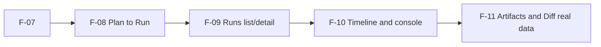

# F-07 Frontend Runtime Contract Baseline Plan 2026-04-04

## Objective

Deliver `F-07` in strict order:

1. docs-first baseline (as-is and to-be)
2. TDD-first implementation
3. route-level consumer alignment without changing shell ownership

## Original Runtime Drift

This was the drift that motivated `F-07` before the current implementation:

- frontend started runs via `POST /runs`
- frontend read status via `GET /runs/:runId/status`
- protected runtime route truth defined:
  - `POST /runs/start`
  - `GET /runs`
  - `GET /runs/:runId`
  - `GET /runs/:runId/events`

## To-Be Runtime Baseline

- `startRun` uses `POST /runs/start`
- run snapshot authority is `GET /runs/:runId`
- timeline authority is `GET /runs/:runId/events`
- route composition is owned by `RunWorkspaceFacade`, not by view-local service
  factories
- explicit read-model split is mandatory:
  `RunSummaryItem`, `RunSnapshot`, `RunEventTimelinePage`, and
  `RunWorkspaceViewModel`
- frontend runtime contract docs are canonical references for Lane E runtime
  slices
- snapshot-only payloads are not presented as full run aggregates with fake
  step or event detail

## Invariants

1. protected runtime route map is source of truth for frontend runtime routes
2. no route-level view owns runtime route strings
3. no new backend routes are introduced in this slice
4. shell topology and route ownership remain unchanged
5. mock versus api handling remains behind governed service boundaries
6. no frontend compatibility `Run` aggregate is allowed in active Runs route
   consumers

## Dependencies And Handoff

## Work Breakdown

### F-07-A Documentation baseline

- publish technical manual and user manual
- document as-is drift and to-be route baseline

### F-07-B Red-phase tests

- failing tests for `startRun`, `getRun`, `listRunEvents`, and legacy-status
  route rejection
- service-level error expectations for `401/403/404/409/422/5xx`

### F-07-C Green implementation

- align service routes and runtime parsing behavior
- update consumers that still assume legacy status endpoint behavior

### F-07-D Refactor and boundary cleanup

- remove mapping duplication where possible
- keep mode and adapter boundaries intact

### F-07-E Verification and governance sync

- docs gates and web type/service tests
- full `verify:prepush` baseline

## Definition Of Done

1. docs describe the same as-is and to-be baseline with no contradiction
2. `runsService.startRun` targets `/runs/start`
3. frontend does not depend on `/runs/:runId/status`
4. tests prove route and error behavior before and after implementation
5. lane metadata and roadmap references are aligned
6. required governance checks pass

## Validation Plan

- `pnpm docs:sync`
- `pnpm docs:workboard:generate`
- `pnpm docs:workboard:check`
- `pnpm docs:sync:check`
- `pnpm --dir apps/web exec vitest run src/app/services/runs/runsService.test.ts`
- `pnpm --filter @dvt/web typecheck`
- `pnpm verify:prepush`

## Rationale

This sequence reduces rework risk in `F-08` through `F-11` by fixing runtime
contract truth before adding more route wiring and UX behavior on top of
drifting endpoints.

## Related Sources

- [Frontend Fowler Implementation Pattern](../../../../architecture/frontend/frontend-fowler-implementation-pattern.md)
- [Frontend Runtime Contract Technical Manual](../../../../architecture/frontend/runs/frontend-runtime-contract-technical-manual.md)
- [Frontend Runtime Contract User Manual](../../../../architecture/frontend/runs/frontend-runtime-contract-user-manual.md)
- [Frontend Roadmap - Prototype To Operational UI](../../nice-to-have/frontend-and-ux/frontend-roadmap-20260219.md)
- [Lane E](../../../state/agent-lane-e.yaml)
