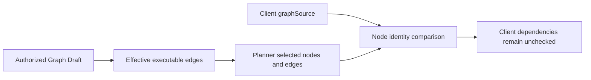
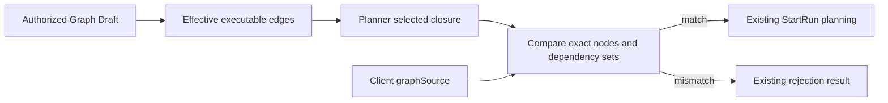

# GH-2524 protected executable graph topology

## Governing sources

- `docs/planning/status/governance-document-rule-inventory.md`
- Planning DB architecture-designs and the existing StartRun command rail
- `docs/architecture/command-query-rail-governance.md`
- `docs/architecture/system/subsystems/semantic-transformation/index.md`
- `docs/adr/ADR-0064-substrait-semantic-reference-and-bounded-logical-profile.md`
- GitHub #2524 and implementation PR #2984

## Current state and decision

The protected resolver reads the authorized Workspace Graph Draft, filters edges
through the existing effective-execution policy, and asks Planner for the exact
selected closure. Its client graph check currently compares only node IDs. A
client can retain those IDs while removing or adding scheduling dependencies.



Keep the protected draft and Planner closure authoritative. Compare every client
node's dependency set with the dependencies represented by the selected protected
edges. Reject mismatches through the existing resolver rejection result before
StartRun builds a plan. A small pure comparison keeps this rule independent of
HTTP and persistence; it introduces no new command or lowering pipeline.



## Existing command rail

| Concern          | Authority                                                                                          |
| ---------------- | -------------------------------------------------------------------------------------------------- |
| Command          | StartRun                                                                                           |
| Bounded context  | Run command application service                                                                    |
| DDD object       | Authorized executable subgraph derived from Workspace Graph Draft                                  |
| Application port | PlannerBackedStartRunUseCase                                                                       |
| Adapter surface  | Existing protected StartRun HTTP command                                                           |
| Scope            | Authorized tenant, project and environment; persisted draft reread                                 |
| Negative tests   | Missing, extra or reversed dependencies; closed/reference edge reintroduction; mismatched node IDs |

PreviewExecutionPlan is retired as an execution transport (#2762). This cut does
not reintroduce it. The broader workload lowering and target projection work in
Issue #2524 remains open; this guard does not manufacture Source or operator workloads.

## Validation design

Use the real PlannerFacade for closure derivation and the existing draft-store
port fixture for a protected persisted draft. First reproduce acceptance of
client topology drift, then apply the comparator. Assert both rejection and
exact-match acceptance, including effective edge gates. Retain existing scope,
missing-draft and corrupt-payload tests. Run API tests, lint and source/test type
checks, code-state generation, governance refresh and normal pre-push.

## Mechanization evidence

The following evidence is exported from the existing RecordFeatureMechanizationRail
command in Planning DB. GitHub #2524 owns task status and acceptance.

```feature-mechanization
{
  "symbols": [
    {
      "name": "ResolveAuthorizedExecutableSubgraphService",
      "path": "apps/api/src/application/services/resolveAuthorizedExecutableSubgraph.ts",
      "cqRails": [
        "StartRun"
      ],
      "dddOwner": "Run command application service",
      "unitTests": [
        "pnpm --filter dvt-api exec vitest run --config vitest.config.ts test/application/services/resolveAuthorizedExecutableSubgraph.topology.test.ts test/application/services/resolveAuthorizedExecutableSubgraph.test.ts"
      ],
      "fowlerSignals": [
        "Separate pure topology comparison from protected command orchestration"
      ],
      "cypressCoverage": "N/A: backend rejection boundary verified with real Planner and protected draft-store port; no browser surface changes",
      "architectureGuard": "pnpm docs:feature-mechanization:implementation -- --feature GH-2524-PROTECTED-GRAPH-TOPOLOGY"
    },
    {
      "name": "ExecutableGraphSourceTopologyMismatch",
      "path": "apps/api/src/application/services/validateExecutableGraphSourceTopology.ts",
      "cqRails": [
        "StartRun"
      ],
      "dddOwner": "Run command application service",
      "unitTests": [
        "pnpm --filter dvt-api exec vitest run --config vitest.config.ts test/application/services/resolveAuthorizedExecutableSubgraph.topology.test.ts test/application/services/resolveAuthorizedExecutableSubgraph.test.ts"
      ],
      "fowlerSignals": [
        "Separate pure topology comparison from protected command orchestration"
      ],
      "cypressCoverage": "N/A: backend rejection boundary verified with real Planner and protected draft-store port; no browser surface changes",
      "architectureGuard": "pnpm docs:feature-mechanization:implementation -- --feature GH-2524-PROTECTED-GRAPH-TOPOLOGY"
    },
    {
      "name": "findExecutableGraphSourceTopologyMismatch",
      "path": "apps/api/src/application/services/validateExecutableGraphSourceTopology.ts",
      "cqRails": [
        "StartRun"
      ],
      "dddOwner": "Run command application service",
      "unitTests": [
        "pnpm --filter dvt-api exec vitest run --config vitest.config.ts test/application/services/resolveAuthorizedExecutableSubgraph.topology.test.ts test/application/services/resolveAuthorizedExecutableSubgraph.test.ts"
      ],
      "fowlerSignals": [
        "Separate pure topology comparison from protected command orchestration"
      ],
      "cypressCoverage": "N/A: backend rejection boundary verified with real Planner and protected draft-store port; no browser surface changes",
      "architectureGuard": "pnpm docs:feature-mechanization:implementation -- --feature GH-2524-PROTECTED-GRAPH-TOPOLOGY"
    },
    {
      "name": "buildExpectedDependencies",
      "path": "apps/api/src/application/services/validateExecutableGraphSourceTopology.ts",
      "cqRails": [
        "StartRun"
      ],
      "dddOwner": "Run command application service",
      "unitTests": [
        "pnpm --filter dvt-api exec vitest run --config vitest.config.ts test/application/services/resolveAuthorizedExecutableSubgraph.topology.test.ts test/application/services/resolveAuthorizedExecutableSubgraph.test.ts"
      ],
      "fowlerSignals": [
        "Separate pure topology comparison from protected command orchestration"
      ],
      "cypressCoverage": "N/A: backend rejection boundary verified with real Planner and protected draft-store port; no browser surface changes",
      "architectureGuard": "pnpm docs:feature-mechanization:implementation -- --feature GH-2524-PROTECTED-GRAPH-TOPOLOGY"
    },
    {
      "name": "sameStringArray",
      "path": "apps/api/src/application/services/validateExecutableGraphSourceTopology.ts",
      "cqRails": [
        "StartRun"
      ],
      "dddOwner": "Run command application service",
      "unitTests": [
        "pnpm --filter dvt-api exec vitest run --config vitest.config.ts test/application/services/resolveAuthorizedExecutableSubgraph.topology.test.ts test/application/services/resolveAuthorizedExecutableSubgraph.test.ts"
      ],
      "fowlerSignals": [
        "Separate pure topology comparison from protected command orchestration"
      ],
      "cypressCoverage": "N/A: backend rejection boundary verified with real Planner and protected draft-store port; no browser surface changes",
      "architectureGuard": "pnpm docs:feature-mechanization:implementation -- --feature GH-2524-PROTECTED-GRAPH-TOPOLOGY"
    },
    {
      "name": "compareStrings",
      "path": "apps/api/src/application/services/validateExecutableGraphSourceTopology.ts",
      "cqRails": [
        "StartRun"
      ],
      "dddOwner": "Run command application service",
      "unitTests": [
        "pnpm --filter dvt-api exec vitest run --config vitest.config.ts test/application/services/resolveAuthorizedExecutableSubgraph.topology.test.ts test/application/services/resolveAuthorizedExecutableSubgraph.test.ts"
      ],
      "fowlerSignals": [
        "Separate pure topology comparison from protected command orchestration"
      ],
      "cypressCoverage": "N/A: backend rejection boundary verified with real Planner and protected draft-store port; no browser surface changes",
      "architectureGuard": "pnpm docs:feature-mechanization:implementation -- --feature GH-2524-PROTECTED-GRAPH-TOPOLOGY"
    }
  ],
  "version": 1,
  "featureId": "GH-2524-PROTECTED-GRAPH-TOPOLOGY",
  "userStories": [
    "https://github.com/dunay2/dvt/issues/2524"
  ],
  "cypressFlows": [
    "N/A: backend rejection boundary verified with real Planner and protected draft-store port; no browser surface changes"
  ],
  "domainObjects": [
    "Authorized executable subgraph derived from Workspace Graph Draft"
  ],
  "fowlerSignals": [
    "Separate pure topology comparison from protected command orchestration"
  ],
  "completionGate": [
    "pnpm --filter dvt-api test:unit",
    "pnpm --filter dvt-api lint",
    "pnpm verify:prepush"
  ],
  "redGreenCycles": [
    {
      "id": "startrun-record",
      "redTest": "pnpm --filter dvt-api exec vitest run --config vitest.config.ts test/application/services/resolveAuthorizedExecutableSubgraph.topology.test.ts test/application/services/resolveAuthorizedExecutableSubgraph.test.ts",
      "greenTest": "pnpm --filter dvt-api exec vitest run --config vitest.config.ts test/application/services/resolveAuthorizedExecutableSubgraph.topology.test.ts test/application/services/resolveAuthorizedExecutableSubgraph.test.ts",
      "patchSurfaces": [
        "apps/api/src/application/services/resolveAuthorizedExecutableSubgraph.ts",
        "apps/api/src/application/services/validateExecutableGraphSourceTopology.ts",
        "apps/api/test/application/services/resolveAuthorizedExecutableSubgraph.topology.test.ts",
        "docs/planning/proposals/mandatory/runtime-and-contracts/gh-2524-protected-graph-topology-plan-20260906.md"
      ],
      "expectedFailure": "Six topology witnesses accept client dependency drift before the comparator is installed"
    }
  ],
  "componentGuides": [
    "docs/architecture/system/subsystems/semantic-transformation/index.md"
  ],
  "governingSources": [
    "AGENTS.md",
    "docs/architecture/command-query-rail-governance.md",
    "docs/adr/ADR-0064-substrait-semantic-reference-and-bounded-logical-profile.md",
    "docs/architecture/fowler-opportunity-planning-governance.md"
  ],
  "commandQueryRails": [
    {
      "name": "StartRun",
      "type": "command",
      "status": "implemented",
      "dddOwner": "Run command application service",
      "negativeTests": [
        "Missing, extra or reversed dependencies reject",
        "Closed, future-state and reference-only edges cannot be reintroduced by the client",
        "Mismatched selected node IDs reject"
      ],
      "adapterSurface": "Existing protected StartRun HTTP command",
      "applicationPort": "PlannerBackedStartRunUseCase",
      "authorizationScope": "Authorized tenant, project and environment run-start scope with persisted draft reread"
    }
  ],
  "architectureGuards": [
    "pnpm docs:feature-mechanization:implementation -- --feature GH-2524-PROTECTED-GRAPH-TOPOLOGY"
  ],
  "implementationPlan": "docs/planning/proposals/mandatory/runtime-and-contracts/gh-2524-protected-graph-topology-plan-20260906.md",
  "mechanizationStatus": "implemented",
  "noHumanDecisionsRemaining": true,
  "allowedImplementationSurfaces": [
    "apps/api/src/application/services/resolveAuthorizedExecutableSubgraph.ts",
    "apps/api/src/application/services/validateExecutableGraphSourceTopology.ts",
    "apps/api/test/application/services/resolveAuthorizedExecutableSubgraph.topology.test.ts",
    "docs/planning/proposals/mandatory/runtime-and-contracts/gh-2524-protected-graph-topology-plan-20260906.md"
  ],
  "forbiddenImplementationSurfaces": [
    "packages/@dvt/contracts/**",
    "packages/@dvt/planner/**",
    "apps/web/src/**"
  ]
}
```
