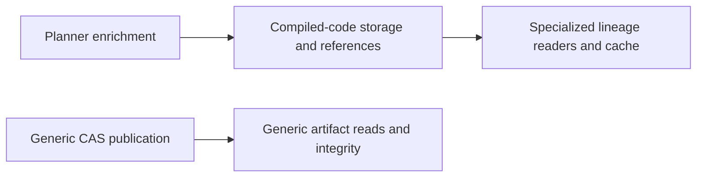
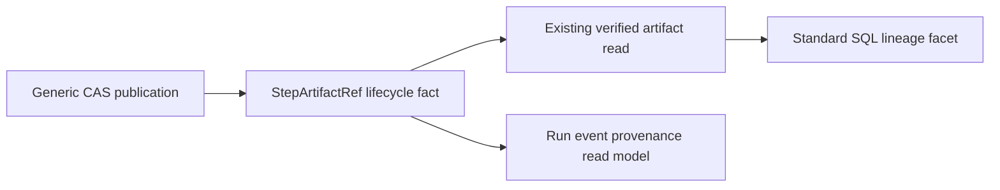

# GH-2667 and GH-2669 canonical artifact authority hard cut

## Governing sources

- `AGENTS.md` and the governance-document-rule-inventory
- Planning DB architecture-designs and command-query-rails consultation
- `docs/architecture/command-query-rail-governance.md`
- `docs/architecture/fowler-opportunity-planning-governance.md`
- `docs/adr/ADR-0067-canonical-artifact-authority-and-compiled-code-hard-cut.md`
- `docs/architecture/components/lineage-worker/artifact-lineage-extraction-component.md`
- `docs/architecture/components/web/frontend-component-inventory.md`
- Issues #2661, #2667 and #2669; PR #2967

## Current state and decision

The retired compiled-code family duplicated generic artifact publication,
reference, reading and integrity semantics. Its Planner enrichment, five storage
adapters, event fallback and lineage reader/cache/resolver kept that duplicate
authority alive. The accepted RETIRE decision requires their atomic deletion.



Use the existing generic CAS and StepArtifactRef runtime model. Planner creates
plans; Temporal emits lifecycle facts; Traceability derives SQL facets after a
verified generic artifact read. Read inputs reuse the existing integrity input
fields plus a storage URI; they do not create another artifact identity model.



## Command and query ownership

The component catalog records the existing operations whose rails were absent
from Planning DB: PublishContentAddressedArtifact, ReadVerifiedArtifactBytes and
MapStepStartedLineage. These names catalog existing ports/functions; they do not
introduce new services or parallel operations. StartRun and GetRunEvents reuse
already catalogued rails. Scope, authorization and negative cases are recorded
in the component catalog and exported mechanization below.

## Integration corrections

- Resolve the ExecutionBindingVerification modify/delete conflict by deleting
  the retired contract; the latest identity comment does not revive its model.
- Migrate both test consumers of the deleted computeSha256 export to Node crypto.
- Remove Planner's unused artifacts dependency together with its lockfile entry.
- Keep generic ArtifactStoreError integrity assertions and StepArtifactRef UI
  fixtures aligned with their surviving owners.
- Preserve the existing StartRun domain rejection: the API resolver translates
  canonical ArtifactStoreError integrity failures into RunExecutionContextRejectedError.
  The generic reader still owns verification; the API owns domain error translation.
- Update normative traceability headers and the current operations inventory.
  Historical Planner proposal clauses are explicitly superseded by ADR-0067.
- Keep the global retired-symbol guard's scope unchanged and report violations
  by file/symbol instead of printing every productive source file on failure.

## Operational boundary and validation

This is the breaking runtime/history boundary accepted in ADR-0067. Old histories
requiring the removed payload shape are outside the supported horizon. The ARC
risk record requires coordinated deployment and draining incompatible histories;
this implementation task does not perform that deployment.

Run affected package builds, tests and type checks, Web provenance presentation,
architecture dependencies, ADR traceability, determinism/golden/Temporal gates,
ARC-2 validation, code-state/docs/governance refresh and normal pre-push. CI
bootstrap uses a disposable database; working Planning DB is never rebuilt.
GitHub issues own acceptance and closeout. No compatibility stubs or bypasses
are introduced.

## Mechanization evidence

The following snapshot is exported from RecordFeatureMechanizationRail in the
working Planning DB. It records architecture evidence, not local task state.

```feature-mechanization
{
  "symbols": [
    {
      "name": "deriveExecutionProvenance",
      "path": "apps/web/src/app/views/runs/RunWorkspaceStateView.tsx",
      "cqRails": [
        "GetRunEvents"
      ],
      "dddOwner": "Run events read model",
      "unitTests": [
        "pnpm --filter @dvt/web exec vitest run --config vitest.presentation.config.ts src/app/views/runs/RunStates.timelineTrust.test.tsx"
      ],
      "fowlerSignals": [
        "Delete duplicate artifact publication, reference and read authority"
      ],
      "cypressCoverage": "N/A: artifact/runtime hard cut proved by real generic artifact reads, worker composition and Run workspace DOM presentation; no browser proof claimed",
      "architectureGuard": "pnpm docs:feature-mechanization:implementation -- --feature GH-2667-2669-CANONICAL-ARTIFACT-HARD-CUT"
    },
    {
      "name": "createStepStartedLineageMapper",
      "path": "apps/lineage-worker/src/lineageMapper.ts",
      "cqRails": [
        "MapStepStartedLineage"
      ],
      "dddOwner": "Traceability",
      "unitTests": [
        "pnpm --filter @dvt/traceability-service test",
        "pnpm --filter dvt-lineage-worker test"
      ],
      "fowlerSignals": [
        "Delete duplicate artifact publication, reference and read authority"
      ],
      "cypressCoverage": "N/A: artifact/runtime hard cut proved by real generic artifact reads, worker composition and Run workspace DOM presentation; no browser proof claimed",
      "architectureGuard": "pnpm docs:feature-mechanization:implementation -- --feature GH-2667-2669-CANONICAL-ARTIFACT-HARD-CUT"
    },
    {
      "name": "COMPILED_SQL_ARTIFACT_KIND",
      "path": "packages/@dvt/traceability-service/src/lineage/mapper/StepStartedLineageMapper.ts",
      "cqRails": [
        "MapStepStartedLineage"
      ],
      "dddOwner": "Traceability",
      "unitTests": [
        "pnpm --filter @dvt/traceability-service test",
        "pnpm --filter dvt-lineage-worker test"
      ],
      "fowlerSignals": [
        "Delete duplicate artifact publication, reference and read authority"
      ],
      "cypressCoverage": "N/A: artifact/runtime hard cut proved by real generic artifact reads, worker composition and Run workspace DOM presentation; no browser proof claimed",
      "architectureGuard": "pnpm docs:feature-mechanization:implementation -- --feature GH-2667-2669-CANONICAL-ARTIFACT-HARD-CUT"
    },
    {
      "name": "extractStepArtifactRef",
      "path": "packages/@dvt/traceability-service/src/lineage/mapper/StepStartedLineageMapper.ts",
      "cqRails": [
        "MapStepStartedLineage"
      ],
      "dddOwner": "Traceability",
      "unitTests": [
        "pnpm --filter @dvt/traceability-service test",
        "pnpm --filter dvt-lineage-worker test"
      ],
      "fowlerSignals": [
        "Delete duplicate artifact publication, reference and read authority"
      ],
      "cypressCoverage": "N/A: artifact/runtime hard cut proved by real generic artifact reads, worker composition and Run workspace DOM presentation; no browser proof claimed",
      "architectureGuard": "pnpm docs:feature-mechanization:implementation -- --feature GH-2667-2669-CANONICAL-ARTIFACT-HARD-CUT"
    },
    {
      "name": "mapArtifactReadWarning",
      "path": "packages/@dvt/traceability-service/src/lineage/mapper/mapArtifactReadWarning.ts",
      "cqRails": [
        "MapStepStartedLineage"
      ],
      "dddOwner": "Traceability",
      "unitTests": [
        "pnpm --filter @dvt/traceability-service test",
        "pnpm --filter dvt-lineage-worker test"
      ],
      "fowlerSignals": [
        "Delete duplicate artifact publication, reference and read authority"
      ],
      "cypressCoverage": "N/A: artifact/runtime hard cut proved by real generic artifact reads, worker composition and Run workspace DOM presentation; no browser proof claimed",
      "architectureGuard": "pnpm docs:feature-mechanization:implementation -- --feature GH-2667-2669-CANONICAL-ARTIFACT-HARD-CUT"
    },
    {
      "name": "sha256Hex",
      "path": "packages/@dvt/artifacts/src/contentAddressed/S3ContentAddressedArtifactStore.ts",
      "cqRails": [
        "PublishContentAddressedArtifact"
      ],
      "dddOwner": "Artifacts",
      "unitTests": [
        "pnpm --filter @dvt/artifacts test"
      ],
      "fowlerSignals": [
        "Delete duplicate artifact publication, reference and read authority"
      ],
      "cypressCoverage": "N/A: artifact/runtime hard cut proved by real generic artifact reads, worker composition and Run workspace DOM presentation; no browser proof claimed",
      "architectureGuard": "pnpm docs:feature-mechanization:implementation -- --feature GH-2667-2669-CANONICAL-ARTIFACT-HARD-CUT"
    },
    {
      "name": "readVerifiedArtifactBytes",
      "path": "packages/@dvt/artifacts/src/index.ts",
      "cqRails": [
        "ReadVerifiedArtifactBytes"
      ],
      "dddOwner": "Artifacts",
      "unitTests": [
        "pnpm --filter @dvt/artifacts test"
      ],
      "fowlerSignals": [
        "Delete duplicate artifact publication, reference and read authority"
      ],
      "cypressCoverage": "N/A: artifact/runtime hard cut proved by real generic artifact reads, worker composition and Run workspace DOM presentation; no browser proof claimed",
      "architectureGuard": "pnpm docs:feature-mechanization:implementation -- --feature GH-2667-2669-CANONICAL-ARTIFACT-HARD-CUT"
    },
    {
      "name": "readVerifiedArtifactBytes",
      "path": "packages/@dvt/artifacts/src/runtime/readVerifiedArtifactBytes.ts",
      "cqRails": [
        "ReadVerifiedArtifactBytes"
      ],
      "dddOwner": "Artifacts",
      "unitTests": [
        "pnpm --filter @dvt/artifacts test"
      ],
      "fowlerSignals": [
        "Delete duplicate artifact publication, reference and read authority"
      ],
      "cypressCoverage": "N/A: artifact/runtime hard cut proved by real generic artifact reads, worker composition and Run workspace DOM presentation; no browser proof claimed",
      "architectureGuard": "pnpm docs:feature-mechanization:implementation -- --feature GH-2667-2669-CANONICAL-ARTIFACT-HARD-CUT"
    },
    {
      "name": "CommonStepTypeConfigSchema",
      "path": "packages/@dvt/contracts/src/step-registry/DbtStepTypeConfig.ts",
      "cqRails": [
        "StartRun"
      ],
      "dddOwner": "Run command application service",
      "unitTests": [
        "pnpm --filter @dvt/contracts test",
        "pnpm --filter @dvt/adapter-temporal test",
        "pnpm --filter dvt-api test:unit"
      ],
      "fowlerSignals": [
        "Delete duplicate artifact publication, reference and read authority"
      ],
      "cypressCoverage": "N/A: artifact/runtime hard cut proved by real generic artifact reads, worker composition and Run workspace DOM presentation; no browser proof claimed",
      "architectureGuard": "pnpm docs:feature-mechanization:implementation -- --feature GH-2667-2669-CANONICAL-ARTIFACT-HARD-CUT"
    },
    {
      "name": "DbtStepTypeConfigSchema",
      "path": "packages/@dvt/contracts/src/step-registry/StepTypeRegistry.ts",
      "cqRails": [
        "StartRun"
      ],
      "dddOwner": "Run command application service",
      "unitTests": [
        "pnpm --filter @dvt/contracts test",
        "pnpm --filter @dvt/adapter-temporal test",
        "pnpm --filter dvt-api test:unit"
      ],
      "fowlerSignals": [
        "Delete duplicate artifact publication, reference and read authority"
      ],
      "cypressCoverage": "N/A: artifact/runtime hard cut proved by real generic artifact reads, worker composition and Run workspace DOM presentation; no browser proof claimed",
      "architectureGuard": "pnpm docs:feature-mechanization:implementation -- --feature GH-2667-2669-CANONICAL-ARTIFACT-HARD-CUT"
    },
    {
      "name": "StepArtifactRefSchema",
      "path": "packages/@dvt/contracts/src/step-registry/StepTypeRegistry.ts",
      "cqRails": [
        "StartRun"
      ],
      "dddOwner": "Run command application service",
      "unitTests": [
        "pnpm --filter @dvt/contracts test",
        "pnpm --filter @dvt/adapter-temporal test",
        "pnpm --filter dvt-api test:unit"
      ],
      "fowlerSignals": [
        "Delete duplicate artifact publication, reference and read authority"
      ],
      "cypressCoverage": "N/A: artifact/runtime hard cut proved by real generic artifact reads, worker composition and Run workspace DOM presentation; no browser proof claimed",
      "architectureGuard": "pnpm docs:feature-mechanization:implementation -- --feature GH-2667-2669-CANONICAL-ARTIFACT-HARD-CUT"
    },
    {
      "name": "ArtifactBackedRunExecutionContextResolver",
      "path": "apps/api/src/infrastructure/startRun/ArtifactBackedRunExecutionContextResolver.ts",
      "cqRails": [
        "StartRun"
      ],
      "dddOwner": "Run command application service",
      "unitTests": [
        "pnpm --filter @dvt/contracts test",
        "pnpm --filter @dvt/adapter-temporal test",
        "pnpm --filter dvt-api test:unit"
      ],
      "fowlerSignals": [
        "Delete duplicate artifact publication, reference and read authority"
      ],
      "cypressCoverage": "N/A: artifact/runtime hard cut proved by real generic artifact reads, worker composition and Run workspace DOM presentation; no browser proof claimed",
      "architectureGuard": "pnpm docs:feature-mechanization:implementation -- --feature GH-2667-2669-CANONICAL-ARTIFACT-HARD-CUT"
    }
  ],
  "version": 1,
  "featureId": "GH-2667-2669-CANONICAL-ARTIFACT-HARD-CUT",
  "userStories": [
    "https://github.com/dunay2/dvt/issues/2669"
  ],
  "cypressFlows": [
    "N/A: artifact/runtime hard cut proved by real generic artifact reads, worker composition and Run workspace DOM presentation; no browser proof claimed"
  ],
  "domainObjects": [
    "Generic immutable artifact and StepArtifactRef lifecycle fact",
    "Run-event provenance and SQL lineage read models"
  ],
  "fowlerSignals": [
    "Delete duplicate artifact publication, reference and read authority"
  ],
  "completionGate": [
    "pnpm arch:deps",
    "pnpm traceability:adr0",
    "pnpm verify:prepush"
  ],
  "redGreenCycles": [
    {
      "id": "getrunevents-record",
      "redTest": "pnpm --filter @dvt/artifacts test",
      "greenTest": "pnpm --filter @dvt/web exec vitest run --config vitest.presentation.config.ts src/app/views/runs/RunStates.timelineTrust.test.tsx",
      "patchSurfaces": [
        "apps/lineage-worker/src/compiled-code-resolver/S3UriCompiledCodeReader.ts",
        "apps/lineage-worker/src/compiled-code-resolver/errorMapping.ts",
        "apps/lineage-worker/src/compiled-code-resolver/policy.ts",
        "apps/lineage-worker/src/compiled-code-resolver/types.ts",
        "apps/lineage-worker/src/compiledCodeResolver.ts",
        "apps/lineage-worker/src/env.ts",
        "apps/lineage-worker/src/lineageMapper.ts",
        "apps/lineage-worker/src/server.ts",
        "apps/lineage-worker/test/compiledCodeResolver.test.ts",
        "apps/lineage-worker/test/server.bootstrap.test.ts",
        "apps/lineage-worker/test/server.lineage-mapper-wiring.test.ts",
        "apps/web/src/app/views/runs/RunStates.timelineTrust.test.tsx",
        "apps/web/src/app/views/runs/RunWorkspaceStateView.tsx",
        "docs/adr/ADR-0032-compiledcoderef-ownership.md",
        "docs/adr/ADR-0067-canonical-artifact-authority-and-compiled-code-hard-cut.md",
        "docs/architecture/components/lineage-worker/artifact-lineage-extraction-component.md",
        "docs/architecture/components/lineage-worker/artifact-lineage-extraction-user-stories.md",
        "docs/architecture/components/lineage-worker/compiled-code-ref-lineage-extraction-component.md",
        "docs/architecture/components/lineage-worker/compiled-code-ref-lineage-extraction-user-stories.md",
        "docs/architecture/components/lineage-worker/index.md",
        "docs/architecture/diagrams/architecture-problem-register.md",
        "docs/contracts/shared/CompiledCodeRef.v1.schema.json",
        "docs/contracts/traceability/facets/DvtDbtDetailsJobFacet.v1.schema.json",
        "docs/contracts/traceability/index.md",
        "docs/evidence/ED-20260905-artifact-authority-compiled-code-hard-cut.md",
        "docs/planning/status/system-operations-inventory-20260501.md",
        "docs/risk-register/quality/R-20260905-ARTIFACT-COMPILED-CODE-HARD-CUT.yaml",
        "packages/@dvt/adapter-temporal/src/activities/stepActivityValidation.ts",
        "packages/@dvt/adapter-temporal/src/engine-types.ts",
        "packages/@dvt/adapter-temporal/src/workflows/runPlanWorkflow.stepExecution.ts",
        "packages/@dvt/adapter-temporal/src/workflows/workflowArtifactHelpers.ts",
        "packages/@dvt/adapter-temporal/test/dbt-core-decoupling.architecture.test.ts",
        "packages/@dvt/adapter-temporal/test/workflow-compiled-code-ref.test.ts",
        "packages/@dvt/artifacts/src/compiledCode/adapters/FileSystemCompiledCodeStorage.ts",
        "packages/@dvt/artifacts/src/compiledCode/adapters/InMemoryCompiledCodeStorage.ts",
        "packages/@dvt/artifacts/src/compiledCode/adapters/MinioCompiledCodeStorage.ts",
        "packages/@dvt/artifacts/src/compiledCode/adapters/NoopCompiledCodeStorage.ts",
        "packages/@dvt/artifacts/src/compiledCode/adapters/S3CompiledCodeStorage.ts",
        "packages/@dvt/artifacts/src/compiledCode/attachCompiledCodeRefs.ts",
        "packages/@dvt/artifacts/src/compiledCode/sha256.ts",
        "packages/@dvt/artifacts/src/contentAddressed/S3ContentAddressedArtifactStore.ts",
        "packages/@dvt/artifacts/src/index.ts",
        "packages/@dvt/artifacts/src/ports/ICompiledCodeStorage.ts",
        "packages/@dvt/artifacts/src/runtime/ArtifactBackedDbtProjectBundleReader.ts",
        "packages/@dvt/artifacts/src/runtime/ArtifactBackedRunExecutionContextReader.ts",
        "packages/@dvt/artifacts/src/runtime/readVerifiedArtifactBytes.ts",
        "packages/@dvt/artifacts/src/runtime/validateArtifactIntegrity.ts",
        "packages/@dvt/artifacts/test/artifactSurface.test.ts",
        "packages/@dvt/artifacts/test/compiledCodeStorageRetirement.architecture.test.ts",
        "packages/@dvt/artifacts/test/contentAddressedArtifactStore.test.ts",
        "packages/@dvt/artifacts/test/runExecutionContextReaders.test.ts",
        "packages/@dvt/contracts/src/contracts/engine/RunStateVocabulary.v1.ts",
        "packages/@dvt/contracts/src/contracts/planner/ExecutionBindingVerification.v1.ts",
        "packages/@dvt/contracts/src/index.ts",
        "packages/@dvt/contracts/src/schema-packs/run-events.ts",
        "packages/@dvt/contracts/src/step-registry/CommonStepTypeConfig.ts",
        "packages/@dvt/contracts/src/step-registry/DbtStepTypeConfig.ts",
        "packages/@dvt/contracts/src/step-registry/StepTypeRegistry.ts",
        "packages/@dvt/contracts/src/types/artifacts.ts",
        "packages/@dvt/contracts/test/compiled-code-ref.contract.test.ts",
        "packages/@dvt/contracts/test/fixtures/run-event-compiled-code-ref.fixtures.ts",
        "packages/@dvt/contracts/test/fixtures/run-event-step-artifact-ref.fixtures.ts",
        "packages/@dvt/contracts/test/planner-private-ownership.architecture.test.ts",
        "packages/@dvt/contracts/test/step-artifact-ref.contract.test.ts",
        "packages/@dvt/contracts/test/step-registry.test.ts",
        "packages/@dvt/engine/src/ports/IRunStateStore.ts",
        "packages/@dvt/planner/docs/planning/Stage-1.1-Planner-Canonicalization.md",
        "packages/@dvt/planner/package.json",
        "packages/@dvt/planner/src/contracts/ExecutionBindingVerification.ts",
        "packages/@dvt/planner/src/index.ts",
        "packages/@dvt/planner/src/ports/ICompiledCodeStorage.ts",
        "packages/@dvt/planner/test/compiledCode/FileSystemCompiledCodeStorage.test.ts",
        "packages/@dvt/planner/test/compiledCode/InMemoryCompiledCodeStorage.test.ts",
        "packages/@dvt/planner/test/compiledCode/attachCompiledCodeRefs.test.ts",
        "packages/@dvt/planner/test/compiledCode/sha256.test.ts",
        "packages/@dvt/planner/test/unit/planner-private-ownership.architecture.test.ts",
        "packages/@dvt/temporal-http-json-plugin/test/HttpJsonArtifactPlugin.test.ts",
        "packages/@dvt/traceability-service/src/lineage/LineageOutboxObserver.ts",
        "packages/@dvt/traceability-service/src/lineage/LineageWorkerRuntime.ts",
        "packages/@dvt/traceability-service/src/lineage/cache/InMemoryCompiledCodeCache.ts",
        "packages/@dvt/traceability-service/src/lineage/compiledCodeRef.ts",
        "packages/@dvt/traceability-service/src/lineage/contracts.ts",
        "packages/@dvt/traceability-service/src/lineage/errorContract.ts",
        "packages/@dvt/traceability-service/src/lineage/errorPersistenceSupport.ts",
        "packages/@dvt/traceability-service/src/lineage/errorSupport.ts",
        "packages/@dvt/traceability-service/src/lineage/errors.ts",
        "packages/@dvt/traceability-service/src/lineage/index.ts",
        "packages/@dvt/traceability-service/src/lineage/logMessages.ts",
        "packages/@dvt/traceability-service/src/lineage/mapper/StepStartedLineageMapper.ts",
        "packages/@dvt/traceability-service/src/lineage/mapper/mapArtifactReadWarning.ts",
        "packages/@dvt/traceability-service/src/lineage/openlineageSchema.ts",
        "packages/@dvt/traceability-service/src/lineage/readers/CompositeCompiledCodeReader.ts",
        "packages/@dvt/traceability-service/src/lineage/readers/FileUriCompiledCodeReader.ts",
        "packages/@dvt/traceability-service/src/lineage/readers/InMemoryCompiledCodeReader.ts",
        "packages/@dvt/traceability-service/src/lineage/resolver/CachedRetryCompiledCodeResolver.ts",
        "packages/@dvt/traceability-service/src/lineage/runtime/LineageWorkerLoopController.ts",
        "packages/@dvt/traceability-service/src/lineage/runtime/lineageWorkerDeadLetterSupport.ts",
        "packages/@dvt/traceability-service/src/lineage/runtime/lineageWorkerRecordProcessor.ts",
        "packages/@dvt/traceability-service/src/lineage/runtime/lineageWorkerRuntimeConfig.ts",
        "packages/@dvt/traceability-service/src/lineage/runtime/lineageWorkerTick.ts",
        "packages/@dvt/traceability-service/src/lineage/types.ts",
        "packages/@dvt/traceability-service/src/lineage/warningContract.ts",
        "packages/@dvt/traceability-service/test/fixtures/lineage/mapper-fail-open.json",
        "packages/@dvt/traceability-service/test/fixtures/lineage/mapper-success.json",
        "packages/@dvt/traceability-service/test/lineage/CachedRetryCompiledCodeResolver.test.ts",
        "packages/@dvt/traceability-service/test/lineage/LineageOutboxObserver.test.ts",
        "packages/@dvt/traceability-service/test/lineage/StepStartedLineageMapper.golden.test.ts",
        "packages/@dvt/traceability-service/test/lineage/StepStartedLineageMapper.test.ts",
        "packages/@dvt/traceability-service/test/lineage/compiledCodeRef.test.ts",
        "packages/@dvt/traceability-service/test/lineage/errorSupport.test.ts",
        "packages/@dvt/traceability-service/test/lineage/facetSchema.validation.test.ts",
        "pnpm-lock.yaml",
        "tools/ci/planner-package-governance.test.mjs",
        "tools/ci/static-analysis-followup-branch-architecture.test.mjs",
        "docs/planning/proposals/mandatory/runtime-and-contracts/gh-2667-2669-canonical-artifact-hard-cut-plan-20260906.md",
        "apps/lineage-worker/test/bootstrap.test.ts",
        "apps/lineage-worker/test/env.test.ts",
        "packages/@dvt/traceability-service/src/lineage/mapper/mapCompiledCodeResolutionWarning.ts",
        "docs/adr/index.md",
        "docs/contracts/planner/index.md",
        "docs/evidence/index.md",
        "docs/risk-register/quality/index.md",
        "tools/ci/contracts-package-governance.test.mjs",
        "traceability.manifest.json",
        "apps/api/src/infrastructure/startRun/ArtifactBackedRunExecutionContextResolver.ts",
        "docs/.manifest.json"
      ],
      "expectedFailure": "Deleted computeSha256 import throws; active retired-symbol references and old integrity error assertions fail"
    },
    {
      "id": "mapstepstartedlineage-record",
      "redTest": "pnpm --filter @dvt/artifacts test",
      "greenTest": "pnpm --filter dvt-lineage-worker test",
      "patchSurfaces": [
        "apps/lineage-worker/src/compiled-code-resolver/S3UriCompiledCodeReader.ts",
        "apps/lineage-worker/src/compiled-code-resolver/errorMapping.ts",
        "apps/lineage-worker/src/compiled-code-resolver/policy.ts",
        "apps/lineage-worker/src/compiled-code-resolver/types.ts",
        "apps/lineage-worker/src/compiledCodeResolver.ts",
        "apps/lineage-worker/src/env.ts",
        "apps/lineage-worker/src/lineageMapper.ts",
        "apps/lineage-worker/src/server.ts",
        "apps/lineage-worker/test/compiledCodeResolver.test.ts",
        "apps/lineage-worker/test/server.bootstrap.test.ts",
        "apps/lineage-worker/test/server.lineage-mapper-wiring.test.ts",
        "apps/web/src/app/views/runs/RunStates.timelineTrust.test.tsx",
        "apps/web/src/app/views/runs/RunWorkspaceStateView.tsx",
        "docs/adr/ADR-0032-compiledcoderef-ownership.md",
        "docs/adr/ADR-0067-canonical-artifact-authority-and-compiled-code-hard-cut.md",
        "docs/architecture/components/lineage-worker/artifact-lineage-extraction-component.md",
        "docs/architecture/components/lineage-worker/artifact-lineage-extraction-user-stories.md",
        "docs/architecture/components/lineage-worker/compiled-code-ref-lineage-extraction-component.md",
        "docs/architecture/components/lineage-worker/compiled-code-ref-lineage-extraction-user-stories.md",
        "docs/architecture/components/lineage-worker/index.md",
        "docs/architecture/diagrams/architecture-problem-register.md",
        "docs/contracts/shared/CompiledCodeRef.v1.schema.json",
        "docs/contracts/traceability/facets/DvtDbtDetailsJobFacet.v1.schema.json",
        "docs/contracts/traceability/index.md",
        "docs/evidence/ED-20260905-artifact-authority-compiled-code-hard-cut.md",
        "docs/planning/status/system-operations-inventory-20260501.md",
        "docs/risk-register/quality/R-20260905-ARTIFACT-COMPILED-CODE-HARD-CUT.yaml",
        "packages/@dvt/adapter-temporal/src/activities/stepActivityValidation.ts",
        "packages/@dvt/adapter-temporal/src/engine-types.ts",
        "packages/@dvt/adapter-temporal/src/workflows/runPlanWorkflow.stepExecution.ts",
        "packages/@dvt/adapter-temporal/src/workflows/workflowArtifactHelpers.ts",
        "packages/@dvt/adapter-temporal/test/dbt-core-decoupling.architecture.test.ts",
        "packages/@dvt/adapter-temporal/test/workflow-compiled-code-ref.test.ts",
        "packages/@dvt/artifacts/src/compiledCode/adapters/FileSystemCompiledCodeStorage.ts",
        "packages/@dvt/artifacts/src/compiledCode/adapters/InMemoryCompiledCodeStorage.ts",
        "packages/@dvt/artifacts/src/compiledCode/adapters/MinioCompiledCodeStorage.ts",
        "packages/@dvt/artifacts/src/compiledCode/adapters/NoopCompiledCodeStorage.ts",
        "packages/@dvt/artifacts/src/compiledCode/adapters/S3CompiledCodeStorage.ts",
        "packages/@dvt/artifacts/src/compiledCode/attachCompiledCodeRefs.ts",
        "packages/@dvt/artifacts/src/compiledCode/sha256.ts",
        "packages/@dvt/artifacts/src/contentAddressed/S3ContentAddressedArtifactStore.ts",
        "packages/@dvt/artifacts/src/index.ts",
        "packages/@dvt/artifacts/src/ports/ICompiledCodeStorage.ts",
        "packages/@dvt/artifacts/src/runtime/ArtifactBackedDbtProjectBundleReader.ts",
        "packages/@dvt/artifacts/src/runtime/ArtifactBackedRunExecutionContextReader.ts",
        "packages/@dvt/artifacts/src/runtime/readVerifiedArtifactBytes.ts",
        "packages/@dvt/artifacts/src/runtime/validateArtifactIntegrity.ts",
        "packages/@dvt/artifacts/test/artifactSurface.test.ts",
        "packages/@dvt/artifacts/test/compiledCodeStorageRetirement.architecture.test.ts",
        "packages/@dvt/artifacts/test/contentAddressedArtifactStore.test.ts",
        "packages/@dvt/artifacts/test/runExecutionContextReaders.test.ts",
        "packages/@dvt/contracts/src/contracts/engine/RunStateVocabulary.v1.ts",
        "packages/@dvt/contracts/src/contracts/planner/ExecutionBindingVerification.v1.ts",
        "packages/@dvt/contracts/src/index.ts",
        "packages/@dvt/contracts/src/schema-packs/run-events.ts",
        "packages/@dvt/contracts/src/step-registry/CommonStepTypeConfig.ts",
        "packages/@dvt/contracts/src/step-registry/DbtStepTypeConfig.ts",
        "packages/@dvt/contracts/src/step-registry/StepTypeRegistry.ts",
        "packages/@dvt/contracts/src/types/artifacts.ts",
        "packages/@dvt/contracts/test/compiled-code-ref.contract.test.ts",
        "packages/@dvt/contracts/test/fixtures/run-event-compiled-code-ref.fixtures.ts",
        "packages/@dvt/contracts/test/fixtures/run-event-step-artifact-ref.fixtures.ts",
        "packages/@dvt/contracts/test/planner-private-ownership.architecture.test.ts",
        "packages/@dvt/contracts/test/step-artifact-ref.contract.test.ts",
        "packages/@dvt/contracts/test/step-registry.test.ts",
        "packages/@dvt/engine/src/ports/IRunStateStore.ts",
        "packages/@dvt/planner/docs/planning/Stage-1.1-Planner-Canonicalization.md",
        "packages/@dvt/planner/package.json",
        "packages/@dvt/planner/src/contracts/ExecutionBindingVerification.ts",
        "packages/@dvt/planner/src/index.ts",
        "packages/@dvt/planner/src/ports/ICompiledCodeStorage.ts",
        "packages/@dvt/planner/test/compiledCode/FileSystemCompiledCodeStorage.test.ts",
        "packages/@dvt/planner/test/compiledCode/InMemoryCompiledCodeStorage.test.ts",
        "packages/@dvt/planner/test/compiledCode/attachCompiledCodeRefs.test.ts",
        "packages/@dvt/planner/test/compiledCode/sha256.test.ts",
        "packages/@dvt/planner/test/unit/planner-private-ownership.architecture.test.ts",
        "packages/@dvt/temporal-http-json-plugin/test/HttpJsonArtifactPlugin.test.ts",
        "packages/@dvt/traceability-service/src/lineage/LineageOutboxObserver.ts",
        "packages/@dvt/traceability-service/src/lineage/LineageWorkerRuntime.ts",
        "packages/@dvt/traceability-service/src/lineage/cache/InMemoryCompiledCodeCache.ts",
        "packages/@dvt/traceability-service/src/lineage/compiledCodeRef.ts",
        "packages/@dvt/traceability-service/src/lineage/contracts.ts",
        "packages/@dvt/traceability-service/src/lineage/errorContract.ts",
        "packages/@dvt/traceability-service/src/lineage/errorPersistenceSupport.ts",
        "packages/@dvt/traceability-service/src/lineage/errorSupport.ts",
        "packages/@dvt/traceability-service/src/lineage/errors.ts",
        "packages/@dvt/traceability-service/src/lineage/index.ts",
        "packages/@dvt/traceability-service/src/lineage/logMessages.ts",
        "packages/@dvt/traceability-service/src/lineage/mapper/StepStartedLineageMapper.ts",
        "packages/@dvt/traceability-service/src/lineage/mapper/mapArtifactReadWarning.ts",
        "packages/@dvt/traceability-service/src/lineage/openlineageSchema.ts",
        "packages/@dvt/traceability-service/src/lineage/readers/CompositeCompiledCodeReader.ts",
        "packages/@dvt/traceability-service/src/lineage/readers/FileUriCompiledCodeReader.ts",
        "packages/@dvt/traceability-service/src/lineage/readers/InMemoryCompiledCodeReader.ts",
        "packages/@dvt/traceability-service/src/lineage/resolver/CachedRetryCompiledCodeResolver.ts",
        "packages/@dvt/traceability-service/src/lineage/runtime/LineageWorkerLoopController.ts",
        "packages/@dvt/traceability-service/src/lineage/runtime/lineageWorkerDeadLetterSupport.ts",
        "packages/@dvt/traceability-service/src/lineage/runtime/lineageWorkerRecordProcessor.ts",
        "packages/@dvt/traceability-service/src/lineage/runtime/lineageWorkerRuntimeConfig.ts",
        "packages/@dvt/traceability-service/src/lineage/runtime/lineageWorkerTick.ts",
        "packages/@dvt/traceability-service/src/lineage/types.ts",
        "packages/@dvt/traceability-service/src/lineage/warningContract.ts",
        "packages/@dvt/traceability-service/test/fixtures/lineage/mapper-fail-open.json",
        "packages/@dvt/traceability-service/test/fixtures/lineage/mapper-success.json",
        "packages/@dvt/traceability-service/test/lineage/CachedRetryCompiledCodeResolver.test.ts",
        "packages/@dvt/traceability-service/test/lineage/LineageOutboxObserver.test.ts",
        "packages/@dvt/traceability-service/test/lineage/StepStartedLineageMapper.golden.test.ts",
        "packages/@dvt/traceability-service/test/lineage/StepStartedLineageMapper.test.ts",
        "packages/@dvt/traceability-service/test/lineage/compiledCodeRef.test.ts",
        "packages/@dvt/traceability-service/test/lineage/errorSupport.test.ts",
        "packages/@dvt/traceability-service/test/lineage/facetSchema.validation.test.ts",
        "pnpm-lock.yaml",
        "tools/ci/planner-package-governance.test.mjs",
        "tools/ci/static-analysis-followup-branch-architecture.test.mjs",
        "docs/planning/proposals/mandatory/runtime-and-contracts/gh-2667-2669-canonical-artifact-hard-cut-plan-20260906.md",
        "apps/lineage-worker/test/bootstrap.test.ts",
        "apps/lineage-worker/test/env.test.ts",
        "packages/@dvt/traceability-service/src/lineage/mapper/mapCompiledCodeResolutionWarning.ts",
        "docs/adr/index.md",
        "docs/contracts/planner/index.md",
        "docs/evidence/index.md",
        "docs/risk-register/quality/index.md",
        "tools/ci/contracts-package-governance.test.mjs",
        "traceability.manifest.json",
        "apps/api/src/infrastructure/startRun/ArtifactBackedRunExecutionContextResolver.ts",
        "docs/.manifest.json"
      ],
      "expectedFailure": "Deleted computeSha256 import throws; active retired-symbol references and old integrity error assertions fail"
    },
    {
      "id": "publishcontentaddressedartifact-record",
      "redTest": "pnpm --filter @dvt/artifacts test",
      "greenTest": "pnpm --filter @dvt/artifacts test",
      "patchSurfaces": [
        "apps/lineage-worker/src/compiled-code-resolver/S3UriCompiledCodeReader.ts",
        "apps/lineage-worker/src/compiled-code-resolver/errorMapping.ts",
        "apps/lineage-worker/src/compiled-code-resolver/policy.ts",
        "apps/lineage-worker/src/compiled-code-resolver/types.ts",
        "apps/lineage-worker/src/compiledCodeResolver.ts",
        "apps/lineage-worker/src/env.ts",
        "apps/lineage-worker/src/lineageMapper.ts",
        "apps/lineage-worker/src/server.ts",
        "apps/lineage-worker/test/compiledCodeResolver.test.ts",
        "apps/lineage-worker/test/server.bootstrap.test.ts",
        "apps/lineage-worker/test/server.lineage-mapper-wiring.test.ts",
        "apps/web/src/app/views/runs/RunStates.timelineTrust.test.tsx",
        "apps/web/src/app/views/runs/RunWorkspaceStateView.tsx",
        "docs/adr/ADR-0032-compiledcoderef-ownership.md",
        "docs/adr/ADR-0067-canonical-artifact-authority-and-compiled-code-hard-cut.md",
        "docs/architecture/components/lineage-worker/artifact-lineage-extraction-component.md",
        "docs/architecture/components/lineage-worker/artifact-lineage-extraction-user-stories.md",
        "docs/architecture/components/lineage-worker/compiled-code-ref-lineage-extraction-component.md",
        "docs/architecture/components/lineage-worker/compiled-code-ref-lineage-extraction-user-stories.md",
        "docs/architecture/components/lineage-worker/index.md",
        "docs/architecture/diagrams/architecture-problem-register.md",
        "docs/contracts/shared/CompiledCodeRef.v1.schema.json",
        "docs/contracts/traceability/facets/DvtDbtDetailsJobFacet.v1.schema.json",
        "docs/contracts/traceability/index.md",
        "docs/evidence/ED-20260905-artifact-authority-compiled-code-hard-cut.md",
        "docs/planning/status/system-operations-inventory-20260501.md",
        "docs/risk-register/quality/R-20260905-ARTIFACT-COMPILED-CODE-HARD-CUT.yaml",
        "packages/@dvt/adapter-temporal/src/activities/stepActivityValidation.ts",
        "packages/@dvt/adapter-temporal/src/engine-types.ts",
        "packages/@dvt/adapter-temporal/src/workflows/runPlanWorkflow.stepExecution.ts",
        "packages/@dvt/adapter-temporal/src/workflows/workflowArtifactHelpers.ts",
        "packages/@dvt/adapter-temporal/test/dbt-core-decoupling.architecture.test.ts",
        "packages/@dvt/adapter-temporal/test/workflow-compiled-code-ref.test.ts",
        "packages/@dvt/artifacts/src/compiledCode/adapters/FileSystemCompiledCodeStorage.ts",
        "packages/@dvt/artifacts/src/compiledCode/adapters/InMemoryCompiledCodeStorage.ts",
        "packages/@dvt/artifacts/src/compiledCode/adapters/MinioCompiledCodeStorage.ts",
        "packages/@dvt/artifacts/src/compiledCode/adapters/NoopCompiledCodeStorage.ts",
        "packages/@dvt/artifacts/src/compiledCode/adapters/S3CompiledCodeStorage.ts",
        "packages/@dvt/artifacts/src/compiledCode/attachCompiledCodeRefs.ts",
        "packages/@dvt/artifacts/src/compiledCode/sha256.ts",
        "packages/@dvt/artifacts/src/contentAddressed/S3ContentAddressedArtifactStore.ts",
        "packages/@dvt/artifacts/src/index.ts",
        "packages/@dvt/artifacts/src/ports/ICompiledCodeStorage.ts",
        "packages/@dvt/artifacts/src/runtime/ArtifactBackedDbtProjectBundleReader.ts",
        "packages/@dvt/artifacts/src/runtime/ArtifactBackedRunExecutionContextReader.ts",
        "packages/@dvt/artifacts/src/runtime/readVerifiedArtifactBytes.ts",
        "packages/@dvt/artifacts/src/runtime/validateArtifactIntegrity.ts",
        "packages/@dvt/artifacts/test/artifactSurface.test.ts",
        "packages/@dvt/artifacts/test/compiledCodeStorageRetirement.architecture.test.ts",
        "packages/@dvt/artifacts/test/contentAddressedArtifactStore.test.ts",
        "packages/@dvt/artifacts/test/runExecutionContextReaders.test.ts",
        "packages/@dvt/contracts/src/contracts/engine/RunStateVocabulary.v1.ts",
        "packages/@dvt/contracts/src/contracts/planner/ExecutionBindingVerification.v1.ts",
        "packages/@dvt/contracts/src/index.ts",
        "packages/@dvt/contracts/src/schema-packs/run-events.ts",
        "packages/@dvt/contracts/src/step-registry/CommonStepTypeConfig.ts",
        "packages/@dvt/contracts/src/step-registry/DbtStepTypeConfig.ts",
        "packages/@dvt/contracts/src/step-registry/StepTypeRegistry.ts",
        "packages/@dvt/contracts/src/types/artifacts.ts",
        "packages/@dvt/contracts/test/compiled-code-ref.contract.test.ts",
        "packages/@dvt/contracts/test/fixtures/run-event-compiled-code-ref.fixtures.ts",
        "packages/@dvt/contracts/test/fixtures/run-event-step-artifact-ref.fixtures.ts",
        "packages/@dvt/contracts/test/planner-private-ownership.architecture.test.ts",
        "packages/@dvt/contracts/test/step-artifact-ref.contract.test.ts",
        "packages/@dvt/contracts/test/step-registry.test.ts",
        "packages/@dvt/engine/src/ports/IRunStateStore.ts",
        "packages/@dvt/planner/docs/planning/Stage-1.1-Planner-Canonicalization.md",
        "packages/@dvt/planner/package.json",
        "packages/@dvt/planner/src/contracts/ExecutionBindingVerification.ts",
        "packages/@dvt/planner/src/index.ts",
        "packages/@dvt/planner/src/ports/ICompiledCodeStorage.ts",
        "packages/@dvt/planner/test/compiledCode/FileSystemCompiledCodeStorage.test.ts",
        "packages/@dvt/planner/test/compiledCode/InMemoryCompiledCodeStorage.test.ts",
        "packages/@dvt/planner/test/compiledCode/attachCompiledCodeRefs.test.ts",
        "packages/@dvt/planner/test/compiledCode/sha256.test.ts",
        "packages/@dvt/planner/test/unit/planner-private-ownership.architecture.test.ts",
        "packages/@dvt/temporal-http-json-plugin/test/HttpJsonArtifactPlugin.test.ts",
        "packages/@dvt/traceability-service/src/lineage/LineageOutboxObserver.ts",
        "packages/@dvt/traceability-service/src/lineage/LineageWorkerRuntime.ts",
        "packages/@dvt/traceability-service/src/lineage/cache/InMemoryCompiledCodeCache.ts",
        "packages/@dvt/traceability-service/src/lineage/compiledCodeRef.ts",
        "packages/@dvt/traceability-service/src/lineage/contracts.ts",
        "packages/@dvt/traceability-service/src/lineage/errorContract.ts",
        "packages/@dvt/traceability-service/src/lineage/errorPersistenceSupport.ts",
        "packages/@dvt/traceability-service/src/lineage/errorSupport.ts",
        "packages/@dvt/traceability-service/src/lineage/errors.ts",
        "packages/@dvt/traceability-service/src/lineage/index.ts",
        "packages/@dvt/traceability-service/src/lineage/logMessages.ts",
        "packages/@dvt/traceability-service/src/lineage/mapper/StepStartedLineageMapper.ts",
        "packages/@dvt/traceability-service/src/lineage/mapper/mapArtifactReadWarning.ts",
        "packages/@dvt/traceability-service/src/lineage/openlineageSchema.ts",
        "packages/@dvt/traceability-service/src/lineage/readers/CompositeCompiledCodeReader.ts",
        "packages/@dvt/traceability-service/src/lineage/readers/FileUriCompiledCodeReader.ts",
        "packages/@dvt/traceability-service/src/lineage/readers/InMemoryCompiledCodeReader.ts",
        "packages/@dvt/traceability-service/src/lineage/resolver/CachedRetryCompiledCodeResolver.ts",
        "packages/@dvt/traceability-service/src/lineage/runtime/LineageWorkerLoopController.ts",
        "packages/@dvt/traceability-service/src/lineage/runtime/lineageWorkerDeadLetterSupport.ts",
        "packages/@dvt/traceability-service/src/lineage/runtime/lineageWorkerRecordProcessor.ts",
        "packages/@dvt/traceability-service/src/lineage/runtime/lineageWorkerRuntimeConfig.ts",
        "packages/@dvt/traceability-service/src/lineage/runtime/lineageWorkerTick.ts",
        "packages/@dvt/traceability-service/src/lineage/types.ts",
        "packages/@dvt/traceability-service/src/lineage/warningContract.ts",
        "packages/@dvt/traceability-service/test/fixtures/lineage/mapper-fail-open.json",
        "packages/@dvt/traceability-service/test/fixtures/lineage/mapper-success.json",
        "packages/@dvt/traceability-service/test/lineage/CachedRetryCompiledCodeResolver.test.ts",
        "packages/@dvt/traceability-service/test/lineage/LineageOutboxObserver.test.ts",
        "packages/@dvt/traceability-service/test/lineage/StepStartedLineageMapper.golden.test.ts",
        "packages/@dvt/traceability-service/test/lineage/StepStartedLineageMapper.test.ts",
        "packages/@dvt/traceability-service/test/lineage/compiledCodeRef.test.ts",
        "packages/@dvt/traceability-service/test/lineage/errorSupport.test.ts",
        "packages/@dvt/traceability-service/test/lineage/facetSchema.validation.test.ts",
        "pnpm-lock.yaml",
        "tools/ci/planner-package-governance.test.mjs",
        "tools/ci/static-analysis-followup-branch-architecture.test.mjs",
        "docs/planning/proposals/mandatory/runtime-and-contracts/gh-2667-2669-canonical-artifact-hard-cut-plan-20260906.md",
        "apps/lineage-worker/test/bootstrap.test.ts",
        "apps/lineage-worker/test/env.test.ts",
        "packages/@dvt/traceability-service/src/lineage/mapper/mapCompiledCodeResolutionWarning.ts",
        "docs/adr/index.md",
        "docs/contracts/planner/index.md",
        "docs/evidence/index.md",
        "docs/risk-register/quality/index.md",
        "tools/ci/contracts-package-governance.test.mjs",
        "traceability.manifest.json",
        "apps/api/src/infrastructure/startRun/ArtifactBackedRunExecutionContextResolver.ts",
        "docs/.manifest.json"
      ],
      "expectedFailure": "Deleted computeSha256 import throws; active retired-symbol references and old integrity error assertions fail"
    },
    {
      "id": "readverifiedartifactbytes-record",
      "redTest": "pnpm --filter @dvt/artifacts test",
      "greenTest": "pnpm --filter @dvt/artifacts test",
      "patchSurfaces": [
        "apps/lineage-worker/src/compiled-code-resolver/S3UriCompiledCodeReader.ts",
        "apps/lineage-worker/src/compiled-code-resolver/errorMapping.ts",
        "apps/lineage-worker/src/compiled-code-resolver/policy.ts",
        "apps/lineage-worker/src/compiled-code-resolver/types.ts",
        "apps/lineage-worker/src/compiledCodeResolver.ts",
        "apps/lineage-worker/src/env.ts",
        "apps/lineage-worker/src/lineageMapper.ts",
        "apps/lineage-worker/src/server.ts",
        "apps/lineage-worker/test/compiledCodeResolver.test.ts",
        "apps/lineage-worker/test/server.bootstrap.test.ts",
        "apps/lineage-worker/test/server.lineage-mapper-wiring.test.ts",
        "apps/web/src/app/views/runs/RunStates.timelineTrust.test.tsx",
        "apps/web/src/app/views/runs/RunWorkspaceStateView.tsx",
        "docs/adr/ADR-0032-compiledcoderef-ownership.md",
        "docs/adr/ADR-0067-canonical-artifact-authority-and-compiled-code-hard-cut.md",
        "docs/architecture/components/lineage-worker/artifact-lineage-extraction-component.md",
        "docs/architecture/components/lineage-worker/artifact-lineage-extraction-user-stories.md",
        "docs/architecture/components/lineage-worker/compiled-code-ref-lineage-extraction-component.md",
        "docs/architecture/components/lineage-worker/compiled-code-ref-lineage-extraction-user-stories.md",
        "docs/architecture/components/lineage-worker/index.md",
        "docs/architecture/diagrams/architecture-problem-register.md",
        "docs/contracts/shared/CompiledCodeRef.v1.schema.json",
        "docs/contracts/traceability/facets/DvtDbtDetailsJobFacet.v1.schema.json",
        "docs/contracts/traceability/index.md",
        "docs/evidence/ED-20260905-artifact-authority-compiled-code-hard-cut.md",
        "docs/planning/status/system-operations-inventory-20260501.md",
        "docs/risk-register/quality/R-20260905-ARTIFACT-COMPILED-CODE-HARD-CUT.yaml",
        "packages/@dvt/adapter-temporal/src/activities/stepActivityValidation.ts",
        "packages/@dvt/adapter-temporal/src/engine-types.ts",
        "packages/@dvt/adapter-temporal/src/workflows/runPlanWorkflow.stepExecution.ts",
        "packages/@dvt/adapter-temporal/src/workflows/workflowArtifactHelpers.ts",
        "packages/@dvt/adapter-temporal/test/dbt-core-decoupling.architecture.test.ts",
        "packages/@dvt/adapter-temporal/test/workflow-compiled-code-ref.test.ts",
        "packages/@dvt/artifacts/src/compiledCode/adapters/FileSystemCompiledCodeStorage.ts",
        "packages/@dvt/artifacts/src/compiledCode/adapters/InMemoryCompiledCodeStorage.ts",
        "packages/@dvt/artifacts/src/compiledCode/adapters/MinioCompiledCodeStorage.ts",
        "packages/@dvt/artifacts/src/compiledCode/adapters/NoopCompiledCodeStorage.ts",
        "packages/@dvt/artifacts/src/compiledCode/adapters/S3CompiledCodeStorage.ts",
        "packages/@dvt/artifacts/src/compiledCode/attachCompiledCodeRefs.ts",
        "packages/@dvt/artifacts/src/compiledCode/sha256.ts",
        "packages/@dvt/artifacts/src/contentAddressed/S3ContentAddressedArtifactStore.ts",
        "packages/@dvt/artifacts/src/index.ts",
        "packages/@dvt/artifacts/src/ports/ICompiledCodeStorage.ts",
        "packages/@dvt/artifacts/src/runtime/ArtifactBackedDbtProjectBundleReader.ts",
        "packages/@dvt/artifacts/src/runtime/ArtifactBackedRunExecutionContextReader.ts",
        "packages/@dvt/artifacts/src/runtime/readVerifiedArtifactBytes.ts",
        "packages/@dvt/artifacts/src/runtime/validateArtifactIntegrity.ts",
        "packages/@dvt/artifacts/test/artifactSurface.test.ts",
        "packages/@dvt/artifacts/test/compiledCodeStorageRetirement.architecture.test.ts",
        "packages/@dvt/artifacts/test/contentAddressedArtifactStore.test.ts",
        "packages/@dvt/artifacts/test/runExecutionContextReaders.test.ts",
        "packages/@dvt/contracts/src/contracts/engine/RunStateVocabulary.v1.ts",
        "packages/@dvt/contracts/src/contracts/planner/ExecutionBindingVerification.v1.ts",
        "packages/@dvt/contracts/src/index.ts",
        "packages/@dvt/contracts/src/schema-packs/run-events.ts",
        "packages/@dvt/contracts/src/step-registry/CommonStepTypeConfig.ts",
        "packages/@dvt/contracts/src/step-registry/DbtStepTypeConfig.ts",
        "packages/@dvt/contracts/src/step-registry/StepTypeRegistry.ts",
        "packages/@dvt/contracts/src/types/artifacts.ts",
        "packages/@dvt/contracts/test/compiled-code-ref.contract.test.ts",
        "packages/@dvt/contracts/test/fixtures/run-event-compiled-code-ref.fixtures.ts",
        "packages/@dvt/contracts/test/fixtures/run-event-step-artifact-ref.fixtures.ts",
        "packages/@dvt/contracts/test/planner-private-ownership.architecture.test.ts",
        "packages/@dvt/contracts/test/step-artifact-ref.contract.test.ts",
        "packages/@dvt/contracts/test/step-registry.test.ts",
        "packages/@dvt/engine/src/ports/IRunStateStore.ts",
        "packages/@dvt/planner/docs/planning/Stage-1.1-Planner-Canonicalization.md",
        "packages/@dvt/planner/package.json",
        "packages/@dvt/planner/src/contracts/ExecutionBindingVerification.ts",
        "packages/@dvt/planner/src/index.ts",
        "packages/@dvt/planner/src/ports/ICompiledCodeStorage.ts",
        "packages/@dvt/planner/test/compiledCode/FileSystemCompiledCodeStorage.test.ts",
        "packages/@dvt/planner/test/compiledCode/InMemoryCompiledCodeStorage.test.ts",
        "packages/@dvt/planner/test/compiledCode/attachCompiledCodeRefs.test.ts",
        "packages/@dvt/planner/test/compiledCode/sha256.test.ts",
        "packages/@dvt/planner/test/unit/planner-private-ownership.architecture.test.ts",
        "packages/@dvt/temporal-http-json-plugin/test/HttpJsonArtifactPlugin.test.ts",
        "packages/@dvt/traceability-service/src/lineage/LineageOutboxObserver.ts",
        "packages/@dvt/traceability-service/src/lineage/LineageWorkerRuntime.ts",
        "packages/@dvt/traceability-service/src/lineage/cache/InMemoryCompiledCodeCache.ts",
        "packages/@dvt/traceability-service/src/lineage/compiledCodeRef.ts",
        "packages/@dvt/traceability-service/src/lineage/contracts.ts",
        "packages/@dvt/traceability-service/src/lineage/errorContract.ts",
        "packages/@dvt/traceability-service/src/lineage/errorPersistenceSupport.ts",
        "packages/@dvt/traceability-service/src/lineage/errorSupport.ts",
        "packages/@dvt/traceability-service/src/lineage/errors.ts",
        "packages/@dvt/traceability-service/src/lineage/index.ts",
        "packages/@dvt/traceability-service/src/lineage/logMessages.ts",
        "packages/@dvt/traceability-service/src/lineage/mapper/StepStartedLineageMapper.ts",
        "packages/@dvt/traceability-service/src/lineage/mapper/mapArtifactReadWarning.ts",
        "packages/@dvt/traceability-service/src/lineage/openlineageSchema.ts",
        "packages/@dvt/traceability-service/src/lineage/readers/CompositeCompiledCodeReader.ts",
        "packages/@dvt/traceability-service/src/lineage/readers/FileUriCompiledCodeReader.ts",
        "packages/@dvt/traceability-service/src/lineage/readers/InMemoryCompiledCodeReader.ts",
        "packages/@dvt/traceability-service/src/lineage/resolver/CachedRetryCompiledCodeResolver.ts",
        "packages/@dvt/traceability-service/src/lineage/runtime/LineageWorkerLoopController.ts",
        "packages/@dvt/traceability-service/src/lineage/runtime/lineageWorkerDeadLetterSupport.ts",
        "packages/@dvt/traceability-service/src/lineage/runtime/lineageWorkerRecordProcessor.ts",
        "packages/@dvt/traceability-service/src/lineage/runtime/lineageWorkerRuntimeConfig.ts",
        "packages/@dvt/traceability-service/src/lineage/runtime/lineageWorkerTick.ts",
        "packages/@dvt/traceability-service/src/lineage/types.ts",
        "packages/@dvt/traceability-service/src/lineage/warningContract.ts",
        "packages/@dvt/traceability-service/test/fixtures/lineage/mapper-fail-open.json",
        "packages/@dvt/traceability-service/test/fixtures/lineage/mapper-success.json",
        "packages/@dvt/traceability-service/test/lineage/CachedRetryCompiledCodeResolver.test.ts",
        "packages/@dvt/traceability-service/test/lineage/LineageOutboxObserver.test.ts",
        "packages/@dvt/traceability-service/test/lineage/StepStartedLineageMapper.golden.test.ts",
        "packages/@dvt/traceability-service/test/lineage/StepStartedLineageMapper.test.ts",
        "packages/@dvt/traceability-service/test/lineage/compiledCodeRef.test.ts",
        "packages/@dvt/traceability-service/test/lineage/errorSupport.test.ts",
        "packages/@dvt/traceability-service/test/lineage/facetSchema.validation.test.ts",
        "pnpm-lock.yaml",
        "tools/ci/planner-package-governance.test.mjs",
        "tools/ci/static-analysis-followup-branch-architecture.test.mjs",
        "docs/planning/proposals/mandatory/runtime-and-contracts/gh-2667-2669-canonical-artifact-hard-cut-plan-20260906.md",
        "apps/lineage-worker/test/bootstrap.test.ts",
        "apps/lineage-worker/test/env.test.ts",
        "packages/@dvt/traceability-service/src/lineage/mapper/mapCompiledCodeResolutionWarning.ts",
        "docs/adr/index.md",
        "docs/contracts/planner/index.md",
        "docs/evidence/index.md",
        "docs/risk-register/quality/index.md",
        "tools/ci/contracts-package-governance.test.mjs",
        "traceability.manifest.json",
        "apps/api/src/infrastructure/startRun/ArtifactBackedRunExecutionContextResolver.ts",
        "docs/.manifest.json"
      ],
      "expectedFailure": "Deleted computeSha256 import throws; active retired-symbol references and old integrity error assertions fail"
    },
    {
      "id": "startrun-record",
      "redTest": "pnpm --filter @dvt/artifacts test",
      "greenTest": "pnpm --filter dvt-api test:unit",
      "patchSurfaces": [
        "apps/lineage-worker/src/compiled-code-resolver/S3UriCompiledCodeReader.ts",
        "apps/lineage-worker/src/compiled-code-resolver/errorMapping.ts",
        "apps/lineage-worker/src/compiled-code-resolver/policy.ts",
        "apps/lineage-worker/src/compiled-code-resolver/types.ts",
        "apps/lineage-worker/src/compiledCodeResolver.ts",
        "apps/lineage-worker/src/env.ts",
        "apps/lineage-worker/src/lineageMapper.ts",
        "apps/lineage-worker/src/server.ts",
        "apps/lineage-worker/test/compiledCodeResolver.test.ts",
        "apps/lineage-worker/test/server.bootstrap.test.ts",
        "apps/lineage-worker/test/server.lineage-mapper-wiring.test.ts",
        "apps/web/src/app/views/runs/RunStates.timelineTrust.test.tsx",
        "apps/web/src/app/views/runs/RunWorkspaceStateView.tsx",
        "docs/adr/ADR-0032-compiledcoderef-ownership.md",
        "docs/adr/ADR-0067-canonical-artifact-authority-and-compiled-code-hard-cut.md",
        "docs/architecture/components/lineage-worker/artifact-lineage-extraction-component.md",
        "docs/architecture/components/lineage-worker/artifact-lineage-extraction-user-stories.md",
        "docs/architecture/components/lineage-worker/compiled-code-ref-lineage-extraction-component.md",
        "docs/architecture/components/lineage-worker/compiled-code-ref-lineage-extraction-user-stories.md",
        "docs/architecture/components/lineage-worker/index.md",
        "docs/architecture/diagrams/architecture-problem-register.md",
        "docs/contracts/shared/CompiledCodeRef.v1.schema.json",
        "docs/contracts/traceability/facets/DvtDbtDetailsJobFacet.v1.schema.json",
        "docs/contracts/traceability/index.md",
        "docs/evidence/ED-20260905-artifact-authority-compiled-code-hard-cut.md",
        "docs/planning/status/system-operations-inventory-20260501.md",
        "docs/risk-register/quality/R-20260905-ARTIFACT-COMPILED-CODE-HARD-CUT.yaml",
        "packages/@dvt/adapter-temporal/src/activities/stepActivityValidation.ts",
        "packages/@dvt/adapter-temporal/src/engine-types.ts",
        "packages/@dvt/adapter-temporal/src/workflows/runPlanWorkflow.stepExecution.ts",
        "packages/@dvt/adapter-temporal/src/workflows/workflowArtifactHelpers.ts",
        "packages/@dvt/adapter-temporal/test/dbt-core-decoupling.architecture.test.ts",
        "packages/@dvt/adapter-temporal/test/workflow-compiled-code-ref.test.ts",
        "packages/@dvt/artifacts/src/compiledCode/adapters/FileSystemCompiledCodeStorage.ts",
        "packages/@dvt/artifacts/src/compiledCode/adapters/InMemoryCompiledCodeStorage.ts",
        "packages/@dvt/artifacts/src/compiledCode/adapters/MinioCompiledCodeStorage.ts",
        "packages/@dvt/artifacts/src/compiledCode/adapters/NoopCompiledCodeStorage.ts",
        "packages/@dvt/artifacts/src/compiledCode/adapters/S3CompiledCodeStorage.ts",
        "packages/@dvt/artifacts/src/compiledCode/attachCompiledCodeRefs.ts",
        "packages/@dvt/artifacts/src/compiledCode/sha256.ts",
        "packages/@dvt/artifacts/src/contentAddressed/S3ContentAddressedArtifactStore.ts",
        "packages/@dvt/artifacts/src/index.ts",
        "packages/@dvt/artifacts/src/ports/ICompiledCodeStorage.ts",
        "packages/@dvt/artifacts/src/runtime/ArtifactBackedDbtProjectBundleReader.ts",
        "packages/@dvt/artifacts/src/runtime/ArtifactBackedRunExecutionContextReader.ts",
        "packages/@dvt/artifacts/src/runtime/readVerifiedArtifactBytes.ts",
        "packages/@dvt/artifacts/src/runtime/validateArtifactIntegrity.ts",
        "packages/@dvt/artifacts/test/artifactSurface.test.ts",
        "packages/@dvt/artifacts/test/compiledCodeStorageRetirement.architecture.test.ts",
        "packages/@dvt/artifacts/test/contentAddressedArtifactStore.test.ts",
        "packages/@dvt/artifacts/test/runExecutionContextReaders.test.ts",
        "packages/@dvt/contracts/src/contracts/engine/RunStateVocabulary.v1.ts",
        "packages/@dvt/contracts/src/contracts/planner/ExecutionBindingVerification.v1.ts",
        "packages/@dvt/contracts/src/index.ts",
        "packages/@dvt/contracts/src/schema-packs/run-events.ts",
        "packages/@dvt/contracts/src/step-registry/CommonStepTypeConfig.ts",
        "packages/@dvt/contracts/src/step-registry/DbtStepTypeConfig.ts",
        "packages/@dvt/contracts/src/step-registry/StepTypeRegistry.ts",
        "packages/@dvt/contracts/src/types/artifacts.ts",
        "packages/@dvt/contracts/test/compiled-code-ref.contract.test.ts",
        "packages/@dvt/contracts/test/fixtures/run-event-compiled-code-ref.fixtures.ts",
        "packages/@dvt/contracts/test/fixtures/run-event-step-artifact-ref.fixtures.ts",
        "packages/@dvt/contracts/test/planner-private-ownership.architecture.test.ts",
        "packages/@dvt/contracts/test/step-artifact-ref.contract.test.ts",
        "packages/@dvt/contracts/test/step-registry.test.ts",
        "packages/@dvt/engine/src/ports/IRunStateStore.ts",
        "packages/@dvt/planner/docs/planning/Stage-1.1-Planner-Canonicalization.md",
        "packages/@dvt/planner/package.json",
        "packages/@dvt/planner/src/contracts/ExecutionBindingVerification.ts",
        "packages/@dvt/planner/src/index.ts",
        "packages/@dvt/planner/src/ports/ICompiledCodeStorage.ts",
        "packages/@dvt/planner/test/compiledCode/FileSystemCompiledCodeStorage.test.ts",
        "packages/@dvt/planner/test/compiledCode/InMemoryCompiledCodeStorage.test.ts",
        "packages/@dvt/planner/test/compiledCode/attachCompiledCodeRefs.test.ts",
        "packages/@dvt/planner/test/compiledCode/sha256.test.ts",
        "packages/@dvt/planner/test/unit/planner-private-ownership.architecture.test.ts",
        "packages/@dvt/temporal-http-json-plugin/test/HttpJsonArtifactPlugin.test.ts",
        "packages/@dvt/traceability-service/src/lineage/LineageOutboxObserver.ts",
        "packages/@dvt/traceability-service/src/lineage/LineageWorkerRuntime.ts",
        "packages/@dvt/traceability-service/src/lineage/cache/InMemoryCompiledCodeCache.ts",
        "packages/@dvt/traceability-service/src/lineage/compiledCodeRef.ts",
        "packages/@dvt/traceability-service/src/lineage/contracts.ts",
        "packages/@dvt/traceability-service/src/lineage/errorContract.ts",
        "packages/@dvt/traceability-service/src/lineage/errorPersistenceSupport.ts",
        "packages/@dvt/traceability-service/src/lineage/errorSupport.ts",
        "packages/@dvt/traceability-service/src/lineage/errors.ts",
        "packages/@dvt/traceability-service/src/lineage/index.ts",
        "packages/@dvt/traceability-service/src/lineage/logMessages.ts",
        "packages/@dvt/traceability-service/src/lineage/mapper/StepStartedLineageMapper.ts",
        "packages/@dvt/traceability-service/src/lineage/mapper/mapArtifactReadWarning.ts",
        "packages/@dvt/traceability-service/src/lineage/openlineageSchema.ts",
        "packages/@dvt/traceability-service/src/lineage/readers/CompositeCompiledCodeReader.ts",
        "packages/@dvt/traceability-service/src/lineage/readers/FileUriCompiledCodeReader.ts",
        "packages/@dvt/traceability-service/src/lineage/readers/InMemoryCompiledCodeReader.ts",
        "packages/@dvt/traceability-service/src/lineage/resolver/CachedRetryCompiledCodeResolver.ts",
        "packages/@dvt/traceability-service/src/lineage/runtime/LineageWorkerLoopController.ts",
        "packages/@dvt/traceability-service/src/lineage/runtime/lineageWorkerDeadLetterSupport.ts",
        "packages/@dvt/traceability-service/src/lineage/runtime/lineageWorkerRecordProcessor.ts",
        "packages/@dvt/traceability-service/src/lineage/runtime/lineageWorkerRuntimeConfig.ts",
        "packages/@dvt/traceability-service/src/lineage/runtime/lineageWorkerTick.ts",
        "packages/@dvt/traceability-service/src/lineage/types.ts",
        "packages/@dvt/traceability-service/src/lineage/warningContract.ts",
        "packages/@dvt/traceability-service/test/fixtures/lineage/mapper-fail-open.json",
        "packages/@dvt/traceability-service/test/fixtures/lineage/mapper-success.json",
        "packages/@dvt/traceability-service/test/lineage/CachedRetryCompiledCodeResolver.test.ts",
        "packages/@dvt/traceability-service/test/lineage/LineageOutboxObserver.test.ts",
        "packages/@dvt/traceability-service/test/lineage/StepStartedLineageMapper.golden.test.ts",
        "packages/@dvt/traceability-service/test/lineage/StepStartedLineageMapper.test.ts",
        "packages/@dvt/traceability-service/test/lineage/compiledCodeRef.test.ts",
        "packages/@dvt/traceability-service/test/lineage/errorSupport.test.ts",
        "packages/@dvt/traceability-service/test/lineage/facetSchema.validation.test.ts",
        "pnpm-lock.yaml",
        "tools/ci/planner-package-governance.test.mjs",
        "tools/ci/static-analysis-followup-branch-architecture.test.mjs",
        "docs/planning/proposals/mandatory/runtime-and-contracts/gh-2667-2669-canonical-artifact-hard-cut-plan-20260906.md",
        "apps/lineage-worker/test/bootstrap.test.ts",
        "apps/lineage-worker/test/env.test.ts",
        "packages/@dvt/traceability-service/src/lineage/mapper/mapCompiledCodeResolutionWarning.ts",
        "docs/adr/index.md",
        "docs/contracts/planner/index.md",
        "docs/evidence/index.md",
        "docs/risk-register/quality/index.md",
        "tools/ci/contracts-package-governance.test.mjs",
        "traceability.manifest.json",
        "apps/api/src/infrastructure/startRun/ArtifactBackedRunExecutionContextResolver.ts",
        "docs/.manifest.json"
      ],
      "expectedFailure": "Deleted computeSha256 import throws; active retired-symbol references and old integrity error assertions fail"
    }
  ],
  "componentGuides": [
    "docs/architecture/components/lineage-worker/artifact-lineage-extraction-component.md",
    "docs/architecture/components/web/frontend-component-inventory.md"
  ],
  "governingSources": [
    "AGENTS.md",
    "docs/architecture/command-query-rail-governance.md",
    "docs/architecture/fowler-opportunity-planning-governance.md",
    "docs/adr/ADR-0067-canonical-artifact-authority-and-compiled-code-hard-cut.md"
  ],
  "commandQueryRails": [
    {
      "name": "GetRunEvents",
      "type": "query",
      "status": "implemented",
      "dddOwner": "Run events read model",
      "negativeTests": [
        "Missing generic reference does not create provenance from a legacy fallback"
      ],
      "adapterSurface": "Existing protected run-events API and Run workspace",
      "applicationPort": "GetRunEvents",
      "authorizationScope": "Authorized tenant and run event read scope"
    },
    {
      "name": "MapStepStartedLineage",
      "type": "query",
      "status": "implemented",
      "dddOwner": "Traceability",
      "negativeTests": [
        "Malformed or legacy references produce no SQL facet; read and integrity failure produces bounded warning"
      ],
      "adapterSurface": "Existing lineage worker mapping persisted lifecycle events",
      "applicationPort": "ILineageStepEventMapper.map",
      "authorizationScope": "Scoped persisted tenant/project/environment/run event; runtime artifact read policy"
    },
    {
      "name": "PublishContentAddressedArtifact",
      "type": "command",
      "status": "implemented",
      "dddOwner": "Artifacts",
      "negativeTests": [
        "Tenant locator, digest, size and existing-object conflicts reject"
      ],
      "adapterSurface": "S3ContentAddressedArtifactStore",
      "applicationPort": "IContentAddressedArtifactStore.publish",
      "authorizationScope": "Authorized publisher; matching tenant-scoped locator, declared digest and bytes"
    },
    {
      "name": "ReadVerifiedArtifactBytes",
      "type": "query",
      "status": "implemented",
      "dddOwner": "Artifacts",
      "negativeTests": [
        "Missing artifacts, disallowed production file URI, digest and size mismatch reject"
      ],
      "adapterSurface": "Existing generic artifact transport adapters",
      "applicationPort": "readVerifiedArtifactBytes",
      "authorizationScope": "Caller-authorized immutable artifact reference; runtime URI and file-root policy"
    },
    {
      "name": "StartRun",
      "type": "command",
      "status": "implemented",
      "dddOwner": "Run command application service",
      "negativeTests": [
        "Removed step configuration and malformed generic references reject"
      ],
      "adapterSurface": "Existing protected StartRun HTTP command",
      "applicationPort": "PlannerBackedStartRunUseCase",
      "authorizationScope": "Authorized tenant, project and environment run-start scope"
    }
  ],
  "architectureGuards": [
    "pnpm docs:feature-mechanization:implementation -- --feature GH-2667-2669-CANONICAL-ARTIFACT-HARD-CUT"
  ],
  "implementationPlan": "docs/planning/proposals/mandatory/runtime-and-contracts/gh-2667-2669-canonical-artifact-hard-cut-plan-20260906.md",
  "mechanizationStatus": "implemented",
  "noHumanDecisionsRemaining": true,
  "allowedImplementationSurfaces": [
    "apps/lineage-worker/src/compiled-code-resolver/S3UriCompiledCodeReader.ts",
    "apps/lineage-worker/src/compiled-code-resolver/errorMapping.ts",
    "apps/lineage-worker/src/compiled-code-resolver/policy.ts",
    "apps/lineage-worker/src/compiled-code-resolver/types.ts",
    "apps/lineage-worker/src/compiledCodeResolver.ts",
    "apps/lineage-worker/src/env.ts",
    "apps/lineage-worker/src/lineageMapper.ts",
    "apps/lineage-worker/src/server.ts",
    "apps/lineage-worker/test/compiledCodeResolver.test.ts",
    "apps/lineage-worker/test/server.bootstrap.test.ts",
    "apps/lineage-worker/test/server.lineage-mapper-wiring.test.ts",
    "apps/web/src/app/views/runs/RunStates.timelineTrust.test.tsx",
    "apps/web/src/app/views/runs/RunWorkspaceStateView.tsx",
    "docs/adr/ADR-0032-compiledcoderef-ownership.md",
    "docs/adr/ADR-0067-canonical-artifact-authority-and-compiled-code-hard-cut.md",
    "docs/architecture/components/lineage-worker/artifact-lineage-extraction-component.md",
    "docs/architecture/components/lineage-worker/artifact-lineage-extraction-user-stories.md",
    "docs/architecture/components/lineage-worker/compiled-code-ref-lineage-extraction-component.md",
    "docs/architecture/components/lineage-worker/compiled-code-ref-lineage-extraction-user-stories.md",
    "docs/architecture/components/lineage-worker/index.md",
    "docs/architecture/diagrams/architecture-problem-register.md",
    "docs/contracts/shared/CompiledCodeRef.v1.schema.json",
    "docs/contracts/traceability/facets/DvtDbtDetailsJobFacet.v1.schema.json",
    "docs/contracts/traceability/index.md",
    "docs/evidence/ED-20260905-artifact-authority-compiled-code-hard-cut.md",
    "docs/planning/status/system-operations-inventory-20260501.md",
    "docs/risk-register/quality/R-20260905-ARTIFACT-COMPILED-CODE-HARD-CUT.yaml",
    "packages/@dvt/adapter-temporal/src/activities/stepActivityValidation.ts",
    "packages/@dvt/adapter-temporal/src/engine-types.ts",
    "packages/@dvt/adapter-temporal/src/workflows/runPlanWorkflow.stepExecution.ts",
    "packages/@dvt/adapter-temporal/src/workflows/workflowArtifactHelpers.ts",
    "packages/@dvt/adapter-temporal/test/dbt-core-decoupling.architecture.test.ts",
    "packages/@dvt/adapter-temporal/test/workflow-compiled-code-ref.test.ts",
    "packages/@dvt/artifacts/src/compiledCode/adapters/FileSystemCompiledCodeStorage.ts",
    "packages/@dvt/artifacts/src/compiledCode/adapters/InMemoryCompiledCodeStorage.ts",
    "packages/@dvt/artifacts/src/compiledCode/adapters/MinioCompiledCodeStorage.ts",
    "packages/@dvt/artifacts/src/compiledCode/adapters/NoopCompiledCodeStorage.ts",
    "packages/@dvt/artifacts/src/compiledCode/adapters/S3CompiledCodeStorage.ts",
    "packages/@dvt/artifacts/src/compiledCode/attachCompiledCodeRefs.ts",
    "packages/@dvt/artifacts/src/compiledCode/sha256.ts",
    "packages/@dvt/artifacts/src/contentAddressed/S3ContentAddressedArtifactStore.ts",
    "packages/@dvt/artifacts/src/index.ts",
    "packages/@dvt/artifacts/src/ports/ICompiledCodeStorage.ts",
    "packages/@dvt/artifacts/src/runtime/ArtifactBackedDbtProjectBundleReader.ts",
    "packages/@dvt/artifacts/src/runtime/ArtifactBackedRunExecutionContextReader.ts",
    "packages/@dvt/artifacts/src/runtime/readVerifiedArtifactBytes.ts",
    "packages/@dvt/artifacts/src/runtime/validateArtifactIntegrity.ts",
    "packages/@dvt/artifacts/test/artifactSurface.test.ts",
    "packages/@dvt/artifacts/test/compiledCodeStorageRetirement.architecture.test.ts",
    "packages/@dvt/artifacts/test/contentAddressedArtifactStore.test.ts",
    "packages/@dvt/artifacts/test/runExecutionContextReaders.test.ts",
    "packages/@dvt/contracts/src/contracts/engine/RunStateVocabulary.v1.ts",
    "packages/@dvt/contracts/src/contracts/planner/ExecutionBindingVerification.v1.ts",
    "packages/@dvt/contracts/src/index.ts",
    "packages/@dvt/contracts/src/schema-packs/run-events.ts",
    "packages/@dvt/contracts/src/step-registry/CommonStepTypeConfig.ts",
    "packages/@dvt/contracts/src/step-registry/DbtStepTypeConfig.ts",
    "packages/@dvt/contracts/src/step-registry/StepTypeRegistry.ts",
    "packages/@dvt/contracts/src/types/artifacts.ts",
    "packages/@dvt/contracts/test/compiled-code-ref.contract.test.ts",
    "packages/@dvt/contracts/test/fixtures/run-event-compiled-code-ref.fixtures.ts",
    "packages/@dvt/contracts/test/fixtures/run-event-step-artifact-ref.fixtures.ts",
    "packages/@dvt/contracts/test/planner-private-ownership.architecture.test.ts",
    "packages/@dvt/contracts/test/step-artifact-ref.contract.test.ts",
    "packages/@dvt/contracts/test/step-registry.test.ts",
    "packages/@dvt/engine/src/ports/IRunStateStore.ts",
    "packages/@dvt/planner/docs/planning/Stage-1.1-Planner-Canonicalization.md",
    "packages/@dvt/planner/package.json",
    "packages/@dvt/planner/src/contracts/ExecutionBindingVerification.ts",
    "packages/@dvt/planner/src/index.ts",
    "packages/@dvt/planner/src/ports/ICompiledCodeStorage.ts",
    "packages/@dvt/planner/test/compiledCode/FileSystemCompiledCodeStorage.test.ts",
    "packages/@dvt/planner/test/compiledCode/InMemoryCompiledCodeStorage.test.ts",
    "packages/@dvt/planner/test/compiledCode/attachCompiledCodeRefs.test.ts",
    "packages/@dvt/planner/test/compiledCode/sha256.test.ts",
    "packages/@dvt/planner/test/unit/planner-private-ownership.architecture.test.ts",
    "packages/@dvt/temporal-http-json-plugin/test/HttpJsonArtifactPlugin.test.ts",
    "packages/@dvt/traceability-service/src/lineage/LineageOutboxObserver.ts",
    "packages/@dvt/traceability-service/src/lineage/LineageWorkerRuntime.ts",
    "packages/@dvt/traceability-service/src/lineage/cache/InMemoryCompiledCodeCache.ts",
    "packages/@dvt/traceability-service/src/lineage/compiledCodeRef.ts",
    "packages/@dvt/traceability-service/src/lineage/contracts.ts",
    "packages/@dvt/traceability-service/src/lineage/errorContract.ts",
    "packages/@dvt/traceability-service/src/lineage/errorPersistenceSupport.ts",
    "packages/@dvt/traceability-service/src/lineage/errorSupport.ts",
    "packages/@dvt/traceability-service/src/lineage/errors.ts",
    "packages/@dvt/traceability-service/src/lineage/index.ts",
    "packages/@dvt/traceability-service/src/lineage/logMessages.ts",
    "packages/@dvt/traceability-service/src/lineage/mapper/StepStartedLineageMapper.ts",
    "packages/@dvt/traceability-service/src/lineage/mapper/mapArtifactReadWarning.ts",
    "packages/@dvt/traceability-service/src/lineage/openlineageSchema.ts",
    "packages/@dvt/traceability-service/src/lineage/readers/CompositeCompiledCodeReader.ts",
    "packages/@dvt/traceability-service/src/lineage/readers/FileUriCompiledCodeReader.ts",
    "packages/@dvt/traceability-service/src/lineage/readers/InMemoryCompiledCodeReader.ts",
    "packages/@dvt/traceability-service/src/lineage/resolver/CachedRetryCompiledCodeResolver.ts",
    "packages/@dvt/traceability-service/src/lineage/runtime/LineageWorkerLoopController.ts",
    "packages/@dvt/traceability-service/src/lineage/runtime/lineageWorkerDeadLetterSupport.ts",
    "packages/@dvt/traceability-service/src/lineage/runtime/lineageWorkerRecordProcessor.ts",
    "packages/@dvt/traceability-service/src/lineage/runtime/lineageWorkerRuntimeConfig.ts",
    "packages/@dvt/traceability-service/src/lineage/runtime/lineageWorkerTick.ts",
    "packages/@dvt/traceability-service/src/lineage/types.ts",
    "packages/@dvt/traceability-service/src/lineage/warningContract.ts",
    "packages/@dvt/traceability-service/test/fixtures/lineage/mapper-fail-open.json",
    "packages/@dvt/traceability-service/test/fixtures/lineage/mapper-success.json",
    "packages/@dvt/traceability-service/test/lineage/CachedRetryCompiledCodeResolver.test.ts",
    "packages/@dvt/traceability-service/test/lineage/LineageOutboxObserver.test.ts",
    "packages/@dvt/traceability-service/test/lineage/StepStartedLineageMapper.golden.test.ts",
    "packages/@dvt/traceability-service/test/lineage/StepStartedLineageMapper.test.ts",
    "packages/@dvt/traceability-service/test/lineage/compiledCodeRef.test.ts",
    "packages/@dvt/traceability-service/test/lineage/errorSupport.test.ts",
    "packages/@dvt/traceability-service/test/lineage/facetSchema.validation.test.ts",
    "pnpm-lock.yaml",
    "tools/ci/planner-package-governance.test.mjs",
    "tools/ci/static-analysis-followup-branch-architecture.test.mjs",
    "docs/planning/proposals/mandatory/runtime-and-contracts/gh-2667-2669-canonical-artifact-hard-cut-plan-20260906.md",
    "apps/lineage-worker/test/bootstrap.test.ts",
    "apps/lineage-worker/test/env.test.ts",
    "packages/@dvt/traceability-service/src/lineage/mapper/mapCompiledCodeResolutionWarning.ts",
    "docs/adr/index.md",
    "docs/contracts/planner/index.md",
    "docs/evidence/index.md",
    "docs/risk-register/quality/index.md",
    "tools/ci/contracts-package-governance.test.mjs",
    "traceability.manifest.json",
    "apps/api/src/infrastructure/startRun/ArtifactBackedRunExecutionContextResolver.ts",
    "docs/.manifest.json"
  ],
  "forbiddenImplementationSurfaces": [
    ".github/workflows/**",
    "apps/web/src/app/views/canvas/**",
    "packages/@dvt/planner/src/domain/**"
  ]
}
```
