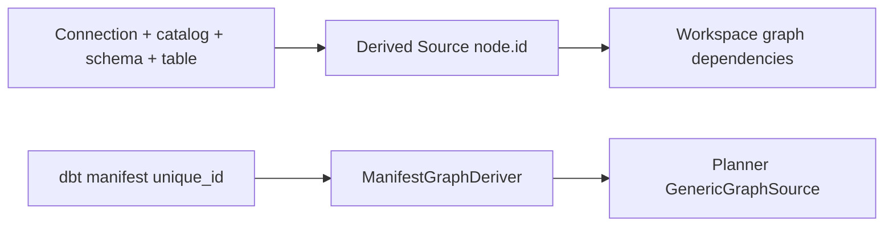

# GH-2904 stable logical identity and physical binding hard cut

## Governing sources

- `AGENTS.md`
- `docs/planning/status/governance-document-rule-inventory.md`
- Planning DB `architecture-designs`, `component-profile`, `component-integrity`,
  `frontend-component-rails`, `canvas-cq-rail-drift`, and
  `canvas-component-registry-drift`
- `docs/architecture/command-query-rail-governance.md`
- `docs/architecture/fowler-opportunity-planning-governance.md`
- `docs/adr/ADR-0064-substrait-semantic-reference-and-bounded-logical-profile.md`
- `docs/adr/ADR-0060-dbt-project-authoring-authority.md`
- `docs/adr/ADR-0058-warehouse-source-import-rails.md`
- GitHub issue `#2904`

## Baseline and overlap

The branch was created from
`main@94004a81920f0fe25e097c974829a39601f7881e`, refreshed through
`main@f8947a68c99a141ef35fe7b4eb1f949a948c361e` and
`main@0b58b06d0a887f9e5181ec0546536638b304d98a`, then merged for final review onto
current `main@6d14a3db8894a00a116b0f52478ac176952ce180`. The intervening main-only
changes belong to already-owned #2903, #2985, and #2979 work and are carried
forward without modification or reinterpretation by this task. The #2979 delta is
limited to Web/Inspector surfaces and has no file overlap with this PR. This task
does not modify or reopen `#2903`.

`#2936` and its open stacked PRs own Canvas-side `RelationId` / `FieldId`
allocation. Their production semantic-authoring files are forbidden surfaces for
this independent cut. `#2904` owns the remaining boundary: logical identity must
not be manufactured from physical Source coordinates or external dbt naming on
the path into downstream planning.

## Problem and root cause

Two independent current paths still blur identity and binding:

1. `GraphDraftWarehouseSourceImportStrategy` manufactures a graph node ID from
   `connectionId + catalog + schema + table`, with a collision suffix derived
   from `connectionId + sourceObjectId`. The graph node is a logical dependency
   target, so this makes a mutable physical binding the identity authority.
2. `derivePlannerGraphSourceFromManifest()` and `ManifestGraphDeriver` still
   expose a public dbt-manifest-to-Planner bridge that promotes dbt manifest keys
   and dependency strings directly into Planner `nodeId` / `dependsOn`. The
   current `PlannerFacade` already accepts only `GenericGraphSource`; repository
   search found no production consumer of the legacy bridge.

The canonical Substrait sidecar already has the right shape: stable
`RelationId` / `FieldId` plus structural and provenance bindings. The defect is
therefore not a missing IR or identity framework. It is residual authority drift
at ingress and stale bridge code.

## Identity and binding classification

| Surface                                                   | Classification                | Rule                                                   |
| --------------------------------------------------------- | ----------------------------- | ------------------------------------------------------ |
| `RelationId`                                              | logical identity              | stable; never name/path/provider/ordinal-derived       |
| `FieldId`                                                 | logical identity              | stable; never column-name/ordinal-derived              |
| field `relationId` / `parentFieldId`                      | logical reference             | references stable IDs only                             |
| `sourceFieldId`                                           | provenance                    | lineage reference, not a physical name fallback        |
| `relAnchor`                                               | structural binding            | current Substrait anchor, never logical identity       |
| `outputOrdinal`                                           | structural binding            | mutable position, never logical identity               |
| relation `sourceRef`                                      | physical binding/provenance   | connected source coordinates                           |
| `displayName` / `description`                             | derived presentation metadata | mutable without reminting IDs                          |
| semantic-plan and sidecar SHA                             | derived integrity metadata    | exact plan binding, not semantic identity              |
| `ConnectedSourceRef.connectionId/provider/sourceObjectId` | physical binding              | identifies a connected binding, not the DVT Source     |
| Workspace graph `node.id`                                 | logical identity              | survives physical rename/rebind                        |
| database/schema/table/column/connection/path              | physical/projection binding   | never dependency identity                              |
| dbt `unique_id`                                           | external dbt identity         | round-trip/provenance, not native DVT logical identity |
| `GenericGraphSource.nodeId/dependsOn`                     | logical identity/reference    | admitted verbatim by Planner                           |

## Selected hard cut

### A. Source import logical identity

`ImportWarehouseSources` remains the existing command rail. New graph-draft
Sources receive an opaque DVT node ID at creation time. The implementation reuses
`@dvt/crypto` UUIDv7 allocation directly; no identity service or store is added.

`ConnectedSourceRef` remains the exact connected physical binding used for
import idempotency/deduplication and later physical resolution. Replaying an
already-persisted import returns the persisted logical node ID; it never derives
that ID again from the binding.

Delete the physical-locator ID builder and collision-hash fallback. A Source
created from a different physical connection receives a distinct opaque logical
ID, while a later governed rebind can change the binding without changing the
already-persisted logical ID.

### B. Planner ingress hard cut

Delete `derivePlannerGraphSourceFromManifest()` and `ManifestGraphDeriver`, their
public export, and tests that exist only to preserve that obsolete ingress.
External dbt authority must first be projected by its owning adapter/application
boundary into the canonical `GenericGraphSource` with explicit logical IDs.
Planner does not mint or repair identity from a manifest key, path or name.

### C. Contract clarity and invariants

Keep the existing serializable shapes. Narrow `ConnectedSourceRef` documentation
to physical binding semantics and make the sidecar contract explicit that
anchors/ordinals are structural coordinates rather than identities.

Add behavior proof that changing display metadata, structural ordinal and
physical `sourceRef` coordinates does not mutate `RelationId` / `FieldId`; exact
serialization remains deterministic; duplicate/unbound identities continue to
fail closed.

`ExecutionBindingVerification` remains a verifier only. `PlanAssembler` and
`PlannerEnvelopeMapper` are retained because current source already passes
logical IDs through without reminting them.

## Rejected options

1. Keep physical-derived IDs and add a hash. Rejected: a hash of binding data is
   still binding-derived identity.
2. Maintain a logical-id/name/path fallback map. Rejected: permanent dual
   authority and silent compatibility heuristics are forbidden.
3. Add a generic identity service/repository. Rejected: allocation is a narrow
   creation concern and the persisted graph already owns the ID.
4. Keep the manifest bridge as a compatibility adapter. Rejected: zero
   production consumers and hard-cut posture require deletion rather than an
   alias.
5. Edit Canvas semantic identity generators now. Rejected: `#2936` is the active
   owner and has overlapping open PRs.
6. Add a second relational or source-binding IR. Rejected by ADR-0064 and the
   existing bounded contracts.

## Command/query and DDD ownership

| Rail                                      | Type                | DDD owner                           | Effect of this slice                                                     |
| ----------------------------------------- | ------------------- | ----------------------------------- | ------------------------------------------------------------------------ |
| `ImportWarehouseSources`                  | command             | Warehouse source import             | allocate opaque logical graph ID; preserve connected binding separately  |
| `StartRun` / PlannerBackedStartRunUseCase | command             | Run command application service     | accepts canonical `GenericGraphSource`; obsolete manifest bridge removed |
| Workspace semantic admission              | contract validation | Workspace graph authoring aggregate | stable sidecar identity remains canonical; no new rail                   |

No new route, endpoint, store or command/query rail is introduced.

## Fowler opportunity matrix

| scenario                                 | opportunity                             | Fowler pattern                                                    | DDD owner                       | command/query rail        | implementation surfaces                               | unit or package test       | architecture test                         | user-flow test                    | out of scope            |
| ---------------------------------------- | --------------------------------------- | ----------------------------------------------------------------- | ------------------------------- | ------------------------- | ----------------------------------------------------- | -------------------------- | ----------------------------------------- | --------------------------------- | ----------------------- |
| import connected Source into graph draft | hidden authority / primitive obsession  | replace derived primitive identity with opaque persisted identity | Warehouse source import         | `ImportWarehouseSources`  | API import strategy + tests                           | API focused strategy tests | zero physical-ID-builder search           | existing route behavior unchanged | explicit rebind UI      |
| plan from already-governed graph         | duplicate semantics / boundary drift    | remove obsolete adapter and use canonical boundary                | Planner                         | existing Planner facade   | planner export/domain/tests + API integration witness | planner determinism tests  | public export / zero legacy bridge search | none                              | dbt reverse translation |
| decode/reload semantic sidecar           | test-only confidence / hidden authority | executable value-object invariant                                 | DVT Substrait semantic document | none - contract admission | contracts + tests                                     | contract behavior tests    | duplicate/fallback guards                 | existing Canvas persistence proof | #2936 ID generator work |

## Current and target flow



```mermaid
flowchart LR
  Allocator[@dvt/crypto opaque UUIDv7] --> Logical[Stable graph node.id]
  Physical[ConnectedSourceRef + relation locator] --> Binding[Mutable physical binding]
  Logical --> Graph[Workspace graph dependencies]
  Binding --> Graph
  Adapter[Authoritative source/dbt adapter] --> Canonical[GenericGraphSource with explicit logical IDs]
  Canonical --> Planner[Planner]
  Legacy[manifest/name/path fallback] -. deleted .-> Planner
```

## Delivery order

1. Add this implementation plan and freeze overlap/authority.
2. Hard-cut graph-draft Source logical ID allocation away from physical binding
   and update API behavior tests.
3. Delete the dead manifest-to-Planner identity bridge and obsolete witnesses.
4. Clarify binding contracts and add deterministic stable-identity tests.
5. Audit the complete diff, rerun Planning DB drift checks, run focused package
   validation, ARC-2/feature mechanization and `pnpm verify:prepush`.
6. Open a PR, inspect every CI job/review thread/conflict, and correct until the
   branch is healthy.

## Residual work deliberately not absorbed

- `#2936` owns Canvas-side opaque `RelationId` / `FieldId` generation.
- `#2905` owns calculated target compatibility.
- Explicit physical Source rebind UX/command is not invented in this cut. The
  invariant established here is that persisted logical ID and downstream edges
  no longer encode the binding, so such a governed command can mutate the
  binding in place once its own product rail is admitted.
- No new provider, renderer, compatibility engine or generic naming service.

The identity browser witness imports Sources through the shared Canvas against
real API/PostgreSQL, checks distinct opaque IDs for two physical connections,
keeps row/byte evidence visible, and verifies identity after reload. The older
monolithic source-import/dbt-export story is tracked separately in GitHub #2994:
it stops on the retired dbt Canvas profile and is not claimed as passing here.

## Feature mechanization

This mechanization snapshot is exported from the two existing command/query rails
recorded in Planning DB by Superyo. GitHub #2904 owns task state; #2992 owns this
bounded integration. CI validation bootstraps an isolated database from evidence
and does not import or rebuild the working architecture authority. The HTTP
regressions verify returned identity against the saved draft, including unique
opaque IDs for distinct physical objects.

```feature-mechanization
{
  "symbols": [
    {
      "name": "ConnectedSourceRefSchema",
      "path": "packages/@dvt/contracts/src/contracts/source-import/ConnectedSourceRef.v1.ts",
      "cqRails": [
        "ImportWarehouseSources"
      ],
      "dddOwner": "Warehouse source import",
      "unitTests": [
        "pnpm --filter @dvt/contracts test",
        "pnpm --filter @dvt/planner test",
        "pnpm --filter dvt-api test:unit"
      ],
      "fowlerSignals": [
        "Hidden authority",
        "Primitive obsession",
        "Duplicate semantics",
        "Boundary drift",
        "Test-only confidence"
      ],
      "cypressCoverage": "apps/web/cypress/e2e/canvas/canvas-source-identity-live.cy.ts",
      "architectureGuard": "pnpm docs:feature-mechanization:implementation -- --feature GH-2904-STABLE-LOGICAL-PHYSICAL-BINDING"
    },
    {
      "name": "GraphDraftWarehouseSourceImportStrategy",
      "path": "apps/api/src/application/services/graphDraftWarehouseSourceImportStrategy.ts",
      "cqRails": [
        "ImportWarehouseSources"
      ],
      "dddOwner": "Warehouse source import",
      "unitTests": [
        "pnpm --filter @dvt/contracts test",
        "pnpm --filter @dvt/planner test",
        "pnpm --filter dvt-api test:unit"
      ],
      "fowlerSignals": [
        "Hidden authority",
        "Primitive obsession",
        "Duplicate semantics",
        "Boundary drift",
        "Test-only confidence"
      ],
      "cypressCoverage": "apps/web/cypress/e2e/canvas/canvas-source-identity-live.cy.ts",
      "architectureGuard": "pnpm docs:feature-mechanization:implementation -- --feature GH-2904-STABLE-LOGICAL-PHYSICAL-BINDING"
    },
    {
      "name": "DvtSubstraitAuthoringSidecarV1Schema",
      "path": "packages/@dvt/contracts/src/contracts/planner/DvtSubstraitSemanticDocument.v1.ts",
      "cqRails": [
        "StartRun"
      ],
      "dddOwner": "Run command application service",
      "unitTests": [
        "pnpm --filter @dvt/contracts test",
        "pnpm --filter @dvt/planner test",
        "pnpm --filter dvt-api test:unit"
      ],
      "fowlerSignals": [
        "Hidden authority",
        "Primitive obsession",
        "Duplicate semantics",
        "Boundary drift",
        "Test-only confidence"
      ],
      "cypressCoverage": "apps/web/cypress/e2e/canvas/canvas-source-identity-live.cy.ts",
      "architectureGuard": "pnpm docs:feature-mechanization:implementation -- --feature GH-2904-STABLE-LOGICAL-PHYSICAL-BINDING"
    },
    {
      "name": "PlannerFacade",
      "path": "packages/@dvt/planner/src/application/PlannerFacade.ts",
      "cqRails": [
        "StartRun"
      ],
      "dddOwner": "Run command application service",
      "unitTests": [
        "pnpm --filter @dvt/contracts test",
        "pnpm --filter @dvt/planner test",
        "pnpm --filter dvt-api test:unit"
      ],
      "fowlerSignals": [
        "Hidden authority",
        "Primitive obsession",
        "Duplicate semantics",
        "Boundary drift",
        "Test-only confidence"
      ],
      "cypressCoverage": "apps/web/cypress/e2e/canvas/canvas-source-identity-live.cy.ts",
      "architectureGuard": "pnpm docs:feature-mechanization:implementation -- --feature GH-2904-STABLE-LOGICAL-PHYSICAL-BINDING"
    }
  ],
  "version": 1,
  "featureId": "GH-2904-STABLE-LOGICAL-PHYSICAL-BINDING",
  "userStories": [
    "Stable Substrait IDs survive mutable binding and position changes"
  ],
  "cypressFlows": [
    "N/A - no apps/web implementation; existing Canvas Source import flows remain unchanged",
    "apps/web/cypress/e2e/canvas/canvas-source-identity-live.cy.ts"
  ],
  "domainObjects": [
    "Workspace graph Source identity",
    "ConnectedSourceRef physical binding",
    "DVT Substrait identity sidecar",
    "GenericGraphSource"
  ],
  "fowlerSignals": [
    "Hidden authority",
    "Primitive obsession",
    "Duplicate semantics",
    "Boundary drift",
    "Test-only confidence"
  ],
  "completionGate": [
    "pnpm --filter @dvt/contracts test",
    "pnpm --filter @dvt/contracts typecheck",
    "pnpm --filter @dvt/planner test",
    "pnpm --filter @dvt/planner typecheck",
    "pnpm --filter dvt-api test",
    "pnpm --filter dvt-api typecheck",
    "GIT_BASE=origin/main GIT_HEAD=HEAD node tools/ci/arc-check.mjs",
    "pnpm docs:feature-mechanization:implementation -- --feature GH-2904-STABLE-LOGICAL-PHYSICAL-BINDING",
    "pnpm verify:prepush"
  ],
  "redGreenCycles": [
    {
      "id": "importwarehousesources-record",
      "redTest": "pnpm --filter dvt-api exec vitest run --config vitest.config.ts test/entrypoints/http/warehouseSourceImportRoutes.test.ts",
      "greenTest": "pnpm --filter dvt-api exec vitest run --config vitest.config.ts test/entrypoints/http/warehouseSourceImportRoutes.test.ts test/application/services/graphDraftWarehouseSourceImportStrategy.test.ts",
      "patchSurfaces": [
        "packages/@dvt/contracts/src/contracts/source-import/ConnectedSourceRef.v1.ts",
        "packages/@dvt/contracts/src/contracts/planner/DvtSubstraitSemanticDocument.v1.ts",
        "packages/@dvt/contracts/src/contracts/planner/DvtSubstraitFieldBindingHierarchy.v1.ts",
        "packages/@dvt/contracts/src/contracts/planner/ExecutionBindingVerification.v1.ts",
        "packages/@dvt/contracts/test/**",
        "packages/@dvt/planner/src/application/derivePlannerGraphSourceFromManifest.ts",
        "packages/@dvt/planner/src/domain/manifest.ts",
        "packages/@dvt/planner/src/domain/Planner.ts",
        "packages/@dvt/planner/src/index.ts",
        "packages/@dvt/planner/test/**",
        "apps/api/src/application/services/graphDraftWarehouseSourceImportStrategy.ts",
        "apps/api/test/application/services/graphDraftWarehouseSourceImportStrategy.test.ts",
        "apps/api/test/integration/plannerEngineContract.test.ts",
        "docs/architecture/components/planner/index.md",
        "docs/architecture/domain-planning.md",
        "docs/architecture/system/subsystems/semantic-transformation/index.md",
        "docs/guides/generic-graph-source-technical-manual-20260404.md",
        "docs/evidence/ED-20260905-gh-2904-stable-logical-physical-binding.md",
        "docs/risk-register/quality/R-20260905-GH-2904-STABLE-LOGICAL-PHYSICAL-BINDING.yaml",
        "docs/planning/proposals/mandatory/runtime-and-contracts/gh-2904-stable-logical-physical-binding-hardcut-20260905.md",
        "apps/api/test/entrypoints/http/warehouseSourceImportRoutes.test.ts",
        "apps/web/cypress/e2e/canvas/canvas-source-identity-live.cy.ts",
        "apps/web/cypress/support/liveWarehouseSourceImport.ts"
      ],
      "expectedFailure": "Four route witnesses expect physical-name-derived IDs instead of persisted opaque Source identity"
    },
    {
      "id": "startrun-record",
      "redTest": "pnpm --filter dvt-api exec vitest run --config vitest.config.ts test/entrypoints/http/warehouseSourceImportRoutes.test.ts",
      "greenTest": "pnpm --filter dvt-api exec vitest run --config vitest.config.ts test/entrypoints/http/warehouseSourceImportRoutes.test.ts test/application/services/graphDraftWarehouseSourceImportStrategy.test.ts",
      "patchSurfaces": [
        "packages/@dvt/contracts/src/contracts/source-import/ConnectedSourceRef.v1.ts",
        "packages/@dvt/contracts/src/contracts/planner/DvtSubstraitSemanticDocument.v1.ts",
        "packages/@dvt/contracts/src/contracts/planner/DvtSubstraitFieldBindingHierarchy.v1.ts",
        "packages/@dvt/contracts/src/contracts/planner/ExecutionBindingVerification.v1.ts",
        "packages/@dvt/contracts/test/**",
        "packages/@dvt/planner/src/application/derivePlannerGraphSourceFromManifest.ts",
        "packages/@dvt/planner/src/domain/manifest.ts",
        "packages/@dvt/planner/src/domain/Planner.ts",
        "packages/@dvt/planner/src/index.ts",
        "packages/@dvt/planner/test/**",
        "apps/api/src/application/services/graphDraftWarehouseSourceImportStrategy.ts",
        "apps/api/test/application/services/graphDraftWarehouseSourceImportStrategy.test.ts",
        "apps/api/test/integration/plannerEngineContract.test.ts",
        "docs/architecture/components/planner/index.md",
        "docs/architecture/domain-planning.md",
        "docs/architecture/system/subsystems/semantic-transformation/index.md",
        "docs/guides/generic-graph-source-technical-manual-20260404.md",
        "docs/evidence/ED-20260905-gh-2904-stable-logical-physical-binding.md",
        "docs/risk-register/quality/R-20260905-GH-2904-STABLE-LOGICAL-PHYSICAL-BINDING.yaml",
        "docs/planning/proposals/mandatory/runtime-and-contracts/gh-2904-stable-logical-physical-binding-hardcut-20260905.md",
        "apps/api/test/entrypoints/http/warehouseSourceImportRoutes.test.ts",
        "apps/web/cypress/e2e/canvas/canvas-source-identity-live.cy.ts",
        "apps/web/cypress/support/liveWarehouseSourceImport.ts"
      ],
      "expectedFailure": "Four route witnesses expect physical-name-derived IDs instead of persisted opaque Source identity"
    }
  ],
  "componentGuides": [
    "docs/architecture/system/subsystems/semantic-transformation/index.md"
  ],
  "governingSources": [
    "AGENTS.md",
    "docs/adr/ADR-0064-substrait-semantic-reference-and-bounded-logical-profile.md",
    "docs/adr/ADR-0058-warehouse-source-import-rails.md",
    "docs/architecture/command-query-rail-governance.md",
    "docs/architecture/fowler-opportunity-planning-governance.md"
  ],
  "commandQueryRails": [
    {
      "name": "ImportWarehouseSources",
      "type": "command",
      "status": "implemented",
      "dddOwner": "Warehouse source import",
      "negativeTests": [
        "duplicate connected binding fails closed",
        "stale draft CAS does not overwrite"
      ],
      "adapterSurface": "existing warehouse Source Import HTTP rail",
      "applicationPort": "ImportWarehouseSourcesUseCase",
      "authorizationScope": "existing tenant project environment capability"
    },
    {
      "name": "StartRun",
      "type": "command",
      "status": "implemented",
      "dddOwner": "Run command application service",
      "negativeTests": [
        "invalid or duplicate logical graph IDs reject"
      ],
      "adapterSurface": "Existing protected StartRun HTTP command",
      "applicationPort": "PlannerBackedStartRunUseCase",
      "authorizationScope": "Authorized tenant, project and environment run-start scope"
    }
  ],
  "architectureGuards": [
    "pnpm docs:feature-mechanization:implementation -- --feature GH-2904-STABLE-LOGICAL-PHYSICAL-BINDING",
    "GIT_BASE=origin/main GIT_HEAD=HEAD node tools/ci/arc-check.mjs"
  ],
  "implementationPlan": "docs/planning/proposals/mandatory/runtime-and-contracts/gh-2904-stable-logical-physical-binding-hardcut-20260905.md",
  "mechanizationStatus": "implemented",
  "noHumanDecisionsRemaining": true,
  "allowedImplementationSurfaces": [
    "packages/@dvt/contracts/src/contracts/source-import/ConnectedSourceRef.v1.ts",
    "packages/@dvt/contracts/src/contracts/planner/DvtSubstraitSemanticDocument.v1.ts",
    "packages/@dvt/contracts/src/contracts/planner/DvtSubstraitFieldBindingHierarchy.v1.ts",
    "packages/@dvt/contracts/src/contracts/planner/ExecutionBindingVerification.v1.ts",
    "packages/@dvt/contracts/test/**",
    "packages/@dvt/planner/src/application/derivePlannerGraphSourceFromManifest.ts",
    "packages/@dvt/planner/src/domain/manifest.ts",
    "packages/@dvt/planner/src/domain/Planner.ts",
    "packages/@dvt/planner/src/index.ts",
    "packages/@dvt/planner/test/**",
    "apps/api/src/application/services/graphDraftWarehouseSourceImportStrategy.ts",
    "apps/api/test/application/services/graphDraftWarehouseSourceImportStrategy.test.ts",
    "apps/api/test/integration/plannerEngineContract.test.ts",
    "docs/architecture/components/planner/index.md",
    "docs/architecture/domain-planning.md",
    "docs/architecture/system/subsystems/semantic-transformation/index.md",
    "docs/guides/generic-graph-source-technical-manual-20260404.md",
    "docs/evidence/ED-20260905-gh-2904-stable-logical-physical-binding.md",
    "docs/risk-register/quality/R-20260905-GH-2904-STABLE-LOGICAL-PHYSICAL-BINDING.yaml",
    "docs/planning/proposals/mandatory/runtime-and-contracts/gh-2904-stable-logical-physical-binding-hardcut-20260905.md",
    "apps/api/test/entrypoints/http/warehouseSourceImportRoutes.test.ts",
    "apps/web/cypress/e2e/canvas/canvas-source-identity-live.cy.ts",
    "apps/web/cypress/support/liveWarehouseSourceImport.ts"
  ],
  "forbiddenImplementationSurfaces": [
    "apps/web/src/app/views/canvas/canvasDvtSourceSemanticAuthoring.ts",
    "apps/web/src/app/views/canvas/canvasDvtSubstraitProjection.ts",
    "apps/web/src/app/views/canvas/canvasDvtSubstraitJoinComposition.ts",
    "packages/@dvt/engine/**",
    "new identity stores, IRs, compatibility aliases, feature flags or dual lookup paths"
  ]
}
```
