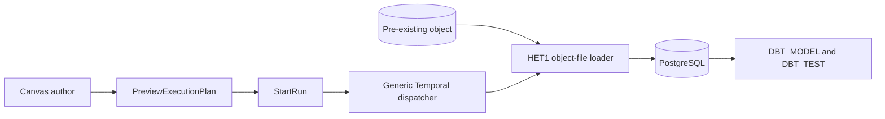
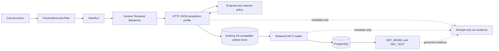

# HET2 Public REST Artifact DBT Vertical

## Think-First Analysis

Problem summary: the current public heterogeneous route starts at an already
materialized object. It cannot acquire a bounded REST JSON response, preserve it
as an immutable artifact, and hand that artifact to the existing HET1 loader in
one stored plan and run.

Root cause: the canonical step registry has no HTTP acquisition step, the
Temporal worker has no independently composed HTTP profile, and Canvas cannot
project a governed endpoint node into the generic planner graph. Adding a route
handler or generic proxy would put security and artifact semantics in the wrong
boundary and would duplicate the existing start-run rail.

Constraints and invariants:

- HET1 is the pinned dependency at local commits `b0eb4849d` and `2eb393a4a`.
- Reuse `PreviewExecutionPlan`, `StartRun`, `WorkflowEngine.startRun`,
  `GetRunStatus`, and `GetRunEvents`; do not add an acquisition API route.
- Admit HTTPS `GET` only through a server-owned `http-endpoint:*` reference.
- Keep authentication in an optional worker-resolved `http-auth:*` reference.
- Reject loopback, private, link-local, multicast, unspecified, and metadata
  addresses on every initial and redirected request. A loopback exception is
  allowed only for the controlled non-production live fixture.
- Bound redirects, connect time, request time, decoded bytes, media type, status,
  and UTF-8 JSON/JSON Lines validity. Reject content encoding other than identity.
- The plan predeclares the expected SHA-256, size, media type, and
  `s3://<bucket>/tenants/<tenantId>/<sha256>` output. This is the minimum
  deterministic handoff and does not introduce dynamic output binding.
- Artifact publication is create-once. A retry may verify an identical existing
  object; it must reject a conflicting object and must not create duplicates.
- Workflow history, run events, logs, traces, and errors carry only typed receipt
  metadata and stable refusal codes, never response bytes, URLs, tokens, or
  secret header values.
- The retained `LOAD_OBJECT_FILE_TO_POSTGRES` step remains the only loader, and
  DBT remains the existing independently composed plugin profile.

Options considered:

1. Add a generic HTTP request/proxy step. Rejected because arbitrary methods,
   URLs, bodies, and headers create an SSRF and credential-exfiltration platform.
2. Fetch during Canvas preview or in the API. Rejected because it makes preview
   stateful, bypasses stored-plan execution, and leaks runtime credentials into
   the authoring boundary.
3. Add dynamic workflow output binding. Rejected because the controlled fixture
   has stable bytes and a predeclared content address proves the route without a
   new expression or substitution framework.
4. Add one bounded HTTP JSON acquisition profile plus an artifacts-owned
   content-addressed writer. Selected because it keeps policy in the plugin,
   network and credential resolution in the worker adapter, bytes in the
   existing object store, and orchestration in the generic Temporal dispatcher.

Libraries evaluated: Node's maintained `https`, `dns`, `net`, `crypto`, and URL
APIs plus the existing AWS SDK and Zod dependencies cover the bounded client,
IP policy, digest, object-store, and contract requirements. No additional
dependency is justified.

## Current And Target Architecture





The target plan is exactly:

```text
ACQUIRE_HTTP_JSON_ARTIFACT
  -> LOAD_OBJECT_FILE_TO_POSTGRES
  -> DBT_MODEL
  -> DBT_TEST
```

The first step and HET1 share a static content-addressed artifact identity. No
response bytes cross a Temporal activity result or event payload.

## Command And Query Rail Posture

The Planning DB creation-intent preflight found no acquisition product rail and
returned broad artifact matches. HET2 does not need a new public product command:
the externally observable intent is still previewing and starting a stored plan.

| Intent                                     | Rail                                           | DDD owner                   | Port / adapter                            | Scope and authorization                 | Negative proof                                                           |
| ------------------------------------------ | ---------------------------------------------- | --------------------------- | ----------------------------------------- | --------------------------------------- | ------------------------------------------------------------------------ |
| Preview the four-step plan                 | `PreviewExecutionPlan` command                 | Canvas preview/readiness    | existing planner/API/Web rail             | existing protected workspace scope      | unavailable HTTP capability fails closed                                 |
| Execute acquisition, load, model, and test | `StartRun` / `WorkflowEngine.startRun` command | run execution aggregate     | existing engine port and Temporal adapter | stored plan ownership and runtime scope | malformed config, missing capability, endpoint denial, artifact conflict |
| Observe receipt-only progress              | `GetRunStatus`, `GetRunEvents` queries         | run operational read models | existing state-store/API/Web rails        | tenant/project/environment scope        | response bytes and credentials absent                                    |
| Execute the governed live proof            | `RunHet2PublicVerticalLiveProof` command       | delivery runtime proofs     | repository proof runner                   | local controlled stack only             | no preseed, security refusal, tamper, dbt failure, cancel/recover        |

## Fowler Opportunity Matrix

| Scenario                                            | Opportunity             | Fowler pattern                    | DDD owner                                        | Command/query rail     | Implementation surfaces                            | Unit/package test                                         | Architecture test               | User-flow test                 | Out of scope        |
| --------------------------------------------------- | ----------------------- | --------------------------------- | ------------------------------------------------ | ---------------------- | -------------------------------------------------- | --------------------------------------------------------- | ------------------------------- | ------------------------------ | ------------------- |
| Arbitrary URL or redirect reaches internal networks | Boundary drift          | Policy and Gateway                | `HttpEndpointAccessPolicy`                       | `StartRun`             | contracts, HTTP plugin, worker client              | endpoint, DNS, redirect, timeout, size and media refusals | plugin/core decoupling guard    | controlled HTTPS live refusal  | generic proxy       |
| Response bytes become workflow state                | Hidden authority        | Metadata Mapper                   | `ArtifactAcquisitionReceipt`                     | `GetRunEvents`         | contracts and generic result-evidence type         | receipt schema and no-byte assertions                     | event payload shape guard       | Runs/Console leak check        | response preview    |
| Retries overwrite an object                         | Anemic domain           | Content-addressed Repository      | `ContentAddressedArtifact`                       | `StartRun`             | artifacts port and S3 adapter                      | create, verified replay, conflict, cancellation           | artifact ownership guard        | repeated run proves one object | artifact database   |
| Acquisition and loading become one adapter          | Responsibility overload | Separated Interface               | HTTP acquisition profile and HET1 loader profile | `StartRun`             | independent plugin packages and worker composition | profile composition tests                                 | no plugin kind in Temporal core | four-step plan proof           | second loader       |
| Canvas stores a URL or secret                       | Primitive obsession     | Value Object and opaque reference | `HttpJsonArtifactAcquisitionConfig`              | `PreviewExecutionPlan` | contracts and Web authoring projection             | inline URL/header/auth rejection                          | planner projection guard        | public authoring proof         | connector framework |

## Pre-Implementation Brief

- Mode: Full.
- Scope: issues #2182, #2183, and #2184; one contract, one independent
  acquisition profile, one artifacts-owned writer, one worker network adapter,
  public Canvas authoring/projection, and one real live proof.
- Expected outcome: the public Canvas authors and executes the four-step plan
  against a controlled HTTPS fixture, existing object store, PostgreSQL,
  Temporal worker, and dbt with receipt-only evidence.
- Risks and mitigations: SSRF is contained by endpoint references, per-hop DNS/IP
  validation, address pinning, HTTPS-only transport, identity encoding, bounded
  streaming, and refusal-code-only errors. Immutable-write races use conditional
  create and verify an existing object before treating a retry as success.
- Out of scope: arbitrary URLs/methods/bodies, generic connectors, OAuth flows,
  pagination, schema inference, dynamic plan output expressions, a second
  artifact database, or a second loader.
- Validation: focused contracts, artifacts, plugin, worker, planner,
  plan-verifier, API, and Web tests; package lint/typecheck/build; architecture
  guards; ARC check; docs synchronization; governance refresh; live Cypress
  proof; and `pnpm verify:prepush` after hook-normalized commits.

## Pre-PR Acceptance Review

The issue-to-code review performed before publication found three release
blockers that must be corrected before the combined HET1/HET2 branch can merge:

1. the worker network tests did not explicitly prove same-origin redirect
   re-resolution, DNS rebinding refusal, redirect exhaustion, identity-encoding
   enforcement, wrong status/media type, malformed JSON, optional-auth behavior,
   or secret-safe transport failure mapping;
2. the IPv6 policy rejected IPv4-mapped addresses but did not reject the
   deprecated IPv4-compatible dotted form, which can encode a loopback or
   metadata destination outside the mapped-address branch;
3. the protected HET2 proof exercised endpoint denial and cancellation during
   dbt, while issues #2183 and #2184 require real HTTP failure, response/artifact
   integrity refusal, and a cancel request while acquisition is active.

The accepted correction keeps the same command/query rails and implementation
surfaces. It strengthens the existing worker policy and proof fixture; it does
not add a connector, route, artifact model, loader, or orchestration mechanism.
The combined PR must also run the retained HET1 live proof because that is the
service-backed evidence that the downstream loader rejects a tampered artifact
before PostgreSQL mutation.

```feature-mechanization
version: 1
featureId: E-HET2-PUBLIC-REST-ARTIFACT-DBT-20260805
mechanizationStatus: implemented
noHumanDecisionsRemaining: true
owner: Contracts / Artifacts / Temporal Runtime / Web
implementationPlan: docs/planning/proposals/mandatory/runtime-and-contracts/het2-public-rest-artifact-dbt-vertical-plan-20260805.md
componentGuides:
  - docs/adr/ADR-0057-temporal-step-activity-routing-by-capability.md
  - docs/adr/ADR-0058-warehouse-source-import-rails.md
  - docs/adr/ADR-0060-dbt-project-authoring-authority.md
userStories:
  - https://github.com/dunay2/dvt/issues/2181
  - https://github.com/dunay2/dvt/issues/2182
  - https://github.com/dunay2/dvt/issues/2183
  - https://github.com/dunay2/dvt/issues/2184
governingSources:
  - AGENTS.md
  - docs/planning/status/governance-document-rule-inventory.md
  - docs/guides/ai-work-protocol.md
  - docs/architecture/command-query-rail-governance.md
  - docs/architecture/fowler-opportunity-planning-governance.md
  - docs/adr/ADR-0003-execution-model.md
  - docs/adr/ADR-0035-planner-public-contract-evolution-protocol.md
  - docs/adr/ADR-0043-plan-record-plan-store-and-artifacts-ownership.md
  - docs/adr/ADR-0054-plan-store-scoped-record-identity.md
  - docs/adr/ADR-0057-temporal-step-activity-routing-by-capability.md
  - docs/adr/ADR-0058-warehouse-source-import-rails.md
  - docs/adr/ADR-0060-dbt-project-authoring-authority.md
allowedImplementationSurfaces:
  - packages/@dvt/contracts/src/**
  - packages/@dvt/contracts/test/**
  - packages/@dvt/artifacts/src/**
  - packages/@dvt/artifacts/test/**
  - packages/@dvt/temporal-http-json-plugin/**
  - packages/@dvt/plan-verifier/test/**
  - packages/@dvt/planner/test/**
  - packages/@dvt/adapter-temporal/src/activities/activityTypes.ts
  - packages/@dvt/adapter-temporal/src/workflows/**
  - packages/@dvt/adapter-temporal/test/**
  - apps/temporal-worker/src/**
  - apps/temporal-worker/test/**
  - apps/temporal-worker/package.json
  - apps/api/src/plugins/env.ts
  - apps/api/src/modules/providerAdapters/createTemporalProviderAdapterFactory.ts
  - apps/api/test/plugins/env.test.ts
  - apps/api/test/modules/providerAdapters/createTemporalProviderAdapterFactory.test.ts
  - apps/api/test/plugins/observability.test.ts
  - apps/web/src/app/plugins/**
  - apps/web/src/app/views/canvas/**
  - apps/web/cypress/e2e/canvas/canvas-het2-rest-artifact-dbt-live.cy.ts
  - apps/web/cypress/fixtures/het2-fixture-cert.pem
  - apps/web/cypress/fixtures/het2-fixture-key.pem
  - apps/web/cypress/fixtures/het2-http-json-orders.jsonl
  - apps/web/cypress/fixtures/het2-http-json-orders.manifest.json
  - apps/web/cypress/support/canvasExecutionSelection.ts
  - apps/web/cypress/support/het1PublicFailureRecoveryProof.ts
  - apps/web/cypress/support/het2PublicVertical.ts
  - scripts/run-het2-public-vertical-live-proof.cjs
  - scripts/run-het2-public-vertical-live-proof.test.cjs
  - package.json
  - pnpm-lock.yaml
  - docs/planning/proposals/mandatory/runtime-and-contracts/het2-public-rest-artifact-dbt-vertical-plan-20260805.md
  - docs/evidence/ED-20260805-het2-public-rest-artifact-dbt-vertical.md
  - docs/risk-register/quality/R-20260805-HET2-PUBLIC-VERTICAL.yaml
forbiddenImplementationSurfaces:
  - packages/@dvt/engine/src/**
  - apps/api/src/entrypoints/http/**
  - packages/@dvt/temporal-object-file-postgres-plugin/src/**
  - packages/@dvt/temporal-dbt-plugin/src/**
commandQueryRails:
  - name: PreviewExecutionPlan
    type: command
    dddOwner: Canvas execution preview/readiness presentation
  - name: StartRun
    type: command
    dddOwner: RunExecutionAggregate
  - name: WorkflowEngine.startRun
    type: command
    dddOwner: RunExecutionAggregate
  - name: GetRunStatus
    type: query
    dddOwner: RunOperationalReadModel
  - name: GetRunEvents
    type: query
    dddOwner: RunEventFeedReadModel
  - name: RunHet2PublicVerticalLiveProof
    type: command
    dddOwner: DeliveryRuntimeProofs
domainObjects:
  - name: HttpJsonArtifactAcquisitionConfig
    type: value object
    owner: contracts step registry
  - name: HttpEndpointAccessPolicy
    type: policy
    owner: temporal HTTP JSON plugin
  - name: ContentAddressedArtifact
    type: aggregate
    owner: artifacts bounded context
  - name: ArtifactAcquisitionReceipt
    type: receipt
    owner: contracts run evidence
fowlerSignals:
  - Boundary drift
  - Hidden authority
  - Primitive obsession
  - Responsibility overload
  - Test-only confidence
architectureGuards:
  - packages/@dvt/temporal-http-json-plugin/test/httpJsonPluginBoundary.architecture.test.ts
  - apps/web/src/app/views/canvas/canvasDbtAuthoringRun.architecture.test.ts
cypressFlows:
  - apps/web/cypress/e2e/canvas/canvas-het2-rest-artifact-dbt-live.cy.ts
completionGate:
  - pnpm --filter @dvt/contracts test
  - pnpm --filter @dvt/artifacts test
  - pnpm --filter @dvt/temporal-http-json-plugin test
  - pnpm --filter dvt-temporal-worker test
  - pnpm --filter @dvt/planner test
  - pnpm --filter @dvt/plan-verifier test
  - pnpm --filter dvt-api test
  - pnpm --filter @dvt/web test
  - pnpm test:web:e2e:het1-public:live
  - pnpm test:web:e2e:het2-public:live
  - pnpm docs:feature-mechanization:implementation -- --base 2eb393a4a --feature E-HET2-PUBLIC-REST-ARTIFACT-DBT-20260805
  - pnpm verify:prepush
redGreenCycles:
  - id: http-json-contract-admission
    redTest: pnpm --filter @dvt/contracts test -- test/http-json-artifact-step.contract.test.ts
    expectedFailure: The canonical registry has no bounded HTTP JSON acquisition step or receipt schema.
    patchSurfaces:
      - packages/@dvt/contracts/src/**
      - packages/@dvt/contracts/test/http-json-artifact-step.contract.test.ts
      - packages/@dvt/planner/test/unit/http-json-artifact-chain.integration.test.ts
      - packages/@dvt/plan-verifier/test/http-json-artifact-step.admission.test.ts
    greenTest: pnpm --filter @dvt/contracts test -- test/http-json-artifact-step.contract.test.ts
  - id: immutable-content-addressed-writer
    redTest: pnpm --filter @dvt/artifacts test -- test/contentAddressedArtifactStore.test.ts
    expectedFailure: Artifacts has no create-once JSON artifact writer with replay verification and conflict refusal.
    patchSurfaces:
      - packages/@dvt/artifacts/src/**
      - packages/@dvt/artifacts/test/contentAddressedArtifactStore.test.ts
    greenTest: pnpm --filter @dvt/artifacts test -- test/contentAddressedArtifactStore.test.ts
  - id: bounded-http-plugin-runtime
    redTest: pnpm --filter @dvt/temporal-http-json-plugin test
    expectedFailure: No independent acquisition profile validates policy, content, digest, or receipt-only output.
    patchSurfaces:
      - packages/@dvt/temporal-http-json-plugin/**
    greenTest: pnpm --filter @dvt/temporal-http-json-plugin test
  - id: worker-network-and-profile-composition
    redTest: pnpm --filter dvt-temporal-worker test -- test/runtime/temporalWorkerHttpJsonProfile.test.ts test/runtime/nodeHttpsJsonClient.test.ts
    expectedFailure: Worker has no per-hop SSRF-safe HTTPS adapter or fourth plugin profile.
    patchSurfaces:
      - apps/temporal-worker/src/**
      - apps/temporal-worker/test/**
      - apps/temporal-worker/package.json
      - apps/api/src/plugins/env.ts
      - apps/api/src/modules/providerAdapters/createTemporalProviderAdapterFactory.ts
      - apps/api/test/**
    greenTest: pnpm --filter dvt-temporal-worker test -- test/runtime/temporalWorkerHttpJsonProfile.test.ts test/runtime/nodeHttpsJsonClient.test.ts
  - id: public-canvas-four-step-projection
    redTest: pnpm --filter @dvt/web test -- src/app/views/canvas/httpJsonArtifactAuthoringModel.test.ts src/app/views/canvas/canvasDbtPlannerGraphSource.test.ts
    expectedFailure: Canvas cannot author or project acquisition before the HET1 load.
    patchSurfaces:
      - apps/web/src/app/plugins/**
      - apps/web/src/app/views/canvas/**
    greenTest: pnpm --filter @dvt/web test -- src/app/views/canvas/httpJsonArtifactAuthoringModel.test.ts src/app/views/canvas/canvasDbtPlannerGraphSource.test.ts
  - id: het2-live-proof
    redTest: pnpm test:web:e2e:het2-public:live
    expectedFailure: No controlled HTTPS fixture proves the public four-step route without pre-seeding the artifact.
    patchSurfaces:
      - apps/web/cypress/e2e/canvas/canvas-het2-rest-artifact-dbt-live.cy.ts
      - apps/web/cypress/fixtures/het2-http-json-orders.manifest.json
      - apps/web/cypress/support/het2PublicVertical.ts
      - scripts/run-het2-public-vertical-live-proof.cjs
      - scripts/run-het2-public-vertical-live-proof.test.cjs
      - package.json
    greenTest: pnpm test:web:e2e:het2-public:live
  - id: review-http-network-negative-coverage
    redTest: pnpm --filter dvt-temporal-worker test -- test/runtime/nodeHttpsJsonClient.test.ts
    expectedFailure: IPv4-compatible IPv6 and required per-hop, timeout, encoding, status, media, payload, optional-auth, and redaction cases are not all proven.
    patchSurfaces:
      - apps/temporal-worker/src/runtime/nodeHttpsJsonClient.ts
      - apps/temporal-worker/test/runtime/nodeHttpsJsonClient.test.ts
    greenTest: pnpm --filter dvt-temporal-worker test -- test/runtime/nodeHttpsJsonClient.test.ts
  - id: review-live-acquisition-failure-and-cancellation
    redTest: pnpm test:web:e2e:het2-public:live
    expectedFailure: The live proof does not exercise real HTTP status failure, response integrity mismatch, or cancellation requested while acquisition is active.
    patchSurfaces:
      - apps/web/cypress/e2e/canvas/canvas-het2-rest-artifact-dbt-live.cy.ts
      - scripts/run-het2-public-vertical-live-proof.cjs
      - scripts/run-het2-public-vertical-live-proof.test.cjs
    greenTest: pnpm test:web:e2e:het2-public:live
symbols:
  - name: HttpJsonArtifactStepTypeConfigSchema
    path: packages/@dvt/contracts/src/contracts/planner/HttpJsonArtifactStepTypeConfig.v1.ts
    dddOwner: HttpJsonArtifactAcquisitionConfig
    cqRails: [StartRun]
    fowlerSignals: [Primitive obsession]
    architectureGuard: packages/@dvt/temporal-http-json-plugin/test/httpJsonPluginBoundary.architecture.test.ts
    cypressCoverage: apps/web/cypress/e2e/canvas/canvas-het2-rest-artifact-dbt-live.cy.ts
    unitTests: [packages/@dvt/contracts/test/http-json-artifact-step.contract.test.ts]
  - name: S3ContentAddressedArtifactStore
    path: packages/@dvt/artifacts/src/contentAddressed/S3ContentAddressedArtifactStore.ts
    dddOwner: ContentAddressedArtifact
    cqRails: [StartRun]
    fowlerSignals: [Hidden authority]
    architectureGuard: packages/@dvt/temporal-http-json-plugin/test/httpJsonPluginBoundary.architecture.test.ts
    cypressCoverage: apps/web/cypress/e2e/canvas/canvas-het2-rest-artifact-dbt-live.cy.ts
    unitTests: [packages/@dvt/artifacts/test/contentAddressedArtifactStore.test.ts]
  - name: HttpJsonArtifactPluginRunner
    path: packages/@dvt/temporal-http-json-plugin/src/HttpJsonArtifactPluginRunner.ts
    dddOwner: HttpEndpointAccessPolicy
    cqRails: [WorkflowEngine.startRun]
    fowlerSignals: [Boundary drift]
    architectureGuard: packages/@dvt/temporal-http-json-plugin/test/httpJsonPluginBoundary.architecture.test.ts
    cypressCoverage: apps/web/cypress/e2e/canvas/canvas-het2-rest-artifact-dbt-live.cy.ts
    unitTests: [packages/@dvt/temporal-http-json-plugin/test/HttpJsonArtifactPlugin.test.ts]
  - name: createTemporalWorkerHttpJsonProfile
    path: apps/temporal-worker/src/runtime/temporalWorkerHttpJsonProfile.ts
    dddOwner: TemporalWorkerHttpJsonProfile
    cqRails: [WorkflowEngine.startRun]
    fowlerSignals: [Responsibility overload]
    architectureGuard: packages/@dvt/temporal-http-json-plugin/test/httpJsonPluginBoundary.architecture.test.ts
    cypressCoverage: apps/web/cypress/e2e/canvas/canvas-het2-rest-artifact-dbt-live.cy.ts
    unitTests: [apps/temporal-worker/test/runtime/temporalWorkerHttpJsonProfile.test.ts]
  - name: buildDbtPlannerGraphSource
    path: apps/web/src/app/views/canvas/canvasDbtPlannerGraphSource.ts
    dddOwner: PlannerPreviewReadModel
    cqRails: [PreviewExecutionPlan]
    fowlerSignals: [Hidden authority]
    architectureGuard: apps/web/src/app/views/canvas/canvasDbtAuthoringRun.architecture.test.ts
    cypressCoverage: apps/web/cypress/e2e/canvas/canvas-het2-rest-artifact-dbt-live.cy.ts
    unitTests: [apps/web/src/app/views/canvas/canvasDbtPlannerGraphSource.test.ts]
  - name: main
    path: scripts/run-het2-public-vertical-live-proof.cjs
    dddOwner: DeliveryRuntimeProofs
    cqRails: [RunHet2PublicVerticalLiveProof]
    fowlerSignals: [Test-only confidence]
    architectureGuard: scripts/run-het2-public-vertical-live-proof.test.cjs
    cypressCoverage: apps/web/cypress/e2e/canvas/canvas-het2-rest-artifact-dbt-live.cy.ts
    unitTests: [scripts/run-het2-public-vertical-live-proof.test.cjs]
```
