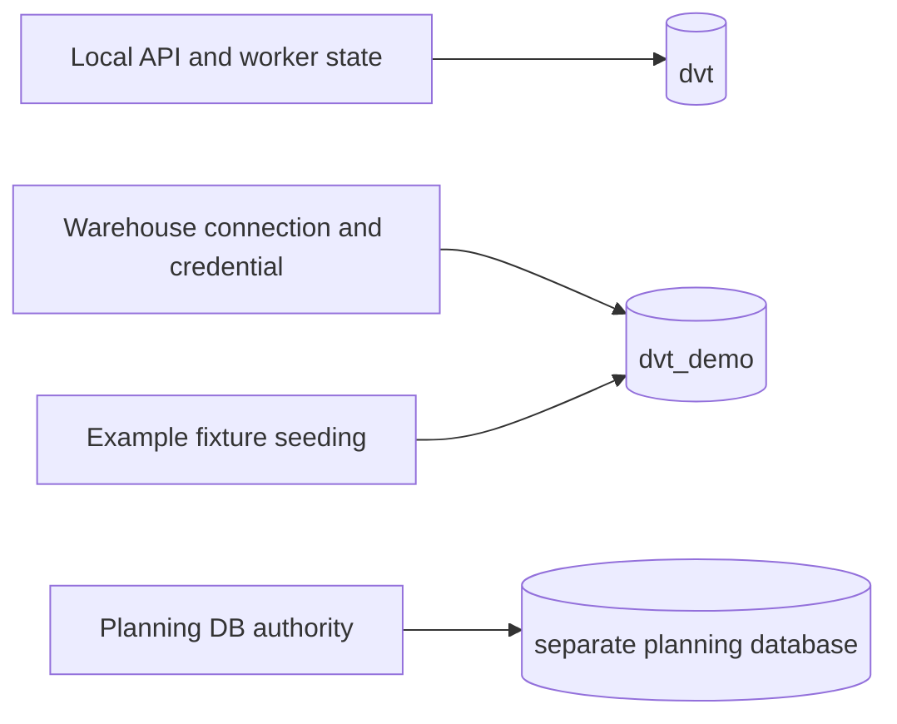
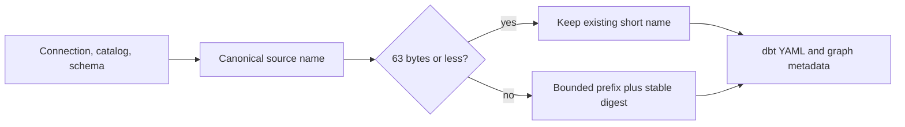
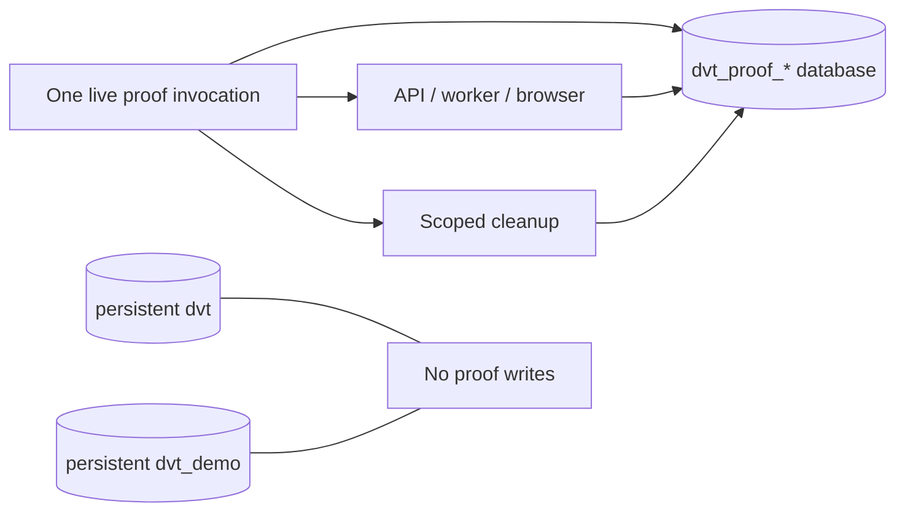

# Local PostgreSQL application and proof-data boundary

## Decision

The local Compose PostgreSQL cluster has distinct databases: `dvt` for product
state and `dvt_demo` for deterministic warehouse examples. `DATABASE_URL` owns
only product state. The local warehouse URL owns fixture seeding, catalog
database metadata and the credential binding used by API and Temporal. This is
a database boundary, not a claim of cluster-level security isolation.

Previously, the local stack used `DATABASE_URL` for both application state and
warehouse examples. Repeated startup could recreate the example tables inside
the state database, while saved Source identities still referred to that same
database. The split removes this shared write target. Existing scoped catalog
and Source references are not rewritten implicitly: a duplicate connection
with the old database is rejected and requires explicit review/rebinding under
ADR-0058. No existing table or workspace file is deleted by this cut.

## Rails and scope

The existing `CreateWarehouseConnection` command and `ListWarehouseConnections`
query own catalog creation and conflict verification. Their bounded context is
Warehouse Source Import, with the warehouse connection catalog as aggregate/read
model and the protected workspace API as application port/adapter. The caller
is restricted to its authorized tenant/project/environment scope. A duplicate
with different database metadata fails. Source preview and `StartRun` continue
to consume the same credential reference; no parallel route or connection
command is introduced.

Local PostgreSQL provisioning is developer-tooling infrastructure supporting
those rails. It creates only the exact `dvt_demo` database and `dvt_demo` role;
the fixture seeder targets only that database. Tests reject a shared database,
wrong credential binding, stale catalog metadata and an unavailable warehouse.

## Delivery and evidence

- #3535 owns the persistent local stack split. A clean workspace must boot on
  ports 3000/5173 and register the protected demo connection.
- #3536 owns disposable, run-scoped databases for live proof runners. Until it
  closes, those older runners are not evidence of the new isolation boundary.
- #3534 owns the overall cut and the eventual disposition of old fixtures and
  generated schemas. Classification and backup precede any deletion.

The older live runners currently generate schemas in persistent `dvt`. Each
runner instead allocates a uniquely named database in the local PostgreSQL
cluster before starting its API. The same run-scoped URL is passed to the API,
warehouse fixture seeder, credential binding, grant setup and cleanup. Normal
completion and caught failures close child processes before dropping that exact
database; SIGINT/SIGTERM invoke the same cleanup. An abrupt host or container
death is not recoverable by an in-process handler, so orphaned names remain
identifiable by a reserved prefix and require inventory before manual removal.

Source Import exposes one further boundary: the generated dbt source name
combines connection, catalog and schema. Those values are individually valid
but their concatenation can exceed the 63-byte PostgreSQL identifier policy,
particularly for a run-scoped database. A graph-draft import then fails after
discovery with a server error. The canonical name builder must bound the final
identifier and append a deterministic digest when truncation is required;
normal short names stay unchanged, and graph metadata and dbt YAML must share
the same name. The existing `ImportWarehouseSources` command remains the sole
owner of the externally visible import behavior.

Governing sources: `AGENTS.md`, ADR-0058, ADR-0061, ADR-0066,
`docs/architecture/command-query-rail-governance.md` and
`docs/architecture/fowler-opportunity-planning-governance.md` and
`docs/guides/ai-work-protocol.md`. Implementation and completion checks are
`node --test scripts/run-local-postgres.test.cjs scripts/run-dev-stack.test.cjs`,
`pnpm lint:md`, `pnpm docs:feature-mechanization:implementation` and
`pnpm verify:prepush`.
