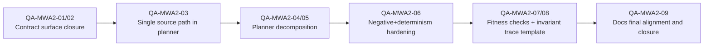

# MW-A2 Hard QA Remediation Roadmap 2026-04-04

## Goal

Track the hard QA findings as a verifiable checklist, with explicit definition of done, sequence, and rationale.

## Rationale comment

The current slice improved boundary hardening, but still carries architectural drift between docs and code.
The remediation strategy is to remove public legacy surfaces first, then close semantic drift in planner internals, then complete target-state tests and architecture guardrails.
This order minimizes product risk because it closes ambiguity at the contract boundary before deeper refactors.

## Findings and opportunities checklist

- [x] `QA-MWA2-01` Remove legacy public planner envelope export from `@dvt/contracts`.
- [x] `QA-MWA2-02` Stop exposing multiple planner input vocabularies (`planner-input.ts` legacy surface policy).
- [x] `QA-MWA2-03` Remove planner internal `nodes` compatibility seam and keep one canonical source path.
- [x] `QA-MWA2-04` Split `PlannerFacade` responsibilities (resolver orchestration, translation, validation, cache).
- [x] `QA-MWA2-05` Isolate DBT-specific translation from planner core policy.
- [ ] `QA-MWA2-06` Complete negative tests for provenance-only identity invariants (`sourceFamily/sourceVersion/metadata` do not change plan identity).
- [ ] `QA-MWA2-07` Add architecture fitness checks to enforce hexagonal boundaries/import ownership.
- [ ] `QA-MWA2-08` Add invariant-to-test trace template (`INV-*` -> test case mapping) as docs gate.
- [ ] `QA-MWA2-09` Align docs to implemented vs planned behavior at every section where target model is referenced.

## Task roadmap

## Definition of Done (DoD)

All items below must be true to close this remediation roadmap:

1. All checklist items are marked complete with linked code/doc/test evidence.
2. No legacy planner public contract is exported from `@dvt/contracts`.
3. Planner boundary has one canonical source path and no undocumented compatibility seam.
4. Planner collaborator responsibilities are decomposed and test-owned.
5. Negative tests cover all listed invariant families and determinism edge cases.
6. Documentation distinguishes implemented behavior from planned behavior without contradiction.
7. Validation baseline passes:
   - `pnpm --filter @dvt/contracts test`
   - `pnpm --filter @dvt/planner test`
   - `pnpm --filter dvt-api test`
   - `pnpm verify:prepush`

## Execution note

First item started in this slice:

- `QA-MWA2-01` Remove legacy public planner envelope export from `@dvt/contracts` (`packages/@dvt/contracts/src/index.ts`).
- `QA-MWA2-02` Remove legacy duplicate planner-envelope module (`packages/@dvt/contracts/src/planner-input.ts`).
- `QA-MWA2-03` Remove top-level `nodes` planner-input seam and enforce `graphSource` as canonical input
  (`packages/@dvt/planner/src/domain/types.ts`,
  `packages/@dvt/planner/src/domain/InputEnvelopeValidator.ts`,
  `packages/@dvt/planner/src/domain/Planner.ts`,
  `packages/@dvt/planner/test/slow/load.test.ts`,
  `packages/@dvt/planner/test/unit/graph.test.ts`,
  `packages/@dvt/planner/test/unit/limits.test.ts`,
  `packages/@dvt/planner/test/unit/step-registry-integration.test.ts`).
- Validation evidence: `pnpm --filter @dvt/planner test`.
- `QA-MWA2-04` Split `PlannerFacade` responsibilities by extracting collaborator modules:
  `PlannerEnvelopeMapper` and `ManifestRefGraphSourceCache`
  (`packages/@dvt/planner/src/application/PlannerEnvelopeMapper.ts`,
  `packages/@dvt/planner/src/application/ManifestRefGraphSourceCache.ts`,
  `packages/@dvt/planner/src/application/PlannerFacade.ts`).
- Validation evidence: `pnpm --filter @dvt/planner build`, `pnpm --filter @dvt/planner test`,
  `pnpm verify:prepush`.
- `QA-MWA2-05` Isolate DBT-specific step-kind translation behind an injectable strategy
  (`packages/@dvt/planner/src/application/StepKindResourceTypeMapper.ts`,
  `packages/@dvt/planner/src/application/PlannerEnvelopeMapper.ts`,
  `packages/@dvt/planner/src/application/PlannerFacade.ts`,
  `packages/@dvt/planner/test/unit/planner-facade.test.ts`).
- Validation evidence: `pnpm --filter @dvt/planner test`, `pnpm verify:prepush`.
