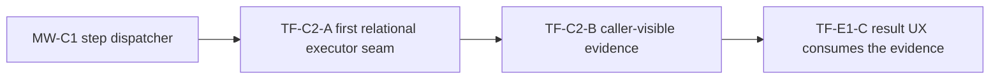

# MW-C1 To TF-C2 Runtime Vertical Sequence Analysis 2026-04-09

## Purpose

Freeze the recommended execution sequence for the first governed runtime
vertical and state, slice by slice, what should be implemented and why.

This is not a second roadmap. It is an analysis document that explains the
already-governed sequence visible across the engine roadmap, the transformation
delivery plan, and the current open task route.

## Governing sources

- [Governance Document And Rule Inventory](../../../status/governance-document-rule-inventory.md)
- [Planning Control Tower](../../../state/planning-control-tower.md)
- [Planning Dashboard](../../../state/planning-dashboard.md)
- [Roadmap Of Record](../../../roadmap/index.md)
- [Roadmap By Domain](../../../roadmap/roadmap-by-domain.md)
- [Open Task Route](../../../state/open-task-route.md)
- [Agent Lane C](../../../state/agent-lane-c.yaml)
- [Engine Roadmap](../../../../architecture/components/engine/roadmap/engine-phases.md)
- [Transformation Flow Proposal Set 2026-04-05](./plan-creation-interface-route-proposal-20260405.md)
- [Transformation Flow Delivery Plan 2026-04-05](./transformation-flow-delivery-plan-20260405.md)
- [Transformation Flow Architecture And Contracts 2026-04-05](./transformation-flow-architecture-and-contracts-20260405.md)
- [TF-C2-B Runtime Read-Surface Evidence Plan 2026-04-08](./tf-c2-b-runtime-read-surface-evidence-plan-20260408.md)
- [Current Status](../../../../architecture/system-delivery-status.md)

## Why this document exists

The active planning surfaces already imply the sequence:

1. `MW-C1`
2. `TF-C2-A`
3. `TF-C2-B`

What was missing was one short document that explains why this order is
correct, what each slice actually changes, and why adjacent queued work should
not jump ahead of it.

## Recommended sequence

| Order | Slice     | What will be implemented                                                                                                                                               | Why this slice goes here                                                                                                                                                                                                   |
| ----- | --------- | ---------------------------------------------------------------------------------------------------------------------------------------------------------------------- | -------------------------------------------------------------------------------------------------------------------------------------------------------------------------------------------------------------------------- |
| `1`   | `MW-C1`   | Temporal step dispatch moves from direct `DbtStepActivity` coupling to a `StepActivityDispatcher` keyed by `StepKind`.                                                 | The runtime must stop assuming dbt-only execution before the first relational SQL executor seam is introduced. Otherwise the new vertical arrives on top of the same execution bottleneck the roadmap is trying to remove. |
| `2`   | `TF-C2-A` | The first relational SQL executor seam for persisted plans, with PostgreSQL as the reference implementation and proof environment.                                     | Once dispatch is generic enough, the first real non-dbt execution path can be added without hard-coding a second special case into the workflow layer.                                                                     |
| `3`   | `TF-C2-B` | Caller-visible runtime evidence on `GET /runs/:runId` and `GET /runs/:runId/events`: executor identity, sink materialization, row counts, and failed-step diagnostics. | Evidence belongs after a real executor path exists. Before `TF-C2-A`, the read surface can only expose placeholders or partial semantics.                                                                                  |

## Sequence rationale in one diagram

## Current-state diagnosis

Three facts govern the sequence:

1. the engine roadmap says the active runtime path after recent signal cleanup
   is `MW-C1` plus `TF-C2-A/B`
2. Lane C keeps `MW-C1` queued as the execution-layer blocker for
   multi-workflow support
3. `TF-C2-B` is already partially advanced in docs and contract reasoning, but
   it still depends on real executor payloads from `TF-C2-A` and evidence
   linkage from `TF-B1-B`

That means the right next move is not "the smallest queued task." The right
next move is the first slice that removes the execution-model blocker on the
vertical.

## Slice 1 - `MW-C1`

### What will be implemented

- Introduce a `StepActivityDispatcher` in the Temporal execution path.
- Move step execution routing out of direct `DbtStepActivity` assumptions.
- Route known dbt step kinds through the existing dbt activity implementation.
- Throw a typed `UnsupportedStepKindError` for unregistered step kinds.
- Make new step kinds additive by registration, not by editing workflow control
  flow.

### Rationale

This slice is the architectural hinge between dbt-first execution wiring and a
general step-kind runtime.

Without it, `TF-C2-A` would have only two bad options:

- bend PostgreSQL execution into dbt-shaped runtime assumptions; or
- add another hard-coded branch inside workflow execution.

Both options increase the exact drift that `MW-C1` exists to remove.

### Why now

- `MW-C1` is `P0` and strictly unblocked in the open route.
- The engine roadmap explicitly puts `MW-C1` ahead of `TF-C2-A/B`.
- It unlocks the runtime vertical without forcing a second architecture clean-up
  pass afterward.

### Non-goals

- deliver a full non-dbt external SDK
- add all future step kinds immediately
- reopen a multi-provider runtime program

## Slice 2 - `TF-C2-A`

### What will be implemented

- Add a capability-oriented relational SQL executor seam for persisted
  SQL-first plans.
- Provide PostgreSQL as the first implementation of that seam.
- Resolve the persisted plan into executable relational SQL-oriented steps.
- Define success and failure behavior for the PostgreSQL implementation.
- Establish the repeatable Docker PostgreSQL proof environment for local
  acceptance, reset, and rerun.

### Rationale

This is the first slice that turns the persisted `PlanRef` path into a real
execution path instead of a contract-only promise.

`TF-C1-B` already returns a real persisted `PlanRef`. The next runtime truth
the product needs is the ability to execute that plan against the locked v1
target, PostgreSQL.

The architectural rule, however, is not "bake PostgreSQL into the core." The
rule is "introduce the executor seam at the capability level, then land
PostgreSQL as the first implementation."

### Capability boundary rule

The seam introduced by `TF-C2-A` should be defined by execution capability, not
by vendor name.

The correct shape is something close to a relational SQL materialization
executor, for example:

- a relational SQL executor capability in the runtime layer
- PostgreSQL as the first implementation
- Oracle as a plausible future implementation of the same capability

The wrong shape would be a fake generic abstraction that treats PostgreSQL,
Oracle, and Kafka as implementations of the same semantic contract.

Kafka does not fit the same capability boundary cleanly. If it becomes active
work, it should likely arrive as:

- a different `StepKind`
- a different provider profile
- or a different executor capability

not as "another relational SQL executor."

### Why after `MW-C1`

Because the first relational SQL executor should arrive as a registered
execution route, not as a second special case bolted into dbt-only
orchestration. If `MW-C1` does not land first, `TF-C2-A` either:

- duplicates routing logic in the workflow; or
- smuggles provider-specific semantics into the engine core.

### Non-goals

- freeze PostgreSQL as the universal execution contract for all future runtimes
- caller-visible evidence payload finalization
- frontend result rendering
- dbt phase-2 execution mode

## Slice 3 - `TF-C2-B`

### What will be implemented

- Extend the runtime read surfaces:
  - `GET /runs/:runId`
  - `GET /runs/:runId/events`
- Expose normalized execution evidence when available:
  - executor identity
  - materialization target
  - rows written
  - step-attributed failure diagnostics
  - timestamps for operator reconstruction

### Rationale

This slice closes the operator trust loop. The product does not become usable
only because a run executes; it becomes inspectable only when the runtime can
tell the caller what happened without backend log access.

This also feeds the dependent frontend slice `TF-E1-C`, which is supposed to
render result evidence, not infer it.

### Why after `TF-C2-A`

The read-surface contract should be shaped around real executor outputs, not
around guessed or placeholder fields.

`TF-C2-B` already has meaningful analysis and partial progress, but its own lane
state says that full closure still depends on real executor payload emission
from `TF-C2-A` and evidence linkage from `TF-B1-B`.

### Non-goals

- UI rendering changes
- backend log aggregation
- broad result analytics beyond the first runtime-evidence contract

## Why other queued work is not first

### `AR-D1`

Important, but it is scale and freshness hardening. It improves `O(n)` replay
behavior for stale snapshots; it does not unblock the first runtime vertical.

### `RC-G1-B`

Important, but it is ownership hygiene in Lane A. It reduces contract drift,
not the first end-to-end execution gap.

### `F-01`

Useful for shell ergonomics, but it is not on the critical path of
`persisted PlanRef -> relational execution seam -> runtime evidence`.

### `AR-B3`

A good determinism hardening slice, but smaller and orthogonal. It should not
replace the runtime-vertical sequence as the primary next move.

## Acceptance rule for the sequence

Treat the sequence as materially complete only when:

1. `MW-C1` removes dbt-only runtime dispatch assumptions
2. `TF-C2-A` lands a capability-oriented relational executor seam and proves it
   with one persisted SQL-first plan running against PostgreSQL in the governed
   Docker proof environment
3. `TF-C2-B` exposes normalized runtime evidence on the caller-visible read
   surfaces
4. Lane E can then consume those surfaces in `TF-E1-C` without inventing local
   result semantics

## Recommended execution rule

If only one runtime slice is started next, start `MW-C1`.

If the goal is the first operator-visible runtime vertical, execute this chain
without reordering:

1. `MW-C1`
2. `TF-C2-A`
3. `TF-C2-B`

This is the shortest path that removes the architectural blocker, delivers a
real execution path, and then makes the outcome inspectable.
