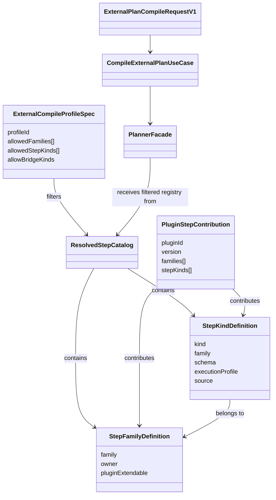
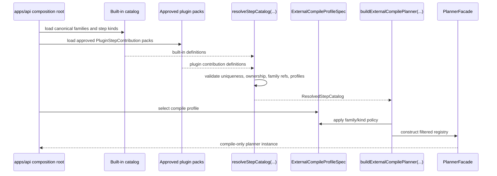
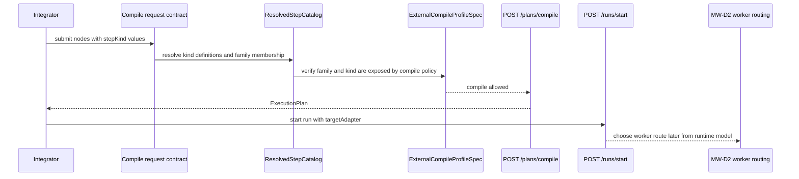
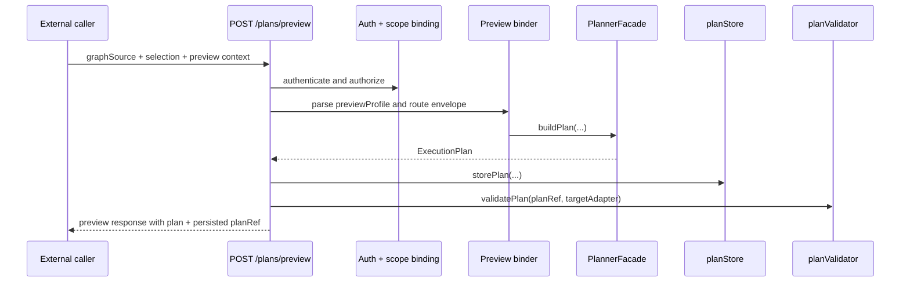
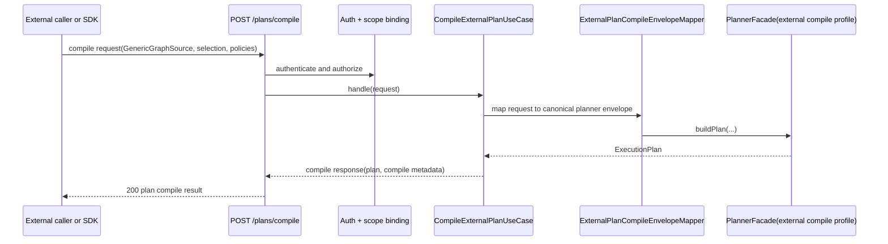
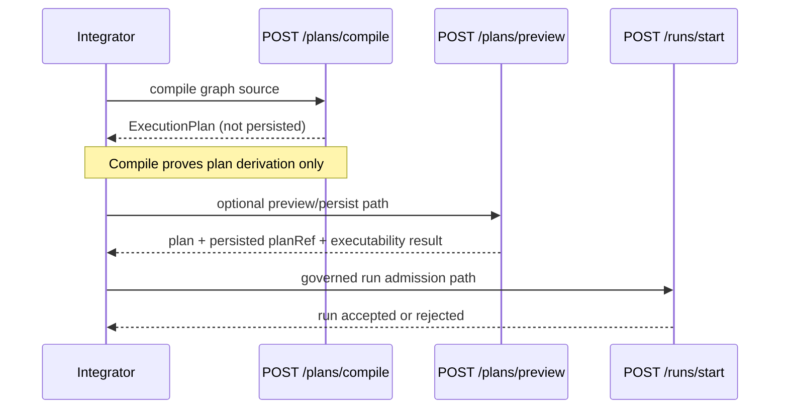
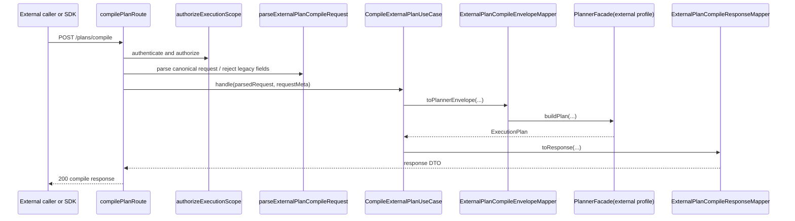

# MW-D1 External Plan Definition SDK/API Plan 2026-04-17

## Purpose

Freeze the think-first and implementation route for `MW-D1`.

`MW-A1`, `MW-A2`, and `MW-C1` already changed the repo posture materially:

- `GenericGraphSourceV1` is the canonical planner ingress
- step-kind validation is governed by `StepKindRegistry`
- runtime dispatch is no longer forced through a dbt-only workflow path

What is still missing is the product-facing authoring boundary.

Today the repo can compile generic graphs internally, but it does not yet offer
one canonical external boundary that says:

- how a non-dbt caller submits a graph
- how the system compiles that graph into `ExecutionPlan`
- which concerns belong to compile only versus preview, persistence, and run
  admission

This proposal defines that boundary before implementation starts.

## Non-dbt-first product rule

`MW-D1` must not ship as a dbt-first external boundary.

That means:

- the public compile DTO must be generic and step-kind-oriented
- the first public example must be non-dbt
- the first acceptance fixture must be non-dbt
- the external compile composition must not be "dbt defaults plus generic
  exceptions"
- dbt may remain supported as one adapter family, but it must not define the
  external authoring story

## Governing sources

- `AGENTS.md`
- `docs/guides/ai-work-protocol.md`
- `docs/planning/state/planning-control-tower.md`
- `docs/adr/ADR-0003-execution-model.md`
- `docs/adr/ADR-0012-plan-integrity-ownership.md`
- `docs/adr/ADR-0017_ExecutionPlan_Schema_Versioning.md`
- `docs/adr/ADR-0034-bounded-context-boundaries-and-communication-rules.md`
- `docs/adr/ADR-0035-planner-public-contract-evolution-protocol.md`
- `docs/planning/proposals/mandatory/runtime-and-contracts/dvt-dbt-agnostic-generalization-plan-20260403.md`
- `docs/planning/proposals/mandatory/runtime-and-contracts/mw-a2-generic-graph-source-plan-20260404.md`
- `docs/architecture/components/api/api-current-to-target-architecture.md`
- `docs/architecture/components/planner/planner-ddd.md`
- `docs/planning/reviews/architecture-and-governance/20260402-deep-architectural-review.md`

## Current baseline

The repository is no longer blocked on the original dbt-first planner ingress.

What already exists in code:

- `PlannerFacade` accepts canonical `graphSource`
- `resolveCanonicalPlannerInputEnvelope(...)` builds the governed planner
  envelope in API code
- `POST /plans/preview` already compiles a plan from `graphSource`
- `packages/@dvt/planner/examples/generic-pipeline.ts` proves the planner can
  build non-dbt plans when a generic `stepFactory` and registry are injected
- `packages/@dvt/planner/test/unit/planner-facade.test.ts` proves
  non-dbt `stepKind` support is composition-owned rather than forbidden by the
  planner core itself

What is still not frozen:

- the external compile contract
- the SDK/API ownership line
- the dedicated application service for compile-only behavior
- the external compile composition root for non-dbt step kinds

## User stories

The current planning set is already strong enough to infer the first canonical
user stories for `MW-D1`.

Only product-facing stories are recorded here.

Legacy, compatibility, and transition-only concerns are intentionally excluded
from this section.

### External compile boundary

- As an external workflow integrator, I want to submit a generic graph
  definition to a dedicated compile endpoint, so that I can derive an
  `ExecutionPlan` without speaking dbt manifest.
- As an external workflow integrator, I want the compile boundary to accept
  non-dbt-first step kinds, so that I can define workflows built from generic
  runtime capabilities instead of dbt-only semantics.
- As an external workflow integrator, I want compile to return the derived
  `ExecutionPlan` together with explicit compile metadata, so that I know the
  result is not persisted and not executability-validated.
- As a tenant-scoped operator or system integration, I want the compile
  endpoint to honor protected runtime scope, so that compilation respects
  tenant, project, and environment boundaries.
- As an SDK consumer, I want a thin client over the same canonical compile
  contract, so that multiple runtimes can call one governed boundary without
  creating a second contract authority.
- As a platform consumer, I want compile output to be deterministic for the
  same graph intent, so that repeated compile calls remain stable and
  verifiable.

### Canonical catalog and family model

- As a platform owner, I want one canonical catalog of step families and step
  kinds accepted by external compile, so that the boundary fails closed instead
  of relying on route-local allowlists.
- As a platform owner, I want every step kind to declare an explicit family, so
  that policy, documentation, and runtime routing can group behavior without
  inferring semantics from string naming conventions.
- As a plugin author, I want to contribute new families and step kinds through
  a typed contribution contract, so that the system stays extensible without
  creating a second contract authority.
- As an API owner, I want compile profiles to select families and step kinds
  through typed configuration, so that boundary policy can evolve without
  scattering inline hardcodes through route code.
- As an integrator, I want node semantics, family classification, runtime
  adapter choice, and worker routing to remain separate decisions, so that a
  `DBT_MODEL` node and a `POSTGRES_SQL_TRANSFORM` node are not confused with
  provider selection or deployment routing.

## Think-First Analysis

### Problem summary

`GenericGraphSourceV1` is canonical inside the system, but external integrators
still do not have one stable compile boundary.

The closest route, `POST /plans/preview`, is not a mature external authoring
surface because it bundles:

- protected runtime authorization and route context
- preview profile policy
- plan persistence
- executability validation
- preview-oriented response metadata

That shape is correct for operator preview and admission, but it is not the
same thing as an external authoring API.

### Root cause

`MW-A2` corrected the planner ingress and `MW-C1` corrected execution routing,
but neither slice productized the authoring boundary.

The current system therefore has a real internal compile path and an operator
preview path, but no explicit external compile-only boundary.

In Fowler terms, the repo has the domain service and application orchestration,
but it has not yet published the correct remote facade for external callers.

### Constraints and invariants

- `GenericGraphSourceV1` remains the only canonical planner ingress.
- External plan definition must not reintroduce dbt-native planner ingress.
- External plan definition must be multi-workflow-first in naming, examples,
  fixtures, and composition.
- `@dvt/planner` remains deterministic and pure; compile IO belongs outside the
  domain service.
- Compile-only and preview-persist-run are separate application concerns.
- The compile boundary must not silently persist a plan or imply runtime
  executability.
- The compile boundary must reuse the existing shared contracts and planner
  domain instead of inventing a second plan model.
- External SDKs are gateways over the canonical contract, not independent
  authorities.
- TDD starts only after the request/response contract, composition model, and
  negative paths are frozen.

### Phase 0 check of mature systems and existing examples

Existing repo examples examined:

- `packages/@dvt/planner/examples/generic-pipeline.ts`
- `packages/@dvt/planner/examples/dbt-workflow.ts`
- `apps/api/src/entrypoints/http/planRoutes.ts`
- `apps/api/test/entrypoints/http/planRoutes.test.ts`

External mature-system posture considered:

- Apache Airflow public authoring interface and Task SDK:
  stable DAG authoring must be decoupled from scheduler internals
- Dagster declarative definitions:
  authoring should stay code-first and testable before orchestration
- Prefect flows and deployments:
  flow definition and remote deployment/execution metadata should stay
  distinct concerns

What to copy:

- one stable authoring-facing interface
- pure compile semantics before execution
- explicit separation between definition, persistence, and runtime deployment

What not to copy:

- provider-specific authoring lock-in
- a second hidden contract authority
- deployment metadata mixed into the compile DTO
- a compatibility-first story where dbt still acts as the implicit default

Libraries evaluated:

- No new library adopted for the planning slice.
- OpenAPI-first SDK generation was considered and rejected as the contract
  authority because the repo already uses `@dvt/contracts` as the governed,
  versioned boundary source.

### Options considered

#### Option A. Reuse `POST /plans/preview` as the external API

Expose the existing preview route as the official multi-workflow authoring
surface and add only documentation around it.

Pros:

- minimum implementation effort
- no new route or application service

Cons:

- compile remains coupled to persistence and executability validation
- external callers inherit `previewProfile`, `targetAdapter`, and preview-only
  semantics that do not belong to compile-only use
- the route response implies preview lifecycle instead of pure compilation

#### Option B. Add a dedicated compile API and keep preview for operator flows

Introduce one explicit compile-only boundary such as `POST /plans/compile`,
backed by a dedicated application service and a composition-owned external
compile planner configuration.

Pros:

- compile becomes a clear remote facade
- preview-persist-run stays intact for operator workflows
- the boundary can return `ExecutionPlan` without persistence side effects
- non-dbt compilation can be enabled through one governed composition root

Cons:

- requires a new request/response contract and route wiring
- requires an explicit external compile planner configuration instead of the
  default dbt-only composition

#### Option C. Publish only an in-process SDK over `@dvt/planner`

Treat `@dvt/planner` as the product-facing integration surface and skip the
remote API boundary.

Pros:

- pure compile semantics
- easy for TypeScript consumers inside the repo

Cons:

- not useful for Python, Spark, or non-Node clients
- leaks internal package composition into product integration
- does not establish a real network boundary for mature deployment

### Selected option and rationale

Select **Option B**.

The repository already has the right internal building blocks:

- a deterministic planner core
- a canonical graph contract
- a governed step-kind registry
- a testable operator preview flow

What is missing is a clean remote facade for external compilation.

`MW-D1` should therefore publish a compile-only API boundary first and treat
SDKs as optional gateways over that boundary, not as the new authority.

It should also make the first public compile path non-dbt by default. The
external compile route must demonstrate a graph such as `API_CALL`,
`PYTHON_SCRIPT`, or `SPARK_JOB` first, with dbt kept as a supported adapter
path rather than as the narrative default.

### Rejected alternatives

- Reusing `POST /plans/preview` as the external authoring contract:
  rejected because it fuses compile, persistence, and executability concerns.
- Publishing only an in-process SDK:
  rejected because it fails the external integration use case.
- Generating the product contract from OpenAPI first:
  rejected because it would create a second contract-authority center next to
  `@dvt/contracts`.

## DDD boundary map

| Bounded context    | Responsibility                                                     | Must not own                          |
| ------------------ | ------------------------------------------------------------------ | ------------------------------------- |
| External Authoring | caller-facing graph definition DTO and SDK gateway                 | planner internals or plan persistence |
| API Admission      | authn/authz, request parsing, rate limits, response contract       | planner-domain semantics              |
| Planning Domain    | deterministic graph validation and `ExecutionPlan` assembly        | HTTP, persistence, adapter lifecycle  |
| Plan Lifecycle     | preview persistence, executability validation, import by `planRef` | external compile-only authoring       |

`MW-D1` ends at the Planning Domain output.

It does not own:

- plan persistence
- adapter executability validation
- run admission
- worker routing

## Fowler-style system model

### Collaborator roles

| Fowler-style role    | Proposed owner                                                   | Responsibility                                                          |
| -------------------- | ---------------------------------------------------------------- | ----------------------------------------------------------------------- |
| Remote Facade        | `POST /plans/compile`                                            | expose compile-only behavior to external callers                        |
| Service Layer        | `CompileExternalPlanUseCase`                                     | coordinate auth-bound compile behavior without persistence side effects |
| Data Transfer Object | `ExternalPlanCompileRequestV1` / `ExternalPlanCompileResponseV1` | canonical network contract                                              |
| Mapper               | `ExternalPlanCompileEnvelopeMapper`                              | translate request DTO into canonical planner envelope                   |
| Domain Service       | `PlannerFacade`                                                  | deterministic plan compilation                                          |
| Gateway              | thin SDK client                                                  | convenience wrapper around the remote facade                            |
| Composition Root     | `apps/api` protected runtime module                              | own the external compile planner configuration                          |

### Contract, code, and configuration ownership line

| Concern                                                          | Form                     | Proposed owner                                        | Must not become                                  |
| ---------------------------------------------------------------- | ------------------------ | ----------------------------------------------------- | ------------------------------------------------ |
| `ExternalPlanCompileRequestV1` / `ExternalPlanCompileResponseV1` | shared contract          | `@dvt/contracts`                                      | route-local DTOs or SDK-private shapes           |
| compile SDK client                                               | thin gateway             | SDK owner over the canonical API                      | a second contract authority                      |
| compile-only orchestration                                       | application service      | `apps/api`                                            | JSON-configured behavior or route-local logic    |
| step family and step kind definitions                            | governed catalog entries | `@dvt/contracts` or approved plugin contribution pack | ad hoc allowlists in routes or adapters          |
| external compile boundary selection                              | typed profile spec       | `apps/api` composition root                           | free-form JSON with embedded schemas or handlers |
| planner instantiation                                            | builder/factory code     | `apps/api` composition root                           | inline literals spread through transport modules |

The rule is strict:

- contracts define caller-visible shape
- code defines behavior, schemas, and handlers
- typed profile specs define boundary policy

JSON or YAML may later express deploy-time enablement of predeclared profiles or
approved plugin packs, but they must not become the authority for step-family
semantics, schema definitions, or planner behavior.

### Semantic axes and decision ownership

One source of confusion in multi-workflow design is mixing together four
different decisions that belong to different layers.

| Axis            | Meaning                                                       | Chosen where                       | Example                                            | Must not be confused with   |
| --------------- | ------------------------------------------------------------- | ---------------------------------- | -------------------------------------------------- | --------------------------- |
| `stepKind`      | semantic meaning of one node                                  | graph contract                     | `DBT_MODEL`, `POSTGRES_SQL_TRANSFORM`, `SPARK_JOB` | runtime provider            |
| `family`        | taxonomy grouping for kinds                                   | canonical catalog                  | `dbt`, `sql_transform`, `spark`                    | step execution handler      |
| `targetAdapter` | runtime or orchestration provider used at start-run time      | run admission contract             | `temporal`, `mock`                                 | node semantics              |
| `workerRoute`   | deployment or task-queue routing for execution infrastructure | runtime deployment model (`MW-D2`) | `spark-worker`, `dbt-worker`                       | external compile policy     |
| `pluginPack`    | source of contributed families and kinds                      | approved contribution pack         | `acme-spark-plugin`                                | boundary contract authority |

The rule is:

- `stepKind` differentiates a dbt node from a SQL node
- `family` groups related kinds for policy and documentation
- `targetAdapter` selects the runtime provider that orchestrates execution
- `workerRoute` remains a later runtime-deployment decision

Compile owns only the first two directly and may be filtered by profile policy.
Run admission owns `targetAdapter`. Worker routing belongs to `MW-D2`, not to
the compile boundary.

### Illustrative typed policy configuration

The boundary policy should be declarative, but still typed and code-owned.

Illustrative shape:

```ts
const externalCompileProfile: ExternalCompileProfileSpec = {
  profileId: 'external-compile-v1',
  allowedFamilies: ['sql_transform', 'spark'],
  allowedStepKinds: ['PREPARE_POSTGRES_TRANSFORM', 'POSTGRES_SQL_TRANSFORM', 'SPARK_JOB'],
  allowBridgeKinds: false,
};
```

What this does:

- selects from the resolved catalog
- exposes one explicit authoring surface
- keeps the route free of inline policy literals

What this does not do:

- define schemas
- define handlers
- create new step kinds dynamically
- choose `targetAdapter`
- choose worker routing

### Structural design correction for SRP

The functional boundary above is necessary, but not sufficient.

The implementation must also fix the current structural drift that mixes
transport, application orchestration, and compile-profile policy.

Current drift to remove:

- `planRoutes.ts` co-locates preview, import, and compile concerns even though
  they have different application responsibilities
- the compile route still risks owning request parsing, legacy-field rejection,
  canonical-envelope mapping, planner invocation, and response shaping in one
  transport module
- the compile planner profile can easily regress into a composition module that
  carries a literal step-kind policy catalog inline
- route-level code can accidentally import planner-facing policy details such as
  allowed step kinds or schema bindings

Target module split:

| Module                              | Proposed home                                                            | Owns                                                                            | Must not own                                                               |
| ----------------------------------- | ------------------------------------------------------------------------ | ------------------------------------------------------------------------------- | -------------------------------------------------------------------------- |
| `compilePlanRoute`                  | `apps/api/src/entrypoints/http/compilePlanRoute.ts`                      | HTTP request/response, auth failure mapping, delegation to the use case         | planner-envelope mapping, profile policy, response business semantics      |
| `parseExternalPlanCompileRequest`   | `apps/api/src/entrypoints/http/externalPlanCompileRequestParser.ts`      | canonical request parsing, scope extraction, rejection of legacy ingress fields | planner calls, auth, response shaping                                      |
| `CompileExternalPlanUseCase`        | `apps/api/src/application/services/compileExternalPlanUseCase.ts`        | compile-only orchestration, planner call, compile metadata result               | Fastify types, HTTP status handling, persistence, executability validation |
| `ExternalPlanCompileEnvelopeMapper` | `apps/api/src/application/services/externalPlanCompileEnvelopeMapper.ts` | request DTO to canonical planner envelope mapping                               | auth, HTTP concerns, profile policy                                        |
| `ExternalPlanCompileResponseMapper` | `apps/api/src/entrypoints/http/externalPlanCompileResponseMapper.ts`     | network response contract shaping                                               | planner invocation, persistence policy                                     |
| `ExternalCompileProfileSpec`        | `apps/api/src/modules/externalCompileProfileSpec.ts`                     | one canonical declaration of allowed external compile step kinds and schemas    | planner instantiation, route logic                                         |
| `buildExternalCompilePlanner`       | `apps/api/src/modules/buildExternalCompilePlanner.ts`                    | instantiate `PlannerFacade` from the compile profile spec                       | inline profile literals spread across the composition root                 |

Implementation rule:

- `compile` must move out of the multi-endpoint `planRoutes.ts` module into its
  own route file before the slice is considered structurally complete
- preview and import may stay as separate concerns, but compile must not remain
  attached to preview-oriented transport code
- the use case must accept plain data and return plain data; Fastify request and
  reply types stay at the route boundary

### Compile planner composition rule

The external compile path must not depend on the default dbt-only planner
composition.

Instead it should use one composition-owned compile planner profile that:

- reuses `PlannerFacade`
- injects a governed registry for the externally allowed step kinds with a
  non-dbt-first baseline
- injects a pass-through `stepFactory` for compile-only plan assembly
- does not claim runtime executability for kinds that are not validated against
  a target adapter

That profile must itself be split into:

- a pure `ExternalCompileProfileSpec` that declares the allowed step kinds once
- a factory `buildExternalCompilePlanner(...)` that turns the spec into a
  `PlannerFacade`

Hardcode elimination rule:

- allowed external step kinds are policy, not route logic
- the policy may be expressed as code, but only in the dedicated profile-spec
  module
- `compilePlanRoute`, `CompileExternalPlanUseCase`, and the envelope mapper
  must not import raw schema literals or `KNOWN_STEP_KINDS`
- the protected runtime module may choose the profile, but it must not inline
  the profile catalog

The first profile must not be built by starting from the dbt-only default and
patching generic kinds on top. It must be an explicit external-authoring
profile where non-dbt kinds are first-class and dbt is optional.

This lets `MW-D1` compile non-dbt graphs truthfully without pretending that
compile implies runnable-by-default.

### Canonical catalog and plugin contribution model

The compile profile is policy over a resolved catalog. It is not a bag of
inline literals.

Target objects:

| Object                       | Responsibility                                                                    | Proposed home                                         | Notes                                                         |
| ---------------------------- | --------------------------------------------------------------------------------- | ----------------------------------------------------- | ------------------------------------------------------------- |
| `StepFamilyDefinition`       | canonical family identity, owner, description, extension policy                   | `@dvt/contracts` or approved plugin contribution pack | every `stepKind` belongs to exactly one family                |
| `StepKindDefinition`         | canonical step kind, schema, execution profile, family reference, source metadata | `@dvt/contracts` or approved plugin contribution pack | replaces scattered `kind -> schema` maps                      |
| `PluginStepContribution`     | typed contribution pack for plugin-owned families and kinds                       | plugin package + shared contract shape                | must be validated before admission into the resolved catalog  |
| `ResolvedStepCatalog`        | merged and validated catalog used by compile composition                          | `apps/api` composition root                           | built from built-ins plus approved plugin contributions       |
| `ExternalCompileProfileSpec` | typed selection of families and kinds exposed by one compile boundary             | `apps/api` composition root                           | filters the resolved catalog for the external compile planner |

The compile boundary therefore owns a typed policy spec, not raw strings in
route code.

### Object relationship diagram



### Catalog resolution sequence



### Semantic decision sequence



Interpretation:

- `stepKind` enters at compile time
- `family` comes from the catalog
- `targetAdapter` enters at run-start time
- worker routing stays outside the compile contract

### Extension rules for new families

- A new family requires one `StepFamilyDefinition` plus at least one
  `StepKindDefinition`.
- A new step kind in an existing family must reference that family explicitly;
  family membership is never inferred from naming.
- A plugin contribution may contribute a family, step kinds, or both, but the
  contribution must resolve into the same catalog model as built-ins.
- `ExternalCompileProfileSpec` is the only place where the external compile
  boundary chooses which families and kinds are exposed.
- Builders must reject duplicate family ids, duplicate step kinds, orphan step
  kinds, and contributions with missing execution profile metadata.
- Builders must reject compile profiles that reference families or kinds absent
  from the resolved catalog.
- A companion guide records the extension protocol:
  [External compile catalog extension technical manual](../../../../guides/external-compile-catalog-extension-technical-manual-20260417.md)

### No legacy or compatibility bridge rule

`MW-D1` does not preserve legacy compile ingress for convenience.

The canonical external compile boundary accepts only
`ExternalPlanCompileRequestV1`.

The route parser must reject these fields instead of silently adapting them:

| Forbidden field                      | Why it is rejected                                    |
| ------------------------------------ | ----------------------------------------------------- |
| `previewProfile`                     | preview lifecycle concern, not compile                |
| `persist`                            | persistence concern, not compile                      |
| `planRef`                            | import concern, not compile                           |
| `selectedNodeIds`                    | preview-era alias; compile uses canonical `selection` |
| `provenance`                         | preview/import concern                                |
| `manifestRef` / `manifest` / `nodes` | legacy dbt-first or pre-canonical ingress             |

No compatibility mapper is allowed from preview payloads, manifest-shaped
payloads, or older compile aliases into the new request DTO.

## Current-state sequence

This is the current closest path to external authoring, but it is still a
preview route:



Why this is not the external boundary:

- persistence is mandatory
- executability validation is mandatory
- preview profile is mandatory
- the response shape is lifecycle-oriented, not compile-oriented

## Target compile-only sequence



Rules locked by this sequence:

- no `planStore.storePlan(...)`
- no `planValidator.validatePlan(...)`
- no preview profile branching
- no manifest-specific ingress at the canonical boundary
- no legacy alias fallback

## Compile-to-execution handoff sequence

Compilation and execution stay separate:



This keeps `MW-D1` honest:

- compile is not preview
- compile is not persistence
- compile is not run admission

## Target internal sequence

This is the structural target inside `apps/api`:



Locked design rules:

- the route is a remote facade only
- the use case owns compile orchestration only
- the mapper owns canonical-envelope translation only
- the response mapper owns network-shape presentation only
- the profile spec owns allowed-step policy only
- no module above owns more than one of those concerns

## Benchmark posture from mature systems

| Mature system posture                  | What DVT should copy                                 | What DVT should avoid                                  |
| -------------------------------------- | ---------------------------------------------------- | ------------------------------------------------------ |
| Airflow stable authoring interface     | authoring API stays decoupled from runtime internals | scheduler-shaped authoring DTOs in the public boundary |
| Dagster declarative definitions        | compile remains testable and definition-first        | importing a broader asset-platform model than needed   |
| Prefect definition vs deployment split | compile and execution lifecycle stay separate        | treating remote deployment metadata as compile input   |

The shared design lesson is simple:

- define workflows through one stable interface
- keep compilation side-effect free
- keep execution lifecycle behind a later boundary
- do not present one incumbent adapter family as the public authoring default

## Architecture artifact package of record

`MW-D1` now has two canonical documentation layers:

1. this proposal is the executable implementation plan
2. the target-state architecture manual is the technical reference package

Canonical technical reference:

- [External compile target architecture technical manual](../../../../guides/external-compile-target-architecture-technical-manual-20260417.md)
- [External compile catalog extension technical manual](../../../../guides/external-compile-catalog-extension-technical-manual-20260417.md)

The implementation plan owns:

- roadmap waves
- backlog slices
- user-story mapping
- delivery sequencing
- acceptance gates

The technical manual owns:

- C4 system, container, and component views
- DDD boundary map and domain model
- aggregate roots and application roots
- ports and adapters inventory
- class and object relationships
- target-state sequence diagrams

## Executable roadmap

| Wave | Goal                                                        | Primary outputs                                                                                 | Depends on       |
| ---- | ----------------------------------------------------------- | ----------------------------------------------------------------------------------------------- | ---------------- |
| `W0` | freeze target architecture and delivery contract            | user stories, DDD package, C4 package, ports and aggregate definitions, executable backlog      | `MW-A2`, `MW-C1` |
| `W1` | harden the compile boundary contract                        | stable compile request/response contract, negative legacy-ingress rules, compile-only semantics | `W0`             |
| `W2` | split compile transport from compile orchestration          | dedicated route file, parser, response mapper, compile use case                                 | `W1`             |
| `W3` | replace inline compile policy with a resolved catalog model | profile spec, catalog resolver, family and kind inventory, plugin contribution seam             | `W2`             |
| `W4` | make the boundary product-facing                            | SDK gateway, non-dbt-first examples, acceptance fixtures, operator-facing documentation         | `W3`             |
| `W5` | converge runtime handoff and future worker routing          | explicit compile-to-run handoff, `MW-D2` handoff package, residual-risk register                | `W4`, `MW-D2`    |

Interpretation:

- `MW-D1` owns compile authoring and compile policy
- `MW-D2` owns execution routing by worker or queue
- runtime provider selection remains on the run-admission side

## Executable backlog

| Work package | Intent                                | Architectural concern    | Deliverables                                                                              | Acceptance gate                                                   |
| ------------ | ------------------------------------- | ------------------------ | ----------------------------------------------------------------------------------------- | ----------------------------------------------------------------- |
| `MW-D1-B1`   | freeze compile contract and semantics | public boundary          | canonical request/response schemas, compile metadata rules, legacy rejection matrix       | compile contract exists and rejects legacy ingress explicitly     |
| `MW-D1-B2`   | isolate compile transport             | API entrypoint SRP       | `compilePlanRoute`, request parser, response mapper, auth-bound transport tests           | compile leaves `planRoutes.ts` preview/import concerns behind     |
| `MW-D1-B3`   | isolate compile orchestration         | application layer SRP    | `CompileExternalPlanUseCase`, envelope mapper, plain-data boundaries                      | route no longer owns planner orchestration details                |
| `MW-D1-B4`   | formalize target catalog model        | planner policy ownership | `StepFamilyDefinition`, `StepKindDefinition`, resolved catalog seam, compile profile spec | policy is catalog-driven and fail-closed                          |
| `MW-D1-B5`   | define plugin contribution protocol   | extensibility            | `PluginStepContribution`, contribution validation rules, typed profile selection          | plugin packs do not become a second contract authority            |
| `MW-D1-B6`   | publish target architecture package   | architecture definition  | C4, DDD, ports, aggregates, class relations, sequence diagrams                            | target architecture is navigable without reverse-engineering code |
| `MW-D1-B7`   | publish product-facing entry package  | adoption                 | SDK contract notes, examples, non-dbt fixtures, usage guidance                            | one non-dbt-first path is documented and testable                 |
| `MW-D1-B8`   | hand off to runtime routing           | architecture continuity  | compile-to-run boundary notes, `MW-D2` dependency contract, residual risks                | compile architecture stops before worker routing cleanly          |

## Work-package execution contract

Every `MW-D1-B*` backlog package is only executable if it carries all of the
following:

1. one owning architecture note or guide update
2. one explicit boundary statement saying what the package must not own
3. one validation note describing the negative paths the package must prove
4. one dependency statement showing what earlier package must land first
5. one user-story tie-back so delivery stays product-facing rather than purely
   structural

Execution rule:

- architecture packages may land as planning-only work
- implementation packages must not start until the owning architecture package
  is frozen
- runtime-routing work stays out of scope until the `MW-D2` handoff package
  opens

## User-story to backlog mapping

| User-story theme                                   | Backlog packages                   |
| -------------------------------------------------- | ---------------------------------- |
| external compile-only authoring boundary           | `MW-D1-B1`, `MW-D1-B2`, `MW-D1-B3` |
| canonical family and kind catalog                  | `MW-D1-B4`                         |
| plugin-backed extensibility without contract drift | `MW-D1-B5`                         |
| architecture clarity for contributors              | `MW-D1-B6`                         |
| SDK and non-dbt-first adoption path                | `MW-D1-B7`                         |
| clean handoff to runtime routing                   | `MW-D1-B8`                         |

## Architecture acceptance gates

The target architecture is not considered ready to implement unless all of the
following are true:

1. one system-context view explains where compile sits relative to callers,
   planner, runtime admission, and future worker routing
2. one container or component view explains the compile path inside `apps/api`
3. one bounded-context and aggregate view explains ownership boundaries
4. one ports-and-adapters inventory explains which seams are domain-owned versus
   composition-owned
5. one backlog and roadmap package translate architecture into ordered delivery
6. one residual-boundary note makes explicit that worker routing remains `MW-D2`

## Delivery definition of done

`MW-D1` reaches the target architecture only when all of this is true:

1. the compile boundary is contract-owned and compile-only
2. compile orchestration is isolated from transport and persistence concerns
3. compile policy is resolved from a canonical catalog rather than inline
   literals
4. the target architecture package includes C4, DDD, ports, roots, aggregates,
   class relations, and sequence diagrams
5. roadmap and backlog slices provide an executable path from current state to
   target state without pretending the current code is already there

## Proposed execution breakdown

| Task      | Intent                                                                                                                | Effort | Status after this planning slice |
| --------- | --------------------------------------------------------------------------------------------------------------------- | ------ | -------------------------------- |
| `MW-D1-A` | freeze compile-only contract, DDD map, sequences, and negative paths                                                  | `2pt`  | Planned                          |
| `MW-D1-B` | implement protected `POST /plans/compile` with a dedicated route file, use case, and request/response mappers         | `3pt`  | Planned                          |
| `MW-D1-C` | extract external compile profile spec plus planner factory so allowed step kinds are not scattered as inline literals | `2pt`  | Planned                          |
| `MW-D1-D` | add integration tests and examples for non-dbt graph compilation plus negative legacy-ingress coverage                | `1pt`  | Planned                          |

## Pre-Implementation Brief

- Mode: `Full`
- Scope:
  - compile-only request/response contract
  - dedicated protected runtime compile route file
  - external compile use case and mapper split by responsibility
  - composition-owned planner profile spec plus factory for non-dbt compile
  - integration examples for at least one non-dbt source
- Touched files or paths:
  - `packages/@dvt/contracts/src/contracts/planner/**`
  - `packages/@dvt/contracts/src/schema-packs/**`
  - `packages/@dvt/contracts/src/validation/**`
  - `apps/api/src/entrypoints/http/compilePlanRoute.ts`
  - `apps/api/src/entrypoints/http/externalPlanCompileRequestParser.ts`
  - `apps/api/src/entrypoints/http/externalPlanCompileResponseMapper.ts`
  - `apps/api/src/application/services/**`
  - `apps/api/src/modules/externalCompileProfileSpec.ts`
  - `apps/api/src/modules/buildExternalCompilePlanner.ts`
  - focused tests under `packages/@dvt/contracts/test/**` and
    `apps/api/test/**`
- Expected outcome:
  - one external caller can submit `GenericGraphSourceV1` through a compile-only
    boundary and receive `ExecutionPlan`
  - the first public example and first acceptance fixture are non-dbt
  - at least one non-dbt graph fixture compiles without passing through dbt
    manifest format
  - compile response is explicit about being non-persisted and
    non-executability-validated
- Risks and mitigations:
  - risk: callers misread compile success as runtime support
  - mitigation: response contract and docs state compile-only semantics
  - risk: route regresses into a multi-responsibility controller
  - mitigation: dedicated route file plus explicit use case and mapper split
  - risk: compile path becomes an ad hoc custom registry or scattered literal
    policy
  - mitigation: one compile profile spec module owns the allowed-step catalog
  - risk: legacy fields creep back in as compatibility shortcuts
  - mitigation: parser rejects preview/import/dbt-first ingress explicitly
- Out-of-scope items:
  - plan persistence redesign
  - worker image routing by step kind (`MW-D2`)
  - adapter saturation or admission policy
  - preview profile redesign
  - new contract authority via OpenAPI or external code generation
  - legacy compatibility bridges for preview or manifest-shaped compile payloads
- Validation plan:
  - `pnpm --filter @dvt/contracts build`
  - `pnpm --filter @dvt/contracts test`
  - `pnpm --filter @dvt/planner test`
  - `pnpm --filter dvt-api test`
  - `pnpm docs:workboard:generate`
  - `pnpm docs:sync`
  - `pnpm verify:prepush`
- Test coverage plan:
  - reject missing `graphSource`
  - reject legacy or conflicting source fields (`manifestRef`, `planRef`,
    preview-only inputs)
  - reject preview-era aliases such as top-level `selectedNodeIds`
  - reject unknown or unregistered compile step kinds
  - reject a composition that exposes only dbt built-ins or that scatters
    allowed-step literals outside the compile profile spec
  - prove compile route does not call persistence or executability validation
  - prove compile route delegates to a use case instead of embedding planner
    orchestration directly
  - prove the first documented compile fixture is non-dbt and compiles into
    `ExecutionPlan`
  - prove plan identity remains deterministic under node-order noise
- Libraries evaluated:
  - none adopted; existing contracts and planner code remain the authoritative
    building blocks

## TDD-first implementation order

1. Write failing contract tests for the compile request and response DTOs.
2. Write failing API route tests proving compile does not persist or validate.
3. Write failing integration tests for one non-dbt-first graph source fixture.
4. Add the compile route, use case, mapper, and composition-owned compile
   planner profile.
5. Lock determinism and negative paths before any follow-up SDK wrapper work.

## Exit criteria

`MW-D1` is ready to implement when all of this remains true:

1. one canonical compile-only contract exists
2. one dedicated application service owns compile behavior and the route stays
   transport-only
3. one composition-owned external compile planner profile exists, is not
   dbt-first by default, and is declared in exactly one profile-spec module
4. one non-dbt graph fixture proves compilation through the new boundary
5. compile success does not imply persistence or executability

## Not done if

This task is still incomplete if any of these remain true:

1. the public authoring story still points at `POST /plans/preview`
2. compile route persists plans as a side effect
3. compile route validates adapter executability as part of compilation
4. non-dbt compilation only works in unit tests with ad hoc injected registries
   or dbt-first defaults
5. an SDK becomes a second contract authority instead of a gateway
6. compile remains embedded in a multi-concern route module or the allowed-step
   policy remains scattered as inline literals
