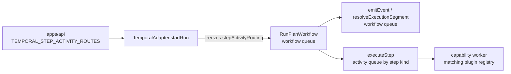
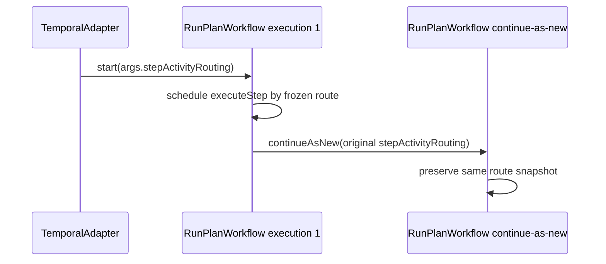

# MW-D2 Provider-Neutral Temporal Worker Routing Plan

## Think-First Analysis

Problem summary:

- `startRun` already selects the tenant/workflow queue for a run, but step
  execution previously inherited the workflow queue for every activity.
- Multi-capability execution needs a runtime way to send only `executeStep` to
  a capability activity queue without changing the public start-run command.
- The routing primitive must stay provider-neutral. DBT is one possible plugin
  consumer, not the generic model.

Root cause:

- Queue selection was treated as one Temporal provider concern instead of two
  related dispatch decisions: workflow ownership and step activity capability.
- The Temporal adapter config did not have an owned, validated snapshot that
  workflows could preserve across continue-as-new.

Selected option:

- Keep `IWorkflowEngine.startRun` as the command rail.
- Add adapter-owned `TemporalAdapterConfig.activityRouting.routesByStepKind`.
- Freeze validated routes into `RunPlanWorkflowInput.stepActivityRouting`.
- Route only `executeStep`; keep `emitEvent` and `resolveExecutionSegment` on
  the workflow/core queue.

Rejected options:

- Add DBT-specific routing to engine/contracts: rejected because it leaks one
  plugin profile into generic execution.
- Route workflow starts to capability queues: rejected because it breaks the
  existing tenant/workflow queue identity.
- Read live env from the workflow: rejected because in-flight runs would drift
  after config changes.

## Command And Query Rail Impact

| Rail                       | Type    | Bounded context | DDD owner                  | Intent                                       | Adapter surface              | Negative tests                           |
| -------------------------- | ------- | --------------- | -------------------------- | -------------------------------------------- | ---------------------------- | ---------------------------------------- |
| `IWorkflowEngine.startRun` | command | Execution       | `TemporalAdapter.startRun` | Start a run while freezing provider dispatch | Temporal workflow start args | queue unchanged; malformed route rejects |

No new product command or query is introduced. This slice is a provider
dispatch policy inside the existing start-run rail.

## Fowler Opportunity Matrix

| Scenario                                     | Opportunity              | Fowler pattern                      | DDD owner                  | Implementation surface                         | Test                                        |
| -------------------------------------------- | ------------------------ | ----------------------------------- | -------------------------- | ---------------------------------------------- | ------------------------------------------- |
| Step kinds need capability-specific workers  | Split overloaded routing | Strategy / Published Language       | `TemporalAdapterConfig`    | `config.ts`, `TemporalAdapter.ts`              | `smoke.test.ts`, `TemporalAdapter.startRun` |
| Workflow must remain stable across upgrades  | Freeze runtime decision  | Snapshot / Explicit Boundary        | `RunPlanWorkflowInput`     | `RunPlanWorkflow.ts`, workflow types           | `workflow-continue-as-new.test.ts`          |
| Only step execution should move queues       | Preserve core rail       | Humble Object around provider calls | `createStepActivities()`   | `runPlanWorkflow.activities.ts`                | `workflow-step-activity-routing.test.ts`    |
| DBT must not become generic routing language | Prevent semantic drift   | Anti-corruption Layer               | Temporal adapter component | architecture docs and DBT decoupling guard     | `dbt-core-decoupling.architecture.test.ts`  |
| API and worker env must stay aligned         | Config parity            | Composition Root                    | API and Temporal worker    | app env loaders and runtime resource factories | API and worker env/config tests             |

## Diagrams

Runtime routing:



Continue-as-new:



## Feature Mechanization

```feature-mechanization
version: 1
featureId: MW-D2-PROVIDER-NEUTRAL-TEMPORAL-WORKER-ROUTING
mechanizationStatus: implemented
noHumanDecisionsRemaining: true
implementationPlan: docs/planning/proposals/mandatory/runtime-and-contracts/mw-d2-provider-neutral-temporal-worker-routing-plan-20260513.md
componentGuides:
  - docs/architecture/components/engine/adapters/temporal/temporal-worker-routing-by-capability.md
userStories:
  - docs/architecture/components/engine/adapters/temporal/temporal-worker-routing-by-capability-user-stories.md
governingSources:
  - AGENTS.md
  - docs/planning/status/governance-document-rule-inventory.md
  - docs/guides/ai-work-protocol.md
  - docs/architecture/command-query-rail-governance.md
  - docs/architecture/fowler-opportunity-planning-governance.md
  - docs/adr/ADR-0001-temporal-integration-test-policy.md
  - docs/adr/ADR-0003-execution-model.md
  - docs/adr/ADR-0014-run-driven-adapter-model.md
  - docs/adr/ADR-0057-temporal-step-activity-routing-by-capability.md
allowedImplementationSurfaces:
  - docs/planning/proposals/mandatory/runtime-and-contracts/mw-d2-provider-neutral-temporal-worker-routing-plan-20260513.md
  - docs/planning/closeouts/20260513-mw-d2-provider-neutral-worker-routing-closeout.md
  - docs/adr/ADR-0057-temporal-step-activity-routing-by-capability.md
  - docs/architecture/components/engine/adapters/temporal/temporal-worker-routing-by-capability.md
  - docs/architecture/components/engine/adapters/temporal/temporal-worker-routing-by-capability-user-stories.md
  - docs/architecture/components/engine/adapters/temporal/temporal-worker-scaling-strategy.md
  - docs/runbooks/temporal-worker-scaling-operations.md
  - docs/evidence/ed-20260513-mw-d2-temporal-worker-routing.md
  - docs/risk-register/quality/R-20260513-MW-D2-TEMPORAL-WORKER-ROUTING.yaml
  - docs/planning/state/agent-lane-d.yaml
  - docs/**/index.md
  - docs/.manifest.json
  - apps/api/src/modules/providerAdapters/createTemporalProviderAdapterFactory.ts
  - apps/api/src/plugins/env.ts
  - apps/api/test/modules/providerAdapters/createTemporalProviderAdapterFactory.test.ts
  - apps/temporal-worker/src/plugins/env.ts
  - apps/temporal-worker/src/runtime/temporalWorkerRuntimeResources.ts
  - apps/temporal-worker/test/plugins/env.test.ts
  - packages/@dvt/adapter-temporal/src/TemporalAdapter.ts
  - packages/@dvt/adapter-temporal/src/config.ts
  - packages/@dvt/adapter-temporal/src/index.ts
  - packages/@dvt/adapter-temporal/src/workflows/RunPlanWorkflow.ts
  - packages/@dvt/adapter-temporal/src/workflows/runPlanWorkflow.activities.ts
  - packages/@dvt/adapter-temporal/src/workflows/runPlanWorkflow.stepExecution.ts
  - packages/@dvt/adapter-temporal/src/workflows/runPlanWorkflow.types.ts
  - packages/@dvt/adapter-temporal/test/TemporalAdapter.startRun.test.ts
  - packages/@dvt/adapter-temporal/test/dbt-core-decoupling.architecture.test.ts
  - packages/@dvt/adapter-temporal/test/smoke.test.ts
  - packages/@dvt/adapter-temporal/test/workflow-continue-as-new.test.ts
  - packages/@dvt/adapter-temporal/test/workflow-literals.test.ts
  - packages/@dvt/adapter-temporal/test/workflow-step-activity-routing.test.ts
forbiddenImplementationSurfaces:
  - packages/@dvt/contracts/**
  - packages/@dvt/engine/**
  - packages/@dvt/planner/**
  - packages/@dvt/adapter-postgres/**
  - apps/web/**
commandQueryRails:
  - name: IWorkflowEngine.startRun
    type: command
    dddOwner: TemporalAdapter.startRun
domainObjects:
  - name: TemporalAdapterConfig.activityRouting
    type: adapter dispatch configuration
    owner: packages/@dvt/adapter-temporal/src/config.ts
  - name: RunPlanWorkflowInput.stepActivityRouting
    type: workflow input snapshot
    owner: packages/@dvt/adapter-temporal/src/workflows/runPlanWorkflow.types.ts
  - name: Temporal step activity route
    type: capability queue dispatch rule
    owner: docs/architecture/components/engine/adapters/temporal/temporal-worker-routing-by-capability.md
fowlerSignals:
  - Splits workflow ownership from step activity capability routing.
  - Freezes provider dispatch at command admission instead of reading mutable env from workflow code.
  - Keeps DBT behind plugin composition rather than turning it into the generic routing vocabulary.
architectureGuards:
  - pnpm --filter @dvt/adapter-temporal test -- test/workflow-step-activity-routing.test.ts
  - pnpm --filter @dvt/adapter-temporal test -- test/dbt-core-decoupling.architecture.test.ts
  - pnpm docs:feature-mechanization:implementation
cypressFlows:
  - N/A - provider adapter and worker configuration only
completionGate:
  - pnpm docs:feature-mechanization -- --feature MW-D2-PROVIDER-NEUTRAL-TEMPORAL-WORKER-ROUTING
  - pnpm --filter @dvt/adapter-temporal test
  - pnpm --filter @dvt/adapter-temporal typecheck
  - pnpm --filter dvt-api test
  - pnpm --filter dvt-api typecheck
  - pnpm --filter dvt-temporal-worker test
  - pnpm --filter dvt-temporal-worker typecheck
  - pnpm docs:sync
  - pnpm governance:refresh
  - pnpm docs:feature-mechanization:implementation
  - pnpm verify:prepush
redGreenCycles:
  - id: temporal-activity-routing-config
    redTest: pnpm --filter @dvt/adapter-temporal exec vitest run test/smoke.test.ts
    expectedFailure: TEMPORAL_STEP_ACTIVITY_ROUTES is not parsed or validated.
    patchSurfaces:
      - packages/@dvt/adapter-temporal/test/smoke.test.ts
      - packages/@dvt/adapter-temporal/src/config.ts
    greenTest: pnpm --filter @dvt/adapter-temporal exec vitest run test/smoke.test.ts
  - id: temporal-start-run-routing-snapshot
    redTest: pnpm --filter @dvt/adapter-temporal exec vitest run test/TemporalAdapter.startRun.test.ts
    expectedFailure: workflow start args do not include stepActivityRouting.
    patchSurfaces:
      - packages/@dvt/adapter-temporal/test/TemporalAdapter.startRun.test.ts
      - packages/@dvt/adapter-temporal/src/TemporalAdapter.ts
    greenTest: pnpm --filter @dvt/adapter-temporal exec vitest run test/TemporalAdapter.startRun.test.ts
  - id: temporal-workflow-step-activity-routing
    redTest: pnpm --filter @dvt/adapter-temporal exec vitest run test/workflow-step-activity-routing.test.ts
    expectedFailure: routed step kind does not pass taskQueue to executeStep activity proxy.
    patchSurfaces:
      - packages/@dvt/adapter-temporal/test/workflow-step-activity-routing.test.ts
      - packages/@dvt/adapter-temporal/src/workflows/runPlanWorkflow.activities.ts
      - packages/@dvt/adapter-temporal/src/workflows/runPlanWorkflow.stepExecution.ts
    greenTest: pnpm --filter @dvt/adapter-temporal exec vitest run test/workflow-step-activity-routing.test.ts
  - id: temporal-continue-as-new-routing-freeze
    redTest: pnpm --filter @dvt/adapter-temporal exec vitest run test/workflow-continue-as-new.test.ts
    expectedFailure: continue-as-new omits the original stepActivityRouting snapshot.
    patchSurfaces:
      - packages/@dvt/adapter-temporal/test/workflow-continue-as-new.test.ts
      - packages/@dvt/adapter-temporal/src/workflows/RunPlanWorkflow.ts
      - packages/@dvt/adapter-temporal/src/workflows/runPlanWorkflow.types.ts
    greenTest: pnpm --filter @dvt/adapter-temporal exec vitest run test/workflow-continue-as-new.test.ts
  - id: temporal-routing-env-parity
    redTest: pnpm --filter dvt-api exec vitest run test/modules/providerAdapters/createTemporalProviderAdapterFactory.test.ts && pnpm --filter dvt-temporal-worker exec vitest run test/plugins/env.test.ts
    expectedFailure: API and Temporal worker env loaders do not pass TEMPORAL_STEP_ACTIVITY_ROUTES.
    patchSurfaces:
      - apps/api/test/modules/providerAdapters/createTemporalProviderAdapterFactory.test.ts
      - apps/api/src/modules/providerAdapters/createTemporalProviderAdapterFactory.ts
      - apps/api/src/plugins/env.ts
      - apps/temporal-worker/test/plugins/env.test.ts
      - apps/temporal-worker/src/plugins/env.ts
      - apps/temporal-worker/src/runtime/temporalWorkerRuntimeResources.ts
    greenTest: pnpm --filter dvt-api exec vitest run test/modules/providerAdapters/createTemporalProviderAdapterFactory.test.ts && pnpm --filter dvt-temporal-worker exec vitest run test/plugins/env.test.ts
symbols:
  - name: toWorkflowStepActivityRoutingInput
    path: packages/@dvt/adapter-temporal/src/TemporalAdapter.ts
    dddOwner: TemporalAdapter.startRun
    cqRails: [IWorkflowEngine.startRun]
    fowlerSignals:
      - Freezes adapter dispatch config into workflow input at command admission.
    architectureGuard: pnpm --filter @dvt/adapter-temporal test -- test/TemporalAdapter.startRun.test.ts
    cypressCoverage: N/A - provider adapter only
    unitTests:
      - pnpm --filter @dvt/adapter-temporal test -- test/TemporalAdapter.startRun.test.ts
  - name: DEFAULT_ACTIVITY_ROUTING_CONFIG
    path: packages/@dvt/adapter-temporal/src/config.ts
    dddOwner: TemporalAdapterConfig
    cqRails: [IWorkflowEngine.startRun]
    fowlerSignals:
      - Preserves current unrouted behavior as the default.
    architectureGuard: pnpm --filter @dvt/adapter-temporal test -- test/smoke.test.ts
    cypressCoverage: N/A - provider adapter config only
    unitTests:
      - pnpm --filter @dvt/adapter-temporal test -- test/smoke.test.ts
  - name: TemporalActivityRoutingConfig
    path: packages/@dvt/adapter-temporal/src/config.ts
    dddOwner: TemporalAdapterConfig
    cqRails: [IWorkflowEngine.startRun]
    fowlerSignals:
      - Names adapter-owned activity routing without changing shared contracts.
    architectureGuard: pnpm --filter @dvt/adapter-temporal typecheck
    cypressCoverage: N/A - type-level adapter config only
    unitTests:
      - pnpm --filter @dvt/adapter-temporal typecheck
  - name: TemporalStepActivityRoute
    path: packages/@dvt/adapter-temporal/src/config.ts
    dddOwner: TemporalAdapterConfig
    cqRails: [IWorkflowEngine.startRun]
    fowlerSignals:
      - Keeps route capability and task queue together as one provider dispatch rule.
    architectureGuard: pnpm --filter @dvt/adapter-temporal test -- test/smoke.test.ts
    cypressCoverage: N/A - provider adapter config only
    unitTests:
      - pnpm --filter @dvt/adapter-temporal test -- test/smoke.test.ts
  - name: TemporalStepCapability
    path: packages/@dvt/adapter-temporal/src/config.ts
    dddOwner: TemporalAdapterConfig
    cqRails: [IWorkflowEngine.startRun]
    fowlerSignals:
      - Uses provider-neutral capability vocabulary rather than DBT-specific routing.
    architectureGuard: pnpm --filter @dvt/adapter-temporal test -- test/dbt-core-decoupling.architecture.test.ts
    cypressCoverage: N/A - provider adapter config only
    unitTests:
      - pnpm --filter @dvt/adapter-temporal test -- test/dbt-core-decoupling.architecture.test.ts
  - name: TemporalStepKindName
    path: packages/@dvt/adapter-temporal/src/config.ts
    dddOwner: TemporalAdapterConfig
    cqRails: [IWorkflowEngine.startRun]
    fowlerSignals:
      - Keeps routes keyed by step kind without adding a contracts dependency change.
    architectureGuard: pnpm --filter @dvt/adapter-temporal test -- test/smoke.test.ts
    cypressCoverage: N/A - provider adapter config only
    unitTests:
      - pnpm --filter @dvt/adapter-temporal test -- test/smoke.test.ts
  - name: asTemporalStepCapability
    path: packages/@dvt/adapter-temporal/src/config.ts
    dddOwner: TemporalAdapterConfig
    cqRails: [IWorkflowEngine.startRun]
    fowlerSignals:
      - Fails closed on blank route capabilities.
    architectureGuard: pnpm --filter @dvt/adapter-temporal test -- test/smoke.test.ts
    cypressCoverage: N/A - provider adapter config only
    unitTests:
      - pnpm --filter @dvt/adapter-temporal test -- test/smoke.test.ts
  - name: asTemporalStepKindName
    path: packages/@dvt/adapter-temporal/src/config.ts
    dddOwner: TemporalAdapterConfig
    cqRails: [IWorkflowEngine.startRun]
    fowlerSignals:
      - Fails closed on blank route keys.
    architectureGuard: pnpm --filter @dvt/adapter-temporal test -- test/smoke.test.ts
    cypressCoverage: N/A - provider adapter config only
    unitTests:
      - pnpm --filter @dvt/adapter-temporal test -- test/smoke.test.ts
  - name: createTemporalActivityRoutingConfig
    path: packages/@dvt/adapter-temporal/src/config.ts
    dddOwner: TemporalAdapterConfig
    cqRails: [IWorkflowEngine.startRun]
    fowlerSignals:
      - Centralizes route validation and normalization.
    architectureGuard: pnpm --filter @dvt/adapter-temporal test -- test/smoke.test.ts
    cypressCoverage: N/A - provider adapter config only
    unitTests:
      - pnpm --filter @dvt/adapter-temporal test -- test/smoke.test.ts
  - name: parseTemporalActivityRoutingEnv
    path: packages/@dvt/adapter-temporal/src/config.ts
    dddOwner: TemporalAdapterConfig
    cqRails: [IWorkflowEngine.startRun]
    fowlerSignals:
      - Keeps env parsing outside workflow code.
    architectureGuard: pnpm --filter @dvt/adapter-temporal test -- test/smoke.test.ts
    cypressCoverage: N/A - provider adapter config only
    unitTests:
      - pnpm --filter @dvt/adapter-temporal test -- test/smoke.test.ts
  - name: resolveStepActivityTaskQueue
    path: packages/@dvt/adapter-temporal/src/workflows/runPlanWorkflow.activities.ts
    dddOwner: RunPlanWorkflow activity proxy
    cqRails: [IWorkflowEngine.startRun]
    fowlerSignals:
      - Routes only step execution while leaving core activities on the workflow queue.
    architectureGuard: pnpm --filter @dvt/adapter-temporal test -- test/workflow-step-activity-routing.test.ts
    cypressCoverage: N/A - workflow unit test only
    unitTests:
      - pnpm --filter @dvt/adapter-temporal test -- test/workflow-step-activity-routing.test.ts
  - name: WorkflowStepActivityRoute
    path: packages/@dvt/adapter-temporal/src/workflows/runPlanWorkflow.types.ts
    dddOwner: RunPlanWorkflowInput
    cqRails: [IWorkflowEngine.startRun]
    fowlerSignals:
      - Describes the workflow-safe route snapshot.
    architectureGuard: pnpm --filter @dvt/adapter-temporal typecheck
    cypressCoverage: N/A - type-level workflow input only
    unitTests:
      - pnpm --filter @dvt/adapter-temporal typecheck
  - name: WorkflowStepActivityRouting
    path: packages/@dvt/adapter-temporal/src/workflows/runPlanWorkflow.types.ts
    dddOwner: RunPlanWorkflowInput
    cqRails: [IWorkflowEngine.startRun]
    fowlerSignals:
      - Carries route snapshots through continue-as-new.
    architectureGuard: pnpm --filter @dvt/adapter-temporal test -- test/workflow-continue-as-new.test.ts
    cypressCoverage: N/A - workflow unit test only
    unitTests:
      - pnpm --filter @dvt/adapter-temporal test -- test/workflow-continue-as-new.test.ts
  - name: CAPABILITY_ROUTING_GUIDE
    path: packages/@dvt/adapter-temporal/test/dbt-core-decoupling.architecture.test.ts
    dddOwner: Temporal adapter architecture guard
    cqRails: [IWorkflowEngine.startRun]
    fowlerSignals:
      - Binds documentation to provider-neutral routing semantics.
    architectureGuard: pnpm --filter @dvt/adapter-temporal test -- test/dbt-core-decoupling.architecture.test.ts
    cypressCoverage: N/A - architecture test only
    unitTests:
      - pnpm --filter @dvt/adapter-temporal test -- test/dbt-core-decoupling.architecture.test.ts
  - name: TEMPORAL_ADAPTER_ROOT
    path: packages/@dvt/adapter-temporal/test/dbt-core-decoupling.architecture.test.ts
    dddOwner: Temporal adapter architecture guard
    cqRails: [IWorkflowEngine.startRun]
    fowlerSignals:
      - Keeps source scans local to the Temporal adapter package.
    architectureGuard: pnpm --filter @dvt/adapter-temporal test -- test/dbt-core-decoupling.architecture.test.ts
    cypressCoverage: N/A - architecture test only
    unitTests:
      - pnpm --filter @dvt/adapter-temporal test -- test/dbt-core-decoupling.architecture.test.ts
  - name: readAdapterSource
    path: packages/@dvt/adapter-temporal/test/dbt-core-decoupling.architecture.test.ts
    dddOwner: Temporal adapter architecture guard
    cqRails: [IWorkflowEngine.startRun]
    fowlerSignals:
      - Mechanizes DBT decoupling checks over generic routing helpers.
    architectureGuard: pnpm --filter @dvt/adapter-temporal test -- test/dbt-core-decoupling.architecture.test.ts
    cypressCoverage: N/A - architecture test only
    unitTests:
      - pnpm --filter @dvt/adapter-temporal test -- test/dbt-core-decoupling.architecture.test.ts
```
