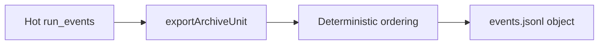
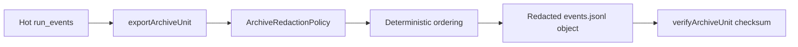

# O6 Archive Sensitive Payload Redaction Plan

## Intent

Close the minimum O6 security slice before further restore lifecycle expansion:
archive export must not persist obvious secret-bearing fields in cold object
artifacts. This is not the regulated erasure workflow from G5-PR4; that remains
separate because it needs legal basis, approval, audit state, and compatibility
semantics for already-written archives.

## Governing Rail

- Command/query rail:
  `ObjectStorageRunArchiveExporter.exportArchiveUnit(input)`.
- Owning bounded context: state-store archive lifecycle.
- DDD object: `ArchiveRedactionPolicy`.
- Application port: `IRunArchiveExporter`.
- Adapter surface: `ObjectStorageRunArchiveExporter`.
- Scope and authorization: archive runtime composition only; no product UI or
  caller bypass is introduced.
- Negative tests:
  - secret-bearing payload keys are redacted before archive object write;
  - custom redaction keys extend the secure defaults instead of replacing them.

## Current To Target





## Fowler Analysis

- Boundary drift: keep redaction inside the archive exporter adapter because the
  cold object write is the behavior being secured.
- Primitive obsession: centralize sensitive-key matching in a policy object
  instead of scattering string comparisons through lifecycle orchestration.
- Shotgun surgery: preserve `IRunArchiveExporter` and avoid adapter or schema
  changes for this minimum security slice.
- Security invariant: default sensitive keys are sticky; local configuration can
  add keys but cannot accidentally remove the baseline.

## Feature Mechanization

```feature-mechanization
version: 1
featureId: AR-O6-ARCHIVE-SENSITIVE-PAYLOAD-REDACTION
mechanizationStatus: implemented
noHumanDecisionsRemaining: true
implementationPlan: docs/planning/proposals/mandatory/runtime-and-contracts/o6-archive-sensitive-payload-redaction-plan-20260603.md
componentGuides:
  - docs/planning/domains/event-lifecycle-and-retention.md
  - docs/planning/status/system-operations-inventory-20260501.md
userStories:
  - Secret-bearing archive payload fields are never written to cold archive objects by default.
  - Archive operators may add local sensitive key names without weakening baseline redaction.
governingSources:
  - docs/architecture/command-query-rail-governance.md
  - docs/architecture/fowler-opportunity-planning-governance.md
  - docs/adr/ADR-0037-run-event-lifecycle-archival-verification-and-restore-model.md
  - docs/guides/ai-work-protocol.md
allowedImplementationSurfaces:
  - docs/architecture/system-delivery-status.md
  - docs/planning/domains/event-lifecycle-and-retention.md
  - docs/planning/status/system-operations-inventory-20260501.md
  - docs/planning/proposals/mandatory/runtime-and-contracts/o6-archive-sensitive-payload-redaction-plan-20260603.md
  - docs/**/index.md
  - packages/@dvt/state-store/src/index.ts
  - packages/@dvt/state-store/src/lifecycle/ObjectStorageRunArchiveExporter.ts
  - packages/@dvt/state-store/test/ObjectStorageRunArchiveExporter.test.ts
forbiddenImplementationSurfaces:
  - apps/**
  - packages/@dvt/adapter-*/**
  - packages/@dvt/contracts/**
  - packages/@dvt/engine/**
  - packages/@dvt/planner/**
domainObjects:
  - ArchiveRedactionPolicy
  - EventEnvelope
  - IRunArchiveExporter
fowlerSignals:
  - Boundary drift
  - Primitive obsession
  - Security invariant
architectureGuards:
  - pnpm docs:feature-mechanization:implementation
  - pnpm --filter @dvt/state-store test
  - pnpm --filter @dvt/state-store typecheck
cypressFlows:
  - N/A - state-store archive lifecycle package
completionGate:
  - pnpm --filter @dvt/state-store test
  - pnpm --filter @dvt/state-store typecheck
  - pnpm --filter @dvt/state-store build
  - pnpm lint:md:changed
  - pnpm docs:sync
  - pnpm docs:feature-mechanization:implementation
  - pnpm verify:prepush
commandQueryRails:
  - name: ObjectStorageRunArchiveExporter.exportArchiveUnit
    type: command
    dddOwner: State-store archive lifecycle exporter
    applicationPort: IRunArchiveExporter
    adapterSurface: ObjectStorageRunArchiveExporter
    scope: Archive unit export to cold object storage
    authorization: Archive runtime composition only
    negativeTests:
      - redacts sensitive payload fields before writing archive objects
      - keeps default redaction keys when custom sensitive keys are configured
redGreenCycles:
  - id: archive-sensitive-field-redaction
    redTest: pnpm --filter @dvt/state-store test -- ObjectStorageRunArchiveExporter.test.ts
    expectedFailure: events.jsonl contains database-password before redaction.
    patchSurfaces:
      - packages/@dvt/state-store/src/lifecycle/ObjectStorageRunArchiveExporter.ts
      - packages/@dvt/state-store/test/ObjectStorageRunArchiveExporter.test.ts
    greenTest: pnpm --filter @dvt/state-store test -- ObjectStorageRunArchiveExporter.test.ts
  - id: archive-default-redaction-keys-sticky
    redTest: pnpm --filter @dvt/state-store test -- ObjectStorageRunArchiveExporter.test.ts
    expectedFailure: custom sensitiveKeys leaked password before defaults became sticky.
    patchSurfaces:
      - packages/@dvt/state-store/src/lifecycle/ObjectStorageRunArchiveExporter.ts
      - packages/@dvt/state-store/test/ObjectStorageRunArchiveExporter.test.ts
    greenTest: pnpm --filter @dvt/state-store test -- ObjectStorageRunArchiveExporter.test.ts
symbols:
  - name: ArchiveRedactionPolicy
    path: packages/@dvt/state-store/src/lifecycle/ObjectStorageRunArchiveExporter.ts
    dddOwner: Archive redaction policy
    cqRails: [ObjectStorageRunArchiveExporter.exportArchiveUnit]
    fowlerSignals: [Primitive obsession, Security invariant]
    architectureGuard: pnpm docs:feature-mechanization:implementation
    cypressCoverage: N/A - state-store package
    unitTests: [packages/@dvt/state-store/test/ObjectStorageRunArchiveExporter.test.ts]
  - name: ResolvedArchiveRedactionPolicy
    path: packages/@dvt/state-store/src/lifecycle/ObjectStorageRunArchiveExporter.ts
    dddOwner: Archive redaction policy
    cqRails: [ObjectStorageRunArchiveExporter.exportArchiveUnit]
    fowlerSignals: [Encapsulated policy]
    architectureGuard: pnpm docs:feature-mechanization:implementation
    cypressCoverage: N/A - state-store package
    unitTests: [packages/@dvt/state-store/test/ObjectStorageRunArchiveExporter.test.ts]
  - name: DEFAULT_ARCHIVE_REDACTION_REPLACEMENT
    path: packages/@dvt/state-store/src/lifecycle/ObjectStorageRunArchiveExporter.ts
    dddOwner: Archive redaction policy
    cqRails: [ObjectStorageRunArchiveExporter.exportArchiveUnit]
    fowlerSignals: [Security invariant]
    architectureGuard: pnpm docs:feature-mechanization:implementation
    cypressCoverage: N/A - state-store package
    unitTests: [packages/@dvt/state-store/test/ObjectStorageRunArchiveExporter.test.ts]
  - name: DEFAULT_ARCHIVE_REDACTION_KEYS
    path: packages/@dvt/state-store/src/lifecycle/ObjectStorageRunArchiveExporter.ts
    dddOwner: Archive redaction policy
    cqRails: [ObjectStorageRunArchiveExporter.exportArchiveUnit]
    fowlerSignals: [Security invariant]
    architectureGuard: pnpm docs:feature-mechanization:implementation
    cypressCoverage: N/A - state-store package
    unitTests: [packages/@dvt/state-store/test/ObjectStorageRunArchiveExporter.test.ts]
  - name: resolveArchiveRedactionPolicy
    path: packages/@dvt/state-store/src/lifecycle/ObjectStorageRunArchiveExporter.ts
    dddOwner: Archive redaction policy
    cqRails: [ObjectStorageRunArchiveExporter.exportArchiveUnit]
    fowlerSignals: [Encapsulated policy]
    architectureGuard: pnpm docs:feature-mechanization:implementation
    cypressCoverage: N/A - state-store package
    unitTests: [packages/@dvt/state-store/test/ObjectStorageRunArchiveExporter.test.ts]
  - name: redactArchiveEvents
    path: packages/@dvt/state-store/src/lifecycle/ObjectStorageRunArchiveExporter.ts
    dddOwner: Archive redaction policy
    cqRails: [ObjectStorageRunArchiveExporter.exportArchiveUnit]
    fowlerSignals: [Boundary drift]
    architectureGuard: pnpm docs:feature-mechanization:implementation
    cypressCoverage: N/A - state-store package
    unitTests: [packages/@dvt/state-store/test/ObjectStorageRunArchiveExporter.test.ts]
  - name: redactValue
    path: packages/@dvt/state-store/src/lifecycle/ObjectStorageRunArchiveExporter.ts
    dddOwner: Archive redaction policy
    cqRails: [ObjectStorageRunArchiveExporter.exportArchiveUnit]
    fowlerSignals: [Primitive obsession]
    architectureGuard: pnpm docs:feature-mechanization:implementation
    cypressCoverage: N/A - state-store package
    unitTests: [packages/@dvt/state-store/test/ObjectStorageRunArchiveExporter.test.ts]
  - name: normalizeKey
    path: packages/@dvt/state-store/src/lifecycle/ObjectStorageRunArchiveExporter.ts
    dddOwner: Archive redaction policy
    cqRails: [ObjectStorageRunArchiveExporter.exportArchiveUnit]
    fowlerSignals: [Primitive obsession]
    architectureGuard: pnpm docs:feature-mechanization:implementation
    cypressCoverage: N/A - state-store package
    unitTests: [packages/@dvt/state-store/test/ObjectStorageRunArchiveExporter.test.ts]
  - name: isRecord
    path: packages/@dvt/state-store/src/lifecycle/ObjectStorageRunArchiveExporter.ts
    dddOwner: Archive redaction policy
    cqRails: [ObjectStorageRunArchiveExporter.exportArchiveUnit]
    fowlerSignals: [Encapsulated policy]
    architectureGuard: pnpm docs:feature-mechanization:implementation
    cypressCoverage: N/A - state-store package
    unitTests: [packages/@dvt/state-store/test/ObjectStorageRunArchiveExporter.test.ts]
```
