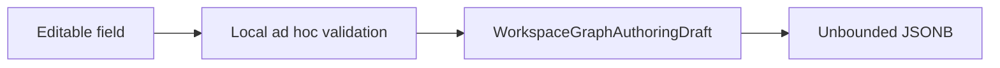
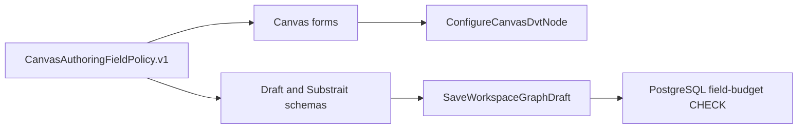

# PCV1 Canvas authoring field budgets hard cut

## Decision

Canvas authoring uses one typed field policy at the contract boundary. The UI
retains rejected input and explains the error; API parsing rejects a direct
bypass before the command; PostgreSQL rejects invalid enumerated JSON-visible authoring fields in a draft. Existing
incompatible rows fail closed at the v1 contract boundary until an explicit
operator cleanup. This is a v1 hard cut with no truncation, compatibility path,
global maxlength, or second field catalog.





## Governing rails and invariants

- ConfigureCanvasDvtNode owns semantic field edits through
  DvtNodeAuthoringMetadata in writable project Canvas scope.
- RenameProjectCanvas owns the Canvas title through ProjectCanvasLifecycle in
  writable project scope.
- SaveWorkspaceGraphDraft owns the protected aggregate write through the
  Workspace authoring aggregate, existing draft application port and HTTP
  adapter.
- Human text uses Unicode code points. PostgreSQL identifiers and literals use
  UTF-8 bytes.
- Invalid input remains in the editor; it is never truncated, transformed,
  persisted, or allowed to change the revision.
- Opaque IDs, binary plans, enums and selected references keep their structural
  validation and do not inherit user-text limits.

## Closed PCV1 authoring denominator

| Surfaces                        | Meaning                         | Owner                  | Unit and limit                 | Rejection                      |
| ------------------------------- | ------------------------------- | ---------------------- | ------------------------------ | ------------------------------ |
| Canvas title                    | human name                      | ProjectCanvasLifecycle | 256 code points                | field error; no save           |
| node name                       | human name                      | draft aggregate        | 256 code points                | field error; no save           |
| node tags                       | business tags                   | draft aggregate        | 32 code points each; 32 tags   | field error; no save           |
| node description                | prose                           | draft aggregate        | 4096 code points               | field error; no save           |
| Source schema/table/alias       | PostgreSQL identifiers          | DVT Source metadata    | 63 UTF-8 bytes each            | field error; no normalize/save |
| Transform materialization       | enum                            | DVT Transform metadata | closed membership              | field error                    |
| calculated output kind          | enum                            | Substrait authoring    | closed membership              | field error                    |
| calculated output alias         | PostgreSQL output identifier    | Substrait document     | 63 UTF-8 bytes                 | field error; atomic no-op      |
| string literal                  | expression value                | Substrait document     | 4096 UTF-8 bytes               | field error; atomic no-op      |
| timestamp literal               | instant                         | Substrait document     | canonical RFC3339 milliseconds | field error; atomic no-op      |
| input/order FieldId             | opaque reference                | Substrait authoring    | membership and scope           | field error                    |
| function capabilityId           | governed reference              | Substrait profile      | membership                     | field error                    |
| structured field name           | PostgreSQL output identifier    | Substrait document     | 63 UTF-8 bytes                 | field error; atomic no-op      |
| JOIN left/right FieldId         | opaque reference                | Substrait authoring    | membership and scope           | field error                    |
| JOIN inclusion                  | output selection                | Substrait authoring    | at least one output            | field error; atomic no-op      |
| JOIN/UNION output alias         | PostgreSQL output identifier    | Substrait document     | 63 UTF-8 bytes                 | field error; atomic no-op      |
| Sink schema/table               | PostgreSQL destination segments | DVT Sink metadata      | 63 UTF-8 bytes each            | field error; no normalize/save |
| Sink materialization/write mode | enums                           | DVT Sink metadata      | closed membership              | field error                    |

Only the fields enumerated above are editable PCV1 authoring fields. Arbitrary
members of opaque plugin metadata and binary semantic documents are not editor
inputs and do not receive a recursive text limit.

Import search filters and catalog checkboxes are ephemeral query controls. They
remain governed by the Source import rail and do not enter the persisted Canvas
field denominator.

## Delivery and proof

1. RED: L-1/L/L+1, astral Unicode, paste, direct request and direct SQL prove
   current drift and zero-write expectations.
2. GREEN: one contract policy feeds draft, DVT metadata and Substrait schemas;
   Web consumes it without local truncation; PostgreSQL adds a named NOT VALID
   CHECK that blocks new or updated invalid rows without silently rewriting
   stored data. Existing invalid rows fail closed when read through v1.
3. Browser: visible Chrome proves IME composition, paste, retained invalid
   value, blocked save in ES/EN, correction and persistence. #3034
   owns broader visual containment; #3039 owns the reusable hostile-input
   matrix.
4. Close only after package tests, lint/typecheck, ARC-2 evidence,
   feature-mechanization checks and pnpm verify:prepush pass.

Allowed surfaces are the planner contracts and their tests, the Canvas graph
authoring components and tests, this existing Cypress journey, the workspace
graph draft store/route tests, and the named governing/evidence documents.
Engine, Planner, adapters, a generic form framework, global Input limits and
unrelated editors are excluded.

## Feature mechanization

```feature-mechanization
{
  "version": 1,
  "featureId": "PCV1-CANVAS-AUTHORING-FIELD-BUDGETS-3019",
  "userStories": [
    "Canvas authors cannot persist oversized field values through UI, API or PostgreSQL"
  ],
  "cypressFlows": [
    "apps/web/cypress/e2e/canvas/canvas-authoring-field-budgets.cy.ts"
  ],
  "domainObjects": [
    "DvtNodeAuthoringMetadata",
    "WorkspaceGraphAuthoringDraft",
    "DvtSubstraitSemanticDocumentV1"
  ],
  "fowlerSignals": [
    "Primitive obsession",
    "Duplicate validation",
    "Boundary drift",
    "Test-only confidence"
  ],
  "symbols": [
    {
      "name": "CANVAS_AUTHORING_FIELD_LIMITS_V1",
      "path": "packages/@dvt/contracts/src/contracts/planner/CanvasAuthoringFieldPolicy.v1.ts",
      "cqRails": [
        "ConfigureCanvasDvtNode",
        "SaveWorkspaceGraphDraft"
      ],
      "dddOwner": "DvtNodeAuthoringMetadata",
      "unitTests": [
        "packages/@dvt/contracts/test/canvas-authoring-field-policy.contract.test.ts"
      ],
      "fowlerSignals": [
        "Primitive obsession",
        "Duplicate validation"
      ],
      "cypressCoverage": "apps/web/cypress/e2e/canvas/canvas-authoring-field-budgets.cy.ts",
      "architectureGuard": "pnpm docs:feature-mechanization:implementation -- --feature PCV1-CANVAS-AUTHORING-FIELD-BUDGETS-3019"
    },
    {
      "name": "PostgresWorkspaceGraphDraftStore",
      "path": "apps/api/src/infrastructure/workspaceGraphDraft/PostgresWorkspaceGraphDraftStore.ts",
      "cqRails": [
        "SaveWorkspaceGraphDraft"
      ],
      "dddOwner": "Workspace authoring",
      "unitTests": [
        "apps/api/test/integration/workspaceGraphDraftSemanticPersistence.test.ts"
      ],
      "fowlerSignals": [
        "Boundary drift"
      ],
      "cypressCoverage": "apps/web/cypress/e2e/canvas/canvas-authoring-field-budgets.cy.ts",
      "architectureGuard": "pnpm docs:feature-mechanization:implementation -- --feature PCV1-CANVAS-AUTHORING-FIELD-BUDGETS-3019"
    },
    {
      "name": "CanvasDraftSaveRequestBody",
      "path": "apps/web/cypress/e2e/canvas/canvas-authoring-field-budgets.cy.ts",
      "cqRails": [
        "ConfigureCanvasDvtNode",
        "SaveWorkspaceGraphDraft"
      ],
      "dddOwner": "DvtNodeAuthoringMetadata",
      "unitTests": [
        "apps/web/cypress/e2e/canvas/canvas-authoring-field-budgets.cy.ts"
      ],
      "fowlerSignals": [
        "Test-only confidence"
      ],
      "cypressCoverage": "apps/web/cypress/e2e/canvas/canvas-authoring-field-budgets.cy.ts",
      "architectureGuard": "pnpm docs:feature-mechanization:implementation -- --feature PCV1-CANVAS-AUTHORING-FIELD-BUDGETS-3019"
    },
    {
      "name": "stubRuntimeCapabilities",
      "path": "apps/web/cypress/e2e/canvas/canvas-authoring-field-budgets.cy.ts",
      "cqRails": [
        "ConfigureCanvasDvtNode",
        "SaveWorkspaceGraphDraft"
      ],
      "dddOwner": "DvtNodeAuthoringMetadata",
      "unitTests": [
        "apps/web/cypress/e2e/canvas/canvas-authoring-field-budgets.cy.ts"
      ],
      "fowlerSignals": [
        "Test-only confidence"
      ],
      "cypressCoverage": "apps/web/cypress/e2e/canvas/canvas-authoring-field-budgets.cy.ts",
      "architectureGuard": "pnpm docs:feature-mechanization:implementation -- --feature PCV1-CANVAS-AUTHORING-FIELD-BUDGETS-3019"
    },
    {
      "name": "visitReadyCanvas",
      "path": "apps/web/cypress/e2e/canvas/canvas-authoring-field-budgets.cy.ts",
      "cqRails": [
        "ConfigureCanvasDvtNode",
        "SaveWorkspaceGraphDraft"
      ],
      "dddOwner": "DvtNodeAuthoringMetadata",
      "unitTests": [
        "apps/web/cypress/e2e/canvas/canvas-authoring-field-budgets.cy.ts"
      ],
      "fowlerSignals": [
        "Test-only confidence"
      ],
      "cypressCoverage": "apps/web/cypress/e2e/canvas/canvas-authoring-field-budgets.cy.ts",
      "architectureGuard": "pnpm docs:feature-mechanization:implementation -- --feature PCV1-CANVAS-AUTHORING-FIELD-BUDGETS-3019"
    },
    {
      "name": "normalizeNodeTags",
      "path": "apps/web/src/app/views/canvas/canvasInspectorAuthoringModel.ts",
      "cqRails": [
        "ConfigureCanvasDvtNode"
      ],
      "dddOwner": "CanvasInspectorNodeDraft",
      "unitTests": [
        "apps/web/src/app/views/canvas/canvasInspectorAuthoringModel.test.ts"
      ],
      "fowlerSignals": [
        "Duplicate validation"
      ],
      "cypressCoverage": "apps/web/cypress/e2e/canvas/canvas-authoring-field-budgets.cy.ts",
      "architectureGuard": "pnpm docs:feature-mechanization:implementation -- --feature PCV1-CANVAS-AUTHORING-FIELD-BUDGETS-3019"
    },
    {
      "name": "resolveCanvasDvtOutputNameDraftError",
      "path": "apps/web/src/app/views/canvas/canvasInspectorAuthoringModel.ts",
      "cqRails": [
        "ConfigureCanvasDvtNode"
      ],
      "dddOwner": "CanvasInspectorNodeDraft",
      "unitTests": [
        "apps/web/src/app/views/canvas/canvasInspectorAuthoringModel.test.ts",
        "apps/web/src/app/views/canvas/DvtAuthoringFields.test.tsx"
      ],
      "fowlerSignals": [
        "Duplicate validation"
      ],
      "cypressCoverage": "apps/web/cypress/e2e/canvas/canvas-authoring-field-budgets.cy.ts",
      "architectureGuard": "pnpm docs:feature-mechanization:implementation -- --feature PCV1-CANVAS-AUTHORING-FIELD-BUDGETS-3019"
    },
    {
      "name": "CanvasDescriptionV1Schema",
      "path": "packages/@dvt/contracts/src/contracts/planner/CanvasAuthoringFieldPolicy.v1.ts",
      "cqRails": [
        "ConfigureCanvasDvtNode",
        "SaveWorkspaceGraphDraft"
      ],
      "dddOwner": "DvtNodeAuthoringMetadata",
      "unitTests": [
        "packages/@dvt/contracts/test/canvas-authoring-field-policy.contract.test.ts"
      ],
      "fowlerSignals": [
        "Primitive obsession",
        "Duplicate validation"
      ],
      "cypressCoverage": "apps/web/cypress/e2e/canvas/canvas-authoring-field-budgets.cy.ts",
      "architectureGuard": "pnpm docs:feature-mechanization:implementation -- --feature PCV1-CANVAS-AUTHORING-FIELD-BUDGETS-3019"
    },
    {
      "name": "CanvasTagV1Schema",
      "path": "packages/@dvt/contracts/src/contracts/planner/CanvasAuthoringFieldPolicy.v1.ts",
      "cqRails": [
        "ConfigureCanvasDvtNode",
        "SaveWorkspaceGraphDraft"
      ],
      "dddOwner": "DvtNodeAuthoringMetadata",
      "unitTests": [
        "packages/@dvt/contracts/test/canvas-authoring-field-policy.contract.test.ts"
      ],
      "fowlerSignals": [
        "Primitive obsession",
        "Duplicate validation"
      ],
      "cypressCoverage": "apps/web/cypress/e2e/canvas/canvas-authoring-field-budgets.cy.ts",
      "architectureGuard": "pnpm docs:feature-mechanization:implementation -- --feature PCV1-CANVAS-AUTHORING-FIELD-BUDGETS-3019"
    },
    {
      "name": "CanvasTagsV1Schema",
      "path": "packages/@dvt/contracts/src/contracts/planner/CanvasAuthoringFieldPolicy.v1.ts",
      "cqRails": [
        "ConfigureCanvasDvtNode",
        "SaveWorkspaceGraphDraft"
      ],
      "dddOwner": "DvtNodeAuthoringMetadata",
      "unitTests": [
        "packages/@dvt/contracts/test/canvas-authoring-field-policy.contract.test.ts"
      ],
      "fowlerSignals": [
        "Primitive obsession",
        "Duplicate validation"
      ],
      "cypressCoverage": "apps/web/cypress/e2e/canvas/canvas-authoring-field-budgets.cy.ts",
      "architectureGuard": "pnpm docs:feature-mechanization:implementation -- --feature PCV1-CANVAS-AUTHORING-FIELD-BUDGETS-3019"
    },
    {
      "name": "DvtStringLiteralV1Schema",
      "path": "packages/@dvt/contracts/src/contracts/planner/CanvasAuthoringFieldPolicy.v1.ts",
      "cqRails": [
        "ConfigureCanvasDvtNode",
        "SaveWorkspaceGraphDraft"
      ],
      "dddOwner": "DvtNodeAuthoringMetadata",
      "unitTests": [
        "packages/@dvt/contracts/test/canvas-authoring-field-policy.contract.test.ts"
      ],
      "fowlerSignals": [
        "Primitive obsession",
        "Duplicate validation"
      ],
      "cypressCoverage": "apps/web/cypress/e2e/canvas/canvas-authoring-field-budgets.cy.ts",
      "architectureGuard": "pnpm docs:feature-mechanization:implementation -- --feature PCV1-CANVAS-AUTHORING-FIELD-BUDGETS-3019"
    },
    {
      "name": "DvtTimestampLiteralV1Schema",
      "path": "packages/@dvt/contracts/src/contracts/planner/CanvasAuthoringFieldPolicy.v1.ts",
      "cqRails": [
        "ConfigureCanvasDvtNode",
        "SaveWorkspaceGraphDraft"
      ],
      "dddOwner": "DvtNodeAuthoringMetadata",
      "unitTests": [
        "packages/@dvt/contracts/test/canvas-authoring-field-policy.contract.test.ts"
      ],
      "fowlerSignals": [
        "Primitive obsession",
        "Duplicate validation"
      ],
      "cypressCoverage": "apps/web/cypress/e2e/canvas/canvas-authoring-field-budgets.cy.ts",
      "architectureGuard": "pnpm docs:feature-mechanization:implementation -- --feature PCV1-CANVAS-AUTHORING-FIELD-BUDGETS-3019"
    },
    {
      "name": "PostgresIdentifierV1Schema",
      "path": "packages/@dvt/contracts/src/contracts/planner/CanvasAuthoringFieldPolicy.v1.ts",
      "cqRails": [
        "ConfigureCanvasDvtNode",
        "SaveWorkspaceGraphDraft"
      ],
      "dddOwner": "DvtNodeAuthoringMetadata",
      "unitTests": [
        "packages/@dvt/contracts/test/canvas-authoring-field-policy.contract.test.ts"
      ],
      "fowlerSignals": [
        "Primitive obsession",
        "Duplicate validation"
      ],
      "cypressCoverage": "apps/web/cypress/e2e/canvas/canvas-authoring-field-budgets.cy.ts",
      "architectureGuard": "pnpm docs:feature-mechanization:implementation -- --feature PCV1-CANVAS-AUTHORING-FIELD-BUDGETS-3019"
    },
    {
      "name": "WellFormedCanvasTextSchema",
      "path": "packages/@dvt/contracts/src/contracts/planner/CanvasAuthoringFieldPolicy.v1.ts",
      "cqRails": [
        "ConfigureCanvasDvtNode",
        "SaveWorkspaceGraphDraft"
      ],
      "dddOwner": "DvtNodeAuthoringMetadata",
      "unitTests": [
        "packages/@dvt/contracts/test/canvas-authoring-field-policy.contract.test.ts"
      ],
      "fowlerSignals": [
        "Primitive obsession",
        "Duplicate validation"
      ],
      "cypressCoverage": "apps/web/cypress/e2e/canvas/canvas-authoring-field-budgets.cy.ts",
      "architectureGuard": "pnpm docs:feature-mechanization:implementation -- --feature PCV1-CANVAS-AUTHORING-FIELD-BUDGETS-3019"
    },
    {
      "name": "CanvasHumanNameV1Schema",
      "path": "packages/@dvt/contracts/src/contracts/planner/CanvasAuthoringFieldPolicy.v1.ts",
      "cqRails": [
        "RenameProjectCanvas",
        "ConfigureCanvasDvtNode",
        "SaveWorkspaceGraphDraft"
      ],
      "dddOwner": "WorkspaceGraphAuthoringDraft",
      "unitTests": [
        "packages/@dvt/contracts/test/canvas-authoring-field-policy.contract.test.ts"
      ],
      "fowlerSignals": [
        "Primitive obsession",
        "Duplicate validation"
      ],
      "cypressCoverage": "apps/web/cypress/e2e/canvas/canvas-authoring-field-budgets.cy.ts",
      "architectureGuard": "pnpm docs:feature-mechanization:implementation -- --feature PCV1-CANVAS-AUTHORING-FIELD-BUDGETS-3019"
    },
    {
      "name": "boundedCodePointString",
      "path": "packages/@dvt/contracts/src/contracts/planner/CanvasAuthoringFieldPolicy.v1.ts",
      "cqRails": [
        "RenameProjectCanvas",
        "ConfigureCanvasDvtNode",
        "SaveWorkspaceGraphDraft"
      ],
      "dddOwner": "WorkspaceGraphAuthoringDraft",
      "unitTests": [
        "packages/@dvt/contracts/test/canvas-authoring-field-policy.contract.test.ts"
      ],
      "fowlerSignals": [
        "Primitive obsession",
        "Duplicate validation"
      ],
      "cypressCoverage": "apps/web/cypress/e2e/canvas/canvas-authoring-field-budgets.cy.ts",
      "architectureGuard": "pnpm docs:feature-mechanization:implementation -- --feature PCV1-CANVAS-AUTHORING-FIELD-BUDGETS-3019"
    },
    {
      "name": "boundedUtf8String",
      "path": "packages/@dvt/contracts/src/contracts/planner/CanvasAuthoringFieldPolicy.v1.ts",
      "cqRails": [
        "RenameProjectCanvas",
        "ConfigureCanvasDvtNode",
        "SaveWorkspaceGraphDraft"
      ],
      "dddOwner": "WorkspaceGraphAuthoringDraft",
      "unitTests": [
        "packages/@dvt/contracts/test/canvas-authoring-field-policy.contract.test.ts"
      ],
      "fowlerSignals": [
        "Primitive obsession",
        "Duplicate validation"
      ],
      "cypressCoverage": "apps/web/cypress/e2e/canvas/canvas-authoring-field-budgets.cy.ts",
      "architectureGuard": "pnpm docs:feature-mechanization:implementation -- --feature PCV1-CANVAS-AUTHORING-FIELD-BUDGETS-3019"
    },
    {
      "name": "countUnicodeCodePoints",
      "path": "packages/@dvt/contracts/src/contracts/planner/CanvasAuthoringFieldPolicy.v1.ts",
      "cqRails": [
        "RenameProjectCanvas",
        "ConfigureCanvasDvtNode",
        "SaveWorkspaceGraphDraft"
      ],
      "dddOwner": "WorkspaceGraphAuthoringDraft",
      "unitTests": [
        "packages/@dvt/contracts/test/canvas-authoring-field-policy.contract.test.ts"
      ],
      "fowlerSignals": [
        "Primitive obsession",
        "Duplicate validation"
      ],
      "cypressCoverage": "apps/web/cypress/e2e/canvas/canvas-authoring-field-budgets.cy.ts",
      "architectureGuard": "pnpm docs:feature-mechanization:implementation -- --feature PCV1-CANVAS-AUTHORING-FIELD-BUDGETS-3019"
    },
    {
      "name": "countUtf8Bytes",
      "path": "packages/@dvt/contracts/src/contracts/planner/CanvasAuthoringFieldPolicy.v1.ts",
      "cqRails": [
        "RenameProjectCanvas",
        "ConfigureCanvasDvtNode",
        "SaveWorkspaceGraphDraft"
      ],
      "dddOwner": "WorkspaceGraphAuthoringDraft",
      "unitTests": [
        "packages/@dvt/contracts/test/canvas-authoring-field-policy.contract.test.ts"
      ],
      "fowlerSignals": [
        "Primitive obsession",
        "Duplicate validation"
      ],
      "cypressCoverage": "apps/web/cypress/e2e/canvas/canvas-authoring-field-budgets.cy.ts",
      "architectureGuard": "pnpm docs:feature-mechanization:implementation -- --feature PCV1-CANVAS-AUTHORING-FIELD-BUDGETS-3019"
    },
    {
      "name": "isWellFormedCanvasText",
      "path": "packages/@dvt/contracts/src/contracts/planner/CanvasAuthoringFieldPolicy.v1.ts",
      "cqRails": [
        "RenameProjectCanvas",
        "ConfigureCanvasDvtNode",
        "SaveWorkspaceGraphDraft"
      ],
      "dddOwner": "WorkspaceGraphAuthoringDraft",
      "unitTests": [
        "packages/@dvt/contracts/test/canvas-authoring-field-policy.contract.test.ts"
      ],
      "fowlerSignals": [
        "Primitive obsession",
        "Duplicate validation"
      ],
      "cypressCoverage": "apps/web/cypress/e2e/canvas/canvas-authoring-field-budgets.cy.ts",
      "architectureGuard": "pnpm docs:feature-mechanization:implementation -- --feature PCV1-CANVAS-AUTHORING-FIELD-BUDGETS-3019"
    },
    {
      "name": "addDvtSubstraitPlanFieldPolicyIssues",
      "path": "packages/@dvt/contracts/src/contracts/planner/DvtSubstraitSemanticDocument.v1.ts",
      "cqRails": [
        "ConfigureCanvasDvtNode",
        "SaveWorkspaceGraphDraft"
      ],
      "dddOwner": "DvtSubstraitSemanticDocumentV1",
      "unitTests": [
        "packages/@dvt/contracts/test/dvt-substrait-field-policy.contract.test.ts"
      ],
      "fowlerSignals": [
        "Boundary drift"
      ],
      "cypressCoverage": "apps/web/cypress/e2e/canvas/canvas-authoring-field-budgets.cy.ts",
      "architectureGuard": "pnpm docs:feature-mechanization:implementation -- --feature PCV1-CANVAS-AUTHORING-FIELD-BUDGETS-3019"
    },
    {
      "name": "NodePatchSchema",
      "path": "packages/@dvt/contracts/src/contracts/planner/WorkspaceGraphAuthoringCommand.v1.ts",
      "cqRails": [
        "ConfigureCanvasDvtNode",
        "SaveWorkspaceGraphDraft"
      ],
      "dddOwner": "WorkspaceGraphAuthoringDraft",
      "unitTests": [
        "packages/@dvt/contracts/test/canvas-authoring-field-policy.contract.test.ts"
      ],
      "fowlerSignals": [
        "Boundary drift",
        "Duplicate validation"
      ],
      "cypressCoverage": "apps/web/cypress/e2e/canvas/canvas-authoring-field-budgets.cy.ts",
      "architectureGuard": "pnpm docs:feature-mechanization:implementation -- --feature PCV1-CANVAS-AUTHORING-FIELD-BUDGETS-3019"
    },
    {
      "name": "addDvtNodeFieldPolicyIssues",
      "path": "packages/@dvt/contracts/src/contracts/planner/WorkspaceGraphAuthoringDraft.v1.ts",
      "cqRails": [
        "ConfigureCanvasDvtNode",
        "SaveWorkspaceGraphDraft"
      ],
      "dddOwner": "WorkspaceGraphAuthoringDraft",
      "unitTests": [
        "packages/@dvt/contracts/test/canvas-authoring-field-policy.contract.test.ts"
      ],
      "fowlerSignals": [
        "Boundary drift",
        "Duplicate validation"
      ],
      "cypressCoverage": "apps/web/cypress/e2e/canvas/canvas-authoring-field-budgets.cy.ts",
      "architectureGuard": "pnpm docs:feature-mechanization:implementation -- --feature PCV1-CANVAS-AUTHORING-FIELD-BUDGETS-3019"
    },
    {
      "name": "addPostgresIdentifierMetadataIssue",
      "path": "packages/@dvt/contracts/src/contracts/planner/WorkspaceGraphAuthoringDraft.v1.ts",
      "cqRails": [
        "ConfigureCanvasDvtNode",
        "SaveWorkspaceGraphDraft"
      ],
      "dddOwner": "WorkspaceGraphAuthoringDraft",
      "unitTests": [
        "packages/@dvt/contracts/test/canvas-authoring-field-policy.contract.test.ts"
      ],
      "fowlerSignals": [
        "Boundary drift",
        "Duplicate validation"
      ],
      "cypressCoverage": "apps/web/cypress/e2e/canvas/canvas-authoring-field-budgets.cy.ts",
      "architectureGuard": "pnpm docs:feature-mechanization:implementation -- --feature PCV1-CANVAS-AUTHORING-FIELD-BUDGETS-3019"
    },
    {
      "name": "addStringEnumMetadataIssue",
      "path": "packages/@dvt/contracts/src/contracts/planner/WorkspaceGraphAuthoringDraft.v1.ts",
      "cqRails": [
        "ConfigureCanvasDvtNode",
        "SaveWorkspaceGraphDraft"
      ],
      "dddOwner": "WorkspaceGraphAuthoringDraft",
      "unitTests": [
        "packages/@dvt/contracts/test/canvas-authoring-field-policy.contract.test.ts"
      ],
      "fowlerSignals": [
        "Boundary drift",
        "Duplicate validation"
      ],
      "cypressCoverage": "apps/web/cypress/e2e/canvas/canvas-authoring-field-budgets.cy.ts",
      "architectureGuard": "pnpm docs:feature-mechanization:implementation -- --feature PCV1-CANVAS-AUTHORING-FIELD-BUDGETS-3019"
    },
    {
      "name": "isRecord",
      "path": "packages/@dvt/contracts/src/contracts/planner/WorkspaceGraphAuthoringDraft.v1.ts",
      "cqRails": [
        "ConfigureCanvasDvtNode",
        "SaveWorkspaceGraphDraft"
      ],
      "dddOwner": "WorkspaceGraphAuthoringDraft",
      "unitTests": [
        "packages/@dvt/contracts/test/canvas-authoring-field-policy.contract.test.ts"
      ],
      "fowlerSignals": [
        "Boundary drift",
        "Duplicate validation"
      ],
      "cypressCoverage": "apps/web/cypress/e2e/canvas/canvas-authoring-field-budgets.cy.ts",
      "architectureGuard": "pnpm docs:feature-mechanization:implementation -- --feature PCV1-CANVAS-AUTHORING-FIELD-BUDGETS-3019"
    },
    {
      "name": "canonicalizeDvtTransformAuthoringAuthority",
      "path": "packages/@dvt/contracts/src/contracts/planner/WorkspaceGraphAuthoringDraft.v1.ts",
      "cqRails": [
        "ConfigureCanvasDvtNode",
        "SaveWorkspaceGraphDraft"
      ],
      "dddOwner": "DvtNodeAuthoringMetadata",
      "unitTests": [
        "packages/@dvt/contracts/test/canvas-authoring-field-policy.contract.test.ts"
      ],
      "fowlerSignals": [
        "Boundary drift",
        "Duplicate validation"
      ],
      "cypressCoverage": "apps/web/cypress/e2e/canvas/canvas-authoring-field-budgets.cy.ts",
      "architectureGuard": "pnpm docs:feature-mechanization:implementation -- --feature PCV1-CANVAS-AUTHORING-FIELD-BUDGETS-3019"
    }
  ],
  "completionGate": [
    "pnpm --filter @dvt/contracts test",
    "pnpm --filter dvt-api test",
    "pnpm --filter @dvt/web test",
    "pnpm docs:feature-mechanization:implementation -- --feature PCV1-CANVAS-AUTHORING-FIELD-BUDGETS-3019",
    "pnpm verify:prepush"
  ],
  "redGreenCycles": [
    {
      "id": "shared-field-policy",
      "redTest": "pnpm --filter @dvt/contracts test",
      "greenTest": "pnpm --filter @dvt/contracts test && pnpm --filter dvt-api test && pnpm --filter @dvt/web test",
      "patchSurfaces": [
        "packages/@dvt/contracts/**",
        "apps/api/**",
        "apps/web/**"
      ],
      "expectedFailure": "Oversized values pass one or more authoring boundaries"
    }
  ],
  "componentGuides": [
    "docs/architecture/components/web/graph/canvas-inspector-authoring-component.md"
  ],
  "governingSources": [
    "docs/contracts/planner/workspace-graph-draft-persistence-v1.md",
    "docs/architecture/command-query-rail-governance.md",
    "docs/architecture/fowler-opportunity-planning-governance.md",
    "docs/architecture/components/web/style-guide.md"
  ],
  "commandQueryRails": [
    {
      "name": "RenameProjectCanvas",
      "type": "command",
      "status": "implemented",
      "referenceOnly": true,
      "authorityRef": "docs/planning/proposals/mandatory/frontend-and-ux/canvas-workspace-explorer-console-theme-modeling-plan-20260527.md",
      "dddOwner": "ProjectCanvasLifecycle",
      "negativeTests": [
        "oversized Canvas title is rejected before persistence"
      ],
      "adapterSurface": "Canvas title editor",
      "applicationPort": "RenameProjectCanvas",
      "authorizationScope": "writable project scope"
    },
    {
      "name": "ConfigureCanvasDvtNode",
      "type": "command",
      "status": "implemented",
      "referenceOnly": true,
      "authorityRef": "docs/planning/proposals/mandatory/frontend-and-ux/vtx2-opaque-authoring-identity-plan-20260906.md",
      "dddOwner": "DvtNodeAuthoringMetadata",
      "negativeTests": [
        "oversized value preserves draft and does not mutate the node"
      ],
      "adapterSurface": "Canvas Inspector DVT authoring",
      "applicationPort": "ConfigureCanvasDvtNode",
      "authorizationScope": "writable project Canvas scope"
    },
    {
      "name": "SaveWorkspaceGraphDraft",
      "type": "command",
      "status": "implemented",
      "referenceOnly": true,
      "authorityRef": "docs/architecture/components/web/graph/canvas-authoring-draft-boundary-component.md",
      "dddOwner": "Workspace authoring",
      "negativeTests": [
        "invalid direct payload is rejected before persistence",
        "PostgreSQL CHECK rejects an invalid direct write"
      ],
      "adapterSurface": "PUT /workspace/graph/draft",
      "applicationPort": "SaveWorkspaceGraphDraftUseCase",
      "authorizationScope": "tenant/project/environment writable draft scope"
    }
  ],
  "architectureGuards": [
    "pnpm docs:feature-mechanization:implementation -- --feature PCV1-CANVAS-AUTHORING-FIELD-BUDGETS-3019"
  ],
  "implementationPlan": "docs/planning/proposals/mandatory/runtime-and-contracts/pcv1-canvas-authoring-field-budgets-3019-20260908.md",
  "mechanizationStatus": "implemented",
  "noHumanDecisionsRemaining": true,
  "allowedImplementationSurfaces": [
    "packages/@dvt/contracts/src/contracts/planner/**",
    "packages/@dvt/contracts/src/index.ts",
    "packages/@dvt/contracts/src/substrait.ts",
    "packages/@dvt/contracts/test/**",
    "apps/web/src/app/plugins/graph/**",
    "apps/web/src/app/views/canvas/**",
    "apps/web/cypress/e2e/canvas/canvas-ready-node-authoring.cy.ts",
    "apps/web/cypress/e2e/canvas/canvas-authoring-field-budgets.cy.ts",
    "apps/api/src/infrastructure/workspaceGraphDraft/PostgresWorkspaceGraphDraftStore.ts",
    "apps/api/test/entrypoints/http/workspaceGraphDraftRoutes.test.ts",
    "apps/api/test/integration/workspaceGraphDraftSemanticPersistence.test.ts",
    "docs/architecture/components/web/graph/canvas-inspector-authoring-component.md",
    "docs/contracts/planner/index.md",
    "docs/contracts/planner/workspace-graph-draft-persistence-v1.md",
    "docs/planning/proposals/mandatory/frontend-and-ux/vtx2-opaque-authoring-identity-plan-20260906.md",
    "docs/planning/proposals/mandatory/runtime-and-contracts/gh-2904-stable-logical-physical-binding-hardcut-20260905.md",
    "docs/planning/proposals/mandatory/runtime-and-contracts/pcv1-canvas-authoring-field-budgets-3019-20260908.md",
    "docs/evidence/ED-20260908-canvas-authoring-field-budgets.md",
    "docs/risk-register/quality/R-20260908-CANVAS-AUTHORING-FIELD-DRIFT.yaml",
    "scripts/check-feature-mechanization.cjs",
    "scripts/check-feature-mechanization.test.cjs",
    "scripts/planning-db/command-query-rail-catalog.cjs",
    "scripts/planning-db-import.test.cjs",
    "scripts/planning-db-query.test.cjs",
    "scripts/planning-db-schema.test.cjs",
    "scripts/planning-db/queries/code-symbol-query.cjs",
    "tools/planning-db/schema.sql",
    "docs/architecture/command-query-rail-governance.md",
    "docs/.manifest.json",
    "docs/evidence/index.md",
    "docs/risk-register/quality/index.md"
  ],
  "forbiddenImplementationSurfaces": [
    "packages/@dvt/engine/**",
    "packages/@dvt/planner/**",
    "packages/@dvt/adapter-*/**"
  ],
  "wireAdapters": [
    "Canvas Inspector",
    "PUT /workspace/graph/draft",
    "PostgreSQL workspace_graph_drafts"
  ],
  "proofMatrix": [
    "L-1/L/L+1",
    "Unicode code points",
    "UTF-8 bytes",
    "direct API zero write",
    "direct SQL CHECK for JSON-visible fields",
    "visible Chrome IME, paste, ES/EN blocking and persistence"
  ]
}
```
