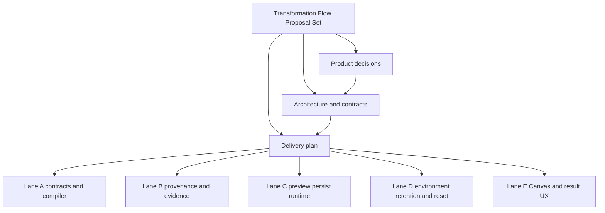

# Transformation Flow Proposal Set 2026-04-05

## Purpose

This proposal set freezes the first execution-first transformation product as a
coherent document pack instead of leaving the topic as one oversized planning
note.

The target is concrete:

1. design a basic transformation in Canvas
2. derive the planning input from that design graph
3. validate and persist an immutable plan
4. start execution by `PlanRef`
5. execute against a relational SQL executor seam, with PostgreSQL as the v1 implementation
6. inspect materialization evidence and failure diagnostics

## Governing sources

- `AGENTS.md`
- `docs/planning/status/governance-document-rule-inventory.md`
- `docs/guides/ai-work-protocol.md`
- `docs/planning/state/planning-control-tower.md`
- `docs/planning/roadmap/index.md`
- `docs/planning/roadmap/roadmap-by-domain.md`
- `docs/planning/state/agent-lane-a.yaml`
- `docs/planning/state/agent-lane-b.yaml`
- `docs/planning/state/agent-lane-c.yaml`
- `docs/planning/state/agent-lane-d.yaml`
- `docs/planning/state/agent-lane-e.yaml`
- `docs/architecture/system-delivery-status.md`
- `docs/architecture/components/planner/index.md`
- `docs/contracts/planner/index.md`
- `packages/@dvt/planner/src/application/PlannerFacade.ts`
- `apps/api/src/entrypoints/http/runtimeRoutes.constants.ts`
- `apps/web/src/app/services/plans/plansService.api.ts`
- `apps/web/src/app/services/runs/runsService.api.ts`

## Why this is a set and not one file

This slice now has three different concerns that should not stay collapsed into
one document:

- product decisions that must be locked before implementation
- architecture and contract definitions that must be stable before TDD
- delivery sequencing across lanes that must be executable, not narrative

A single file became too broad for clear ownership. The set below is the
controlled split.

## Document set

- [Transformation Flow Product Decisions 2026-04-05](./transformation-flow-product-decisions-20260405.md)
  Decision register, scope boundaries, realism rules, success criteria, and
  rejected alternatives.
- [Transformation Flow Architecture And Contracts 2026-04-05](./transformation-flow-architecture-and-contracts-20260405.md)
  Terms, runtime boundaries, public interfaces, graph and plan model, compiler
  mapping, and sequence diagrams.
- [Transformation Flow Delivery Plan 2026-04-05](./transformation-flow-delivery-plan-20260405.md)
  Phase-by-phase execution roadmap, lane task breakdown, entry and exit
  criteria, validations, and delivery dependencies.

This overview document remains the entry point for the set.

## Locked direction at a glance

| Topic                   | Locked choice                                        | Explicitly not chosen for v1   |
| ----------------------- | ---------------------------------------------------- | ------------------------------ |
| Product value           | execute a real transformation                        | generic authoring breadth      |
| Authoring surface       | basic Canvas graph `source -> sql_transform -> sink` | open-ended workbench           |
| Executable payload      | SQL tracked in Git                                   | autonomous SQL generation      |
| Planning input          | derived from the design graph                        | dbt-only input surface         |
| Preview behavior        | validate and persist immutable plan                  | ephemeral preview              |
| Runtime start           | `PlanRef`                                            | raw client-supplied plan bytes |
| First execution target  | Postgres as first relational executor implementation | multi-target first release     |
| First proof environment | Docker PostgreSQL                                    | cloud-only acceptance          |
| Future extension        | dbt executor in phase 2                              | separate dbt product fork      |

## Reading order

1. read [Transformation Flow Product Decisions 2026-04-05](./transformation-flow-product-decisions-20260405.md)
2. read [Transformation Flow Architecture And Contracts 2026-04-05](./transformation-flow-architecture-and-contracts-20260405.md)
3. read [Transformation Flow Delivery Plan 2026-04-05](./transformation-flow-delivery-plan-20260405.md)
4. then route execution to the relevant lane YAML entry

## Relationship map

## Cross-lane ownership summary

| Lane | Owns                                                                     | First concrete output                                       |
| ---- | ------------------------------------------------------------------------ | ----------------------------------------------------------- |
| A    | graph model, compiler boundary, plan contract                            | governed `DesignGraphDraft` and graph-to-step mapping       |
| B    | Git provenance, evidence linkage, artifact traceability                  | `GitArtifactRef` and run evidence chain                     |
| C    | preview/persist API, `PlanRef`, runtime bridge, first relational path    | working `POST /plans/preview` plus first SQL execution path |
| D    | reproducible proof environment lifecycle, reset and retention discipline | repeatable Docker PostgreSQL baseline with cleanup policy   |
| E    | Canvas authoring, preview/start UX, result UX                            | operator-visible `design -> plan -> run -> result` flow     |

## Completion rule for this set

The proposal set is ready for implementation slicing only when all of the
following are true:

1. the three supporting documents exist and are internally consistent
2. lane YAML entries reference the same phase and dependency model
3. roadmap surfaces classify the set correctly
4. Mermaid diagrams render with conservative syntax
5. `pnpm docs:sync`, `pnpm docs:workboard:generate`, and `pnpm verify:prepush`
   are green

## Current handoff

From this point on:

- decisions live in the decisions document
- design and contract truth live in the architecture document
- execution sequencing and phase gating live in the delivery plan
- lane YAML files are the task registry of record
