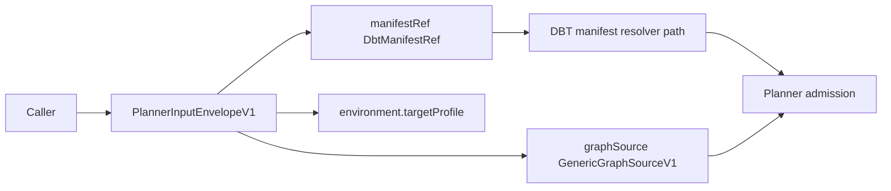
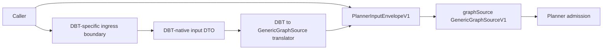

# Planner generic ingress compatibility slice 2026-04-10

Superseded by [Planner hard-cut boundary remediation 2026-04-10](./planner-hard-cut-boundary-remediation-20260410.md).

## Summary

This proposal defines the first executable slice under `RC-G1-D-A`.

The parent proposal already settled the ownership direction:

- `GenericGraphSourceV1` stays the only canonical planner ingress
- DBT-native caller input must leave the shared planner kernel
- runtime helpers should later consume only narrow generic facts

This slice does not try to complete the whole migration at once.
It focuses on the first clean boundary move:

- stop presenting DBT-native ingress as planner-kernel truth
- introduce an explicit DBT-owned compatibility boundary outside the kernel
- keep the compatibility path explicit and temporary
- defer runtime helper narrowing to the next slice

## Governing Sources

- [ADR-0018](../../../adr/ADR-0018_Shared_Kernel_Ownership_Governance.md)
- [ADR-0034](../../../adr/ADR-0034-bounded-context-boundaries-and-communication-rules.md)
- [ADR-0035](../../../adr/ADR-0035-planner-public-contract-evolution-protocol.md)
- [MW-A2 GenericGraphSource plan](./mw-a2-generic-graph-source-plan-20260404.md)
- [Planner kernel DBT boundary extraction follow-up 2026-04-10](./planner-kernel-dbt-boundary-extraction-follow-up-20260410.md)
- [Workflow helpers architecture review](../../reviews/execution-runtime/20260315-workflow-helpers-architecture-review.md)
- [ExecutionPlan.v1.ts](../../../../packages/@dvt/contracts/src/contracts/planner/ExecutionPlan.v1.ts)

## Problem Summary

The planner contract already claims that generic graph input is canonical, but
it still exposes DBT-native ingress concepts in the shared kernel:

- `DbtManifestRef`
- `PlannerInputEnvelopeV1.manifestRef`
- `PlannerEnvironmentContext.targetProfile` with DBT-specific meaning

That creates two contradictory stories at the same boundary:

1. the planner is generic
2. DBT still receives a privileged ingress path in the public shared contract

## Root Cause

`MW-A2` normalized the graph shape, but stopped before fully relocating the
source-specific caller ingress.

The remaining drift is therefore not about normalized graph semantics.
It is about admission ownership:

- graph normalization moved
- DBT-native caller input did not

So the shared kernel still carries source-specific ingress DTOs that belong in
an adapter or plugin boundary.

## Constraints And Invariants

- `GenericGraphSourceV1` remains the only canonical planner ingress contract.
- Shared-kernel planner contracts must contain only cross-source serializable
  surfaces.
- Any DBT-native input path must be explicit, temporary, and outside the kernel
  DTOs.
- The migration must preserve a bounded compatibility path for current API and
  planner composition seams.
- This first slice must not mix in runtime helper narrowing. That is a
  follow-up concern after ingress ownership is corrected.

## Think-First Options

### Option A: Keep DBT ingress in the kernel and only rename surfaces

Pros:

- smallest code churn

Cons:

- does not move ownership
- keeps DBT privileged in the shared planner contract
- turns naming cleanup into a fake architecture change

### Option B: Introduce an explicit DBT-owned compatibility boundary outside the kernel

- keep `graphSource` canonical in the shared planner contract
- move DBT-native ingress DTOs to adapter or application boundary code
- translate DBT-native input to `GenericGraphSourceV1` before planner admission
- keep the compatibility path explicit until callers migrate

Pros:

- fixes the ownership line without a flag day
- keeps the kernel honest now
- leaves a clean follow-up for runtime helper narrowing

Cons:

- touches contracts, planner admission wiring, and API/composition seams
- needs explicit deprecation handling

### Option C: Big-bang removal of all DBT ingress and helper parsing in one slice

Pros:

- fastest theoretical end state

Cons:

- mixes contract migration, compatibility handling, and runtime helper cleanup
- too wide for a first extraction slice
- higher risk of accidental drift or hidden compatibility shortcuts

## Selected Direction

Select **Option B**.

The first clean move is not to finish every consequence of the parent proposal.
It is to relocate ownership of DBT-native caller ingress out of the shared
planner kernel while preserving one explicit compatibility path.

That yields a bounded first implementation slice:

- kernel contract becomes honest
- DBT compatibility remains available
- runtime helper cleanup stays intentionally deferred

## Current Slice Boundary

## Target Slice Boundary

## Compatibility Rule

During this slice, compatibility is allowed only under this rule:

- the compatibility path is explicit
- the compatibility path lives outside the shared kernel DTOs
- the compatibility path translates to the canonical `graphSource` boundary
- no silent alias remains inside the shared planner contract

## Ownership Decision For This Slice

| Concern                                    | Owner in this slice                         | Rationale                                                    |
| ------------------------------------------ | ------------------------------------------- | ------------------------------------------------------------ |
| `GenericGraphSourceV1`                     | shared planner kernel                       | canonical cross-source admission shape                       |
| `DbtManifestRef`                           | DBT adapter or application ingress boundary | source-specific caller input                                 |
| DBT profile input                          | DBT adapter or application ingress boundary | source-specific environment knob                             |
| compatibility translation to `graphSource` | adapter or application boundary             | compatibility belongs at ingress, not in the kernel contract |
| runtime helper parsing width               | deferred                                    | keep the first extraction slice bounded                      |

## Pre-Implementation Brief

- mode: `Full`
- scope:
  remove DBT-native ingress concepts from the shared planner contract, add an
  explicit DBT-owned compatibility ingress boundary outside the kernel, and
  keep `graphSource` as the only canonical planner admission shape
- touched paths:
  `packages/@dvt/contracts/src/contracts/planner/**`,
  `packages/@dvt/contracts/src/schemas.ts`,
  `packages/@dvt/contracts/src/validation.ts`,
  planner admission or composition wiring under `packages/@dvt/planner/**`,
  API entry or parser seams under `apps/api/**`,
  focused tests under contracts, planner, and API,
  the parent proposal when implementation evidence needs cross-linking
- expected outcome:
  callers may still use a DBT-native compatibility path, but that path no
  longer appears as shared-kernel planner truth
- risks and mitigations:
  compatibility churn for start-run callers; mitigate with one explicit
  adapter-owned translation seam and negative-path tests that prove the kernel
  no longer accepts DBT-native ingress directly
- out of scope:
  narrowing Temporal workflow helper parsing, changing step-kind runtime
  behavior, and broad plugin packaging work
- validation plan:
  `pnpm --filter @dvt/contracts build`,
  `pnpm --filter @dvt/contracts test`,
  `pnpm --filter @dvt/planner test`,
  `pnpm --filter dvt-api build`,
  `pnpm docs:sync`,
  `pnpm docs:workboard:generate`,
  `pnpm verify:prepush`
- test coverage plan:
  add negative-path tests that reject DBT-native ingress at the canonical
  planner contract boundary, prove the compatibility translator emits valid
  `GenericGraphSourceV1`, and prove API/planner seams fail closed when both
  canonical and DBT-native paths are mixed
- libraries evaluated:
  `None evaluated - boundary ownership and contract migration slice`

## Proposed Implementation Sequence

1. Define the DBT-native ingress DTO outside the shared planner kernel.
2. Remove `DbtManifestRef` and DBT-profile ingress from the canonical planner
   contract surface.
3. Add or adapt the compatibility translator so DBT-native input becomes
   `GenericGraphSourceV1` before planner admission.
4. Fail closed when callers try to mix canonical and compatibility paths.
5. Lock the result with contracts, planner, and API negative-path coverage.
6. Hand off the follow-up slice that narrows runtime helper parsing to only the
   generic facts it needs.

## Exit Criteria

This slice is ready to implement when it yields:

1. one explicit first implementation task under `RC-G1-D-A`
2. one contract target that removes DBT-native ingress from the shared kernel
3. one explicit compatibility rule that keeps translation outside the kernel
4. one validation matrix covering contracts, planner, API, and generated
   planning surfaces
