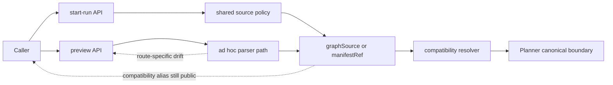
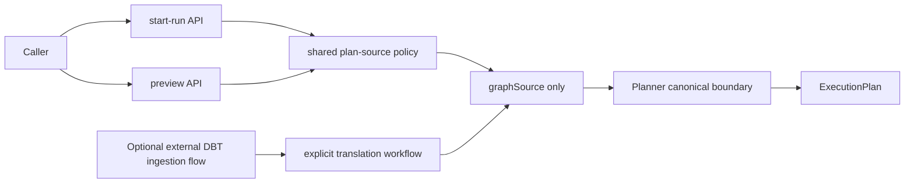

# Planner hard-cut boundary remediation 2026-04-10

## Summary

This proposal replaces the compatibility-first posture for planner ingress.

The repository already learned the architectural lesson:

- `GenericGraphSourceV1` is the canonical planner ingress
- source-specific ingestion does not belong in the shared planner kernel
- runtime helpers should consume narrow normalized facts, not source-specific
  config width

What remains is a dangerous transitional half-state:

- the planner contract is generic
- the API still exposes DBT-native compatibility inputs
- `start-run` and `preview` do not apply the same admission policy
- the API still accepts and silently repairs values that should fail closed
- one public input (`targetProfile`) is still accepted even though it is not
  part of any live decision path

This proposal sets one explicit direction:

**no retrocompatibility at this boundary.**

If callers must break to restore one healthy canonical system, they break.

The hard-cut runtime slice is now implemented in `apps/api`; see
[MW-A6 closeout](../../closeouts/20260410-mw-a6-planner-hard-cut-boundary-remediation-closeout.md).

## Governing Sources

- [ADR-0018](../../../adr/ADR-0018_Shared_Kernel_Ownership_Governance.md)
- [ADR-0034](../../../adr/ADR-0034-bounded-context-boundaries-and-communication-rules.md)
- [ADR-0035](../../../adr/ADR-0035-planner-public-contract-evolution-protocol.md)
- [Planner kernel DBT boundary extraction follow-up 2026-04-10](./planner-kernel-dbt-boundary-extraction-follow-up-20260410.md)
- [Planner generic ingress compatibility slice 2026-04-10](./planner-generic-ingress-compatibility-slice-20260410.md)
- [Temporal workflow helper artifact facts narrowing slice 2026-04-10](./temporal-workflow-helper-artifact-facts-narrowing-slice-20260410.md)
- [workflowHelpers.ts Architecture Review](../../reviews/execution-runtime/20260315-workflow-helpers-architecture-review.md)

## Problem Summary

The repository is not suffering from one isolated bug.
It is suffering from boundary drift across four layers:

1. shared planner contracts say `graphSource` is canonical
2. API compatibility still exposes `manifestRef`
3. `start-run` and `preview` do not share one source-admission policy
4. one compatibility input (`targetProfile`) is admitted but not consumed

This creates a split architecture:

- one canonical story on paper
- one compatibility story in the API
- one partial-fail-closed story in `start-run`
- one weaker, repair-oriented story in preview parsing

That is not a stable system. It is a prolonged migration state.

## Root Cause

The repository tried to preserve caller compatibility while cleaning the
planner/kernel boundary.

That decision left a transitional anti-corruption layer in the live runtime API
without fully constraining it.

The result is predictable:

- alias inputs remain longer than the architecture allows
- admission policy diverges across routes
- dead or decorative compatibility fields survive
- local normalization starts repairing invalid input instead of rejecting it

## Architectural Decision

### 1. Single canonical ingress

Protected runtime planner-backed flows admit only one planner source:

- `graphSource`

`manifestRef` is not a second-class alias.
It is removed from the runtime API surface.

### 2. No compatibility inside `run:start` or preview

If DBT-native manifest ingestion is still needed as a product capability, it
must live as one explicit, separate source-plugin or translation workflow.

It must not remain as hidden compatibility inside the same start-run and preview
boundaries.

### 3. One admission policy for all planner-backed routes

`start-run` and `preview` must share one policy for plan-source admission,
including:

- exactly one active planner source
- no legacy source fields
- no mixed-source acceptance
- fail-closed responses for caller mistakes

### 4. No accepted-but-ignored inputs

`targetProfile` cannot remain in the public API unless it participates in one
real boundary decision.

If it is not part of an active decision path, delete it.

### 5. No silent repair at HTTP boundaries

HTTP parsers do not trim, normalize, or repair source values into validity.

They either:

- accept canonical input as supplied, or
- reject it with an explicit caller error

## Current System Shape

## Target System Shape

## Boundary Rules

Use these rules together:

1. If the planner is generic, its live admission boundary must also be generic.
2. If a field is source-specific and not cross-source stable, it does not stay
   in the runtime API once the canonical ingress exists.
3. If a caller error is detectable at the HTTP boundary, return caller error;
   do not let it degrade into `500`.
4. If an input is accepted publicly, it must participate in a real decision.

## Options Considered

### Option A: Keep compatibility and tighten it incrementally

Pros:

- smaller immediate caller breakage

Cons:

- preserves the split architecture
- invites more drift between routes
- keeps decorative compatibility fields alive
- extends a transition that has already overstayed its design budget

### Option B: Hard-cut to one canonical ingress and remove the API compatibility path

Pros:

- one clean system story
- one admission policy
- no dead compatibility fields
- no need to preserve fake flexibility
- architectural ownership becomes explicit again

Cons:

- callers using `manifestRef` break immediately
- documentation, tests, and evidence must be updated together

### Option C: Move compatibility to a separate explicit product surface later

Pros:

- keeps the planner/runtime API healthy now
- still allows future DBT-native ingestion if product really needs it

Cons:

- requires a follow-up design if that product capability remains necessary

## Selected Direction

Select **Option B now**, with **Option C only if a separate product need
survives later**.

In other words:

- remove compatibility from `run:start` and `preview`
- keep only canonical `graphSource`
- if manifest-native ingestion is still needed, redesign it as a separate
  explicit boundary later

## Consequences

- `IPlannerCompatibilityResolver` leaves the runtime module path.
- `ManifestArtifactResolver` leaves the protected runtime planner-backed flow.
- `manifestRef` and `targetProfile` leave the public `StartRunCommand` shape.
- `preview` reuses the same plan-source policy as `start-run`.
- `trim`-based repair helpers stop deciding planner-source validity.
- existing callers using `manifestRef` will fail and must migrate to canonical
  `graphSource`.

## Hard-Cut Slice Sequence

### Slice 1: Admission-policy unification

- make `preview` and `start-run` share the same planner-source policy
- convert mixed/none/legacy source errors into caller errors, not `500`
- remove trim-repair from planner source parsing

### Slice 2: Remove runtime API compatibility ingress

- delete `manifestRef` and `targetProfile` from runtime planner-backed API
- delete `IPlannerCompatibilityResolver` from the protected runtime module path
- remove `ManifestArtifactResolver` from runtime start-run/preview wiring

### Slice 3: Contract, test, and doc closure

- remove compatibility fixtures and tests that preserve `manifestRef`
- update evidence and risk posture to state hard-cut admission
- keep runtime helper narrowing and helper decomposition as separate follow-up

## Pre-Implementation Brief

- mode: `Full`
- scope:
  hard-cut runtime planner-backed ingress to canonical `graphSource`, unify
  source admission policy across routes, and remove dead compatibility inputs
- touched paths:
  `apps/api/src/**`,
  `packages/@dvt/contracts/src/contracts/planner/**` only if any public API type
  references remain cross-linked,
  focused tests under `apps/api/test/**`,
  planning docs and lane state under `docs/planning/**`
- expected outcome:
  one healthy planner-backed runtime API boundary with no hidden compatibility
  alias and no route-level admission drift
- risks and mitigations:
  caller breakage is intentional; mitigate by making the hard cut explicit in
  docs, route errors, evidence, and migration notes rather than preserving dual
  semantics
- out of scope:
  separate future product design for explicit DBT-native ingestion,
  full `workflowHelpers.ts` decomposition,
  planner-core algorithm changes unrelated to ingress ownership
- validation plan:
  `pnpm --filter dvt-api typecheck`,
  `pnpm --filter dvt-api test`,
  `pnpm docs:sync`,
  `pnpm docs:workboard:generate`,
  `pnpm verify:prepush`
- test coverage plan:
  add negative-path tests for mixed/none/legacy source rejection in both routes,
  prove `manifestRef` is rejected at runtime API boundaries,
  prove `targetProfile` no longer appears in public planner-backed command paths
- libraries evaluated:
  `None evaluated - boundary hard cut and route-policy unification`

## Exit Criteria

This remediation is ready to execute when it yields:

1. one active hard-cut slice registered in Lane A
2. one explicit statement that compatibility-first ingress is no longer the
   execution direction
3. one validation matrix covering API, docs, and generated planning surfaces
4. one clean architectural story: planner-backed runtime API admits only
   canonical `graphSource`
