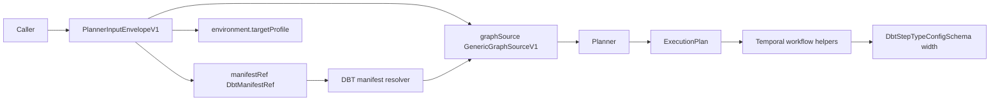
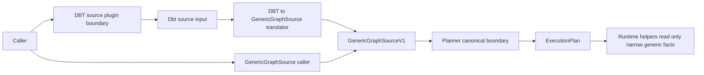

# Planner kernel DBT boundary extraction follow-up 2026-04-10

## Summary

This proposal prepares a focused follow-up slice to remove the remaining
DBT-specific planner ingress concepts from the shared planner kernel boundary.

The repository already closed the primary GenericGraphSource migration path:

- `GenericGraphSourceV1` is the canonical planner ingress
- dbt manifest handling is documented as an adapter-to-generic translation path
- Temporal execution is progressively moving away from dbt-shaped default
  semantics

But one important category of DBT leakage still remains in the public planner
contract and adjacent helper seams:

- `DbtManifestRef` remains a public planner input shape in the shared contract
- `PlannerEnvironmentContext.targetProfile` still behaves like a dbt-specific
  input knob
- helper code still reads dbt-specific config semantics wider than needed

That means the canonical planner boundary is generic on paper, but not yet
fully generic in the shared kernel.

## Governing Sources

- [ADR-0034](../../../adr/ADR-0034-bounded-context-boundaries-and-communication-rules.md)
- [ADR-0018](../../../adr/ADR-0018_Shared_Kernel_Ownership_Governance.md)
- [MW-A2 GenericGraphSource plan](./mw-a2-generic-graph-source-plan-20260404.md)
- [DVT DBT-agnostic generalization plan](./dvt-dbt-agnostic-generalization-plan-20260403.md)
- [Workflow helpers architecture review](../../reviews/execution-runtime/20260315-workflow-helpers-architecture-review.md)
- [ExecutionPlan.v1.ts](../../../../packages/@dvt/contracts/src/contracts/planner/ExecutionPlan.v1.ts)

## Problem Summary

The current planner boundary mixes two different concerns:

1. canonical generic graph ingestion
2. one specific source adapter's convenience input

That mix shows up in the shared contract today:

- `DbtManifestRef` is a named source-specific contract type
- `PlannerInputEnvelopeV1.manifestRef` is still DBT-specific by type, not just
  by implementation
- `PlannerEnvironmentContext.targetProfile` carries a dbt-shaped meaning while
  presenting as generic environment context

At the same time, runtime helper code still shows the consequence of that drift:

- Temporal workflow helpers know about dbt-specific config schema width even
  when they only need `compiledCodeRef`

## Root Cause

The repository completed the first generalization move at the graph-source
level, but did not finish the ownership cleanup at the planner ingress and
helper-consumption seams.

The result is a split posture:

- the planner says `GenericGraphSource` is canonical
- the shared kernel still exports DBT-specific ingress concepts
- runtime helpers still retain a small but real dependency on dbt-specific
  config interpretation

So the drift is no longer "dbt is the only source".
It is now narrower and more structural:

DBT remains partially privileged inside the shared kernel contract instead of
living entirely behind a source-adapter or plugin boundary.

## Constraints And Invariants

- Shared kernel must contain only true cross-domain serializable surfaces per
  ADR-0018 and ADR-0034.
- Plugin or adapter-specific source ingestion belongs outside the kernel.
- `GenericGraphSourceV1` remains the canonical planner input boundary.
- Existing `PlanRef`, `CompiledCodeRef`, and generic step graph contracts stay
  shared because they are stable, serializable, and cross-context.
- This slice must not regress current planner determinism or graph-source
  validation behavior.
- The migration should preserve a bounded compatibility path long enough to
  avoid a flag day across API and planner composition roots.

## Current State

## Target State

## Field-Level Ownership Decision

| Concern                           | Recommended owner                                    | Rationale                                                     |
| --------------------------------- | ---------------------------------------------------- | ------------------------------------------------------------- |
| `GenericGraphSourceV1`            | shared kernel                                        | canonical cross-source graph boundary                         |
| `DbtManifestRef` input            | dbt source adapter or plugin boundary                | source-specific ingress concern, not planner kernel truth     |
| `dbtProfile` / dbt target profile | dbt source adapter or plugin boundary                | tool-specific selection/config input                          |
| `CompiledCodeRef`                 | shared kernel                                        | stable cross-context artifact ref                             |
| dbt step config width             | dbt source normalization or dedicated fact extractor | runtime helpers should not parse wider dbt config than needed |

## Options Considered

### Option A: Keep DBT ingress types in the shared kernel

- leave `DbtManifestRef` and `targetProfile` in planner public contracts
- only narrow helper-level runtime parsing

Pros:

- smallest immediate migration
- lower compatibility churn

Cons:

- keeps DBT privileged in the canonical planner contract
- leaves kernel ownership inconsistent with ADR-0034
- preserves semantic ambiguity around what is really generic

### Option B: Complete the boundary extraction

- keep `graphSource` as the only canonical planner ingress
- move dbt-specific source input to an adapter or plugin boundary
- translate DBT inputs to `GenericGraphSourceV1` before planner admission
- narrow runtime helper parsing to `CompiledCodeRef` only

Pros:

- aligns with MW-A2 target posture
- finishes the remaining shared-kernel cleanup cleanly
- makes DBT support explicit as one adapter path instead of a privileged
  planner input shape
- matches the workflow helper review's direction

Cons:

- needs a compatibility and migration sequence
- touches API/planner composition seams and docs together

### Option C: Dual-surface compromise

- keep `graphSource` canonical but continue exposing `manifestRef` in the same
  shared contract as a convenience alias

Pros:

- easier migration for existing callers

Cons:

- weakens the canonical-boundary claim
- keeps source-specific semantics in kernel DTOs
- likely becomes permanent drift rather than temporary compatibility

## Selected Direction

Select **Option B**.

The repository already paid most of the conceptual migration cost in `MW-A2`.
Leaving DBT-specific ingress fields in the planner kernel now would stop the
migration one step short of the actual ownership boundary.

The correct end state is:

- planner kernel accepts canonical generic graph input
- DBT plugin or adapter accepts DBT-native input
- plugin or adapter performs DBT -> `GenericGraphSourceV1` translation
- runtime helpers consume only the narrow facts they need

## Rejected Alternatives

- Reopening `MW-A2` itself. The generic graph-source migration is already done;
  this is a follow-up ownership cleanup slice.
- Removing DBT support. The goal is boundary correction, not feature removal.
- Hiding DBT-specific fields behind neutral names inside the same shared
  contract. Renaming without moving ownership would only mask the drift.

## Pre-Implementation Brief

- mode: `Full`
- scope:
  define the target contract split and migration sequence that removes
  DBT-specific planner ingress concepts from the shared kernel while keeping
  GenericGraphSource as the only canonical planner input
- touched planning paths:
  this proposal,
  `docs/planning/state/agent-lane-a.yaml`,
  `docs/planning/proposals/portfolio-map-20260403.md`,
  generated planning views and indexes
- expected outcome:
  one approved plan slice can later move `DbtManifestRef` and dbt profile input
  out of the planner kernel and narrow runtime helper parsing to only the facts
  it needs
- risks and mitigations:
  compatibility churn for API/planner callers; mitigate with a staged adapter
  boundary and explicit deprecation path instead of a flag day
- out of scope:
  immediate runtime implementation, plugin packaging details, and full dbt
  executor product work
- validation plan:
  `pnpm docs:sync`, `pnpm docs:workboard:generate`, `pnpm verify:prepush`
- test coverage plan:
  planning-only slice; implementation follow-up must add contract rejection
  tests for dbt-only ingress at the generic planner boundary and helper tests
  proving narrow `CompiledCodeRef` extraction without full dbt config parsing
- libraries evaluated:
  `None evaluated � planning slice only`

## Proposed Implementation Sequence

1. Add a planner-boundary proposal or ADR-backed contract slice that defines
   the canonical removal target for `DbtManifestRef` and dbt profile inputs.
2. Introduce a DBT source adapter or plugin input contract outside the shared
   planner kernel.
3. Move DBT-native translation to `GenericGraphSourceV1` into that adapter
   boundary.
4. Deprecate and then remove DBT-specific ingress fields from the canonical
   planner envelope.
5. Narrow Temporal helper extraction to `CompiledCodeRef` only and stop parsing
   full DBT step config width there.
6. Lock the result with contract, planner, API, and runtime negative-path
   coverage.

## Exit Criteria

This planning slice is ready to hand off when it yields:

1. one explicit ownership statement that `graphSource` is canonical and
   DBT-native ingress is adapter-owned
2. one migration sequence for removing `DbtManifestRef` and dbt-profile input
   from the shared kernel
3. one linked Lane A task for implementation ownership
4. one validation matrix for the later implementation slice
