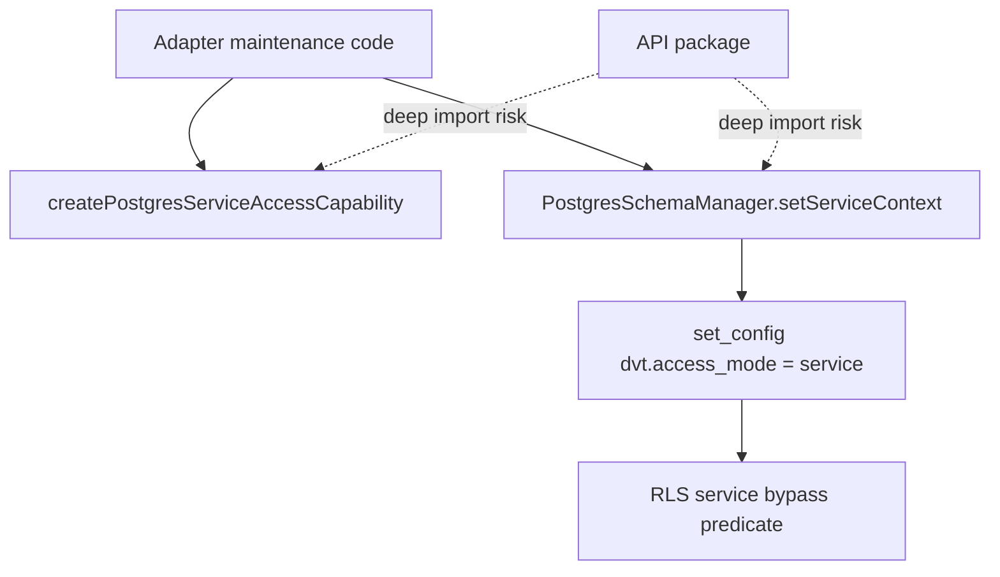
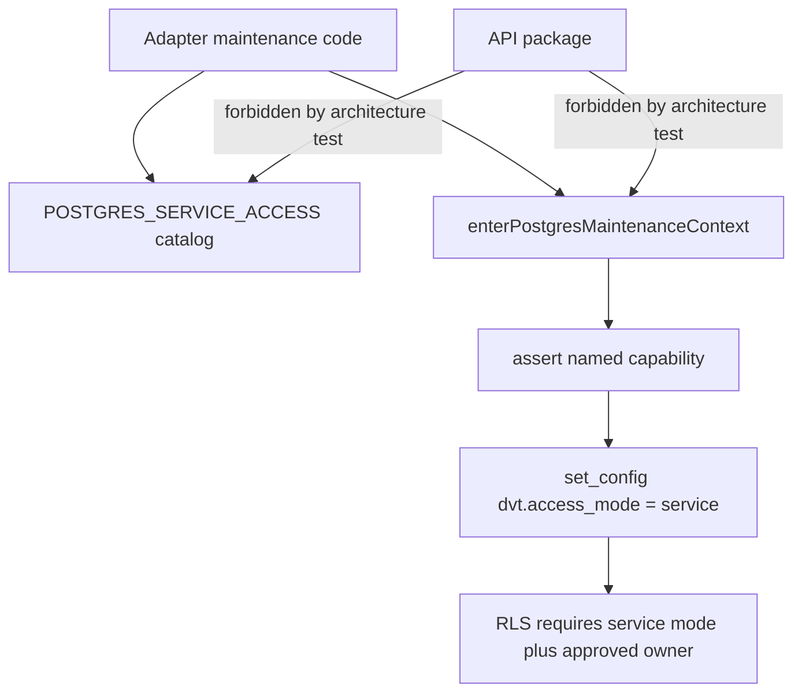

# Postgres Tenant Isolation Service Access Remediation Plan

## Governing Sources

- `AGENTS.md`
- `docs/guides/ai-work-protocol.md`
- `docs/architecture/reference-architecture.md`
- `docs/contracts/index.md`
- `docs/planning/status/governance-document-rule-inventory.md`
- `docs/evidence/ed-20260425-production-tenant-isolation-baseline.md`
- `docs/risk-register/quality/R-20260425-PRODUCTION-TENANT-ISOLATION-BASELINE.yaml`

## Problem

The tenant isolation slice improved the API-level and adapter-level posture, but
the `service` access mode is still too easy to treat as ambient authority.
`PostgresSchemaManager.setServiceContext(...)` exposes service mode as a static
schema-manager operation, and the capability factory is generic enough that
adapter code can mint new owners instead of using a constrained maintenance
catalog.

This is not a mature security boundary. It is a useful TypeScript seam, but the
stronger design is to make maintenance access explicit, named, narrow, and
architecturally unreachable from API entrypoints.

## Current Shape



## Target Shape



## Selected Remediation

1. Remove the generic exported service capability factory.
2. Replace it with a closed `POSTGRES_SERVICE_ACCESS` maintenance catalog.
3. Move service-context activation out of `PostgresSchemaManager` into a
   dedicated maintenance access module.
4. Add architecture tests that forbid API imports of service access internals.
5. Update RLS policy SQL to require both service mode and an approved
   `dvt.service_access_owner`.
6. Preserve the residual risk explicitly: owner predicates still do not replace
   database role separation.

## Acceptance Criteria

- `PostgresServiceAccessCapability.ts` does not export a generic factory.
- `PostgresSchemaManager` no longer owns service-context activation.
- Production service access calls go through `enterPostgresMaintenanceContext`.
- API source files cannot import service access internals or call service
  context helpers.
- RLS policy text requires an approved `dvt.service_access_owner` when service
  mode is used.
- `IStartRunIntentStore` remains engine-owned, with no duplicate contract files
  under `@dvt/contracts`.

## Feature Mechanization Manifest

```feature-mechanization
version: 1
featureId: AR-C-TENANT-ISOLATION-PROPERTY
mechanizationStatus: implemented
noHumanDecisionsRemaining: true
implementationPlan: docs/planning/proposals/mandatory/runtime-and-contracts/postgres-tenant-isolation-service-access-remediation-plan-20260425.md
componentGuides:
  - docs/planning/closeouts/20260425-production-tenant-isolation-baseline-closeout.md
  - docs/adr/ADR-0031-adapter-tenant-isolation.md
userStories:
  - docs/planning/reviews/architecture-and-governance/20260426-api-tenant-review.md
governingSources:
  - AGENTS.md
  - docs/planning/status/governance-document-rule-inventory.md
  - docs/guides/ai-work-protocol.md
  - docs/architecture/command-query-rail-governance.md
  - docs/architecture/fowler-opportunity-planning-governance.md
  - docs/adr/ADR-0031-adapter-tenant-isolation.md
  - docs/planning/proposals/mandatory/runtime-and-contracts/postgres-tenant-isolation-service-access-remediation-plan-20260425.md
allowedImplementationSurfaces:
  - docs/planning/proposals/mandatory/runtime-and-contracts/postgres-tenant-isolation-service-access-remediation-plan-20260425.md
  - docs/evidence/ed-20260511-tenant-mode-rls-property.md
  - docs/evidence/index.md
  - docs/risk-register/quality/R-20260511-TENANT-MODE-RLS-PROPERTY.yaml
  - docs/risk-register/quality/index.md
  - packages/@dvt/adapter-postgres/src/PostgresTenantIsolationPolicy.ts
  - packages/@dvt/adapter-postgres/test/PostgresTenantIsolationPolicy.test.ts
  - packages/@dvt/adapter-postgres/test/PostgresTenantRlsEnforcement.integration.test.ts
forbiddenImplementationSurfaces:
  - apps/api/**
  - apps/web/**
  - packages/@dvt/contracts/**
  - packages/@dvt/engine/**
  - packages/@dvt/planner/**
  - packages/@dvt/adapter-temporal/**
commandQueryRails:
  - name: ValidatePostgresTenantIsolationPolicy
    type: query
    dddOwner: PostgresTenantIsolationPolicy
domainObjects:
  - name: PostgresTenantIsolationPolicy
    type: adapter SQL policy
    owner: packages/@dvt/adapter-postgres/src/PostgresTenantIsolationPolicy.ts
  - name: PostgresRlsRuntimeProof
    type: integration evidence
    owner: packages/@dvt/adapter-postgres/test/PostgresTenantRlsEnforcement.integration.test.ts
fowlerSignals:
  - Partial tenant context no longer acts as authorization.
  - Catalog-wide RLS proof prevents one-table confidence bias.
  - Service access remains explicit and table-scoped.
architectureGuards:
  - pnpm --filter @dvt/adapter-postgres test -- PostgresServiceAccessCapability.architecture.test.ts PostgresTenantIsolationPolicy.test.ts
  - pnpm docs:feature-mechanization:implementation
cypressFlows:
  - N/A - backend adapter RLS policy
completionGate:
  - pnpm --filter @dvt/adapter-postgres test -- PostgresTenantIsolationPolicy.test.ts
  - pnpm --filter @dvt/adapter-postgres test -- PostgresServiceAccessCapability.architecture.test.ts PostgresTenantIsolationPolicy.test.ts PostgresStateStoreAdapter.migrate.test.ts StartRunIntentSchemaManager.test.ts
  - DVT_PG_INTEGRATION=1 pnpm --filter @dvt/adapter-postgres test -- PostgresTenantIsolationPolicy.test.ts PostgresTenantRlsEnforcement.integration.test.ts
  - pnpm --filter @dvt/adapter-postgres typecheck
  - GIT_BASE=origin/main GIT_HEAD=HEAD node tools/ci/arc-check.mjs
  - pnpm docs:sync
  - pnpm docs:feature-mechanization:implementation
  - pnpm verify:prepush
redGreenCycles:
  - id: tenant-mode-rls-predicate
    redTest: pnpm --filter @dvt/adapter-postgres test -- PostgresTenantIsolationPolicy.test.ts
    expectedFailure: RLS policy SQL allows tenant_id matching without dvt.access_mode = tenant.
    patchSurfaces:
      - packages/@dvt/adapter-postgres/src/PostgresTenantIsolationPolicy.ts
      - packages/@dvt/adapter-postgres/test/PostgresTenantIsolationPolicy.test.ts
    greenTest: pnpm --filter @dvt/adapter-postgres test -- PostgresTenantIsolationPolicy.test.ts
  - id: tenant-owned-table-property-proof
    redTest: DVT_PG_INTEGRATION=1 pnpm --filter @dvt/adapter-postgres test -- PostgresTenantRlsEnforcement.integration.test.ts
    expectedFailure: RLS runtime proof does not seed and query every cataloged tenant-owned table.
    patchSurfaces:
      - packages/@dvt/adapter-postgres/test/PostgresTenantRlsEnforcement.integration.test.ts
    greenTest: DVT_PG_INTEGRATION=1 pnpm --filter @dvt/adapter-postgres test -- PostgresTenantRlsEnforcement.integration.test.ts
symbols:
  - name: seedTenantIsolationProbeRows
    path: packages/@dvt/adapter-postgres/test/PostgresTenantRlsEnforcement.integration.test.ts
    dddOwner: PostgresRlsRuntimeProof
    cqRails:
      - ValidatePostgresTenantIsolationPolicy
    fowlerSignals:
      - Catalog-wide RLS proof fixture.
    architectureGuard: pnpm docs:feature-mechanization:implementation
    cypressCoverage: N/A - backend adapter integration proof
    unitTests:
      - pnpm --filter @dvt/adapter-postgres test -- PostgresTenantRlsEnforcement.integration.test.ts
  - name: selectDistinctTenantIds
    path: packages/@dvt/adapter-postgres/test/PostgresTenantRlsEnforcement.integration.test.ts
    dddOwner: PostgresRlsRuntimeProof
    cqRails:
      - ValidatePostgresTenantIsolationPolicy
    fowlerSignals:
      - Read-model probe avoids table-specific confidence bias.
    architectureGuard: pnpm docs:feature-mechanization:implementation
    cypressCoverage: N/A - backend adapter integration proof
    unitTests:
      - pnpm --filter @dvt/adapter-postgres test -- PostgresTenantRlsEnforcement.integration.test.ts
  - name: insertTenantIsolationProbeRow
    path: packages/@dvt/adapter-postgres/test/PostgresTenantRlsEnforcement.integration.test.ts
    dddOwner: PostgresRlsRuntimeProof
    cqRails:
      - ValidatePostgresTenantIsolationPolicy
    fowlerSignals:
      - Table-specific fixtures are centralized in the RLS proof.
    architectureGuard: pnpm docs:feature-mechanization:implementation
    cypressCoverage: N/A - backend adapter integration proof
    unitTests:
      - pnpm --filter @dvt/adapter-postgres test -- PostgresTenantRlsEnforcement.integration.test.ts
```

## Validation Plan

```bash
pnpm --filter @dvt/adapter-postgres test -- PostgresServiceAccessCapability.architecture.test.ts PostgresTenantIsolationPolicy.test.ts PostgresTenantRlsEnforcement.integration.test.ts
pnpm --filter @dvt/contracts test -- start-run-intent-ownership.architecture.test.ts
pnpm --filter @dvt/adapter-postgres typecheck
pnpm --filter @dvt/contracts typecheck
pnpm docs:sync
pnpm docs:status:generate
pnpm docs:gov:manifest:check
pnpm verify:prepush
```

## Residual Risk

The catalog and RLS owner predicate reduce accidental privilege drift, but they
do not create a cryptographic or database-role security boundary. A production
hardening follow-up should separate tenant and maintenance database roles so
service-mode access cannot be forged by arbitrary SQL running under the tenant
application role.
