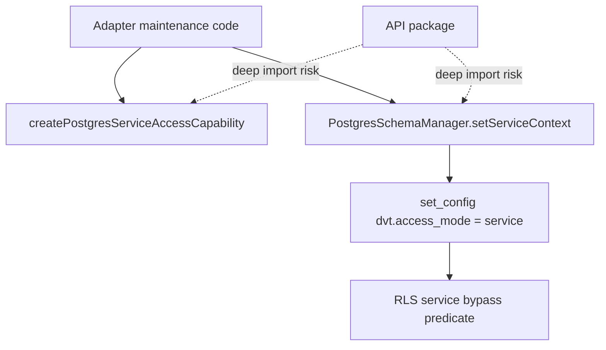
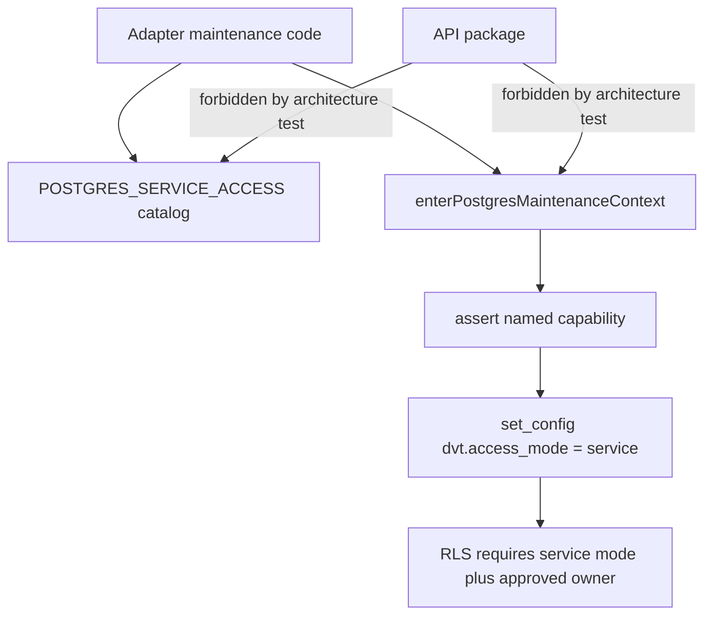

# Postgres Tenant Isolation Service Access Remediation Plan

## Governing Sources

- `AGENTS.md`
- `docs/guides/ai-work-protocol.md`
- `docs/architecture/reference-architecture.md`
- `docs/contracts/index.md`
- `docs/planning/status/governance-document-rule-inventory.md`
- `docs/evidence/ed-20260425-production-tenant-isolation-baseline.md`
- `docs/risk-register/quality/R-20260425-PRODUCTION-TENANT-ISOLATION-BASELINE.yaml`

## Problem

The tenant isolation slice improved the API-level and adapter-level posture, but
the `service` access mode is still too easy to treat as ambient authority.
`PostgresSchemaManager.setServiceContext(...)` exposes service mode as a static
schema-manager operation, and the capability factory is generic enough that
adapter code can mint new owners instead of using a constrained maintenance
catalog.

This is not a mature security boundary. It is a useful TypeScript seam, but the
stronger design is to make maintenance access explicit, named, narrow, and
architecturally unreachable from API entrypoints.

## Current Shape



## Target Shape



## Selected Remediation

1. Remove the generic exported service capability factory.
2. Replace it with a closed `POSTGRES_SERVICE_ACCESS` maintenance catalog.
3. Move service-context activation out of `PostgresSchemaManager` into a
   dedicated maintenance access module.
4. Add architecture tests that forbid API imports of service access internals.
5. Update RLS policy SQL to require both service mode and an approved
   `dvt.service_access_owner`.
6. Preserve the residual risk explicitly: owner predicates still do not replace
   database role separation.

## Acceptance Criteria

- `PostgresServiceAccessCapability.ts` does not export a generic factory.
- `PostgresSchemaManager` no longer owns service-context activation.
- Production service access calls go through `enterPostgresMaintenanceContext`.
- API source files cannot import service access internals or call service
  context helpers.
- RLS policy text requires an approved `dvt.service_access_owner` when service
  mode is used.
- `IStartRunIntentStore` remains engine-owned, with no duplicate contract files
  under `@dvt/contracts`.

## Validation Plan

```bash
pnpm --filter @dvt/adapter-postgres test -- PostgresServiceAccessCapability.architecture.test.ts PostgresTenantIsolationPolicy.test.ts PostgresTenantRlsEnforcement.integration.test.ts
pnpm --filter @dvt/contracts test -- start-run-intent-ownership.architecture.test.ts
pnpm --filter @dvt/adapter-postgres typecheck
pnpm --filter @dvt/contracts typecheck
pnpm docs:sync
pnpm docs:status:generate
pnpm docs:gov:manifest:check
pnpm verify:prepush
```

## Residual Risk

The catalog and RLS owner predicate reduce accidental privilege drift, but they
do not create a cryptographic or database-role security boundary. A production
hardening follow-up should separate tenant and maintenance database roles so
service-mode access cannot be forged by arbitrary SQL running under the tenant
application role.
