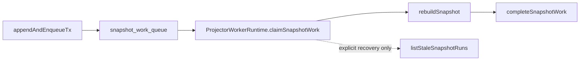

# Projector Event-Driven Invalidation Plan

## Owned Concern

`D/projector event-driven invalidation` closes the remaining runtime behavior
gap after `S19-F1` delivered `snapshot_work_queue`.

The repository already has the queue and the append-time producer. This slice
changes the projector runtime posture so queue-capable stores do not also run
stale snapshot polling as a default discovery path.

## Governing Sources

- `AGENTS.md`
- `docs/planning/status/governance-document-rule-inventory.md`
- `docs/guides/ai-work-protocol.md`
- `docs/architecture/command-query-rail-governance.md`
- `docs/architecture/fowler-opportunity-planning-governance.md`
- `docs/adr/ADR-0004-event-sourcing-strategy.md`
- `docs/adr/ADR-0010-run-event-envelope-split.md`
- `docs/evidence/critical/ED-20260330-s19f1-phase1-phase2-snapshot-work-queue.md`
- `docs/planning/roadmap/strategic-product-roadmap.md`

## Think-First Analysis

The original risk was that `ProjectorWorkerRuntime` had to discover stale
snapshots by polling `listStaleSnapshotRuns()`. S19-F1 already delivered the
event-driven queue surface, but the delivery runtime still filled spare batch
capacity with stale polling by default.

That keeps the scale risk alive because every normal tick can still hit the
stale discovery query even when append-time queue invalidation exists.

The correct slice is not a new adapter or contract. It is a delivery-runtime
policy change:

- queue claiming is the default discovery rail;
- stale polling remains available only as explicit recovery compatibility;
- tests prove both default and opt-in behavior.

## Command And Query Rail

`ProjectorWorkerRuntime.runOnce` is a delivery operational command.

- owning bounded context: Delivery
- DDD object: snapshot projection work item
- application port: `ProjectorStateStore.claimSnapshotWork`
- adapter surface: `snapshot_work_queue`
- scope and authorization: tenant/run scoped worker service access
- negative tests: queue-capable stores must not poll by default; explicit
  fallback polling must still work when configured

## Solution Rationale



The opt-in flag is intentionally named `enableFallbackPolling` so call sites
must choose the old discovery behavior deliberately. Stores that do not expose
`claimSnapshotWork` keep their existing compatibility path through
`listStaleSnapshotRuns()`.

## Feature Mechanization Manifest

```feature-mechanization
version: 1
featureId: D-PROJECTOR-EVENT-DRIVEN-INVALIDATION-20260524
mechanizationStatus: implemented
noHumanDecisionsRemaining: true
implementationPlan: docs/planning/proposals/mandatory/runtime-and-contracts/projector-event-driven-invalidation-plan-20260524.md
componentGuides:
  - docs/architecture/components/delivery/projector-event-driven-invalidation-component.md
userStories:
  - docs/architecture/components/delivery/projector-event-driven-invalidation-user-stories.md
governingSources:
  - AGENTS.md
  - docs/planning/status/governance-document-rule-inventory.md
  - docs/guides/ai-work-protocol.md
  - docs/architecture/command-query-rail-governance.md
  - docs/architecture/fowler-opportunity-planning-governance.md
  - docs/adr/ADR-0004-event-sourcing-strategy.md
  - docs/adr/ADR-0010-run-event-envelope-split.md
  - docs/evidence/critical/ED-20260330-s19f1-phase1-phase2-snapshot-work-queue.md
allowedImplementationSurfaces:
  - docs/planning/proposals/mandatory/runtime-and-contracts/projector-event-driven-invalidation-plan-20260524.md
  - docs/architecture/components/delivery/projector-event-driven-invalidation-component.md
  - docs/architecture/components/delivery/projector-event-driven-invalidation-user-stories.md
  - docs/architecture/components/delivery/index.md
  - packages/@dvt/delivery/src/application/ProjectorWorkerRuntime.ts
  - packages/@dvt/delivery/test/ProjectorWorkerRuntime.test.ts
forbiddenImplementationSurfaces:
  - apps/web/**
  - apps/api/**
  - packages/@dvt/contracts/**
  - packages/@dvt/engine/**
  - packages/@dvt/adapter-*/**
commandQueryRails:
  - name: ProjectorWorkerRuntime.runOnce
    type: command
    dddOwner: Snapshot projection work item
domainObjects:
  - name: SnapshotProjectionWorkItem
    type: work item
    owner: Delivery
fowlerSignals:
  - Polling as default discovery
  - Queue path exists but runtime keeps scan fallback hot
architectureGuards:
  - pnpm docs:feature-mechanization:implementation -- --feature D-PROJECTOR-EVENT-DRIVEN-INVALIDATION-20260524
cypressFlows:
  - N/A - worker runtime policy only
completionGate:
  - pnpm docs:feature-mechanization -- --feature D-PROJECTOR-EVENT-DRIVEN-INVALIDATION-20260524
  - pnpm --filter @dvt/delivery test -- ProjectorWorkerRuntime.test.ts
  - pnpm --filter @dvt/delivery typecheck
  - pnpm docs:sync
  - pnpm docs:feature-mechanization:implementation
  - pnpm verify:prepush
redGreenCycles:
  - id: queue-default-no-polling
    redTest: pnpm --filter @dvt/delivery test -- ProjectorWorkerRuntime.test.ts
    expectedFailure: Queue-capable runtime still calls listStaleSnapshotRuns by default.
    patchSurfaces:
      - packages/@dvt/delivery/src/application/ProjectorWorkerRuntime.ts
      - packages/@dvt/delivery/test/ProjectorWorkerRuntime.test.ts
    greenTest: pnpm --filter @dvt/delivery test -- ProjectorWorkerRuntime.test.ts
symbols:
  - name: ProjectorWorkerRuntimeOptions.enableFallbackPolling
    path: packages/@dvt/delivery/src/application/ProjectorWorkerRuntime.ts
    dddOwner: Snapshot projection work item
    cqRails: [ProjectorWorkerRuntime.runOnce]
    fowlerSignals: [Polling fallback made explicit]
    architectureGuard: pnpm docs:feature-mechanization:implementation
    unitTests: [pnpm --filter @dvt/delivery test -- ProjectorWorkerRuntime.test.ts]
    cypressCoverage: N/A - worker runtime policy only
  - name: ProjectorWorkerRuntime.shouldRunFallbackPoll
    path: packages/@dvt/delivery/src/application/ProjectorWorkerRuntime.ts
    dddOwner: Snapshot projection work item
    cqRails: [ProjectorWorkerRuntime.runOnce]
    fowlerSignals: [Queue path owns normal discovery]
    architectureGuard: pnpm docs:feature-mechanization:implementation
    unitTests: [pnpm --filter @dvt/delivery test -- ProjectorWorkerRuntime.test.ts]
    cypressCoverage: N/A - worker runtime policy only
  - name: queue capable projector runtime tests
    path: packages/@dvt/delivery/test/ProjectorWorkerRuntime.test.ts
    dddOwner: Snapshot projection work item
    cqRails: [ProjectorWorkerRuntime.runOnce]
    fowlerSignals: [Default polling bottleneck removed]
    architectureGuard: pnpm docs:feature-mechanization:implementation
    unitTests: [pnpm --filter @dvt/delivery test -- ProjectorWorkerRuntime.test.ts]
    cypressCoverage: N/A - worker runtime policy only
```

## Validation Plan

- `pnpm docs:feature-mechanization -- --feature D-PROJECTOR-EVENT-DRIVEN-INVALIDATION-20260524`
- `pnpm --filter @dvt/delivery test -- ProjectorWorkerRuntime.test.ts`
- `pnpm --filter @dvt/delivery typecheck`
- `pnpm docs:sync`
- `pnpm docs:feature-mechanization:implementation`
- `pnpm verify:prepush`

## Planning Disposition

- Action: classify this mandatory proposal through `RUNTIME-PROP-DISP-1`; no standalone implementation starts from this document without Planning DB ownership.
